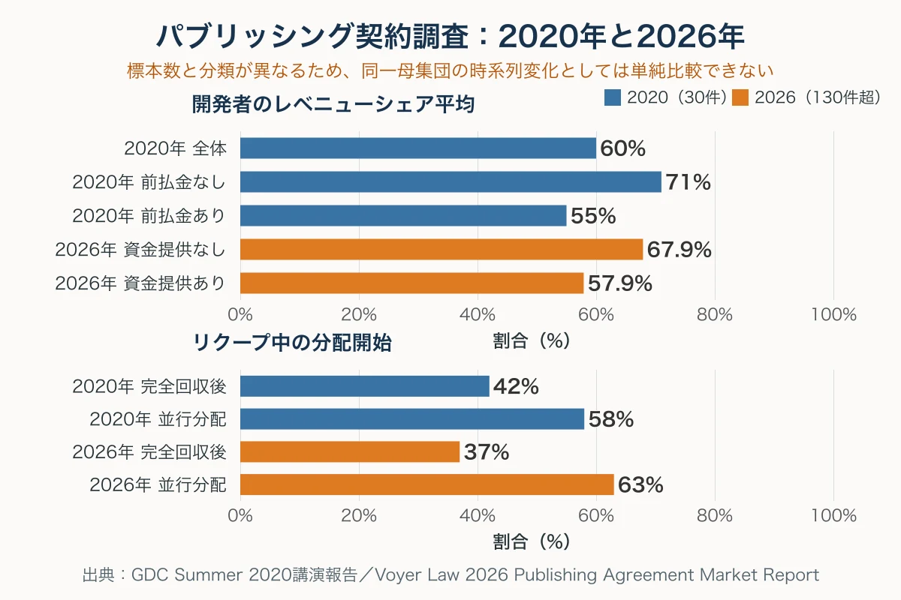
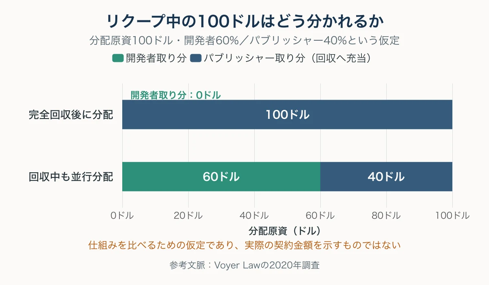
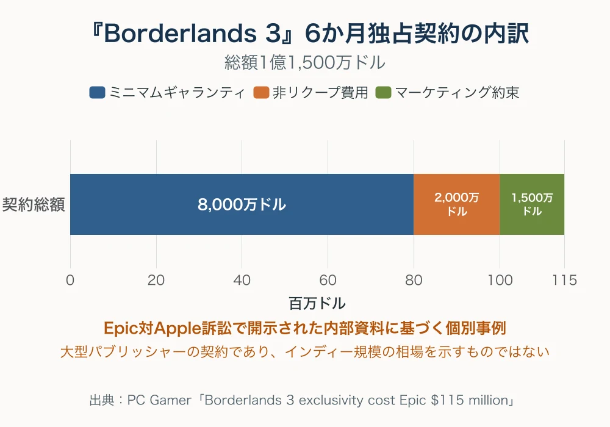
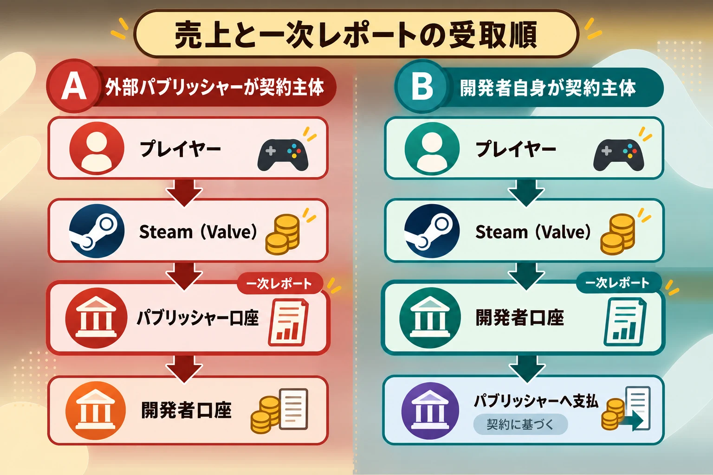

# 小規模インディーのパブリッシング契約――比率より先に読むリクープ・分配原資・IP

## はじめに

「開発者とパブリッシャーで50対50」「前払金あり」という二つの数字だけでは、契約後にいくら入り、どの権利が残るかは分からない。売上から何を差し引いて50対50にするのか、前払金を誰の取り分から回収するのか、販売終了後にストアページを誰が引き継ぐのかによって、同じ比率でも結果は大きく変わる。

インディーゲームのパブリッシング契約は、開発者がパブリッシャーへ完成品を納めて終わる単純な業務委託ではない。開発資金、マーケティング、ローカライズ、家庭用機への移植、プラットフォーム対応、ユーザーサポートなどを受ける代わりに、開発者は収益の一部、一定期間・地域の独占販売権、作品を利用するライセンスなどを渡す。WIPOのゲーム産業向け実務書とCEDEC2025の講演は、役割、費用、権利、期間、終了時の処理を一つの交換関係として設計する必要を示している。[[1](#ref-1)][[2](#ref-2)]

本稿が扱うのは **開発者とパブリッシャーの間** の契約である。[ゲーム開発者から外部クリエイターへ発注する際の下請法・フリーランス新法](game-planner-outsourcing-guide.md)や、[クラウドファンディングで支援者に対して負うガバナンス](steam-pilots-crowdfunding-governance-lessons.md)とは当事者と責任の層が異なるため、各論を繰り返さない。また、契約の有効性や最適な条文は準拠法と個別事情で変わる。本稿は交渉前に数字と質問を整理するための読み方であり、個別案件の法律相談に代わるものではない。

***

## 1. パブリッシャーから受け取るものを、業務単位に分ける

パブリッシャーの役割は「売ってくれる会社」の一語には収まらない。CEDEC2025でパブリッシング契約を解説したシティライツ法律事務所の前野孝太朗弁護士は、プロモーション、プラットフォームへの申請、ストアページ管理、売上の配分、商標出願、ユーザー対応、権利侵害への対応などを挙げ、どちらが担当するかを文書化すべきだと説明した。[[3](#ref-3)]

契約前には、サービス名ではなく成果物と責任者まで分解する。

| 領域 | パブリッシャーから受けうるもの | 契約で確かめること |
| --- | --- | --- |
| 資金 | 開発費、移植費、ローカライズ費、広告費 | 金額、支払日、リクープ対象、未達時の扱い |
| 販売 | ストア契約、価格設定、セール、地域展開 | 対象地域・機種、値引きの承認、販売期間 |
| 開発支援 | QA、移植、認証対応、開発機、技術支援 | 担当範囲、納品物、追加費用、ソースコードの帰属 |
| マーケティング | PV、イベント、広告、メディア対応、SNS | 最低実施内容、予算、素材の制作主体、報告方法 |
| 運用 | 問い合わせ、返金連絡、配信ガイドライン、権利侵害対応 | 対応言語、窓口、判断権、終了後の引継ぎ |

「マーケティングを行う」と書くだけでは、広告費をいくら使うのか、イベントへ何回出るのか、PVを誰が作るのかは決まらない。パブリッシャーが負担する仕事と費用を具体化した後で、その対価として渡すレベニューシェア、独占期間、販売権、IPライセンスが釣り合うかを判断する。

***

## 2. 「50対50が標準」は、30件の実契約データでも崩れる

ゲーム業界専門弁護士Kellen VoyerがGDC Summer 2020で発表した調査は、実在するインディーゲームのパブリッシング契約30件を分析したものである。GDC公式の講演概要は「30件超の近年の契約」と説明し、同時期のGame Developer誌とファミ通.comの報告は、分析対象を30件としている。モバイル、移植、ローカライズ案件は契約構造が異なるため除外され、対象プラットフォームは限定されていない。ファミ通.comの講演レポートでは、30件は基本的に異なるパブリッシャーとの契約であり、契約内容がまったく異なる2ケースのみ同一パブリッシャーが含まれたと報告されている。[[4](#ref-4)][[5](#ref-5)][[6](#ref-6)]

この30件で、開発者のレベニューシェア平均は60%、パブリッシャーは40%だった。前払金なしの契約だけでは開発者平均71%、前払金ありでは55%である。 **50対50はこの標本の平均ではない。** 比率はパブリッシャーが負う開発リスクや業務範囲と連動しており、完成に近い作品へマーケティング中心の支援をする契約と、未完成作品へ開発費を出す契約を同じ比率で比べることもできない。

| 2020年調査の項目 | 30件中の集計結果 |
| --- | --- |
| 前払金の平均 | 前払金なしを含む30件平均31万8,000ドル |
| 前払金ありの金額 | 該当契約の平均46万ドル、最低10万ドル、最高200万ドル |
| 前払金なし | 18% |
| マイルストーン分割払い | 68% |
| 前払金のリクープあり | 81% |
| リクープ完了まで開発者への分配なし | リクープ条件の内訳として42%と報告 |
| リクープ中も双方へ分配 | 同58% |
| レベニューシェア | 開発者平均60%。前払金なし71%、あり55% |
| IPを開発者が保持 | 93% |
| 契約違反時のIP移転条項 | 22% |

ここでいう31万8,000ドルは、 **前払金が0ドルの契約も含む30件の算術平均** である。46万ドルは **前払金があった契約だけの平均** であり、10万〜200万ドルはその標本内の幅である。個人開発者全体、2020年の全契約、日本国内の全契約を母集団とする統計ではない。ファミ通.comも、専門弁護士を雇える比較的大きな案件に偏る可能性を当時から指摘していた。[[6](#ref-6)]

Voyer Lawは2026年、2017〜2026年に締結された契約130件超へ標本を広げた更新版を公開した。資金提供ありでは開発者の分配率平均57.9%、資金提供なしでは67.9%で、資金提供額は平均60万2,818ドル、中央値27万ドルだった。平均が中央値の2倍を超えることは、一部の大型契約が平均を押し上げる分布を示す。マイルストーン払いは84%、リクープありは94.7%、全額回収まで分配しない設計は37%、並行分配は63%と報告されている。[[7](#ref-7)] 2020年の30件調査は契約の読み方を示す資料として有用だが、現在の「相場表」として単独で使うべき数字ではない。

*出典：GDC Summer 2020講演の報告[[5](#ref-5)][[6](#ref-6)]、Voyer Law「2026 Publishing Agreement Market Report」[[7](#ref-7)]。標本数と分類が異なるため、同一母集団の時系列変化としては単純比較できない。*

***

## 3. 前払金は「受取額」ではなく、支払条件と回収条件の組で読む

**ミニマムギャランティ（MG）** は、契約で保証された最低支払額である。ゲームのパブリッシングでは、発売後の分配を先に受け取る **前払金（advance）** として設計され、売上からリクープされることが多い。room6は自社のパブリッシング事業ページで、MGを「売上の先貰い」と説明し、開発費やMGは可能性がゼロではないものの、同社の規模では「期待薄」と明記している。[[8](#ref-8)] 海外30件の平均を、日本の小規模パブリッシャーや一人開発へそのまま当てはめられない実例である。

マイルストーンは、開発途中の到達点と支払いを結ぶ仕組みである。「アルファ版」「ベータ版」「ゴールドマスター」といった名称だけでは、支払条件として不十分である。次の項目を一組で書く必要がある。

- 提出するビルド、対応機種、機能、既知の不具合の許容範囲
- パブリッシャーが検収結果を返す期限
- 不合格理由を書面で示す義務と、開発者の修正期間
- 仕様変更を求めた場合の追加費用と納期延長
- 一部承認、みなし承認、支払遅延時の扱い
- 開発中止・契約解除時に、支払済み金額を返すのか、返さないのか

前払金が **リクープ可能だが返済義務のない資金** なのか、納期遅延や解除時に開発者が現金で返す資金なのかも分ける。売上が不足しただけで未回収額を開発者が自己資金から返すのか、重大な契約違反のときだけ返還が生じるのかでは、借入に近いリスクがまったく異なる。

***

## 4. リクープの順序が、発売後の生存期間を決める

**リクープ（recoup）** は、パブリッシャーが先に出した前払金や合意済み費用を、ゲームの収益から回収することである。契約では、比率と同じくらい **どの財布から、どの順番で回収するか** が重要になる。

単純化して、プラットフォーム手数料などを差し引いた後の分配原資が100ドル、契約上の比率が開発者60%・パブリッシャー40%、未回収の前払金が500ドル残っているとする。

| 設計 | その100ドルの動き | 開発者の発売後収入 |
| --- | --- | --- |
| 完全回収後に分配 | 100ドル全額をパブリッシャーの回収へ充当 | 0ドル |
| 回収中も並行分配 | 開発者60ドル、パブリッシャー40ドル。40ドルを回収へ充当 | 60ドル |

*分配原資100ドル、開発者60%・パブリッシャー40%という本文上の仮定に基づく比較であり、実際の契約金額を示すものではない。*

これは仕組みを比べるための仮定であり、実際の契約では回収前後で比率が変わることもある。2020年調査では、期間中に分配率が変動する契約が45%あった。パブリッシャーの取り分を回収中に厚くし、回収後に開発者の取り分を上げる設計も可能である。[[5](#ref-5)]

完全回収後に初めて分配する設計では、開発者は発売後の修正、問い合わせ、追加コンテンツ制作を続けながら、前払金を使い切った後の現金収入が0円になりうる。前払金が大きいほど安心とは限らない理由がここにある。売上が回収額へ届かなければ、その作品から追加分配を一度も受け取れないまま契約期間を終える可能性がある。

WIPOの実務書も、回収前に低い料率で開発者へ分配し、回収後に料率を上げる設計を含め、複数の順序がありうると説明している。[[1](#ref-1)] 一人開発者は、少なくとも「開発者取り分からだけ回収するのか」「総収益を先に100%回収へ回すのか」「回収中の最低分配があるか」「回収対象に上限があるか」を数字で書き出す必要がある。

***

## 5. 分配率より先に、「分配原資」の引き算を固定する

レベニューシェアの計算は、概ね二段階に分かれる。

> 分配原資 ＝ ストア等から受け取った収益 − 契約で列挙した控除
>
> 開発者への支払額 ＝ 分配原資へ契約上の料率とリクープ順序を適用した額

問題は「分配原資」が何を指すかである。CEDEC2025の講演では、売上からプラットフォーム手数料や消費税を差し引くことがあり、広告・ローカライズ費をどう扱うかは協議が必要だとされた。「諸経費」のような曖昧な語を避け、売上本数、単価、為替レートを確認できる報告と監査規定を置くことも勧められている。[[3](#ref-3)]

契約交渉の出発点としては、次の線引きが扱いやすい。

| 原資から控除する候補 | 条件 |
| --- | --- |
| 返品・返金・チャージバック | 実際に発生した額に限る |
| プラットフォーム・流通手数料 | 当該作品について実際に控除された額に限る |
| 決済・送金手数料 | 当該売上に直接対応し、実額を示せるものに限る |
| 売上税・付加価値税・源泉税 | 実際に納付・控除され、証憑を示せる額に限る |
| 外部広告、翻訳、QA、移植など | 項目、上限、発注先、事前承認を定めたものに限る |

一方、パブリッシャー社員の通常の人件費、家賃、管理部門費、会社全体のツール代、ほかの作品の赤字などは、パブリッシャーがレベニューシェアから賄う通常経費として扱い、 **分配前の別控除には含めない** ことを交渉の初期案にする。含めるなら、担当者、単価、時間、上限、承認方法を個別に合意する。WIPOも、パブリッシャーに生じた「あらゆる費用」を控除できる広い文言は削除または限定し、控除項目の削除、上限、開発者の承認を検討するよう勧めている。[[1](#ref-1)] これは法律が一律に決める線ではなく、契約で閉じるべき費用境界である。

### Steamの段階料率は、最初の控除を理解する前提になる

Valveは2018年、Steamの作品別収益について段階的な分配率を導入し、2018年10月1日以降の収益へ適用した。1作品の累計収益が1,000万ドルに達するまで開発者70%・Valve 30%、1,000万ドルを超えた部分は75%・25%、5,000万ドルを超えた部分は80%・20%となる。対象収益にはゲーム本体、DLC、ゲーム内売上、Community Marketplaceのゲーム手数料が含まれる。[[9](#ref-9)] **年間売上ごとに毎年リセットされる段階制ではなく、作品ごとの該当期間の累計に対する限界料率** である。

Steamでプレイヤーが100ドル支払ったとき、100ドルへ開発者とパブリッシャーの比率を直接掛けるわけではない。税、返金、Valveとの分配を経てSteamworksパートナーへ届く金額があり、その後にパブリッシング契約の控除、リクープ、レベニューシェアが重なる。契約書では、Steamの月次レポートと自社の支払明細を結び付け、地域、通貨、為替レート、返金、各控除、回収残高を追えるようにする。

***

## 6. IPは一個の箱ではなく、用途ごとに分かれた権利の束である

2020年の30件調査では、IPを開発者側が保持する契約が93%だった。ただし「IPは開発者に帰属する」と一行書かれていても、発売後に必要な権利が全部残るとは限らない。

PLAYISMの立ち上げ時からインディーゲームの販売支援に携わる水谷俊次氏は、Indie Developers Conference 2023で、ゲームの著作権・販売権、ローカライズテキストの著作権、PR用アートや映像の著作権、ボイスの使用権、BGMなどの音楽原盤権を別々に確認すべきだと説明した。[[10](#ref-10)]

| 権利・管理対象 | 契約前の質問 |
| --- | --- |
| ゲーム本体の著作権 | コード、シナリオ、キャラクター、画像の権利者は誰か |
| 販売・配信権 | 機種、地域、言語、期間、独占・非独占の範囲はどこか |
| 移植コード | 契約終了後に別会社が保守・再移植できるか |
| ローカライズテキスト | パブリッシャー変更後も同じ翻訳を利用できるか |
| PR素材 | キービジュアル、PV、スクリーンショットを再利用・改変できるか |
| ボイス | 地域、機種、広告、続編、サントラで再利用できるか |
| 音楽 | 作曲の著作権、出版権、演奏、原盤、サントラ利用を誰が持つか |
| 商標・ドメイン・SNS | 誰が登録し、契約終了時に誰へ移管するか |

CEDEC2025では、ゲーム著作権の形を「開発者帰属＋パブリッシャーへ独占ライセンス」「開発者とパブリッシャーの共有」「パブリッシャー帰属」の3類型に整理している。[[3](#ref-3)] 開発者帰属でも、全世界・全機種・永久の独占ライセンスを渡せば、実務上は自分で販売先を変えられない。反対に、特定地域・特定機種・一定期間の販売権だけを許諾すれば、ゲーム本体の所有権を残しながらパブリッシャーへ必要な権限を与えられる。

### 契約違反でIPが移る条項は、解除より重い

30件の22%には、開発者の契約違反を契機にIPがパブリッシャーへ移る条項があった。[[5](#ref-5)][[6](#ref-6)] 納期遅延や品質未達をパブリッシャーが広く違反と判断できる契約では、開発者が作品そのものを失う危険がある。

違反時の救済は、まず違反の通知、合理的な修正期間、未達マイルストーンの支払停止、契約解除、販売ライセンスの限定的継続などで組み立てられる。IP移転を求められた場合は、少なくとも次を確認する。

- 移転の引き金を「重大な違反」に限定しているか
- 書面通知と修正期間があるか
- パブリッシャー自身の支払遅延・義務違反も対称に扱うか
- 移転対象がゲーム本体だけでなく、続編、素材、商標まで広がっていないか
- 未回収額の返済、ソースコードのエスクロー、期限付きライセンスで代替できないか
- 違反が争われている間に、権利移転が即時発生しないか

***

## 7. 独占金の大型事例は、相場ではなく構造を読む

Epic対Apple訴訟で開示された内部資料から、Epic Games Storeが独占タイトルの確保へ投じた規模の一部が明らかになった。PC Gamerの資料検証によれば、2019年9月時点でEpicは105件の独占契約を確保し、支出総額は10億ドルを超えていた。2019年の独占ローンチについては4億4,400万ドルと5億4,200万ドルという二つの近い数字が資料に現れるが、両者の対象範囲や重複の有無は記事でも明らかにされていない。同時点で、2021年向け4タイトルの独占契約には既に5,200万ドルが投じられていた。[[11](#ref-11)]

個別では、『Borderlands 3』の6か月独占に関する総額は1億1,500万ドルで、その **内訳に** 8,000万ドルのMG、2,000万ドルの非リクープ費用、1,500万ドルのマーケティング約束が含まれた。1億1,500万ドルに8,000万ドルを足すものではない。同作は発売後2週間でMGの回収水準へ達したと報告されている。[[12](#ref-12)]

*出典：PC Gamer「Borderlands 3 exclusivity cost Epic $115 million」[[12](#ref-12)]。大型パブリッシャーの個別事例であり、インディー規模の相場を示すものではない。*

別の内部資料には、Epicがソニーへ「4〜6タイトルについて2億ドル以上のMG」を提案し、回答待ちであったと記されていた。2億ドルが1タイトルごとなのか全体なのかは資料の文言だけでは確定できず、最終契約が成立したか、どの条件になったかも公表されていない。[[13](#ref-13)]

これらは大型パブリッシャーとプラットフォームホルダーの交渉力、想定販売規模、ユーザー獲得戦略を反映した事例である。 **一人・小規模インディーの独占契約の相場を示す標本ではない。** インディー規模の独占金について、母数と条件をそろえた公開統計は見当たらないため、ここから金額を縮尺換算してはならない。

### First Runは、個別MGではなく料率で独占の対価を示した

Epicは2023年8月、Epic First Runを発表した。対象作品をEpic Games Storeで6か月間先行独占する代わりに、その期間の純収益を開発者・パブリッシャー側が100%受け取る仕組みで、同年10月から開始された。公開された参加条件に個別MGの前払いはなく、発表時の通常料率である開発者88%・Epic 12%に対し、ストア取り分0%を独占の対価として示した。[[14](#ref-14)]

制度はその後も変わっている。Epicの現行案内では、First Runの6か月は売上額にかかわらず100%を受け取り、終了後は通常料率へ戻る。さらにEpicは2025年6月から通常料率自体を変更し、製品ごと・暦年ごとの最初の純収益100万ドルまでは開発者側100%、超過分は88%・12%としている。[[15](#ref-15)][[16](#ref-16)] したがって、2023年発表時の「6か月後は88%・12%」だけを現在の条件として読むことはできない。

独占を評価するときは、前払金の有無だけでなく、Steamなど別ストアで6か月販売できない機会費用、ウィッシュリストの移行、コミュニティ機能、発売後の露出、契約違反時の遡及精算まで含める。公開料率は比較しやすいが、失う販売機会の価値は作品ごとに異なる。

***

## 8. publisher of recordは、売上と銀行口座をつなぐ契約主体である

Steamで表示される「Publisher」名と、Valveとの契約・入金を担う法的主体は同じとは限らない。実務上 **publisher of record** と呼ばれるのは、ストアとの契約主体となり、売上レポートと入金を受けるパートナーである。

Steamworksの公式FAQでは、登録する正式名称はゲームを所有するか販売権を持ち、Steam Distribution Agreementへ署名する法的主体でなければならず、銀行・税務書類の名称とも一致する必要がある。[[17](#ref-17)] Valveの支払いはSteamworksパートナーと一つの銀行口座が1対1で結び付き、複数口座への自動分割は行われない。国外への支払いは米ドルのSWIFT送金である。[[18](#ref-18)]

外部パブリッシャーがpublisher of recordなら、資金の流れは「プレイヤー→Steam→パブリッシャーの口座→開発者の口座」となる。開発者がpublisher of recordなら、Valveから開発者が受け取り、契約に基づいてパブリッシャーへ支払う場合がある。どちらが先に資金と一次レポートを持つかは、監査、為替、送金手数料、税、入金停止時の対応を変える。

当ブログの「[Steam成人向け規制と国内銀行の入金拒否](steam-adult-content-payment-banking-bottlenecks.md)」で扱ったのは、海外パブリッシャーとの販売契約が成立していても、パブリッシャーから日本の銀行口座への入金審査が別に残る問題だった。本稿の契約設計とつながるのは、次の項目である。

- Steamworksの契約主体と口座名義は誰か
- 開発者へ支払う法人名、所在国、通貨、銀行はどこか
- 月次レポートと送金通知をいつ渡すか
- 中継銀行・受取銀行の手数料を誰が負担するか
- 銀行から契約関係の証明を求められたとき、どの書類を出すか
- 入金不能時に別口座、別通貨、別の販売主体へ変更できるか
- 契約終了時にSteamのアプリ、レビュー、実績、ストアページを移管できるか

レベニューシェアを決める契約は、同時に「誰の口座を通って売上が届くか」を決める契約でもある。

***

## 9. 一人インディーが署名前に作る実務チェックリスト

契約書を読む前に、表計算シートへ次の項目を抜き出す。条文番号と回答を並べ、空欄を交渉事項にする。

### 提供業務

- パブリッシャーの業務を、資金、移植、QA、認証、ローカライズ、広告、イベント、SNS、ユーザー対応に分けたか
- 各業務の担当者、最低実施内容、予算、期限、報告方法があるか
- マーケティング予算が「努力する」だけでなく、金額または承認手順で閉じているか

### お金

- 前払金の総額、各マイルストーンの金額、検収条件、支払日を書き出したか
- リクープ可能額と、開発者が現金で返済する可能性のある額を分けたか
- 完全回収まで分配0円か、回収中も分配されるか
- 分配原資の控除項目が列挙され、実額・証憑・上限・事前承認を要求できるか
- 回収残高、売上、返金、税、為替、地域別実績を月次または四半期で確認できるか
- 帳簿を確認する監査権と、過少支払いが見つかった場合の費用負担・利息があるか
- 悲観・基準・楽観の3つの売上ケースで、発売後12か月の自分の入金額を計算したか

### 権利

- ゲーム本体、移植コード、翻訳、PRアート、映像、ボイス、音楽、商標、ドメイン、SNSを別々に確認したか
- 販売権の機種、地域、言語、期間、独占範囲が限定されているか
- DLC、続編、グッズ、映像化、サントラを現在の契約へ自動的に含めていないか
- 契約違反時のIP移転、自動更新、永久契約、続編オプションを確認したか

### 終了と資金経路

- パブリッシャーが廃業、支払停止、義務不履行になった場合の解除権があるか
- 終了後の在庫、セール、返金、既存ユーザーの再ダウンロードを誰が扱うか
- Steamworksの契約主体、入金口座、税務主体、開発者への送金元を把握したか
- ストアページ、レビュー、実績、セーブ互換、ソースコード、翻訳、SNSアカウントを引き継げるか
- 準拠法、裁判管轄、通知言語、契約書の優先言語を確認したか

最後に、レベニューシェアの比率だけを隠して、業務内容、控除、回収、権利、期間を並べて比較する。その状態で魅力が残るパブリッシャーかを見てから、比率を戻す。前野弁護士が指摘するように、50対50という見た目の公平さは、双方の負担が違えば実質的な公平を意味しない。[[3](#ref-3)]

***

## おわりに：契約は成功時の分け前より、資金の順序を設計する

小規模インディーのパブリッシング契約で最初に決めるべきものは、比率ではない。パブリッシャーが何を提供し、売上から何を差し引き、誰が先に回収し、どの権利を何年間使い、関係が終わったときに何を返すかという順序である。

2020年の30件調査は、50対50が平均ではなく、前払金の有無とリクープ中の分配によって条件が変わることを数字で示した。2026年の130件超調査も、平均額だけでなく中央値を見る必要と、並行分配が多数であることを示している。どちらの調査も、一人開発者へ特定の金額を保証する相場表ではない。提示条件を分解し、「標準です」という説明へ具体的な質問を返すための比較材料である。

署名前に作るべき最終成果物は、一枚のキャッシュフロー表と一枚の権利一覧である。売上が伸びなかった月にも現金が入るか、パブリッシャーを替えた後にも翻訳とストア資産を使えるか、売上の受取口座が止まったときに経路を変えられるか。この三つへ答えられる契約は、成功時の分け前だけでなく、作品と開発者が生き残る条件まで設計できている。

## References

1. [Mastering the Game: Business and Legal Issues for Video Game Developers][1] - WIPOによるゲーム開発・パブリッシングの契約実務書。役割、控除、リクープ、分配順序、IPを解説。

2. [インディーゲームにおける「パブリッシング契約」の法的ポイント｜CEDEC2025][2] - 前野孝太朗弁護士による講演の公式概要。

3. [【CEDEC 2025】弁護士による『インディーゲームにおけるパブリッシング契約の法的ポイント』をレポート][3] - 業務分担、IPの3類型、分配原資、監査、終了処理の講演レポート。

4. [Is This Publishing Agreement Fair? The 2020 Publishing Agreement Market Report][4] - Kellen VoyerによるGDC Summer 2020講演の公式ページ。

5. [A data-driven primer for publishing agreements][5] - 30件調査の前払金、リクープ、レベニューシェア、IP、監査等を報じたGame Developer誌記事。

6. [インディーゲームスタジオとパブリッシャーの適切な契約内容とは？ 数々の契約を見てきた海外弁護士がデータとともに明かす【GDC Summer】][6] - 30件の抽出条件と各数値を報じたファミ通.com記事。

7. [2026 Publishing Agreement Market Report][7] - Voyer Lawによる2017〜2026年の契約130件超の更新調査。

8. [room6でのパブリッシングについて][8] - room6が担う業務、分配原資、MGの定義と提供可能性を示す事業ページ。

9. [New Revenue Share Tiers and other updates to the Steam Distribution Agreement][9] - ValveによるSteamの段階分配率の公式告知。

10. [PLAYISM水谷氏が，パブリッシャとの契約時に注意すべきことを解説。「インディーゲーム開発者が知っておくべき契約の落とし穴」聴講レポート][10] - ゲーム、販売、翻訳、PR、ボイス、音楽の権利と費用を扱うIDC2023講演レポート。

11. [Epic Games has spent at least $1 billion on exclusives][11] - Epic対Apple訴訟で開示された独占関連支出・契約額を検証したPC Gamer記事。

12. [Borderlands 3 exclusivity cost Epic $115 million][12] - 総額1億1,500万ドルとMG8,000万ドル等の内訳を報じたPC Gamer記事。

13. [Epic apparently offered Sony $200M for first-party PlayStation exclusives][13] - ソニーへのMG提案と資料文言の曖昧さを報じたPC Gamer記事。

14. [Epic’s First Run offers 100% revenue share to game devs in exchange for exclusivity][14] - 2023年発表時の6か月独占と100%分配を報じたTechCrunch記事。

15. [Epic First Run Program][15] - 現行の対象条件、6か月の100%分配、期間終了後の扱いを示すEpic Games公式ページ。

16. [Epic Games Store Updates Revenue Share: Keep 100% of the First $1M Per Product, Per Year][16] - 2025年6月以降の通常分配率を示すEpic Games公式告知。

17. [Steamworks Frequently Asked Questions][17] - Steam Distribution Agreementの契約主体と、銀行・税務書類の名義一致に関する公式FAQ。

18. [Steamworks Reporting and Payments FAQ][18] - パートナーと口座の1対1対応、SWIFT送金、支払証明に関する公式FAQ。

[1]: https://tind.wipo.int/record/45851/files/wipo-pub-2022-en-mastering-the-game.pdf
[2]: https://cedec.cesa.or.jp/2025/timetable/detail/s67b0c2c02f56e
[3]: https://indiegamesjp.dev/?p=10634
[4]: https://gdcvault.com/play/1026842/Is-This-Publishing-Agreement-Fair
[5]: https://www.gamedeveloper.com/business/a-data-driven-primer-for-publishing-agreements
[6]: https://www.famitsu.com/news/202008/06203603.html
[7]: https://indiegamepublishing.com/
[8]: https://www.room6.net/publishing
[9]: https://steamcommunity.com/groups/steamworks/announcements/detail/1697191267930157838
[10]: https://www.4gamer.net/games/999/G999905/20231222039/
[11]: https://www.pcgamer.com/epic-games-has-spent-at-least-dollar1-billion-on-exclusives/
[12]: https://www.pcgamer.com/borderlands-3-exclusivity-cost-epic-dollar115-million/
[13]: https://www.pcgamer.com/epic-apparently-offered-sony-dollar200m-for-first-party-playstation-exclusives/
[14]: https://techcrunch.com/2023/08/23/epics-first-run-offers-100-revenue-share-to-game-devs-in-exchange-for-exclusivity/
[15]: https://store.epicgames.com/distribution/revenue-programs/epic-first-run-program
[16]: https://store.epicgames.com/en-US/news/epic-games-store-updates-revenue-share-keep-100-of-the-first-1m-per-product-per-year
[17]: https://partner.steamgames.com/doc/gettingstarted/faq?language=english
[18]: https://partner.steamgames.com/doc/finance/payments_salesreporting/faq?language=english

----

この文書は、Perplexity、Claude、OpenAI Codex の3つのAIの支援を受けて著述されたものです。引用画像を除き、MIT License にて提供されています。
