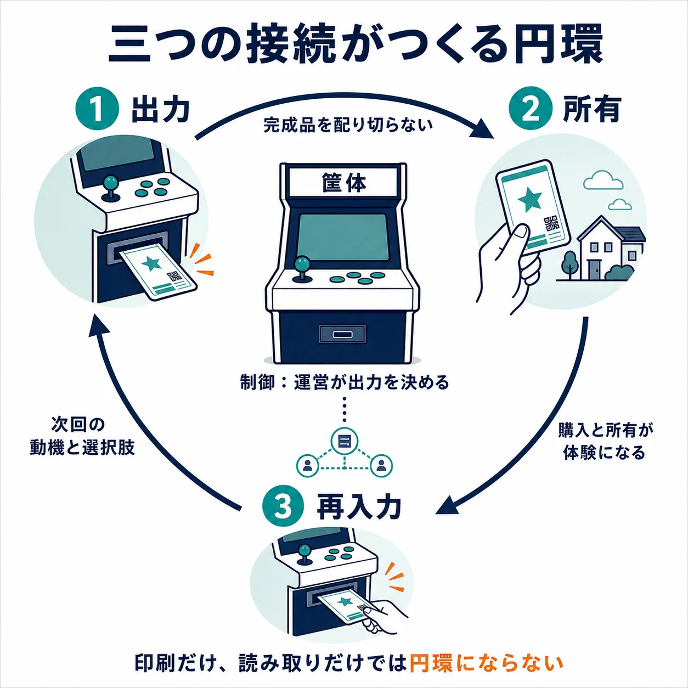
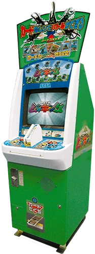
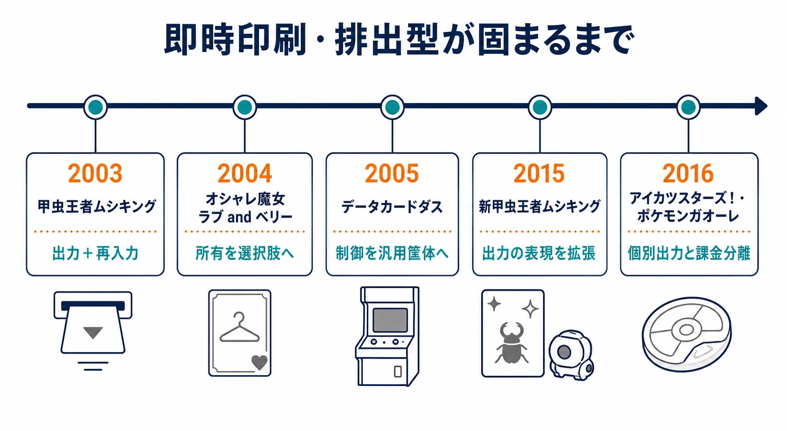
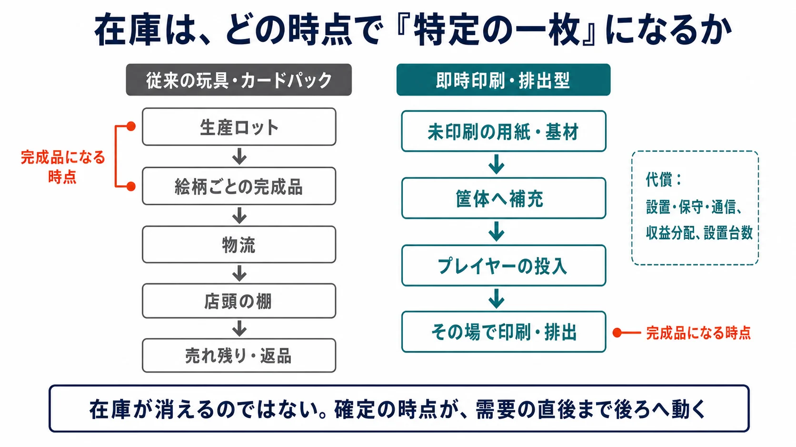
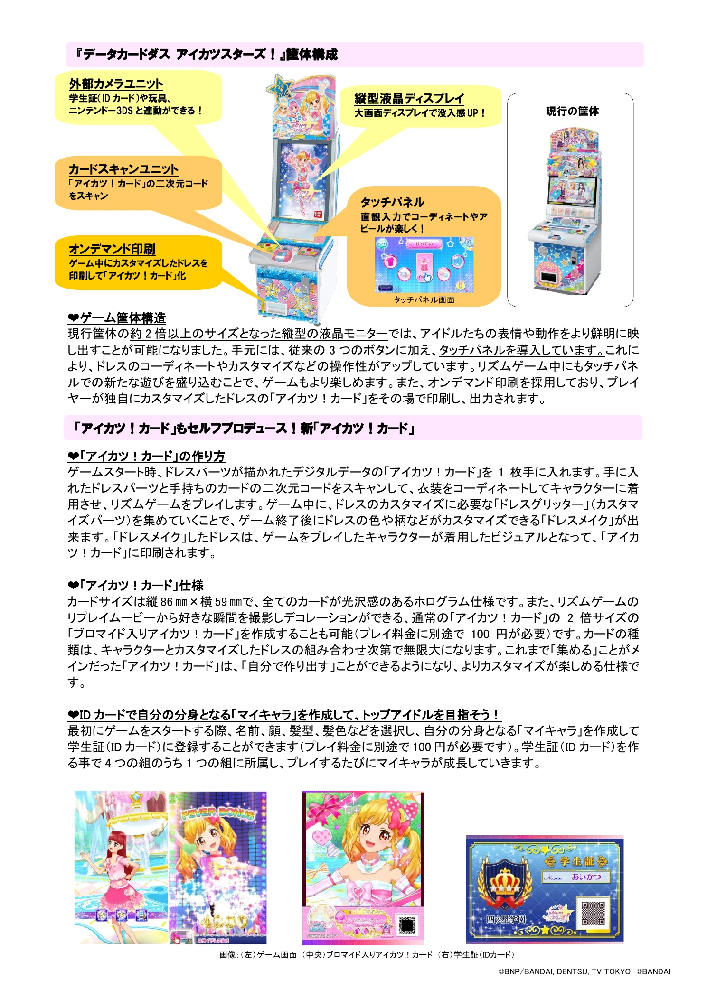
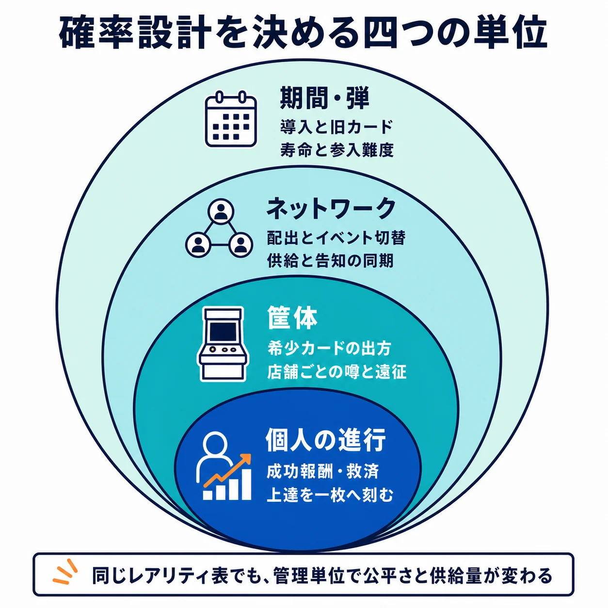
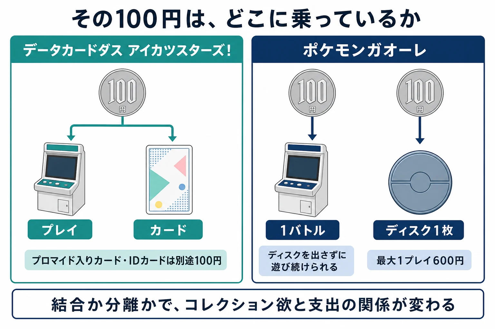
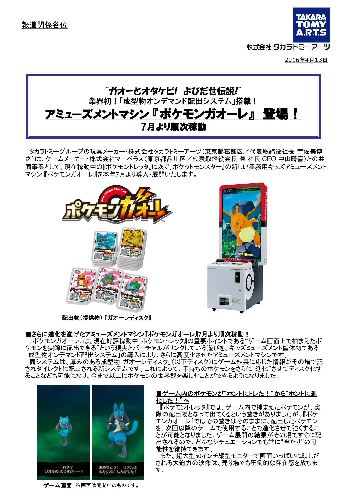

# 100円で出てくるのはプレイ料金か、カード代か――即時印刷・排出型カード筐体の設計論

## はじめに

100円を入れると、画面で遊べて、最後にカードが一枚出てくる。この100円はプレイ料金なのか、カードの代金なのか。一方だけではない。画面上の勝敗や選択が、手元に残る一枚の紙へ価値を与え、その紙が次のプレイの選択肢を増やす。即時印刷・排出型のカード筐体は、ゲームと物理商品の会計を一つの短い体験に重ねた装置である。

本稿では、筐体内でカードなどの物理アイテムをその場で印刷・排出し、読み取りによってゲームと連動させる形式を、便宜上 **即時印刷・排出型カード筐体** と呼ぶ。「データカードダス」はバンダイのブランド名であり、セガの『甲虫王者ムシキング』を含む総称ではない。なお『ポケモンガオーレ』の排出物はカードではなくディスクであるが、ゲーム結果と物理アイテムをその場で接続する設計を比較するために扱う。

既存の「[トレーディングカードゲームのデジタル化とデッキ構築設計の実務](tcg-digital-deck-building-design-practices.md)」が紙のTCGをデジタルへ移すときの変化を扱ったのに対し、本稿は逆方向を扱う。デジタルの筐体が物理カードを生み、カードが次のデジタルプレイに戻ってくる構造である。ゲームセンターという場の歴史や法規制の詳細は、それぞれ「[アーケードゲーム／ゲームセンターの歴史](arcade-game-center-history.md)」「[ガチャは違法になったのか？](gacha-regulation-japan-history.md)」に譲る。

***

## 1. 発明はカードではなく、三つの接続にある

カードを自動販売機で売ること自体は新しくない。バンダイのカードダスは1988年に自販機専用カードとして始まっている。[[1](#ref-1)] 通常のTCGも、あらかじめ印刷・封入されたパックを店舗で販売し、プレイヤーは持ち帰ったカードでデッキを作る。いずれも物理カードを売る商売だが、カードの内容は筐体やレジへ届く前に固定される。

即時印刷・排出型カード筐体が作った解は、次の三つを同時に成立させたことにある。

| 接続 | 何が起きるか | 設計上の意味 |
| --- | --- | --- |
| 出力 | 筐体がプレイの場でカードを印刷・排出する | 個別絵柄の完成品を店舗ごとに配り切る必要がない |
| 制御 | 何を出力するかを筐体・ネットワーク側で決められる | 弾、イベント、供給量、希少性を運営の更新単位へ置ける |
| 再入力 | 排出物をその場で読み取り、次のゲームで使える | 商品の受け取りが、次回のプレイ動機と選択肢になる |

この三つは、どれか一つだけでは弱い。印刷だけなら写真プリント機に近い。カードを読むだけなら、店頭で売ったカードをスキャンするゲームにとどまる。排出物が次のプレイへ戻るから、購入、所有、使用が円環になる。

  

『甲虫王者ムシキング』は2003年1月に稼働を始め、コイン投入でカードを得た後、ムシカードとわざカードをバーコードリーダーで読ませて遊ぶ形式を採った。[[2](#ref-2)] ここで重要なのは、カードが単なる記念品ではなく、画面上の攻撃や組み合わせの入力装置でもあったことである。セガの開発者インタビューも、プレイごとに一枚を払い出し、家庭に持ち帰れることを価値として挙げている。[[3](#ref-3)]

バンダイは2005年から、「デジタルデータとカードゲームを融合させた新型カードエンターテインメント」としてデータカードダスの展開を開始した。[[1](#ref-1)] この前後関係については、当のバンダイ側が明確に述べている。カード事業を管掌していた同社取締役は、この分野は2003年に他社からデジタルカードの筐体が投入されたことで市場が急拡大したものであり、バンダイの参入は2005年で後発だったが、その後8割を超えるシェアを獲得した、と説明している。[[4](#ref-4)] 形式を開いたのはセガであり、それを汎用の筐体基盤として面的に広げたのがバンダイだった、という役割分担になる。

形式は単線的なブランド史ではなく、接続の役割を広げながら固まった。『オシャレ魔女 ラブ and ベリー』は2004年10月に稼働し、ゲーム開始時に「オシャレまほうカード」が1枚排出され、続けて髪型・服・靴のカードをスキャンして着せ替えとダンスを結び付けた。[[5](#ref-5)] ムシキングが「集めた虫で戦う」入口を作ったのに対し、ラブ and ベリーは排出物をコーディネートの選択肢にした。データカードダスは複数IPを載せ替える筐体の枠組みを作り、『アイカツ！』はプレイヤー固有のカスタマイズをカードへ出力した。さらに『ポケモンガオーレ』は、遊ぶこととディスクを持ち帰ることを分けて選べる構成を示した。共通するのは、物理物をただの購入特典ではなく、画面上の行為を持ち運ぶ媒体として扱う点である。

  

画像出典：セガ・アーケードゲームヒストリー「[甲虫王者ムシキング](https://www.sega.jp/history/arcade/product/8855/)」（© SEGA）

***

## 2. 完成品の在庫を、未印刷の媒体へ戻す

玩具や通常のカードパックでは、発注時点で「どの絵柄を何枚作るか」を決める。生産ロット、物流、店頭の棚、売れ残り、返品は、特定のキャラクターや弾の完成品に結び付く。人気カードを増刷したくても、製造と配送の時間が掛かり、反対に人気のない弾は完成品のまま残る。

即時印刷・排出型では、少なくとも **個別絵柄ごとの完成品在庫** を店舗へ事前配分する必要が小さくなる。筐体が抱える中心的な媒体は、まだ特定のキャラクターやレアリティになっていない用紙や基材である。ある弾の運用を終えても、使われなかった媒体が直ちに「売れなかった特定カード」になるわけではない。次の出力内容へ回せる余地がある。

これは在庫をゼロにする魔法ではない。用紙、インクや熱転写リボン、排出物の基材、筐体そのものは在庫であり、故障すれば一台単位で売上機会を失う。設置台数が販売チャネルの上限にもなる。カードパックなら商品を置ける店舗を増やせば売場を拡張しやすいが、この形式では筐体の導入、電源、通信、保守、設置先との収益分配が必要になる。

規模の目安を挙げると、『甲虫王者ムシキング』は稼働から約2年の2005年2月時点で国内出荷台数8,000台、カードの出荷枚数1億5,000万枚に達していた。[[3](#ref-3)] バンダイ側も、データカードダスと新型のデジタルカードマシンを合わせて約2万4,000台が稼働している（2011年9月末時点）としている。[[4](#ref-4)] この形式で売場を広げるとは、こうした台数を積み上げることにほかならない。

バンダイナムコのインタビューでは、データカードダスを、専用筐体ではなくソフトを入れ替える仕組みにして、効率的な運営と柔軟なソフト展開を可能にしたと説明している。[[4](#ref-4)] ここでいう柔軟さは、コンテンツを替えられることだけではない。物理出力を伴う販売チャネルを、単発の作品ごとに作り直さずに済ませる点にもある。

『アイカツスターズ！』では、その可能性がさらに明瞭である。ゲーム中に集めた要素でカスタマイズしたドレスを、オンデマンド印刷で「アイカツ！カード」として出力した。公式資料は、キャラクターとカスタマイズしたドレスの組み合わせによってカードの種類が無限大になるとしている。[[6](#ref-6)] あらかじめ全組み合わせを完成品として在庫するのではなく、プレイヤーの選択があったときだけ物理化する。これはランダム排出の在庫問題を軽くするだけでなく、「自分で作った一枚」という所有理由を作る設計でもある。

  

画像出典：バンダイ「[『アイカツスターズ！』プロジェクト始動！](https://www.bandainamco.co.jp/files/20160222E382A2E382A4E382ABE38384EFBC81E383AAE383AA.pdf)」（2016年2月22日、©BNP/BANDAI, DENTSU, TV TOKYO ©BANDAI）

***

## 3. 確率はゲーム画面の外、手元に残る物へ移る

デジタルのガチャでは、抽選結果は通常、アカウント内のデータとして残る。即時印刷・排出型では、抽選やゲーム結果に結び付いたカードが先に手へ渡り、その後の能力、見た目、交換価値がゲームの外にも持ち出される。確率設計は同じ「入手」の問題であっても、結果の保存先が異なる。

運営が決めるべきなのは、単に高レアを何％にするかではない。

| 決める単位 | 問うべきこと | 体験への影響 |
| --- | --- | --- |
| 筐体 | 一台内で希少カードの出方をどう偏らせるか | 店舗ごとの噂、遠征、同じ台を続ける理由を生む |
| ネットワーク | 配出内容やイベントをいつ切り替えるか | 全体の供給と告知を同期しやすい |
| 期間・弾 | いつ新規カードを導入し、旧カードをどう扱うか | コレクションの寿命と後発参入の難度を決める |
| 個人の進行 | 成功報酬、救済、カスタマイズをどこまで排出物へ反映するか | 偶然だけでなく、プレイの上達を一枚へ刻める |

  

抽選仕様は、筐体ごとの抽選、サーバー側の配信、期間ごとのテーブル変更のどれで管理するかまで決める必要がある。同じレアリティ表でも、管理単位によってプレイヤーが感じる公平さと供給量は変わる。

運営の更新単位という点では、バンダイ側の説明が具体的である。新型のデジタルカードマシンはネットワーク機能を備え、コントロールセンターから「ミッション」と呼ばれる期間限定のテーマを随時配信できる。放映中のテレビアニメの進捗に合わせてゲーム内容を更新することもでき、前日の稼働状況が日次で届くため、柔軟で迅速な対応が可能になったという。[[4](#ref-4)] 物理物を出力する装置でありながら、運用のサイクルはオンラインゲームに近い。

出力そのものの技術的条件も、この章の前提になる。『新甲虫王者ムシキング』は、カード印刷機能に加えて「キラ対応プリンター」を搭載し、ネットワーク配信による限定カードのキャンペーンを特徴として掲げていた。さらに同機は、カードに加えてゲームで使える玩具「Vガジェ」も排出する機構を備えている。[[7](#ref-7)] 高レアの質感をその場で刷れること、出力内容を配信で差し替えられること、そして排出物が紙に限られないことは、確率設計を物理側へ載せるうえでの土台である。

紙が残ることは、いわゆるハズレの感触も変える。欲しい高レアでなくても、絵柄、記録、友人との会話、交換の材料は残る。デジタルデータだけの抽選結果より常に満足度が高いわけではないが、「何も残らなかった」とは異なる。反対に、弱いカードや重複カードを物として抱える負担も残る。排出物をゲームで最低限使えるものにするか、鑑賞・交換に意味を持たせるか、再印刷や進行要素を用意するかは、この負担を扱う設計である。

一度印刷・排出したカードは、翌日の更新で能力を消したり回収したりできない。カードの能力、読み取り規格、見た目、イベント表記は、デジタルアイテム以上に不可逆である。ライブ運営の自由度を上げるほど、印刷済み資産との互換性、告知、移行措置を先に決める必要がある。

***

## 4. 二次流通は、参加障壁を下げつつ筐体を占有する

物理カードは他人に見せられ、渡せる。これがカードファイル、交換、カードショップ、フリマといった二次流通を生む。後発プレイヤーが旧弾や必要な一枚へ届く経路が増えるのは利点であり、プレイで偶然を引く以外の参入方法になる。『甲虫王者ムシキング』が筐体外でもカードを持ち寄って遊ばれ、交換が交流につながったと紹介されていることは、この形式が店頭外へ延びることをよく示している。[[2](#ref-2)]

ただし、強いカードをプレイせずに取得できるなら、排出とプレイの結び付きは弱くなる。希少性が高額化すれば、子どもが自分の小遣いで集める商品という前提も揺らぐ。転売目的の連続プレイや、人気筐体の長時間占有は、遊びたい子どもと保護者が体験へ到達できない問題になる。

この構図は後年になって現れたものではない。『甲虫王者ムシキング』の総合プロデューサーは2005年の時点で、売上の一定割合は大人ユーザーによる「大人買い」だと考えていること、大人が興味を持っているのはムシそのものよりカードであること、そして彼らがカード収集に飽きれば離れる可能性があることを述べている。[[3](#ref-3)] 同時に、売上が多少下がっても子どもが残っているならそれは悪いことではなく、むしろ子どもが離れることのほうに危機感を持つ、とも語っている。誰の支出で売上が立っているのかと、誰のために設計しているのかを、意識して分けて見ていたことが分かる。

運営に必要なのは、二次流通を存在しないものとして扱うことではなく、どこまで許容し、何を本人の進行と結び付けるかを分けることである。カードごとの識別子、アカウントやセーブカードとの紐付け、同一人物への排出回数制限、再印刷の範囲、対戦での利用可否は、その境界を作る道具になる。ただし紐付けを強めすぎれば、友人との交換と「手元に残る一枚」の価値まで失われる。カードそのものは譲れても、育成記録や大会参加資格は本人へ残す、といった二層設計が考えられる。

***

## 5. 子どもの数分間へ、商品設計を収める

この形式は、長い説明書や高額な初期投資を前提にしにくい。最初の一回で、硬貨を入れる、カードを得る、画面で選ぶ、排出物を受け取る、という因果が理解できなければならない。100円単位の価格と数分で区切れるプレイ時間は、保護者が許可する支出と、次の子どもが待つ列の両方に合わせた制約である。バンダイ側も、カードダスとデジタルカードを合わせて約900億円とする市場規模（同社調べ、2011年時点）について、100円単位で楽しめる価格設定が支持されていると説明している。[[4](#ref-4)]

『データカードダス アイカツスターズ！』は1プレイ・カード1枚を100円とし、プレイ時間を約7分、主な対象を7〜9歳の女児としていた。ブロマイド入りカードの作成や学生証（IDカード）の作成には、プレイ料金とは別に100円が必要となる構成である。[[6](#ref-6)]

『ポケモンガオーレ』は、先行する『ポケモントレッタ』を引き継ぐ形でタカラトミーアーツとマーベラスが共同開発し、2016年7月から順次稼働した。厚みのある成型物「ガオーレディスク」へ、ゲーム結果に応じた情報をその場で記して排出する「成型物オンデマンド配出システム」を、キッズアミューズメント筐体として業界初で搭載したとされる。料金は1バトル100円に対してディスクの払い出しが別途1枚100円、最大1プレイ600円という構成で、公式資料は、ディスクを排出しなくてもゲームを続けられるため、欲しいポケモンを捕まえられたときだけディスク化するという遊び方が可能だと説明している。[[8](#ref-8)] ここでは、ゲーム体験と物理排出が一枚の硬貨に固定されていない。プレイヤーが「遊ぶ」と「持ち帰る」を分けて選べる余地も、この形式の重要な設計変数である。

  

画像出典：タカラトミーアーツ「[『ポケモンガオーレ』プレスリリース](https://www.takaratomy-arts.co.jp/company/pdf/R_Pokemongaole.pdf)」（2016年4月13日、©2016 Pokémon. ©1995-2016 Nintendo/Creatures Inc./GAME FREAK inc. Developed by T-ARTS and MARV）

カードファイルに並べる、友人へ見せる、交換するという可視性は、画面外の継続理由になる。アニメ放送との同期も同じく、キャラクターを知る入口と、今週見た衣装・ポケモンを手に入れたい動機を短い周期で接続する。しかしこれはメディアミックス全体を解く話ではない。筐体の弾更新、画面上のイベント、物理カードの排出を同じ時期に合わせられることが、子どもの一回のプレイを「いま欲しいもの」へ近付けるのである。

***

## おわりに：在庫を消すのではなく、確定を遅らせる

即時印刷・排出型カード筐体は、物理商品をデジタルゲームの外に置かなかった。筐体がその場で出力し、内容を運営が更新し、排出物を次のプレイで使えるようにしたことで、物理物は販売物であると同時に、入力装置、進行記録、コレクション、交換の媒体になった。

この形式の核は「在庫を消す」ことではない。特定の絵柄やレアリティとして完成する時点を、需要とプレイの直後まで遅らせることである。その代わり、販売チャネルは筐体の設置・保守・通信に縛られ、刷った後の価値は簡単に取り消せない。物理物を課金導線へ入れる企画では、出力前の柔軟性と、出力後の不可逆性を一つの仕様として扱う必要がある。

このため、完全デジタルのスマートフォン版は同じ体験を完全には再現しない。ランダム入手、収集、進行、見せ合いは再現できるが、店頭で数分待ち、出力音の後に自分の手へ一枚が渡り、そのまま次の画面で読み取られる瞬間は、物理的な受け渡しを含む設計である。デジタルで代替するか、あるいは別の物理媒体へ応用するかを考えるとき、真似るべきなのはカードの見た目ではなく、この「確定を最後まで遅らせ、所有とプレイを往復させる」構造である。

## References

1. [バンダイのカード事業について][1] - 1988年の自販機専用カード「カードダス」開始と、2005年からの「デジタルデータとカードゲームを融合させた新型カードエンターテインメント」データカードダス展開を説明するバンダイの資料。

2. [甲虫王者ムシキング][2] - 稼働年月2003年1月、コイン投入によるカード入手、ムシカードとわざカードのバーコード読み取り、筐体外での持ち寄り・交換を紹介するセガ公式の製品ページ。

3. [SEGA VOICE：植村プロデューサーが語る『甲虫王者ムシキング』][3] - プレイごとのカード払い出しと家庭へ持ち帰る価値、国内出荷台数8,000台・カード出荷枚数1億5,000万枚、大人ユーザーによる「大人買い」への言及を含む開発者インタビュー。

4. [垰 義孝 キーパーソンインタビュー][4] - 2003年に他社の筐体投入で市場が急拡大し、バンダイの参入は2005年で後発だったこと、ソフト入れ替え型のプラットフォーム戦略、ネットワーク経由の「ミッション」配信、稼働台数と市場規模を説明するバンダイナムコホールディングスのインタビュー。

5. [オシャレ魔女 ラブ and ベリー][5] - 稼働年月2004年10月、開始時の「オシャレまほうカード」排出、髪型・服・靴のカードをスキャンする着せ替えを説明するセガ公式の製品ページ。

6. [『データカードダス アイカツスターズ！』リリース][6] - オンデマンド印刷によるカスタマイズドレスのカード化、組み合わせによる種類の無限化、1プレイ・カード1枚100円、プレイ時間約7分、対象7〜9歳の女児を示すバンダイの発表。

7. [新甲虫王者ムシキング：JAEPO 2015][7] - カード印刷機能に加えた玩具「Vガジェ」の排出機構、キラ対応プリンターの搭載、ネットワーク配信による限定カードキャンペーンを紹介するセガの出展ページ。

8. [『ポケモンガオーレ』リリース][8] - 業界初とする「成型物オンデマンド配出システム」、1バトル100円＋ディスク払い出し1枚100円という料金構成、ディスクを排出せずにゲームを続けられる仕様を説明するタカラトミーアーツの発表。

[1]: https://www.bandainamco.co.jp/releases/images/3/41166.pdf
[2]: https://www.sega.jp/history/arcade/product/8855/
[3]: https://www.sega.jp/fb/segavoice/050331/home.html
[4]: https://www.bandainamco.co.jp/ir/interview/entry4422.html
[5]: https://www.sega.jp/history/arcade/product/8820/
[6]: https://www.bandainamco.co.jp/files/20160222E382A2E382A4E382ABE38384EFBC81E383AAE383AA.pdf
[7]: https://am-show.sega.jp/jaepo15/lineup_mushiking.html
[8]: https://www.takaratomy-arts.co.jp/company/pdf/R_Pokemongaole.pdf

----

この文書は、Perplexity、Claude、OpenAI Codex の3つのAIの支援を受けて著述されたものです。引用画像を除き、MIT License にて提供されています。
