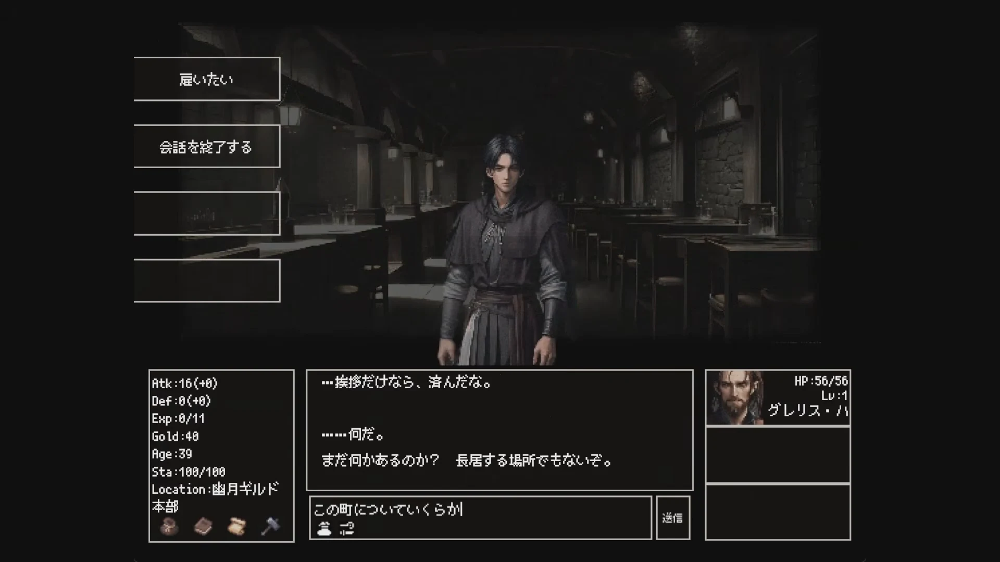
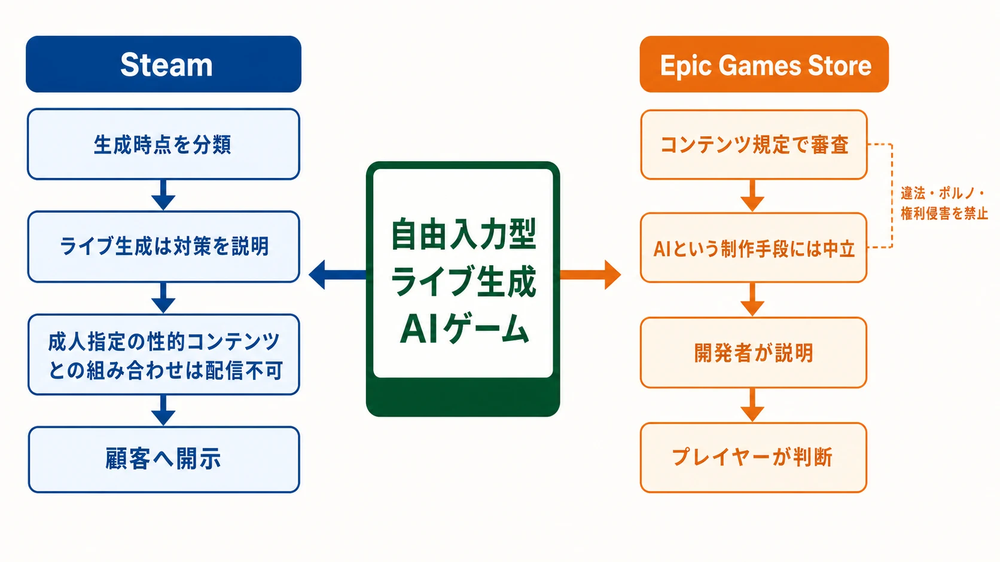

# Steamのライブ生成AI審査とEpic Games Storeの異なる哲学――『Instantale』が示した配信設計の新条件

自由入力型の生成AIゲームは、プレイヤーが選択肢の外へ踏み出せることを価値にする。ところが配信プラットフォームは、製品から何が出力されうるかを事前に分類し、説明できることを求める。自由度を広げるゲームデザインと、出力範囲を確定させる審査は、同じシステムを反対側から見ている。

インディー開発者「だるまと赤べこ」の『Instantale』は、この緊張が配信可否にまで及んだ事例である。本作はSteamで1万5,000件を超えるウィッシュリストを集めながら同ストアでの配信を断念し、その後Epic Games Storeで発売された。ここで問われたのは、生成AIを使ったかどうかだけではない。プレイ中に生成される内容を、開発者がどこまで保証できるかであった。

生成AIの学習・出力に関する著作権実務は[「生成AIと著作権法――ゲーム業界の実務論点ガイド」](generative-ai-copyright-game-industry-guide.md)、企画検証工程での利用は[「CEDEC2026予習：Unity AIとバイブコーディングが変えるゲーム企画の検証工程」](cedec2026-unity-ai-prototyping-planner-vibe-coding.md)で扱っている。本稿ではそれらを繰り返さず、ストアの審査哲学と配信設計に焦点を絞る。

*出典：だるまと赤べこ「[Instantale プレイ動画 最高設定版（GPT-4.1 + RTX3090画像生成）](https://www.youtube.com/watch?v=b1NZCzizf7c)」より引用（動画内2分02秒付近）。*

***

## 1. 1万5,000件のウィッシュリストから配信先変更まで

『Instantale』は、世界、ダンジョン、NPC、アイテム、クエスト、物語の大部分をAIが動的に生成するローグライクRPGである。プレイヤーは自然言語で行動を入力し、固定された台詞を持たないNPCと会話する。キャラクターは戦闘で死亡するだけでなく老いて寿命を迎え、資産の一部を次の人生へ引き継ぐ。[[1](#ref-1)]

経緯を公開情報から並べると、次のようになる。

| 日付 | 出来事 |
| --- | --- |
| 2025年5月18日 | 『Instantale』を発表し、Steamストアページを公開 |
| 2026年3月27日 | 開発者がSteamで配信できなくなった経緯を説明する動画を公開 |
| 2026年4月21日 | Epic Games Storeページを公開。開発者発表では、Steamで1万5,000件超のウィッシュリストを獲得した後、体験版公開直前に配信を停止されたとしている |
| 2026年6月2日 | Epic Games Storeで早期アクセス発売。米国ストア価格は14.99ドル |

最初のSteamストアページは2025年5月18日に公開された。発表時点から、物語とキャラクターをプレイ中に生成し、プレイヤーの入力に応じてNPCや出来事を変化させる作品として紹介されていた。[[2](#ref-2)]

転機は体験版の公開前に訪れた。開発者の説明によれば、Steamのコンテンツアンケートでライブ生成AIに該当し、さらに成人向け項目への回答との組み合わせによって配信できないと判断された。開発者は「本作はアダルトコンテンツは一切含んでいない」と説明している。一方で、プレイヤーが自由入力できるため、以前のアンケートでは安全側に倒して「大人向け」にチェックを入れていたという。現在はユーザー入力からも該当表現を生成しない対策を講じているとしている。[[3](#ref-3)][[4](#ref-4)]

その後、2026年4月21日にEpic Games Storeページが公開され、6月2日に早期アクセスとして発売された。Epicの米国向けページは14.99ドルを表示している。国内向けの発売発表では税込1,700円と案内されたが、2026年8月14日時点の国内ストア表示は1,460円である。[[5](#ref-5)][[6](#ref-6)] 地域と時差によって国内ページのリリース日表示が6月3日になる場合もあるため、本稿では開発者の公式発表に沿って発売日を6月2日とする。

***

## 2. Steamは「AI使用」ではなく生成の時点と出力リスクを分けて見る

Steamでは、ストアページと製品ビルドをレビューへ提出する前にコンテンツアンケートへの回答が必要である。アンケートは「一般的なコンテンツ」「大人向けコンテンツ」「生成AIコンテンツ」の三つを主要区分とし、Valveは回答をビルドやストアページと照合する。[[7](#ref-7)]

生成AIコンテンツは、さらに二種類へ分けられる。

| 区分 | Steamworksドキュメント上の意味 | 開発者に求められること |
| --- | --- | --- |
| 事前生成AIコンテンツ | 開発中にAIツールを使って作り、製品に含めてプレイヤーへ提供するアート、音声、物語、ローカライズなど | 違法・権利侵害コンテンツを含まず、マーケティング素材と一致することを保証する。AI以外のコンテンツと同様にリリース前審査を受ける |
| ライブ生成AIコンテンツ | ゲームの実行中にAIツールを使って生成するコンテンツ | 事前生成と同じ要件に加え、違法なコンテンツを生成させないための対策をアンケートで説明する |

この規定は、生成AIを使ったゲームを一律に禁止するものではない。Steamworksドキュメントはライブ生成AIサービスの費用を本体価格、マイクロトランザクション、サブスクリプション、DLCで回収する方法まで例示しており、条件を満たしたライブ生成AIの配信自体を想定している。[[7](#ref-7)]

明示的に配信しないとしているのは、 **ライブ生成AIと成人指定（アダルトオンリー）の性的コンテンツが組み合わさる場合** である。Valveは成人指定の性的コンテンツについて、法的制限の適用、制作者の創造的自由の尊重、顧客の期待の充足という三つの目標を掲げる。プレイ中のAI生成がこれらを損ないうるため、法的リスクと顧客に対するリスクが大きく、現時点では公開しない方針だと説明している。[[7](#ref-7)]

「大人向けコンテンツ全般」と「Adult Only Sexual Content」は同義ではない。暴力や飲酒なども大人向け区分に関係しうる一方、Steamがライブ生成AIとの組み合わせで明示的に配信不可としているのは成人指定の性的コンテンツである。企画書や社内会話で両者を「アダルト」の一語にまとめると、アンケート回答の意味を取り違える。

***

## 3. 『Instantale』では「自由に入力できること」自体が審査対象になる

『Instantale』の開発意図は、成人向け表現を見せることではなく、自然言語で好きな行動を試せるRPGを作ることにある。Epic Games Storeの製品説明も、キャラクターの出自、外見、能力、スキル、特質まで自然言語で設計でき、NPCと固定台詞なしで会話できる点を中心に掲げている。[[5](#ref-5)]

Steamの審査が見る範囲は、作者が何を見せたいかだけではない。プレイヤーが何を入力でき、その入力を受けたモデルが何を返し、その出力がゲーム内の状態へどう反映されるかまで含む。『Instantale』ではAIの文章が会話欄に表示されるだけでなく、人物、場所、アイテム、出来事、戦闘結果へ接続される。出力の影響範囲が広いほど、一つの不適切な生成を画面外へ隔離することも難しくなる。

この構造では、ゲームデザイン上の長所と審査上のリスクが同じ場所から生まれる。

- **入力の開放性：** 選択肢をなくすほど、開発者が事前に列挙していない要求も入力される。
- **生成の連鎖性：** 一度の応答がNPCの関係、クエスト、アイテム、後続イベントへ引き継がれる。
- **モデルと設定の変動：** 使用モデル、システム指示、フィルター、クラウド側の更新によって、同じ入力への挙動が変わりうる。
- **禁止と体験価値の衝突：** 強い入力制限や一律拒否を増やすほど、「何でも試せる」という作品の約束が弱くなる。

したがって、開発者の「成人向け作品ではない」という説明と、Steamが潜在的な出力を分類する基準は、必ずしも矛盾しない。前者は作品の目的を述べ、後者は運用中に起こりうる結果と、その結果を制御する仕組みを問うている。『Instantale』が配信不可となった詳細な社内判断は公開されていないが、自由入力を安全側に申告した回答が、ライブ生成AIと成人指定の性的コンテンツという配信不可の組み合わせとして扱われた可能性がある。

プランナーが用意すべきものは「AIに禁止事項を指示した」という一文だけではない。少なくとも、入力時の制限、モデルへ渡す指示、出力検査、ゲーム状態へ反映する直前の検査、失敗時の代替応答、ログと通報手段を分けて設計する必要がある。さらに、代表的な回避入力を試したテスト結果を残し、アンケートの各回答を実装と対応づけることが重要になる。

***

## 4. EpicはAIの作り方に中立でも、コンテンツ審査を放棄してはいない

Epic Games Storeの責任者であるバイスプレジデント兼ゼネラルマネージャーのSteve Allison氏は、生成AIに対する同ストアの姿勢をGamesRadar+に問われ、「We do not police how developers make their games」と答えた。さらに「We don't take a positive or negative stance on it」「We let players decide」と述べ、開発手段としてのAIに肯定・否定の立場を取らず、開発者の説明とプレイヤーの判断に委ねる考えを示している。[[8](#ref-8)]

Epic CEOのTim Sweeney氏は、SteamのAI開示をさらに強く批判する。PC Gamerのインタビューで、AI開示が製品に「Scarlet Letter of AI attached to your product」を付けるように働くと表現し、Valveの方針を「really irresponsible」と評した。Sweeney氏の主張では、AIは小規模なチームが制作効率を高める手段であり、開示表示による先入観が成功機会を狭める。[[9](#ref-9)]

対照点は、SteamがプレイヤーへAI利用を知らせるために実装内容を分類し、ライブ生成では安全対策まで説明させるのに対し、Epic幹部は制作手段に対するストアの評価を抑え、開発者とプレイヤーの判断へ寄せていることである。

ただし、Epicが審査をしないわけではない。Epicの公式配信案内は、すべての製品がコンテンツガイドラインに従う必要があり、違法コンテンツ、ポルノ、権利侵害、詐欺的な製品などは配信対象外だと明記する。[[10](#ref-10)] 『Instantale』にも年齢レーティングが表示されている。両ストアの違いは「規制があるか、ないか」ではなく、 **生成AIという制作・実行方式を独立した開示・審査軸として扱うか** にある。

***

## 5. 自己申告には過小申告と過剰申告の両方がある

コンテンツアンケートでは、危険を小さく見せる過小申告がまず問題になる。Steamworksドキュメントは、正直で正確な開示を求め、回答を実際のビルドとストアページに照らして確認すると明記している。[[7](#ref-7)] ライブ生成なのに事前生成として扱う、突破可能な成人向け出力を申告しない、といった回答は審査の前提を崩す。

一方、自由入力型ゲームには過剰申告側のリスクもある。プレイヤーが禁止表現を入力できるというだけで、実際の出力やゲーム内反映まで「成人指定の性的コンテンツを含む」と回答すれば、ライブ生成AIとの組み合わせで配信不可の区分へ入る可能性がある。『Instantale』は、安全側の回答が必ずしも安全な審査結果を生まないことを示した。

必要なのは申告を弱めることではなく、回答対象を工程ごとに分解することである。

| 確認する問い | 企画・開発側が用意する証拠 |
| --- | --- |
| プレイヤーは何を入力できるか | 入力仕様、禁止入力への応答例、年齢に関わる設定 |
| モデルは何を生成できるか | 使用モデルと設定、システム指示、回避入力を含むテスト結果 |
| 生成物のどこまでがプレイヤーへ届くか | 出力フィルター、再生成、固定応答への切り替え条件 |
| 生成物がゲーム状態へ何を残すか | NPC関係、クエスト、アイテム、画像生成など反映先ごとの検査 |
| 対策が失敗したときにどうするか | ログ、通報、機能停止、モデル更新時の再試験手順 |

アンケートの選択肢と実装の関係が曖昧なら、発売直前まで推測で持ち越さず、ストアページ公開や体験版告知より前にプラットフォームへ確認するべきである。回答の訂正可能性だけでなく、審査に要する時間、別ストアへ移る場合のウィッシュリスト、コミュニティ導線、価格設定のやり直しまでリスクとして見積もる必要がある。

***

## 6. プラットフォーム選定はゲームシステムの設計変数になった

従来のPC向け配信先選定では、利用者規模、手数料、決済、実績、コミュニティ機能、アップデート運用などが主要な比較項目だった。ライブ生成AIを中核に置く企画では、そこへ **審査哲学との相性** が加わる。

Steamを優先するなら、自由入力の仕様と同時に、出力を限定し、その限定を説明・実証できる構造が必要になる。Epic Games Storeを選ぶ場合でも違法・権利侵害・ポルノなどの一般的な禁止事項は残るが、少なくともEpic幹部はAI利用そのものをストアが肯定・否定する対象としない立場を表明している。どちらが普遍的に優れているかではなく、作品の体験価値をどこまで制限せず、どの責任を開発者、プラットフォーム、プレイヤーへ配分するかが選択基準になる。

『Instantale』の事例が示す最も実務的な教訓は、配信審査を完成後の申請作業として扱わないことである。自由入力、モデル選定、ガードレール、年齢区分、ストア選定は、一つの企画判断として早期に接続しなければならない。ライブ生成AIゲームでは、何を生成できるかと同じくらい、 **何を生成しないと証明できるか** が製品要件になる。

## References

1. [Instantale｜Epic Games Store][1] - 自然言語入力、AIによる世界・NPC・アイテム・クエスト生成、早期アクセス、開発元、米国価格、リリース日を示す公式製品ページ。

2. [AIがリアルタイムで物語を生成するローグライクゲーム「Instantale」，Steamストアページを公開。制作過程を収録した映像を配信][2] - 2025年5月18日の発表とSteamストアページ公開、当初から示されていたライブ生成型のゲーム設計を掲載した4Gamerの記事。

3. [3年間かけて作ったゲームが、Steamから出せなくなったらしい][3] - Steamでの配信断念とコンテンツアンケートへの回答経緯を説明する、開発者「だるまと赤べこ」の動画。

4. [AIが人・土地・アイテム・イベントなど“すべて”を生成するRPG『Instantale』Epicで8月発売予定][4] - 開発者発表文の全文と、1万5,000件超のウィッシュリスト、Steam審査、成人向け項目への回答、Epic Games Storeページ公開の経緯を掲載した電ファミニコゲーマーの記事。

5. [Instantale｜Epic Games Store（日本語）][5] - 国内向けの製品説明、早期アクセス表記、年齢レーティング、2026年8月14日時点の国内価格を示す公式製品ページ。

6. [AI生成の世界で自由入力による冒険を楽しめる。AI駆動ローグライクRPG「Instantale」，6月2日にEpic Games Storeで発売][6] - 2026年6月2日の発売日と発表時価格1,700円を掲載した4Gamerの記事および開発者発表文。

7. [コンテンツアンケート｜Steamworksドキュメント][7] - 事前生成とライブ生成の区分、ライブ生成AIのガードレール説明、成人指定の性的コンテンツとの組み合わせ、Valveが示す法的・顧客リスクを説明する公式文書。

8. [“We do not police how developers make their games”: Epic Games Store boss says “we let players decide” on games that use gen AI][8] - Epic Games Store VP兼GMのSteve Allison氏が生成AIに対する中立的な方針を述べたGamesRadar+のインタビュー記事。

9. [Tim Sweeney on the future of games, AI, and whether Valve will ever join forces with Epic][9] - Epic Games CEOのTim Sweeney氏がSteamのAI開示方針を批判したPC Gamerのインタビュー。

10. [Prohibited Content – Epic Games Store Requirements & Guidelines][10] - Epic Games Store公式ドキュメント。違法コンテンツ、ポルノ、権利侵害コンテンツ、詐欺的な製品・マルウェアなどの禁止事項を明記した頒布要件文書。

[1]: https://store.epicgames.com/p/instantale-2cfd4c
[2]: https://www.4gamer.net/games/910/G091095/20250519010/
[3]: https://www.youtube.com/watch?v=jhg8jVUvP-g
[4]: https://news.denfaminicogamer.jp/news/2604212p
[5]: https://store.epicgames.com/ja/p/instantale-2cfd4c
[6]: https://www.4gamer.net/games/910/G091095/20260507013/
[7]: https://partner.steamgames.com/doc/gettingstarted/contentsurvey?l=japanese
[8]: https://www.gamesradar.com/games/we-do-not-police-how-developers-make-their-games-epic-games-store-boss-says-we-let-players-decide-on-games-that-use-gen-ai/
[9]: https://www.pcgamer.com/gaming-industry/tim-sweeney-on-the-future-of-games-ai-and-whether-valve-will-ever-join-forces-with-epic-its-now-clear-that-nobodys-going-to-end-up-with-an-absolute-monopoly/
[10]: https://dev.epicgames.com/docs/services/en-US/EpicGamesStore/RequirementsGuidelines/ProhibitedContent/index.html

----

この文書は、Perplexity、Claude、OpenAI Codex の3つのAIの支援を受けて著述されたものです。引用画像を除き、MIT License にて提供されています。
