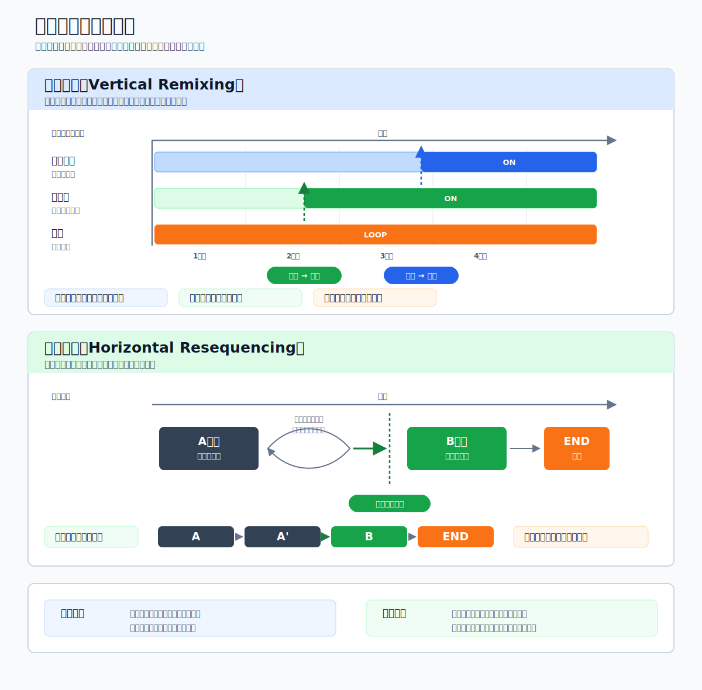

# インタラクティブミュージック・アダプティブミュージック 完全解説
### ゲームプレイに「呼応する音楽」の仕組みと作り方

***

## はじめに：なぜゲーム音楽は変化するのか

映画では、音楽はあらかじめ決まった映像の長さに合わせて作られる。ところがゲームでは、プレイヤーが何をするかを開発者は予測できない。敵に気づかれた瞬間、ボスのHPが半分を切った瞬間、あるいは仲間との感動の再会——これらは全て、プレイヤーの選択と行動によってタイミングが変わる。

「あらかじめ決めた盛り上がりが来ない」という映画では起き得ないこの問題を解決するために生まれたのが、**インタラクティブミュージック**（またはアダプティブミュージック）と呼ばれる手法だ。[[1](#ref-1)]

**インタラクティブミュージック** と **アダプティブミュージック** は、現場によって使い分けられることもあるが、どちらも「ゲームの状況やプレイヤーの行動に応じてリアルタイムに音楽が変化する演出技法」を指す。本レポートでは両語を同義として扱う。[[25](#ref-25)]

なお、後半では **プロシージャルミュージック** という言葉も登場する。これは「あらかじめ完成した曲を切り替える」だけでなく、短い音楽素材・ルール・パラメータを組み合わせ、その場で音楽を組み立てる考え方だ。本稿では、インタラクティブミュージックの中でも「自動生成寄り」の手法として読めばよい。

***

## 第1章：2つの基本技術

インタラクティブミュージックを実現する手法は、大きく2種類に分けられる。楽譜のイメージで覚えると分かりやすい——楽譜は縦に楽器が並び、横軸（左から右）に時間が流れる。[[3](#ref-3)][[1](#ref-1)]


*図：縦の遷移は同じ時間軸上で楽器レイヤーを足し引きし、横の遷移は曲の区間そのものを切り替える。*

### 縦の遷移（Vertical Remixing）＝アレンジの変化

複数の「同じテンポ・同じコード進行・同じ長さのループ」を同時に流し、それぞれのトラックの音量を状況に応じてON/OFFまたはクロスフェードさせる手法。[[3](#ref-3)]

> 楽譜の「縦」軸、つまり楽器ごとの五線譜が変化するイメージ。

- **特徴**：テンポ・拍子・尺は変わらず、音楽の流れが地続きになる
- **利点**：遷移命令が来た瞬間にすぐ変化できる（タイムラグが発生しない）
- **適した場面**：緊張感を「じわじわ」高めたい、環境の変化を自然に伝えたい場合
- **例**：敵に近づくと低音弦楽器が静かにフェードイン、建物に入るとエコー処理が変わる

変化できる要素は、楽器編成・和音の緊張度（ハーモニー）・リズムパターン・エフェクトなど。一方でテンポ・拍子・全体の展開は基本的に変化しない。[[3](#ref-3)]

### 横の遷移（Horizontal Resequencing）＝展開の変化

音楽を「A区間」「B区間」「エンド」といった複数のセクションに分割し、ゲームの状況に応じて次のセクションへと遷移させる手法。セクションは基本的にループし続け、ゲームから遷移命令が来て初めて次へと進む。[[3](#ref-3)][[1](#ref-1)]

> 楽譜の「横」軸、つまり時間軸上で曲の展開が切り替わるイメージ。

- **特徴**：メロディ・テンポ・拍子を含め、あらゆる要素を一気に変えられる
- **利点**：映画のような劇的な盛り上がりを演出できる
- **難点**：音楽には拍・小節というルールがあるため、命令が来てもすぐには遷移できない（タイムラグが発生する）[[1](#ref-1)]
- **適した場面**：ボスの形態変化、クライマックスの演出、戦闘の開始・終了

**タイムラグ問題の解決策：プリエンド（Pre-end）**
遷移先の直前に「どこからでもキリよく繋げられる短い緩衝材（バッファ）」を挿入することで、遅延を最小化する。例えばBPM120・8小節刻みの曲では最大16秒の遅延が生じうるが、プリエンドを1小節単位で細かく刻むことで対処できる。[[1](#ref-1)]

| 比較項目 | 縦の遷移 | 横の遷移 |
|---------|--------|--------|
| 変化できる要素 | 楽器編成・ハーモニー・エフェクト | メロディ含む全要素 |
| テンポ・拍子 | 変えられない | 変えられる |
| 遷移のタイムラグ | ほぼゼロ | 拍・小節待ちが発生 |
| 演出の特徴 | じわじわ・自然 | ドラマチック・劇的 |
| 作曲コスト | 中程度 | 高い |

実際の開発では1曲の中でこの2つを組み合わせて使うことが多い。[[1](#ref-1)]

***

## 第2章：歴史的な実例——黎明期から現代へ

### 2-1. iMUSEシステム（1991年〜）：インタラクティブミュージックの夜明け

最初期の体系的なインタラクティブミュージックシステムとして名高いのが、ルーカスアーツ（LucasArts）のマイケル・ランドとピーター・マクコネルが開発した **iMUSE（Interactive Music Streaming Engine）** だ。1991年の『モンキー・アイランド2』から採用されたこのシステムは、MIDIデータをリアルタイム操作して場面に合わせて音楽を変化させた。[[6](#ref-6)][[7](#ref-7)]

プレイヤーがある部屋から別の部屋へ移動するとき、旧来のゲームでは「ブツッ」と音楽が途切れて別の曲が始まった。iMUSEはその切れ目をなくし、音楽が自然につながり続けるよう設計された。現代のWwiseやFMODが当たり前のように提供するこの機能を、iMUSEは30年以上前に実現していた。[[8](#ref-8)][[7](#ref-7)]

### 2-2. スーパーマリオワールド（1990年、スーパーファミコン）

インタラクティブミュージックの代名詞的な早期事例として世界中で語り継がれるのが、任天堂の **スーパーマリオワールド** だ。[[4](#ref-4)]

このゲームでは、ヨッシーに乗ると同じBGMの中に打楽器（ボンゴ）のトラックが追加されて楽曲がにぎやかになる。スターを取得したときはさらに大きな変化が加わり、無敵状態専用の曲へ一気に切り替わる。これはまさに「縦の遷移」の原型であり、1990年という非常に早い段階でゲームの状況に応じたリアルタイムのBGMレイヤー変化を実現していた。[[4](#ref-4)][[28](#ref-28)]

プレイヤーの多くは「何かが変わった」とは気づきながら、それが音楽の演出によるものだとは意識しない——それほど自然に状況と音楽がシンクロしていた。

### 2-3. ゼルダの伝説 時のオカリナ（1998年、Nintendo 64）

**ゼルダの伝説 時のオカリナ** のハイラル平原では、敵との距離に応じて通常曲と戦闘曲がスムーズに切り替わる。特筆すべきは、ダンジョンから戻った際に「いつも曲の頭から始まらない」点だ。[[9](#ref-9)][[27](#ref-27)]

作曲家・近藤浩治は、8小節単位の「部品」を複数用意してランダムに再生し、どの部品同士もスムーズに繋がるよう、8小節の末尾をどの部品にも自然につながるコードにしたと語っている。映画のように尺が決まっていないゲームでも、長時間プレイして飽きさせない音楽を、という発想から生まれたこの「小部品のランダム接続」は、現代のプロシージャルミュージックの先駆けとも言える。[[27](#ref-27)]

### 2-4. ゼルダの伝説 ブレス・オブ・ザ・ワイルド（2017年、Nintendo Switch）

**ゼルダの伝説 BotW** のサウンドデザインは、インタラクティブミュージックの可能性を哲学的なレベルで問い直した作品だ。[[10](#ref-10)]

サウンドチームが選んだアプローチは「音楽を減らすこと」だった。広大なハイラルの荒野では、BGMが流れない時間帯が長く続き、風の音、水の音、リンクの足音だけが世界を満たす。廃墟と化した王国の静けさ、孤独な旅——そのテーマに最もふさわしい演出が「沈黙」だったのだ。[[11](#ref-11)][[10](#ref-10)]

一方でインタラクティブな演出は随所に仕込まれている：

- **戦闘への移行**：敵が気づいた瞬間に別の戦闘曲へシームレスに遷移
- **昼と夜の変化**：街などのBGMが昼夜でシームレスに切り替わる
- **イチカラ村の建設クエスト**：移住者が増えるにつれて、その村人に合わせた楽器・サウンドがBGMに追加されていく。最終的には多くの音が重なり合い、豊かな合奏へと発展する[[29](#ref-29)]

このイチカラ村の演出は縦の遷移を「物語の進行」と直結させた好例だ。音が増えるごとにプレイヤーは「仲間が増えた」という感情を音楽から受け取る。

### 2-5. エースコンバット7 スカイズ・アンノウン（2019年、PS4/Xbox One/PC）

**エースコンバット7** は、CEDEC 2019のセッション「『空』と『物語』を演出するためのインタラクティブサウンドデザイン」で、サウンドディレクター・渡辺量氏が実装手法を解説した事例だ。[[12](#ref-12)][[5](#ref-5)]

ゲームエンジンにUnreal Engine 4.18、サウンドミドルウェアにWwise 2017.1.4を採用。常駐サウンドメモリは155MB、音声数は約20,000（日英）、BGMは全体で5時間を超える大規模なサウンドが構築されている。[[5](#ref-5)]

**横の遷移：見せ場で盛り上がりを届ける設計**

本編では、プレイヤーの戦闘継続時間がまちまちでも「演出上の見せ場で曲の盛り上がりが来る」よう、曲の途中にループし続ける「踊り場」を複数設け、そこで待機しながらフラグが立った瞬間に次のセクションへ遷移させる設計を採った。ミッション19「灯台」では、ナラティブディレクター・糸見功輔氏の打診を受け、軌道エレベータのバリアを割った瞬間に曲のサビへ遷移する演出が組まれている。技巧をプレイヤーに悟らせず自然に感動させることを目的とした、シリーズの文脈に沿った使い方だ。[[14](#ref-14)][[13](#ref-13)]

**パーツ分解による楽曲制作**

こうした遷移を成立させるため、楽曲は最初から細かなパーツに分解して録音される。小林氏が手がけた楽曲「Daredevil」では、演奏家が断片化されたパートを一小節ずつ演奏し、それをWwise上でリアルタイムに組み立てている。さらにDLCのミッションBGMでは、北谷光浩氏が1曲を100近いパーツへ、音楽上の8分音符単位にまで分割し、インゲームシネマ（IGC）への切り替わりに曲の盛り上がりが合致するよう作り込んだ。プレイ時間が変動してもBGMと映像がぴったり同期する仕組みだ。[[14](#ref-14)]

**雲に入ったときのエフェクト変化（縦の遷移）**

自機が雲の中に入るとBGMに籠もった（ローパスフィルター）エフェクトが適用される。これは渡辺氏がDJプレイでのフィルター処理から着想した仕掛けで、当初はブランドディレクターの河野氏から反対されたものの、雲に入った感覚をプレイヤーへ伝える演出として最終的に採用された。縦の遷移をエフェクト変化として活用した好例だ。[[14](#ref-14)]

**撃墜シーンの動的な終わり**

ミッション終盤の追撃シーンでは、どのタイミングで敵機を撃墜してもBGMが自然にアウトロへ遷移し、決まった締めくくりになるよう作られている。プレイヤーは「自分が曲に合わせてカッコよく決めた」かのような満足感を得られる。[[14](#ref-14)]

### 2-6. ポケットモンスター スカーレット・バイオレット（2022年、Nintendo Switch）

シリーズ初のオープンワールド化を果たした **ポケモンSV** は、「エリアフレーズの統一」という独自のアダプティブ設計を採用している。[[15](#ref-15)]

南エリア・西エリアといった各地域ごとに「エリアテーマ」を設定し、そのエリアにいる間は——歩いているとき、ライドポケモンに乗っているとき、さらには野生のポケモンとの戦闘中まで——すべてそのエリアのフレーズのアレンジが流れ続ける。戦闘曲までエリアテーマをベースにするという発想は、「どこにいるか」という空間の連続感を最優先したデザインだ。[[15](#ref-15)]

タイトル画面では、ゲームの進行度に応じて「タイトル」の楽曲が吹奏楽版とピアノ版で流れ分けられる仕掛けもあり、インタラクティブな演出がゲーム全体の設計に織り込まれている。[[15](#ref-15)]

CEDEC 2023では、ゲームフリークのサウンドデザイナー・一之瀬剛氏らがポケモンSVの環境音設計について講演。「ポケモンの世界に自然の生き物は存在しないため、ポケモンの鳴き声で環境音を作る」という制約の中で、Wwiseを活用して空間に応じたランダム再生を実現したことが明かされた。[[16](#ref-16)]

### 2-7. ファンタシースターオンライン2 SYMPATHYシステム（2012年〜）

セガの **PSO2** が採用する **SYMPATHY** システムは、「プロシージャルミュージック」のゲーム実装としての先駆例だ。[[17](#ref-17)][[18](#ref-18)]

数秒程度の「クリップ」と呼ばれる最小単位を大量に用意し、「ヒーロー度」「ピンチ度」「盛り上がり度」の3パラメータによって計算されたBGMをリアルタイムに生成する。長時間プレイしても同じBGMが繰り返されない設計で、オンラインRPGというジャンルの特性（同じクエストを何度も繰り返す）への回答となっている。[[17](#ref-17)]

### 2-8. ファイナルファンタジーXV MAGIシステム（2016年、PS4）

スクウェア・エニックスの岩本翔氏がGDC 2017で発表した **MAGI** システムは、垂直/水平遷移の双方向設定と、あらゆるテンポや拍子の変化に対応できる柔軟性を特徴とする。[[20](#ref-20)][[21](#ref-21)]

チョコボ騎乗時の速度による縦の遷移、召喚獣召喚やボス戦での横の遷移など、単一作品の中で2つの技法を使い分けた好例として挙げられる。特にボス戦では、戦闘の終了に合わせて楽曲がきっちり終わるよう演出されている。[[21](#ref-21)]

***

## 第3章：ゲームプランナーとサウンドディレクターの連携

インタラクティブミュージックは、サウンドチームだけで完結できない。ゲームの仕様を一番熟知しているプランナーと、音楽の文法を知り尽くしているサウンドディレクター（コンポーザー）が密に連携して初めて実現できる。[[22](#ref-22)][[23](#ref-23)]

### 3-1. 役割の整理

インタラクティブミュージックの実現には、以下の3つの専門性が必要だ：[[23](#ref-23)][[2](#ref-2)]

| 役割 | 主な担当 |
|------|---------|
| **コンポーザー**（作曲家） | インタラクティブな変化を想定した作曲、レイヤー素材の制作、組み合わせが音楽的に破綻しない設計 |
| **サウンドデザイナー**（実装担当） | ゲーム演出に合わせた再生パラメータの設定、遷移タイミングの調整、トリガー条件の検証 |
| **サウンドプログラマー** | ゲームエンジン側の変数とサウンドミドルウェアのパラメータ接続、同時再生数・メモリ管理 |

プランナーはこの3者の橋渡し役を担う。特に「どんなゲームプレイ状態が存在するか」「各状態はどの変数で表現されるか」を明確に定義することが、インタラクティブミュージックの設計の出発点になる。[[1](#ref-1)]

### 3-2. 仕様書に盛り込むべき項目

ゲームプランナーがサウンドチームと連携するために作成する「BGM/サウンド仕様書」には、以下の項目を盛り込むとよい。[[24](#ref-24)][[22](#ref-22)][[23](#ref-23)]

**① BGMリスト（状態×曲の対応表）**
どのゲーム状態にどの楽曲を対応させるかを一覧化する。単に「バトル曲」とするのではなく、「通常敵・中ボス・ボス・援軍登場時」のような状態の粒度まで定義することが重要だ。

```
[例：RPGのフィールド状態]
状態A: 探索中（敵なし）
状態B: 敵接近（警戒状態）
状態C: 戦闘中（通常敵）
状態D: 戦闘中（強敵：レベル差がプレイヤー+5以上）
状態E: 戦闘終了（勝利）
状態F: 戦闘終了（逃走）
```

**② トリガー定義（何をきっかけに遷移するか）**
トリガーはゲームの変数で表現される。サウンドチームが参照できるよう、変数名・型・閾値を明示する。[[23](#ref-23)]

```
[例：戦闘開始トリガー]
- トリガー変数：CombatState（enum型: NONE / ALERT / BATTLE）
- 遷移条件：NONE → ALERT（敵の視野範囲内に入った）
- 遷移条件：ALERT → BATTLE（敵が攻撃を開始した）
- 遷移条件：BATTLE → NONE（最後の敵が倒されてから10秒経過）
```

**③ 遷移仕様（どのタイミングで切り替えるか）**
横の遷移を採用する場合、「即時遷移か」「小節区切りで遷移か」「プリエンドを挟むか」をケースごとに決める。

```
[例]
A→B遷移：次の小節頭まで待機して遷移
B→END遷移：プリエンドB'を挟み、1小節単位でEXIT可能にする
即時遷移を許可する場合：縦の遷移（エフェクト変化のみ）に切り替える
```

**④ 許容遅延の定義**
バトル開始のような「通知機能」を担う遷移は遅延が大きいと問題になる。「最大N秒以内に変化が始まること」を仕様として明記することで、サウンドチームが適切な細分化を判断できる。[[1](#ref-1)]

**⑤ 演出優先度・上書きルール**
イベントカットシーンが始まったらバトル曲に優先してカットシーン曲に移行する、メニューを開いたら現在の曲をフィルター処理して継続する、など。プランナーが「音の優先順位マップ」を作るとサウンドチームとの合意が取りやすい。

### 3-3. 早期連携が生み出す価値：エースコンバット7の教訓

エースコンバット7でのサウンド開発の証言から読み取れる重要な教訓がある：[[14](#ref-14)][[5](#ref-5)]

1. **コンポーザーはゲーム仕様を早期に把握すべき**——Wwiseの導入により、従来はプログラマーに一つひとつ依頼していた音量調整や発音箇所の指定を、サウンドデザイナー側で直接仕込めるようになった。これによって演出の自由度は大きく広がった一方、サウンド側の作業量も大幅に増えたという。[[14](#ref-14)]

2. **企画者のイメージをそのまま仕様にするとコストが爆発する**——「ここで曲が変わってほしい」という演出要求はプランナーや演出セクションから次々と出てくる。しかし各遷移点の実装コストは高く、要求への対応が大変だったと振り返られている。[[14](#ref-14)]

3. **バーティカルスライスでの検証が量産を支える**——インタラクティブサウンドの仕様はバーティカルスライス（縦断プロトタイプ）で早期に検証・テストし、スムーズに量産へ移行できるワークフローを確立することが重要だ。[[12](#ref-12)]

### 3-4. コスト意識と費用対効果の判断

バンダイナムコスタジオのCEDEC 2023講演では、インタラクティブミュージックのコストについてコンポーザーへのアンケートが行われ、「作曲に時間がかかる」「遷移の確認作業が大変」「レコーディング・TD（テクニカルディレクション）が大変」といった困難が示された。[[1](#ref-1)]

登壇した北谷光浩氏（バンダイナムコスタジオ）は、インタラクティブミュージックのコストは決して安くなく、2倍のコストをかけたからといって2倍の演出効果が得られるわけではないため、費用対効果を見極め、BGM全体を見通して設計することが重要だと述べている。[[1](#ref-1)]

プランナーは「インタラクティブにしたい」という要求を出す前に、**①その遷移がプレイヤーの感情体験に本当に必要か** **②シンプルな曲切り替えでは代替できないか** を必ず検討すべきだ。

### 3-5. 実用的なコミュニケーションの型

以下は、プランナーとサウンドディレクターが共通認識を持つための「サウンド演出申請票」の例だ：[[24](#ref-24)][[22](#ref-22)][[23](#ref-23)]

```
【インタラクティブBGM演出申請】

担当プランナー：
シーン名/ID：

■ 演出したいこと（プレイヤー体験）：
（例：ボスの第二形態変化で「これが本当の姿だ」という緊張感を伝えたい）

■ トリガー変数と条件：
（例：Boss.Phase == 2 かつ Boss.HP < 60%）

■ 変化のタイプ（仮案）：
□ 縦の遷移（アレンジ変化）
□ 横の遷移（展開変化）
□ その他（エフェクト変化、テンポ変化 etc.）

■ 許容遷移遅延（最大）：
（例：視覚演出と合わせるため0.5秒以内）

■ 優先度（他の演出との上書き関係）：

■ 特記事項：
（例：カットシーンが発火する場合は即時遷移が必要）
```

***

## 第4章：実装ツールと技術的背景

### サウンドミドルウェアの役割

現代のゲーム開発でインタラクティブミュージックを実現するには、**サウンドミドルウェア** の活用が事実上の標準となっている。代表的なものは以下の3種だ：[[25](#ref-25)][[1](#ref-1)]

| ツール | 特徴 |
|-------|------|
| **Wwise**（Audiokinetic社） | 業界標準。エースコンバット7、ポケモンSVなど多くのAAAタイトルで採用。サウンドデザイナーがエンジニアに依頼せず自分でインタラクティブ演出を実装できる[[5](#ref-5)] |
| **FMOD Studio**（Firelight Technologies社） | インディーゲームからAAAまで幅広く使用。Unityとの親和性が高い[[26](#ref-26)] |
| **CRI ADX / CRIWARE**（CRI・ミドルウェア社） | 日本のゲーム会社に特に強い。「AISAC」パラメータによる柔軟な縦の遷移制御が特徴[[19](#ref-19)] |

Wwiseを導入したエースコンバット7では、従来エンジニアに一つひとつ依頼していた演出をサウンド側で完結できるようになった一方、結果的に担当者の作業量が大きく増えたとも語られている——これは権限と責任が両方増えたことを示す言葉だ。[[14](#ref-14)]

### Diegetic vs Non-diegetic

インタラクティブサウンドを設計する際、もう一つ重要な概念がある：[[5](#ref-5)]

- **Diegetic（ダイエジェティック）サウンド**：ゲーム世界の内部に存在する音。キャラクターにも聞こえる（例：ラジオから流れる音楽、空母甲板のスピーカーから鳴るBGM）
- **Non-diegetic（ノンダイエジェティック）サウンド**：ゲーム世界の外からプレイヤーの耳に届く演出音。キャラクターには聞こえない（通常のBGM・効果音）

エースコンバット7のVRモードでは、リアルな没入感を優先して当初はBGMを鳴らさない方針が採られ、ミッション冒頭ではあえて音楽を排して危機感を演出した（最終的には物語を盛り上げるため楽曲を導入している）。また、VRのエアショーモードでは、空母甲板の周囲に設置されたスピーカーから流れる音楽がDiegetic musicとして扱われている。ダイエジェティックかノンダイエジェティックかという設計は、ゲームの世界観への没入感に直接影響する。[[5](#ref-5)]

***

## 第5章：今後の展望——AIと生成音楽

CEDEC 2023でのバンダイナムコスタジオの北谷氏は、コンポーザーが作った音楽をAIに学習させ、自動でアレンジや必要なプリエンドを生成できるようになれば、コストと音楽的魅力の両立が可能になるのではないか、と展望を語った。[[1](#ref-1)]

既にAI生成音楽の実験は業界各所で進んでいる。コンポーザーが「インタラクティブを意識せずに音楽的魅力を最大化した楽曲を作り、AIがそれをゲーム状況に合わせてリアルタイム再編成する」という未来は、技術的には視野に入りつつある。ただし「プレイヤーの感情を設計する」という部分の主導権をコンポーザーとAIがどう分担するかは、依然として大きな問いとして残る。

***

## まとめ：プランナーが持つべき視座

インタラクティブミュージックは「サウンドの問題」ではなく「ゲームデザインの問題」だ。プレイヤーにどんな感情を抱かせたいか——この問いに答える最初の一人はゲームプランナーである。

スーパーマリオワールドのヨッシー搭乗音（1990年）から、エースコンバット7の踊り場を用いた緻密な遷移（2019年）まで、技術は30年以上かけて進化した。しかし根本にある問いは変わらない：

> **「この音楽は、今プレイヤーが感じていることを増幅しているか？」**

その問いを持ち続けることが、プランナーとサウンドチームのパートナーシップの起点となる。

***

## References

<a id="ref-1"></a>1. [［レポート］ゲームならではの音楽演出! インタラクティブミュージック制作の裏側][1] - CEDEC2023講演（バンダイナムコスタジオ・北谷光浩氏）レポート。縦/横の遷移、コスト、AI展望など。

<a id="ref-2"></a>2. [ゲームサウンドクリエーターの役割 - SEGA TECH Blog][2] - サウンドクリエーターの役割（世界観から音の方向性を考える／音楽・効果音制作・収録）。

<a id="ref-3"></a>3. [「インタラクティブミュージック」という、ゲームと音楽の関係性。][3] - 「横の遷移（Horizontal Resequencing）」「縦の遷移」の用語と仕組みの解説。

<a id="ref-4"></a>4. [ゲーム音楽をイロイロに彩る「アレンジの変化」 ー Splatoon, スーパーマリオワールド][4] - ヨッシー搭乗時のアレンジ変化、スター取得時の変化の解説。

<a id="ref-5"></a>5. [『エースコンバット7』本編/VRのサウンド開発を語るCEDECセッションレポート【CEDEC 2019】][5] - UE4.18／Wwise2017.1.4、常駐サウンドメモリ155MB、音声約20,000、BGM5時間超、VRのDiegetic music（エアショーモードの甲板スピーカー）。

<a id="ref-6"></a>6. [Interview with LucasArts' Jesse Harlin][6] - iMUSEはMichael LandとPeter McConnellが『Monkey Island 2』で開発、"interactive Music Streaming Engine"の略。

<a id="ref-7"></a>7. [iMUSE and the Future of MIDI in Game Audio - Ludic Dreams][7] - MIDIデータをリアルタイム操作して動的な音楽を生成する仕組み。

<a id="ref-8"></a>8. [iMUSE - Wikipedia][8] - Michael LandとPeter McConnellによる開発、SCUMM第5版への追加、Monkey Island 2での初採用などの概要。

<a id="ref-9"></a>9. [ハイラル平原メインテーマ(時のオカリナ)][9] - 収録作品・作曲者（近藤浩治）、フィールドBGMの概要。

<a id="ref-10"></a>10. [The Music of Breath of the Wild | GMTK Extra][10] - 環境音と静けさへフォーカスした音楽設計の分析。

<a id="ref-11"></a>11. [Less is More - An Analysis of The Legend of Zelda: Breath of the Wild][11] - BotWサウンドトラックの「引き算」の演出に関する分析。

<a id="ref-12"></a>12. [「空」と「物語」を演出するためのインタラクティブサウンドデザイン ～エースコンバット7における楽曲と効果音実装/VRについて～][12] - CEDEC2019セッション資料（scrapboxまとめ）。

<a id="ref-13"></a>13. [『エースコンバット7』の無線会話の秘密とは!? ゲームプレイとストーリーを融合させるための工夫][13] - CEDEC2019ナラティブ制作手法セッションのレポート。

<a id="ref-14"></a>14. [『エースコンバット7 スカイズ・アンノウン』ができるまで（CEDEC AWARDS 2019 受賞記念対談）][14] - 渡辺量サウンドディレクターらによる対談。ミッション19バリア演出、雲のローパス、Daredevilのパーツ録音、DLCの8分音符単位分割、撃墜時のアウトロ遷移。

<a id="ref-15"></a>15. [ポケモンSVのサントラを聴く｜Gan-fu][15] - エリアテーマの統一、タイトル画面の吹奏楽版・ピアノ版の流れ分け等の考察。

<a id="ref-16"></a>16. [【CEDEC 2023】自然の生物がいないポケモンの世界はどんな音？][16] - ゲームフリーク一之瀬剛氏らによる環境音設計の講演レポート。

<a id="ref-17"></a>17. [［CEDEC 2012］PSO2の「途切れないBGM」はこうやってできている][17] - SYMPATHYの3パラメータ「ヒーロー度／ピンチ度／盛り上がり度」とクリップによるプロシージャル生成。

<a id="ref-18"></a>18. [『PSO2』の特徴的なサウンド表現が実例で説明されたセッション【CEDEC 2015】][18] - クリップを大量に用意し組み合わせて再生する仕組みの解説。

<a id="ref-19"></a>19. [技術論 インタラクティブミュージックをやるには技術力が必要][19] - 「SCARLET NEXUS」等におけるCRI ADX2のAISACによる相互遷移の解説。

<a id="ref-20"></a>20. [Epic AND Interactive Music in 'Final Fantasy XV'][20] - GDC2017講演資料。広いゲームプレイに対応する叙事的かつインタラクティブな音楽の課題。

<a id="ref-21"></a>21. [［GDC 2017］FF15のインタラクティブに変化するBGMは][21] - MAGIは垂直/水平遷移の設定が可能で、任意のテンポ・拍子にも対応。ボス戦の終端演出。

<a id="ref-22"></a>22. [組織論 インタラクティブミュージックは技術があれば可能][22] - 適切な音楽を当てるための情報共有・組織連携の必要性。

<a id="ref-23"></a>23. [インタラクティブミュージックを実現させるために必要なこと][23] - サウンドデザイナーの役割と再生パラメータ設定の解説。

<a id="ref-24"></a>24. [【30】ゲームのサウンドデザイナーとして][24] - 仕様書とサウンドリストの過不足、サウンド設計の実務。

<a id="ref-25"></a>25. [ゲームの世界を音でかたちに！「サウンドクリエイターのお仕事」][25] - インタラクティブミュージックの定義と導入事例。

<a id="ref-26"></a>26. [FMOD Studio: The adaptive audio solution for games][26] - ゲーム向けアダプティブオーディオのエンドツーエンドソリューション。

<a id="ref-27"></a>27. [社長が訊く『ゼルダの伝説 時のオカリナ 3D』サウンド篇｜任天堂][27] - 近藤浩治による、8小節の「部品」をランダム再生し末尾を接続しやすいコードにした設計の証言。

<a id="ref-28"></a>28. [Underground BGM (Super Mario World) - Super Mario Wiki][28] - ヨッシー搭乗時にボンゴ（打楽器）が追加される仕組み。

<a id="ref-29"></a>29. [「ゼルダの伝説ブレスオブザワイルド」名曲ランキングTOP10][29] - イチカラ村で村人が増えるにつれサウンドが追加されていく演出の紹介。

[1]: https://dev.classmethod.jp/articles/cedec2023-interactive-music/
[2]: https://techblog.sega.jp/entry/2018/06/25/100000
[3]: https://note.com/geekdrums/n/n0466da94d5e3
[4]: https://note.com/geekdrums/n/need52e4a7344
[5]: https://www.gamebusiness.jp/article/2019/11/12/16435.html
[6]: https://www.audiogang.org/interview-with-lucasarts-jesse-harlin/
[7]: https://matarnoldaudio.wordpress.com/2018/03/21/imuse-and-the-future-of-midi-in-game-audio/
[8]: https://en.wikipedia.org/wiki/IMUSE
[9]: https://w.atwiki.jp/gamemusicbest100/pages/8530.html
[10]: https://www.youtube.com/watch?v=3FWVKu1gnWs
[11]: https://www.youtube.com/watch?v=K3wYxjbhqx0
[12]: https://scrapbox.io/interactivemusic/
[13]: https://www.famitsu.com/news/201909/04182587.html
[14]: https://www.bandainamcostudios.com/behind-the-game/307
[15]: https://note.com/ganfu_works/n/nc6d230fe1d1c
[16]: https://www.ndw.jp/cedec2023-report-230906/
[17]: https://www.4gamer.net/games/120/G012075/20120820076/
[18]: https://www.famitsu.com/news/201509/09088051.html
[19]: https://note.com/geekdrums/n/n1f190c489eb4
[20]: https://www.slideshare.net/slideshow/gdc2017-epic-and-interactive-music-in-final-fantasy-xv/73117337
[21]: https://www.4gamer.net/games/075/G007535/20170306032/
[22]: https://note.com/geekdrums/n/nc3beba57c78c
[23]: https://note.com/tatmos/n/n4edd112acabf
[24]: https://yoshi389111.github.io/kinokobooks/game1/game130.htm
[25]: https://pinmark.colopl.co.jp/entries/16908195
[26]: https://www.fmod.com/studio
[27]: https://www.nintendo.co.jp/3ds/interview/aqej/vol1/index2.html
[28]: https://www.mariowiki.com/Underground_BGM_(Super_Mario_World)
[29]: https://yoshidashigeru.com/zelda-breathofthewild-ranking/

----

この文書は、Perplexity、Claude、OpenAI Codex の3つのAIの支援を受けて著述されたものです。引用画像を除き、MIT License にて提供されています。
