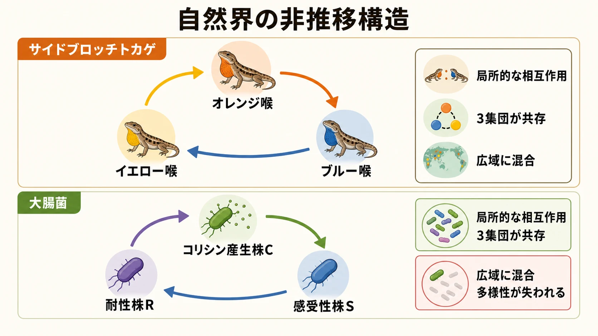
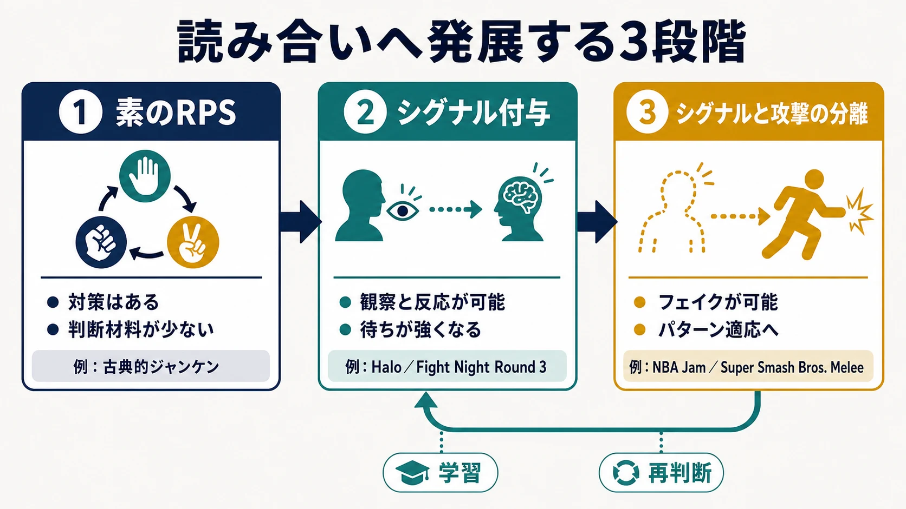
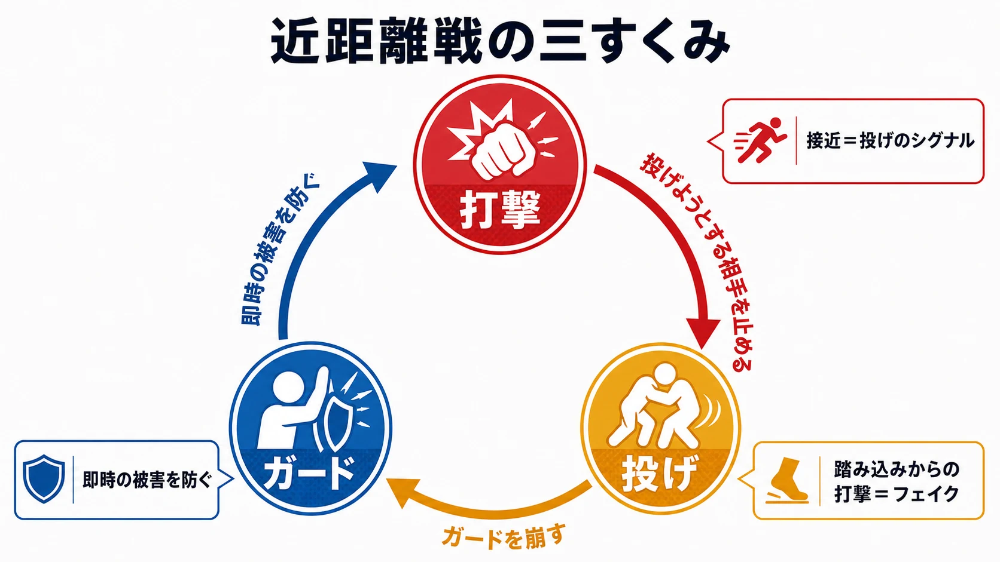
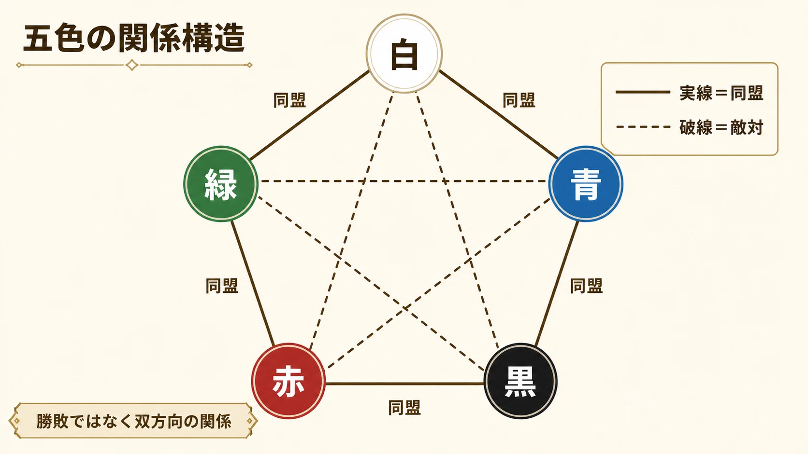

# 3すくみはなぜ最強手を作らないのか――ジャンケンから多角形へ広がる非推移バランス設計

対戦ゲームでは、勝つための手順が一つに固定された瞬間から、選択肢が見かけだけのものになっていく。相手が何を選んでも同じ行動が最善なら、プレイヤーが覚えるべきことは「正解を繰り返す」だけである。実力が伯仲するほど試合展開は似通い、キャラクター、兵種、カードを複数用意した制作コストも遊びの多様性につながらない。

この状態を避ける代表的な構造が、ジャンケンに象徴される **非推移的な優劣** である。AがBに勝ち、BがCに勝っても、AがCに勝つとは限らない。むしろCがAに勝つため、優劣は一直線の順位ではなく輪になる。Ian Schreiberは、このように単一の支配戦略がなく、すべての選択肢が別の何かに負ける関係を、ゲームにおける非推移メカニクスとして整理している。[[1](#ref-1)]

ジャンケンで重要なのは、 **勝てる手にも必ず天敵がいる** ため、一つの選択へ偏るほど対策されやすくなる点である。本稿では、この循環が自然界でどのように共存を支え、ゲームでは情報、時間、空間、コストと結びつくことで読み合いへ変わるのかを考える。

***

## 自然界では「最強の一種」の座が入れ替わり続ける

### サイドブロッチトカゲ――個体数が増えるほど天敵戦略に狙われる

SinervoとLivelyが1996年に『Nature』で報告したサイドブロッチトカゲの雄には、喉の色と結びついた三つの婚姻戦略がある。オレンジ喉の雄は攻撃的で広い縄張りを持ち、ブルー喉の雄は狭い縄張りで少数の雌を守る。イエロー喉の雄は雌に似た外見を利用し、ほかの雄の縄張りへ入り込む。

三者の繁殖上の優位は、 **オレンジ＞ブルー＞イエロー＞オレンジ** と循環する。オレンジはブルーの縄張りを奪える。ブルーは守る範囲が狭いためイエローの侵入を防ぎやすい。イエローは広い縄張りを一頭で守るオレンジの隙を突ける。研究では、各型の頻度が野外で6年間にわたり振動し、ある型が増えて一般的になると、それを攻略する型が侵入しやすくなるという頻度依存の関係が示された。[[2](#ref-2)]

ここには、全個体が同じ戦略へ収束しない理由がある。オレンジが強いという固定評価ではなく、「ブルーが多い環境ではオレンジが有利」「オレンジが多い環境ではイエローが有利」と、価値が周囲の構成によって変わるからである。ゲームで言えば、使用率の高い戦法ほどカウンターを採用する価値が上がり、そのカウンターが増えれば、さらに別の戦法が復権するメタゲームに近い。

### 大腸菌――出会い方が共存を左右する

Kerr、Riley、Feldman、Bohannanは2002年、三つの大腸菌集団を使って非推移的な競争を実験した。コリシン産生株Cは、毒素に弱い感受性株Sを殺す。耐性株RはCに殺されず、産生コストを負うCより増殖上有利である。一方、Sは耐性のコストを負うRより増殖が速い。したがって、 **C＞S＞R＞C** という循環になる。

重要なのは、同じ三者でも環境によって結果が変わったことだ。分散と相互作用が広い範囲で起こる条件では多様性が急速に失われたが、寒天平板上で相互作用が局所に限られる条件では三集団が共存した。[[3](#ref-3)] 非推移関係を用意するだけで、自動的に多様性が保たれるわけではない。 **誰が誰と、どの範囲で、どの頻度で出会うか** までが構造の一部なのである。

この知見をゲームへそのまま移植することはできないが、設計上の問いへ翻訳はできる。すべてのプレイヤーが同じランキング、同じ狭いマップ、同じ公開済み最適編成へ集約される環境と、地形、射程、目標、局所戦によって異なる役割が生まれる環境では、同じ相性表でも選択肢の生存率が変わる。バランス表だけでなく、マップとマッチングも非推移構造を成立させるのである。

***

## 素のジャンケンは、入口として強く、競技として脆い

古典的なジャンケンは、三つの手と三本の矢印だけで関係を説明できる。『甲虫王者ムシキング』もこの理解しやすさを入口にした作品である。カードを読み込んでグー、チョキ、パーを選び、勝てば甲虫が攻撃し、必殺わざに対応する手なら大きなダメージを与える。セガの公式資料は、幼稚園から小学校低学年を中心に普及した作品として紹介している。[[4](#ref-4)]

それでも、素のジャンケンを対戦システムの中心へ置く場合には、三つの弱点が現れる。

1. **同時決定を保証する必要がある**：片方の手を見てから選べるなら、後から決める側が必ず勝てる。対面では掛け声、デジタルゲームでは入力の秘匿、締め切り、通信同期が必要になる。
2. **観測できる情報が少ない**：相手の手が見えた時点で結果が確定し、見える前には履歴から偏りを読む以外の材料が乏しい。入力精度、位置取り、資源管理と結びつかなければ、上達を実感しにくい。
3. **あいこが進行を止める**：同じ手を相殺として扱うだけでは、決着までの入力回数が増える。引き分けを再試行にするのか、双方へ小さな利益や損害を与えるのか、別の状態へ移すのかを決めなければならない。

さらに、完全対称な三すくみでは、理論上は三つの手を同じ割合で混ぜることが基準になる。しかし人間は完全な乱数ではなく、癖を持つ。偏りを見抜く遊びは生まれる一方、キャラクター性能や盤面状態に手掛かりがなければ、「相手の癖が読めたか、偶然当たったか」を本人が判別しにくい。

したがって、三すくみは、 **選択肢を死なせないための骨格** と見るべきである。競技としての奥行きは、その骨格へ何を接続するかで決まる。

***

## シグナルとフェイクが「当てずっぽう」を読み合いへ変える

Victor Chelaruは2007年のGame Developer記事で、RPS型の対戦へシグナルとフェイクを加える方法を論じた。ここでいうシグナルとは、攻撃に先立って相手が観測できる向き、位置、予備動作、行動履歴などである。記事の論旨は、次の三段階として整理できる。[[5](#ref-5)]

### 第1段階：素のRPS――対策はあるが、判断材料がない

各攻撃に有効な防御や反撃があっても、入力と結果がほぼ同時なら、守る側は推測するしかない。選択肢の循環は保証されるが、知識や観察を勝率へ変換しにくい。これが古典的ジャンケンの段階である。

### 第2段階：シグナル――見てから学べるが、防御が強くなる

攻撃より先に読める情報を出すと、プレイヤーは失敗を学習できる。『Halo』では、射撃するために相手へ向き、照準を合わせる動作がシグナルになる。『Fight Night Round 3』の強打にはパンチが届く前の予備動作があり、グローブの位置、間合い、過去の連係も判断材料になる。

シグナルは、攻撃ごとに有効な対策があること、観測できること、反応可能な時間差があることの三条件を満たすと学習を支えやすい。負けた側は「次はこの動きを見たら防ぐ」と考えられるため、敗北が再挑戦の課題へ変わる。

ただし、熟練者がすべてのシグナルを見て確実に反応できるなら、先に攻撃する理由がなくなる。攻撃を待って反撃する「待ち」が最適化され、RPSの循環が防御優位の停滞へ収束する。

### 第3段階：シグナルと攻撃を分離する――フェイクを可能にする

そこで、攻撃には必ずシグナルを伴わせながら、シグナルを出した後に攻撃しない選択を認める。守る側は最初の兆候だけで対策を確定できず、攻撃側は相手の反応を引き出して別の行動へ移れる。

『NBA Jam』では、シュートのシグナルとなるジャンプを始めた後、空中でパスへ切り替えられる。初心者にはジャンプとシュートが結びついて見えるが、熟練者は空中パスで守備を動かせる。『Super Smash Bros. Melee』では、攻撃範囲と位置取りがシグナルになる。リンクが相手の上空にいれば下方向への攻撃を警戒させられるが、二段ジャンプや空中回避へ変えて、上方向の迎撃を空振りさせることもできる。

Chelaruの到達点は、 **相手のパターンを見つけ、自分のパターンが見抜かれる前に変える** ことにある。シグナルが学習を可能にし、フェイクが学習済みの反応を再び疑わせる。この往復が、単純な三本の矢印へ長期的な上達余地を加える。

***

## 格闘ゲームの投げ・打撃・ガードは、時間と距離を含む三すくみである

格闘ゲームの近距離戦は、典型化すると **打撃＞投げ＞ガード＞打撃** の循環として説明できる。ガードは打撃を防ぎ、投げはガードを崩し、発生前の投げは素早い打撃で止められる。ただし、実際の作品では投げ無敵、打撃無敵、上段・下段、投げ抜け、削り、フレーム差などがあり、この関係が常に成立するわけではない。

面白さは、三つの選択に異なる条件が付いている点から生まれる。

- **投げ** はガードを崩せるが、届く距離まで近づく必要がある。
- **打撃** は投げようとする相手を止められるが、ガードされれば反撃や不利を背負うことがある。
- **ガード** は即時の被害を抑えるが、投げや削り、画面端への運搬を許す。

接近そのものが投げのシグナルになり、踏み込みから打撃へ移ればフェイクになる。防御側も、投げを読んで暴れるのか、打撃を読んでガードを続けるのか、距離を離すのかを選ぶ。さらに、技の発生、硬直、リターンが非対称なので、同じ読み勝ちでも得られる報酬は等しくない。

ここでは三すくみが、相手の距離、ゲージ、過去の行動を読ませ、どの矢印が現在もっとも起こりやすいかを推測させる仕組みとして働いている。格闘ゲームの歴史やフレームデータ自体は[対戦格闘ゲームはいかに成立したか](fighting-game-genre-history.md)で扱っているが、非推移構造の観点では、 **反応できるシグナルと、確定反応を外すフェイクの両方を残すこと** が読み合いの核になる。

***

## RTSでは、相性表を生産と空間へ接続する

SchreiberはRTSの典型例として、 **飛行ユニット＞歩兵＞弓兵＞飛行ユニット** という循環を挙げる。またターン制戦略ゲームの例は、優位側から書けば **対戦車歩兵＞重戦車＞通常歩兵＞対戦車歩兵** となる。[[1](#ref-1)] 「重戦車は高価だからすべてに強い」という直線的な序列を避け、安価な通常歩兵にも役割を残す構造である。

RTSの非推移性が一回のジャンケンで終わらないのは、兵種を出すまでに資源、建設時間、索敵、移動、編成枠が必要だからだ。敵の重戦車を見てから対戦車歩兵を用意しても、前線へ着くまでに拠点を失うかもしれない。対戦車歩兵へ偏れば、相手の通常歩兵に押し切られる。対策兵を「持っているか」だけでなく、「いつ生産を始めたか」「どこに置いたか」「相手に見せたか」が勝敗を分ける。

設計時には、相性倍率だけでなく次の四点を同時に見る必要がある。

1. **発見から接敵までの猶予**：偵察に成功したプレイヤーが対策を間に合わせられるか。
2. **転換コスト**：生産施設、資源、時間を別兵種へ振り直す重さが適切か。
3. **局所的な有効性**：射程、地形、移動速度によって、劣勢兵種にも働ける場所があるか。
4. **混成部隊への動機**：一兵種への集中が、カウンター一種類で完全に崩れるだけの単調な罰になっていないか。

非推移関係は、暴走する支配戦略への非常ブレーキにはなる。しかしSchreiberも、それだけをバランス調整の代わりにすべきではないと注意する。すべてに天敵がいても、その天敵の生産が遅すぎる、用途が狭すぎる、操作負荷が高すぎるなら、実戦では使われない。矢印の存在と、対策が実行可能であることは別問題である。

***

## 「3」を超えると、相性は盤面を読む言語になる

### Magic: The Gathering――五角形が担う役割分担

『Magic: The Gathering』のカラーパイは、白、青、黒、赤、緑の五色が輪を作り、各色が隣接する二色と同盟し、向かい側の二色と敵対する五角形の構造を持つ。Mark Rosewaterは、2021年の公式記事群でカラーパイを思想、メカニクス、色同士の対立と同盟を結ぶゲームの基盤として整理している。[[6](#ref-6)] 各色に二つの同盟色と二つの敵対色があることも、公式記事で明示されている。[[7](#ref-7)]

カラーパイが分配するのは、各色が得意な行為、不得意な行為、他色と組んだときに補える欠点である。単純な「白が青に勝ち、青が黒に勝つ」という勝敗関係とは異なる仕組みだ。五角形にすることで、単色、隣接二色、敵対二色という異なる組み合わせへ意味を与えられる。

この構造は、非推移設計を「直接のダメージ倍率」から「能力と欠点の組み合わせ」へ広げたものと読める。選択肢を増やすと矢印の本数は増えるが、色、位置、物語上の対立が記憶の手掛かりになる。学習コストを、フレーバーと視覚配置で支える設計である。

### ポケモン――御三家の入口と、18タイプの戦略網

ポケモンのタイプ相性は、狭義と広義の二層を持つ。入口には **みず＞ほのお＞くさ＞みず** という覚えやすい三すくみがある。最初に選ぶポケモンの三タイプとして提示されるため、子どもでも自然現象の連想から優劣を理解しやすい。

その先には、複合タイプ、技のタイプ、無効、耐性を含む相性網がある。公式の『ポケットモンスター Ｘ・Ｙ』サイトによれば、初代『赤・緑』は15タイプで始まり、『金・銀』であくとはがねが加わり、2013年にフェアリーが18番目のタイプとして追加され、現在の18タイプ体制になった。[[8](#ref-8)]

18タイプ全体は、攻撃側と防御側で関係が異なり、複数の弱点や耐性を持ち、組み合わせによって相性が変わる、複雑な相性網を成している。ほのお・みず・くさの三すくみはオンボーディングの小さな窓であり、全体の相性表は編成と交代を考える長期的な学習対象である。

この二層化により、初心者は三本の矢印から始め、経験者は多数の関係を圧縮して覚えられる。[ポケモンはなぜ巨大IPであり続けるのか](pokemon-global-ip-core-game-design.md)ではタイプ相性をシリーズ共通の骨格として扱ったが、本稿の焦点は、その骨格が **単純な入口と複雑な熟達領域を同時に持つ非推移構造** である点にある。

***

## 実務では、矢印の数より「いつ読ませるか」を決める

対称的な三すくみは、説明が速く、勝因と敗因を示しやすい。非対称な多角形構造は、編成、構築、局面転換を豊かにできるが、プレイヤーが覚える関係と制作側が検証する組み合わせを増やす。選ぶべき構造は、ゲームの規模よりも、プレイヤーがどれだけの時間を使って関係を学ぶ設計なのかで変わる。

| 想定条件 | 向いている構造 | 設計上の重点 |
|---|---|---|
| 低年齢層、短時間、一回ごとの決着が明快 | 対称的な三すくみ | アイコン、音、色で優劣を即座に伝える |
| アクション対戦、短い試合を反復 | 三すくみ＋シグナル＋フェイク | 予備動作、間合い、反応時間、待ち対策を調整する |
| RTS、TCG、チーム編成 | 非対称な3～5以上の役割循環 | 生産・構築・偵察・転換コストを相性と結ぶ |
| 長時間の育成、継続的な対戦環境 | 多数のノードを持つ相性網 | 段階的な学習、使用率監視、更新時の影響範囲を整える |

実装前には、少なくとも次の順で検討したい。

1. 各選択肢が「何に勝つか」だけでなく、 **何に負けることで存在を許されるか** を書く。
2. 優劣を矢印で描き、循環から外れて一方的に勝つノードがないか調べる。
3. 対策を知ったプレイヤーが、実際に反応・生産・交代できる時間とコストを確認する。
4. シグナルが弱すぎて当てずっぽうになっていないか、強すぎて待ちが最善になっていないかを見る。
5. 全体使用率だけでなく、マップ、ランク帯、対戦時間、編成別に局所的な支配戦略を探す。
6. 初心者へ見せる小さな循環と、熟練者が発見する広い相性網を分ける。

三すくみの目的は、 **強さを状況と相手に依存させ、選び直す理由を残すこと** にある。対称なジャンケンは、その原理を最小の形で見せる。ゲームが長く複雑になるほど、設計者はそこへ情報、時間、空間、資源、役割の非対称性を足していく。

単一の最強手を消すだけなら、三本の矢印で足りる。その三本を、観察して学び、予測して裏切り、編成を組み替える遊びへ育てることが、非推移バランス設計の仕事である。

## References

1. [Ian Schreiber「Level 9: Intransitive Mechanics」][1] - 単一の支配戦略を避ける非推移メカニクスと、RTS・ターン制戦略ゲームの相性例を解説した記事。

2. [Barry Sinervo and Curt M. Lively「The rock-paper-scissors game and the evolution of alternative male strategies」][2] - サイドブロッチトカゲの三つの雄型と、頻度依存で循環する繁殖戦略を報告した論文。

3. [Benjamin Kerr et al.「Local dispersal promotes biodiversity in a real-life game of rock-paper-scissors」][3] - 大腸菌三集団の非推移的競争と、局所的な相互作用が共存を支える条件を検証した論文。

4. [セガ「甲虫王者ムシキング」][4] - 遊び方と、幼稚園から小学校低学年を中心に普及した経緯を紹介する公式製品ページ。

5. [Victor Chelaru「Rock, Paper, Scissors - A Method for Competitive Game Play Design」][5] - RPS型対戦へシグナルとフェイクを加え、観察とパターン適応を生む方法を論じた記事。

6. [Mark Rosewater「Let's Talk Color Pie」][6] - Magic: The Gatheringのカラーパイを、各色の思想とメカニクスから整理した公式記事。

7. [Mark Rosewater「Thank You for Being a Friend」][7] - 各色が二つの同盟色と二つの敵対色を持つ関係を解説した公式記事。

8. [ポケットモンスターオフィシャルサイト「新タイプ『フェアリー』登場！」][8] - 初代の15タイプから、あく・はがね、フェアリーが加わり18タイプになった経緯を示す公式ページ。

[1]: https://gamebalanceconcepts.wordpress.com/2010/09/01/level-9-intransitive-mechanics/
[2]: https://doi.org/10.1038/380240a0
[3]: https://doi.org/10.1038/nature00823
[4]: https://www.sega.jp/history/arcade/product/8855/
[5]: https://www.gamedeveloper.com/design/rock-paper-scissors---a-method-for-competitive-game-play-design
[6]: https://magic.wizards.com/en/news/making-magic/lets-talk-color-pie
[7]: https://magic.wizards.com/en/news/making-magic/thank-you-being-friend-2017-03-20
[8]: https://www.pokemon.co.jp/ex/xy/battle/01.html

----

この文書は、Perplexity、Claude、OpenAI Codex の3つのAIの支援を受けて著述されたものです。引用画像を除き、MIT License にて提供されています。
