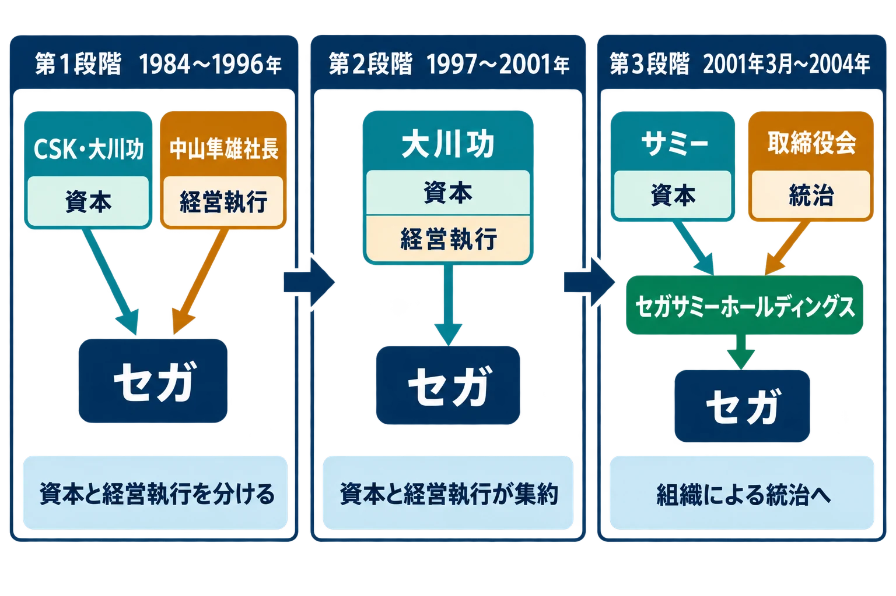
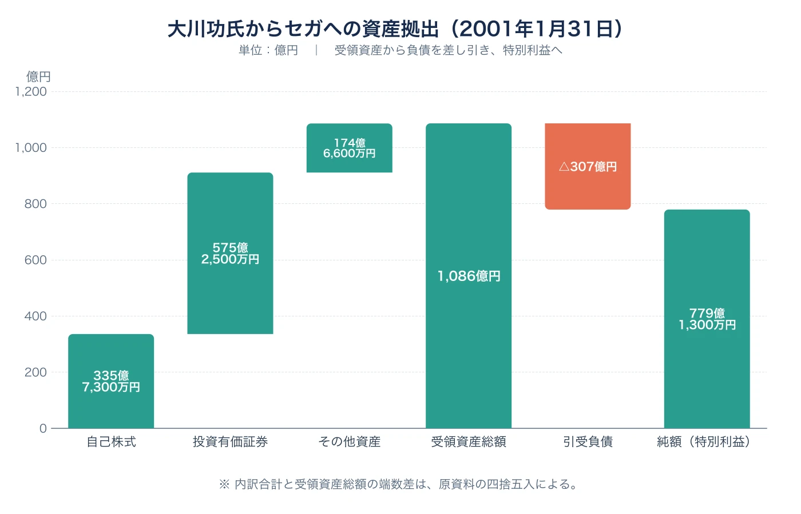

# 大川功評伝：セガに779億円を遺した「最後のオーナー経営」

2001年1月31日、セガはドリームキャストの生産中止と、コンテンツ・アミューズメント事業へ経営資源を集中する構造改革を発表した。同じ日の取締役会は、会長兼社長だった大川功からの私財拠出の提案を受諾している。会計上、セガが受け取った資産は総額1,086億円、引き受けた負債を差し引いた純額は779億1,300万円であり、特別利益として計上された。[[1](#ref-1)]

この出来事は、ときに「創業者が愛する会社を救った」という美談として語られる。しかし、そこで止まると、ゲーム事業の意思決定にとってもっと重要な点を見落とす。大川の信用、資産、決断が危機時に強い資金調達力になった一方、その力は個人に結び付いていた。2001年3月の死去後、CSKとセガの資本関係は別の資本の論理で組み替えられ、2004年にはセガサミーホールディングスが発足する。

本稿は、大川功を名経営者として称賛するための評伝ではない。資本を出しながら経営を委ねる段階、オーナー本人が前面へ出る段階、そして不在後に統治を組み替える段階を追い、個人に依存する経営の効用と限界を考える。

| 年 | 出来事 | 統治構造の変化 |
| --- | --- | --- |
| 1968年 | 大川がコンピュータサービス株式会社を創業 | 創業者が資本と事業構想を担う |
| 1980年 | ソフトウェア企業として初の店頭公開 | 資本市場への入口を得る |
| 1984年 | CSKがセガに資本・経営参加 | 大川は資本参加し、中山隼雄に日々の経営を委ねる |
| 1997年〜 | 大川がセガ経営に本格関与 | オーナーの判断が技術・事業戦略へ近づく |
| 2000年6月 | 大川がセガ会長兼社長に就任 | 権限と責任が本人へ集中する |
| 2001年1月31日 | 構造改革と私財拠出を取締役会が決定 | 個人資産が会社再建の原資となる |
| 2003年12月 | CSKが保有セガ株をサミーへ売却 | 資本の担い手が交代する |
| 2004年10月 | セガサミーホールディングス設立 | 共同持株会社による統治へ移る |

*図：大川功とセガの統治構造の三段階。第3段階ではCSKの保有株がサミーへ譲渡され、持株会社と取締役会による統治へ移った。*

***

## 1. コンピューター産業の「予兆」を事業にした創業者

大川功は1926年に大阪で生まれ、早稲田大学専門部工科を卒業した。長い療養生活の後に家業や繊維問屋、タクシー事業に関わり、計算代行業の経験を経て、1968年10月に大阪でコンピュータサービス株式会社を設立した。のちのCSKである。[[2](#ref-2)][[3](#ref-3)]

当時のコンピューターは、今日のゲーム開発環境のように一人一台で触る道具ではなかった。大企業や官公庁が大型計算機を使い、その利用、運用、ソフトウェア開発を引き受ける事業が成り立った。大川は計算処理の需要が広がる時代を捉え、少人数の会社を情報サービス企業群へ成長させた。1980年にはソフトウェア企業として初めて株式を店頭公開し、1982年には東京証券取引所市場第二部に上場した。[[3](#ref-3)][[4](#ref-4)]

ここで押さえたいのは、上場が大川を「資金を出す人」から解放したわけではない点である。株式市場は成長資金と説明責任をもたらすが、創業者が持つ構想、信用、人脈を自動的に組織へ移すわけではない。CSKは投資先を増やす企業グループとなり、大川は資本の配分を通じて次の産業を探す立場になった。

### セガへの参加は、まず委任から始まった

1984年、CSKグループはセガ・エンタープライゼスに資本・経営参加した。セガは公式沿革でも、この年にCSKグループの一員になったと記録している。[[5](#ref-5)] 大川は会長に就いたが、社長として日々の事業を担ったのは中山隼雄である。資本参加後も中山が続投したことは、当時を知る関係者の記録でも確認できる。[[6](#ref-6)]

これは、単純な放任ではない。資本を引き受け、会長として大枠の方向を示しながら、製品、人員、販売の判断を経営者へ任せる形である。オーナーの信用は背後にあるが、現場の意思決定は委任を受けた経営チームが担う。資本の安定と現場の裁量を両立させられるなら、これは強い構造である。

ただし、この構造が機能する条件は、委任先が自力で危機を処理できることだ。損失が大きく、次の技術転換に賭ける原資まで必要になると、最終的な資本の持ち主に判断が戻る。セガでは、ドリームキャストをめぐる局面でその境目が表れた。

***

## 2. ドリームキャスト期、オーナーは技術選択の近くへ来た

大川は1997年6月にセガの代表権を持ち、経営へ本格的に関与し始めたと、自身が2000年の事業計画説明会で振り返っている。[[7](#ref-7)] この変化は、取締役会の肩書きだけの話ではなかった。次世代機とネットワークを、会社を立て直す事業の中心に置く判断へ結び付いた。

ドリームキャストは1998年に発売された。モデムを標準搭載する決断は大川の強い意向によるものだったと、ハード開発を率いた佐藤秀樹は後年のインタビューで証言している。[[8](#ref-8)] まだ家庭の通信環境がダイヤルアップ中心だった時代に、全台へ通信機能を載せることは、部品原価だけでなく、対応ソフト、接続サービス、サポートを含む事業全体への賭けである。

この選択が何を残したかは、[家庭用ゲーム機におけるオンライン接続の歴史](console-online-gaming-history.md)でも扱った。ドリームキャストのネットワーク機能は、後のオンラインゲームの先行例になった。一方で、先行する技術選択が、それだけでハード事業の採算や組織の継続を保証するわけではない。技術の正しさと、投資を回収できる時期・規模は別に検証しなければならない。

2000年6月、大川はセガの会長兼社長となり、入交昭一郎は代表取締役副会長へ異動した。発表時、入交はコンシューマ事業とアミューズメント事業のブロードバンド・サービス実現に向けたプロジェクトを指揮するとされた。[[9](#ref-9)] 委任するオーナーから、社長を兼任して再建を主導するオーナーへ。この人事は、危機の責任と最終判断を大川自身へ集めた。

属人的な統治は、こうした局面で速い。外部資金の合意形成を長く待たず、技術への信念と手元の資産を一つの判断に接続できる。反面、技術・事業・資本の三つを一人が結び付けるほど、その人がいなくなった後に何を残すかという問いも重くなる。

***

## 3. 779億円は、寄付の見出しではなく取締役会の決定である

2001年1月31日、セガはドリームキャストの生産中止を決め、収益回復へ向けた構造改革計画を示した。同日の取締役会で、大川は自らの資産をセガへ拠出する案を提案し、会社はこれを受諾した。セガの年次報告書は、この取引を"Donated assets"（寄贈された資産）として会計処理している。[[1](#ref-1)]

会計上の内訳は、次の通りである。

| 区分 | 金額 |
| --- | ---: |
| 自己株式 | 335億7,300万円 |
| 投資有価証券 | 575億2,500万円 |
| その他資産 | 174億6,600万円 |
| 受領資産総額 | 1,086億円 |
| セガが引き受けた負債 | △307億円 |
| 純額（特別利益） | 779億1,300万円 |

*図：2001年1月31日に大川功からセガへ拠出された資産の内訳と、引受負債を差し引いた純額。出典：[[1](#ref-1)]。*

大切なのは、見出しの大きさではなく、会社の財務にどう入ったかである。セガが受け取ったのは現金だけではなく、自己株式や有価証券などの資産であり、負債も同時に引き受けた。したがって、会社が特別利益として認識したのは、資産総額1,086億円ではなく、負債を控除した779億1,300万円である。[[1](#ref-1)]

当時の訃報では「約850億円の私財を寄付」とも報じられた。[[10](#ref-10)] この表現は当時の大きな出来事を伝える丸めた報道上の呼び方であり、会計上の確定額と同じ意味ではない。本稿では、総額と純額が示された一次資料に従い、779億1,300万円をセガの特別利益として扱う。また、1997年以降に大川が複数回にわたり私財を投じていたとされるが、累計額は資料ごとに算出範囲が異なるため、ここに特定の数字を重ねない。

この決断には個人的な時間の制約もあった。大川は2000年にがんの診断を受け、その後の検査で病変が消えたことを公に語っている。[[11](#ref-11)] がん闘病を私財拠出の単一の原因と断定することはできない。それでも、会社の再建を引き受けた本人が自身の生命にも向き合っていた事実は、後継者へ長期にわたり委ねるのではなく、その時点で資産を差し出す決断が持った切迫性を理解する背景になる。

ここには、オーナー経営の強みが最も濃く現れている。債権者、株主、事業責任者が別々にいる会社なら、巨額の再建資金を迅速にまとめるには交渉と承認が要る。大川の場合、資産を出す決断と会長兼社長としての事業判断を一つの意思で結べた。

しかし、それは会社の通常の資金調達手段ではない。取締役会が受諾したとしても、再建の前提の一部が個人の資産と信用に置かれる構造である。取締役会の決議は、その個人を継承する仕組みにはならない。

***

## 4. 死去後に残ったのは、理念ではなく資本関係を選び直す課題だった

大川は2001年3月16日、心不全で死去した。74歳だった。[[10](#ref-10)] 1月末の取締役会から6週間余りである。セガの2001年年次報告書には追悼文とともに、ネットワーク社会への展望、そして資産拠出の会計処理が並んでいる。そこに、個人の構想と会社の財務が極めて近い距離にあったことが表れている。[[1](#ref-1)]

個人が不在になった後、CSKが保有していたセガ株は、同じ個人の裁量で引き受けられるものではなかった。2003年12月、CSKは保有していたセガ株39,148,600株、発行済株式の22.4%[[12](#ref-12)]をサミーへ453億3,400万円で譲渡した。サミーはセガの筆頭株主となった。[[13](#ref-13)]

ここで起きたのは、単に株主名簿の名前が替わったことではない。CSKと大川の組み合わせは、情報サービスを母体に、ゲーム、ネットワーク、コンテンツを結ぶ未来像を支えていた。サミーへの移行後は、遊技機事業で得た収益とセガのコンテンツ・アミューズメントの強みを組み合わせる、別の事業構想が統治の軸になった。

2004年10月1日、セガとサミーは共同持株会社であるセガサミーホールディングスを設立し、両社はその完全子会社となった。[[14](#ref-14)][[15](#ref-15)] 大川の個人資産による支援は繰り返されなかった。その代わりに、持株会社、株主総会、取締役会、各事業会社という形で、資本の供給と事業の責任を分ける統治へ移ったのである。

この移行を「大川の時代が終わったから失敗」と読む必要はない。個人の決断で救える局面を、組織として永続させるには、個人の遺志だけでは足りない。資本を誰が供給し、何を成果とし、どの事業へ投資するのかを、次の所有者と取締役会のルールとして設計し直さなければならない。セガサミーの成立は、その再設計の一つであった。

***

## 5. プランナーが受け取るべき問い――「誰かが何とかする」を設計に入れていないか

大川功の軌跡は、先見性のあるオーナーが技術の転換期に果断な投資を行った話である。同時に、それだけ強い個人がいること自体を、組織の安全網にしてしまう危うさの話でもある。

ゲーム開発の現場にも、小さな形で似た構造がある。プロデューサーが赤字を補う、創業者が最後に仕様を決める、特定のリードが取引先との信頼を一身に背負う。こうした人がいることは、危機を越える力になる。だが、その人が異動、退職、病気、あるいは判断の変更をした瞬間にも、プロジェクトは進められるだろうか。

企画を立てるとき、プランナーは次の問いをチームへ返せる。

1. この企画の成立条件を、特定の個人の信用、資金、交渉力に置いていないか。
2. その人がいなくなっても、誰が優先順位と撤退基準を決めるのか。
3. 技術への先行投資を、いつ、どの売上・利用・継続率で見直すのか。
4. 「救済策」が必要になったとき、その負担と意思決定を取締役会やチームのルールへ残せているか。

ドリームキャストのモデム標準搭載は、未来を見据えた技術選択だった。779億1,300万円の拠出は、その未来へ届くために資本を差し出した決断だった。だが、優れた決断を一度下すことと、その決断を支える統治を次代へ渡すことは別の仕事である。大川功評伝が現代のプランナーに残すのは、英雄を待つ問いではない。英雄がいなくても企画と組織が続くように、何を今から合意し、記録し、分けておくべきかという問いである。

## References

1. [SEGA CORPORATION, Annual Report 2001][1] - 2001年1月31日の構造改革、取締役会で受諾された大川功氏の資産拠出、および会計上の内訳・純額を確認した一次資料。

2. [大川功について｜大川ドリーム基金][2] - 生年、学歴、療養後の経歴、1968年の創業、2001年の死去を確認した。

3. [コンピューターの時代という「予兆」を捉えたCSK大川功｜ダイヤモンド・オンライン][3] - 1968年の創業と1980年の店頭公開時の状況を参照した。

4. [沿革｜SCSK株式会社][4] - コンピュータサービス株式会社の1968年設立と、1982年の東京証券取引所市場第二部上場を確認した。

5. [沿革｜株式会社セガ][5] - 1984年のCSKグループ資本参加と、2004年のセガサミーホールディングス設立を確認した。

6. [佐藤秀樹第3回インタビュー前半｜一橋大学イノベーション研究センター][6] - 1984年のCSK資本参加後の中山隼雄の続投に関する証言を参照した。

7. [CSKグループ総帥の大川功氏，セガについて大いに語る（1）｜ITmedia][7] - 1997年からの本格関与と、ネットワーク事業をめぐる大川氏自身の発言を参照した。

8. [『セガハードヒストリア』佐藤秀樹インタビュー｜Beep21][8] - ドリームキャストへのモデム標準搭載を大川氏の意向とする開発者証言を参照した。

9. [セガ、入交社長が退任、大川会長が兼任へ｜PC Watch][9] - 2000年6月の人事と入交昭一郎氏の担当を確認した。

10. [【訃報】セガ会長兼社長、大川功氏逝去｜GAME Watch][10] - 2001年3月16日の死去と、当時の「約850億円」という報道表現を確認した。

11. [CSKグループ総帥の大川功氏，セガについて大いに語る（2）｜ITmedia][11] - 大川氏ががんの診断・検査について語った当時の報道を参照した。

12. [第29期事業報告書｜サミー株式会社][12] - 2003年12月のCSKからのセガ株式39,148,600株（発行済株式22.4%）取得を確認した一次資料。

13. [サミーがセガ筆頭株主に　CSKが全株式売却｜ITmedia][13] - 2003年12月のCSKによる全保有株売却、取得割合、取得金額を確認した。

14. [Annual Report 2004｜Sammy][14] - 2003年12月の22.4%取得と、2004年10月の共同持株会社設立を確認した一次資料。

15. [株式の状況｜セガサミーホールディングス][15] - 2004年10月1日の経営統合と共同持株会社設立を確認した。

[1]: https://www.segasammy.co.jp/cms/wp-content/uploads/pdf/ja/ir/sega_annual_tuuki_2001.pdf
[2]: https://okawa-dream.net/about/ookawa/
[3]: https://diamond.jp/articles/-/218142
[4]: https://www.scsk.jp/corp/history.html
[5]: https://www.sega.co.jp/company/history/index.html
[6]: https://hit-u.repo.nii.ac.jp/record/2058004/files/070iirWP18-20.pdf
[7]: https://www.itmedia.co.jp/news/0011/01/csk_m.html
[8]: https://note.com/beep21/n/nf51cfff6349a?magazine_key=m354d9d640505
[9]: https://pc.watch.impress.co.jp/docs/article/20000529/sega.htm
[10]: https://game.watch.impress.co.jp/docs/20010316/sega.htm
[11]: https://www.itmedia.co.jp/news/0011/01/csk_m2.html
[12]: https://www.segasammy.co.jp/cms/wp-content/uploads/pdf/ja/ir/sammy_jigyo_tuuki_2004.pdf
[13]: https://www.itmedia.co.jp/news/0312/08/njbt_01.html
[14]: https://www.segasammy.co.jp/cms/wp-content/uploads/pdf/en/ir/e_sammy_annual_tuuki_2004.pdf
[15]: https://www.segasammy.co.jp/ja/ir/stock/overview/

----

この文書は、Perplexity、Claude、OpenAI Codex の3つのAIの支援を受けて著述されたものです。引用画像を除き、MIT License にて提供されています。
