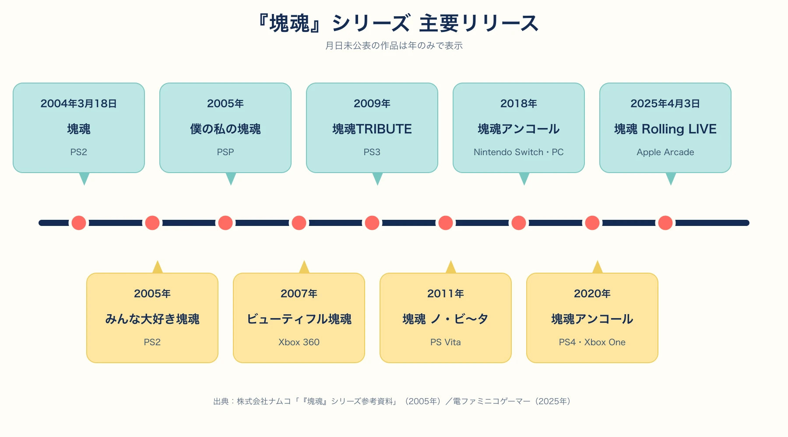
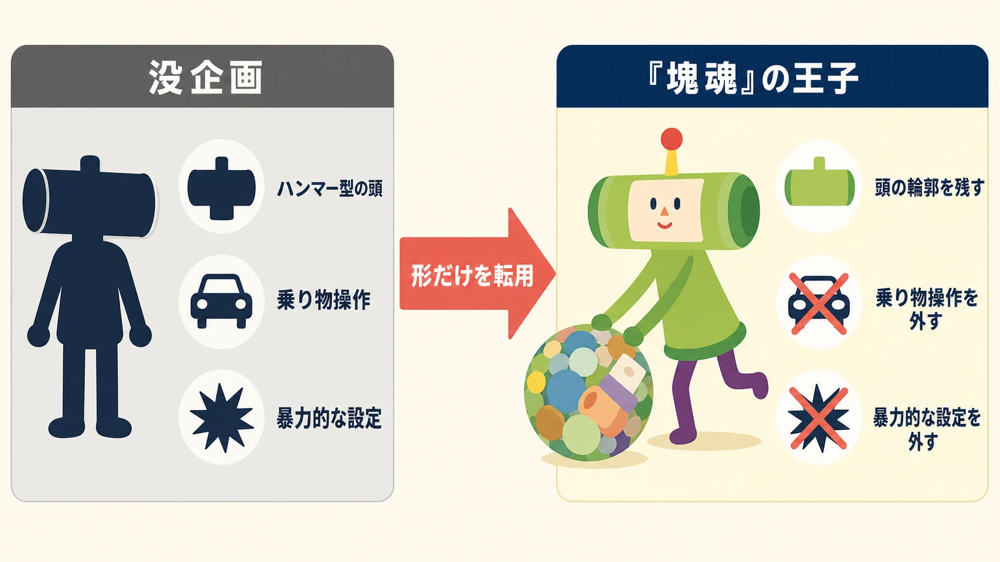
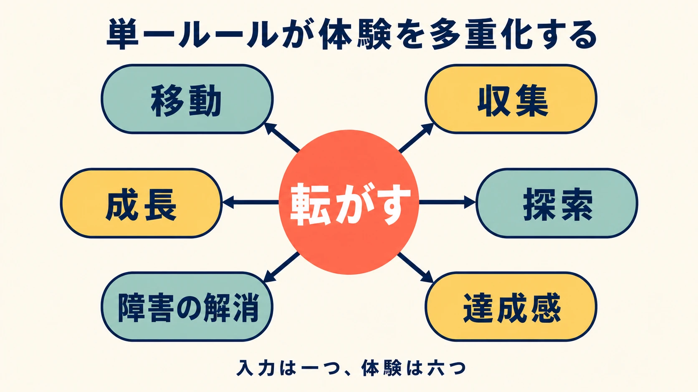

# 『塊魂』は、なぜ新人プランナーの参考になるのか――単一ルールと限られた資源から生まれた設計判断

## 第1章：役員面接で落ちかけた新人は、なぜ20年以上続くシリーズを生んだのか

2004年3月18日、ナムコはPlayStation 2向けに『塊魂』を発売した。王子を操作して塊を転がし、塊より小さなモノを巻き込みながら大きくするアクションゲームである。塊が大きくなれば、それまで障害物だったモノも巻き込めるようになり、越えられなかった段差の先へ進める。ルールは短く説明できるが、プレイヤーが見つける風景と手触りは段階ごとに変わる。[[1](#ref-1)]

その後、代表的な展開を挙げると、2005年には『みんな大好き塊魂』と『僕の私の塊魂』、2007年には『ビューティフル塊魂』、2009年には『塊魂TRIBUTE』、2011年には『塊魂 ノ・ビ〜タ』が発売された。2018年にはリマスター版『塊魂アンコール』がNintendo SwitchとPCで発売され、2020年にはPlayStation 4とXbox Oneにも展開された。さらに2025年4月にはApple Arcadeで『塊魂 Rolling LIVE』が配信されている。最初の発売から20年以上を経ても、「塊を転がして巻き込む」という核は新作の説明文にも残っている。[[1](#ref-1)][[2](#ref-2)][[3](#ref-3)]

評価も早かった。2005年のGame Developers Choice Awardsでは『塊魂』がBest Game Designを受賞し、Game Innovation Spotlightsにも選出された。Best GameとBest Character Designではファイナリストに名を連ねている。[[4](#ref-4)] 国内でも同年までに文化庁メディア芸術祭審査委員会推薦作品やCESA GAME AWARDSでの受賞が続き、2004年グッドデザイン賞も受けた。海外では第8回Interactive Achievement Awardsで「Outstanding Achievement in Game Design」と「Outstanding Innovation in Console Gaming」の2部門を受賞している。[[1](#ref-1)]

しかし、この結果を「奇抜な発想が偶然当たった話」として読むと、新人プランナーが持ち帰れるものは少ない。本稿が追うのは、発想の珍しさではなく、何を早く決め、何を増やさず、どこに限られた制作力を配ったかという設計判断である。

*図：『塊魂』シリーズの主要リリース。月日が公表されていない作品は年のみで示した。出典：References [[1](#ref-1)][[3](#ref-3)]。*

***

## 第2章：完成しなかった企画を抱えたCGデザイナーが、実験班に入った理由

高橋慶太は武蔵野美術大学で彫刻を学び、1999年にナムコへ入社した。配属はCGデザイナーだったが、当時に関わった企画は完成に至らなかったという。[[5](#ref-5)][[6](#ref-6)][[7](#ref-7)]

入社前の役員面接では一度落ちたものの、後に上司となる人物が、高橋の制作物からゲームデザインの可能性を見出して入社を後押しした。配属先は実験的なゲームを作る部署だった。ここで重要なのは、「経験が不足していたから特別に自由を与えられた」という筋書きではない。既存企画の職能としては成果を出せなかった一方で、立体作品を通して示していた発想と、それを評価できる上司・組織の目的が接続したのである。[[5](#ref-5)]

高橋と上司に共通していた問いは、スポーツ、レース、シューティングの模倣ではない、ゲームにしか表現できない感情や遊びを作れないか、というものだった。これは「前例のないジャンル名を考える」こととは違う。現実にある行為を画面へ移植する前に、入力、画面、反復によって初めて成立する体験を探す問いである。[[5](#ref-5)]

新人プランナーにとって、この経緯は得意分野の肩書きだけで自己紹介を終えないことを示す。企画書の出来栄えだけでなく、普段作っているものから、どのような観察をし、何を面白いと感じ、何をゲームの体験へ変えられるかを伝える。その情報が、まだ実績のない人を実験へ参加させる判断材料になる。

***

## 第3章：帰りの電車の着想を、翌日の一言で検証する

『塊魂』の原型は、会社からの帰り道に高橋の頭に浮かんだ。「塊を転がしてモノをくっつけ、大きくする」という発想である。翌日、友人にその内容を話すと、ゲームになりそうだという反応が返ってきた。この短いやりとりが、頭の中の像を他者と共有できる遊びへ変える最初の検証になった。[[6](#ref-6)]

ここで試されたのは、操作説明の細部でも、何十ページもの企画書でもない。「何をして、何が変わるか」を一息で伝えられるかである。塊を転がす。小さなモノが付く。大きくなれば、次のモノが付く。この因果が聞き手に届けば、プロトタイプで確かめるべき問いも明確になる。

実際に開発は、全体で約1年半、そのうちプロトタイピングが8か月を占めた。開発の初期に長く試作したのは、見栄えを先に完成させるためではない。転がすことが本当に楽しいか、塊の成長で行動範囲が変わることを一つの遊びとして保てるかを確かめるためである。[[7](#ref-7)]

若手が真似すべきなのは、通勤中のひらめきを待つことではない。ひらめきを得たら、翌日には誰かへ話し、相手が同じ遊びを想像できるか確かめることである。説明が長くなる箇所は、企画の弱点ではなく、次にプロトタイプで検証する場所を教えてくれる。

***

## 第4章：ボツ企画のハンマー頭を、王子のシルエットへ転用する

王様と王子は、もともと自由に走り回るドライビングゲームのために考えられたキャラクターだった。その案では、人を殴って気絶させ、車を奪う設定が含まれていた。王子の頭がハンマー型なのは、この没企画に由来する。『塊魂』では役割を失ったはずの形が、王子を一目で見分けられるシルエットとして残った。[[6](#ref-6)]

これは、没企画を丸ごと再利用した成功例ではない。暴力的な行為やドライビングという遊びの前提は捨て、頭部の形、王様と王子の関係、非現実的な存在感だけを取り出し、新しいルールに合わせ直している。資産の転用では、「既に作ったから残す」と考えると企画が濁る。新しい体験に必要な機能を持つ部分だけを残す必要がある。

キャラクターデザインとしても、これは有効な判断である。プレイ中、王子は小さく、画面上では塊や大量のオブジェクトに隠れやすい。細かな装飾より、遠目でも判別できる頭の輪郭の方が、操作対象を見失わせない。キャラクターのシルエットは宣伝用の絵だけでなく、ゲーム内で認識させるためのUIでもある。

*図：没企画の要素を丸ごと残さず、新しい体験に必要な形だけを転用する。*

***

## 第5章：「もっと増やせ」を退け、「転がして巻き込む」だけを守る

『塊魂』の単純さは、要素を思いつかなかった結果ではない。社内外から「もっと機能を入れるべきだ」という声があったが、高橋はそれを意図的に無視した。高橋自身は、このゲームの設計を「rolling」という一語でまとめられることに価値を見出していた。[[7](#ref-7)]

ここでいう単一ルールは、コンテンツを少なくすることではない。転がすという一つの入力が、移動、収集、成長、探索、障害の解消、達成感を連鎖させることだ。小さい塊では消しゴムや菓子しか巻き込めず、大きくなると家具、建物、景色へ対象が変わる。プレイヤーは新しいボタンや別モードを覚えるのでなく、同じ行為の意味が変わることで前進を感じる。[[1](#ref-1)]

操作もこの判断に沿う。PlayStation 2の2本のアナログスティックだけを使い、ボタンは使わない。彫刻を学んだ高橋は、触覚的な感覚を重視し、両手で塊を転がしているように感じられる操作を求めた。入力の数を減らしたのは簡略化のためだけでなく、プレイヤーの手と画面内の行為を結び付けるためだった。[[5](#ref-5)][[7](#ref-7)]

プランナーが要素追加を求められたときは、「この機能は主ルールを何回も違う意味で体験させるか」を問うとよい。答えが「別の楽しみを足す」なら、主ルールの不足を補うのか、それとも焦点をぼかすのかを分けて考えられる。『塊魂』は、主ルールの変化をコンテンツ側で作ることで、入力を増やさずに密度を上げた。

*図：単一の入力が、複数の体験を連鎖させる。*

***

## 第6章：少人数で1000種類以上を揃えるため、専門学校へ発注する

転がすことだけに絞っても、巻き込めるモノが少なければ、成長の驚きはすぐ尽きる。『塊魂』には1000種類以上のオブジェクトが用意された。[[3](#ref-3)] その制作にはCGデザイン専門学校が使われた。GDC 2005で高橋は、ゲーム内のオブジェクトを学校で作ったことを語っている。[[7](#ref-7)]

この外部リソースの使い方は、コア設計を外注した話ではない。チームが握るべきなのは、何を巻き込めるようにするか、どの順序で大きく見せるか、オブジェクトが塊に付いた時にどんな発見を生むかという設計である。その設計が固まれば、多数の制作物は共通の仕様とルールで増やせる。

少人数の企画では、制作物を全て内製することを前提にしがちである。しかし、ゲームの価値が「大量のバリエーションを、統一したルールで味わう」ことにあるなら、規格化できる部分は外部と協働できる。逆に、何を発注しても同じ品質になる条件を定義できない段階で量だけを増やすと、確認と修正の負債が増える。外部リソースは人手不足の穴埋めではなく、どこまでを設計として固定できたかを映す鏡でもある。

***

## 第7章：人を傷つけない設定を、体験の中心に置く

2000年代初頭には、ゲームの暴力性とその影響をめぐる批判が目立っていた。高橋はその状況を受け、人を撃ったり殺したりしなくても、刺激や興奮は作れると考えた。『塊魂』には意図的に穏やかなテーマを入れ、人を笑顔にするゲームを目指したという。[[7](#ref-7)]

これは、暴力を避ければ自動的に個性的になるという話ではない。第4章で触れた没企画のように、衝突と破壊を中心に置く行為は、多くのゲームがすでに扱っていた。『塊魂』は「巻き込む」ことへ置き換えることで、接触を失敗や加害ではなく、成長と収集の手触りに変えた。人間もオブジェクトの一つとして巻き込まれるが、倒すことを目的にせず、世界の密度を増やす対象として扱われる。

テーマの選択は、物語や美術の後から貼るラベルではない。何を成功と見なし、どの接触に気持ちよさを与え、失敗をどう感じさせるかを決める。戦い以外の行為を選ぶとき、企画は「敵を何に置き換えるか」から始める必要はない。プレイヤーに残したい感情から、入力と結果の関係を組み直せばよい。

***

## 第8章：新人プランナーが持ち帰る五つの視点

『塊魂』の経緯から得られるのは、「個性的であれ」という曖昧な教訓ではない。制約の中で体験の核を守る、次の五つの判断である。

- 早期に言葉にする。説明を聞いた人が遊びを想像できるかを、完成前に確かめる。
- ボツ企画を分解する。設定やキャラクターを丸ごと救済せず、新しい体験に役立つ形、関係、役割だけを転用する。
- 主ルールを一つ決める。追加機能の数ではなく、同じ行為の意味を何段階変えられるかで深さを作る。
- 外部リソースを設計する。大量に必要な制作物は、チームが体験の順序と仕様を固めてから協働へ出す。
- テーマを操作へ落とす。何をさせないかも、何を気持ちよく感じさせるかを決める設計判断になる。

新人の最初の企画には、予算も人員も実績も足りないことが多い。だからこそ、全てを足そうとするのではなく、何を一語で説明できる体験にするかを決める価値がある。『塊魂』は、転がすという小さな核に、操作、コンテンツ、キャラクター、テーマ、制作体制を集めた。プランナーの仕事は要素を並べることではなく、その核の周りに、残すものと捨てるものを判断し続けることなのである。

## References

1. [株式会社ナムコ「『塊魂』シリーズ参考資料」][1] — 初代『塊魂』の発売日、対応機種、基本操作、受賞歴、2005年時点のシリーズ資料

2. [バンダイナムコエンターテインメント「塊魂 Rolling LIVE」公式サイト][2] — Apple Arcadeでの配信と、転がしてモノをくっつける基本コンセプト

3. [電ファミニコゲーマー「『塊魂』の発売日は2004年3月18日。塊をゴロゴロ転がして、小物から人間までありとあらゆるモノを巻き込む唯一無二の作品」][3] — シリーズの展開年表、「素敵コレクション」モードのオブジェクト数

4. [Game Developers Choice Awards「5th Annual Game Developers Choice Awards」][4] — Best Game Design、Game Innovation Spotlights、各部門のファイナリスト

5. [XD「ゲームはもっと“手前”にある。テレビゲームらしくないテレビゲームが愛される理由」][5] — 高橋慶太の経歴、入社時の経緯、実験的な部署、2本のスティックによる操作思想

6. [WIRED Japan「ゲームには、まだ再現できていない感情がある：『塊魂』『Wattam』を生んだ高橋慶太の頭のなか」][6] — 高橋慶太へのインタビュー。着想、初期の職務、没企画からのキャラクター転用に関する本人の証言

7. [Game Developer「Postcard from GDC 2005: Rolling the Dice: The Risks and Rewards of Developing Katamari Damacy」][7] — GDC 2005講演レポート。開発期間、プロトタイピング、単一ルール、アナログスティック、CGデザイン専門学校、テーマに関する高橋の発言

[1]: https://www.bandainamcoent.co.jp/corporate/press/namco/51/51-040refer.pdf
[2]: https://katamaridamacy-rolling-live.bn-ent.net/
[3]: https://news.denfaminicogamer.jp/kikakuthetower/250318a
[4]: https://gamechoiceawards.com/archive-gdca-2005/
[5]: https://exp-d.com/interview/14204/
[6]: https://wired.jp/2019/07/21/keita-takahashi-wattam-crankin/
[7]: https://www.gamedeveloper.com/design/postcard-from-gdc-2005-rolling-the-dice-the-risks-and-rewards-of-developing-i-katamari-damacy-i-

----

この文書は、Perplexity、Claude、OpenAI Codex の3つのAIの支援を受けて著述されたものです。引用画像を除き、MIT License にて提供されています。
