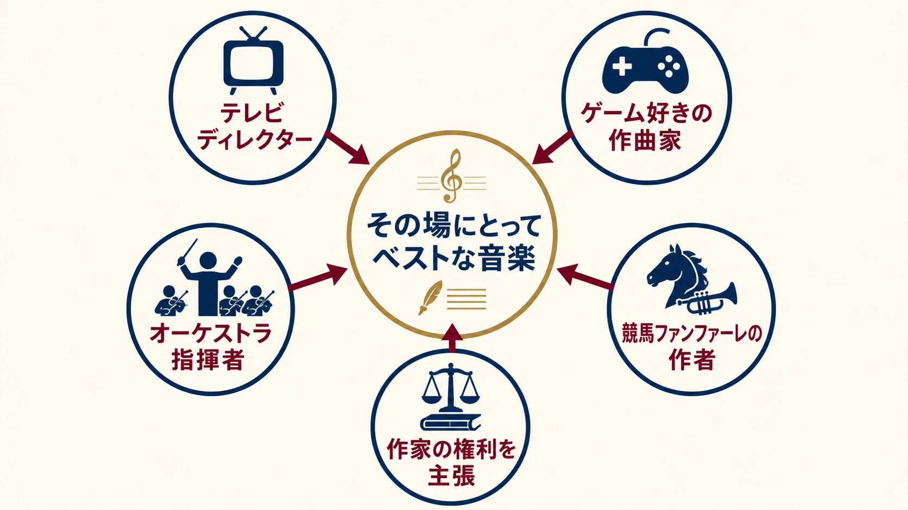
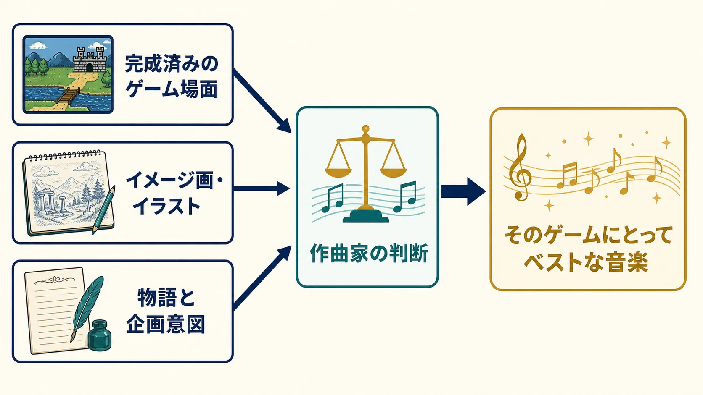
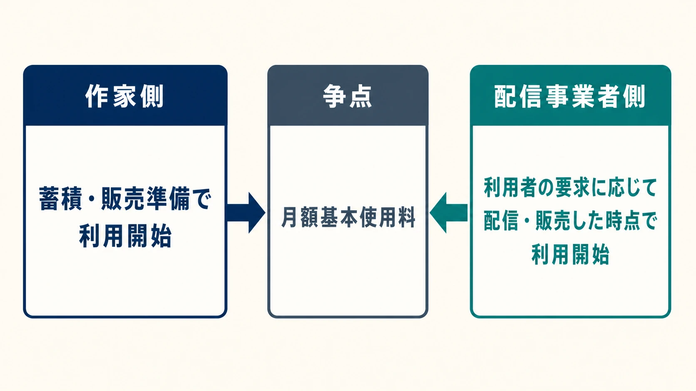

# すぎやまこういち評伝：テレビ、ゲーム、競馬、著作権をつないだ「音楽の捧げもの」

***

## はじめに：『ドラゴンクエスト』だけでは収まらない作曲家

すぎやまこういち、本名・椙山浩一は、1931年4月11日に生まれ、2021年9月30日に敗血症性ショックのため90歳で逝去した。『ドラゴンクエスト』シリーズの音楽を一人で500曲以上書き、制作中だった『ドラゴンクエストXII　選ばれし運命の炎』の作曲を最後の仕事とした人物である。[[1](#ref-1)]

この経歴だけでも、一人の作曲家の仕事として十分に大きい。だが、すぎやまの生涯を『ドラゴンクエスト』だけで閉じると、あの音楽がなぜゲームの場面に強く結びつき、何十年たっても古びにくいのかを説明しきれない。

彼は放送草創期のテレビディレクターであり、ゲームセンターへ通い詰めるプレイヤーであり、競馬場の十数万人を一音で振り向かせるファンファーレの作者でもあった。さらに1990年代にはJASRAC理事会の内側で、インターネット配信をめぐる交渉に作家側から異議を唱えた。2018年に旭日小綬章を受章し、2020年に文化功労者へ選出され、2021年の東京オリンピック開会式では『ドラゴンクエスト』の「ロトのテーマ」が使用された。[[1](#ref-1)][[2](#ref-2)]

複数の顔をつないでいたのは、音楽を自分の名声のためではなく、その場、その作品、その受け手へ差し出すという姿勢である。本稿はその連続性を追う。ゲーム音楽の著作権を買い取り、自社管理、信託、委嘱のどこに置くかという現代の制度比較は、既存記事「[ゲーム音楽の権利をどこに置くか](game-music-copyright-ownership-buyout-trust-commissioning.md)」に譲る。ここで扱うのは、すぎやま個人が1990年代の交渉で何を守ろうとしたのかという歴史である。

*図：テレビ、ゲーム、オーケストラ、競馬、作家の権利という異なる仕事を、一つの作曲姿勢が貫いていたことを示す。*

***

## 1. フジテレビで覚えた、場面を音にする仕事

大学卒業後に文化放送で報道部と芸能部を経験したすぎやまは、1958年、開局前年のフジテレビへ入社した。ディレクターとして『おとなの漫画』『ザ・ヒットパレード』『新春かくし芸大会』などを担当する。本人によれば『ザ・ヒットパレード』は10年、『おとなの漫画』は1000回まで携わり、『新春かくし芸大会』では第1回から第5回まで演出を担当した。[[2](#ref-2)]

放送局を選んだ理由からして、すぎやまらしい。音楽学校なら授業料を払うが、放送局なら給料を受け取りながら現場で音楽を学べる、と考えたのである。生オーケストラを使う番組を作り、プロの編曲家から譜面を借り、音が組み上がる過程を仕事の中で吸収した。JASRACの公式インタビューでは、理論や技術だけでなく、創作に必要な感受性は自分で育てるものだと語っている。[[3](#ref-3)]

テレビは、音楽だけを鑑賞する場ではない。出演者、台本、カメラ、尺、放送時刻が先にあり、音はそれらを結びつける。『ザ・ヒットパレード』のテーマ曲も、放送まで約1週間という状況で、番組の意図を他人へ説明して仕上がりを待つより自分で書く方が早いと判断して生まれた。[[2](#ref-2)] のちにゲームの完成場面やイラストを見ながら作曲する手法は、この時代の延長にある。

同時に、社員と作曲家という二つの立場は衝突した。番組制作と並行してCMや歌の音楽を書くと、ヒットした曲がフジテレビでも放送され、JASRACから著作物使用料の請求が届く。会社側には、社員が作った曲になぜ使用料を払うのかという疑問が生まれた。そこで1965年、すぎやまは社員の身分を離れ、フリー契約のディレクターとなった。その後も約3年は番組を担当し、1968年頃に演出から退いて作曲へ専念した。[[2](#ref-2)][[4](#ref-4)]

つまり1965年は、テレビから作曲へ一足で移った年ではない。著作権を持つ作曲家と、作品を使う放送局員を同じ雇用関係に置いたときの矛盾を、働き方の変更で解いた年である。この経験は、後年、作品が新しい流通経路へ載せられるとき、作家へ何が戻るのかを強く問う姿勢にもつながっていく。

***

## 2. 一枚のアンケートはがきが変えた55歳からの人生

すぎやまは、自ら筋金入りのプレイヤーとしてゲームに関わり続け、その熱量がゲーム音楽の仕事を引き寄せた。業界から請われるのを待っていたわけではない。

PC-9801系が登場するとすぐ購入し、インベーダーゲームからゲームセンターの機種、ファミリーコンピュータ、各社の家庭用ゲーム機まで幅広く遊んだ。CMの急な依頼電話が自宅へ入った際、妻が六本木の二軒のゲームセンターを探せば、どちらかに必ず本人がいたという逸話も残る。[[2](#ref-2)]

そのプレイヤーが、エニックスのパソコン用将棋ソフト『森田和郎の将棋』に同封されたアンケートはがきを書いた。「終盤は強いけど、序盤の駒組みがイマイチ」という趣旨の感想である。机に置いたままにしていたはがきを妻が投函し、エニックスで千田幸信らの目に留まった。電話口で「ゲームの音楽をやってみませんか」と尋ねられると、すぎやまは将棋でいう「ノータイム」で快諾した。[[5](#ref-5)]

この出会いは、誰か一人の功績として固定しにくい。すぎやま本人は「千田さんたち」の目に留まって電話が来たと語り、エニックス創業者の福嶋康博も後年、すぎやまと鳥山明の参加が短い期間に偶然重なり、堀井雄二のチームへ集まったと回想している。[[5](#ref-5)][[6](#ref-6)] はがきを見つけた人、社内で可能性を認めた人、実際に連絡した人の記憶は、立場によって主語が変わり得る。確かなのは、一人の著名作曲家がゲームを遊び、感想を自分の言葉で送り、受け取った新興企業がその一枚を見過ごさなかったことである。

最初に担当したのは、マンガを原作とするパソコン用アドベンチャーゲーム『ウイングマン2　キータクラーの復活』だった。1986年4月に発売された、すぎやまのゲーム音楽デビュー作である。[[5](#ref-5)][[7](#ref-7)] その仕事の後、エニックスから新作RPGの音楽を依頼される。1986年5月27日、『ドラゴンクエスト』第1作が発売された。4月11日に55歳を迎えたばかりだった。[[8](#ref-8)]

55歳は、作曲家として遅い出発ではない。すでにテレビ、CM、歌謡曲、アニメ、映画で実績を積んでいたからである。しかし、ゲームという媒体に限れば新人だった。その新人が制約の少ない仕事を求めたのではなく、ファミリーコンピュータの少ない音数をパズルとして面白がった。[[5](#ref-5)] 長い経験と、新しい媒体を遊び尽くす好奇心が、同じ場所で働き始めた瞬間だった。

***

## 3. 『ドラゴンクエスト』へ捧げた音楽

### 自分のためではなく、ゲームにとっての最善を書く

すぎやまが作曲で最も大切にしたのは、「そのゲームにとってベストなものを書く」ことだった。ゲームを足場に自分の曲をヒットさせようと考えるのではなく、作曲家としての能力を作品へ差し出す。本人はこれを「音楽の捧げもの」と呼んだ。[[2](#ref-2)]

ここでいう「捧げる」は、要求に受動的に従うことではない。何を鳴らせば、その場面、その操作、その物語が最もよく届くかを、自分の知識と感受性で判断することである。JASRACのインタビューで、すぎやまは『ドラゴンクエスト』を原作の堀井、キャラクターデザインの鳥山、音楽のすぎやま、ディレクターの中村光一、それらを束ねるプロデューサーの千田という専門家の集団として説明した。役割が明確だからこそ、それぞれが責任を果たせたという。[[3](#ref-3)]

新人ゲームプランナーがここから学べるのは、作曲家に正解を言い渡す方法ではない。作曲家が自分の専門性を作品へ捧げられるだけの材料を渡し、判断する範囲を明確にすることである。

### 完成場面とイラストから、鳴るべき音を読む

作業手順は映画音楽に似ていた。完成している場面を断片的に見て、まだ映像がない箇所はイメージ画やイラストを見ながら、全体の物語と企画意図を聞く。そして場面ごとに音楽を作る。[[2](#ref-2)]

この方法では、企画書の「勇壮」「悲しい」「楽しい」といった形容詞だけでは足りない。誰がどこに立ち、何を見て、どんな速度で動き、次に何を期待するのかまでが作曲の手がかりになる。テレビ時代に、出演者、カメラ、尺を一つの番組へまとめた経験が、ゲームでは画面、操作、物語を読む力へ置き換わったのである。

*図：三つの材料を作曲家が読み取り、「そのゲームにとってベストな音楽」として各場面へ返す流れ。*

### オーケストラは豪華版ではなく、曲の骨格だった

『ドラゴンクエスト』の音楽は、ゲーム機の音源から始まった後も、オーケストラによって別の生命を得た。すぎやまは青少年がオーケストラに触れる入口になればと考え、各地で交響組曲『ドラゴンクエスト』のコンサートを開いた。[[2](#ref-2)] これはゲーム音楽を権威づけるためにクラシックを借りた、というだけの話ではない。限られた音数で書かれた旋律の背後に、最初から長く聴ける構造があったからこそ、編成を広げても曲が持ちこたえた。

2004年、『ドラゴンクエストV　天空の花嫁』の録音で、すぎやまは東京都交響楽団と初めて共演した。本人は、正確な技術だけでなく、指揮者が細かく形を作らなくても音楽の流れを読み取る感度を高く評価し、都響を自分の先生にもなるオーケストラだと語っている。[[2](#ref-2)] 作曲家が完成稿を渡して終わるのではなく、演奏者から学び、再び曲の理解を深める関係だった。

シリーズ発売以来、すぎやまは500曲以上に及ぶ楽曲をほぼ単独で書き続けた。[[1](#ref-1)] 2016年には、84歳292日の時点で「最高齢でゲーム音楽を作曲した作曲家」としてギネス世界記録に認定された。[[9](#ref-9)] その記録は長寿だけを意味しない。一つのシリーズで、最初の8ビット音源から大規模なオーケストラ、オンラインゲームの継続運営まで、媒体と制作条件が変わり続けるなかで作曲を続けた記録でもある。

そして『ドラゴンクエストXII』の作曲が最後の仕事となった。[[1](#ref-1)] 完成を見届ける前に終わった仕事を含めても、「そのゲームにとってベストなものを書く」という姿勢は35年間変わらなかった。

***

## 4. 競馬場に響く、もう一つの代表作

すぎやまの音楽は、プレイヤーがコントローラーを握る瞬間だけでなく、競馬場で観客が一斉にスタートを待つ瞬間にも鳴る。東京・中山競馬場のGI競走を含むファンファーレや本馬場入場曲の一群は、1987年頃から現在まで使われてきた。[[2](#ref-2)][[10](#ref-10)]

関東のGIファンファーレは、トランペット4、ホルン4、トロンボーン4、チューバ2、打楽器4の計18人で演奏する。中心には4分の5拍子が置かれ、短い時間の中で格調と緊張を同時に作る。演奏を担った陸上自衛隊中央音楽隊の樋口孝博隊長は、楽譜を見た第一印象を「5拍子か……。難しいな」と振り返る一方、NHK交響楽団の参考音源を聴いて「かっこいい！」と感じたと証言している。[[11](#ref-11)]

この逸話の順序は重要である。本番で評価が反転したのではない。譜面の構造は演奏者へ難しさを突きつけたが、実際に鳴る音を聴くと、その難しさが観客の期待を高める効果へ変わることが分かったのである。ゲームの制約をパズルとして受け入れたすぎやまは、競馬場でも演奏しやすさだけに曲を寄せず、目的に必要な緊張を優先した。

逝去後の2021年10月10日、JRAはGIではなくGIIの毎日王冠で、すぎやま作曲のGI本馬場入場曲「グレード・エクウス・マーチ」とGIファンファーレを使用した。JRAは、弔意を表すとともに中央競馬の発展へ寄与した功績を称えるためだと説明した。[[12](#ref-12)] レースの格を示す音楽が、その日だけは作曲家への送別の音になった。

***

## 5. JASRAC理事として、インターネットと渡り合う

テレビ局員時代、すぎやまは自分の曲が放送されると使用料の問題が起きる経験をしていた。1990年代には、同じ問いがインターネット上で新しい形を取った。作品をサーバーへ置き、利用者が要求したときだけ配信する場合、著作物の「利用」はどの時点で始まり、作家への対価はいつ発生するのかという問いである。

JASRACの公式80年史では、すぎやまが1995年と1998年の役員名簿で理事として確認できる。[[13](#ref-13)] ただし本稿は、就任から退任までの年数を推定しない。確認できる役割に絞れば、1996年8月に設立されたJASRAC理事会の諮問機関「マルチメディア委員会」で委員長を務めた。委員会は、デジタル化に対応した著作権制度、管理、分配の方策を検討するための組織だった。[[14](#ref-14)]

交渉相手のNMRC、ネットワーク音楽著作権連絡協議会は、1997年に音楽電子事業協会、日本レコード協会、日本インターネット協会など複数の業界団体が集まって発足した。[[15](#ref-15)] 1998年11月26日、JASRACとNMRCは、インターネット上の有料音楽利用に関する使用料について、翌年3月末までの暫定合意に達した。争点の一つは、音楽を利用可能な状態に置くことへの月額の基本使用料だった。JASRAC側は基本使用料と実際のアクセスに応じた使用料の合算を求め、NMRC側は収入に連動する使用料を原則とし、基本使用料を不合理だと主張していた。[[16](#ref-16)]

すぎやまは同年12月、委員長談話で合意を「決して満足のゆくものではありません」と批判した。作家側から見れば、作品をサーバーへ蓄積し、売り物として利用可能な状態へ置いた時点で、すでに著作物は使われている。実際に売れたときだけ対価が発生する考え方に対し、彼は「さんざん売り物にしておいて、売れなかったらオサラバか」と表現した。[[14](#ref-14)]

*図：蓄積・販売準備の時点を利用開始とみる作家側と、利用者の要求に応じた配信・販売の時点を利用開始とみる配信事業者側。月額基本使用料をめぐる前提の違いを中立に示す。*

現在の高速回線、定額配信、動画プラットフォームを前提に読むと、1998年の料金表そのものは遠い制度に見える。だが衝突の形は今も分かりやすい。流通側は、売上が立っていない作品へ固定費を払えば、登録する曲を絞らざるを得ないと考える。作家側は、販売棚に置くこと自体が作品の利用であり、売れなかったリスクまで作家だけへ戻すのは不当だと考える。

すぎやまの主張は、インターネットを拒むものではなかった。JASRAC公式インタビューでは、流通手段が増え、気軽に音楽を聴ける便利さを認めたうえで、プロの音楽家が存在できる社会をどう保つかが重要だと語っている。ゲーム、映画、音楽のように頭脳が生む作品を正当に評価し、作り手へ報いる仕組みが必要だという立場である。[[17](#ref-17)]

ここには、テレビ局員時代から続く一つの線がある。作品が多くの人へ届くことと、作品を作った人へ対価が戻ることを、別々の問題にしない。新しい流通を止めるのではなく、その入口で作家が消えない条件を問う。すぎやまは、作曲の外側でも「音楽の捧げもの」が続けられる環境を守ろうとしていたのである。

***

## 6. 小さな挿話：愛煙家として語ったこと

すぎやまは、自らを愛煙家としても隠さなかった。2009年10月から11月のたばこ税増税論を受けて書いたコラムで、たばこを「合法的な嗜好品」とし、健康は基本的に自己責任の問題だと主張した。増税をナチス・ドイツの反たばこ政策になぞらえ、当時の禁煙をめぐる風潮を「禁煙ファシズム」と呼んで強く批判している。[[18](#ref-18)]

同じコラムで、考えを煮詰めた後の喫煙によるリラックスが創作のアイデアにつながるとし、酒を飲まない自分にとって、たばこは「至福の一服」なのだと書いた。[[18](#ref-18)] これは本人が公に記した主張であり、健康、受動喫煙、公共空間をめぐって賛否が分かれる内容である。本稿では正当性を裁定せず、作曲家が自分の創作と生活をこのように結びつけて語っていた事実として置く。

***

## 7. 終章：55歳の新人が持ち込んだ、長い準備

1986年5月、55歳のすぎやまはゲーム音楽の世界では新人だった。だが、その新人は空白の状態から来たのではない。テレビの生放送で、場面、出演者、尺、オーケストラをまとめた経験があった。CMや歌謡曲で、短い時間に耳を振り向かせる旋律を書いてきた。映画では、映像と物語から音の役割を読んだ。ゲームを作る前から、ゲームを遊ぶ側でもあった。

だから彼の転身は、過去を捨てる職業変更ではなく、それまでの仕事が一つの媒体へ合流する出来事だった。競馬ファンファーレでは、大観衆の期待を数十秒へ集中させた。JASRACでは、新しい流通の便利さを認めながら、そこから作家が消えない条件を求めた。テレビ、ゲーム、競馬、著作権行政は別々の脇道ではなく、音楽が使われる場と、そこにいる人を見続けた仕事の別の表情である。

『ドラゴンクエスト』の音楽が持つ説得力も、クラシックの技法だけから生まれたのではない。55歳までに積み上げた現場の記憶と、55歳を過ぎても新しい媒体へ飛び込む好奇心が、「そのゲームにとってベストなもの」を選ばせた。遅い転身は完成度を損なわなかった。むしろ、長い準備をゲームへ捧げるための出発点になったのである。

## References

1. [訃報　すぎやまこういち氏　ご逝去｜ドラゴンクエスト公式サイト][1] - 本名、生年月日、逝去日、死因、享年、シリーズ500曲以上、『ドラゴンクエストXII』が最後の仕事だったこと、受章・顕彰、東京オリンピック開会式での使用を記したスクウェア・エニックスの公式発表。

2. [追悼　すぎやまこういち｜東京都交響楽団][2] - 本人との対談を収録した追悼PDF。フジテレビ時代、CM音楽と著作権料をめぐる独立の経緯、PC98とゲーム遍歴、作曲方法、「音楽の捧げもの」、2004年の都響初録音、コンサートの目的を確認できる。

3. [「作家で聴く音楽」第五回 すぎやまこういち（1）｜JASRAC][3] - 放送局を選んだ理由、現場での学び、感受性に関する作曲観、『ドラゴンクエスト』制作陣の役割分担を語った公式インタビュー。

4. [タバコ増税はナチスと同じ禁煙ファシズムだ！｜愛煙家通信][4] - プロフィール欄で1968年から作曲活動へ専念したことを記載。本文はReference 18と同一ページ。

5. [社長が訊く『ドラゴンクエストIX 星空の守り人』「アンケートはがきがキッカケで」｜任天堂][5] - 『森田将棋』のアンケート、千田幸信らからの電話、即答、『ウイングマン2』から『ドラゴンクエスト』へ至る経緯、初期音源の制約をすぎやま本人が語る。

6. [福嶋康博 オーラル・ヒストリー｜ZEN大学 コンテンツ産業史アーカイブ研究センター][6] - エニックス創業者・福嶋康博が、『ドラゴンクエスト』へすぎやま、鳥山明らが短い時期に偶然参加し、堀井雄二のチームへ集まった経緯を回想する一次資料。

7. [国産パソコンソフトウェア年鑑1986年4月｜ゲーム保存協会][7] - 『ウイングマン2　キータクラーの復活』を1986年4月発売として収録するソフトウェア史料。

8. [ドラゴンクエストとは｜ドラゴンクエスト公式サイト][8] - シリーズ第1作『ドラゴンクエスト』の発売日を1986年5月27日とする公式案内。

9. [すぎやまこういちさん「最高齢でゲーム音楽を作曲した作曲家」としてギネス世界記録に認定｜スクウェア・エニックス][9] - 84歳292日、2016年1月28日時点での認定内容を伝える公式発表。

10. [【毎日王冠】すぎやまこういち氏制作の本馬場入場曲・GIファンファーレ使用 JRAが功績称える｜netkeiba][10] - 関東地区の一般・特別・重賞・GI各ファンファーレをすぎやま氏が制作し、1987年頃から現在まで使用されていることを伝える競馬専門メディアの記事。

11. [追悼　すぎやまこういちが遺した傑作「GIファンファーレ」日本ダービー秘話（2）｜Number Web][11] - 陸上自衛隊中央音楽隊長への取材に基づき、5拍子への第一印象、参考音源への評価、18人の楽器編成を記録する。

12. [毎日王冠ですぎやまこういち氏を悼みGIファンファーレ、JRAが功績称え使用｜スポニチ競馬Web][12] - 2021年10月10日の毎日王冠でGI本馬場入場曲とGIファンファーレが使われ、JRAが弔意と功績顕彰の趣旨を説明したことを報じる。

13. [JASRAC 80年史――音楽でつながる未来へ――｜JASRAC][13] - 1995年、1998年の役員名簿（PDF111ページ、冊子表記220ページ）で、すぎやまこういちを理事として掲載する公式団体史。

14. [「売れなかったらオサラバか」すぎやまこういち氏、反NMRCのコメント発表｜INTERNET Watch][14] - 1996年8月のマルチメディア委員会設立と委員長職、1998年12月の委員長談話、サーバー蓄積時点を利用と捉える作家側の主張を記録する同時代資料。

15. [NMRC 活動報告｜インターネット協会][15] - 1997年8月29日のNMRC発足と、音楽電子事業協会、日本レコード協会、日本インターネット協会など参加団体を記録する。

16. [JASRACとNMRC、ネットワーク上での有料の音楽利用に関する著作物使用料について暫定合意｜NMRC][16] - 1998年11月26日の暫定合意、交渉経緯、基本使用料をめぐる両者の相違を示す当時の共同発表。

17. [「作家で聴く音楽」第五回 すぎやまこういち（2）｜JASRAC][17] - インターネットによる音楽流通の利便性を認めつつ、プロの音楽家と知的財産制度を維持する必要を語った公式インタビュー。

18. [タバコ増税はナチスと同じ禁煙ファシズムだ！｜愛煙家通信][18] - 2009年秋の増税議論を受け、すぎやま本人が合法的な嗜好品、自己責任、反たばこ政策、創作時のリラックス、「至福の一服」について記したコラム。

[1]: https://www.dragonquest.jp/news/detail/3546/
[2]: https://www.tmso.or.jp/j/wp/wp-content/uploads/2021/12/sugiyama.pdf
[3]: https://www.jasrac.or.jp/sakka/vol_5/sugiyama_in.html
[4]: https://www.aienka.jp/articles/001/
[5]: https://www.nintendo.co.jp/ds/interview/ydqj/vol1/index2.html
[6]: https://www.arc.ritsumei.ac.jp/lib/vm/2024d40/zenOH02_001tx.pdf
[7]: https://www.gamepres.org/pc88/library/1986/1986_4.htm
[8]: https://www.dragonquest.jp/about/
[9]: https://www.jp.square-enix.com/company/ja/news/2016/html/5ad377b1298df1b3a3374425bd4ec356.html
[10]: https://news.netkeiba.com/?pid=news_view&no=194158
[11]: https://number.bunshun.jp/articles/-/850118?page=2
[12]: https://keiba.sponichi.co.jp/news/20211010s00004000638000c
[13]: https://www.jasrac.or.jp/aboutus/history/pdf/jasrac80th.pdf
[14]: https://internet.watch.impress.co.jp/www/article/981218/kouichi.htm
[15]: https://www.iajapan.org/nmrc/katsudo.html
[16]: https://www.nmrc.jp/k1998/houdou11-27.html
[17]: https://www.jasrac.or.jp/sakka/vol_5/sugiyama_in2.html
[18]: https://www.aienka.jp/articles/001/

----

この文書は、Perplexity、Claude、OpenAI Codex の3つのAIの支援を受けて著述されたものです。引用画像を除き、MIT License にて提供されています。
