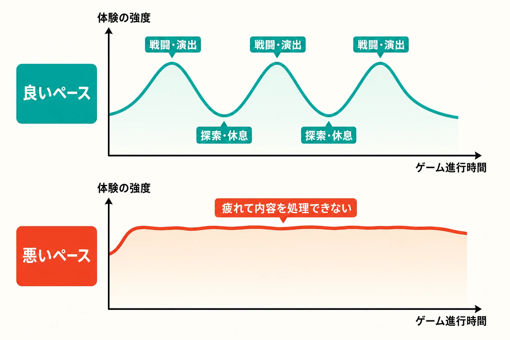
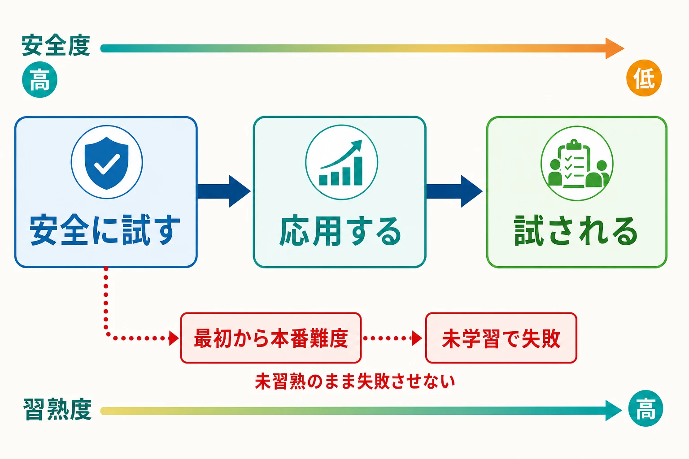
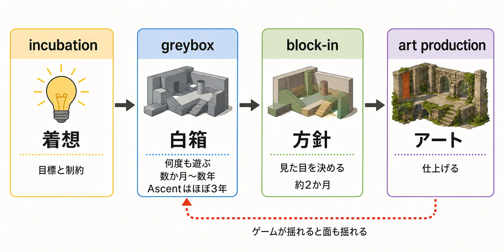
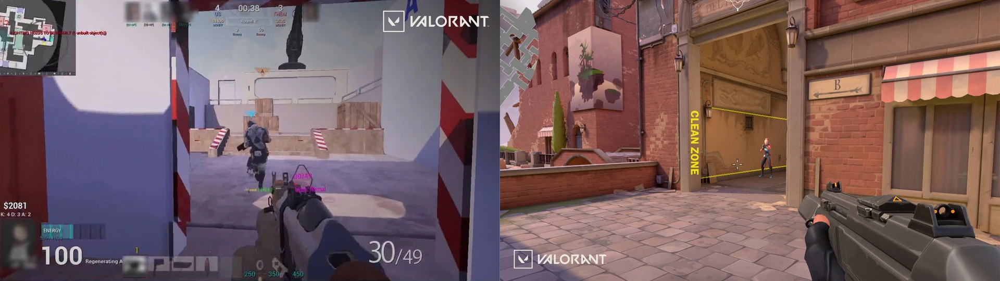
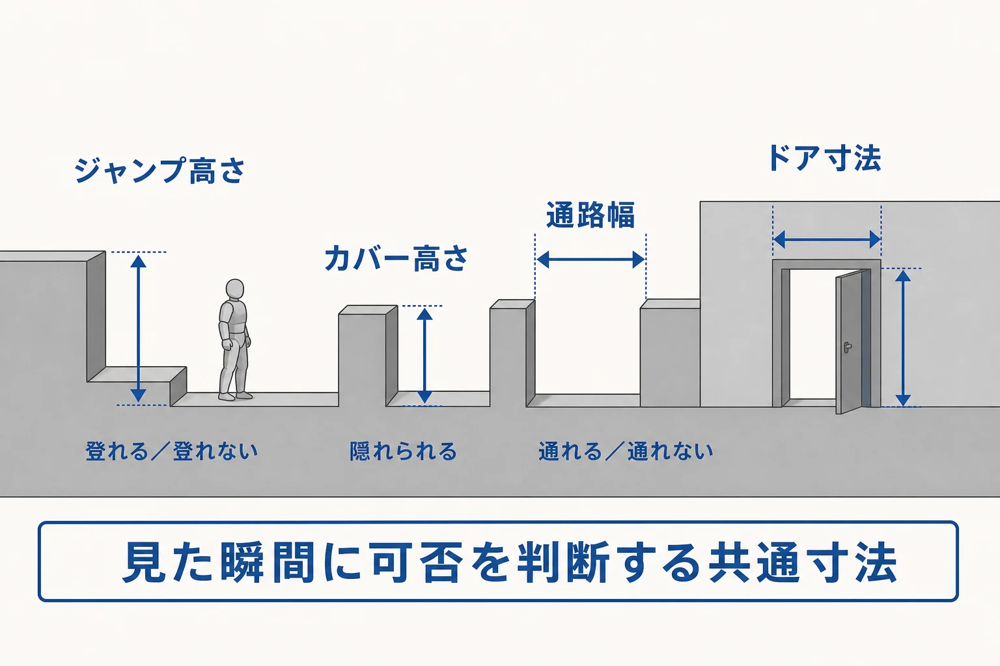
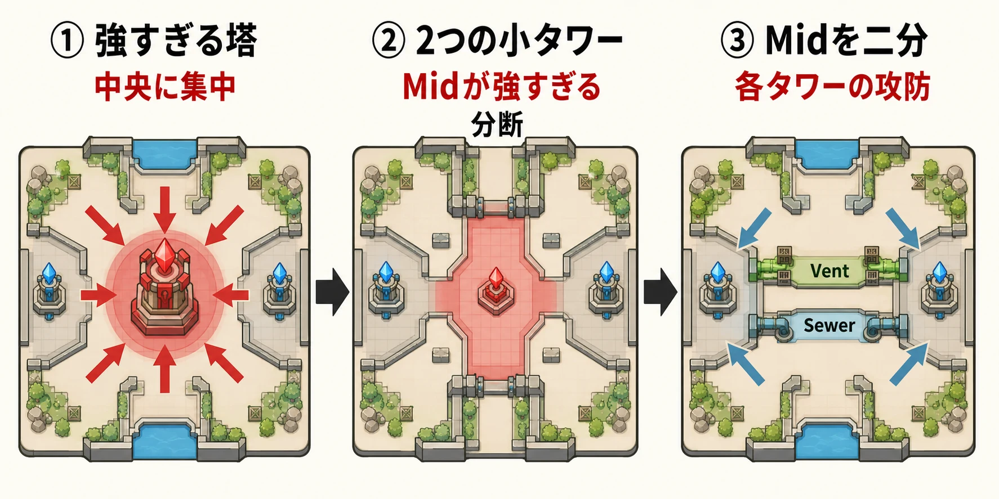
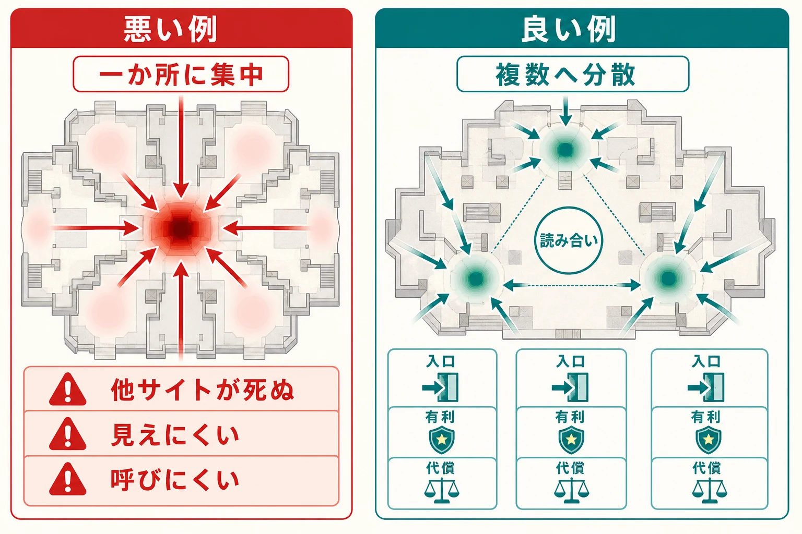
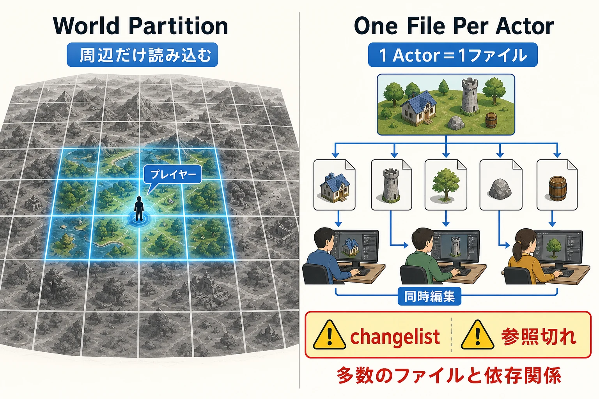

# レベルデザイン入門｜ルールではなく空間で体験を組み立てる仕事

新人が最初に引っかかりやすいのは、 **レベルデザインは背景を作る仕事** だ、という誤解だ。実際には逆で、先にあるのは見た目ではなく **体験の設計** である。プレイヤーにどこを見せるか、どこで学ばせるか、どこで迷わせるか、どこで気持ちよく勝たせるか。その骨組みを、ルールではなく **空間** で作るのがレベルデザインである。この記事では、華やかな分析よりも、現場で破綻しにくい考え方に絞って整理する。具体例は、開発者や公式資料で確認できるものを中心に扱う。

***

## レベルデザインは何を設計する仕事か

Ubisoft の職種整理では、ゲームデザインは **ルール、システム、メカニクス** を作る役割であり、レベルデザインはその意図を **レベルやワールドに組み上げ、プレイヤー表現を豊かにする役割** だと整理されている。つまり、同じ「デザイン」でも、前者が「何ができるゲームか」を決める仕事で、後者は「そのゲームをどんな順番と密度で体験させるか」を決める仕事だ。[[1](#ref-1)]

実務の求人票まで踏み込むと、レベルデザイナーの仕事はかなり泥臭い。Ubisoft の Level Designer 職では、クエストやレベルを構想から完成まで管理し、 **望まれたゲームプレイを実装** し、 **可読性、難易度、アクセシビリティ** を保ち、 **アートやゲームプレイプログラマーと協業** し、さらに **QA が上げた技術的問題やバグを潰す** ことまで含まれている。レベルデザインは「アイデアを出す人」ではなく、 **遊べる形に閉じる人** である。[[2](#ref-2)]

この仕事は単独では成立しない。Ubisoft Toronto の Level Artist インタビューでも、レベルアートはコンセプトアート、レベルデザイン、ナラティブ、テクニカルアートと密接に連携し、 **ゲームプレイを意識したブロックアウト** から入ると説明されている。また、プレイヤーを導くために光、音、視線を引く要素、出来事などを使うとも語られている。つまり、レベルデザイナーが決めるのは「この部屋は倉庫か宮殿か」より先に、「ここでプレイヤーに何をさせ、何を気づかせるか」である。[[3](#ref-3)]

Epic の Unreal Engine ドキュメントも、レベルデザインの最初の仕事を **見た目の完成** ではなく、 **レイアウトと遊びやすさの確認** だと置いている。ブロックアウト（blockout / grayboxing）は、壁や通路や障害物を簡単な形で置き、スケール、見通し、フローを検証するための段階である。ここで重要なのは、見栄えの良い絵を作ることではなく、 **いちばん単純な形でも面として成立するか** を確かめることだ。[[4](#ref-4)]

***

## 体験を組み立てるための道具立て

レベルデザインでは、空間を一度に考えようとすると、何を直すべきか分からなくなる。そこで、場面の強弱、学ばせる順番、進む方向の伝え方、寄り道の意味などに分けて考える。まずは次の六つの視点を持つと、空間の役割を整理しやすい。[[4](#ref-4)][[5](#ref-5)][[6](#ref-6)][[7](#ref-7)][[8](#ref-8)]

| 視点 | 確かめること | ありがちな誤解 |
| --- | --- | --- |
| 場面の強弱 | 緊張する場面と休む場面の並び方 | 難所を増やせば濃い体験になるわけではない |
| 進む方向の誘導 | 次にどこへ行けばよいかを自然に伝えられるか | 矢印を置くだけが誘導ではない |
| 進行の制御 | 必要な準備や理解を終えてから先へ進ませているか | 鍵のかかった扉だけが進行制御ではない |
| 学習の順番 | 安全に試し、応用し、最後に組み合わせて使わせているか | 教える前に難所へ置くと、未学習のまま失敗する |
| 危険と報酬 | 危険な寄り道を選ぶ意味があるか | 報酬は強い装備だけではない |
| 空間で伝える物語 | 物や配置から、その場所で起きたことを想像できるか | 文章を減らすだけでは物語にならない |

### 場面の強弱を波にする

戦闘、探索、謎解き、演出、休息は、それぞれプレイヤーに求める集中力が違う。強い戦闘を長く続けたあとに静かな探索を挟めば、緊張がほどけ、次の戦闘にも集中しやすくなる。反対に、危険な場面や大きな演出を切れ目なく並べると、刺激に慣れ、重要な出来事まで印象に残らなくなる。場面の強弱は敵の数だけではなく、 **何をする時間か、その緊張がどれくらい続くか** の組み合わせで考える。[[5](#ref-5)]

### 安全に学ばせてから試す

新しい操作や仕組みを覚えさせるときは、最初から難しい状況で使わせない。まずは失敗してもすぐやり直せる場所で一度試させ、次に配置や条件を変えて応用させ、最後に敵や別の操作と組み合わせて使わせる。プレイヤーが先へ進むために必ず必要な操作なら、それを一度も試さないまま難所へ到達できないよう、途中の空間に練習の機会を組み込む。これは自由を奪うためではなく、 **知らないことを理由に失敗させないため** の設計である。[[5](#ref-5)][[6](#ref-6)]

### 見せたいものへ自然に導く

進む方向は、画面上の矢印だけで伝えるものではない。通路の先に明るい場所を置く、建物の隙間から目的地を見せる、音や動きで注意を引く、壁や地形で視界を絞るといった方法でも、プレイヤーの視線と移動を導ける。必ず見せたい出来事があるなら、その場所を通る道筋にしたり、出来事が終わるまで次の道が開かないようにしたりする。大切なのは命令することではなく、 **自分から見たくなり、進みたくなる形を作ること** である。[[6](#ref-6)]

### 寄り道に意味を返し、空間で物語を伝える

危険な脇道や遠回りを用意するなら、そこへ行く理由も必要になる。報酬は強い装備や数値の上昇だけではない。近道を開く、次の戦闘を有利に見渡せる、珍しい景色を見せる、その世界で起きた出来事を発見させることも報酬になる。

空間で物語を伝えるときは、壊れた家具や放置された道具を置くだけでは足りない。何がどこにあり、周囲がどう変化し、ゲームの仕組みがどう反応するかを組み合わせて、プレイヤーが「ここで何が起きたのだろう」と推測できる関係を作る。近未来のプラハを探索するゲーム『Deus Ex: Mankind Divided』では、分かりやすい道筋の外側に、小さな出来事、住民の記録、建物を通り抜ける別経路を置き、探索と物語を結びつけている。寄り道によって世界への理解が深まれば、発見そのものが報酬になる。[[7](#ref-7)][[8](#ref-8)]

***

## 白箱から始める制作プロセス

完成した景色を最初から作り込むと、通路が狭い、目的地が見えない、戦闘の間合いが合わないと分かったときに、大量の作り直しが発生する。そこで現場では、壁や床、段差、遮蔽物を単純な箱で置き、まず遊べる空間だけを作る。この試作段階は「ブロックアウト」や「グレーボックス」とも呼ばれるが、本記事では意味が伝わりやすいように **白箱** と呼ぶ。白箱の目的は見栄えを整えることではなく、 **まだ安く壊せるうちに、うまくいかない案を見つけること** である。[[4](#ref-4)]

### 着想から完成までを四段階に分ける

対戦ゲーム『VALORANT』の開発元である Riot Games は、マップ制作を四つの段階に分けている。最初の「着想」では、そのマップで生み出したい遊びと、守るべき制約を決める。次の「白箱」では、意図した戦闘や移動が起きるかを何度も遊んで確かめる。その後に建物や景観の方針を定め、最後に完成用の美術を作る。図中の英語は、順に「着想」「白箱」「見た目の方針決定」「アート制作」を表す現場の工程名である。[[9](#ref-9)]

この流れが必要な理由は、同じゲームに登場するマップ「Ascent」の開発を見ると分かりやすい。『VALORANT』は、一人称視点で銃を使う5対5の対戦ゲームであり、「Ascent」はその対戦場所の一つである。白箱の段階では、敵を見渡せる距離、撃ち合いが始まる距離、入口の幅などを調整し、遊びにくい案を早い段階で捨てていった。しかし、ゲーム本体のキャラクター能力、武器の有効距離、作品世界の設定まで同時に変化していたため、このマップは白箱のままほぼ3年にわたって調整された。マップだけを先に完成させても、ゲームのルールが変われば作り直しになるからである。[[9](#ref-9)]

左：初期の白箱、右：完成版。

画像出典：[Riot Games「The Birth of Ascent」](https://playvalorant.com/en-us/news/dev/the-birth-of-ascent/)（© Riot Games）

### 共通寸法で「できること」を伝える

白箱では、ジャンプで越えられる高さ、身を隠せる遮蔽物の高さ、通路の幅、ドアの大きさなどを共通寸法として決める。これは現実の建築寸法を忠実に再現するためではない。プレイヤーが形を見ただけで、 **登れる、隠れられる、通れる、通れない** を予測できるようにするためである。同じ役割の物を同じ大きさに揃えれば、制作担当者が変わっても判断基準がぶれにくく、部品の使い回しや後からの調整もしやすい。[[4](#ref-4)]

### プレイテストでは「なぜ迷ったか」を見る

実際の制作は、紙に配置を描く、白箱を作る、誰かに遊んでもらう、観察結果を反映する、という反復になる。『VALORANT』の別の対戦マップ「Lotus」では、初期の試遊を一度行うたびに、変更したい点が20個ほど見つかったと開発者が振り返っている。その修正を何か月も繰り返し、空間の骨組みが固まってから美術制作へ渡している。ゲーム開発者向けの講義でも、試遊は不具合を探すだけではなく、プレイヤーの行動を観察し、記録し、遊び終えたあとに理由を聞く作業だと説明されている。[[5](#ref-5)][[10](#ref-10)]

見るべきなのは、単にクリアできたかどうかではない。ジャンプに失敗したなら、難度が高すぎたのではなく、必要な助走距離が読み取れなかったのかもしれない。敵に囲まれたなら、敵の数ではなく、部屋へ入った瞬間に出口や遮蔽物が見えなかった可能性がある。白箱で先に確かめたいのは、面白いと言えるかどうかよりも、 **どこで空間を誤解し、意図しない操作をしたか** である。

***

## ジャンルごとに変わる勘どころ

ジャンルが変われば、プレイヤーが空間から読み取るべき情報も、失敗から学ぶ内容も変わる。足場を飛び移るゲームでは「次にどこへ着地できるか」が重要だが、銃で撃ち合うゲームでは「どこから狙われ、どこへ逃げられるか」が重要になる。広い世界を探索するゲームなら、進行方向を示しながら、寄り道する自由も残さなければならない。まずは違いを次のように捉えると分かりやすい。[[5](#ref-5)][[6](#ref-6)][[11](#ref-11)][[12](#ref-12)][[13](#ref-13)]

| ジャンル | プレイヤーに読み取らせたいこと | ありがちな破綻 |
| --- | --- | --- |
| 足場を飛び移る2Dアクション | 新しい動きを安全に覚える順番 | 教える前に難所へ放り込む |
| 立体空間のアクション／射撃ゲーム | 敵の位置、遮蔽物、入口と退路 | どこから攻撃されたのか分からない |
| 広い世界を自由に探索するゲーム | 興味を引く景色と自然な道筋 | 自由に歩けるのに行き先を見つけられない |
| 複数人で競う対戦マップ | 公平な侵入経路と、要所を奪い合う意味 | 一か所に戦闘が集中し、他の場所が使われない |

### 足場を飛び移る2Dアクション

横から見た画面で、足場から足場へジャンプして進むゲームでは、学習の順番がそのまま遊びやすさにつながる。たとえば新しく壁登りを教えるなら、最初は落ちてもすぐ戻れる安全な場所で一度使わせる。次に足場の位置を変えて応用させ、最後にジャンプや敵回避と組み合わせて確かめる。説明文を読ませるだけではなく、 **成功しやすい空間を使って操作の意味を体で覚えさせる** ことが重要である。[[5](#ref-5)][[6](#ref-6)]

### 立体空間のアクション／射撃ゲーム

三次元の空間を移動しながら戦うゲームでは、敵との距離だけでなく、視線が通る場所、身を隠せる場所、部屋への入口、危険なときの退路を同時に設計する必要がある。どれほど魅力的な戦闘場所でも、入った瞬間に状況を把握できなければ、プレイヤーは作戦で負けたのではなく、情報を得られないまま倒されたと感じる。

一人称視点で銃を使う5対5の対戦ゲーム『VALORANT』のマップ「Split」は、この調整を繰り返した事例である。初期案では中央の塔が強すぎて、戦闘がそこへ集中していた。そこで塔を二つの小さな高所に分けたが、今度は中央区画が強すぎ、左右の区画も行き来しにくくなった。最終的には中央区画を分割し、「通気口」と「下水道」と呼ばれる二本の通路で直接つなぐことで、複数の場所を奪い合う構造へ近づけている。図中の「Mid」は中央区画、「Vent」は通気口、「Sewer」は下水道を指す。[[11](#ref-11)]

この事例が示すのは、強い場所を置くだけでは対戦が面白くならないということだ。そこへ入る方法、確保したときの利点、確保するために諦める場所まで決めて初めて、攻めるか退くかの判断が生まれる。

### 広い世界を自由に探索するゲーム

広い地域を自由に歩けるゲームでは、目的地を増やすだけでは探索にならない。プレイヤーが自分から「少し見に行きたい」と思う理由が必要である。広い屋外を移動する一人称視点のアクションゲーム『Far Cry 5』では、画面上の矢印や目的地マーカーだけに頼らず、坂の向こうに見える建物、遠くの煙、脇へ延びる細道、道端の看板などで関心を引く方法が検討された。谷、道路、川も、進める方向を自然に絞る地形として使われている。自由度の高いゲームでは誘導を消すのではなく、 **風景の中へ案内を溶け込ませる** のである。[[12](#ref-12)]

都市の一地区を拠点として繰り返し探索するゲームでは、もう少し密度の高い設計が必要になる。近未来のプラハを舞台に、潜入や戦闘の経路を選べる『Deus Ex: Mankind Divided』では、主要な道を分かりやすくし、遠くから見える建物を目印にしつつ、その外側へ小さな事件や読み物を配置している。正面から進む道、裏道、建物の内部が世界の出来事につながるため、寄り道そのものが物語を理解する報酬になる。探索の魅力は物量だけではなく、 **迷わず進める道筋と、脇道で世界を発見する喜びの両立** で支えられる。[[8](#ref-8)][[13](#ref-13)]

### 複数人で競う対戦マップ

対戦マップでは、通り道が狭まって衝突しやすい場所をどこに作るか、目標地点の間をどれだけ行き来しやすくするか、強い場所へ複数の侵入経路を用意するかが重要になる。さらに、仲間へ場所を短く伝えられる呼び名、遠くからでも区画を見分けられる目印、敵の姿を埋もれさせない背景も必要だ。これらが曖昧だと、駆け引きではなく、場所を識別できなかった側が一方的に不利になる。背景の装飾を増やしすぎず、要所を見分けやすくするのは、対戦に必要な情報を守るためである。[[11](#ref-11)][[14](#ref-14)]

***

## 現場で破綻させないための視点

レベルデザインは、よい空間を一度考えて終わる仕事ではない。ゲームのルールが変わり、試遊で問題が見つかり、制作人数や機械の性能に限界があるなかで、完成まで調整を続ける仕事である。そのため、最初から変更を受け止められる作り方にしておく必要がある。

### 変更を前提に作る

前節で触れた『VALORANT』のマップ「Ascent」は、ゲーム本体のルールや世界設定が変わり続けたため、白箱の調整にほぼ3年を費やした。別のマップ「Lotus」でも、初期の試遊ごとに多くの修正点が見つかっている。これは珍しい失敗ではなく、対戦ルールと空間を同時に作る以上、避けにくい反復である。仕様が完全に固まるのを待つのではなく、 **固まっていない状態でも直し続けられる形にしておく** ことが重要になる。[[9](#ref-9)][[10](#ref-10)]

見た目を作る段階に入ってからも、変更への備えは必要だ。『VALORANT』の制作チームは、建物を作り始めたあとも週に一度は試遊し、壁や床の当たり判定が正しいか、敵が背景に埋もれないか、装飾が多すぎて重要な情報を隠していないかを確認している。通路や部屋の形が変われば、美術担当者も作り直す。だから初期の美術は単純な形に留め、方向が固まる前に細部へ時間をかけすぎない。簡素に作るのは手抜きではなく、 **変更による損失を小さくするため** である。[[14](#ref-14)]

### 数字と観察を組み合わせる

死亡率、滞在時間、途中で遊ぶのをやめた割合、対戦の勝率などは、問題が起きている場所を探す手がかりになる。しかし数字だけでは、その理由までは分からない。同じ場所で長く立ち止まっていても、道に迷ったのか、怖くて動けなかったのか、景色を眺めていたのかで意味は異なる。

そこで試遊では、数値の記録と人の観察を組み合わせる。どこを見たか、どこで進行方向を変えたか、何を見落としたかを記録し、遊び終えたあとに判断の理由を聞く。「Lotus」の開発でも、実際の対戦でマップがどのように使われるかを分析する担当者が、設計チームを支援している。面白さを直接数値に変えるのではなく、 **数字で異常を見つけ、観察と言葉で原因を探る** のである。[[5](#ref-5)][[10](#ref-10)]

### 大規模なレベルは「一枚のマップ」ではない

広大な世界を扱うゲームでは、空間の面白さだけでなく、データをどのように読み込み、複数人でどう編集するかも設計しなければならない。立体的なゲーム空間を作るための制作ソフトウェア「Unreal Engine」には、広い世界を格子状の区画へ分け、プレイヤーに近い区画だけを読み込む **世界分割機能（World Partition）** がある。遠く離れた場所のデータを常に読み込まずに済むため、巨大な世界を動かしやすくなる。[[16](#ref-16)]

共同作業には、 **配置物一つにつき一ファイルに分ける仕組み（One File Per Actor）** が使われる。ここでいう配置物とは、建物、木、岩、扉など、マップ上に置かれた個々の物体である。別々のファイルにすれば、複数の担当者が同じ巨大なマップファイルを奪い合わず、それぞれの物体を編集できる。一方でファイル数が増えるため、提出する変更一覧の確認や、物体同士のつながりが切れていないかの管理は難しくなる。変更履歴を管理する仕組みでは、同じファイルの同時編集を防ぐため、編集権を取得してから作業する運用も必要になる。[[17](#ref-17)][[18](#ref-18)]

図中の「World Partition」は世界分割機能、「One File Per Actor」は配置物ごとのファイル分割、「changelist」は提出する変更一覧を指す。

大都市を自由に走り回れるアクションゲーム『Saints Row』の開発では、このデータ読み込みが大きな問題になった。建物が密集した市街地では周辺データの段階的な読み込みが追いつかず、記憶容量と描画速度が制作終盤まで課題として残った。プレイヤーが読み込み前の地域へ到達しないよう、障害物や道路封鎖で移動を遅らせようとした結果、かえって大量の作り直しが発生している。また、近未来のプラハを探索する『Deus Ex: Mankind Divided』の開発でも、動作の安定性、処理速度、品質検証、課題管理の負担が報告されている。広い世界は、見える景色だけでなく、 **裏側の読み込み方とチームの作業方法まで含めて設計しなければ完成しない**。[[13](#ref-13)][[15](#ref-15)]

***

## 終わりに

この記事の出発点は、ゲームデザインが「何ができるゲームか」を決め、レベルデザインが「その遊びを、どのような順番と密度で体験させるか」を決める、という整理だった。レベルデザインは背景を飾る仕事ではない。ルールとして用意された移動、戦闘、探索、選択を、プレイヤーが理解して使える体験へ変換する仕事である。

新人ゲームプランナーが最初に考えるべきなのは、「どんな場所を作るか」ではなく、 **この場所でプレイヤーに何を経験してほしいか** である。何に気づき、どの行動を試し、どこで迷い、何を乗り越えたときに気持ちよさを感じるのか。その流れを一文で説明できれば、通路の幅、敵の位置、寄り道の報酬、見せる景色にも理由を持たせやすい。倉庫や宮殿といった見た目の設定は、その体験を支える形として後から選べばよい。

制作中は、空間ごとに「次の目的が見えるか」「必要な操作を学んでいるか」「失敗の理由を理解できるか」「別の進み方を選ぶ意味があるか」を確かめる。答えが曖昧なら、完成用の美術を増やす前に白箱へ戻る。試遊では成功率だけでなく、プレイヤーがどこを見て、どこで立ち止まり、何を誤解したかを観察する。レベルは一度の発想で完成させるものではなく、 **意図と実際の行動のずれを修正し続けることで完成へ近づく**。

ゲームプランナー自身が、すべての地形や背景を制作する必要はない。それでも、ルールの狙いを空間の要件へ翻訳し、アート、プログラム、物語、品質検証の各担当者と共有する役割は担える。「ここを豪華にしたい」ではなく、「ここで初めて敵の危険を理解させたい」「この寄り道で世界の出来事を発見させたい」と伝えられれば、チームは同じ体験を目標に作業できる。

良いレベルは、広いからでも、装飾が多いからでもない。プレイヤーが次に何をすべきかを感じ取り、自分で試し、失敗から学び、選んだ行動に意味を見いだせる空間である。レベルデザインとは、 **ゲームのルールを、理解と感情の流れを持った体験へ組み上げる仕事** なのである。

## References

1. [OUR JOB ROLES][1] - Ubisoft が Game Design と Level Design の役割をどう分けているかを示す職種紹介。  
[1]: https://www.ubisoft.com/en-us/company/careers/locations/articles/our-job-roles

2. [Level Designer | Ubisoft Careers][2] - レベルデザイナーの実務として、ゲームプレイ実装、可読性と難易度の維持、協業、技術課題対応を明記。  
[2]: https://www.ubisoft.com/en-us/company/careers/search/744000116430617-level-designer

3. [People of Ubisoft Toronto — Meet Roger Liu, Level Artist][3] - レベルアートがレベルデザインと連携して blockout し、光や音や視線誘導で player-leading を行うことを説明。  
[3]: https://toronto.ubisoft.com/people-of-ubisoft-toronto-meet-roger-liu-level-artist/

4. [Designer 01 Project Setup and Level Blockout in Unreal Engine][4] - blockout / grayboxing の定義、反復の意義、見通しやスケール確認、メトリクス設計の基本を説明。  
[4]: https://dev.epicgames.com/documentation/unreal-engine/designer-01-project-setup-and-level-blockout-in-unreal-engine

5. [Level Design Workshop Section Three: Pacing][5] - ペーシングの定義、活動強度と時間の関係、プレッシャーの少ない学習、観察型プレイテストの重要性を扱う資料。  
[5]: https://media.gdcvault.com/gdcchina14/presentations/833762_JoelBurgess_MattScott_LeePerry_3_Pacing_EN.pdf

6. [Level Design Workshop Section Five: Level Designer As Storyteller][6] - 教えるべき能力の提示、ゲーティング、フレーミング、ステージングとライティングによる誘導を整理した資料。  
[6]: https://media.gdcvault.com/gdcchina14/presentations/833762_JoelBurgess_MattScott_LeePerry_5_Narrative_Part01_EN.pdf

7. [What Happened Here? Environmental Storytelling][7] - environmental storytelling を、空間の履歴や暗示をプレイヤーに読み取らせる技法として説明する GDC 講演概要。  
[7]: https://www.gdcvault.com/play/1012647/what-happened-here-environmental

8. [Level Design Workshop: Rewarding Exploration in 'Deus Ex: Mankind Divided'][8] - 探索報酬を、ナビゲーション、環境物語、読み物、寄り道設計の組み合わせとして捉える講演概要。  
[8]: https://www.gdcvault.com/play/1024305/Level-Design-Workshop-Rewarding-Exploration

9. [The Birth of Ascent][9] - VALORANT のマップ制作工程を、incubation から greybox、block-in、art production へと分けて説明し、長期化した greybox の背景も語る。  
[9]: https://playvalorant.com/en-us/news/dev/the-birth-of-ascent/

10. [Lotus: Unearthing VALORANT’s Lost City][10] - greybox 段階で大量の修正が出ること、流動的な移動設計、playtest と analyst の役割を説明。  
[10]: https://playvalorant.com/en-us/news/dev/lotus-unearthing-valorant-s-lost-city/

11. [The Creation of Split][11] - competitive map の design goal、mid と tower の反復、POI と visual theme による認知補助を具体的に解説。  
[11]: https://playvalorant.com/en-us/news/dev/the-creation-of-split/

12. [Far Cry 5 – Creating Curiosity in a Familiar World][12] - オープンワールドでの自然な導線、 curiosity 喚起、地形による navigation と flow の制御を開発者が説明。  
[12]: https://news.ubisoft.com/en-us/article/16TjVZmAtD85EWcvHtxHXL/far-cry-5-creating-curiosity-in-a-familiar-world

13. [A city of thousand choices: Prague city hub in Deus Ex Mankind Divided][13] - landmarks、clear path、探索セットアップ、予算配分、安定性と QA 管理まで含めたハブ設計の実務資料。  
[13]: https://media.gdcvault.com/gdc2017/Presentations/Douce_A%20City%20of%20Thousand%20Choices.pdf

14. [The Art of VALORANT Map Environments][14] - greybox 以後の art blockout と art production、週次プレイテスト、視認性とパフォーマンスのトレードオフを説明。  
[14]: https://playvalorant.com/en-us/news/dev/the-art-of-valorant-map-environments/

15. [The Creation of Saints Row's Open World Cityscape: Stilwater][15] - メモリ、streaming、frame rate、道路封鎖による遅延設計と rework など、大規模ワールド制作の技術的制約を示す。  
[15]: https://media.gdcvault.com/gdc07/slides/S3741i1.pdf

16. [World Partition in Unreal Engine][16] - 大規模ワールドを streamable grid cell に分割して運用する仕組みと、共同制作との関係を説明。  
[16]: https://dev.epicgames.com/documentation/unreal-engine/world-partition-in-unreal-engine

17. [One File Per Actor in Unreal Engine][17] - Actor 単位でファイルを外出しし、共同編集をしやすくする一方で、changelist 管理が複雑になることを説明。  
[17]: https://dev.epicgames.com/documentation/unreal-engine/one-file-per-actor-in-unreal-engine

18. [Source Control in Unreal Engine][18] - source control がコードとデータの変更管理の基盤であり、checkout による同時編集制御を行うことを説明。  
[18]: https://dev.epicgames.com/documentation/unreal-engine/source-control-in-unreal-engine

----

この文書は、Perplexity、Claude、OpenAI Codex の3つのAIの支援を受けて著述されたものです。引用画像を除き、MIT License にて提供されています。
