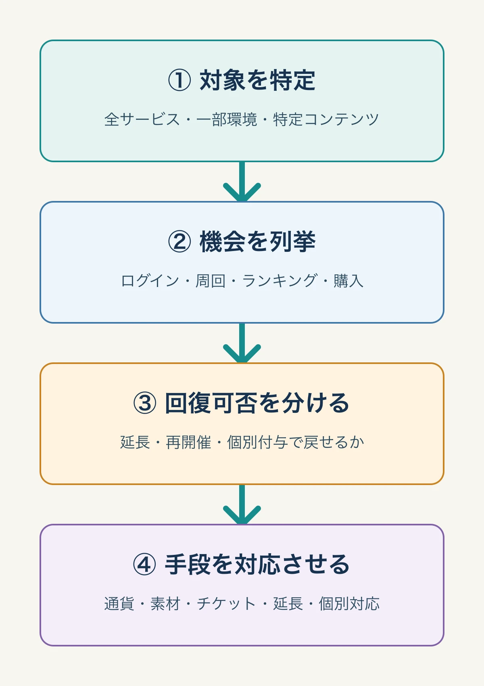

# 「詫び石」を仕組みで設計する――障害・不具合の補填基準はどう決めるべきか

***

## はじめに：補填は謝罪の量ではなく、失われた体験の設計である

ライブサービスゲームで障害が起きたとき、プレイヤーが目にするのは告知と配布物である。しかし運営チームが先に決めるべきなのは、謝罪の文量でも、配布する通貨の見栄えでもない。誰が、どれだけの時間、どの体験を失ったのかを整理し、それに対応する補填基準を適用することである。

『ブルーアーカイブ』では、2023年3月22日11時から19時までの定期メンテナンス後に接続障害が発生した。臨時メンテナンスは同日21時30分から23時頃、翌23日1時30分から20時に行われ、短時間のサービス再開を挟んでも、定期メンテナンスを含むダウンタイムは約33時間に及んだ。[[1](#ref-1)]

同作の対応は、青輝石3000個、募集チケット、イベント用アイテムという大きな補填だった。青輝石は低単価の購入方法で1個約1.5円であり、3000個は約4500円相当と報じられた。[[1](#ref-1)] ただし、この出来事を「太っ腹な詫び石」の逸話だけとして扱うと、補填設計の核心を見失う。通貨に加えてイベント限定アイテムを含めたことには、ログイン不能で失われた **期間限定の進行機会** を戻す意図を読み取れるからである。

本稿は、炎上時の説明や謝罪文の書き方を主題にしない。既存記事「[プレイヤーと開発元のコミュニケーション：炎上対応と信頼回復の実践知識](player-developer-communication-crisis-response.md)」がその領域を扱っているためである。ここでは、補填の中身、基準、法務上の見取り図を、プランナーが運営・CS・法務と共通言語にできる形へ落とし込む。

***

## 「詫び石」と「ヤケクソ補填」は何を指す言葉か

「詫び石」は、不具合やメンテナンスへのお詫びとして無償配布されるゲーム内通貨を指す通称である。『パズル＆ドラゴンズ』で障害時に有料アイテムの「魔法石」を配ったことから名称が定着した、という説明が広く知られている。2012年の当時の取材でも、障害への対応として魔法石を即時配布し、その呼び名が「詫び石」として定着した経緯が紹介されている。[[2](#ref-2)]

これは制度用語ではない。だからこそ実務では、通称をそのまま設計概念にしてはならない。「石を何個配るか」ではなく、以下の三つを分けて考える必要がある。

- 接続不能や機能不全による **利用不能時間**
- イベント、ランキング、スタミナ自然回復などの **取り戻せない機会**
- 誤った挙動、下方修正、課金導線の障害による **取引・進行への影響**

『ブルーアーカイブ』で「ヤケクソ補填」という言葉が広まった背景も、単なる配布量ではない。2022年10月、イベント報酬が意図しないほど多い状態でリリースされ、緊急の下方修正が行われた際に、大量のアイテム配布が実施された。プレイヤー側がこの対応を「ヤケクソ補填」と呼び、翌2023年3月の長時間障害への対応が「第2次」と呼ばれた。[[1](#ref-1)]

両者に共通するのは、通常のプレイ計画が壊れたことへの対応である。前者は既に得た、または得る見込みだった報酬の条件が変わった問題、後者は期間中のアクセスと周回が阻害された問題であった。補填の規模は感情の強さではなく、失われた体験の種類と回復不能性に対応している。

***

## 法的な骨格1：ゲーム内通貨と資金決済法

補填でゲーム内通貨を配るなら、その通貨がどのような法的性質を持つかを知らなければならない。ガチャに使う通貨は、設計次第で資金決済法の「前払式支払手段」に当たりうる。

### 前払式支払手段に当たりうる四つの見方

資金決済法3条1項の整理では、前払式支払手段には、概ね次の要素がある。ゲーム内通貨が該当するかは、名称ではなく実態ごとに判断する。[[3](#ref-3)][[4](#ref-4)]

1. **数量・金額の記録**：残高や利用可能回数が、アカウントなどに記録されている
2. **対価性**：利用者から金銭などの対価を受けて発行される
3. **発行性**：事業者がその記録された価値を発行している
4. **使用可能性**：発行者または指定先から、物品・役務の提供を受ける対価の弁済に使える

有償で買った通貨が、ゲーム内の募集やアイテム取得に使える場合は典型例となりうる。一方で、無償でのみ発行されるポイントは、対価性を欠くため原則として前払式支払手段に当たらないと日本資金決済業協会は説明している。[[4](#ref-4)]

有効期限も重要である。発行日から6か月内に限って使えるものは、資金決済法4条の適用除外になりうる。ただし、有効期限を掲げても実際には期限後も使えるなら、形式だけでは除外にならない。[[4](#ref-4)]

### 発行者に求められること

自社ゲーム内だけで使える自家型の通貨であっても、基準日である毎年3月末・9月末の未使用残高が1000万円を超えるなどの要件を満たせば、発行者には届出や保全が求められる。金融庁はゲーム事業者向けに、利用者への情報提供、未使用残高の2分の1以上の保全、監督当局への報告、サービス終了時の払戻しなどを適用されうる規制として案内している。[[5](#ref-5)]

実務のチェック項目としては、次を押さえるとよい。

- 利用可能額・未使用残高の確認方法、使用期限、使用できる範囲、利用条件、苦情・相談窓口を利用者へ表示する
- 基準日の未使用残高が1000万円を超える場合、発行保証金の供託・保全契約・信託のいずれかで、未使用残高の2分の1以上を保全する
- 自家型発行者は、要件を満たしたとき財務（支）局へ届出を行い、基準日ごとの報告を行う。第三者型には登録制度がある
- サービス終了など、法が定める場合には未使用残高の払戻しが問題になる

ここで注意したいのは、発行保証金の保全は「障害が起きたら通貨を追加配布する原資」ではないことだ。未使用残高に関する利用者保護の仕組みであり、日常の障害補填とは目的も発動条件も異なる。法律に従って保全しているから、障害時の補填基準まで自動的に決まるわけではない。

### 「補償方針」が求めるものと、障害補填の違い

前払式支払手段の発行者には、資金移動業者アカウントの不正利用（銀行口座と連携させた不正出金等）を主な想定事例とする金融庁の監督指針改正により、不正取引による損失について、補償の有無・内容・要件、手続、相談窓口などをあらかじめ定め、利用者に情報提供することが求められている。[[6](#ref-6)] これは、なりすましや無権限利用といった不正取引への補償方針である。

ゲームサービスの接続障害や不具合の補填は、この不正取引の補償方針とは別に設計する必要がある。資金決済法が「33時間の障害なら青輝石を何個配る」と定めているわけではない。したがって、障害補填の水準は、利用規約、障害の原因、個別の取引条件、民事上の責任、運営判断を含めて決まる。

自家型のゲーム内通貨では、不正利用について事業者の故意・重過失などを除き補償しない規約を置く例がある。[[7](#ref-7)] これは「何も補填しない」という宣言ではなく、少なくとも **不正利用の補償範囲を事前に明示する** という意味である。障害補填も同様に、発生後の空気だけで決めず、どのケースを標準補填の対象とするかを運営ポリシーと利用規約の整合の中で定めておくべきである。

> **法務確認メモ**：前払式支払手段該当性、届出・保全の要否、利用規約の補償条項は、通貨の取得方法、失効、譲渡、利用先によって結論が変わる。実装前・大きな仕様変更前に、資金決済法の原文、内閣府令、所管財務局の案内を法務と突き合わせること。本稿は一般的な設計整理であり、法的助言ではない。

***

## 法的な骨格2：景品表示法は「お詫び」なら自動で関係なくなるわけではない

景品表示法の「景品類」は、概ね次の要素を満たす経済上の利益を指す。[[8](#ref-8)]

1. 顧客を誘引するための手段として提供されること
2. 自己の供給する商品・役務の取引に付随すること
3. 取引の相手方に物品、金銭その他の経済上の利益を提供すること

障害後に、事前告知なく、利用不能だったプレイヤーの損失回復を目的として行う補填は、将来の取引を誘引する販売促進ではなく、既に起きた不利益への原状回復・配慮として行うものだと解釈されることがある。このため、一般に景品類規制の対象外と整理されることがある。

ただし、これは補填という名称だけで決まる安全地帯ではない。消費者庁は、過去の取引をした顧客に提供する利益でも、企画を告知した後の取引につながる蓋然性が高ければ「取引に付随」しうると説明している。[[9](#ref-9)] たとえば、「今後の大型障害ではガチャ100連分を必ず配る」と前もって販促的に打ち出す、特定の課金行動を条件に補填を上乗せする、障害と関係のない新規獲得キャンペーンを同時に実施するといった設計は、単純な障害補填とは評価しにくい。

この「障害補填は景品類に当たらない」という整理は、法律事務所による一般論の解説を根拠とする実務上の理解であり、消費者庁が障害補填を直接扱った一次資料までは本稿執筆時点で確認できていない。よって、景品表示法の適用対象外であると断定せず、補填の目的、告知の時点、対象者、課金との条件付けを個別に法務確認することが必要である。

***

## 補填の単位は「通貨額」ではなく、失われた機会で決める

障害の影響は、ログインできなかった時間だけでは測れない。ライブサービスには、同じ1時間でも失われる価値が異なる時間帯がある。

たとえば、通常日にログインできないなら、自然回復するスタミナ、デイリー報酬、日課の進行が主な損失になる。一方、終了直前の期間限定イベント、ランキングの最終日、回数制限のある高難度コンテンツでは、後から同じ体験を提供できない。後者を通貨だけで埋めようとすると、イベントの周回で入手できた素材、交換回数、順位、達成感が取り残される。

『ブルーアーカイブ』の2023年3月の補填に、青輝石と募集チケットだけでなくイベントアイテムが含まれたことは、この差を示している。[[1](#ref-1)] これは「多く配る」ための品目追加ではなく、イベント進行に固有の機会損失を別の単位で扱う設計と読むことができる。

補填の棚卸しは、次の順番で行う。

1. **利用不能の対象を特定する**：全サービスか、一部プラットフォームか、特定コンテンツか
2. **失われた機会を列挙する**：ログイン、スタミナ、デイリー、イベント周回、ランキング、購入・募集、協力プレイ
3. **後から回復できるかを分ける**：延長・再開催・個別付与で戻せるか、順位や時間帯のように戻せないか
4. **補填手段を対応させる**：通貨、消耗品、イベント素材、チケット、開催延長、順位補正、個別返還

*図：補填の棚卸しは、失われた機会と回復可否を整理してから補填手段を選ぶ。*

この順番なら、「青輝石3000個」という結論を先に置かずに済む。配るものは結論であり、まず作るべきものは損失の台帳である。

***

## 重大度別の補填設計フレーム

基準表は、障害が起きた瞬間に判断を自動化するためのものではない。関係者が短時間で同じ事実を見て、例外をどこで承認するかを決めるための土台である。以下は、ダウンタイム、影響範囲、機会損失の回復不能性を掛け合わせる基本形である。

| レベル | ダウンタイム・影響範囲の目安 | 失われた機会 | 標準的な補填の考え方 | エスカレーション条件 |
|---|---|---|---|---|
| 0：軽微 | 短時間／一部機能／回避策あり | 後から回復できる通常進行 | 告知、必要なら少量の共通通貨・消耗品 | 課金・抽選の結果に影響した場合 |
| 1：限定的 | 数時間／一部プラットフォーム・一部地域 | デイリー、自然回復、限定されない周回 | 影響対象を基本に、通貨または相当の消耗品を付与 | 対象者の特定不能、影響範囲拡大 |
| 2：広範 | 半日程度以上／全ユーザーまたは主要導線 | イベント周回、日次上限、協力募集など | 共通通貨に加え、失われた進行に対応する素材・チケット。イベント延長も検討 | 期間限定の終了時刻、ランキングへの影響 |
| 3：重大 | 長時間・断続的復旧／全体停止 | 期間限定イベントの参加機会、ランキング、課金導線、誤った報酬・性能 | 通貨だけで済ませず、イベント固有のアイテム、期間延長・再開催、対象取引の個別対応を組み合わせる | 法務レビュー、プロデューサー決裁、ストア・CS連携 |

この表で重要なのは、ダウンタイムを唯一の物差しにしないことである。30分でも、終了30分前のランキングに参加できなければ重大になりうる。逆に数時間の障害でも、イベントを延長し、スタミナ相当を戻せるなら、通貨の大量配布だけが唯一の答えではない。

「詫び石だけ」で済むのは、失われたものが共通通貨や通常消耗品で代替でき、機会の回復可能性が高いケースである。「ヤケクソ補填」と呼ばれる水準まで踏み込むべき分岐点は、配布量が大きいかではなく、**期間限定で、全体に広く、後から同じ条件を再現できない損失が重なったか** にある。

### モラルハザードをどう抑えるか

補填を予見できると、不具合を意図的に待つ、異常な挙動を利用する、障害のたびに過大な補填を要求するといったモラルハザードが起きうる。これを避けるために、基準表は「障害が起きれば必ず何個配る」という報酬表ではなく、以下の原則で運用する。

- 原因調査中は、利用停止・ロールバック・悪用者対応と補填判断を混同しない
- 不具合を利用して得た不当な利益の維持と、利用不能だったプレイヤーの機会回復を分ける
- 個別の課金・抽選結果に影響した場合は、全体配布で済ませず、対象取引の復元・返還を法務と検討する
- 基準値は社内用に持ち、プレイヤーへの事前の販促告知に転化しない
- 例外判断の決裁者と記録を残し、次回の基準改定に使う

公平性とは、全員に同じ数を配ることだけではない。影響を受けた人が取り戻せなかったものを説明可能な方法で埋めることと、不具合利用による利益を正当化しないことを両立させる必要がある。

***

## 補填と発表文は、同じ事実台帳から作る

補填の中身と発表文は、別々の仕事に見えて、同じ障害記録から作る成果物である。『ブルーアーカイブ』の発表では、サーバー増設、ログイン順番待ち機能の導入、データベース改善、原因調査などの経緯が分刻みで説明された。[[1](#ref-1)]

本稿の主題はコミュニケーション設計ではないが、補填だけを先に決めると「なぜイベント素材まで配るのか」「なぜ対象が全ユーザーなのか」を説明できなくなる。障害タイムライン、影響範囲、失われた機会、対応済み・未対応の項目を一つの事実台帳にまとめ、補填表と告知の双方がそれを参照する形にしておくべきである。

***

## まとめ：補填基準は、平時に合意して初めて機能する

障害時の補填は、プレイヤーの怒りを通貨で静める作業ではない。利用不能時間、影響範囲、回復不能な機会を測り、通貨・素材・延長・個別対応を組み合わせる復旧設計である。

プランナーが平時に担えるのは、補填額を一人で決裁することではない。イベントごとに「失うと戻せないもの」を仕様へ記録し、重大度別の基準表を運営・CS・法務と共有し、障害時に判断すべき例外を事前に見える化することである。

次の障害が起きる前に、チームへ問いかけたい。自分たちのゲームでは、30分、半日、1日の停止で何が失われるのか。イベント素材、ランキング、購入済みの抽選機会、プレイヤー間の約束のうち、通貨だけでは戻せないものは何か。その答えを基準表にしておくことが、「詫び石」を感情ではなく制度として扱う出発点になる。

## References

1. [『ブルーアーカイブ』障害メンテで“第2次ヤケクソ補填”が発生。補償と事情説明の手厚さで、発表文が超ロングに][1] - 2023年3月のメンテナンス時刻、約33時間のダウンタイム、青輝石3000個・募集チケット・イベントアイテムの補填、2022年10月の前例を伝えるAUTOMATONの記事。

2. [ガンホーの舞台裏を知りたくないか？詫び石の誕生やヒット作連発の秘話を公開][2] - 『パズル＆ドラゴンズ』での2012年5月の障害と、有料アイテム「魔法石」の配布が「詫び石」と呼ばれた経緯を紹介する取材記事。

3. [資金決済に関する法律][3] - 前払式支払手段の定義、適用除外、発行者の届出・保全・払戻しなどを定める法令原文。

4. [前払式支払手段についてよくあるご質問][4] - 有効期間が6か月内の手段、無償ポイント、ゲーム内ポイントに関する日本資金決済業協会のQ&A。

5. [アクセスFSA 第196号：ゲーム事業者は資金決済法に基づく届出が必要です！][5] - ゲーム事業者向けに、届出、利用者への情報提供、未使用残高の2分の1以上の保全、報告、払戻しを解説した金融庁資料。

6. [アクセスFSA 第212号：不正取引に対する補償方針の策定][6] - 前払式支払手段発行者を含む事業者に、不正取引時の補償の実施者、相談窓口、手続を事前に定め、周知することを求める金融庁の説明。

7. [資金決済法と特定商取引法に基づく表示][7] - 不正利用による損失について、事業者の故意・重過失を除き責任を負わないとするゲーム内通貨の利用規約例。

8. [景品に関するQ&A][8] - 景品表示法2条3項に基づく景品類の定義と、顧客誘引性・取引付随性の考え方を示す消費者庁資料。

9. [景品類とは][9] - 過去に取引をした顧客への経済上の利益の提供でも、将来の取引につながる蓋然性が高ければ取引付随性が認められうるとする消費者庁Q&A。

[1]: https://automaton-media.com/articles/newsjp/20230324-241646/
[2]: https://weekly.ascii.jp/elem/000/002/628/2628370/
[3]: https://laws.e-gov.go.jp/law/421AC0000000059
[4]: https://www.s-kessai.jp/businesses/prepaid/q_and_a/
[5]: https://www.fsa.go.jp/access/31/196.html
[6]: https://www.fsa.go.jp/access/r2/212.html
[7]: https://www.playstation.com/ja-jp/games/destruction-allstars/payment-services-act/
[8]: https://www.caa.go.jp/policies/policy/representation/fair_labeling/faq/premium/assets/representation_cms220_250620_01.pdf
[9]: https://www.caa.go.jp/policies/policy/representation/fair_labeling/faq/premium/introduction

----

この文書は、Perplexity、Claude、OpenAI Codex の3つのAIの支援を受けて著述されたものです。引用画像を除き、MIT License にて提供されています。
