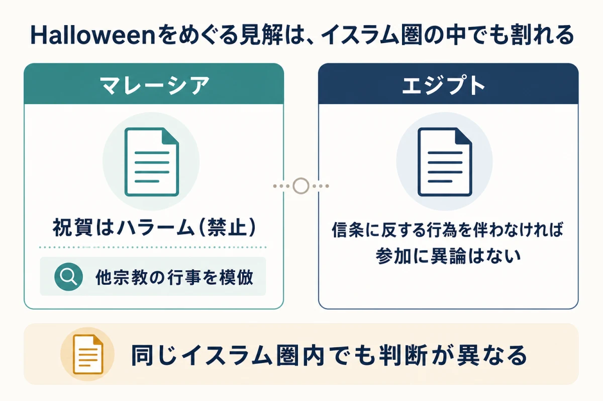
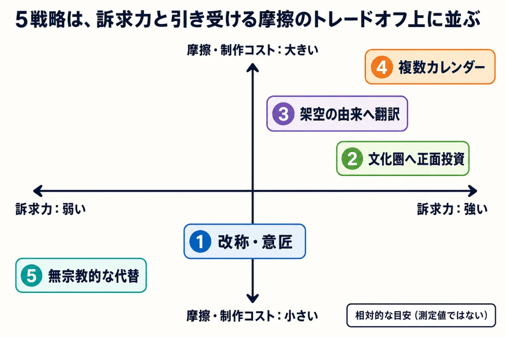

# 世界展開するライブサービスゲームの季節イベント設計――宗教・文化の摩擦と訴求力をどう選ぶか

ライブサービスゲームの季節イベントには、現実世界からプレイヤーを呼び戻す力がある。街の装飾、学校や職場の休暇、SNS上の話題、買い物の季節感とゲーム内の更新時期が重なるため、ゲーム外の空気そのものが告知の入口になるからだ。

Meta Horizon OSの開発者向け公式ブログは、ライブサービスゲームが重視する季節イベントの「ビッグ3」としてSummer、Christmas、Halloweenを挙げている。適切な時期に行事と連動すれば、エンゲージメント、売上、口コミによるプレイヤー基盤の拡大を狙えるという整理である。[[1](#ref-1)]

この強さは、同時に難しさでもある。現実の行事が広く知られているほど、そこには長年の宗教的意味、地域の慣習、商業的な世俗化が重なっている。ある地域では仮装や贈り物を楽しむ社会的行事として受け入れられていても、別の地域では信仰上避けるべき行為とみなされ得る。

本稿が扱うのは、審査機関から修正を命じられる場面ではない。運営側が「どの行事を選び、何という名前で、どの地域へ届けるか」を自発的に決めるイベントカレンダーの設計である。開催目的、報酬、救済、終了処理などの運用メカニクスは「[期間限定イベント設計の実務](limited-time-event-design-practices.md)」へ譲り、ここではテーマ選定に絞る。

***

## 世俗化の度合いは、地域や世代によって異なる

新人プランナーが最初に外すべき前提は、「この行事はもう宗教と関係がない」と世界共通で分類できる、という考え方である。世俗化は、地域、世代、宗派、家庭によって進み方が異なる、連続的な過程である。同じ名称や意匠でも、その意味は集団ごとに異なる。

Halloweenへの見解は、その差をよく表す。マレーシアでは国家ファトワ評議会が2014年、イスラム教徒によるHalloweenの祝賀を禁じる見解を示した。Jabatan Mufti Wilayah Persekutuanも、他宗教の行事を模倣する行為に当たるとして、祝賀はハラームであると整理している。[[2](#ref-2)][[3](#ref-3)] 一方、エジプトのDar al-Iftaは、HalloweenとValentine's Dayを挙げた問いに対し、こうした祝祭は社会的な機会になったため、イスラムの信条に反する行為を伴わない限り参加に異論はないと回答している。[[4](#ref-4)]

つまり、「イスラム圏ではHalloweenが不可」と一括りにすることも、「Halloweenは世界的に世俗化した」と決めつけることもできない。同じ信仰圏の内部にも異なる判断がある。国名や宗教人口比率だけで可否を決めるのではなく、対象地域でその行事が現在どのように理解されているかを調べる必要がある。

この差には、宗教以外の地域条件も重なる。北半球のSummerを南半球へ同じ時期に届ければ、季節感が反転する。旧正月を一つの日付として扱えば、中国、韓国、ベトナムなどで異なる呼称や慣習を平らにしてしまう。現実の行事を使うとは、強い認知を借りる代わりに、地域ごとの差も企画へ持ち込むことである。

***

## 戦略1：名前を変え、意匠と遊びだけを残す

第一の戦略は、宗教的な固有名を外し、プレゼント、雪、卵探し、収穫祭といった分かりやすい意匠や仕組みを残す方法である。

『あつまれ どうぶつの森』の英語版は、イースターをBunny Day、クリスマスをToy Day、感謝祭をTurkey Dayと呼ぶ。任天堂の英語圏向け案内でも、Bunny Dayは島に隠された卵を探す日、Toy Dayは住民へ贈り物を届ける日、Turkey Dayは料理の材料を集める日として紹介されている。[[5](#ref-5)][[6](#ref-6)] その一方で、Halloweenは英語版でも実名のままである。[[7](#ref-7)] 日本語版ではイースター、クリスマス、ハロウィンなどの実名が維持されている。

この差は、すべての行事を同じ規則で匿名化していない点が重要である。対象地域ですでに社会的行事として強く世俗化しているものは実名を残し、宗教的な核や地域固有の意味が強いものは、ゲーム内で行う動作へ名前を付け替える。名称の判断単位を世界共通にせず、言語版ごとに置く設計である。

FortniteのWinterfestとOverwatchのWinter Wonderlandも、Christmasという名称を前面に出さず、雪、贈り物、冬の遊びを中心にした例である。FortniteはWinterfestで日ごとにプレゼントを開ける導線を置き、Overwatchは雪合戦や凍結ルールの対戦を季節体験へ変えている。[[8](#ref-8)][[9](#ref-9)]

改称後も、意匠の選び方には責任が残る。名称をWinterへ変えても、宗教的な歌、礼拝を想起させる表現、特定の信仰を示す記号が中心に残れば、受け止めは変わらない場合がある。反対に意匠を薄めすぎれば、現実の行事から得られる即時認知も弱くなる。改称の目的は由来を隠すことではなく、プレイヤーがゲーム内で実際にすることへテーマの焦点を移すことにある。

***

## 戦略2：狙う文化圏の行事へ、正面から投資する

第二の戦略は、重要市場に向けた正式な季節企画として、その地域の行事を正面から作り込む方法である。

PUBG Mobileは中東・北アフリカ市場に向け、ラマダン期間の専用キャンペーンGolden Moonを毎年展開している。Golden Moon Treasure、Golden Moon Showdown、Golden Moon Blessing、Popularity Ranking、イード・アル＝フィトルの祝宴を模した演出などを組み合わせ、2026年には過去に導入したArabian Nightsテーマも再導入した。AppleのApp Store編集記事も、2026年のGolden Moonをラマダン期間の企画として紹介し、過去の「千夜一夜物語」に着想を得たゲームプレイの復活を伝えている。[[10](#ref-10)] 同作はインド市場へDiwali Dhamaka Eventも展開してきた。[[11](#ref-11)]

Garena Free Fireも、中東・東南アジア市場へラマダン期間のBooyah Ramadanを、インド市場へDiwaliの祝祭イベントを毎年展開している。近年のラマダン更新では、日没、食事、地域的な装飾をゲーム内の時間やマップへ結び付けている。[[12](#ref-12)] Diwaliでは灯火を集めてマップを明るくする企画など、地域の祝祭をゲーム内の共同目標へ翻訳してきた。[[13](#ref-13)]

この戦略が成立する条件は三つある。第一に、対象地域のプレイヤー基盤または成長目標が、専用制作へ投資できる規模にあること。第二に、暦、言語、祝祭中の生活リズム、避けるべき表現を継続して判断できる地域チームや監修体制があること。第三に、一度だけ借りる企画ではなく、毎年改善する運営資産として扱えることである。

正面から扱うほど、間違いが目立つ責任も引き受ける。開催日のずれや表面的な装飾だけの実装は、「自分たちに向けた企画」という期待を裏切りやすい。専用イベントは摩擦を消す手段ではなく、狙う市場との関係を深めるために、理解と制作費を先に支払う選択である。

***

## 戦略3：現実の感情を、ゲーム固有の由来へ翻訳する

第三の戦略は、現実の行事が持つ感情的な核を受け継ぎながら、その意味をゲーム世界の設定へ置き換える方法である。

『原神』の璃月で開催される海灯祭は、現実の旧正月を下敷きにしている。ゲーム内では、過去の戦乱で命を落とした者たちを追悼し、灯りによって故郷へ導くという璃月固有の由来を持つ。公式イベント案内でも、璃月の人々が毎年最初の満月の日に灯りを空へ放つ行事として構成されている。[[14](#ref-14)]

ここでは、家族や仲間が集まること、過去の人々を思うこと、灯りへ願いを託すこと、新しい時期を迎えることが引き継がれ、璃月の歴史と登場人物の物語へ翻訳されている。プレイヤーは現実の旧正月を知っていれば季節感をすぐにつかめるが、知らなくてもゲーム内の説明だけで行事へ参加できる。

この方法が機能するには、架空の由来を受け止める設定と物語上の蓄積が必要である。通常時には存在しない祭りを突然置き、外見だけを現実の行事へ似せても、名称を変えただけに見える。土地の歴史、住民の習慣、毎年再会する登場人物、恒例となる儀式がつながって初めて、イベントはゲーム固有の祝祭になる。

もう一つの条件は、現実との対応を完全に隠さないことである。開催時期も意匠も明らかに旧正月を参照しているのに、関係を否定すれば、プレイヤーが読み取った文化的な接点と運営の説明が食い違う。翻訳とは出典を消すことではなく、ゲーム内で理解できる意味へ組み替えることである。

***

## 戦略4：地域ごとのカレンダーを並行運用する

第四の戦略は、複数の行事にそれぞれ独立した開催枠を与え、地域ごとのカレンダーを並行運用する方法である。

Overwatch 2は、クリスマスを中心とした冬季イベントWinter Wonderland（戦略1で触れた通り）とは別枠で、毎年1月から2月にかけて旧正月を主題にした専用イベントを独立して開催している。2024年の「Year of the Dragon」は、璃江（Lijiang）ナイトマーケットを舞台にしたProp Huntモード、旧正月限定の英雄スキン、期間限定の称号などで構成され、Winter Wonderlandの装飾や報酬とは完全に別に用意された。[[9](#ref-9)][[15](#ref-15)]

この方法の強みは、西洋の冬季イベントを旧正月の代用品にせず、旧正月も「西洋イベントのアジア向け拡張」として吸収しないことにある。それぞれを別の行事として扱うため、複数の生活カレンダーを持つプレイヤーにも意味が通る。Metaの季節行事ガイドも、1月1日の新年と旧正月を別枠で扱い、さらにゴールデンウィーク、端午節、七夕、お盆、中元節、中秋節を非西洋圏の行事として列挙している。[[1](#ref-1)]

代償は制作本数と画面上の競合である。地域別イベントを増やすほど、ローカライズ、告知、アセット、品質確認が並行する。すべての行事を同じ規模で開催すれば、更新が途切れない代わりに、一つひとつの存在感が薄くなる。地域別カレンダーは包摂性を自動的に生む仕組みではなく、複数の優先順位を運用できる組織の選択である。

***

## 戦略5：宗教色の薄い代替行事へ寄せる

第五の戦略は、新暦の正月、エイプリルフール、季節の変わり目、周年など、特定宗教との結び付きが比較的弱い日を軸にする方法である。

この方法は、参加すること自体が信仰上の意思表示に見える摩擦を下げやすい。新年なら目標設定や再出発、エイプリルフールなら冗談やルール変更、Summerなら休暇や屋外活動といった、短い説明で理解できる企画へ落とし込める。

一方、宗教色の薄さは訴求力の強さと同義ではない。Metaの公式ガイドは1月1日の新年を「a quiet day」と評している。エイプリルフールについても、サプライズへの許容度が下がったことで存在感が薄れつつあるとする。対して、ChristmasやHalloweenはエンゲージメントと支出の大きな山を作る行事として扱われている。[[1](#ref-1)]

現実世界でプレイヤーが強く意識していない日を選べば、街頭広告、SNSの話題、贈答需要、長期休暇といった外部の追い風も弱くなる。ゲーム側がイベントの意味を一から説明し、自力で期待を育てなければならない。摩擦を抑えた分だけ、獲得できる注意も小さくなる可能性がある。

周年イベントは、この弱点を補いやすい代替である。開催理由がゲーム自身の歴史にあり、地域の宗教行事へ依存しないからだ。ただし、すでに作品へ愛着のあるプレイヤーには強くても、ゲーム外の人々へ届く社会的な話題は作品の知名度に左右される。無宗教的な日付を選ぶことは、安全な中立点へ移動することではなく、現実から借りる動線を減らし、ゲーム自身のブランド力で補う選択である。

***

## 5戦略を選ぶ四つの判断軸

五つの戦略の優先順位は、地域や年によって組み合わせが変わる。企画初期には、少なくとも次の四軸を並べると判断しやすい。

| 戦略 | プレイヤー基盤の地域集中度 | 開発・運用体制の余力 | ゲーム内に架空の受け皿があるか | 狙える訴求力と引き受ける摩擦 |
| --- | --- | --- | --- | --- |
| 1. 改称して意匠を残す | 広く分散しているタイトルに合わせやすい | 名称・告知・一部意匠を地域別に調整する余力が必要 | なくても成立する | 既知の季節感を残せるが、改称だけでは宗教的連想を消せない |
| 2. 特定文化圏へ正面投資する | 重点市場が明確なときに強い | 地域チーム、監修、毎年の改善予算が必要 | なくても成立する | 対象地域への訴求は強いが、理解不足が直接評価される |
| 3. 架空の由来へ翻訳する | 世界的に分散した基盤でも使える | シナリオ、アート、継続設定の制作力が必要 | 強い受け皿が必須 | 感情的な核を広く届けられるが、設定が薄いと単なる言い換えになる |
| 4. 複数カレンダーを並行運用する | 複数地域に大きな基盤がある場合に向く | 最も大きな制作・告知・品質確認能力が必要 | 行事ごとに選べる | 各地域を正面から扱えるが、更新競合とイベント過多を招きやすい |
| 5. 無宗教的な代替へ寄せる | 地域分散が大きく、共通テーマを優先するときに向く | 比較的小さく始められる | 周年などゲーム固有の理由があると強い | 摩擦を下げやすいが、現実世界からの集客動線は弱くなりやすい |

実務では、対象市場と受け止め方を起点に、次の順番で行事名を絞るとよい。

1. 対象プレイヤーの地域分布と、今回伸ばしたい市場を分ける
2. その市場で行事がどの程度世俗化し、どの意匠が宗教的な核として残っているかを調べる
3. 一つの共通版、地域別名称、専用イベント、並行カレンダーのどこまで制作できるかを見積もる
4. 現実の認知をどこまで借り、代わりにどの反発、説明責任、制作負荷を引き受けるかを決める

判断結果は「開催する・しない」の二択でなくてよい。英語版だけ名称を変える、重点地域だけ専用イベントを追加する、現実の行事とゲーム固有の周年を交互に置く、といった組み合わせがある。大切なのは、全地域へ同じ見た目を配ることを公平とみなさず、各地域で同じ意味に届くかを考えることである。

***

## まとめ：プランナーは、避ける摩擦ではなく引き受ける摩擦を決める

現実の行事には、ゲームだけでは作れない強い入口がある。Halloweenの装飾を見た瞬間に仮装、恐怖、お菓子を連想でき、Christmasなら贈り物や再会を想像できる。その共有知識を借りるほど、イベントは短い説明で期待を作れる。

同時に、その共有知識は世界共通ではない。ある地域で世俗的な遊びになった行事が、別の地域では現在も信仰上の判断を伴う。改称すれば認知が少し失われ、特定地域へ投資すれば監修と継続の責任が増え、架空の由来へ翻訳すれば設定制作が必要になる。複数カレンダーは運用負荷を増やし、無宗教的な代替は現実世界からの動線を弱める。

万能な中立イベントは存在しない。季節イベントの設計とは、摩擦をゼロにする作業ではなく、誰に強く届けるために、どの摩擦と負担を意識的に引き受けるかを決める仕事である。その選択を言語化できたとき、行事名は単なる装飾ではなく、事業とプレイヤー基盤をつなぐ企画判断になる。

## References

1. [Meta Horizon OS Developers「Planning Seasonal In-Game Events」][1] - Summer、Christmas、Halloweenを「ビッグ3」とする整理、新年とエイプリルフールの評価、非西洋圏の行事一覧を掲載した公式開発者向け記事。

2. [Jabatan Mufti Wilayah Persekutuan「The Ruling of Celebrating Halloween」][2] - Halloweenの祝賀をハラームとする見解と、その理由を説明したマレーシア連邦直轄領ムフティ局の公式資料。

3. [Malay Mail「Trick or treat? Fatwa Council bars Muslims from celebrating Halloween」][3] - 国家ファトワ評議会が2014年10月28日付でHalloween祝賀を禁じる見解を公表したことを報じた同時代の記事。ファトワが原則として勧告的な性格を持つ点にも触れている。

4. [Egypt's Dar al-Ifta「Is it forbidden for Muslims to celebrate days such as Valentine's Day and Halloween?」][4] - Halloweenなどを社会的な機会とみなし、信条に反する行為を伴わない参加を認める公式見解。

5. [Nintendo Support「How to Update Animal Crossing: New Horizons」][5] - Bunny Day、Turkey Day、Toy Dayを季節イベント名として掲載した任天堂公式サポート情報。

6. [Play Nintendo「Turkey Day reminder」][6] - Turkey Dayで料理の材料を集める内容を紹介した任天堂公式記事。

7. [Nintendo「Get ready for a fa-boo-lous Halloween in the Animal Crossing: New Horizons game!」][7] - 英語版でもHalloweenの実名を用いてイベントを案内した任天堂公式記事。

8. [Fortnite「Winterfest 2025: Get in the Spirit!」][8] - Winterfestの名称、プレゼント、雪を使った遊びを紹介したEpic Games公式記事。

9. [Overwatch「A Flurry of Fun Returns to Overwatch 2 – Winter Wonderland Begins December 19」][9] - Winter Wonderlandの名称と、雪合戦や凍結を使ったイベントモードを紹介したBlizzard Entertainment公式記事。

10. [App Store「Ready to set the arena aglow?」][10] - PUBG Mobileの2026年Golden Moonと、ラマダン期間に復活した「千夜一夜物語」着想のゲームプレイを紹介したApple公式編集記事。

11. [The Indian Express「PUBG Mobile Diwali Dhamaka event live, offers exclusive in-game items and rewards」][11] - PUBG Mobileがインド向けに展開したDiwali Dhamaka Eventの内容を報じた記事。

12. [Garena Free Fire「Patch Notes: Patch Ramadan」][12] - ラマダンを題材に、日没、食事、地域的な装飾をマップとゲームプレイへ組み込んだ公式パッチノート。

13. [Digit「Garena Free Fire announces 'Light Up Bermuda' event to celebrate Diwali」][13] - インド向けDiwaliイベントと、灯火を集める共同目標を報じた記事。

14. [Genshin Impact Official「Lantern Rite Gameplay Details」][14] - 璃月で毎年最初の満月の日に海灯祭を行い、灯りを空へ放つ設定とイベント内容を掲載した公式案内。

15. [Blizzard Entertainment「Roar Into the Lunar New Year – Year of the Dragon Now Live」][15] - Overwatch 2が、Winter Wonderlandとは別枠で毎年展開する旧正月イベント「Year of the Dragon」の内容を紹介した公式記事。

[1]: https://developers.meta.com/horizon/blog/planning-seasonal-in-game-events/
[2]: https://muftiwp.gov.my/en/artikel/irsyad-fatwa/irsyad-fatwa-umum-cat/1532-irsyad-al-fatwa-series-91-the-ruling-of-celebrating-halloween
[3]: https://www.malaymail.com/news/malaysia/2014/10/28/trick-or-treat-fatwa-council-bars-muslims-from-celebrating-halloween/771879
[4]: https://www.dar-alifta.org/en/fatwa/details/4843/is-it-forbidden-for-muslims-to-celebrate-days-such-as-valentines-day-and-hallowe
[5]: https://en-americas-support.nintendo.com/app/answers/detail/a_id/49112
[6]: https://play.nintendo.com/news-tips/news/acnh-turkey-day-reminder/
[7]: https://www.nintendo.com/us/whatsnew/get-ready-for-a-fa-boo-lous-halloween-in-the-animal-crossing-new-horizons-game/
[8]: https://www.fortnite.com/news/fortnite-winterfest-2025-get-in-the-spirit?lang=en-US
[9]: https://overwatch.blizzard.com/en-us/news/24033785/
[10]: https://apps.apple.com/sg/iphone/story/id1861429417
[11]: https://indianexpress.com/article/technology/gaming/pubg-mobile-diwali-dhamaka-event-live-offers-exclusive-in-game-items-and-rewards-6077526/
[12]: https://ff.garena.com/id/article/1455/
[13]: https://www.digit.in/news/gaming/garena-free-fire-announces-light-up-bermuda-event-to-celebrate-diwali-57148.html
[14]: https://www.hoyolab.com/article/178654
[15]: https://news.blizzard.com/en-us/article/24056253/roar-into-the-lunar-new-year-year-of-the-dragon-now-live

----

この文書は、Perplexity、Claude、OpenAI Codex の3つのAIの支援を受けて著述されたものです。引用画像を除き、MIT License にて提供されています。
