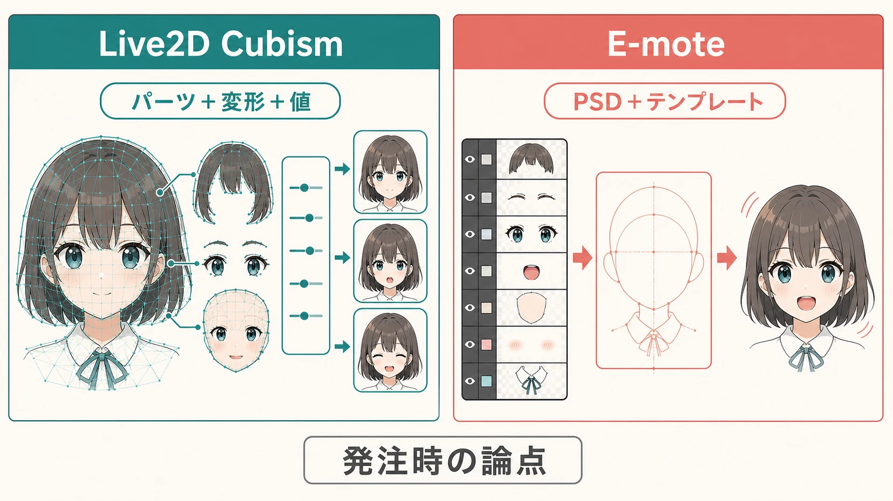
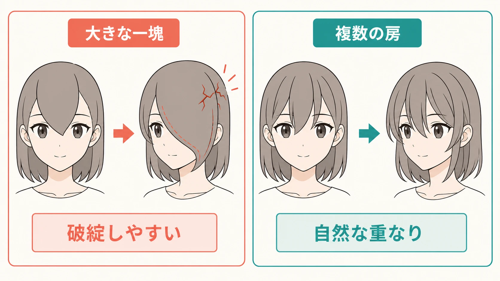
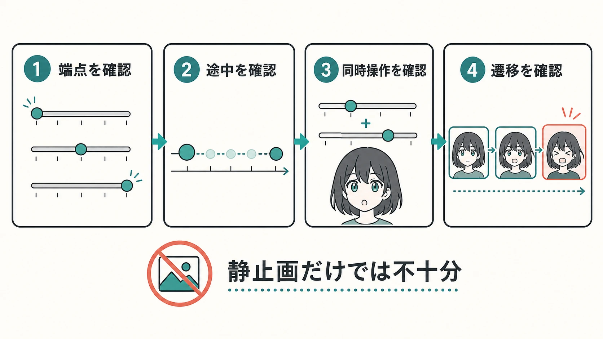

# Live2D／E-moteを用いたキャラクターアニメーション表現の監修基礎――プランナーが3Dモデル監修とは異なる観察軸で議論するために

## はじめに

立ち絵が少し顔を向け、まばたきをし、口を開く。こうした2Dキャラクターの動きは、一枚のイラストを動画へ貼り付けただけでは作れない。髪、目、口、顔の輪郭、服といった原画の部品を別々に動かし、元は平面だった絵に奥行きがあるような見え方を与えている。

Live2D Cubismは、その代表的な制作環境である。レイヤーごとに切り分けた原画パーツへ細かな網目状のメッシュを設定し、頂点を変形させる。たとえば顔を横へ向ける値を変えると、輪郭、目、鼻、髪の各パーツが、それぞれ事前に作られた形へ変形する。Cubismではこの画像パーツをArtMeshとして扱い、まつげや口元のような細部では、変形に合わせてメッシュの頂点を手作業で調整することが推奨されている。[[1](#ref-1)]

ここでいう「パラメータ」とは、動きのつまみである。Angle Xなら顔の左右向き、Angle Yなら上下向き、目の開閉、口の形、口の開閉などに値を持たせ、その値ごとに見た目を登録する。標準パラメータの例では、Angle Xは-30から30、口の開閉は0から1という値で定義されている。[[2](#ref-2)] プレイヤーやゲーム側が値を変えると、キャラクターの見た目も連続的に変わる仕組みである。

本稿は、絵やアニメーションを自ら制作するための解説ではない。絵を描く専門教育を受けていないプランナーが、Live2DやE-moteを用いたキャラクター表現を発注し、完成データを検収するときに、何を見て、どう言葉にするかを整理するものである。3Dモデルとの比較は、2Dパーツ変形の制約を理解するためだけに用いる。動作のタイミングやフレーム単位の演技を扱う[「モーション・アニメーション監修の基礎」](motion-animation-supervision-basics-for-planners.md)とも、対象が異なる。本稿の中心は、平面パーツの疑似立体変形とパラメータ設計である。

> 📺 ここまでの説明を、実際の画面操作で確認したい読者にはLive2D公式のチュートリアル動画を薦める。ArtMesh、メッシュ編集、パラメータ、デフォーマの関係が、簡単な図形を使って短時間で示されている。
> **動画：[Basics of Live2D Cubism with Simple Diagrams](https://www.youtube.com/watch?v=Yq-5egx3ffI)**

  <iframe
    src="https://www.youtube.com/embed/Yq-5egx3ffI"
    title="Basics of Live2D Cubism with Simple Diagrams"
    style="width: 100%; height: 100%; border: 0;"
    allow="accelerometer; autoplay; clipboard-write; encrypted-media; gyroscope; picture-in-picture; web-share"
    allowfullscreen>
  </iframe>

***

## 1. 二つの技術を、監修のために見取り図として捉える

### Live2Dは「パーツ」と「変形」と「値」の組み合わせで動く

Live2Dの原画は、完成イラストを一枚に統合したデータではなく、動かす前提で分けた部品の集まりである。顔を横へ振るなら、奥側に隠れる髪や目も見える可能性があるため、正面絵で隠れている部分まで描き足しておく必要がある。口を開けるなら、口の線だけでなく、口内、歯、舌をどう見せるかも分け方に影響する。

その部品を、メッシュ変形や親子関係を持つ変形器で動かす。さらに、パラメータの特定の値に「このときの形」を登録する。Cubismでは、パラメータへキーを追加して変形の形をキー形式で登録し、モーションを適用する。[[3](#ref-3)]

したがって、画面上で起きていることは、3D空間に完全な頭部が存在し、それをカメラが回り込んでいることとは違う。正面向き、少し左向き、少し右向きといった絵の間を、あらかじめ用意した変形でつないでいる。もっとも、見た目が自然であれば、プレイヤーにその制作上の違いを意識させる必要はない。プランナーが意識すべきなのは、表現の限界が「どの角度まで本当に存在するか」ではなく、「どのパーツを、どの値の範囲まで、どう変形できるか」で決まる点である。

### E-moteはテンプレートを生産の基準にする

E-moteは、有限会社エムツーが開発する「Emotional Motion Technology」の名称であり、2Dイラストへ立体感のあるアニメーションを与える技術である。[[4](#ref-4)] E-moteでもパーツ分けされたイラストを用いるが、テンプレートを活用してセットアップするアプローチに特徴がある。公式サイトでは、パーツ分けされたPSDファイルをテンプレートへインポートすることで自然な動きを得ることを案内しており、テンプレートとPSDの配布も行っている。[[5](#ref-5)]

ここで重要なのは、「E-moteなら原画の分け方を考えなくてよい」という意味ではないことである。テンプレートが想定するレイヤー名、パーツの役割、差分の置き方に合わせるほど、制作の再現性は上がる。反対に、キャラクター固有の髪型、衣装、極端な表情がテンプレートの想定を外れるほど、調整や追加の設計が必要になる。

Live2DとE-moteを単純に優劣で並べるより、次のように捉えると発注時の議論がしやすい。

| 観点 | Live2D Cubism | E-mote |
| --- | --- | --- |
| 基本の見方 | 原画パーツへ変形を設計し、パラメータ値ごとの形を作る。 | PSDとテンプレートを結び付け、一定のセットアップ手順へ乗せる。 |
| 強く意識するもの | キャラクター固有の分割、メッシュ、パラメータの設計である。 | テンプレートへ適合するPSDの構造と、量産時の一貫性である。 |
| プランナーの確認 | 欲しい表情・向き・組み合わせを値として定義できているかである。 | 採用テンプレートで必要な構図・衣装・差分が扱えるかである。 |

これは内部実装の優劣表ではない。完成イラストの個性をどこまで個別設計へ委ねるか、複数キャラクターの生産手順をどこまで揃えるかという、発注とスケジュールの論点を把握するための表である。

### ライセンスは「制作費」と別に、早い段階で確認する

ツール選定では、表現、既存の制作体制、対象プラットフォームに加え、ライセンスの設計も確認対象になる。Live2D Cubism Editor PROは、直近会計年度の売上高が1,000万円未満か以上かなど、利用者・事業者の規模によってfor indieとfor businessの対象が分かれるサブスクリプション型である。判定はLive2Dを使う事業だけでなく、会社全体の売上高を基準とする。[[6](#ref-6)]

一方、E-moteのコマーシャルプランは、エディタとSDKを含む年単位の定額契約を基礎に、タイトル数不問の1年間または1タイトルの2年間から選ぶ仕組みを掲げている。[[5](#ref-5)] これは「E-moteは必ず年額」「Live2Dは必ずこの金額」と短絡するための情報ではない。契約対象、エディタ数、SDK、プラットフォーム、タイトル数、サポートを見積もりの前提として確認するための情報である。料金・対象条件・プラン名は改定されうるため、発注時には各社の最新の製品・契約ページで確認する必要がある。

また、Live2D Cubismでは、制作に使うEditorのライセンスと、完成したコンテンツを配信・公開する際に必要なSDKのリリースライセンス（Publication License Agreement）は別契約である。SDKを用いたコンテンツを公開する事業者に向けた契約であり、個人および小規模事業者は原則としてこの契約と支払いを免除されている。採用時は、Editorの利用条件だけでなく、対象プラットフォームでの配信・運用に必要なSDK契約を個別に確認する必要がある。[[7](#ref-7)]

***

## 2. 3Dモデル監修と同じ言葉では、見落とすものがある

### 全方位の立体を検証する3Dと、指定範囲の変形を検証する2D

3Dモデルは、立体データを基に、カメラを任意の方向へ回し、任意のポーズを取らせて検証できる。ポリゴン数、トポロジー、ボーン、ウェイトなど、担当者と数値や構造で会話しやすい指標もある。

対してLive2DやE-moteのキャラクターは、平面パーツを変形して立体感を作る。検収で「横顔が見たい」と言う場合も、真の横顔が存在するかを問うのではない。想定しているAngle Xの範囲で、鼻、目、髪、輪郭の前後関係が自然に見えるかを問うことになる。

この違いは、破綻の現れ方を変える。3Dであれば、肩を大きく回したときのめり込みや、どの方向から見ても崩れる形状を見つける。2Dパーツ変形では、普段の正面や中央値では成立しているのに、顔を右へ最大まで向け、口を大きく開け、笑い目を重ねた瞬間だけ、頬の陰影が飛び出す、歯が消える、髪の端が不自然に伸びる、といった局所的な破綻が起きる。

プランナーが問うべき言葉も変わる。

- 3Dでは「このポーズで衣装と腕が干渉しないか」と問う。
- 2Dパーツ変形では「顔右向きの最大値で、口開閉と笑い目を同時に最大にしたとき、口内と頬の境界が保たれるか」と問う。

後者は細かく聞こえるが、ツールの画面で再現でき、担当者と同じ現象を見られる指示である。

### 発注の勝負所は、動かす前のパーツ分割にある

3D制作でも、可動を見越してモデル形状やボーンの設計を調整する。ただし、モデル化の後でも、リグやウェイト、補助ボーンなどで改善できる余地がある。

2Dパーツ変形では、原画を描く段階の分割が、その後の可動域を強く制限する。前髪を一つの大きな塊にするか、顔の前後関係を作れる複数の房にするか。頬の影を肌と一体にするか、独立パーツにするか。閉じた口を一枚の線にするか、口内・歯・舌を用意するか。この選択は、あとから「もう少し顔を振りたい」「怒りながら笑わせたい」となったときの修正範囲を決める。

だから、イラスト発注書には「Live2D用にパーツ分け」とだけ書かない。次の二つを、原画着手前に合意する。

1. **何を動かすか** ：顔の向き、目線、まばたき、口、眉、表情、髪、上半身、衣装の揺れのうち、どれをゲームで使うかである。
2. **どこまで動かすか** ：顔は正面から軽く振るだけか、会話中に大きく向きを変えるか。口はリップシンクだけか、歯を見せる笑顔や叫びも必要かである。

この合意があれば、イラストレーターは見えない部分を描き足す範囲を判断でき、モデラーは可動域に見合うメッシュやテンプレートを選びやすい。後から必要になった表情を「差分一枚の追加」と考えると、既存パーツとの前後関係、マスク、変形、組み合わせの修正まで波及することを見落としやすい。

### 検収対象は、一つの表情ではなく「表情の直積」である

「表情が豊か」という要望は、表情差分の枚数だけでは満たせない。角度、目の開閉、目線、眉、口の形、口の開閉、頬、髪揺れといった値は、同時に変わりうる。各項目を単体で確認して合格にしても、組み合わせると想定外の変形が出る。

すべての組み合わせを人手で総当たりする必要はない。プランナーは、ゲームで実際に重なる組み合わせと、値の端にある組み合わせを選んで検証表にする。たとえば次のような表である。

| 優先度 | 組み合わせ | 見る場所 | 合格の基準 |
| --- | --- | --- | --- |
| 高 | 右向き最大 × 口開閉最大 | 口内、歯、頬、輪郭 | 歯・口内が欠けず、肌色の境界が露出しない。 |
| 高 | 左向き最大 × 怒り眉 × 口角下げ | 眉、前髪、目尻 | 眉が髪へ食い込まず、怒りの向きが読める。 |
| 高 | 笑い目 × 口開閉最大 × 頬 | 目の輪郭、口、頬の陰影 | 目と頬の線が重なって潰れず、笑顔として読める。 |
| 中 | 上向き最大 × まばたき | まつげ、額、前髪 | まつげが浮かず、額の隠れ方が急変しない。 |
| 中 | 髪揺れ最大 × 顔向き最大 | 前髪、横髪、顔輪郭 | 顔の重要な部位を隠さず、房の伸びが不自然でない。 |

表中の「×」は演算式ではなく、同時に動かす条件を表す記号である。最初にこの表を作れば、制作側へ必要な検収範囲を渡せる。完成後に違和感を見つけるための表ではなく、最初から破綻を防ぐための設計書である。

### 静止画ではなく、値を往復させて境界を見る

静止画の確認は必要だが、十分ではない。中央値、左端、右端の三枚がきれいでも、中央から端へ動く途中でテクスチャが急に伸びる、パーツの順序が反転する、口内が一瞬だけ現れるといった問題が残る。

検収では、パラメータを実際にスライダーで動かし、最小値から最大値まで往復させる。特に確認したいのは、次の四種類である。

- 最小値、中央値、最大値である。
- 中央値から端へ近づく途中の変化である。
- 二つ以上のパラメータを同時に動かしたときの変化である。
- 表情やモーションの遷移中に、不要な形が一瞬出ないかである。

「端で破綻している」なら、可動域を狭める、原画パーツを追加する、メッシュを調整する、特定の組み合わせで値を制御するなど、解決策を担当者と選べる。目的は常に最大値を実現することではない。ゲーム中で必要な範囲を、破綻なく維持することである。

***

## 3. 感想を、直せる指示へ変える

「もっとぬるぬる動いてほしい」「もっと表情豊かにしてほしい」は、意図としては理解できる。しかし、どのパラメータの、どの値で、何が不足しているのかが分からないため、担当者は修正範囲を決められない。

言い換えるときは、観察した条件、画面で起きた現象、期待する見え方を順番に伝える。

| 曖昧な感想 | 観察可能な言い換え | 修正の議論で決めること |
| --- | --- | --- |
| もっとぬるぬる動いてほしい | 顔の左右向きが中央から右へ移る途中で、右目の位置が一段跳ねて見える。中間の変形を連続して見えるようにしたい。 | 中間キーの追加、変形量、可動域のいずれを調整するか。 |
| もっと表情豊かにしてほしい | 喜びと困惑で眉の角度と口角が同じため、口を閉じると区別が読めない。眉の形か目の開き方に差を作りたい。 | 必要な感情状態、優先する顔部位、追加差分の要否。 |
| 顔をもっと横に向けてほしい | 右向きの最大値で、奥側の目が顔輪郭と髪に隠れて目線が読めない。会話画面で必要な右向きまで、両目の位置関係を保ちたい。 | 目・髪・輪郭の分割追加、または可動域の再定義。 |
| 口元が不自然である | 笑い目と口開閉最大を重ねると、上の歯が肌パーツの後ろへ入り、発話中に消える。歯を見せる表情では常に見える状態にしたい。 | パーツの描画順、マスク、口内の形、組み合わせ時の制御。 |
| 髪がうるさく見える | 顔の向きより前髪の揺れが大きく、会話中に目を隠す。顔の向きが分かる範囲へ揺れ幅を抑えたい。 | 髪揺れの振幅、追従の遅れ、顔前面に置く房の優先度。 |

この形式には、制作者へ修正方法を決めつけない利点がある。プランナーは見た目の意図とゲーム中の使用条件を示し、イラストレーター、モデラー、実装担当が、分割追加・メッシュ調整・値の制限・演出側の制御から適した手段を選ぶ。

***

## 4. 発注から検収までの実務チェックリスト

### 原画発注前

- **用途を固定する** ：会話立ち絵、ホーム画面、戦闘中のバストアップ、配信向け表示など、使う画面と表示サイズを共有する。
- **必要な可動域を決める** ：顔向き、目線、まばたき、口、表情、髪、上半身のうち、何をどの程度動かすかを決める。
- **パーツ分割方針を合意する** ：前髪の房、左右の目、眉、顔輪郭、頬の陰影、口内、歯、衣装の重なりを、可動と表情の要件から分ける。
- **追加表情の扱いを決める** ：基本パラメータへ組み込むのか、切り替え専用の差分にするのかを決める。
- **テンプレートの適合を確認する** ：E-moteを使う場合は、採用するテンプレート、PSDのレイヤー構造、必要な構図・衣装・差分の適合を制作前に確認する。

### 制作中

- **パラメータ一覧を共有する** ：名前、最小値、標準値、最大値、ゲーム側から操作するかどうかを一覧にする。
- **代表組み合わせを先に選ぶ** ：顔の左右・上下、目、眉、口、髪を同時に動かす高優先度の組み合わせを、検収表に登録する。
- **中間値を動画で確認する** ：端点の静止画だけでなく、スライダーを往復させて途中の跳ね、伸び、ちらつきを見る。
- **画面内のサイズで見る** ：拡大したエディタ画面と、実機またはゲーム内の会話画面の両方で確認する。

### 納品・検収時

- **境界値を確認する** ：各パラメータの最小値・中央値・最大値を、単体と代表的な組み合わせで確認する。
- **重なりを確認する** ：歯、口内、目、眉、前髪、頬の陰影、衣装の縁が、特定条件で消えたり前後逆転したりしないかを見る。
- **遷移を確認する** ：表情切り替え、まばたき、発話、待機中の揺れで、一瞬だけ不自然な形が出ないかを見る。
- **実装側の入力範囲を確認する** ：ゲームが送るパラメータ値が、モデル側で検証した可動域を超えないようにする。
- **ライセンスを確認する** ：ツール本体だけでなく、エディタ数、SDK、対象プラットフォーム、契約期間、事業規模の条件を、契約時点の公式情報で確認する。

## おわりに

Live2DやE-moteの監修でプランナーが見るべきものは、「絵がきれいに動くか」という印象だけではない。どの原画パーツが、どのパラメータで、どこまで変形し、どの組み合わせで成立するかである。

3Dモデルのように全方位を一律に確認するのではなく、ゲームで使う値の範囲と、その境界で重なる表情を具体的に選ぶ。原画発注前にパーツ分割と可動域を合意し、完成時には静止画だけでなく値を往復させて検証する。この二つを制作工程へ入れるだけで、「もっと自然に」という感想を、再現できる修正依頼へ変えられる。

## References

1. [Edit Mesh manually][1] - Live2D CubismのArtMeshと、変形に合わせたメッシュ編集の公式マニュアル。

2. [Standard Parameter List][2] - Angle X／Y、目、口などの標準パラメータと値の例。

3. [Add/Delete Keys to/from parameters][3] - パラメータへキーを登録し、変形を設定する手順の公式マニュアル。

4. [『超・立体』映像技術「E-mote」のライセンス提供開始のお知らせ][4] - 有限会社エムツーによるE-moteとEmotional Motion Technologyの説明。

5. [E-moteについて][5] - PSDのインポートとテンプレートを用いるセットアップ、およびコマーシャルプランの契約形態・料金に関する公式説明。

6. [「Cubism PRO for business」の対象となる売上高の範囲は？][6] - Live2D Cubism PROの事業規模による対象区分の公式ヘルプ。

7. [SDK Release License (Publication License Agreement)][7] - Live2D CubismのEditorライセンスとは別契約となるSDKリリースライセンスの公式説明。個人・小規模事業者は契約と支払いを免除される。

[1]: https://docs.live2d.com/en/cubism-editor-manual/mesh-edit-manual/
[2]: https://docs.live2d.com/en/cubism-editor-manual/standard-parameter-list/
[3]: https://docs.live2d.com/en/cubism-editor-manual/edit-parameters/
[4]: https://www.mtwo.co.jp/blog/2012/12/15/e-mote-licence/
[5]: https://emote.mtwo.co.jp/about/
[6]: https://help.live2d.com/license/license_24/
[7]: https://www.live2d.com/en/sdk/license/

----

この文書は、Perplexity、Claude、OpenAI Codex の3つのAIの支援を受けて著述されたものです。引用画像を除き、MIT License にて提供されています。
