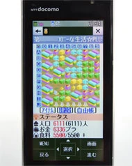
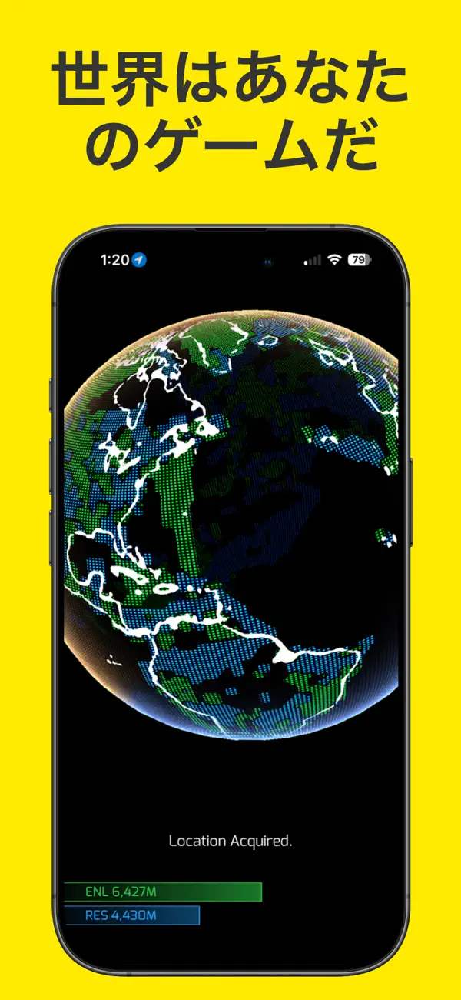

# 位置情報ゲームの歴史と新規企画のポイント

***

## エグゼクティブサマリー

位置情報ゲームは2000年代初頭の日本における携帯電話向けサービスに端を発し、スマートフォンの普及、AR技術の進化、そして世界的IPとの融合を経て、現在では日本が世界最大の市場を形成するジャンルへと成長した。本稿では、その歴史的経緯を時系列で整理した上で、転換点となったタイトルを比較分析し、新規企画に際して必要な視点—IP親和性、ゲームシステムのミックス設計、そして現実社会との衝突—を論じる。

***

## 第1部：位置情報ゲームの歴史

### 第1の波：黎明期（2000〜2007年）—ケータイと基地局測位の出会い

位置情報ゲームの歴史は、2000年12月にJ-フォン（現ソフトバンク）の位置情報サービス「ステーション」と同時に公開された「誰でもスパイ気分」「クリックトリップ」にまで遡る。ただし、この時代の「位置情報」は、現在のスマートフォンのように端末側のGPSで精密な緯度経度を取得するものとは限らなかった。J-フォンのステーションは、基地局から送出されるセル単位の大まかなエリア情報をもとに、端末のいる地域に応じた情報を配信するサービスだった。[[1](#ref-1)][[43](#ref-43)]

そうした時代に「位置ゲー」の原点となったのが、2003年5月に大学院在学中の馬場功淳氏が個人でサービスを開始した『コロニーな生活』である。開発のきっかけはDDIポケット（のちのWILLCOM）のPHS端末「AIR-EDGE PHONE」であり、馬場氏自身も、同端末が基地局ベースの位置情報を取得でき、かつ定額通信に対応していたことを出発点として語っている。このゲームは、プレイヤーが携帯電話やPHSの位置登録機能で現在地を登録し、移動距離に応じて獲得した仮想通貨「プラ」でコロニーを育てるシミュレーションゲームだった。[[44](#ref-44)][[3](#ref-3)][[4](#ref-4)]

*画像引用: [ITmedia Mobile - コロプラの位置ゲー「コロニーな生活☆PLUS」が被災地支援に役立つ理由](https://www.itmedia.co.jp/promobile/articles/1104/15/news065.html)（掲載画像, © COLOPL。本文中の初期位置情報ゲームの画面説明に必要な範囲で引用）*

2005年5月にはサービスを「コロニーな生活☆PLUS」として正式リリース。2007年にはNTTドコモのiエリアに対応し、GPS機能がない携帯電話でも基地局情報を使って位置登録できるようになったことが、急速なユーザー増加のきっかけになった。2008年10月の法人化（コロプラ）から約1年間でユーザー数は10倍以上に伸び、100万人以上の登録会員を獲得した。なお「位置ゲー」という言葉はこのゲームが生み出した造語であり、2007年には正式に商標登録されている。[[45](#ref-45)][[5](#ref-5)][[2](#ref-2)]

同時期には、マピオン（現ONE COMPATH）が展開した「ケータイ国盗り合戦」のように、日本全国の地域を仮想的に「国盗り」するタイトルも登場し、位置情報ゲームは黎明期の多様なアプローチを試みていた。[[6](#ref-6)]

### 第2の波：スマートフォン移行期（2008〜2015年）—Ingressと世界進出

2008年以降、モバイル端末のトレンドが携帯電話からスマートフォンへと移行するにつれ、位置情報ゲームも新たなステージへと進化した。[[7](#ref-7)]

ここで重要だったのは、位置情報の取得方法が、基地局エリアを前提とした「位置登録」から、端末側のGPS測位と地図アプリを前提とする常時的な現在地表示へ移っていったことだ。象徴的には、2008年のiPhone 3Gが「位置情報ベースのモバイルサービス」を広げる機能として内蔵GPSを搭載し、スマートフォン向けアプリの基盤を整えた。これにより、位置情報ゲームは「どのエリアにいるか」を判定する遊びから、地図上の現在地、周辺の地点、移動経路をリアルタイムに扱う遊びへと設計の重心を移していく。[[46](#ref-46)]

決定的な転換点となったのが、Googleの社内スタートアップ「Niantic Labs」が2012年11月にベータ版を公開し、2013年12月に正式リリースした『Ingress』だ。Ingressは現実のGoogleマップ（地図データ）を使用し、世界中に実在する建造物や名所旧跡を「ポータル」として陣取りを行う、2陣営制のリアルタイム戦略ゲームである。[[8](#ref-8)][[9](#ref-9)]

*画像引用: [App Store - Ingress](https://apps.apple.com/jp/app/ingress/id576505181)（公式ストア掲載スクリーンショット, © Niantic Spatial, Inc.。本文中の位置情報ゲーム表現の説明に必要な範囲で引用）*

Ingressの革新性は以下の3点に集約される。第一に、 **ゲームフィールドが現実世界そのもの** であり、ポータルを確保するために実際にその場所へ足を運ぶ必要があった点。第二に、陣営という概念によって **コミュニティの自発的な組織化** が促され、現実世界でのグループ活動が生まれた点。第三に、謎解きやストーリー要素を加えることで、単なる陣取りを超えた **世界観への没入** を実現した点だ。Ingressは世界200以上の国と地域に配信され、2000万ダウンロードを突破した。[[10](#ref-10)][[8](#ref-8)]

また2014年には、日本独自の発展として「ステーションメモリーズ！（駅メモ！）」がリリースされた。鉄道駅を舞台に、鉄道車両を擬人化した「でんこ」キャラクターとGPSを使って全国9,000以上の駅を訪問するこのゲームは、「美少女・擬人化・位置情報」という日本市場に最適化した組み合わせで独自の人気を確立した。[[11](#ref-11)]

### 第3の波：大衆化と世界的爆発（2016〜2019年）—ポケモンGOの衝撃

2016年7月、Nianticと株式会社ポケモンの共同開発による『ポケモンGO』がリリースされ、位置情報ゲームは文字通り「社会現象」となった。リリースから20日間で1億ドルという売上はモバイルゲーム史上最速の記録であり、Google Playランキングで即座に1位を獲得した。[[12](#ref-12)][[13](#ref-13)]

*画像引用: [App Store - Pokémon GO](https://apps.apple.com/jp/app/pok%C3%A9mon-go/id1094591345)（公式ストア掲載スクリーンショット, © Niantic / Nintendo / Creatures / GAME FREAK。本文中の作品紹介・ゲームループ説明に必要な範囲で引用）*

ポケモンGOが従来の位置情報ゲームと決定的に異なっていた点は、Ingressの陣取りシステムをベースにしながら、 **RPG的なコレクション・育成要素** を付加したことだ。プレイヤーはフィールドを歩き回ってポケモンを捕獲し、アイテムを集め、ジムで対戦するという、「外出」「収集」「育成」「対戦」を一体化したゲームループを実現した。また、世界中の子ども・大人に親しまれたポケモンIPの採用により、コアゲーマー以外—女性ユーザー、中高年層、非ゲーマー層—も取り込むことに成功した。2023年2月時点での累計収益は65億ドルを突破している。[[14](#ref-14)][[15](#ref-15)][[12](#ref-12)]

### 第4の波：IP多様化と市場の成熟（2019年〜現在）

ポケモンGOの成功を受け、有力IPを持つ他社も位置情報ゲーム市場に参入した。

**2019年**：スクウェア・エニックスとコロプラの共同開発による『ドラゴンクエストウォーク』がリリース。目的地を設定し実際に歩いてクエストを進めるRPGシステムに、ドラゴンクエストの世界観とバトルシステムを直接移植した設計で、2023年の日本国内収益は約3億ドル（443億円）に達し、日本の位置情報ゲーム収益の約半分を占めるトップタイトルとなった。[[16](#ref-16)]

**2019年**：NianticとWBゲームズによる『ハリー・ポッター：魔法同盟』がリリース。IPの世界的知名度は高かったものの、ゲームシステムの難解さやコミュニティ形成の弱さなどが影響し、2022年1月にサービスを終了した。IPの強さだけでは位置情報ゲームは成立しないことを示す失敗事例となった。[[17](#ref-17)]

**2021年**：Nianticと任天堂の共同開発による『ピクミン ブルーム』がリリース。歩くことで花を植え、ピクミンを育てるという「散歩の記録」に近いライトな設計が特徴だ。競争要素を排除し、健康促進・外出動機づけを前面に出したコンセプトは、位置情報ゲームの可能性を新たな方向に広げた。[[18](#ref-18)]

**2023年**：カプコンとNianticの共同開発による『モンスターハンターNow』と、コーエーテクモゲームスの『信長の野望 出陣』がほぼ同時にリリース。モンハンNowは1回の狩り（戦闘）が最大75秒で完結する設計で、位置情報ゲームと本格アクションの融合を実現した。信長の野望 出陣は歴史好き・ソロプレイヤー向けのニッチ路線で独自のポジションを確立している。[[19](#ref-19)][[20](#ref-20)]

2023年時点で、日本の位置情報ゲーム市場は年間収益6億ドル（約887億円）以上を記録し、これは世界全体の約50%を占める世界最大の市場である。[[21](#ref-21)]

***

## 第2部：転換点タイトルの比較

| タイトル | 年 | 開発元 | ゲームシステム | IP強度 | 結果 |
|---|---|---|---|---|---|
| コロニーな生活 | 2003/2005 | コロプラ | 移動距離→コロニー育成 | オリジナル | 草分け、22年継続[[22](#ref-22)] |
| Ingress | 2012 | Niantic | 陣取り・ARポータル | オリジナル | 2000万DL、次世代の基盤[[10](#ref-10)] |
| ポケモンGO | 2016 | Niantic×ポケモン | コレクション+育成+対戦 | 超強力（世界的） | 累計収益65億ドル突破[[15](#ref-15)] |
| ハリー・ポッター：魔法同盟 | 2019 | Niantic×WB | ARコレクション+謎解き | 強力（世界的） | 2022年サービス終了[[17](#ref-17)] |
| ドラクエウォーク | 2019 | コロプラ×SE | 目的地RPG+コマンドバトル | 強力（日本中心） | 2023年国内収益1位[[16](#ref-16)] |
| ピクミン ブルーム | 2021 | Niantic×任天堂 | 散歩記録+育成 | 中程度 | ライト層に浸透[[18](#ref-18)] |
| モンハンNow | 2023 | Niantic×カプコン | 75秒ハンティング | 強力（国際） | 国内収益3位[[23](#ref-23)] |
| 信長の野望 出陣 | 2023 | コーエーテクモ | 領地拡大+歴史武将 | 中程度（歴史好き） | ソロ向けニッチで安定[[19](#ref-19)] |

ハリー・ポッター：魔法同盟の失敗は、IPだけでなく「ゲームループの明確さ」と「コミュニティ設計」が成否を左右することを示した。逆にドラクエウォークの成功は、既存IPのゲームシステム（ターン制コマンドバトル）をほぼそのまま移植することで、既存ファンの参入障壁を低下させる手法の有効性を証明した。[[24](#ref-24)][[17](#ref-17)]

***

## 第3部：新規企画のポイント—IPとゲームシステムの設計

### IP親和性：ジャンル別の適合性分析

位置情報ゲームにおけるIPの親和性は、「コンテンツの本質と移動・探索行動がどれだけ自然に結びつくか」によって決まる。

#### 高親和性のIPジャンル

**コレクション・モンスター系**
ポケモンに代表されるこのジャンルは、「野生の生き物が現実世界に潜んでいる」という世界観が位置情報ゲームの設計と本質的に一致している。デジモン、ドラゴンボール（モンスター要素）、妖怪ウォッチなどは高い親和性を持つと考えられる。「出現エリアの差別化」によってプレイヤーに移動動機を与えやすい点が最大の利点だ。

**歴史・領土系**
信長の野望 出陣が実証したように、「歴史上の地名や史跡が現実に存在する」という特性が位置情報ゲームと自然に融合する。三国志、源平合戦、戦国時代を題材にしたIPは、城跡・古戦場・歴史的名所といった実在の場所を「聖地」として機能させやすい。旅行・観光との連携も図りやすい。[[6](#ref-6)]

**探偵・スパイ・謎解き系**
「現実世界を歩き回って手がかりを集める」というゲームプレイが探偵・謎解きコンテンツの本質と完全に一致する。逆転裁判やコナンのようなIPは、チェックポイント（ポータル相当）で事件の証拠を収集するゲームループが自然に成立する。

**スポーツ・健康系**
歩行や移動そのものをゲーム化するため、健康・スポーツコンテンツとの親和性は高い。ランニング促進や特定のスポーツIPとの連携（例：NBA All-World）は、ゲームのコアバリュー「外出することへのご褒美」と直接結びつく。[[25](#ref-25)]

**環境・自然・動植物系**
ピクミン ブルームが示したように、自然・環境・植物をテーマにしたIPは「街を歩いてきれいにする」「花を植える」という行為と親和性が高い。ライト層・ファミリー層向けのポジショニングが可能だ。[[18](#ref-18)]

#### 中程度の親和性のIPジャンル

**RPG・ファンタジー系**
ドラクエウォークは成功したが、位置情報ゲームのフィールド移動とRPGのストーリー進行の乖離を埋めることが難しい。ルートを「ダンジョン」や「街道」として設計することで親和性を高めることはできるが、ゲームシステムの設計に高いコストが伴う。[[26](#ref-26)]

**アニメ・マンガ系（バトル中心）**
ドラゴンボールやNARUTOのような格闘系は、「場所を巡って強敵を倒す」設計は可能だが、「なぜその場所に行くか」という動機が希薄になりがちだ。フィールド上の敵出現とバトルシステムのみでは差別化が難しい。

#### 低親和性のIPジャンル

**純粋なシミュレーション系**
都市建設・経営シミュレーションのIPは、「外を歩く行為」と「施設を管理する行為」の結びつきが弱い。コロニーな生活はその困難を独自のシステムで乗り越えたが、既存のシミュレーションゲームIPの移植には大きな設計変換が必要だ。

**ホラー・成人向け系**
立ち入り禁止エリアへの誘導リスクや、深夜プレイの誘発などの安全上の問題が設計段階から生じやすい。プレイヤー層との整合性も取りにくい。

### ゲームシステムのミックス：メリットとデメリット

位置情報ゲームに他のゲームシステムをミックスする手法は、現代の成功タイトルが共通して採用する戦略だ。しかし、その実施には明確なトレードオフが存在する。

#### コレクション+育成ミックス（ポケモンGOモデル）

**メリット**
- 「収集欲」というプレイモチベーションが自然に長期リテンションにつながる
- IPのキャラクター資産をゲームプレイの中核に置けるため、IP愛とゲームプレイが直接連動する
- 進化・強化による「成長実感」が定期的なログインの動機を生む

**デメリット**
- コレクション要素の拡充に継続的なコンテンツ開発コストが必要
- 収集が完了に近づくとモチベーション低下が起きやすい
- レアリティ設計次第では課金圧力が社会問題化するリスクがある

#### RPG+バトルミックス（ドラクエウォークモデル）

**メリット**
- 既存IPのゲームシステムを熟知したファンが移入しやすく、学習コストが低い
- クエスト・ストーリー進行というRPGの骨格が、継続的なプレイ動機を与え続ける
- 「目的地設定→移動→達成」のゲームループが健康促進との親和性も高い[[24](#ref-24)]

**デメリット**
- バトルやスキル管理など複雑なシステムは位置情報ゲームのライト層が離脱しやすい
- ストーリー更新の頻度がライフサイクルに直結するため、運用コストが高い
- 「外に出ることの意義」が薄くなると、自宅でも操作できる一般モバイルRPGとの差別化が崩れる

#### 陣取り・テリトリーコントロールミックス（Ingressモデル）

**メリット**
- コミュニティによる自発的な組織化が起きやすく、運営コストを抑えながら深いエンゲージメントを実現できる
- 競争要素によって「特定の場所に行く必然性」が常に生まれるため、長期的なフィールド活性化が可能
- 地域との連携イベント設計がしやすい

**デメリット**
- 過疎地と人口密集地でゲーム体験に著しい差が生じる
- 対戦・競争がコアで、カジュアル・ライト層の参入障壁が高い
- チート（GPS偽装など）への対策コストが高く、競争の公平性維持が難しい

#### 散歩記録+育成ライトミックス（ピクミン ブルームモデル）

**メリット**
- 競争要素を排除することで幅広い年齢層・属性に訴求できる
- 健康アプリ・歩数計との連携で非ゲーマー層の獲得が可能
- 社会的トラブルが発生しにくく、自治体や企業とのコラボレーションがしやすい

**デメリット**
- ゲームとしての「深度」が浅く、コアゲーマーには物足りなさが残る
- 収益化の設計が難しく、単価が低くなりがち
- 競争がないため「何のためにプレイするか」という動機の維持設計が困難

### 新規企画における重要な設計原則

**1. 「外に出る理由」を最優先で設計する**
位置情報ゲームの本質は「移動する動機の創出」だ。これが弱いと、すぐに「家の中でできるゲーム」と変わらなくなる。ゲーム内の目的地となる地点（POI：Point of Interest）の魅力、出現するコンテンツの希少性、時間帯・天候による変化など、「今・ここに行く意味」を常に担保する設計が不可欠だ。[[7](#ref-7)]

**2. 日本市場特性を踏まえたIPと移動手段の選定**
日本が世界最大の位置情報ゲーム市場を形成している背景には、電車・徒歩中心の移動手段、治安の良さ、そして日本発のIPの多さがある。電車通勤・通学という「毎日の強制的な移動」と連携できるIPやゲームループを設計できると、日本市場での成功確率は高まる。[[21](#ref-21)]

**3. グローバル展開を見据えたIP選定**
コロプラが2026年に提示している戦略のように、「有力IPとの組み合わせによるグローバルヒット」と「新しい体験による新規ユーザー獲得」という2軸での設計が有効だ。日本のIP強度（ドラクエ、モンハン等）を最大限活かしつつ、国際的認知度の高いIPと組み合わせることが重要になる。[[27](#ref-27)]

***

## 第4部：コラム—現実の社会との衝突

位置情報ゲームは現実世界をゲームフィールドとする性質上、プレイヤーの行動が現実社会と直接衝突する問題を構造的に抱えている。ゲームプランナーはこれらのリスクを設計段階で十分に意識しなければならない。

### ゲーム内スポット設計と立ち入り禁止エリア問題

位置情報ゲームでは、IngressのポータルやポケモンGOのポケストップのように、現実の施設・史跡・店舗などをゲーム内の目的地として扱う。このような地点は一般にPOI（Point of Interest）と呼ばれるが、その配置が不適切だと、プレイヤーを危険な場所や立ち入り禁止の場所へ誘導してしまう。ポケモンGOのリリース直後から世界各地でトラブルが相次いだ。2016年には軍事施設や原発の敷地内にプレイヤーが不法侵入する事案が複数報告され、日本では熊本地震の被災地である熊本城の立ち入り禁止エリアへの侵入が問題となった。法的には住居侵入罪・建造物侵入罪に問われる可能性がある。世界遺産の法隆寺はゲームの使用禁止を宣言し、東京の最高裁判所からもポケストップの撤去請求がなされた。[[28](#ref-28)][[29](#ref-29)][[30](#ref-30)][[31](#ref-31)][[32](#ref-32)]

**設計上の対策**：POIデータの精査と禁止施設（軍事・原子力・医療機関・一般住宅の敷地内等）の初期段階での除外、プレイヤーが自動的に安全な場所に誘導されるジオフェンス（地理的境界設定）の実装、地域住民・施設管理者との事前合意プロセスの確立が必須だ。コロプラは20年にわたる運用ノウハウを元に、これらの知見をまとめたゲーム専用地図配信サービス「COLOPL Gaming Maps」を2026年に開発・提供開始している。[[33](#ref-33)]

### リアルイベントにおけるネットワーク輻輳

2017年7月22日に開催された「Pokémon GO Fest シカゴ」（グラントパーク、参加者約2万人規模）は、多数のプレイヤーの集中による通信障害のためほとんどゲームをプレイできない状態に陥り、参加者からの大きな批判を受けた。Nianticはゲーム内アイテムとチケット代の返金で対応したが、その経営的・ブランド的ダメージは大きかった。[[34](#ref-34)][[35](#ref-35)][[36](#ref-36)]

日本でも同様の問題が繰り返された。2017年の横浜イベント「Pokémon GO PARK」（200万人以上が参加）では通信障害が発生し、イベント時間の制限解除で対応した結果、みなとみらい地区全域で昼夜問わずプレイヤーが滞留する事態を招き、130件以上の苦情が横浜市や神奈川県警に寄せられた。2023年の「Pokémon GO Fest 大阪」でもドコモのネットワークに不具合が発生している。[[37](#ref-37)][[34](#ref-34)]

**設計上の対策**：リアルイベントを開催する際は、会場選定段階から通信キャリアと協力体制を構築することが不可欠だ。NTTドコモは「Pokémon GO ワイルドエリア：福岡」に向けて事前に専用の通信環境を整備するなど、ゲーム運営者とキャリアの連携強化が進んでいる。また参加人数の事前抽選制（横須賀の成功事例のように定員6万5千人に制限）も輻輳防止の有効な手段だ。[[38](#ref-38)][[34](#ref-34)]

### プレイヤーの深夜徘徊・歩きスマホ問題

ポケモンGOは24時間いつでもどこでもプレイできる仕様上、深夜に外を歩き回る子どもの補導件数が急増した。また、プレイヤーの73.2%が歩きスマホの経験があるという調査結果もある。東京都練馬区では自転車に乗りながらプレイした大学生が接触事故を起こし、自動車運転中のプレイも道路交通法違反として問題化した。[[39](#ref-39)][[30](#ref-30)][[40](#ref-40)][[28](#ref-28)]

**設計上の対策**：「時間帯制限の導入検討」（深夜帯のゲーム内報酬の低減）、「移動速度検知」（一定速度以上での操作ロック）、「安全確認ポップアップ」の強制表示など、技術的な安全対策をプロダクトデザインに組み込む必要がある。現在のポケモンGOも車での移動時の機能制限を実装しているが、設計段階からの考慮が不可欠だ。

### 生態系・文化財への影響

2017年11月の鳥取砂丘でのPokémon GOイベントでは、3日間で約8万9000人のプレイヤーが訪れ、約18億円（観光消費約13億円＋PR効果約5億円）の経済効果を生んだ一方、稀少生物「エリザハンミョウ」の生態系への悪影響が指摘され、2018年4月には鳥取砂丘の一部が柵で囲われ立ち入り禁止となった。自然保護区・文化財エリアのPOI設定には、環境アセスメントに相当する慎重な検討が求められる。[[41](#ref-41)][[42](#ref-42)][[34](#ref-34)]

### 地域・運営者との協調設計の重要性

逆に成功事例として挙げられるのが、2018年の「Pokémon GO Safari Zone in YOKOSUKA」だ。横須賀市は以前のIngressイベントから地域活用の実績を積み重ねており、事前抽選制（定員6万5千人）、会場分散化、通信環境の事前整備、地域商店街との連携、休憩所の設置などを包括的に設計した。その結果、20万人以上が訪れ15億円以上の経済効果を生みながら、大きな社会問題の発生を抑制することに成功している。[[34](#ref-34)]

位置情報ゲームの社会実装において、ゲームプランナーは「ゲームデザイナー」であると同時に「都市・地域の設計に関わる存在」であるという自覚が求められる。

***

## まとめ

位置情報ゲームは約25年の歴史を通じて、「移動をゲームに変える」というシンプルな命題を多様な形で実現してきた。その成功の本質は、技術の先進性よりも「なぜ人はそこに行くのか」「何がその行動に意味を与えるのか」というゲームデザインの問いにある。[[7](#ref-7)]

新規企画において重要なことは、まずIPの世界観と「移動・探索」という行為の結びつきが本質的かどうかを問うことだ。そして、複数のゲームシステムをミックスする際には、それぞれの深さと習熟コストを慎重にバランスさせ、「外に出ることへの報酬設計」を軸に保つことが求められる。そして設計の最後には必ず「このゲームが社会に与える影響」—特に安全、プライバシー、地域環境への影響—を検証するプロセスを組み込まなければならない。

日本が世界最大の位置情報ゲーム市場である現在、この分野での先進的な取り組みは世界への発信力を持っている。コロプラが2026年に掲げる「有力IPと位置ゲーの組み合わせによるグローバルヒット」戦略は、日本の位置情報ゲーム産業が次のステージへ移行しようとしていることを示している。[[27](#ref-27)][[21](#ref-21)]

---

## References

1. [第450回：位置情報ゲーム とは - ケータイ Watch][1] - 携帯電話の位置情報を利用したゲーム自体は、アプリケーションで位置情報を使えるようになった2000年ごろから提供されてきました。たとえば、2000年12 ...

2. [感謝の20周年！“位置ゲー”の原点『コロニーな生活』 ロング ...][2] - 旅先で地図を見るならば、紙の地図を広げるしかなかった時代に「位置ゲー」の歴史が始まりました。 携帯電話は通話とメールが中心で、カメラ付き機種も出 ...

3. [コロニーな生活 - Wikipedia][3] - 沿革 · 2003年（平成15年）5月 - 馬場功淳が、個人で「コロニーな生活」の提供を開始。 · 2005年（平成17年）5月 - 「コロニーな生活☆PLUS」の提供を開始。 · 2008年（平成2...

4. [位置ゲー22周年｜株式会社コロプラ][4] - ... 日本全国の駅を奪い合う位置情報連動型ゲームです。日本全国9千以上 ... 大学院在学中の2003年に個人で世界初の位置情報ゲーム「コロニーな生活」を開発をスタート。

5. [コロプラ「コロニーな生活」（2005～2011）][5] - 旧名称「コロニーな生活☆PLUS（略称コロプラ）」は、携帯電話やスマートフォンのGPSモジュール（位置情報登録機能）を利用した育成ゲームである。ユーザーの移動距離に応じて ...

6. [位置情報ゲーム“第3の波”がやって来た！ 「信長の野望・出陣」も登場][6] - 菊地氏によると、コーエーテクモゲームスでは7～8年前から信長の野望シリーズとGPSを使ったゲームとの親和性に着目し、企画を検討していたという。しかし、 ...

7. [【2025年最新】位置情報ゲームの魅力とは？人気アプリと開発の際 ...][7] - 2008年にはユーザー数が100万人を超えるほどのジャンルに発展していますし、アメリカのナイアンティック社が2012年にリリースした「Ingress」は世界中で ...

8. [Ingress - Wikipedia][8] - 『Ingress』（イングレス）は、スマートフォン向けの拡張現実技術を利用したオンラインゲーム・位置情報ゲーム。開発・運営を行うのは、もとはGoogleの社内 ...

9. [【Ingress】最も完成された位置情報ゲーム"Ingress"の紹介と評価点][9] - Ingressを始めたきっかけは、同じ位置情報ゲームのポケモンGOである。 ... そして、Ingressを始めてから19日経った8月29日にレベル8になり、10月2日現在も ...

10. [INGRESS ｜ TVアニメ『イングレス』公式サイト][10] - 『Ingress』のマップは現実のマップデータを使用しており、ポータルには神社仏閣や名所旧跡、芸術作品などのリアルな場所が設定されている。 ポータルを制圧（キャプチャ）し ...

11. [ステーションメモリーズ! - Wikipedia][11] - ステーションメモリーズ! 主に鉄道駅をテーマにした収集・育成型のモバイル位置情報ゲーム ... 位置情報は最後にチェックインした地点からオモイダースを使用した駅の ...

12. [【ゆっくり解説】異例の大ヒットからの衰退。社会現象 ... - YouTube][12] - 社会現象を巻き起こしたポケモンGOの歴史と現在。 18K views · 2 years ago. #黒歴史 #ゆっくり解説 #ゲーム ...more. 『ゲームの歴史』をゆっくり解説.

13. [『ポケモンGo』認定された5つのギネス世界記録と『ポケモン』の記録][13] - ポケモンGoは、そのリリースから20日間という日数で1億ドルという数字を達成しています。これは、最もはやく1億ドル、つまり100億円を売り上げたモバイル ...

14. [【第2部】位置ゲームの歴史と、スタンプラリーの進化 ｜ころは - note][14] - ... ゲームは、位置情報ゲームの先駆けとして一世を風靡した。 スマホの普及が、「移動＝遊び」を当たり前に変えていったのだ。 □ Ingressと、深夜の戦いの日々.

15. [ホウエン地方イベントで世界の収益ランキングを独占したPokémon ...][15] - Sensor Towerのストアインテリジェンスのデータによると、『Pokémon GO』のリリースから2023年2月までの世界における累計収益は、65億ドルを突破しています。 Revenue- .....

16. [日本の位置情報ゲームの年間収益は6億ドル以上で世界の約50][16] - 人気の位置情報ゲームはドラクエ、ポケモン、モンハンのIPを活用、アメリカの1.6倍の収益を上げる日本市場 · 移動手段、日本発のIP、掛け持ちプレイが人気要素.

17. [魔法同盟』が2022年1月31日でサービス終了][17] - この2カ月間でナイアンテックがサービス停止を決定したのは『Catan: World Explorers』に続き『ハリー・ポッター：魔法同盟』が2本目にあたり ...

18. [Nianticと任天堂が共同開発した『ピクミンブルーム』は][18] - ピクミンを起用した基本無料の位置情報ゲーム『Pikmin Bloom（ピクミンブルーム）』が2021年10月27日9時にリリースされました。2021年3月に発表されて ...

19. [2023年に登場した位置ゲーはどんな感じ？ 『モンハンNow』と ...][19] - 『信長の野望 出陣』はソロプレイヤー向き位置情報ゲーム. 安川 ... 『ピクミンブルーム』は1回行動設定しておけば、しばらく放置してもいいので ...

20. [シリーズ初の位置情報ゲームとして注目集める『モンハンNow ...][20] - 4月18日、「モンスターハンター」シリーズからモバイルゲーム『Monster Hunter Now』（以下、『モンハンNow』）が発表となった。

21. [日本の位置情報ゲーム市場は23年6億ドル規模で世界最大 電車 ...][21] - 人気の位置情報ゲームはドラクエ、ポケモン、モンハンのIPを活用、アメリカの1.6倍の収益を上げる日本市場 · 移動手段、日本発のIP、掛け持ちプレイが人気要素.

22. [コロプラの“位置ゲー”が誕生から22周年！ 記念サイトがオープン ...][22] - 当社は位置情報を利用した元祖“位置ゲー”『コロニーな生活』を2005年5月1日よりサービスを開始し、今年2025年で20周年を迎えました。 この『コロニーな ...

23. [位置情報ゲームの年間収益が887億円を突破。日本が世界最大の市場 ...][23] - 次に大きい『Monster Hunter Now』が15％なので、2倍程度の差があります。 『ドラクエウォーク』『ポケモンGO』『モンハンNow』など位置情報ゲーム. 日本は ...

24. [UIデザイナーが語る！ ”位置ゲー”ならではの体験を創るUI設計 ｜ ピン ...][24] - 今回は、ゲームの世界と現実が紐づく"位置ゲー"ならではの体験をユーザーさまに届けるためのUIの設計、デザインといった技術を現場で活躍中のUIデザイナー ...

25. [『ピクミン ブルーム』や『ポケモンGO』など春のお出かけがもっと ...][25] - 『ピクミン ブルーム』や『ポケモンGO』など春のお出かけがもっと楽しくなる位置情報ゲームをまとめて紹介！ 『モンスターハンターNow』など注目の配信予定 ...

26. [「ドラクエウォーク」もやってみた 2024.3.25][26] - 遠出の意欲を沸かせようとやってみた位置情報ゲーム「信長の野望 出陣」。 今回は他の選択肢として「ドラゴンクエストウォーク」もインストールしてみたので、出陣との ...

27. [コロプラ、グローバルヒットを狙う位置ゲー開発を推進 IPと新規性 ...][27] - 一つは、位置ゲーと相性の良い有力IPを組み合わせることで、国内外の既存市場を獲得する戦略。もう一つは、従来にない新しい位置ゲー体験を創出し、これまで位置ゲーを遊ん ...

28. [「ポケモンGO」で起きる可能性がある6つの犯罪][28] - ⑤住居侵入罪「ポケモンGO 中国人2人が市営住宅敷地に侵入 宮城 立ち入り禁止の熊本城にも トラブル相次ぐ」（2016年7月22日 産経新聞）. 宮城 ...

29. [【ポケモンGO】世界遺産・法隆寺は使用禁止に…「トラブル][29] - 法隆寺は「人が集まってトラブルになったり、騒がれたりしたら困るので、禁止とした」と、理解を求めている。

30. [世界でもトラブルや逮捕が続出：「ポケモンGO」深夜徘徊などで ...][30] - 特に軍事施設や原発など立ち入り禁止のスポットに勝手に侵入してしまい、逮捕されるケースや民家の庭への不法侵入による通報などがとても多い。特に軍事 ...

31. [ポケモンGOに関する法的問題の整理メモ][31] - ゲームプレイヤーが集まるのを良しとしない施設管理者から、ゲーム会社に対して「ポケストップ」の撤去請求が多数出ています。なんと日本の最高裁からも「ポケストップ」の ...

32. [ポケモンGO、各地でトラブル 宅地侵入や警報 - 日本経済新聞][32] - プレー中に立ち入り禁止区域に近づくなどのトラブルも相次いだ。 熊本市では午前11時半ごろ、20代とみられる男性が熊本地震で被災した熊本城の立ち入り ...

33. [【コロプラ】ゲーム専用地図配信サービス「COLOPL Gaming Maps ...][33] - 「COLOPL Gaming Maps」は、位置情報を活用したゲーム（以下「位置ゲー」）の開発・運営に必要な地図配信およびPOI（Point of Interest）管理機能を中核とし、 ...

34. [［PDF］『Pokémon GO』のリアルワールドイベントと地域 - 立命館大学][34] - ただし，「Pokémon GO Fest シカゴ」は多数のプレ. イヤーの参加による通信障害のためほとんどゲームを実施することができなかったため 14），実際に. イベントを完遂できた ...

35. [2万人規模のリアルイベント「Pokemon GO Fest シカゴ」開催][35] - 2万人規模のリアルイベント「Pokemon GO Fest シカゴ」開催--通信障害でブーイングも - 8/24 ... 会場内には複数のスペシャルポケストップやジムが設置され ...

36. [おわびポケモン配る、米「ポケモンGO」イベント - 日経ビジネス][36] - 米シカゴで「ポケモンGO」の1周年を記念したリアルイベント「Pokemon GO Fest」が開催されましたが、通信回線の輻輳でプレーが困難になるなど、 ...

37. [【ポケモンGO】「Pokémon GO Fest 2023」会場でDocomo不具合 ...][37] - 8月4日（金）現在、不具合が発生しているのはDocomoのネットワーク。発表によると、イベント会場のウェルカムゲート、チームラウンジ、テックサポートがある ...

38. [福岡」 会場の快適な通信環境を構築 ｜ ドコモのネットワークの取組み][38] - 『Pokémon GO』リアルイベント「Pokémon GO ワイルドエリア：福岡」 会場の快適な通信環境を構築 · 通信環境が満足度に直結する位置情報ゲーム · イベント ...

39. [「ポケモンGO」狂奏曲ーープレイ上の法律問題を斬る！][39] - ニュース報道によると，ポケモンを求めて，立ち入り禁止の区域や他人の敷地内に入るケースも発生しているようです。他人の家の中や敷地内に家人の承諾なく ...

40. [ポケモンGO効果と課題の実態調査、8割以上が歩きスマホ「増えた ...][40] - 立入禁止区域での利用等のマナー違反は8割以上が「ない」. ポケモンGO利用者に「立入禁止区域や利用を禁止された環境で利用したことがありますか？」と質問したところ「禁止 ...

41. [【ポケモンGO】鳥取イベント3日間で8万9000人のトレーナーが集結！経済効果は約18億円に][41] - 鳥取県主催のイベント"Pokémon GO Safari Zone in 鳥取砂丘"の参加者数と経済効果が公表された。3日間で8万9000人が参加。

42. [3日間のポケモン・イベントで経済効果18億円、鳥取砂丘に1日3万人｜新・公民連携最前線][42] - 鳥取県は、鳥取砂丘で11月24日～26日に開催したイベントで18億円の経済効果（観光消費額13億円、PR効果5億円）があったと明らかにした。

43. [Mobile：あなたのいた場所が分かる～位置情報サービス「ステーション」の意外な活用法][43] - J-フォンのJ-sky「ステーション」は、基地局から送出されるセル単位の大まかなエリア情報をもとに、現在いる地点に応じた情報を配信するサービスだった。

44. [第127回 株式会社コロプラ 代表取締役GM 馬場功淳][44] - 馬場功淳氏は、DDIポケットのAIR-EDGE PHONEが基地局ベースの位置情報を取得でき、定額通信に対応していたことを「コロプラ」の出発点として語っている。

45. [ケータイゲーム発！「コロプラ」の物産展が大盛況][45] - 2007年のNTTドコモ iエリア対応により、GPS機能がない携帯電話でも基地局情報で位置登録できるようになったことが、急激なユーザー増のきっかけになった。

46. [Apple Introduces the New iPhone 3G][46] - 2008年発表のiPhone 3Gは、位置情報ベースのモバイルサービスを広げる機能として内蔵GPSを搭載し、iPhone SDKで作られたサードパーティアプリを動かす端末として紹介された。

[1]: https://k-tai.watch.impress.co.jp/docs/column/keyword/341798.html
[2]: https://pinmark.colopl.co.jp/entries/03738791
[3]: https://ja.wikipedia.org/wiki/%E3%82%B3%E3%83%AD%E3%83%8B%E3%83%BC%E3%81%AA%E7%94%9F%E6%B4%BB
[4]: https://ichige-22nd.colopl.co.jp
[5]: https://d-keiei.org/casestudy/299/
[6]: https://internet.watch.impress.co.jp/docs/column/chizu3/1563109.html
[7]: https://game-matching.jp/g-job-agent/news_articles/140
[8]: https://ja.wikipedia.org/wiki/Ingress
[9]: https://yon4.hatenablog.com/entry/2016/10/02/184743
[10]: http://ingressanime.com/ingress/
[11]: https://ja.wikipedia.org/wiki/%E3%82%B9%E3%83%86%E3%83%BC%E3%82%B7%E3%83%A7%E3%83%B3%E3%83%A1%E3%83%A2%E3%83%AA%E3%83%BC%E3%82%BA!
[12]: https://www.youtube.com/watch?v=CfMTVN4qhok
[13]: https://www.guinnessworldrecords.jp/news/2016/8/pokemon-go-catches-five-world-records-439327
[14]: https://note.com/coroha_llc/n/nbc92ed584713
[15]: https://sensortower.com/ja/blog/pokemon-go-hoenn-tour
[16]: https://sensortower.com/ja/blog/japan-is-the-largest-market-for-geolocation-games
[17]: https://www.gamespark.jp/article/2021/11/03/113244.html
[18]: https://news.mynavi.jp/article/20211027-2170002/
[19]: https://news.mynavi.jp/article/20240102-2852557/
[20]: https://realsound.jp/tech/2023/04/post-1315661.html
[21]: https://gamebiz.jp/news/382018
[22]: https://dengekionline.com/article/202505/41264
[23]: https://www.famitsu.com/news/202402/07333758.html
[24]: https://pinmark.colopl.co.jp/entries/37352008
[25]: https://app.famitsu.com/20230501_2077051/
[26]: http://bicycle.mydns.jp/soliloquy/55dorakue.html
[27]: https://gamebiz.jp/news/425874
[28]: https://taniharamakoto.com/archives/2358/
[29]: https://www.sankei.com/article/20160725-DXTY6WHGYZN77HXOJLFOU62GYU/
[30]: https://news.yahoo.co.jp/expert/articles/1a6cdee7f866390f73d55cda8edd0bcf829bfcad
[31]: https://www.okubo-lawyer.jp/blog/2017/09/post-8-512695.html
[32]: https://www.nikkei.com/article/DGXLASDG22HB1_S6A720C1CC1000/
[33]: https://prtimes.jp/main/html/rd/p/000001881.000004473.html
[34]: https://www.ritsumei.ac.jp/acd/cg/lt/rb/666/666PDF/kanda.pdf
[35]: https://japan.cnet.com/article/35104847/8/
[36]: https://business.nikkei.com/atcl/report/16/030800018/082400380/
[37]: https://www.moguravr.com/pokemon-go-fest-2023-6/
[38]: https://www.docomo.ne.jp/area/nwpr/article12/
[39]: https://hamakado-law.jp/blog/detail/20160728000047/
[40]: https://econte.co.jp/works/Pokemon/
[41]: https://app.famitsu.com/20171130_1188552/
[42]: https://project.nikkeibp.co.jp/atclppp/PPP/news/113000536/
[43]: https://www.itmedia.co.jp/mobile/news/0107/27/station.html
[44]: https://www.dreamgate.gr.jp/contents/case/interview/35757
[45]: https://www.itmedia.co.jp/makoto/articles/1106/10/news025_2.html
[46]: https://www.apple.com/newsroom/2008/06/09Apple-Introduces-the-New-iPhone-3G/

----

この文書は、Perplexity、Claude、OpenAI Codex の3つのAIの支援を受けて著述されたものです。引用画像を除き、MIT License にて提供されています。
