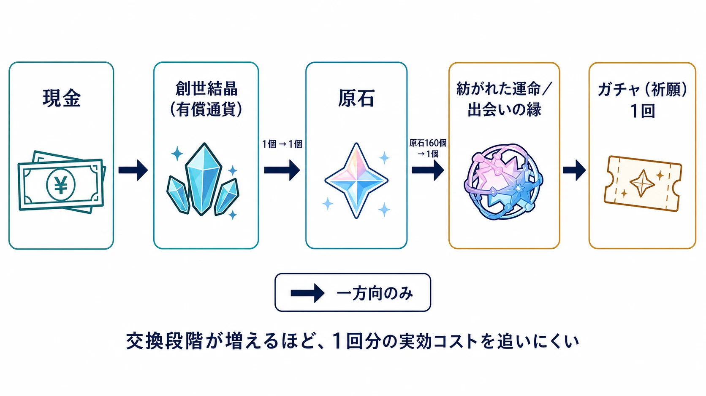
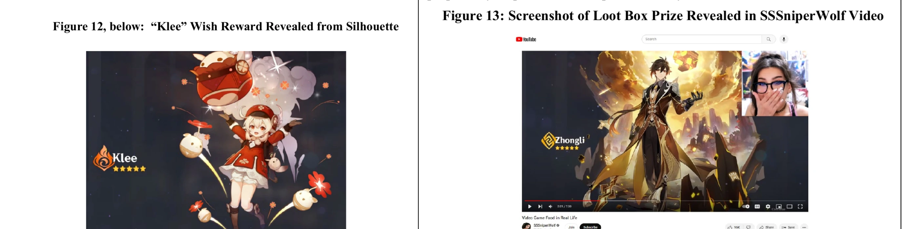
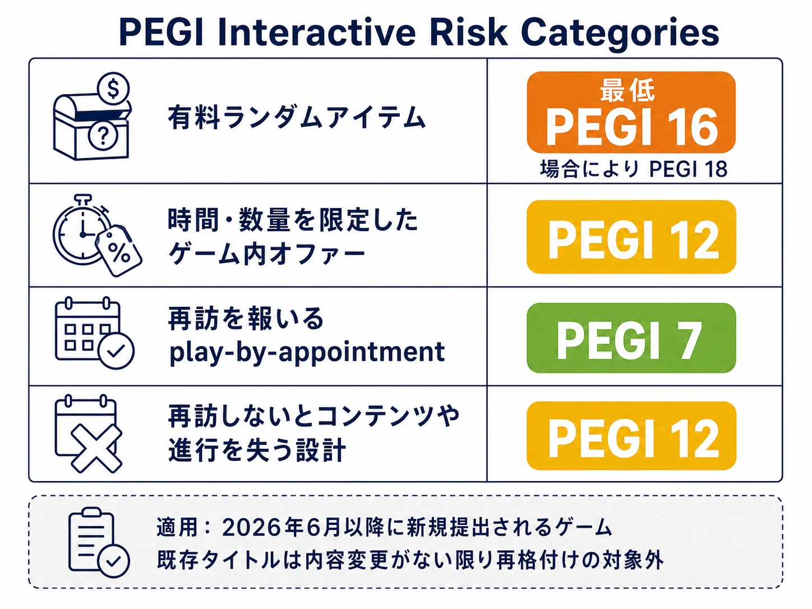

# ガチャ・ルートボックスの抽選演出と期待感の設計――禁じられるのは演出ではなく、事実を歪める期待操作である

> **注意：** 本記事は法的助言ではありません。個別の企画・運用に関する法的判断は、必ず配信地域の法務部門または弁護士に確認してください。年齢区分、消費者保護法、プラットフォーム規約は更新されることがあります。

虹色の光、ためのあるカメラ、結果が出る直前の無音、獲得後に鳴る固有のジングル。ガチャやルートボックスの抽選演出は、ランダムな結果を「受け取った」と理解させ、その瞬間へ期待を積み上げるための表現である。それ自体が不適正なのではない。

しかし、画面が実際より当たりやすいように見せる、終了しない販売を「今だけ」と告げる、何にいくら払うかを分かりにくくするなら、同じ画面は別の性質を持つ。そこで問題になるのは派手さではなく、プレイヤーが購入判断に使う事実を歪めたことだ。

このテーマでは、少なくとも次の三つを分けて考える必要がある。

| 問い | 主な対象 | 本稿での扱い |
|---|---|---|
| ランダム型販売は、どの法制度でどのように扱われるか | 賭博、景品、地域別の制度 | 扱わない |
| 排出確率や取得条件を、何をどのように開示するか | 確率、天井、表示、実装の一致 | 詳細は扱わない |
| 見せ方・購入導線・広告が、事実に即した期待を作っているか | 演出、価格の見せ方、限定訴求、年齢に応じたマーケティング | 本稿の中心 |

前二者は「[ガチャは違法になったのか？ コンプガチャ規制から確率表示までの歴史](gacha-regulation-japan-history.md)」で扱った。本稿は、抽選演出とマーケティングの設計を、確率規制の続きとしてではなく、消費者が購入前に抱く期待の正確さという独立した問題として読む。

***

## 1. FTC対HoYoverse事案は「演出を禁止した」事件ではない

2025年1月、米連邦取引委員会（FTC）は、『原神』を米国で展開するCognosphere／HoYoverseについて、児童オンラインプライバシー保護法（COPPA）違反と、ルートボックス（日本のゲームで一般に「ガチャ」と呼ばれるランダム型販売）の確率・価格・販売方法に関する不公正または欺瞞的な行為を申し立て、和解を公表した。和解では2,000万ドルの制裁金、16歳未満が保護者の明示的同意なしにルートボックスを購入することの禁止、現金による直接購入の選択肢、確率と多段階通貨の交換レートの開示などが盛り込まれた。[[1](#ref-1)]

この事件を「アニメーションや効果音が規制された」と要約するのは正確ではない。FTCの申立てには、当選確率の表示が誤認を招いたという主張も含まれている。したがって、数値の問題と見せ方の問題を入れ替えるのではなく、**数値、価格、映像、販売導線が一つになって、実際より有利で安価な購入に見せた** と読む必要がある。[[2](#ref-2)]

### 多段階通貨は、演出の外側にある「見せ方」である

FTCが指摘した購入フローでは、プレイヤーは現金で仮想通貨の束を買い、それをさらに複数回交換してルートボックスを開く。少額に見える残高や端数は、画面上の一回分の消費を軽く見せても、目的の賞品までに必要な現金額を見えにくくする。ここで問題にされたのは通貨名のファンタジー性ではなく、現金の支出額と、期待する賞品に届くまでの実効コストを把握しにくくした点である。[[1](#ref-1)]

通貨を一種類にすることだけが解ではない。無料配布、ゲーム内経済、地域別決済などに複数の残高が必要な作品もある。ただし、有償残高から抽選一回までの交換経路、余り、束売りの単位、目的の購入に必要な総額を、購入前の画面で辿れることは別途必要になる。演出担当も、この価格情報を「盛り下がる注記」として最後に押し込めてはならない。

### Event Banner（イベント祈願）とインフルエンサーで、何が問題になったのか

FTCの公表と申立ては、期間限定の「Event Banner」へ誘導するUI、開封を華やかに見せるアニメーションと効果音、開封の興奮を強調するインフルエンサー施策を挙げている。本稿で扱う『原神』では、これは期間限定ピックアップに当たる「イベント祈願」の画面である。これらは、子ども・ティーンへ有料のランダム型商品を販売する文脈、そして確率と価格が誤認を招くという申立ての文脈で評価された。[[1](#ref-1)][[2](#ref-2)]

特に重要なのは、申立てが「魅力的に撮った」ことだけを問題にしていない点である。FTCが問題にしたのは、高レアを示すゲーム内の演出そのものではなく、SSSniperWolfによる有償プロモーション動画が、編集によってゲーム内では不可能な当選を示したという主張である。申立書によれば、『原神』では星5報酬が出たときに金色の流星が表示されるが、動画は紫色の流星の後に星5報酬が出たように映していた。また、一度に連続して開封できるのは最大10回であるにもかかわらず、動画は12回の開封が途切れず続くように見せていた。[[2](#ref-2)]

FTCは、この動画が偽の当選を描くよう誤認を招く編集を施されており、ゲーム内では実現できないプレイを示したと主張した。申立書は編集を行った主体をインフルエンサー本人とは特定していない。一方、HoYoverseが動画の制作に報酬を支払い、内容について最終承認の権限を持ちながら、誤認を招く内容を修正しなかったとも述べている。FTCの主張では、この動画は希少報酬を実際より容易かつ低い費用で得られるという印象を伝えた。[[2](#ref-2)]

*画像出典（引用）：米国対Cognosphere, LLCほか、[Complaint For Permanent Injunction, Civil Penalty Judgment, and Other Relief][2]、Figure 12（23ページ）およびFigure 13（24ページ）。図版を左右に配置して引用。*

ここには実務上の明快な線がある。開封の瞬間を美しく、驚きやすく、記憶に残るものにすることはできる。しかし、抽選結果を表す色、音、カット、広告のデモは、実装されている抽選条件と矛盾してはならない。「ピックアップ」という言葉、強調色、祝福的なカメラワークを使うなら、それが示す有利さが何を意味するかを、実際の条件と一致させる必要がある。

***

## 2. 「数字の開示」から「体験全体の年齢区分」へ

FTC事案は、個別の申立てと和解において、どの表示・販売行為が消費者を誤認させたかを問うものだった。一方、欧州のPEGIは、個別の欺瞞を認定する法執行機関ではなく、年齢区分を通じてゲームの体験全体を伝える制度である。この違いを混同してはならない。

PEGIは2026年3月12日、従来の内容表現に加えて機能面を評価する「Interactive Risk Categories」を導入すると発表した。2026年6月以降に新規提出されるゲームは、ゲーム内コンテンツ購入、有料ランダムアイテム、コミュニケーション機能、継続プレイを促す機能も審査対象となる。有料ランダムアイテムを含むゲームの標準的な最低区分はPEGI 16であり、場合によってはPEGI 18となる。既存タイトルは内容変更がない限り再格付けの対象ではない。既存の表示ラベルを増やすだけでなく、年齢区分そのものと結び付ける変更である。[[3](#ref-3)]

同じ改定は、時間または数量を限ったゲーム内オファーをPEGI 12、毎日のクエストなど再訪を報いる「play-by-appointment」をPEGI 7、再訪しないことでコンテンツや進行を失わせる場合をPEGI 12の目安としている。つまり、ここで評価されるのは確率表だけではない。購入を決める時点の期限、再訪を設計する方法、コミュニケーションの安全策を含む、プレイ体験の構成である。[[3](#ref-3)]

EUでも、欧州委員会はDigital Fairness Actを準備中の施策として掲げている。公式の進捗表では2026年第4四半期の提案予定であり、現時点で法案の最終内容は確定していない。委員会の説明は、ダークパターン、インフルエンサーによる誤認的マーケティング、価格の見せ方などを検討対象に挙げ、とくに未成年を含む脆弱な消費者の保護を重視している。[[4](#ref-4)][[5](#ref-5)]

これは「すべての演出が禁止へ向かう」という意味ではない。むしろ、企画時に問われる範囲が、確率表の公開画面だけでは終わらなくなっている、という意味である。ストアの年齢区分、ゲーム内の購入画面、SNS広告、配信者への台本、終了日時の運用までを、同じ購入体験の部品として確認する必要がある。

***

## 3. 期待感は、受取画面だけで作らない

期待感を設計することは、プレイヤーの判断を曇らせることと同義ではない。GDC 2017で、当時Epic GamesのUXリサーチャーだったBen Lewis-Evansは、「ドーパミンの一発」のような通俗的な説明を退け、報酬設計を、報酬の意味、行動との結び付き、進行、選択、社会的な関わり、フィードバックとして考えるべきだと論じた。講演資料は、結果のフィードバック、選択とコントロール、意味のある報酬、他者との肯定的な関わりを、設計上の重要な要素として挙げている。[[6](#ref-6)]

この考え方を抽選演出へ翻訳すると、価値は「結果が表示された一秒」にだけ置かれない。何を狙うかを選び、進捗を見て、次の行動を判断し、その結果が何を変えたかを理解するまでの連続した体験にある。受取演出はその連続を締めるフィードバックであり、期待の内容を偽って作る装置ではない。

### 進行感――狙いと現在地を結ぶ

限定キャラクターの体験を作るなら、単にレアリティの色を強くするより、対象、提供期間、交換・保証までの進捗、獲得後に遊べるコンテンツを一つの導線として見せる方がよい。プレイヤーは「何が欲しいか」だけでなく、「今の選択でどこまで進むか」を把握できる。

進捗表示は購入を強いるためではなく、次の判断を可能にするためにある。たとえば交換ポイント、確定枠、ボックスの残数を採用するなら、演出画面の外に追いやるのではなく、購入前と結果後の双方で連続して示す。これは期待を弱めるのではなく、期待の対象を明確にする。

### 裁量――「選んだ」と言える余地を残す

Lewis-Evansの講演は、選択とコントロールの重要性を強調する。[[6](#ref-6)] 抽選商品で完全に結果を選べないとしても、プレイヤーが選べる部分は作れる。どの期間限定ピックアップを狙うか比較できる、単発と複数回の条件を理解できる、交換先を選べる、演出を短縮または再生できる、といった裁量である。

ここでのポイントは、選択肢を増やすことではない。選択肢ごとの結果、価格、期限、取り消せない操作を区別できるようにすることだ。押し間違いを誘う配置や、戻れない確認画面は、裁量の演出ではなく裁量の剥奪になる。

### 社会的要素とフィードバック――結果を自慢させる前に、意味を伝える

獲得演出の視覚・聴覚フィードバックには、結果を認識させ、価値を伝え、次に利用する場面を想像させる役割がある。GDC講演も、結果のフィードバックを行動のできるだけ近くに置き、報酬の価値と行動を示すよう勧めている。[[6](#ref-6)]

獲得結果をほかのプレイヤーと共有する仕組みを使う場合も同じである。SNS投稿に限らず、ゲーム内の協力プレイ、編成相談、コレクション閲覧につなげることはできる。ただし、取得結果の公開を既定にしたり、未取得者へ繰り返し比較を突き付けたりすることは、体験の意味とは別の圧力を生む。共有は明示的な選択にし、非表示や退出の余地を残す。

***

## 4. プランナーが仕分けるべき四つの層

抽選演出のレビューでは、「派手すぎるか」という主観だけで結論を出さない。事実、購入判断、表現、対象者を分けて確認すると、演出を萎縮させずに危険な設計を見つけやすい。

| 層 | 実務で確認すること | 適正な期待感の例 | 止めるべき兆候 |
|---|---|---|---|
| 事実 | 確率、対象、価格、残数、期限、交換条件 | 結果の色・音が実際の等級や取得条件を正しく表す | 実装にない有利さや、編集で作った実現不能な開封結果を広告で見せる |
| 購入導線 | 現金から一回分までの換算、余り、確認、取消し | 購入前に総額と必要な手順を辿れる | 多段階通貨で実効コストを隠す、重要条件を確定後に出す |
| 表現・販促 | 期間限定ピックアップの告知画面、カウントダウン、PV、配信者施策、演出 | 実際の期間と内容を示した上で、間・光・音で結果を魅せる | 終了しないのに終了を装う、効果を過大に見せる、虚偽の実演を使う |
| 対象者・配信地域 | 年齢区分、保護者同意、広告の届け先、地域差 | 年齢区分と購入制限に合わせた表現と導線 | 子どもを主な受け手にしながら年齢保護や価格理解を後回しにする |

この表の左二列は仕様書、右二列は演出コンテと広告のレビューに置く。レビュー担当者も分けない方がよい。演出ディレクター、経済設計、UI／UX、マーケティング、法務・年齢区分の担当が、同じ画面と同じ配信素材を見る必要がある。

### 実装前の短いチェックリスト

1. **画面の強調は、何の事実を示すか。** レアリティ、ピックアップ、期限、価格のどれも、強調の意味を言葉で説明できるようにする。
2. **その事実は、実装・販売設定・広告デモと一致するか。** 動画、ライブ配信、静止画を、ゲームビルドと同じ基準で照合する。
3. **購入前に、実際の支払額と保証・交換までの条件を確認できるか。** 端数の通貨も含め、抽選一回に必要な現金額と、保証・交換に必要な回数やポイントを、別々に分かるようにする。
4. **「今だけ」は本当に今だけか。** 開始・終了日時、再販の有無、在庫や数量の条件を運用表と一致させる。再販や延長を行うなら、過去の訴求と矛盾しない告知にする。
5. **年齢区分と広告の受け手は整合するか。** PEGIの新基準を含め、ゲーム本体の区分だけでなく、広告、購入制限、保護者向け機能の組み合わせを確認する。[[3](#ref-3)]

***

## 終わりに――演出は「理解を深めるフィードバック」になれる

規制やレーティングが問題にする範囲は広がっている。だが、そこから「抽選演出を弱くすれば安全」という結論は出ない。FTC対HoYoverse事案が示すのは、色彩、音、期間限定ピックアップの訴求、インフルエンサー起用を単独で禁じたことではなく、それらが虚偽または誤認を招く確率・価格・取得容易性の印象と結び付くと、重大な問題になり得るという点である。[[1](#ref-1)][[2](#ref-2)]

一方でPEGIの改定は、年齢区分の判断がランダム型販売、期限付きオファー、再訪を促す仕組みなど、体験の構成へ及ぶことを示した。これは法執行における「虚偽表示」の基準と同じものではない。設計者は、欺瞞を避けるだけでなく、誰にどのような購入・再訪体験を提供するかを、年齢区分を含めて設計する必要がある。

演出の役割は、事実の代わりに期待を作ることではない。プレイヤーが理解した対象、条件、進行に対して、選択と結果のつながりを手触りよく伝えることにある。事実を歪めない限り、間、光、音、カメラ、達成の見せ方は、満足感のある体験を作るための正当な設計材料である。

## References

1. [Genshin Impact Game Developer Will be Banned from Selling Lootboxes to Teens Under 16 without Parental Consent, Pay a $20 Million Fine to Settle FTC Charges][1] - FTCが2025年1月17日に公表したCognosphere／HoYoverse事案の和解、制裁金、販売条件、申立ての概要。

2. [Complaint For Permanent Injunction, Civil Penalty Judgment, and Other Relief][2] - 米国が2025年1月17日に提出した申立書。多段階通貨、Event Banner、インフルエンサー動画、確率・価格の表示に関する具体的な主張を含む。

3. [PEGI expands age rating criteria with interactive risk categories][3] - PEGIが2026年3月12日に発表した、ゲーム内購入、有料ランダムアイテム、再訪を促す機能、コミュニケーション機能を年齢区分へ結び付ける改定。

4. [Review of EU consumer law][4] - 欧州委員会によるDigital Fairness Actの準備状況と検討対象の説明。

5. [Democracy implementation tracker][5] - 欧州委員会の施策進捗表。Digital Fairness Actを2026年第4四半期の予定として掲載する。

6. [Throwing Out the Dopamine Shots: Reward Psychology Without the Neurotrash][6] - Ben Lewis-Evans（当時Epic GamesのUXリサーチャー）によるGDC 2017講演。報酬、フィードバック、進行、選択、社会的要素を扱う。

[1]: https://www.ftc.gov/news-events/news/press-releases/2025/01/genshin-impact-game-developer-will-be-banned-selling-lootboxes-teens-under-16-without-parental
[2]: https://www.ftc.gov/system/files/ftc_gov/pdf/cognosphere_complaint.pdf
[3]: https://pegi.info/news/pegi-expands-age-rating-criteria-interactive-risk-categories
[4]: https://commission.europa.eu/law/law-topic/consumer-protection-law/review-eu-consumer-law_en
[5]: https://commission.europa.eu/priorities-2024-2029/democracy-and-our-values/implementation-tracker_en
[6]: https://gdcvault.com/play/1024587/Throwing-Out-the-Dopamine-Shots

----

この文書は、Perplexity、Claude、OpenAI Codex の3つのAIの支援を受けて著述されたものです。引用画像を除き、MIT License にて提供されています。
