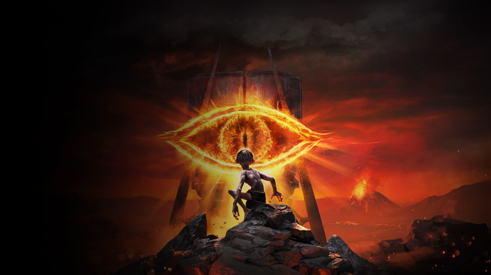
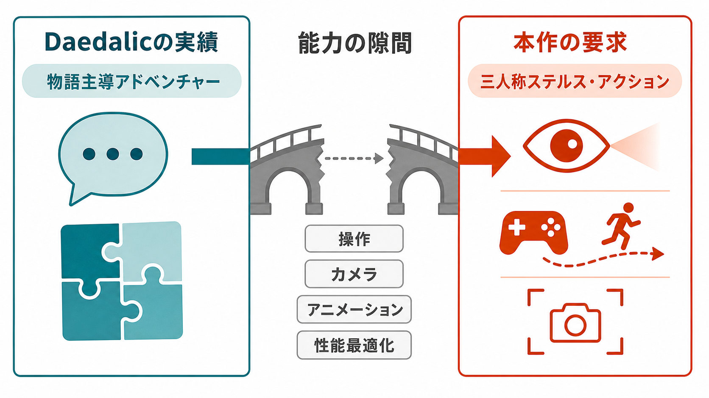
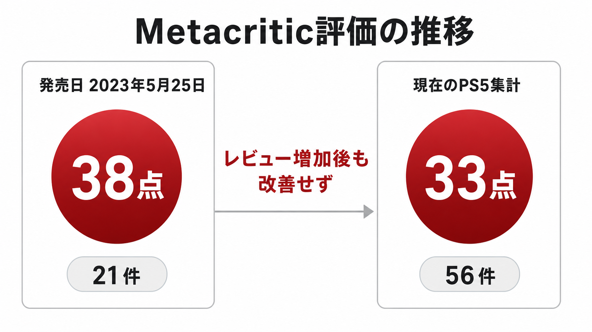
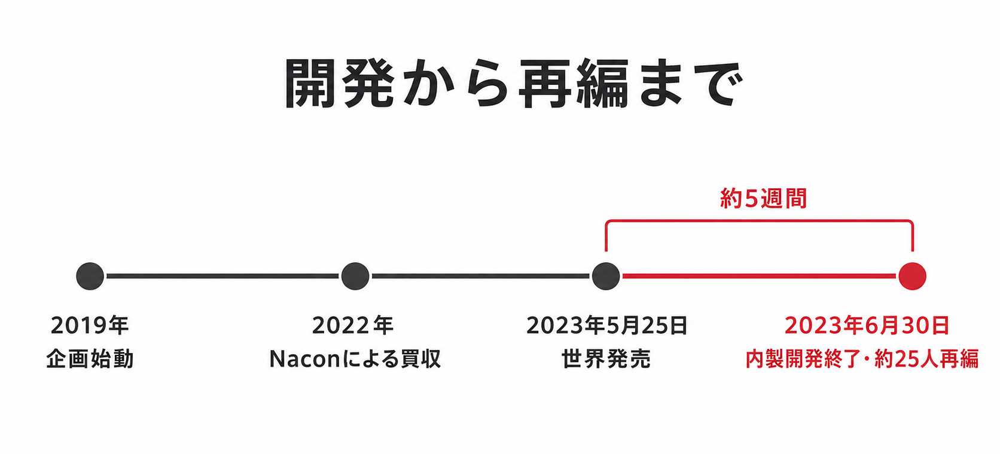

# 『ザ・ロード・オブ・ザ・リング：ゴラム』は、なぜIPの「独自解釈」をゲームの価値へ変えられなかったのか――適性、ライセンス、実行力から読む失敗事例

他メディアIPのゲーム化では、原作の知名度が企画の入口になる。しかし、知名度は開発チームの得意領域を広げず、発売時の品質を保証もしない。2023年の『ザ・ロード・オブ・ザ・リング：ゴラム』は、この当たり前だが見落とされやすい事実を示した作品である。

本稿は「他メディアIPのゲーム化 成功・失敗事例シリーズ」の失敗事例編として、Daedalic Entertainmentが開発し、Naconと共同発売した本作を扱う。世界では2023年5月25日、日本では株式会社3gooから同年6月22日にPS4／PS5版が発売された。[[1](#ref-1)][[2](#ref-2)]

結論を先に述べる。本作の問題は、原作が大きすぎたことでも、ゴラムを主人公にしたことだけでもない。ポイント＆クリック型アドベンチャーを中心に積み上げたスタジオが、三人称ステルス・アクションに必要な操作、カメラ、アニメーション、性能最適化を同時に担ったこと。映画版とは異なる視覚・演技の解釈を選んだ際に、その置換先をプレイ体験として十分に提示できなかったこと。そして発売品質が、その両方を検証する前にブランドの第一印象を固定してしまったことにある。

『Marvel's Avengers』が、三人称アクションの経験を持つ大手座組みがライブサービス型の製品要件を抱え込んだ失敗だったのに対し、本作はより手前の問題である。要求された中核ジャンルと、スタジオの公開実績から読める適性との距離を、契約と試作の段階で縮め切れなかった。

*画像出典（引用）：[PlayStation「The Lord of the Rings: Gollum™（ザ・ロード・オブ・ザ・リング：ゴラム）」](https://www.playstation.com/ja-jp/games/the-lord-of-the-rings-gollum/)掲載画像。本文の批評を補助する必要な範囲で表示し、画像内容は変更せず表示形式のみWebPへ変換した。©2023 Daedalic Entertainment and Nacon. All rights reserved. ©2023 Middle-earth Enterprises. All rights reserved.*

***

## エグゼクティブサマリー

- Daedalicは『Deponia』シリーズや『Edna & Harvey』など、物語とキャラクターを強みにするアドベンチャー作品で知られていた。公式の代表作一覧には多様な作品が並ぶが、本作のような三人称ステルス・アクションを内製で出荷した実績は確認できない。[[3](#ref-3)]
- 本作はJ.R.R.トールキンの書籍に基づくライセンス作品であり、ピーター・ジャクソン監督の映画三部作を土台にする作品ではなかった。開発側は映画との接続を否定し、映画版とは別のデザインと、アンディ・サーキスではない声優を採用した。これは偶発的な乖離ではなく、書籍を起点に独自解釈を作る方針だった。[[4](#ref-4)] [[5](#ref-5)]
- ただし独自解釈は、品質不足を覆う免罪符にはならない。2023年5月25日のレビュー解禁時、Metacriticの集計は21件で38点だった。批評はクラッシュ、進行不能、性能問題、粗い視覚表現と、単調なミッション設計を並行して指摘した。[[6](#ref-6)] [[7](#ref-7)]
- 発売から約5週間後の6月30日、Daedalicは内製開発を終了してパブリッシングへ集中すると発表した。90人超の従業員のうち約25人が再編の対象となり、別の『ロード・オブ・ザ・リング』関連プロジェクトも中止された。Naconは7月10日に、この再編と約25人への影響、第二の同フランチャイズ作品の中止を正式に確認した。[[8](#ref-8)]

***

## 『Deponia』のスタジオへ、何が要求されたのか

Daedalic Entertainmentはドイツの中堅の開発・出版企業である。2023年の公式資料は国際チームを約100人とし、同社を物語とキャラクターを重視する企業と説明して、『Deponia』『Edna & Harvey』『Silence』『The Pillars of the Earth』などを代表作に挙げる。[[3](#ref-3)] これらの蓄積は価値の低いものではない。会話、謎、キャラクターの癖、場面ごとの演出を結び、プレイヤーを物語の次の局面へ進ませる能力である。

しかし『ザ・ロード・オブ・ザ・リング：ゴラム』が公式に約束したのは、ゴラムとして「登る、跳ぶ、忍び寄る」ことで危険を抜ける、物語主導のアクションアドベンチャーだった。[[1](#ref-1)] 三人称ステルスでは、物語の良さだけで基本体験は成立しない。敵に発見される境界、遮蔽物に隠れたときのカメラ、足場に飛び移る判定、失敗からの復帰、敵AIの反応、フレームレートが、一つの操作感としてつながる必要がある。

ここでいう「適性」は、開発者の才能をジャンル名だけで決めつける言葉ではない。過去の製品で、どの失敗を何度経験し、どの工程で品質を測ってきたかという、組織の再利用可能な知識である。会話主導のアドベンチャーと、常時入力を受ける三人称ステルスは、どちらも物語を扱える一方、品質の観測点が大きく異なる。

| 観測する領域 | アドベンチャー中心の主な観測点 | 三人称ステルス・アクションの主な観測点 |
| --- | --- | --- |
| 中核入力 | 選択肢、調査、謎の理解 | 移動、跳躍、潜伏、発見と回避 |
| 空間 | 情報を見つけ、物語を読む導線 | 視認、距離、垂直移動、逃走経路 |
| 失敗 | 詰まり、選択の分かりにくさ | 検知の納得感、即時復帰、再試行の速さ |
| 技術品質 | 会話遷移、セーブ、場面演出 | アニメーション、衝突、AI、カメラ、性能 |
| 最終テスト | 理解と感情の流れ | 手触り、可読性、安定性を反復計測するプレイテスト |

この表の目的は、アドベンチャーのスタジオをアクション作品から一律に外すことではない。足りない能力を、誰がいつ補うのかを契約前に決めることである。公開資料だけでは、本作の内部の担当者配置や個々の技術力までは分からない。しかし、Daedalicが前面に出してきた代表作と、本作が要求した行為の距離は、企画段階で具体的に計上すべきリスクだった。

### 「ジャンル経験あり」を数値ではなく、証拠で採点する

候補スタジオの評価を、過去作の本数や売上だけで済ませると危険である。契約前には、IPの最重要動詞を一文で定義し、下のように0〜4点で証拠を採点するとよい。0点は実績なし、2点は協力開発または限定的な実装、4点は自社出荷作で反復検証まで担った実績、とする。

| 評価軸 | 確認する証拠 | 配点例 |
| --- | --- | --- |
| 中核動詞 | 同じ操作を主役にした出荷作、実プレイ映像、担当範囲 | 0〜4 |
| 隣接システム | カメラ、敵AI、アニメーション、レベル設計、復帰設計の実績 | 0〜4 |
| 技術基盤 | 対象機種での性能計測、クラッシュ率、認証・パッチ運用の実績 | 0〜4 |
| 生産規模 | 同規模のアセット量、外部協力の管理、品質保証の体制 | 0〜4 |
| IP翻訳 | 監修を受けつつ、原作らしい行為をゲームの規則へ変えた実績 | 0〜4 |

重要なのは合計点を万能の判定にしないことである。例えば中核動詞が0〜1点なら、合計が高くても赤信号である。その場合は共同開発先へ中核責任を持たせる、垂直スライス（製品の一部を発売品質まで作る試作）を契約の停止条件にする、あるいはゲーム形式を変える、といった対策が必要になる。企画書の「ステルス要素あり」という一行では、ジャンルの距離は消えない。

***

## 映画を使わないことは、意図的な選択だった

本作のゴラムは、ピーター・ジャクソン監督作品におけるアンディ・サーキスの演技と、Wetaによる映画版の造形を再現していない。この差を「映画版に似せられなかった」とだけ読むのは正確ではない。

開発チームへの取材では、本作はジャクソン、ラルフ・バクシ、ランキン／バスの映画や既存ゲームと接続しない独自制作であり、映画と同じ声を使わず、ゴラム役にはゲーム吹き替え経験を持つウェイン・フォレスターを起用すると説明された。[[4](#ref-4)] またDaedalicのリードライターは、トールキンの記述を視覚解釈の指針とし、資料で埋まらない部分には文化や人々への理解を基に自分たちの考えを加えた、と語っている。[[5](#ref-5)]

さらに、当時の取材に応じたロア監修担当者は、Daedalicが取得したのは書籍の権利であり、映画を手本にできなかったと説明した。[[9](#ref-9)] 映画の視覚言語を外した判断には、創作上の狙いに加えて、ライセンス対象の範囲という前提があった。企画段階では、この制約を出発点に、映画版と異なる造形や演技をどのようなゲーム体験で支持してもらうかを設計する必要がある。

問題は、独自解釈を選べるかではない。顧客が何を既知の入口として認識しているかを把握し、それを置き換える価値を、発売前に証明できるかである。映画を見た顧客にとって、ゴラムの声、身振り、顔の造形は、単なる表層ではない。キャラクターの感情や危険さを素早く読み取るための記憶でもある。それを変えるなら、ゲーム版でしか得られない潜伏、逃走、二重人格の選択が、同じだけ強い入口にならなければならない。

公式ページは、ゴラムとスメアゴルのどちらを優先するかという選択、潜入、探索、危険からの逃走を本作の柱として掲げた。[[2](#ref-2)] これは題材としては筋が通っている。戦士ではないゴラムを主人公にすれば、正面戦闘ではなく、狡猾さと脆さを中心に置けるからである。しかし、独自の造形・演技と、これらのゲームプレイが、第一印象を上書きするほど一体化していたかは別問題である。発売時の批評は、技術面だけでなく、反復するステルス、移動、ミッションの手応えにも厳しかった。[[7](#ref-7)]

### ライセンスの忠実度を、承認工程の後ろへ置かない

プランニングでは、「原作に忠実か」を美術の最終承認だけで確認してはならない。少なくとも次の三層を、契約前のリスク台帳に分けて置くべきである。

1. **権利の層：** 何を使えるか。書籍、映像、俳優の肖像、音楽、固有のデザインは、同じIP名でも別契約である。
2. **認知の層：** 顧客が最初に思い出す顔、声、色、場所、台詞は何か。それを使えない、または使わない場合、代わりに何を見せるか。
3. **体験の層：** 新しい造形や演技が、操作、カメラ、物語、報酬のどこで不可欠になるか。静止画だけでは伝わらないなら、試遊で証明できるか。

この順序なら、「映画に忠実でなければ失敗する」という誤った一般化を避けられる。『Marvel's Spider-Man』のように映画と別の解釈が成功した例もある。だが、映像作品で強く定着したIPでは、視覚・演技の忠実度を自由な美術判断だけとして扱ってはならない。何を利用でき、何を変え、変えた結果にどんな販売上・評判上の負債が生まれるかを、ライセンサー、発売元、開発元が先に共有するリスク管理項目である。

***

## 発売品質が、独自解釈を評価する余地を消した

2023年5月25日に世界発売された時点で、本作の評価は急速に固まった。GameSpotが同日に集めたMetacriticの数字は、21件の批評に基づく38点だった。集計値はレビュー追加で変動するため、これは発売日時点のスナップショットとして扱うべきである。現在のMetacriticのPS5集計も「Generally Unfavorable」とし、56件で33点を示している。[[6](#ref-6)] [[10](#ref-10)]

OpenCriticも、本作を低評価の作品として集計している。集計サイトは個別レビューを要約する便利な指標である。しかし、点数だけでは何が壊れたのかを説明できない。本作では、三人称ステルスの根幹である「操作して、見て、失敗から戻る」循環が、技術的な不安定さに直接損なわれた。[[13](#ref-13)]

GameSpotのPS5版レビューは、性能モードで約11時間のプレイ中に120回超のクラッシュを経験し、セーブデータ破損、進行不能の不具合、チェックポイントからの再開時に動けなくなる問題を報告した。これは一媒体の検証環境での記録であり、全プレイヤーの発生率を示す統計ではない。だが、発売時ビルドが少なくとも一つのレビュー環境で、完走の可否を左右する状態だったことを示す具体的な証言である。[[7](#ref-7)]

同レビューは、平板・ぼやけた環境表現、焦点が合わないNPC、カットシーンの途切れも問題に挙げた。一方でゴラム本人の造形とアニメーションには相対的に評価できる箇所があるとも記している。[[7](#ref-7)] Guardianのレビューも、スメアゴルの動きには評価を与えながら、全体を根本的に壊れたステルスアクションと評した。[[11](#ref-11)] ここで重要なのは、アニメーションの一部が良かったかどうかではない。潜伏、跳躍、追跡といった連続行為では、部分的な長所が、クラッシュや不安定な進行を相殺できないことである。

発売直後には修正パッチの予定が伝えられた。だが、初日のレビュー、プレイ動画、SNS上の投稿は、IPゲームでは特に速く広がる。未知の新規IPなら、改善後に再発見される機会が残ることもある。既知のIPでは、顧客は「このゴラム」「この中つ国」がそのブランドを代表するかどうかを、最初の映像と購入直後の数十分で判断する。技術的実行力の読み違いは、製品評価だけでなく、独自解釈を受け止めてもらうための時間まで奪う。

### 品質リスクは、平均フレームレートだけで測らない

三人称アクションの発売判定では、平均フレームレートや既知の不具合件数だけをKPIにすると不足する。次の四つを、垂直スライスから継続して測る必要がある。

- **完走率：** 初見プレイヤーが、クラッシュ、詰み、理不尽な検知で主要区間を離脱せず通過できるか。
- **再試行時間：** 発見・落下から再操作まで何秒か。失敗理由が理解できるか。
- **中核行為の成功率：** 跳躍、潜伏、敵の誘導など、企画が楽しいと主張する行為を、意図した割合で成功・失敗できるか。
- **印象を壊す不具合の率：** セーブ破損、進行不能、カメラ破綻、顔や音声の演出破綻を、一般的な軽微不具合と同じ箱に入れない。

この四つは、性能チームだけの指標ではない。アニメーター、レベルデザイナー、AI担当、品質保証、プロデューサーが同じ映像とログを見るための共通言語である。IPの看板を借りる製品ほど、最初の一時間を「後で直せる箇所」と扱わないことが重要である。

***

## 約5週間後の再編が示す、失敗の速度

発売から約5週間後の2023年6月30日、Daedalicは内製ゲーム開発をやめ、パブリッシング事業へ集中する方針を示した。報道は90人超の従業員のうち25人が影響を受け、2022年から開発されていた別の『ロード・オブ・ザ・リング』作品が止まると伝えた。[[8](#ref-8)]

Naconは7月10日の公式発表で、Daedalicが今後パブリッシングに集中する再編を確認した。開発チームを中心に約25人が対象となり、第二の『ロード・オブ・ザ・リング』フランチャイズ作品は初期構想段階で中止された、としている。[[12](#ref-12)]

再編の具体的な意思決定は公表されておらず、Naconの発表も理由を単一のレビュー点数へ還元していない。買収後の事業方針、複数の開発案件、資金、組織運営などを含む判断であり、公開資料からその比重までは分からない。再編を本作の低評価だけで説明できる資料はない。

企画上、注目すべきなのは、発売からわずかな期間で内製開発から撤退し、別の同IP案件まで中止されたという時系列である。この事例は、品質、ブランドの第一印象、事業継続が別々の段階で起こる問題ではないことを示す。発売時の不具合は評価と購入判断に直結し、厳しい評価は次の案件へ時間と資源を配分する余地を狭める。ブランド毀損を長期的な評判の問題として後回しにすれば、修正と改善を担う組織が先に縮小する場合もある。

***

## プランナーへの示唆：三つのリスクを別々に可視化する

本作を「原作の選び方を間違えた」「予算が足りなかった」と一言で片付けると、次の企画で使えない。少なくとも、スタジオ適性、ライセンス上の認知資産、技術的実行力を別の表で管理する必要がある。

### 1. 実績ジャンルとの距離を、契約前に定量評価する

最初に決めるべきは、作品のジャンル名ではなく最重要動詞である。本作なら「脆い主人公が、敵に見つからず高低差のある空間を抜ける」である。その動詞を、入力、カメラ、AI、アニメーション、復帰設計まで出荷した証拠が候補スタジオにあるかを、先の0〜4点表で評価する。

評価の目的は、低い点数のスタジオを排除することではない。例えば中核動詞が1点で、物語設計とIP翻訳が4点なら、物語をDaedalic型の強みとして残しつつ、三人称アクションのリードを外部と共同で置く選択肢が見える。反対に、その穴を「有名IPなら採用できる人材で埋める」とだけ書いて契約を急ぐと、誰が品質の最終責任を持つかが曖昧になる。

### 2. 視覚・演技の忠実度を、創作の裁量だけで決めない

書籍を基にするか、映画を基にするかは権利の問題である。同時に、どの顔、声、演技が市場でIPの入口になっているかは、販売とコミュニケーションの問題である。この二つを、アートディレクションの後半まで別部署に任せてはならない。

契約前のレビューでは、利用可能な素材、利用しない素材、映画版を連想する要素、独自案を伝えるための最初の試遊場面を一枚にまとめる。ライセンサーには「設定上正しいか」だけでなく、「既知の像を変えるなら、何が代替の約束になるか」を確認する。発売元には、キービジュアルとトレーラーだけで独自案が誤認されないかを確認する。独自解釈を守ることと、期待値を管理することは対立しない。

### 3. 技術的実行力の不足は、ブランド毀損を最速化する

ストーリー、キャラクターデザイン、テーマは、遊び切った後に再評価される余地がある。だがクラッシュ、進行不能、操作の不安定さは、その手前で接触を終わらせる。特にステルス・アクションでは、失敗の納得感そのものが作品の信用である。

したがって、発売判定を「重大不具合がゼロか」だけにしない。中核行為を初見者が何回成功したか、何回の失敗でやめたか、再起動なしでどこまで進んだかを、機種別に測る。数値が目標を割ったら、コンテンツ追加より先に、操作、カメラ、セーブ、進行を直す。IPの知名度が高いほど、初期の不満は大きな顧客層へ同時に届くためである。

***

## おわりに：独自解釈の前に、独自体験を成立させる

『ザ・ロード・オブ・ザ・リング：ゴラム』は、映画版の複製を避け、書籍の余白にあるゴラムの逃走をゲームにしようとした。その発想自体には、他の主人公を正面戦闘へ当てはめるだけではない可能性があった。Daedalicが書籍を指針に独自の中つ国を作ろうとしたことも、一次資料で確認できる意図的な方針である。

しかし、独自の顔や声を選ぶなら、それを支持する操作と演出が必要になる。ステルス・アクションを選ぶなら、その手触りを守る技術と生産体制が必要になる。どちらかが欠ければ、原作から離れたことが新しさではなく、比較対象を増やすだけの負債になり得る。

IPゲームの失敗を避ける順序は明確である。まず、プレイヤーが最も繰り返す動詞を定める。次に、その動詞を出荷品質まで作ったチームと不足分を確認する。その上で、どの認知資産を使い、何を独自の体験で置き換えるかを、ライセンスと市場の両面から決める。最後に、その約束を壊さない発売品質を、垂直スライスから計測する。

原作の大きさは、この順序を省略する理由にはならない。むしろ、失敗が最も速く広がる理由になる。

## References

1. [The Lord of the Rings: Gollum Slinks Out of the Shadows on May 25th][1] - DaedalicとNaconによる世界発売日、開発元・共同発売元、アクションアドベンチャーとしての公式説明。

2. [The Lord of the Rings: Gollum（ザ・ロード・オブ・ザ・リング：ゴラム）][2] - 株式会社3gooによるPS4／PS5版の国内発売日、公式の日本語表記、ゲーム内容。

3. [Press Release: The Lord of the Rings: Gollum Slinks Out of the Shadows on May 25th][3] - Daedalicの代表作と、物語主導の開発・出版企業としての公式紹介。

4. [Herr der Ringe: Gollum erscheint am 1. September][4] - Daedalicの説明に基づき、映画作品との接続を持たず、映画と別の声優を採用する方針を伝えたドイツ・トールキン協会の記事。

5. [Recreating Tolkien’s world for The Lord of the Rings: Gollum, out May 25][5] - Daedalicのリードライターが、トールキンの記述を視覚解釈の指針とし、余白を独自の着想で補ったと説明した公式開発者記事。

6. [Review Roundup For The Lord Of The Rings: Gollum][6] - 2023年5月25日時点のMetacritic 38点／21件と、技術問題・視覚表現への初期批評をまとめた記事。

7. [The Lord Of The Rings: Gollum Review – We Don't Wants It, We Don't Needs It][7] - PS5版でのクラッシュ、セーブ破損、進行不能、視覚表現、ミッション設計についての具体的なレビュー記録。

8. [Daedalic Entertainment shuts down internal game development to focus on publishing][8] - 2023年6月30日の内製開発終了、25人／90人超、別の『ロード・オブ・ザ・リング』案件中止を伝えた報道。

9. [Blick ins Spiel: Der Herr der Ringe: Gollum][9] - Daedalicが書籍の権利のみを取得し、映画を手本にできなかったとの開発側説明を記録したドイツ・トールキン協会の記事。

10. [The Lord of the Rings - Gollum Reviews][10] - PS5版の現在のMetacritic集計と、レビュー件数・評価区分を確認するための集計ページ。

11. [The Lord of the Rings: Gollum review - boil it, mash it, stick it in the bin][11] - スメアゴルのアニメーションへの限定的な評価と、ステルス・アクション全体への批評。

12. [Nacon confirms Daedalic Entertainment restructuring][12] - Naconによる再編、約25人への影響、第二の『ロード・オブ・ザ・リング』プロジェクト中止の公式確認。

13. [The Lord of the Rings: Gollum][13] - OpenCriticによる本作のレビュー集計ページ。集計値は参加レビューの増加により変動する。

[1]: https://corporate.nacongaming.com/wp-content/uploads/2023/03/Gollum-RDA_EN.pdf
[2]: https://www.playstation.com/ja-jp/games/the-lord-of-the-rings-gollum/
[3]: https://corporate.nacongaming.com/wp-content/uploads/2023/03/Gollum-RDA_EN.pdf
[4]: https://www.tolkiengesellschaft.de/48338/herr-der-ringe-gollum-erscheint-am-1-september/
[5]: https://blog.playstation.com/2023/05/15/recreating-tolkiens-world-for-the-lord-of-the-rings-gollum-out-may-25/
[6]: https://www.gamespot.com/articles/review-roundup-for-the-lord-of-the-rings-gollum/1100-6514556/
[7]: https://www.gamespot.com/reviews/the-lord-of-the-rings-gollum-review-we-dont-wants-it-we-dont-needs-it/1900-6418070/
[8]: https://www.gematsu.com/2023/06/daedalic-entertainment-shuts-down-internal-game-development-to-focus-on-publishing
[9]: https://www.tolkiengesellschaft.de/51015/blick-ins-spiel-der-herr-der-ringe-gollum/
[10]: https://www.metacritic.com/game/the-lord-of-the-rings-gollum/
[11]: https://www.theguardian.com/games/2023/may/25/the-lord-of-the-rings-gollum-daedalic-entertainment-nacon-video-game-review
[12]: https://www.globenewswire.com/news-release/2023/07/10/2701466/0/en/PRESS-RELEASE-NACON-CONFIRMS-DAEDALIC-ENTERTAINMENT-RESTRUCTURATION.html
[13]: https://opencritic.com/game/13215/the-lord-of-the-rings-gollum

----

この文書は、Perplexity、Claude、OpenAI Codex の3つのAIの支援を受けて著述されたものです。引用画像を除き、MIT License にて提供されています。
