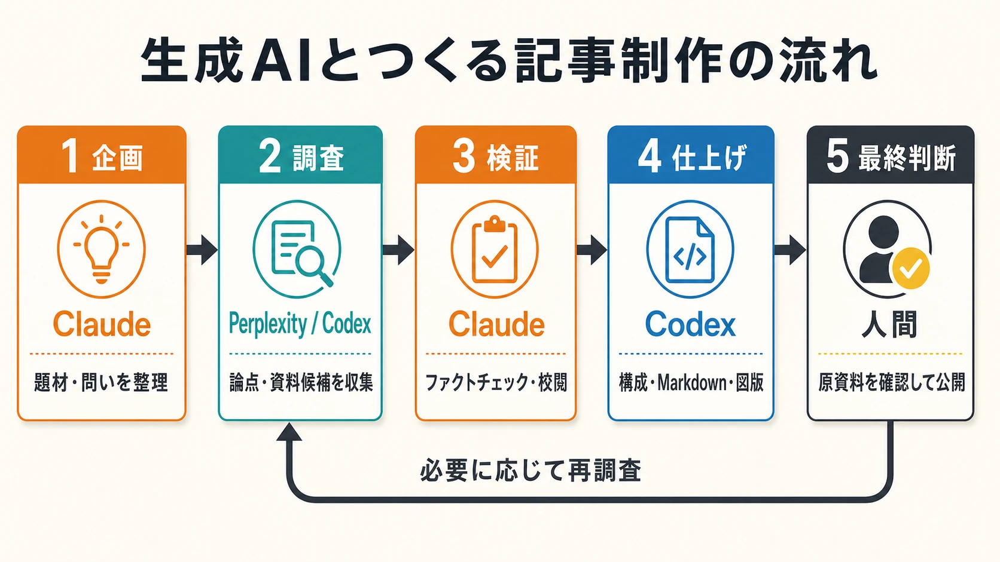

# 番外編：生成AIと一緒に、このブログを作るまで（改訂版）

このブログの記事は、ひとつの生成AIに題材を渡して、その出力をそのまま公開しているわけではない。ネタ探し、調査、検証、文章の整形、図版制作という工程ごとにAIを使い分け、最後は人間が内容を判断して記事にまとめている。

生成AIを使えば、情報を集めて文章にする速度は大きく上がる。一方で、誤りまで素早く、もっともらしい形で混ざってしまう。ゲーム史や開発体制、売上、仕様変更、地域差などを扱うときは、作品名や年代が少しずれただけでも説明全体が崩れかねない。

そのため、このブログではAIを「完成原稿を出す箱」ではなく、それぞれ異なる役割を持つ共同作業者として使っている。現在の制作工程を、企画から公開まで順に紹介する。

---

## 0. 企画：Claudeと記事の種を探す

記事作りは、Claude Opusと題材を探すところから始まる。

Claudeは校閲役として、このブログのほぼすべての記事に目を通している。そのため、すでに扱った話題や記事同士のつながりを踏まえながら、「次に何を掘り下げると面白いか」「既存の記事に欠けている視点は何か」を相談しやすい。

ここで決めるのは題名だけではない。想定する読者、中心となる問い、取り上げたいゲームや事例、調査時に注意すべき論点まで一緒に整理する。調査をPerplexityではなくCodexに任せる場合は、Codexへ渡す詳細な調査プロンプトもClaudeに作らせている。

企画と調査を分けることで、調査を始めてから一般論の中をさまようことが減り、記事で本当に確かめたいことへ早く近づける。

---

## 1. 調査：PerplexityとCodexで材料を集める

調査では、主にPerplexityのDeep Researchを使い、テーマに関係する事例、論点、固有名詞、参考資料の候補を広く集める。

この段階の目的は、完成度の高い原稿を作ることではない。あとで検証するための材料をそろえ、記事の全体像を見つけることにある。たとえば、次のようなプロンプトを基本形として使っている。

```text
今回は○○についてまとめてください。その際、（具体的なゲーム名）の（具体的な項目）や（具体的なゲーム名）の（具体的な項目）を含めます。
ただし、それ以外にも触れた方が良いのであれば、それらについて触れても構いません。
読者想定はゲームを深く知ろうと思っているプレイヤーから新米ゲームプランナーまでとします。
```

最初から具体例をいくつか示すのは、調査が抽象的な一般論へ寄りすぎるのを防ぐためだ。起点となる事例を指定しておけば、その周囲にある比較対象や歴史的背景も拾いやすくなる。

ただし、PerplexityのDeep Researchには利用回数の上限があるため、最近はCodexにも調査を任せている。どちらを使う場合も、出力は「記事の下書き」ではなく「検証すべき素材の束」として扱う。複数の資料をまとめた文章では、別々の出来事が混同されたり、資料にない因果関係が補われたりすることがあるからだ。

この時点では文章の美しさよりも、あとから出典へ戻れることを優先する。

---

## 2. 検証と編集方針：Claudeに別の角度から疑わせる

調査結果をMarkdownにまとめたら、Claude Opusへ渡してファクトチェックと校閲を依頼する。基本の指示は、意外なほど短い。

```text
このテキストのファクトチェックと校閲を行ってください
```

調査と検証に異なるAIを使うのは、最初の出力に含まれる前提や誤りを、そのまま引き継ぎにくくするためだ。同じAIに自己採点させるだけでは見落としやすい問題も、別の視点から読ませると表に出ることがある。

このとき、誰が文章を作ったかはあえて伝えない。入力文の立場に引っ張られず、ひとつの原稿として距離を置いて読ませたいからだ。

Claudeとは、文章だけでなく図版の必要性についても相談する。どの関係を視覚化すれば理解しやすくなるか、引用画像を使うべきか、使うなら何を示す画像が適切かを検討し、本文と図版の役割を分けていく。

もちろん、Claudeの指摘も正解とは限らない。疑義が出た箇所は元の資料や公式情報へ戻り、修正するか、表現を弱めるか、段落ごと削るかを人間が決める。AIを分業させることは検証の入口を増やしてくれるが、正しさを自動的に保証してくれるわけではない。

なお、2026年6月30日にClaude Sonnet 5が公開された。Anthropicは、Sonnet 5の性能がOpus 4.8に近づいた一方、より低価格で利用できると説明している。校閲役に求める精度や費用とのバランスを見ながら、今後はSonnet 5へ移行することも検討している。[[1](#ref-1)]

---

## 3. 仕上げ：Codexで公開できるMarkdownに整える

検証を終えたMarkdownは、Visual Studio Codeで開き、Codexを使ってこのブログの形式へ仕上げる。

ここで行うのは誤字脱字の修正だけではない。段落の順序を組み直し、見出しの粒度をそろえ、重複した説明を削り、表や箇条書きを読みやすい形に直す。記事全体を通して論点が自然につながっているか、初めて触れる読者にも前提が伝わるかも確認する。

さらに、日本語とMarkdownの相性から生じる表示上の問題も整える。強調記号の前後へ必要な空白を入れる、本文中の縦線が表として誤認されないようにする、数式をGitHub Pagesで表示できる形にそろえる、といった作業である。

参考文献がある記事では、本文中の主張から出典へ移動できるよう、次の形式で参照番号を置く。

```markdown
本文の主張。[[1](#ref-1)]
```

記事末尾には、対応する参考文献を記載する。

```markdown
## References

<a id="ref-1"></a>1. [Reference title][1] - 参考にした内容の要約。

[1]: https://example.com/reference
```

文章を読みやすくすることと、根拠をたどりやすくすることは、どちらか一方を選ぶ話ではない。仕上げの工程では、その両方を満たす形を目指している。

---

## 4. 図版：文章だけでは伝わりにくい関係を見せる

ゲーム機やコントローラーの構造、UIの変遷、流通の仕組み、技術の比較などは、文章だけで説明すると長くなりやすい。そこで、読者が関係を一目で把握できる場合は、図解や比較画像を加える。

実例として、この記事で説明している制作工程を図にすると、次のようになる。



企画から公開までを一方向に進めるだけでなく、最終確認で疑問が生じたときは調査へ戻る。この往復を含めて示せることが、図版の利点である。

以前は、文字や線を正確に配置できるSVGを構造図の基本にしていた。現在はGPT Image 2の表現力や文字生成能力が向上したため、まず画像生成で図版を作り、PNGからWebPへ変換して掲載することが増えている。[[2](#ref-2)]

一度で意図した図にならなくても、すぐに手作業のSVGへ切り替えるわけではない。プロンプトの語句を短くする、レイアウトを固定する、図中の文字量を減らすといった調整を重ねる。正確な文字列や構造をどうしても制御できない場合に、SVGを最後の手段として使う。

写真やスクリーンショットなど、外部から引用する画像もWebPへ変換し、引用元を明記する。画像は記事を飾るためではなく、文章を読む前後の負担を減らすためのものだ。図にした方が早く伝わる関係だけを図にし、本文と同じように内容を検証してから掲載する。

---

## まとめ：役割を分けても、判断は手放さない

現在の記事作りは、おおむね次の流れで進んでいる。

1. Claudeと題材を探し、記事の問いと調査方針を決める。
2. PerplexityまたはCodexで、論点と資料候補を広く集める。
3. Claudeでファクトチェックと校閲を行い、図版の必要性も検討する。
4. Codexで文章とMarkdownを整え、参考文献や画像を公開形式に仕上げる。
5. 人間が原資料と記事を読み直し、何を残すかを最終判断する。

生成AIは、調査や編集の手数を大きく増やしてくれる。しかし、使うAIを増やせば自動的に正確になるわけではない。複数のAIが同じ誤りをもっともらしく説明することもあれば、校閲の指摘そのものが間違っていることもある。

だからこそ、このブログでは、AIに役割を持たせながらも判断までは委ねない。何を信じるか、どこを疑うか、どの説明を読者に残すかを人間が決める。その往復を重ねることで、ゲームを深く知りたい読者にとって読みやすく、あとから根拠も確認できる記事を目指している。

## References

<a id="ref-1"></a>1. [Introducing Claude Sonnet 5｜Anthropic][1] - Claude Sonnet 5の公開日、Opus 4.8との性能差、提供価格に関する公式発表。

<a id="ref-2"></a>2. [GPT Image 2 Model｜OpenAI API][2] - GPT Image 2の機能と位置づけを説明した公式ドキュメント。

[1]: https://www.anthropic.com/news/claude-sonnet-5
[2]: https://developers.openai.com/api/docs/models/gpt-image-2

----

この文書は、Perplexity、Claude、OpenAI Codex の3つのAIの支援を受けて著述されたものです。引用画像を除き、MIT License にて提供されています。
