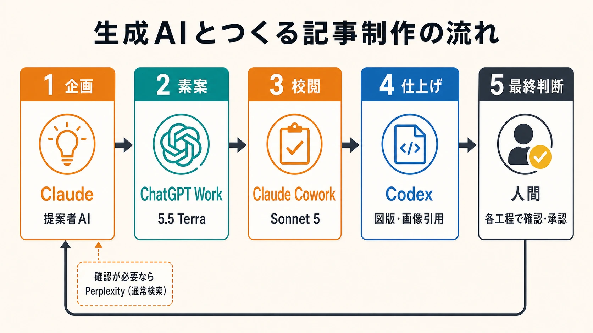

# 番外編：生成AIと一緒に、このブログを作るまで（三訂版）

このブログの記事は、ひとつの生成AIに題材を渡して、その出力をそのまま公開しているわけではない。企画、本文素案、検証、図版制作、画像引用という工程ごとにAIを使い分け、各段階で人間が内容を確認して記事にまとめている。

生成AIを使えば、情報を集めて文章にする速度は大きく上がる。一方で、誤りまで素早く、もっともらしい形で混ざってしまう。ゲーム史や開発体制、売上、仕様変更、地域差などを扱うときは、作品名や年代が少しずれただけでも説明全体が崩れかねない。

そのため、このブログではAIを「完成原稿を出す箱」ではなく、それぞれ異なる役割を持つ共同作業者として使っている。現在の制作工程を、企画から公開まで順に紹介する。

---

## 0. 企画：Claudeを「提案者AI」として記事の種を探す

記事作りは、Claudeを「提案者AI」として、題材を探すところから始まる。企画と校閲にはClaude Sonnet 5を使っている。Opus 5も試したが、このブログの用途では精度に大きな差を感じなかったため、トークンコストの低いSonnet 5を選んでいる。

Claudeは校閲役として、このブログのほぼすべての記事に目を通している。そのため、すでに扱った話題や記事同士のつながりを踏まえながら、「次に何を掘り下げると面白いか」「既存の記事に欠けている視点は何か」を提案してもらいやすい。

企画提案のチェックが効率よく進む背景には、Claude自身の規範を記した `CLAUDE.md` と、ブログ全体の内容を要約した `ARTICLES.md` が十分に育ってきたことがある。以前は二つの役割を一つの `CLAUDE.md` にまとめていたが、内容が大きくなりすぎたため、ワークメモリの負担を減らす目的で分けた。

この二つのファイルは、このブログの制作における肝である。単に守るべき形式を並べるだけでなく、これまでの記事で得た判断や、既存の記事とのつながりを蓄えている。生成AIを相棒として使うには、このような資料を制作とともに育てていくことが、提案の正確さと作業の効率化につながる。

ここで決めるのは題名だけではない。想定する読者、中心となる問い、取り上げたいゲームや事例、調査時に注意すべき論点まで整理する。提案者AIの内容に編者が確認したい点があれば、Perplexityに通常の検索で調べさせる。この確認にはDeep Researchを使わない。

多くの場合は提案者AIの見立てが正しい。しかし、Perplexityの検索が別の資料や観点をもたらし、企画を補強することもある。企画と確認を分けることで、一般論の中をさまようことを減らし、記事で本当に確かめたいことへ早く近づける。

---

## 1. 本文素案：ChatGPT Workに最初の原稿を書かせる

本文素案の出力は、もっぱらChatGPT Workに任せている。使用モデルは5.5 Terraである。企画で整理した問いや論点を渡し、記事として読める最初の原稿を作る工程である。

以前は、Perplexityへ細かな条件を与えたうえでDeep Researchを依頼し、本文素案まで作らせることを試していた。しかし、この組み合わせでは出力がかなり崩れることがあった。調べる条件を細かく制御しながら、まとまった記事本文まで求める用途には向きにくいと判断している。

ただし、単純な調査記事では、現在でもPerplexityを使うことがある。AIごとに得意な出力は異なるため、本文素案を作る役割を固定しすぎず、記事の性質に合わせて使い分けている。

どのAIが作った素案でも、そのまま公開原稿にはしない。次の工程で根拠と表現を確認する前提で、論旨の骨格をつくるものとして扱う。

---

## 2. 検証と編集方針：Claude Coworkに別の角度から疑わせる

本文素案をMarkdownにまとめたら、Claude Coworkへ渡してファクトチェックと校閲を依頼する。ここでもClaude Sonnet 5で十分である。基本の指示は、意外なほど短い。

```text
このテキストのファクトチェックと校閲を行ってください
```

本文素案と検証に異なるAIを使うのは、最初の出力に含まれる前提や誤りを、そのまま引き継ぎにくくするためだ。同じAIに自己採点させるだけでは見落としやすい問題も、別の視点から読ませると表に出ることがある。

このとき、誰が文章を作ったかはあえて伝えない。入力文の立場に引っ張られず、ひとつの原稿として距離を置いて読ませたいからだ。

Claudeとは、文章だけでなく図版の必要性についても相談する。どの関係を視覚化すれば理解しやすくなるか、引用画像を使うべきか、使うなら何を示す画像が適切かを検討し、本文と図版の役割を分けていく。

もちろん、Claude Coworkの指摘も正解とは限らない。疑義が出た箇所は元の資料や公式情報へ戻り、修正するか、表現を弱めるか、段落ごと削るかを人間が決める。AIを分業させることは検証の入口を増やしてくれるが、正しさを自動的に保証してくれるわけではない。

---

## 3. 仕上げ：Codexで公開できるMarkdownに整える

検証を終えたMarkdownは、Visual Studio Codeで開き、Codexを使ってこのブログの形式へ仕上げる。

ここでは、公開用Markdownを整えるとともに、もっぱら図版の制作と画像引用の細かな確認・取得を行わせている。文章との対応を見ながら、どの関係を図にすれば理解しやすいか、画像引用は本文に必要か、出典と引用範囲は適切かを確認する。

さらに、日本語とMarkdownの相性から生じる表示上の問題も整える。強調記号の前後へ必要な空白を入れる、本文中の縦線が表として誤認されないようにする、数式をGitHub Pagesで表示できる形にそろえる、といった作業である。

参考文献がある記事では、本文中の主張から出典へ移動できるよう、次の形式で参照番号を置く。

```markdown
本文の主張。[[1](#ref-1)]
```

記事末尾には、対応する参考文献を記載する。

```markdown
## References

<a id="ref-1"></a>1. [Reference title][1] - 参考にした内容の要約。

[1]: https://example.com/reference
```

文章を読みやすくすること、根拠をたどりやすくすること、図版と画像引用を適切に置くことは、どれか一つを選ぶ話ではない。仕上げの工程では、そのすべてを満たす形を目指している。

---

## 4. 図版：文章だけでは伝わりにくい関係を見せる

ゲーム機やコントローラーの構造、UIの変遷、流通の仕組み、技術の比較などは、文章だけで説明すると長くなりやすい。そこで、読者が関係を一目で把握できる場合は、図解や比較画像を加える。

実例として、この記事で説明している制作工程を図にすると、次のようになる。



人間の確認と承認は最後だけに置かれているわけではない。企画から公開までの各工程で本文を読み、承認、却下、書き直しを命じる。最終確認で疑問が生じたときは企画へ戻る。この往復を含めて示せることが、図版の利点である。

概念図や工程図にはgpt-image-2を使い、数値を軸や系列で示すグラフにはApache EChartsを使う。GPT Image 2は画像生成と編集に使えるモデルであり、Apache EChartsは多様なグラフを扱える可視化ライブラリである。[[1](#ref-1)][[2](#ref-2)]

一度で意図した図にならなくても、すぐに手作業のSVGへ切り替えるわけではない。プロンプトの語句を短くする、レイアウトを固定する、図中の文字量を減らすといった調整を重ねる。正確な文字列や構造をどうしても制御できない場合に、SVGを最後の手段として使う。

写真やスクリーンショットなど、外部から引用する画像もWebPへ変換し、引用元を明記する。画像は記事を飾るためではなく、文章を読む前後の負担を減らすためのものだ。図にした方が早く伝わる関係だけを図にし、本文と同じように内容を検証してから掲載する。

一方で、EChartsをMCP経由で使うと、まだ意図どおりに整ったグラフを生成できないことがある。値や軸の正確さと読みやすい見た目を両立させるため、ここは現在も試行錯誤を続けている。

---

## まとめ：役割を分けても、判断は手放さない

現在の記事作りは、おおむね次の流れで進んでいる。

1. Claudeを提案者AIとして題材を探し、記事の問いと調査方針を決める。確認が必要な点は、Perplexityの通常検索で調べる。
2. ChatGPT Workで本文素案を作る。単純な調査記事ではPerplexityを使うこともある。
3. Claude Coworkでファクトチェックと校閲を行い、図版の必要性も検討する。
4. Codexで公開用Markdown、図版、画像引用を仕上げる。
5. 人間が各工程で本文を確認し、承認、却下、書き直しを決める。必要なら最後に人力で本文編集も行う。

生成AIは、調査や編集の手数を大きく増やしてくれる。しかし、使うAIを増やせば自動的に正確になるわけではない。複数のAIが同じ誤りをもっともらしく説明することもあれば、校閲の指摘そのものが間違っていることもある。

だからこそ、このブログでは、AIに役割を持たせながらも判断までは委ねない。何を信じるか、どこを疑うか、どの説明を読者に残すかを人間が決める。編者自身が技術書を通じて英文翻訳調の文体に慣れており、AIが書く文体と近いため、必要な人力編集も大きな違和感なく重ねられる。その往復によって、ゲームを深く知りたい読者にとって読みやすく、あとから根拠も確認できる記事を目指している。

## References

<a id="ref-1"></a>1. [GPT Image 2 Model｜OpenAI API][1] - GPT Image 2の機能と位置づけを説明した公式ドキュメント。

<a id="ref-2"></a>2. [Apache ECharts][2] - Apache EChartsの機能を説明した公式サイト。

[1]: https://developers.openai.com/api/docs/models/gpt-image-2
[2]: https://echarts.apache.org/en/

----

この文書は、Perplexity、Claude、OpenAI Codex の3つのAIの支援を受けて著述されたものです。引用画像を除き、MIT License にて提供されています。
