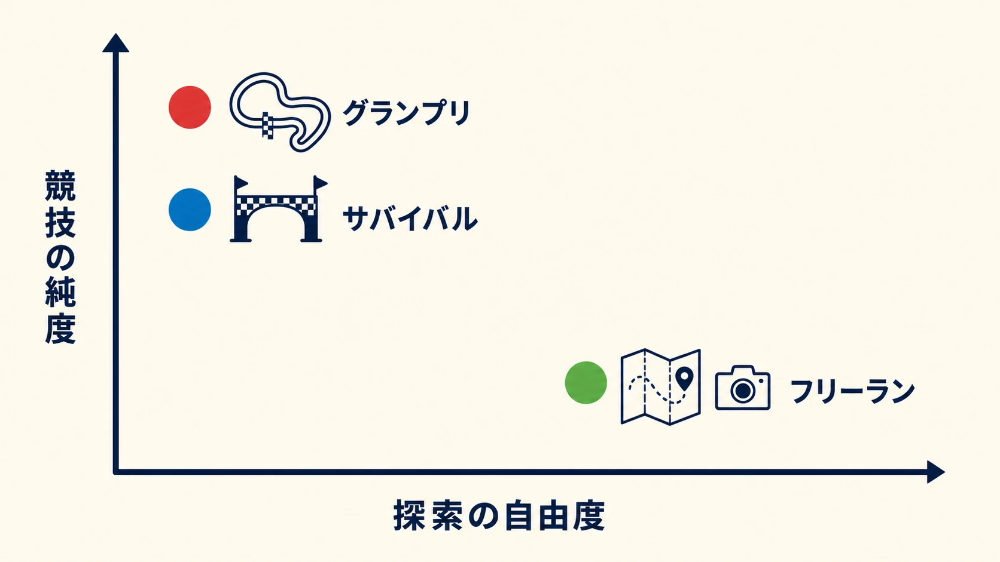
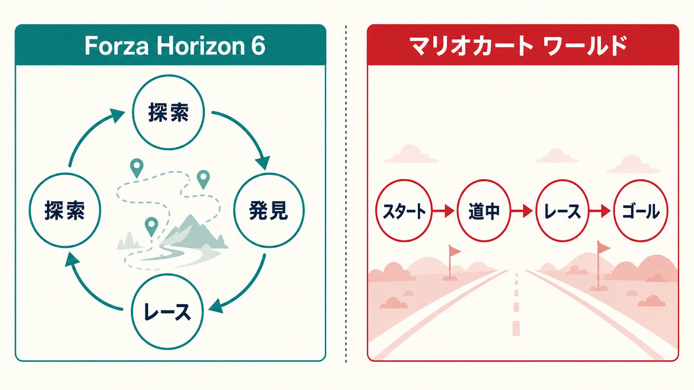
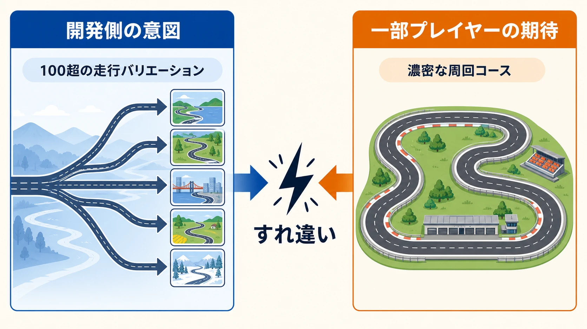

# 『マリオカート ワールド』は、なぜオープンワールドを「競技の一部」にしたのか

Nintendo Switch 2 と同日の2025年6月5日に発売された『マリオカート ワールド』は、ハードのローンチを担うシリーズ最新作である。従来のコース選択型レースから踏み出し、すべてのコースをひとつながりの地図に置いた。これは単に走行可能な面積を広げた変更ではない。レースとレースの **あいだ** にあった移動を、競技そのものへ組み替える判断であった。[[1](#ref-1)]

比較対象としてわかりやすいのが、2026年5月19日にXbox Series X｜SとPCで発売され、PS5版も2026年内に予定されている、初めて日本を舞台とした『Forza Horizon 6』である。両作は「オープンワールド×レースゲーム」という同じ座標にある。しかし、探索とレースを結ぶ方法は正反対に近い。本稿は、その差を新人ゲームプランナーにも追える形で整理する。[[2](#ref-2)]

***

## コースを増やすのではなく、コース間をレースにした

従来の「マリオカート」は、選んだ一つのコースを走り切り、次のコースへ画面を切り替える構造であった。『マリオカート8 デラックス』で「個別コースを走る」形式は一つの完成形に達したと考えた開発チームは、次作で個別コースの追加ではなく、すべてのコースを同じ地図上に置くことを選んだ。[[3](#ref-3)]

ここで重要なのは、地続きの世界が探索用のロビーにとどまらない点である。グランプリでは4つのコースを巡り、次のコースまで向かう道中もレースとして走る。道中区間での順位も各レースの結果として扱われ、最終的な合計得点に関わる。つまり「コース外」は休憩や移動ではなく、競争が継続する区間である。[[1](#ref-1)]

この設計には、広い道で24人がばらけてレース感が薄くなる問題を、参加人数を従来作の12人から24人へ増やして補う意図もある。開発者は、長い道では参加者が分散するため、あちこちで競り合いが起きる密度を確保しようとしたと説明している。オープンワールド化を、孤独なドライブのためでなく、混戦を維持するための条件として扱ったのである。[[3](#ref-3)]

***

## 3つのモードは、競技と探索を切り分ける

本作は「広い世界で自由に遊べる」一本槍ではない。競技の純度と探索の自由度を、モードごとに分けている。

| モード | 基本構造 | 重心 | 設計上の役割 |
| --- | --- | --- | --- |
| グランプリ | 24人で4コースを巡る。コース間の道中もレースとなり、各区間の順位が得点に入る | 競技 | 従来のカップ戦を保ちつつ、連続した旅程へ変える |
| サバイバル（ノックアウトツアー） | 24人で大陸横断ルートを走る。中間ゲートを規定順位内で通れないと脱落する | 競技 | 道中を切れ目のない淘汰戦へ変える |
| フリーラン | 一本道の順位争いから離れ、自由走行、Pスイッチのミッション、収集、写真撮影を行う | 探索 | 地図を観察し、走ること自体を目的にできる余白をつくる |

サバイバルは、公式が「ノンストップの大陸横断レース」と呼ぶ通り、道中を最も強く競技化したモードである。チェックポイントで下位が脱落するため、景色を見る余裕より、次の関門までの順位維持が優先される。[[1](#ref-1)]

対照的にフリーランでは、レース中には閉じている道や海も走れ、Pスイッチからミッションを始められる。写真撮影やコイン、ハテナパネル、ピーチメダルの探索もここに置かれる。食べ物を走りながら受け取り、その土地にちなんだ衣装を得る仕組みも、停止して買い物をするより走行のテンポを保つために選ばれた。[[4](#ref-4)][[5](#ref-5)]

この分離は巧みである。自由探索を望む人にはフリーランを用意しつつ、グランプリとサバイバルでは「次に何をするか」を選ばせない。競技モードの目的は、探索の発見ではなく、24人の順位を連続的に揺らすことだからである。

***

## 『Forza Horizon 6』は、探索からレースを見つける

『Forza Horizon 6』も日本の広い地図をシームレスに走る。しかし、基本ループは『マリオカート ワールド』と異なる。導入後にはキャンペーンという案内役があり、レースでフェスティバルのランクを上げられる。[[2](#ref-2)] 一方で、開発側は「大半の目標は探索」と説明する。いわゆるゴールデンパスはあるが、どの速さで進むかはプレイヤーに委ねられる。[[6](#ref-6)]

実際に地図には霧がかかっており、走った場所が明らかになる。見つけた「Discover Japan」コンテンツは、その場で遊べる。タイムアタック、ドラッグレース、収集要素、期間限定で出会う中古車といった活動が、ドライブの途中に現れる。これはクエスト受注型と呼べる構造である。地図上の発見をきっかけに任意の活動を始め、終えた後にはまた自由走行へ戻る。[[6](#ref-6)]

ここでいう「クエスト受注型」とは、地図を移動して関心を持った活動を自分の意思で選び、その報酬や次の発見を得る循環を指す。レースは主役でありながら、探索の途中で自発的にアクセスする任意コンテンツでもある。探索とレース参加は、一本の散歩道のように連続する。

一方の『マリオカート ワールド』は、グランプリとサバイバルの競技骨格を一本道に近いまま保つ。道中区間は、アイコンを見つけて任意に受注する探索コンテンツではない。次の競技区間へ着くために全員が必ず通り、順位と得点を動かす **接続組織** である。

| 比較軸 | 『Forza Horizon 6』 | 『マリオカート ワールド』 |
| --- | --- | --- |
| 探索の位置 | コアループ。走って発見し、活動を選ぶ | 主にフリーランへ分離 |
| レースへの入口 | 地図上で見つけ、任意に始める | グランプリ／サバイバルに参加すると、旅程に沿って必ず進む |
| 道中の意味 | 発見、寄り道、次の選択を生む場所 | 順位争いを継続させ、競技モードをつなぐ場所 |
| 自由の設計 | 何をするか、いつするかを選べる | 競技中は同じ旅程を共有し、自由は別モードで担保する |

オープンワールド化は、必ずしも「自由に活動を選ばせる」ことを意味しない。『マリオカート ワールド』は、広い地形を使って競技の時間軸を延ばす。『Forza Horizon 6』は、広い地形を使ってプレイヤーの選択肢を増やす。この違いを取り違えると、両作を同じ「自由なレースゲーム」として雑に比較してしまう。

***

## 2025年6月の更新が可視化した摩擦

この差は、2025年6月26日の更新で具体的な摩擦として現れた。任天堂は「VSレース」および通信対戦で「おまかせ」を選んだ場合に抽選されるコースを調整した。公式の更新履歴は調整内容をこの一文にとどめている。[[7](#ref-7)]

その後、専門メディアのGame*Sparkは、道中区間が多く選ばれることへの不満を表明する一部ユーザーの存在を報じた。ここで留意すべきなのは、反応の規模や総意を数値で確定できる公的資料はないことである。本稿では「大多数がこう思った」とは扱わない。確認できるのは、道中区間を「単調」「レースというより移動」と捉える反応が報道された事実である。[[8](#ref-8)]

しかし開発側にとって、道中は余った空間ではない。開発者インタビューでは、コース間もレースの舞台であり、その組み合わせを数えると「軽く100をこえる」と説明されている。地続きの設計によって、固定されたサーキット数だけでは数えにくい走行バリエーションを提供する狙いである。[[9](#ref-9)]

両者のずれは品質の有無だけでは説明できない。プレイヤーが「濃密に設計された周回コースを選びたい」と期待した時、接続区間を増やす更新は、競技の密度を下げる変更に見える。反対に開発側からは、世界をまたぐレースという企画の価値を、ランダム選択でも体験してもらう変更に見える。探索を任意の寄り道として置く『Forza Horizon 6』方式なら、寄り道をしない選択が可能である。『マリオカート ワールド』方式では、接続区間を競技に統合した時点で、その選択は競技参加中にはできない。この非対称性こそが摩擦の根である。

***

## プランナーが決めるべきは、追加要素の統合度である

既存フォーマットへ新要素を持ち込む時、「入れるか、入れないか」だけでは企画判断にならない。より重要なのは、どの程度まで既存ループへ統合するかである。

**任意コンテンツとして添える** 場合、既存の遊びを好むプレイヤーは従来の目的を保ち、新しい遊びを望むプレイヤーは追加の寄り道を選べる。『Forza Horizon 6』の自由探索はこの型であり、探索の報酬、地図の発見、活動への入口を自律的なループとして成立させている。欠点は、用意した探索要素が主目的のプレイヤーに触れられない可能性があることだ。

**競技の一部として強制する** 場合、新要素は全員の共通体験になり、旧来のルールだけでは作れなかった連続性や緊張を生む。『マリオカート ワールド』の道中区間はこの型である。欠点は、新要素を「本筋から外れた時間」と感じるプレイヤーにも、同じ頻度で体験させることになる点だ。

企画書では、少なくとも次の3点を先に決める必要がある。

- その新要素を体験しないプレイヤーがいても、作品の核は成立するか。
- 全員に体験させるなら、既存の達成感を何で補償するか。
- 選択頻度やランダム選択を変えた時、プレイヤーは「新体験の拡充」と「欲しい遊びの減少」のどちらとして受け取るか。

『マリオカート ワールド』が示すのは、オープンワールド化の成否を地図の広さだけでは測れないということである。自由をどこに置き、強制をどこまで許すか。そこに、既存シリーズを変える際の本当の設計判断がある。

***

## 賭けは、競技の外側にも遊びを増やした

発売から1年以上が経過した時点で、本作は批評面と商業面の双方で強い結果を残している。Metacriticの集計は86点、ファミ通のクロスレビューは36点／40点であり、評価の論点はありつつも大作としての支持を得た。任天堂の2026年3月31日時点の公表値では、世界累計販売本数は1,470万本で、Nintendo Switch 2用ソフトの首位である。[[10](#ref-10)][[11](#ref-11)][[12](#ref-12)]

この数字は、道中区間への異論がなかったことを意味しない。むしろ、オープンワールド化を探索のご褒美としてだけ使わず、競技の必須区間へ持ち込んだ大胆さが、評価と摩擦を同時に生んだと読むべきである。

『マリオカート ワールド』は、従来のコースレースを自由探索ゲームへ置き換えた作品ではない。レースの途中にあった「次へ行く」を、順位争いの中へ取り戻した作品である。だからこそ『Forza Horizon 6』と並べると、同じオープンワールドの下に、まったく異なる設計思想が見えてくる。

## References

1. [任天堂トピックス：大陸横断、世界をまたぐレースが開幕。『マリオカート ワールド』をNintendo Switch 2 と同日の6月5日に発売。][1] - 発売日、24人対戦、グランプリ、サバイバル、フリーランの公式説明。

2. [Forza Horizon 6 Releases May 19 on Xbox Series X\|S and PC][2] - 発売日、対応プラットフォーム、PS5版の2026年内予定、日本が舞台であること、キャンペーンとウィストバンドによるランクアップ構造の公式発表。

3. [開発者に訊きました：マリオカート ワールド「ジャンプアップをしたい」][3] - 個別コース型から地続きの世界へ転換した経緯、および広い道でのレース密度を確保するため参加人数を12人から24人へ増やした設計意図の説明。

4. [マリオカート ワールド：フリーラン][4] - 自由走行、ミッション、収集、写真撮影の公式説明。

5. [開発者に訊きました：マリオカート ワールド「世界の地続き感」][5] - 食べ物と衣装を走行中に結び付けた設計の説明。

6. [Forza Horizon 6: Collectibles, Seamless Races and Open World Design Make for the Most Explorable Adventure Yet][6] - 霧で開く地図、「大半の目標は探索」というゴールデンパスの位置づけ、発見した活動を任意に遊ぶ設計の開発者説明。

7. [マリオカート ワールド 更新データVer. 1.1.2][7] - 2025年6月26日の「おまかせ」で抽選されるコースの調整。

8. [Game*Spark：『マリオカート ワールド』最新アプデ配信。しかし一部ユーザーに不満の声“「おまかせ」で道中コースばかり…”][8] - 更新後に報じられた一部ユーザーの不満の内容。

9. [開発者に訊きました：マリオカート ワールド「印象に残るにはどうしたらいいのか」][9] - コース間を含めると100を超えるバリエーションという開発者説明。

10. [任天堂IR：Top Selling Title Sales Units][10] - 2026年3月31日時点の『Mario Kart World』世界累計販売本数1,470万本。

11. [Mario Kart World Reviews - Metacritic][11] - 批評家レビュー集計のMetascore。

12. [Nintendo Everything：Famitsu review scores – June 25, 2025][12] - ファミ通クロスレビューの内訳9／9／9／9。

[1]: https://www.nintendo.com/jp/topics/article/3efb17da-cdba-4305-b8ab-20771565a6fa
[2]: https://forza.net/news/forza-horizon-6-coming-may-2026
[3]: https://www.nintendo.com/jp/interview/aaaaa/index.html
[4]: https://www.nintendo.com/jp/games/switch2/aaaaa/freerun/index.html
[5]: https://www.nintendo.com/jp/interview/aaaaa/03.html
[6]: https://news.xbox.com/en-us/2026/04/08/forza-horizon-6-preview-japan-collectibles-seamless-races-open-world-design/
[7]: https://support.nintendo.com/jp/switch2/software_support/aaaaa/112/index.html
[8]: https://www.gamespark.jp/article/2025/06/26/154445.html
[9]: https://www.nintendo.com/jp/interview/aaaaa/02.html
[10]: https://www.nintendo.co.jp/ir/en/finance/software/index.html
[11]: https://www.metacritic.com/game/mario-kart-world/
[12]: https://nintendoeverything.com/famitsu-review-scores-june-25-2025/

----

この文書は、Perplexity、Claude、OpenAI Codex の3つのAIの支援を受けて著述されたものです。引用画像を除き、MIT License にて提供されています。
