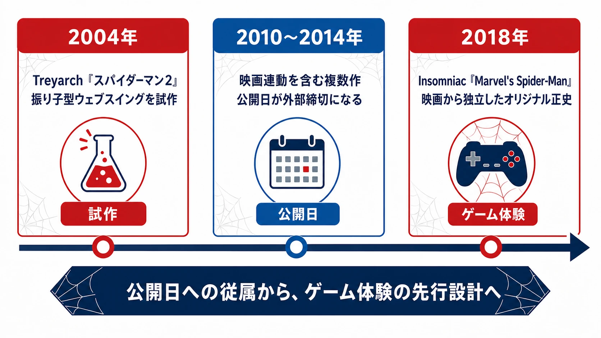
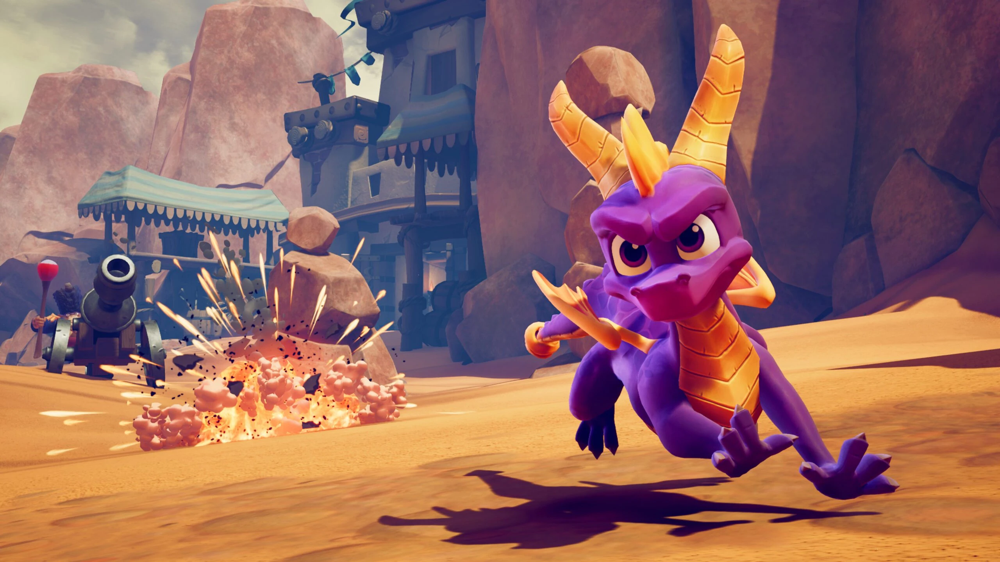
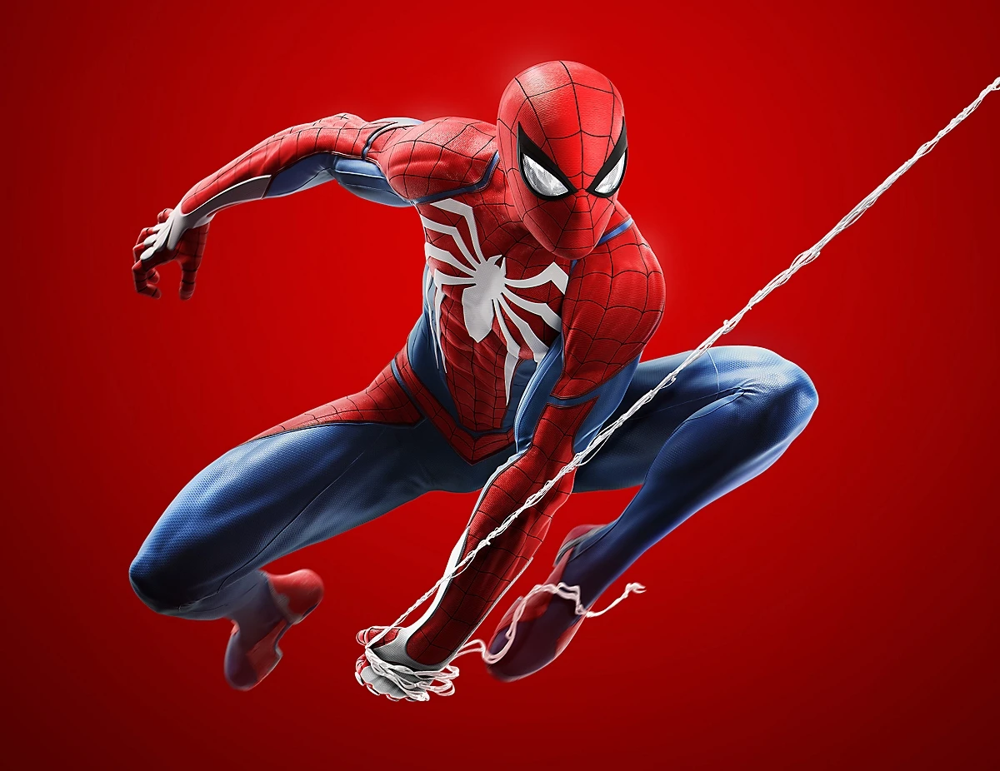
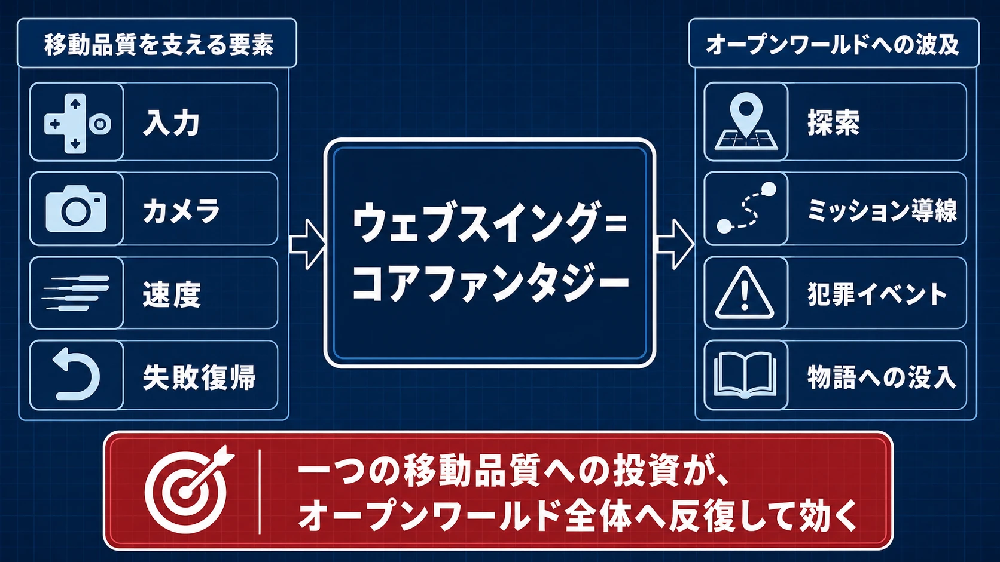
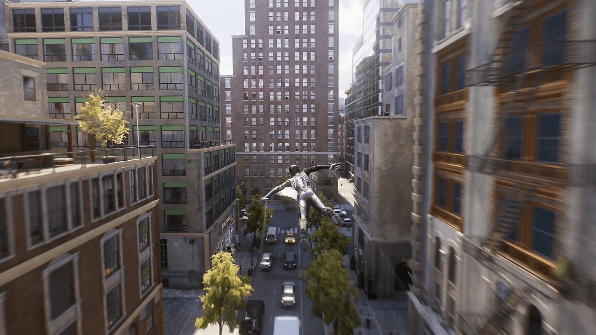

# 『Marvel's Spider-Man』は、なぜ「映画タイアップ」から離れて成功できたのか――大型IPゲーム化の成功事例

大型IPのゲーム化では、原作の知名度が企画を前へ進めてくれる。キャラクターの説明に時間をかけずに済み、発売前から多くの関心を集められる。一方で、その知名度は「原作ファンが期待するものをすべて入れなければならない」という圧力にもなる。映画の公開日、ライセンサーの承認、既存の人物像、過去作との比較が重なり、ゲームとして何を最優先するのかが見えにくくなりやすい。

2018年の『Marvel's Spider-Man』と2023年の『Marvel's Spider-Man 2』は、この難題を正面から解いた事例である。本稿は「他メディアIPのゲーム化 成功・失敗事例シリーズ」の第1弾として、Marvel Games、Sony Interactive Entertainment（SIE）、Insomniac Gamesの三社が、スパイダーマンをどのようにゲーム固有の体験へ翻訳したのかをたどる。

## エグゼクティブサマリー

両作の成功は、「有力スタジオが人気原作を手に入れた」という組み合わせだけでは説明できない。背景には、映画の公開予定から独立した開発体制を組み、ゲーム独自の正史を認め、ウェブスイングというコア体験へ投資を集中する一連の判断があった。

Marvel Gamesは、コミックや映画の出来事をそのまま再現するのではなく、原作らしさを保った新しいピーター・パーカー像を作る余地を与えた。SIEは、その方針を長期のコンソール向けタイトルとして支えた。そしてInsomniacは、『スパイロ・ザ・ドラゴン』『ラチェット＆クランク』『Sunset Overdrive』などで磨いてきた高速移動と空間アクションを、摩天楼の間を飛び回る感覚へ結びつけた。

この事例から得られる示唆は三つある。IPの最重要動詞とスタジオの得意領域を合わせること。外部メディアの公開日からゲームの開発判断を切り離すこと。そして、プレイヤーが最も反復する一つの行為へ予算と試作期間を集中することである。

***

## 前史：ウェブスイングの到達点と、映画タイアップの限界

Insomniac以前のスパイダーマンゲームにも、後世へ残る成果があった。Treyarchが映画版を題材に開発した『スパイダーマン』（2002年）と『スパイダーマン2』（2004年）である。なかでも後者は、ニューヨークの街を単なる背景ではなく、移動そのものを楽しむオープンワールドへ変えた。

その中心にあったのが、建物へ伸ばした糸と重力を利用するウェブスイングである。開発者のジェイミー・フリストロムによれば、振り子式のスイングは前作の開発中から試作されていた。しかし、途中から導入すれば既存レベルの大幅な作り直しが必要になるため、いったん採用を見送っている。続編では開発初期から試作を重ね、ゲーム側が適切なアンカーを選ぶ仕組みと振り子運動を組み合わせることで、操作しやすさと身体感覚を両立させた。[[1](#ref-1)]

この設計によって、プレイヤーはミッションへ向かう時間にもスパイダーマンであり続けられた。移動は目的地までの待ち時間ではなく、速度を作り、軌道を選び、街の形を読む遊びになった。『スパイダーマン2』は、キャラクターの固有能力をオープンワールドの基礎へ据えるという、スパイダーマンゲームの品質基準を作ったのである。

その後のシリーズは、別の難しさを抱えることになる。ActivisionとMarvelは2005年、スパイダーマンなどのゲーム化権を2017年まで延長する契約を締結した。[[2](#ref-2)] 映画とゲームを連動させれば、宣伝の相乗効果を得やすい。反面、映画の公開時期が動かせない締切となり、ゲーム側の試作や作り直しに使える時間は限られる。

開発体制も、2000年代半ば以降は複数のスタジオを経ながら段階的に変わっていった。『アメイジング・スパイダーマン』（2012年）は、同名映画の後日譚となるオリジナルストーリーを採用している。[[3](#ref-3)] 映画の筋書きをそのまま再現する形からは離れたものの、製品展開そのものは映画シリーズのスケジュールと強く結びついていた。

2014年の『アメイジング・スパイダーマン2』では、PS4版のMetascoreが49まで低下した。批評では、ウェブスイングなどに評価できる部分がある一方、映画と同時期に発売するために急いで仕上げた印象が指摘されている。[[4](#ref-4)] 同作を最後にActivisionからのスパイダーマン単独ゲームは途絶え、次の大型作品は2018年の『Marvel's Spider-Man』まで待つことになる。

この流れが示しているのは、映画タイアップという形式そのものの是非ではない。問題は、ゲームの中核システムに必要な試作期間より、外部メディアの公開日が優先される構造にある。スパイダーマンのように移動の手触りが商品価値を左右するIPでは、その構造がとりわけ大きな制約になる。

***

## Insomniacは「移動」を作り続けてきた

Insomniacは1994年、Xtreme Softwareの名で創業した。第1作『Disruptor』をE3で発表する直前、同名企業の存在を受けて現在の社名へ変更している。[[5](#ref-5)] 当時はまだ、長期シリーズをいくつも抱えるスタジオではなかった。転機となったのは、1998年の『スパイロ・ザ・ドラゴン』である。

『スパイロ・ザ・ドラゴン』の開発では、3D空間を高速で移動してもプレイヤーを酔わせないカメラ、アナログスティックなしでも扱える入力、距離感をつかみやすいレベル構成が課題になった。Insomniacの開発者は、そこで得た知見が後年の探索設計にもつながったと振り返っている。[[6](#ref-6)]

続く『ラチェット＆クランク』では、ジャンプやレール移動と多彩な武器を組み合わせた。『RESISTANCE』では、激しい戦闘の中でもプレイヤーを空間内で迷わせない導線を磨いた。さらにXbox One向けの『Sunset Overdrive』（2014年）では、グラインド、壁走り、跳躍を連鎖させ、都市を地面に降りず駆け抜けるアクションを成立させた。ジャンルやプラットフォームは変わっても、「移動している時間そのものを気持ちよくする」という設計課題は一貫していた。SIEも後の買収発表で、『スパイロ・ザ・ドラゴン』『ラチェット＆クランク』『RESISTANCE』をInsomniacの代表的な実績として挙げている。[[7](#ref-7)]

スパイダーマンのゲーム化に必要だったのは、格闘アクションを作れるスタジオだけではない。高低差の大きな都市を高速で移動し、着地、壁走り、跳躍、次のスイングを途切れなくつなぐ技術が必要だった。Marvel GamesとSIEが選んだInsomniacは、その問題を別の作品で何度も解いてきたスタジオだったのである。

*画像出典（引用）：PlayStation.Blog, [Spyro at 25: Insomniac Games and Toys for Bob celebrate 25 years of Spyro the Dragon](https://blog.playstation.com/2023/09/13/spyro-at-25-insomniac-games-and-toys-for-bob-celebrate-25-years-of-spyro-the-dragon/) 。Insomniacの『スパイロ・ザ・ドラゴン』に連なる3D空間での移動と探索を示す資料として引用。掲載素材の権利は各権利者に帰属する。WebP変換。*

***

## 映画をなぞる仕事から、独自の正史を作る仕事へ

三社の協業がもたらした最大の転換は、ゲームを映画の補足商品から切り離したことである。Marvelの公式紹介は『Marvel's Spider-Man』を、Insomniac、SIE、Marvelが新たに作り上げた、原作らしさを備える冒険として位置づけている。主人公も、力を得たばかりの少年ではなく、すでにニューヨークで犯罪と戦ってきた熟練のピーター・パーカーである。[[8](#ref-8)]

この設定によって、物語はおなじみの起源譚を省き、ヒーロー活動と仕事、メリー・ジェーンとの関係、メイおばさんへの思い、マイルズとの出会いへ進むことができた。原作の人物と主題を受け継ぎながら、映画版ともコミックの特定シリーズとも異なる人間関係を組み立てられたのである。

Marvel Gamesが求めたのは、既存作品の再現ではなく、新しさとスパイダーマンらしさを両立させる解釈だった。制作にはコミック執筆者のダン・スロットとクリストス・ゲージも参加し、Insomniac、SIE、Marvel Gamesの各チームが物語の初期段階から協働した。[[9](#ref-9)] 原作監修を完成直前の承認作業にせず、何を残し、何を組み替えるかを決める創作工程へ変えたのである。

Marvel Gamesのビル・ローズマンは、ゲーム、コミック、映画の各部門が一つの連続性へ無理に収まるのではなく、それぞれのメディアと制作期間に合った物語を作る方針を語っている。[[10](#ref-10)] Insomniac版の独自正史は、この方針を具体化したものだ。映画の場面を再現するためにゲームシステムを選ぶのではなく、ゲームとして優れた体験を作るために、長い原作史から人物、敵役、関係性を選び直せるようになった。

ライセンサーが手放したのは、ブランドの管理ではない。映画公開日と既存の連続性に合わせる義務である。その代わりに三社は、「スパイダーマンらしさ」を共有しながら、新しい正史を共同で育てる関係を選んだ。この裁量が、次に述べるコア体験への集中を可能にした。

*画像出典（引用）：PlayStation, [Marvel's Spider-Man - PS4 Game](https://www.playstation.com/en-us/games/marvels-spider-man/) 。熟練したピーター・パーカーを主人公に据えた2018年作の公式キービジュアルとして引用。© MARVEL. © Sony Interactive Entertainment LLC. Developed by Insomniac Games, Inc. WebP変換。*

***

## ウェブスイングを、すべての設計の中心に置く

スパイダーマンには、ゲームへ持ち込める魅力が無数にある。多彩なヴィラン、歴代スーツ、科学者としての発明、ピーターと周囲の人物との関係、ニューヨークを守る日常である。これらを均等に盛り込もうとすれば、企画の焦点は簡単にぼやける。

Insomniac版が中心に置いたのは、ボタンを押した瞬間から「スパイダーマンになった」と感じられる移動だった。ウェブスイングは目的地へ向かう機能であると同時に、プレイヤーが最も長く触れるアクションでもある。速度の乗せ方、糸を離すタイミング、建物との距離、カメラの追従、着地からの再加速が滑らかにつながることで、街の移動そのものが報酬になる。

この判断は、オープンワールド全体へ波及した。建物の高さと間隔はスイングのリズムを作り、犯罪イベントは移動中の判断を生み、収集物や撮影スポットは街を回遊する理由になる。ミッションへ向かう数分間まで楽しいため、コンテンツとコンテンツの間に空白が生まれにくい。ウェブスイングの品質へ投じた予算は、一つの機能だけでなく、探索、導線、演出、物語への没入へ繰り返し効いたのである。

独自ストーリーも、このコア体験を支えている。熟練したピーターを主人公にしたことで、序盤から高度な移動と戦闘を提供できる。プレイヤーは能力を得るまで待つ必要がなく、最初から摩天楼の間を飛び回れる。一方、物語ではヒーローとして成熟していても、仕事や人間関係では問題を抱えるピーターを描く。ゲームプレイ上の有能さと、ドラマ上の不完全さを両立させた設計である。

続編『Marvel's Spider-Man 2』では、ウェブスイングにWeb Wingsを加え、移動範囲と速度を拡張した。PS5のSSDを活用したピーターとマイルズの高速切り替えも、二人のヒーローが同じ都市で活動する感覚を強めている。[[11](#ref-11)] 続編の拡張軸は、マップや登場人物を増やすことだけではなく、シリーズの中心である「街を横断する動詞」を増やすことに置かれていた。

*画像出典（引用）：PlayStation, [Marvel's Spider-Man 2](https://www.playstation.com/en-us/games/marvels-spider-man-2/) 。Web Wingsによる都市横断を示す公式ゲーム画面として引用。© 2023 MARVEL. © 2023 Sony Interactive Entertainment Inc. All rights reserved. WebP変換。*

***

## ヒットが、単発企画を長期シリーズへ変えた

2018年版は、独自正史とコア体験への集中が商業的にも成立することを示した。SIEが2019年8月にInsomniacの買収契約を発表した時点で、『Marvel's Spider-Man』の世界累計実売は1,320万本を超えていた。[[7](#ref-7)] 買収は同年11月15日に完了し、対価は2億2,900万米ドルだった。[[12](#ref-12)]

この買収は、一作品の販売実績だけを対象にしたものではない。SIEとInsomniacには20年以上の協業があり、スタジオは複数のシリーズを立ち上げてきた。その長い実績の上で、『Marvel's Spider-Man』は、既存IPを自社の得意領域へ翻訳し、世界規模のシリーズへ育てられることを示した。成功したライセンス案件が、スタジオそのものへの長期投資を後押しした形である。

2023年10月20日に発売された『Marvel's Spider-Man 2』は、最初の24時間で世界実売250万本を突破し、PlayStation Studios史上最速の販売記録を樹立した。[[11](#ref-11)] 前作と『Marvel's Spider-Man: Miles Morales』を通じて積み上げた信頼が、続編の大規模な初動へつながった。

重要なのは、一作目の成功要因が続編でも識別できる形で残っていたことである。プレイヤーが期待したのは、単にスパイダーマンの新しい物語ではない。あの街を、あの操作感で、さらに速く自由に移動できることだった。IPの知名度とゲーム固有の体験が結びついたとき、シリーズは原作人気に依存するだけの商品から、次回作の遊びを待たれるブランドへ変わる。

***

## プランナーが持ち帰るべき三つの判断

この事例を自社の休眠IPや他社から借りるIPへ応用する際、スパイダーマンの表面的な要素をまねても意味はない。見るべきなのは、企画を成立させた判断の順序である。

### 1. スタジオの適性を「最重要動詞」で評価する

候補スタジオを、アクションゲームの開発本数や過去作の売上だけで選んではならない。まず、そのIPでプレイヤーが最も繰り返したい行為を動詞で定義する。その上で、入力、カメラ、レベル設計、失敗からの復帰まで、その行為を支える問題を解いてきたチームかを見る。

スパイダーマンの場合、最重要動詞は「都市を糸で飛ぶ」だった。Insomniacには、高速移動をゲームの主役へ変える経験があった。剣で戦うIPなら間合いと手応え、探偵IPなら観察と推理、レースIPなら速度とライン取りというように、キャラクターや作品名ではなく、プレイヤーの反復行動から適性を判断する必要がある。

### 2. 他メディアの公開日と、ゲームの品質判断を分離する

映画、アニメ、コミックとの同時展開には大きな宣伝効果がある。しかし、ゲームのコアシステムが固まる前に発売日だけが固定されると、試作の失敗を吸収できなくなる。

企画段階では、プロトタイプの評価日、物語の確定日、コンテンツ量を縮小する判断日を、外部メディアの公開予定とは別に設けるべきである。独自正史は、そのための有効な選択肢となる。映画の脚本変更や公開延期に追随する負担を減らし、ゲームに適した人物配置と成長曲線を選びやすくなるからだ。

### 3. コアファンタジーを予算配分の基準にする

大型IPの企画では、人気キャラクター、歴代衣装、名場面、収集物、サイドストーリーなど、追加したい要素が増え続ける。そこで必要なのは、要望を並べる機能表ではなく、優先順位を決める一つの基準である。

『Marvel's Spider-Man』では、「ウェブスイングを気持ちよくするか」がその基準になった。街の形、カメラ、アニメーション、イベント配置は優先度が高い。一方で、移動体験を強くせず、開発負荷だけを増やす要素は後ろへ回せる。この判断軸があれば、ライセンサーとの協議でも、何を守り、何を削るのかをゲーム体験の言葉で説明できる。

三つの判断は互いに独立していない。最重要動詞を定めるから適切なスタジオを選べる。外部公開日から切り離すから、その動詞を十分に試作できる。そしてコアファンタジーを共有するから、三社が同じ基準で予算と仕様を決められる。プランナーの役割は、この連鎖を企画初期に設計することである。

***

## おわりに：原作を守るとは、体験へ翻訳することである

『Marvel's Spider-Man』シリーズの成功は、原作の知名度だけで生まれたものではない。Treyarchが築いたウェブスイングの基準、映画タイアップ期に表面化した開発上の制約、Insomniacが蓄積してきた高速移動の技術、そしてゲーム独自の正史を認めた三社の協業が一本の線につながった結果である。

原作を守ることは、設定や名場面を漏れなく収録することではない。そのキャラクターとして何をする瞬間が最も楽しいのかを見定め、ゲームの入力と空間へ置き換えることである。スパイダーマンでは、それがニューヨークを飛び回る身体感覚だった。

InsomniacによるMarvel's Wolverineのような後続タイトルを見る際にも、同じ問いが使える。プレイヤーがそのキャラクターとして最も反復したい行為は何か。その行為を作るのに適したスタジオと、試作を支える開発体制が用意されているか。大型IPのゲーム化は、原作の規模ではなく、この二つの答えから始めるべきである。

本稿は成功事例編である。次回は、映画・コミック原作の大型IPで、スタジオ、ライセンス、コア体験の組み合わせが機能しなかった事例を扱う。成功例と失敗例を並べることで、他メディアIPをゲームへ翻訳する座組みの条件をさらに掘り下げたい。

## References

1. [Video: Designing Spider-Man 2's classic web-swinging mechanic][1] - Treyarchの『スパイダーマン2』開発者ジェイミー・フリストロムによる、振り子式ウェブスイングの試作・実装過程の証言（GDC 2019講演の内容を報じたもの）。

2. [Activision and Marvel Entertainment Expand Alliance and Extend Interactive Rights for Spider-Man and X-Men Franchises][2] - ActivisionとMarvelによる2005年のゲーム化権延長に関する共同発表。

3. [The Amazing Spider-Man Returns to New York City][3] - Beenox開発の2012年作を映画後のオリジナルストーリーとして紹介したActivisionの発表。

4. [The Amazing Spider-Man 2 Reviews][4] - 2014年作PS4版の批評集計と個別レビュー。

5. [What's in a Name: Insomniac Games][5] - テッド・プライスがXtreme SoftwareからInsomniac Gamesへの改称経緯を説明した記事。

6. [Spyro at 25: Insomniac Games and Toys for Bob celebrate 25 years of Spyro the Dragon][6] - Insomniacの開発者による『スパイロ・ザ・ドラゴン』期の3D移動・操作設計の回顧。

7. [ソニー・インタラクティブエンタテインメント、Insomniac Gamesを買収へ][7] - 2019年8月の買収契約発表、スタジオの主要フランチャイズ、前作の実売本数。

8. [Marvel's Spider-Man Game][8] - 2018年作の公式紹介と、熟練したピーター・パーカーという設定。

9. [Defining Spider-Man in 'Marvel's Spider-Man'][9] - Marvel Gamesによる「original yet familiar」の方針とコミック執筆者の創作協力。

10. [Marvel Games VP Bill Rosemann Answers Your Burning 'Marvel's Spider-Man 2' Questions][10] - Marvelの各メディア部門が連続性に縛られず制作する考え方。

11. [Marvel's Spider-Man 2 Breaks Sales Records to Become Fastest-selling PlayStation Studios Game in PlayStation History][11] - 続編の移動機能、PS5 SSDを利用した切り替え、発売初日の販売記録。

12. [Quarterly Securities Report for the three months ended December 31, 2019][12] - Insomniac Games買収完了日と2億2,900万米ドルの対価を記載したソニーの報告書。

[1]: https://www.gamedeveloper.com/design/video-designing-i-spider-man-2-i-s-classic-web-swinging-mechanic
[2]: https://investor.activision.com/node/16541
[3]: https://investor.activision.com/news-releases/news-release-details/amazing-spider-mantm-returns-new-york-city
[4]: https://www.metacritic.com/game/the-amazing-spider-man-2/?platform=playstation-4
[5]: https://www.engadget.com/2011-02-15-whats-in-a-name-insomniac-games.html
[6]: https://blog.playstation.com/2023/09/13/spyro-at-25-insomniac-games-and-toys-for-bob-celebrate-25-years-of-spyro-the-dragon/
[7]: https://sonyinteractive.com/jp/press-releases/2019/190820-2/
[8]: https://www.marvel.com/games/marvel-s-spider-man
[9]: https://www.marvel.com/articles/games/defining-spider-man-in-marvel-s-spider-man
[10]: https://www.marvel.com/articles/games/marvels-spider-man-2-bill-rosemann-interview-spoilers
[11]: https://sonyinteractive.com/en/press-releases/2023/marvels-spider-man-2-breaks-sales-records-to-become-fastest-selling-playstation-studios-game-in-playstation-history/
[12]: https://www.sony.com/en/SonyInfo/IR/library/Sony_Quarterly_Securities_Report_2019Q3.pdf

----

この文書は、Perplexity、Claude、OpenAI Codex の3つのAIの支援を受けて著述されたものです。引用画像を除き、MIT License にて提供されています。
