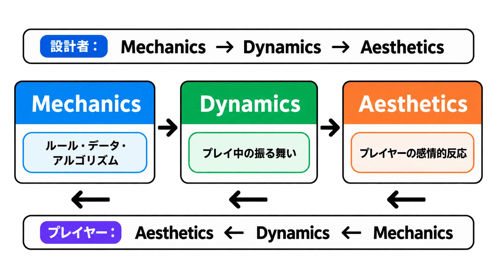
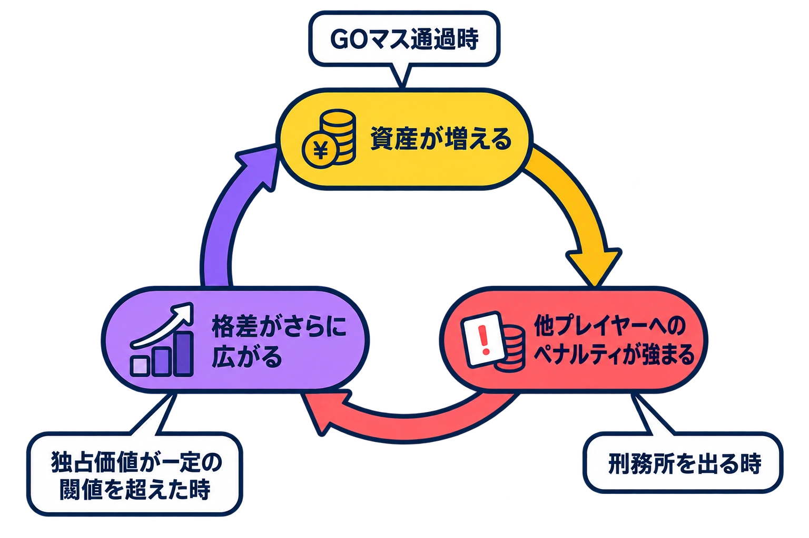
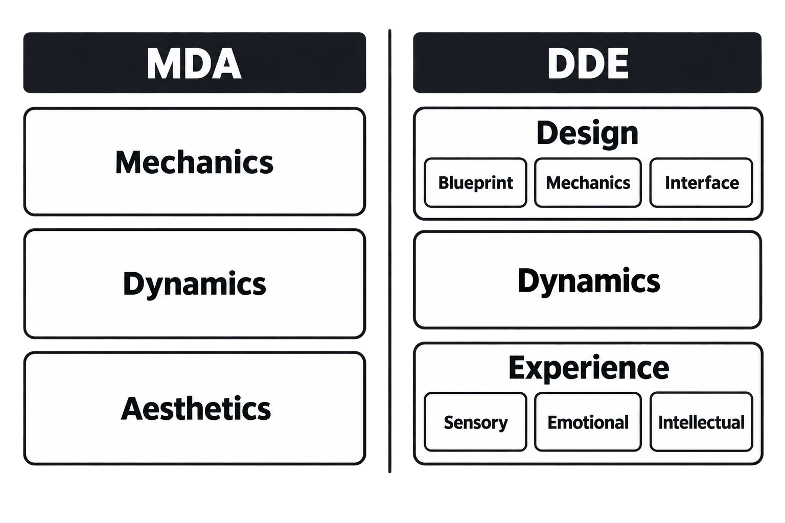

# MDAフレームワークとは何か――「面白い」をMechanics・Dynamics・Aestheticsに分けて考える

## はじめに：「面白い」を、次の一手につながる言葉に分解する

企画レビューで「ここは面白くない」「もっと面白くしてほしい」と言われたとき、全員が同じ問題を見ているとは限らない。操作そのものの選択肢が少ないのか、ルール同士の組み合わせが単調なのか、勝てたときの達成感が弱いのか。いずれも「面白くない」と言えてしまうため、議論は感想の交換で止まりやすい。

Robin Hunicke、Marc LeBlanc、Robert Zubekが2004年に示したMDAフレームワークは、この感想を分解して話すための見取り図である。MDAはMechanics、Dynamics、Aestheticsの頭文字であり、ゲームをルールと実装の要素、プレイ中に現れる振る舞い、プレイヤーに生じる感情的反応という、因果的につながった三つの見方に分ける。[[1](#ref-1)]

これは、どこで何が起きているかを、チームが同じ言葉で確かめるための語彙である。松永伸司による原論文の日本語全訳と訳注も公開されている。[[2](#ref-2)] 本稿は原論文を起点に、三層の意味、設計者とプレイヤーで逆になる見方、モノポリーを使った調整、そしてフレームワークの限界までをたどる。

*図：MDAフレームワークの因果と、設計者・プレイヤーで逆になる見方。*

***

## 1. MDAの三層は、同じゲームを別の高さから見る

原論文はMDAの各要素を、別々でありながら因果的に結び付いた「レンズ」あるいは「見方」と位置付ける。[[1](#ref-1)] 三つを順に定義する。

### Mechanics――ゲームを成り立たせるルール・データ・アルゴリズム

**Mechanics（メカニクス）** は、原論文では「データ表現とアルゴリズムの水準にある、ゲーム固有の構成要素」である。[[1](#ref-1)] 日常的にいう「操作方法」だけでなく、ゲームがどのデータを持ち、どんな規則で状態を変えるかまでを含む。

たとえば射撃ゲームなら、武器、弾薬、出現地点はMechanicsの例である。カードゲームなら、シャッフル、トリックテイキング、賭けが該当する。[[1](#ref-1)] プレイヤーが「何をできるか」と、その結果をゲーム側がどう決めるかを、まずこの層で見る。

### Dynamics――入力と相互作用から、プレイ中に立ち上がる振る舞い

**Dynamics（ダイナミクス）** は、プレイヤーの入力と、各メカニクスの出力が時間を通じて相互に働くことで生まれる、実行時の振る舞いである。[[1](#ref-1)] 仕様書に一項目として書かれていなくても、ルールを実際に動かせば現れる遊ばれ方がここに当たる。

たとえば、武器・弾薬・出現地点というMechanicsから、待ち伏せや狙撃という振る舞いが生まれることがある。カードをシャッフルし、取り、賭ける仕組みからは、はったりが生まれうる。[[1](#ref-1)] 同じメカニクスでも、参加者、選択、時間の経過によってDynamicsは変化する。したがって、企画段階で「この機能を入れた」と言うだけでは、実際の遊ばれ方まで保証できない。

### Aesthetics――プレイヤーに喚起される感情的反応

**Aesthetics（エステティクス）** は、ゲームシステムと関わるプレイヤーに喚起される、望ましい感情的反応である。[[1](#ref-1)] ここでいうAestheticsは、グラフィックの美しさだけを意味しない。緊張、発見、仲間といる感覚、暇つぶしとして没頭する感覚など、プレイによって得られる体験を指す。

この定義に立つと、「気持ちよくしたい」という要望はAestheticsについての希望であり、それを実現するには、どのDynamicsがその反応を生み、どのMechanicsを変えればDynamicsを動かせるかを分けて考える必要がある。

| 見方 | 初めに問うこと | 具体例 |
| --- | --- | --- |
| Mechanics | 何を許し、何を計算するか | 弾薬数、シャッフル、武器、出現地点 |
| Dynamics | プレイ中にどんな振る舞いが現れるか | 狙撃、待ち伏せ、はったり、協力 |
| Aesthetics | プレイヤーにどんな反応を起こしたいか | 緊張、発見、達成感、仲間意識 |

***

## 2. 設計者はM→D→A、プレイヤーはA→D→Mでゲームに出会う

原論文の重要な点は、設計者とプレイヤーが同じ順番でゲームを見ないと示したことにある。設計者の側では、MechanicsがDynamicsを生み、Dynamicsが特定のAestheticsへつながる。つまり、ルールやデータを設計し、そこから生まれる遊ばれ方を予想し、狙う体験へ近づける方向で考える。[[1](#ref-1)]

一方でプレイヤーの側では、Aestheticsがまず体験の調子を決め、その理由として観察可能なDynamicsがあり、さらに操作できるMechanicsにたどり着く。[[1](#ref-1)] 初めて触れた人は、内部データやアルゴリズムを先に見るのではない。「緊張する」「仲間と盛り上がる」「次を試したくなる」と感じ、画面上の出来事を観察し、操作と規則を少しずつ学ぶ。

この非対称性は、「作った通りに遊ばれない」ことの説明になる。設計者がMechanicsを一つ足しても、プレイヤーが期待どおりのDynamicsを見つけるとは限らない。見つけたとしても、それを望ましいAestheticsとして受け取るかは別問題である。MDAは、機能を実装した事実と、体験が成立した事実を同一視しないための枠組みだ。

この矢印は、開発工程を一方向に固定するというより、反復して行き来する仕事の道筋を示す。原論文自身が、設計と調整を反復的な仕事として扱っており、プレイテストでAestheticsとDynamicsを観察し、Mechanicsへ戻って変更する往復まで含めてMDAを使う。[[1](#ref-1)]

***

## 3. 「面白い」を八つの言葉にほどく

原論文は、ゲームを語る語彙が限られ、「fun」や「gameplay」からより具体的な語彙へ移る必要があると述べる。[[1](#ref-1)] その手掛かりとして示すのが、次の八つのAestheticsである。これは万能の正解表ではなく、体験の違いを言い分けるための分類である。

| 英語名 | 日本語での意味 | 原論文の短い定義 |
| --- | --- | --- |
| Sensation | 感覚の心地よさ | Game as sense-pleasure |
| Fantasy | 見立て遊び | Game as make-believe |
| Narrative | ドラマ | Game as drama |
| Challenge | 障害物競走 | Game as obstacle course |
| Fellowship | 社会的枠組み | Game as social framework |
| Discovery | 未踏の領域 | Game as uncharted territory |
| Expression | 自己表現 | Game as self-discovery |
| Submission | 暇つぶし | Game as pastime |

*図：八つのAestheticsは優劣や順序ではなく、体験を言い分けるための語彙である。*

ここで **Sensation** は、視覚・音・触感などによる感覚の心地よさである。**Fantasy** は、別の存在や状況になりきる見立て遊びである。**Narrative** は、出来事の連なりから生まれるドラマを味わうこと、**Challenge** は、越えるべき障害に取り組むことを指す。

**Fellowship** は、他者と関わる社会的な枠組みそのものを楽しむことだ。**Discovery** は、未知の場所や可能性を見つける体験、**Expression** は、自分らしい痕跡や表現を残す体験、**Submission** は、決められた遊びに身を委ね、暇つぶしとして過ごす体験である。[[1](#ref-1)]

原論文は、同じ「fun」でもゲームごとに重心が違う例を挙げる。CharadesはFellowship、Expression、Challenge、QuakeはChallenge、Sensation、Competition、Fantasy、The SimsはDiscovery、Fantasy、Expression、Narrative、Final FantasyはFantasy、Narrative、Expression、Discovery、Challenge、Submissionとして示される。[[1](#ref-1)]

この列挙で大切なのは、複数のAestheticsが同時に重なり合う点である。Charadesでは、仲間と同じ場にいる感覚、身ぶりで伝える表現、当てる難しさが重なっている。原論文の八分類にCompetitionは含まれないが、Quakeの例には競争も併記される。分類表を閉じた辞書として扱わず、必要な体験を具体的に語るための出発点として使う必要がある。

***

## 4. モノポリーの例：Dynamicsを観察してMechanicsを調整する

MDAは、体験の目標から新しいゲームを組み立てる場面だけでなく、すでに起きているDynamicsを観察し、Mechanicsの調整点を見つける場面でも使える。

原論文はモノポリーを例に、先行して富を得たプレイヤーが他のプレイヤーへより強いペナルティを与えられ、遅れているプレイヤーはさらに貧しくなるフィードバック構造を説明する。差が広がるほど、ゲームに関わり続ける人は少なくなり、劇的な緊張と行為者性が失われる。[[1](#ref-1)]

*図：モノポリーで格差が広がるDynamicsと、原論文が挙げる調整ポイント。*

ここで先に見えるのは、「一度差がつくと参加感がなくなる」というDynamicsとAestheticsの問題である。そこからMechanicsへ戻り、遅れているプレイヤーへのボーナスや補助、富裕なプレイヤーへのペナルティや税を検討する。原論文は、GOマス通過時、刑務所を出る時、独占価値が一定の閾値を超えた時などに、こうした規則を適用する案を挙げる。[[1](#ref-1)]

変更後は、税率、ペナルティ、報酬と罰の閾値をプレイテストで反復的に調整する。これが **tuning（チューニング）** 、すなわち狙った遊ばれ方へ近づけるためにルールの値や条件を詰める仕事である。[[1](#ref-1)] ただし税を複雑にしすぎれば、資産や順位を把握する手掛かりを損なうかもしれない。MDAで見るべきなのは、一つの数値を改善したかではなく、Mechanicsの変更がDynamicsとAestheticsの両方へ何をもたらしたかである。

***

## 5. MDA以前にも、共通語彙を求める試みがあった

「面白い／面白くない」から先へ進む言葉を求める課題には、MDA以前からの歴史がある。Doug Churchは1999年の「Formal Abstract Design Tools」で、ゲームデザインの発展を妨げる要因として共通のデザイン語彙の不足を挙げ、より精密に議論する必要を説いた。[[3](#ref-3)]

Churchが提示したFormal Abstract Design Toolsには、**intention（意図）** 、**perceivable consequence（知覚可能な結果）** 、**story（物語）** という三つの概念がある。[[3](#ref-3)] たとえばプレイヤーが危険なジャンプを選び、失敗したとき、その結果が自分の選択の帰結だと分かることは、知覚可能な結果の問題として話せる。

MDAとChurchの枠組みは分類こそ異なるが、ジャンルや職能をまたいで、成功や失敗の理由を持ち運べる言葉を作ろうとした点でつながっている。MDAはこの課題に対し、ゲームの構成、実行時の振る舞い、体験を往復する三層の見方を与えた。

***

## 6. MDAが扱いにくいゲームと、DDEという再提案

MDAを有効に使うには、どこで見方が合わなくなるかも知っておく必要がある。

Luiz Claudio Silveira Duarteは2015年の記事で、デジタルゲームではプレイしながら規則を学べるという前提が、ボードゲームにはそのまま当てはまらないと指摘した。ボードゲームでは、少なくとも一人がルールを読み、参加者がそのルールを実装しなければ遊べない。したがって、プレイヤーはまずMechanicsを学び、そこからDynamicsとAestheticsへ進むことになる。[[4](#ref-4)]

この指摘は、Aesthetics→Dynamics→Mechanicsというプレイヤー側の順序を、すべてのゲームにそのまま当てはめるべきではないと教える。初めてのチェスの駒を動かす前に、動かし方を知る必要があるように、媒体や導入方法によっては規則が体験の入り口になる。

Wolfgang Walkも2015年の記事で、MDAにはナラティブデザイン構造を置く一貫した場所がないと批判した。さらに、MDAのMechanicsが、デザイナーが直接制御するものを広く引き受けすぎるため、グラフィックや音、ナラティブまでを同じ語で扱うことに無理が生じると論じる。[[5](#ref-5)]

Walkは代わりに **DDE（Design／Dynamics／Experience）** を提案する。Designの中にBlueprint、Mechanics、Interfaceを置き、Mechanicsをコード、入出力、規則の実装などへ狭く定義する構成である。[[5](#ref-5)] ここでのExperienceは、感情だけでなく、感覚・感情・知的な経験が時間と空間の中で重なるものとして扱われる。[[5](#ref-5)]

*図：DDEはDesignとExperienceをさらに要素へ分け、Mechanicsの範囲をMDAより狭く捉える。*

これらの批判が示すのは、MDAが力を発揮する場面の輪郭である。MDAが強いのは、ルールから振る舞いを経て体験へ至る因果を問う場面であり、ルール学習が先に来る遊びや、ナラティブ・表現資産の構造を詳しく設計する場面では、別の語彙を併用する必要がある。

***

## 7. 実務では「問いの型」として使う

MDAは、分析のための語彙として使うときに、最も力を発揮する。八つのAestheticsをすべて満たせば面白くなるわけでも、Mechanicsから順に埋めれば企画が完成するわけでもない。

### 企画レビュー：M→D→Aの因果を一文ずつつなぐ

企画をレビューするときは、機能名を並べる代わりに次の順で問い直す。

1. 狙うAestheticsは何か。たとえばChallengeなら、プレイヤーにどんな障害を乗り越えた感覚を持ち帰ってほしいのか。
2. その反応を支えるDynamicsは何か。時間制限、相手との駆け引き、情報共有など、プレイ中に何が起きる必要があるのか。
3. そのDynamicsを可能にするMechanicsは何か。規則、入力、データ、表示、条件のどれを用意し、どこを調整できるようにするのか。

ここで「このMechanicsは、狙ったAestheticsへ本当につながるか」と聞ければ、機能の有無ではなく因果のつながりを議論できる。結び付かないなら、機能を増やす前にDynamicsの予想を見直せる。

### プレイテスト：A→D→Mの順で感想を読み解く

プレイテストでは、逆向きに読む。「終盤で勝てる気がしなかった」という発言は、まずAestheticsの問題、すなわち緊張や行為者性が失われたという観察である。次に、何がその感覚を生んだかをプレイ記録から探す。先行者だけが資産を増やし続け、遅れた人に有効な選択がないなら、それはDynamicsの仮説になる。最後に、報酬条件、税、資産の増え方といったMechanicsへ戻る。

この逆読みは、プレイヤーへ「どの数値を下げればよいか」を尋ねる方法ではない。体験の報告を尊重しつつ、変更可能な仕組みへたどり着くための手順である。変更後も、同じAestheticsが得られたかを再び観察する必要がある。

### 使う範囲を明示する

レビューの冒頭で、「今回は戦闘のChallengeを主に見る」「物語構造はMDAだけで整理しない」と対象範囲を明示するとよい。MDAにすべてを入れようとしないことが、批判を知った上での実務的な使い方になる。

***

## まとめ：「面白い」を、変えられる問いへ翻訳する

MDAフレームワークは、ゲームをMechanics、Dynamics、Aestheticsという因果の連鎖として見ることで、「面白い」という大きな感想を、確かめられる問いへ変える。

- Mechanicsは、ルール、データ、アルゴリズムの構成要素である。
- Dynamicsは、それらが入力と相互作用してプレイ中に生む振る舞いである。
- Aestheticsは、プレイヤーに喚起される感情的反応である。

設計者はM→D→Aの方向で仮説を組み、プレイヤーの報告からはA→D→Mの方向で原因を探る。この二つの向きを往復することで、感想を仕様と調整の議論へつなげられる。

MDAが力を発揮するのは、ルールから振る舞い、体験へと至る因果を問う場面に限られる。ボードゲームのルール学習、ナラティブデザイン、表現資産の扱いには、別の見方が必要になる。DuarteやWalkの批判と後継の提案を含めて理解すると、MDAは正解を出すチェックリストではなく、チームが「何を変えれば、どの体験が変わるのか」を考え続けるための、扱いやすい共通語彙になる。

## References

1. [Hunicke, R., LeBlanc, M., & Zubek, R.「MDA: A Formal Approach to Game Design and Game Research」（2004）][1] - MDAの定義、設計者とプレイヤーの視点、八つのAesthetics、モノポリーの分析とチューニングを示す原論文。

2. [松永伸司「MDAフレームワークの論文の全訳（訳注付き）」][2] - 原論文の日本語訳と訳注への案内。日本語で原典を確認するための補助資料。

3. [Doug Church「Formal Abstract Design Tools」（1999）][3] - 共通のデザイン語彙の必要性と、intention、perceivable consequence、storyを提示する記事。

4. [Luiz Claudio Silveira Duarte「Revisiting the MDA framework」（2015）][4] - ボードゲームではルールを先に学ぶ必要があることから、プレイヤー側の順序に限界があると論じる記事。

5. [Wolfgang Walk「From MDA to DDE」（2015）][5] - ナラティブデザインの置き場とMechanicsの範囲を批判し、Design／Dynamics／Experienceを提案する記事。

[1]: https://users.cs.northwestern.edu/~hunicke/MDA.pdf
[2]: https://9bit.99ing.net/Entry/110/
[3]: https://www.gamedeveloper.com/design/formal-abstract-design-tools
[4]: https://www.gamedeveloper.com/design/revisiting-the-mda-framework
[5]: https://www.gamedeveloper.com/design/from-mda-to-dde

----

この文書は、Perplexity、Claude、OpenAI Codex の3つのAIの支援を受けて著述されたものです。引用画像を除き、MIT License にて提供されています。
