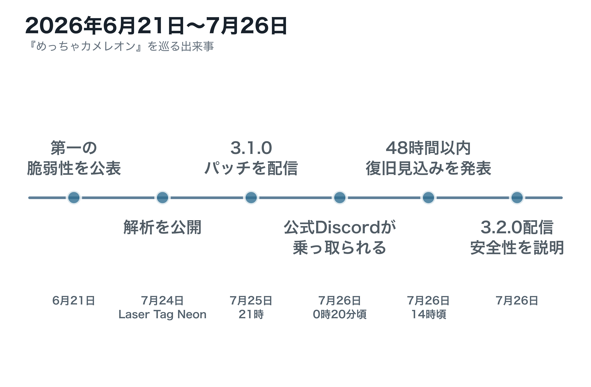
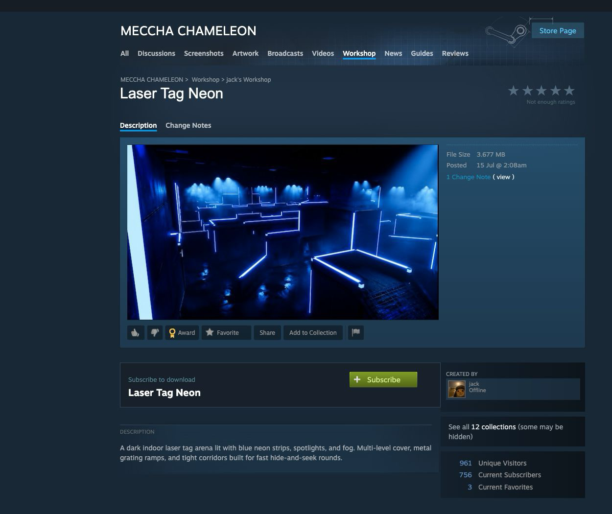
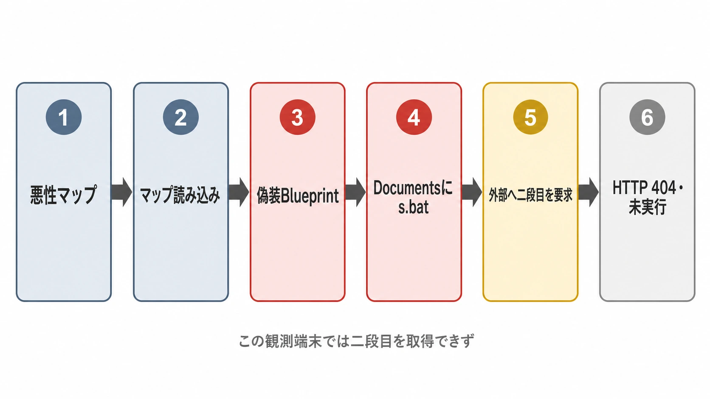
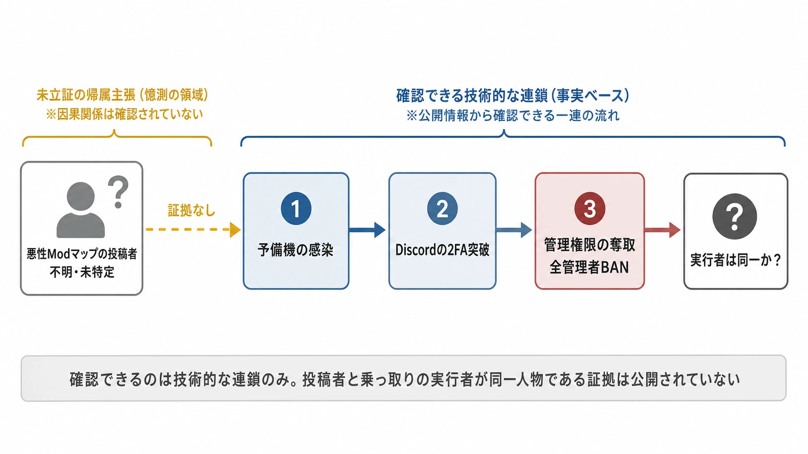

# 『めっちゃカメレオン』の悪性ModマップとDiscord乗っ取り――「技術的な連鎖」と「同一犯」を混同しないために

## めっちゃカメレオンとは――配信に広がりやすい「お絵描きかくれんぼ」

『めっちゃカメレオン』は、LEMORIONが開発・販売するSteam向けのマルチプレイかくれんぼゲームである。プレイヤーは鬼チームと隠れチームに分かれ、鬼は制限時間内に隠れ側を見つければ勝利する。隠れ側は、真っ白な自分の体に周囲の色や模様を描き、場所とポーズも使ってステージへ擬態する。発見する側の観察と、隠れる側の「画力」が同じ画面でぶつかることが本作の核である。[[1](#ref-1)][[2](#ref-2)]

この仕組みは、配信との相性がよい。視聴者は画面を見ただけでルールを理解でき、隠れ方の成功・失敗、見落とし、偶然の発見が短い見どころになる。公開マッチと視聴者参加型のプレイに対応しており、配信・実況を前提とした設計になっている。視聴者参加の大人数コラボや切り抜きへ広がりやすく、VTuberを含む配信者コミュニティで遊ばれた背景には、この「見れば分かる」「人数を集めてすぐ始められる」構造がある。[[1](#ref-1)]

配信分析企業Stream Hatchetは、発売後30日間の視聴時間で本作を2026年の新作中2位とし、6月10日以降の集計で5,100万時間の視聴、5万2,000本の配信を報告している。これは因果を単純化して「配信だけがヒットを作った」と言うための数字ではない。しかし、ゲーム本体、Workshopのカスタムマップ、公式Discordという複数の接点が、非常に大きく活発なコミュニティへつながっていたことを理解する上での背景になる。[[3](#ref-3)]

***

2026年6月、SteamワークショップのカスタムマップからプレイヤーのPC上で任意のプログラムを動かせる脆弱性が報告された。7月24日には、別の経路で悪性のModマップ「Laser Tag Neon」（Workshop ID: 3765145606）が解析され、翌25日にはModマップ向けのセキュリティパッチを含むアップデート3.1.0が配信された。さらに26日にかけて、開発元の公式Discordサーバーが乗っ取られ、同日にはゲームの安全性をあらためて説明し、新エモート12種を追加するアップデート3.2.0も配信された。[[4](#ref-4)][[5](#ref-5)][[6](#ref-6)][[7](#ref-7)]

本作は発売後まもなく大きな利用者基盤を得た。6月21日時点でKhael Kugler氏は累計ダウンロード約700万本と記しており、7月上旬には累計販売1500万本突破が報じられている。だからこそ、この一件は「人気タイトルの不運な事件」ではなく、UGC（ユーザー生成コンテンツ）を製品に組み込むゲームが持つ攻撃面を考える材料になる。[[8](#ref-8)][[9](#ref-9)]

ただし、ここで最も注意したいのは二つの問いを混ぜないことである。

- **技術的な連鎖**：開発元は、悪性Modマップを検証した予備機の感染から、エンジニアのDiscord二要素認証を突破され、サーバー権限を奪われたという経緯を説明している。
- **実行者の帰属**：一方で、公表情報だけから「悪性Modマップをアップロードした人物」と「Discordを乗っ取った人物」が同一人物だったと断定することはできない。

前者は開発元によるインシデント説明であり、後者は捜査・フォレンジックで裏付けるべき別の主張である。本稿では、確定している挙動、開発元が説明した出来事、そこからは導けない推測を分けて整理する。

***

## 「審査を通ったModなら安全」が成立しない理由

Steamワークショップの審査を通過したことは、ゲーム側がそのデータを安全に扱えることの証明ではない。特にUE5（Unreal Engine 5）製のカスタムマップでは、見た目のステージデータだけでなく、Blueprint（ノードをつないで挙動を作るビジュアルスクリプト）を含められる。マップ読み込み時に自動で動くロジックが許されていれば、読み込みは単なる「データ表示」ではなくなる。

### 6月：Workshopフォルダに置いたファイルを開かせる手口

Kugler氏が6月21日に公表したのは、Blueprintの `LaunchURL` が内部でWindowsの `ShellExecuteW` を呼ぶ挙動を利用する脆弱性である。`ShellExecuteW` は、URLをブラウザで開くだけでなく、指定されたローカルのパスを「開く」Windowsの仕組みでもある。[[8](#ref-8)]

攻撃者はまず、Steam Workshopが各アイテムを予測可能なローカルフォルダへ展開する性質を利用する。そこへバッチファイルを含めたマップをアップロードし、マップの `BeginPlay`（読み込み開始時に実行されるイベント）から、そのバッチファイルへのパスを `LaunchURL` に渡す。プレイヤーがマップを購読し、ロビーで実際に読み込むと、ゲームが意図せずそのファイルを起動できてしまう。

ここで危険なのは、Steamがマップを配信したこと自体ではない。ゲームクライアントが「マップとして必要なデータ」と「OSに起動させてよいファイル」を区別していなかった点にある。Kugler氏は、任意の拡張子を許すのではなく、必要なアセット形式を許可リスト方式で絞ること、Blueprintから許可する機能を限定することを提案している。[[8](#ref-8)]

### 7月：アセットの中へ処理を隠し、読み込み時に書き出す手口

Feint氏が公開した「Laser Tag Neon」の解析は、6月の実証とは別の道筋を示した。パッケージ内に目立つ実行ファイルやバッチファイルは置かれておらず、通常のUE5アセットコンテナに見える `.pak`、`.ucas`、`.utoc` が並んでいた。ところが、アセットのメタデータを調べると、環境制御らしい名前の `BP_AmbientController` に、以前の名前とみられる `BP_RCE_Test_C_0` が残っていた。[[6](#ref-6)]

解析で示されたBlueprintは、マップ読み込み時の `ReceiveBeginPlay` から、WindowsのDocumentsフォルダに `s.bat` を書き出す。この名前の偽装は、ファイル名だけの目視確認や「実行ファイルが含まれていない」という検査をすり抜けやすくする。つまり、6月の手口が「Workshopフォルダに忍ばせたファイルを起動する」ものだったのに対し、7月の手口は「一見すると通常のアセットに見えるロジックが、読み込み時に実行用ファイルを生成する」ものである。[[6](#ref-6)][[7](#ref-7)]

*画像出典（引用）：Gridinsoft, [Meccha Chameleon Workshop Malware: Laser Tag Neon Cleanup][7] に掲載されたSteam Workshop公開ページのスクリーンショット。WebP変換。*

両者の細部は異なるが、攻撃面は共通する。どちらも、**信頼できないWorkshopコンテンツに、ゲームクライアントを通じてOSへ影響する能力を与える** という問題を突いている。審査は重要な防御層である。しかし、審査に通ったことを、クライアント側の権限設計やサンドボックスの代わりにはできない。

***

## Laser Tag Neonで確認された処理の流れ

「マルウェアが混入していた」という表現だけでは、どこまで実行されたのかが曖昧になる。Feint氏のアセット解析と、それを参照したGridinsoftの整理では、少なくとも次の第一段階が示されている。[[6](#ref-6)][[7](#ref-7)]

1. プレイヤーが対象マップを読み込む。
2. 無害な環境制御に見せかけたBlueprintが自動実行される。
3. BlueprintがユーザーのDocumentsフォルダへ `s.bat` を書き出す。
4. このバッチファイルは自分自身を最小化して再起動し、隠しウィンドウのPowerShellを起動する。
5. PowerShellは外部サーバーから二段目の `steamb.bat` を取得し、一時フォルダへ保存して実行しようとする。

この第一段階は、**ドロッパー**、すなわち本命のプログラムを外部から取り寄せるための小さな運搬役として理解するとよい。外部から指示や追加ファイルを受け取る接続先を **C2（Command and Control、攻撃者側が感染端末に命令を送るための接続先）** と呼ぶことがあるが、今回解析で示されたIPアドレスはホスティング基盤の所在を示すだけで、運営者や攻撃者の身元を証明するものではない。Feint氏も、アムステルダム、Blockchain Creek B.V.、ASN 207994という地理・ネットワーク情報だけでは帰属を確定できないと明記している。[[6](#ref-6)]

さらに重要な限界がある。Feint氏が記録した感染端末では、二段目の取得はHTTP 404で失敗しており、ファイルは保存も実行もされなかった。その観測だけから、二段目が情報窃取、遠隔操作、あるいは別種の機能だったと断言することはできない。Gridinsoftも、当該端末での二段目は未実行で内容不明と整理している。[[6](#ref-6)][[7](#ref-7)]

***

## Discord乗っ取りで開発元が説明したこと

アップデート3.1.0はSteam公式ニュースで「MODマップ向けセキュリティパッチ」を含むと告知された。続いて開発元は、悪性Modマップを調査・対処していた最中の検証について、感染したのは開発環境ではない予備の検証機だったと説明している。[[4](#ref-4)][[5](#ref-5)][[10](#ref-10)]

Steam公式ニュースに掲載された開発元の説明によれば、その予備機でエンジニアがマルウェアに感染し、Discordの2FA（二要素認証。パスワードに加えて認証アプリなどの第二の確認を求める仕組み）を突破され、管理者アカウント経由でサーバー権限を奪われた。結果として公式スタッフ全員がBANされ、チーム側から操作できない状態になったという。[[4](#ref-4)][[5](#ref-5)]

同時に開発元は、感染したPCは本番のゲームソースファイルへ物理的にアクセスも編集もできない予備機であり、ログでもゲームファイルの追加・変更は確認されなかったと説明した。端末は初期化済みであるともしている。これは「Discordが乗っ取られた」ことと「ゲーム本体が改ざんされた」ことを同じ事象として扱わないための、重要な影響範囲の説明である。[[4](#ref-4)][[5](#ref-5)][[10](#ref-10)]

乗っ取り後のサーバーでは、ゲーム『Watch Dogs』に登場する架空のハッカー集団DedSecを模した投稿が大量に行われた。また、「最新版に開発者自身がRATを仕込んだ」「特定の手順で直す必要がある」といった虚偽の告知も流れた。開発元はこれを明確に否定し、ゲーム本体とDiscordは連携しておらず、Discordの投稿にあるリンクや指示に従わないよう呼びかけた。DedSecは『Watch Dogs』シリーズのフィクション上の集団であり、この名称の使用は実在する攻撃者集団による犯行声明ではない。[[4](#ref-4)][[5](#ref-5)][[11](#ref-11)]

***

## 「同じ攻撃者だったのか」には、まだ答えられない

二つの事件が近い時刻に起き、開発元自身が「検証機の感染」から「Discord乗っ取り」への連鎖を説明したため、悪性マップの投稿者がそのままDiscordを乗っ取ったと受け取りやすい。しかし、公開された説明が示すのは、感染端末へのアクセスを足掛かりにDiscordの2FAが突破され、権限が奪われたという **技術上のつながり** までである。Workshopのアップロード者とDiscord乗っ取りの実行者を同一人物とする証拠は、公開されていない。[[4](#ref-4)][[5](#ref-5)][[10](#ref-10)]

この区別には実務的な理由がある。攻撃者の世界では、侵入済み端末や盗んだ認証情報へのアクセスを売買・共有する分業が存在する。MITRE ATT&CKは、すでに侵害されたシステムへのアクセスを購入・取得する手法を記載し、複数の攻撃者が侵害済みシステムを共有する場合があるとしている。これは今回の事件で実際に転売・共有が起きたという証拠ではない。むしろ、**そうした一般的な可能性があるからこそ、感染させた者と後から操作した者を同一視できない** という意味である。[[12](#ref-12)]

帰属には、アップロードアカウント、決済・通信記録、サーバーログ、端末の痕跡、各投稿の作成経路など、通常は非公開の証拠を突き合わせる必要がある。IPアドレスの設置場所、演出用の名称、投稿の文体だけで実行者を決めるのは避けるべきである。

***

## 危機対応として評価できる点と、開示の設計

開発元はSteam公式ニュース、開発者個人のX、ゲーム公式Xを使い分けながら、Modマップのパッチ、Discordの異常、ゲーム本体への影響範囲、偽情報への注意を短い間隔で更新した。Discordの復旧見込みについても、7月26日午後の時点で「48時間以内」と具体的な目安を示している。[[4](#ref-4)][[5](#ref-5)][[10](#ref-10)]

特に良いのは、「安全です」だけで終わらず、何が侵害され、何が侵害されていないかを分けた点である。ゲームの脆弱性へのパッチと、Discord管理者アカウントの乗っ取りは別々に説明され、偽のRAT告知を否定した。事実が流動的な初動では、断言を増やすよりも、確定した範囲・未確定の範囲・利用者に求める行動を更新し続ける方が信頼につながる。

一方で、こうした説明はインシデントが起きてから即興で作ると遅れる。連絡手段そのものが奪われる前提で、Steamニュース、公式サイト、公式SNS、サポート窓口の優先順位を決め、誰がどの情報を承認できるかを平時から定めておく必要がある。

***

## ゲームプランナーが持ち帰る三つの教訓

### 1. UGCの審査は防御の一層であり、信頼の根拠そのものではない

「プラットフォームの審査を通過した＝クライアントが安全に実行してよい」とはならない。アップロードできるファイル形式、実行可能なBlueprint、外部URL、ローカルファイル書き込み、ネットワーク通信を、ゲーム側が最小権限で設計する必要がある。特に、ロード時に自動実行されるロジックは、ユーザーが明示的に確認していないコードとして扱うべきである。

プランナーも、UGCの「自由度」を仕様書に書くだけでなく、制作ツールが許す命令、審査で見られる範囲、クライアントが許す権限、違反時の停止・削除・通知の手順を、エンジニアと同じ設計対象として扱う必要がある。

### 2. 悪性ファイルの検証環境は、本番の認証情報から隔離する

今回の開発元の説明は、ゲームソースへ到達できない予備機で検証していたことを示している。それでもDiscordの2FAが突破されたという。検証用端末を本番ネットワークから分けるだけでは足りず、管理者アカウント、ブラウザのセッション、パスワードマネージャー、認証アプリ、開発者トークン、Discordなどのコミュニケーション権限も分離対象である。

「怪しいModを開くなら、影響されてもよい端末と使い捨ての認証情報で行う」をルール化し、端末の初期化、ログ保全、ネットワーク遮断、アカウント無効化までを手順書にしておく。これはセキュリティ担当だけの仕事ではなく、検証を依頼する企画・運用側が予算と日程に含めるべき品質条件である。

### 3. 初動の情報開示を、ゲーム機能と同じように設計する

攻撃の最中は、正確な全容をすぐに把握できない。だからこそ、最低限の告知テンプレートとして「利用者が今すべきこと」「影響を受けた範囲」「影響が確認されていない範囲」「次回更新時刻」「なりすまし窓口」を用意しておく価値がある。

更新頻度と具体性は、プレイヤーの安全行動を左右する機能である。UGCがあるタイトルでは、削除対象のID、影響するプラットフォーム、実行トリガー、アップデートの適用状況を、不要な攻撃手順を広げない範囲で素早く明示できるようにしたい。

***

## まとめ

『めっちゃカメレオン』の一件は、悪性マップの技術的な仕組みと、Discord乗っ取りの被害が近接していたため、単一の物語にまとめられやすい。しかし、そこには少なくとも三段階の異なる問いがある。Workshopコンテンツが何を実行したか、感染端末からDiscord管理権限がどう奪われたか、そして各段階を誰が実行したかである。

前二者については、解析と開発元の説明から一定の輪郭がある。最後の帰属については、公開情報だけでは答えられない。技術的な連鎖を丁寧に理解することと、根拠のない同一犯説を避けることは両立する。UGCを運営するチームは、この慎重さを、クライアントの権限設計、検証環境の隔離、そして初動広報の設計へ変換していく必要がある。

## References

1. [MECCHA CHAMELEON][1] - Steamの公式ストアページ。ゲームの概要と公開マッチ・Workshop対応を確認するための資料。

2. [4Gamer.netの記事][2] - 『めっちゃカメレオン』のゲーム内容と配信での広がりを扱った記事。

3. [Meccha Chameleon's Popularity on Live Streaming][3] - Stream Hatchetによる、発売後の配信視聴時間と配信本数の分析。

4. [Steam公式ニュース（アップデート3.1.0）][4] - Modマップ向けセキュリティパッチを含む更新の告知。

5. [Steam公式ニュース（Discord乗っ取り後の説明）][5] - 検証機の感染、Discordの権限喪失、ゲームファイルへの影響範囲についての開発元説明。

6. [Workshop map for MECCHA CHAMELEON is a malware dropper (full breakdown)][6] - Feint氏による「Laser Tag Neon」のアセットと処理の解析。

7. [Meccha Chameleon Workshop Malware: Laser Tag Neon Cleanup][7] - Gridinsoftによる事象の整理と、Steam Workshop公開ページの掲載画像。

8. [2-Click Remote Code Execution in Meccha Chameleon][8] - Khael Kugler氏によるLaunchURLを利用した脆弱性の報告。

9. [Game*Sparkの記事][9] - 2026年7月時点の累計販売本数に関する報道。

10. [AUTOMATONの記事][10] - 2026年7月26日のDiscord乗っ取りと開発元の説明を報じた記事。

11. [Watch Dogs: Legion — Liberate London as Anyone This March][11] - 『Watch Dogs』シリーズにおけるDedSecの公式紹介。

12. [MITRE ATT&CK: T1650 — Acquire Access][12] - 侵害済みシステムへのアクセス取得・共有に関する一般的な手法の記述。

[1]: https://store.steampowered.com/app/4704690/MECCHA_CHAMELEON/
[2]: https://www.4gamer.net/games/007/G100712/20260610058/
[3]: https://streamhatchet.com/blog/meccha-chameleons-popularity-on-live-streaming/
[4]: https://store.steampowered.com/news/app/4704690/view/680756685198854773?l=japanese
[5]: https://store.steampowered.com/news/app/4704690/view/680756685198854787?l=japanese
[6]: https://medium.com/@FeintBE/workshop-map-for-meccha-chameleon-is-a-malware-dropper-full-breakdown-d1ac29565265
[7]: https://blog.gridinsoft.com/meccha-chameleon-workshop-malware/
[8]: https://khaelkugler.com/blogs/meccha_chameleon.html
[9]: https://www.gamespark.jp/article/2026/07/06/168859.html
[10]: https://automaton-media.com/articles/newsjp/20260726-456783/
[11]: https://news.ubisoft.com/en-us/article/7vLnfoMDO6TRAKT9TlKyvW/watch-dogs-legion-liberate-london-as-anyone-this-march-e3-2019
[12]: https://attack.mitre.org/techniques/T1650/

----

この文書は、Perplexity、Claude、OpenAI Codex の3つのAIの支援を受けて著述されたものです。引用画像を除き、MIT License にて提供されています。
