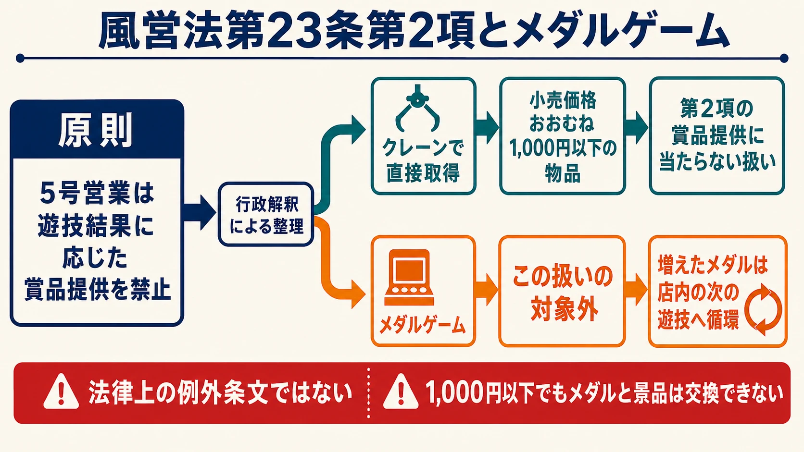

# メダルゲームは、なぜ何も持ち帰れないのに50年以上続いたのか――風営法と店内循環の産業構造

> **注意：** 本稿は公開資料を基に法制度と業界の運用を整理したものであり、個別の法的助言ではありません。実際の営業やサービス設計では最新の法令・通達を確認し、所轄警察署や専門家へ相談してください。

## はじめに――換金できない通貨が、50年以上動き続ける

ゲームセンターのメダルは、現金に換えられない。景品にも交換できず、店外へ持ち出すこともできない。プレイヤーが増やしたメダルで買い物をできるわけでもなく、遊び終えたときに持ち帰れる物品はない。

それでも日本のメダルゲームは、1968年の実証実験と1971年の専門店開業から50年以上にわたり、一つの産業分野として続いてきた[[1](#ref-1)]。何も持ち帰れないのに、なぜ価値が生まれ、メーカーは機械を作り、店舗は広い面積を使って運営を続けられるのか。

この問いは、ゲームプランナーにとって意外に身近である。プランナーは、現金へ戻せないコインやゴールド、ポイントといった **ソフトカレンシー** を日常的に設計している。メダルは、購入・獲得・消費・残高保存という循環を物理的な円盤で50年以上運用してきた事例と読めるからだ。

本稿は、[パチンコ・パチスロの抽選と演出](pachinko-pachislot-lottery-performance-separation.md)、[クレーンゲームの難易度・景品規制・オンライン化](crane-game-prize-regulation-difficulty-online-history.md)、[プリントシール機30年史](photo-sticker-machine-30-year-history-trends-technology-subscription.md) に続く周辺産業シリーズ第4弾である。ゲームプランナーが自らメダルゲームを作る機会はほぼないという前提に立ち、一般的なゲームセンター史は繰り返さず、法的な境界が運営と商品構成をどう形作ったかに焦点を絞る。

現在のメダルコーナーで存在感のあるコインプッシャーについても、本稿では類型の一つとして触れるだけにする。メダルを押し出す盤面、物理抽選、ジャックポットを組み合わせた設計論は、次稿で単独のテーマとして扱う。

***

## 第1章：換金しないことを選んで始まった

最初に扱うのは、法律の条文が整う前の成立史である。メダルゲームは、規制を受けた業界が後から換金を諦めて生まれたものではない。出発点から、換金しないことを遊びの条件にしていた。

### ギャンブルマシンを「檻」に入れる

JAIAの2024年の業界史特集は、シグマ創業者の真鍋勝紀氏を日本のメダルゲームシステムの考案者としている。同特集は真鍋氏の著書、当時の業界誌、関係者の協力を基にした資料であり、百科事典の要約よりも当事者側に近い記録である[[1](#ref-1)]。

特集によれば、真鍋氏は入手したアンティークのスロットマシンをきっかけに、ギャンブルマシンの迫力を、現金ではなく換金できない専用メダルで安全に楽しませる構想を得た。本人の比喩では、ギャンブルマシンという「野獣」を「檻」に入れる発想である。刑法学者と警察庁担当官へ趣旨を説明して相談し、確認を重ねたうえで、1968年に新小岩のボウリング場内でビンゴ、競馬を題材にした機械、スロットマシンを使う実証実験を始めた[[1](#ref-1)]。

1969年と1970年にも実験店舗を設け、1971年12月には新宿・歌舞伎町にゲーム専業店「ゲームファンタジア・ミラノ」を開いた。店内ではメダルゲームと通常のアーケード機を組み合わせ、メダル1枚を20円で貸し出していた。業界団体の別の歴史資料も、システムの考案、1968年の実験、1971年の単独店という流れを記録している[[2](#ref-2)]。

ここで重要なのは順序である。換金しない仕組みは、違法営業の摘発を受けた後の回避策として付け加えられたのではない。まず「現金を得る賭け」から切り離した純粋な遊びとして構想し、事前に相談してから営業を始めた。ゲームセンター等が現在の風営法上の規制対象になったのは、さらに後の1985年である[[1](#ref-1)]。

### 成功後に、自主規制の線を引いた

ミラノ店の成功後、類似のメダルゲーム場は急速に増えた。その一方で、メダルシステムを利用して実質的なギャンブルを行う違法営業への危機感も生じた。メダルゲーム協議会と当時の業界団体は警察庁の指導を受け、1973年末に「メダルゲーム場運営基準」を設けた[[1](#ref-1)]。

したがって、史実に沿った整理は「自主基準を作ったので第1号店の許可を得た」ではない。 **換金しない遊びとして事前確認し、実証と出店を行い、市場の拡大後に業界全体の自主基準を整えた** という順序である。業界側が早い段階から厳しい境界を守ろうとしたことは確かだが、個別の営業許可と後の自主基準を同じ出来事としては扱えない。

当初は、獲得メダルの預かりさえ認められず、退店時に返却する運用だったという[[1](#ref-1)]。文字どおり何も翌日に持ち越せない状態から産業が始まった事実は、遊びの中心価値が最初から換金益だけに置かれていなかったことを示している。

***

## 第2章：クレーンゲームと同じ条文の、例外がない側

ここから法制度の話へ切り替える。メダルの換金・景品交換・持ち出しは、似て見えても同じ条文の一文だけで決まるわけではない。現行の風営法第23条では、賞品提供と営業所外への持ち出しを分けて読む必要がある。

### 第2項は、遊技結果に応じた賞品を禁じる

風営法第23条第2項は、次のように定める。

> 第2条第1項第4号のまあじやん屋又は同項第5号の営業を営む者は、その営業に関し、遊技の結果に応じて賞品を提供してはならない。

ゲームセンター等は5号営業であるため、メダルゲームで増やした枚数に応じて物品を渡せば、この原則禁止に当たる[[3](#ref-3)]。現金への交換はもちろん、メダルを券やポイントへ置き換えて後から景品を渡す設計も、名前を変えただけでこの境界を越えられるものではない。

同じ第23条第2項を扱った既刊記事 [クレーンゲームはなぜ景品を出せるのか](crane-game-prize-regulation-difficulty-online-history.md) では、原則禁止の中に行政解釈が開けた狭い通路を見た。警察庁の現行の解釈運用基準は、クレーン式遊技機等で客が釣り上げるなどした物品のうち、小売価格がおおむね1,000円以下のものを提供する場合、第2項の「遊技の結果に応じて賞品を提供」することには当たらないものとして扱う[[4](#ref-4)]。

この価格基準は、2001年9月20日に800円と明記され、2022年3月1日におおむね1,000円以下へ改定された[[5](#ref-5)]。ただし、メダルゲームで増えた枚数を景品に換えるための上限額ではない。物品をクレーンで直接取得させるなど、解釈運用基準が示す形に限った扱いである。

JAIAの「アミューズメント施設における景品提供営業のガイドライン」も、この線をさらに明確にする。ガイドラインは「景品提供の方法」の項目で、パチンコ機・パチスロ機に類する遊技機、メダルゲーム、ビデオゲーム、フリッパーゲーム機等を用いる遊技では、景品を提供してはならないと定める[[6](#ref-6)]。

つまり同じ条文の下でも、クレーンゲームは条件内の物品を直接取得させる道があり、メダルゲームにはその道がない。遊技結果として増えたメダルは、次の遊技に投入する以外の財産的な出口を持てない。 **第23条第2項が閉じているのは、メダルから賞品や現金へ向かう出口** である。

### 持ち出し禁止は、第3項による準用で5号営業にも及ぶ

持ち出しについては、条文をもう一段読む必要がある。第23条第1項の柱書は「第2条第1項第4号の営業（ぱちんこ屋その他政令で定めるものに限る。）」を対象とし、第3号で玉・メダル等を客に営業所外へ持ち出させることを禁じている。柱書だけなら5号営業は対象外である。

しかし第23条は第3項で、「第1項第3号及び第4号の規定は、第2条第1項第5号の営業を営む者について準用する」と明記している[[3](#ref-3)]。したがって、ゲームセンターのメダル持ち出し禁止の根拠は、第2項を迂回して導くものではない。 **第3項が第1項第3号を5号営業へ準用すること** が直接の根拠である。

法的な役割分担は、次のように整理できる。

| 行為 | ゲームセンターへ及ぶ根拠 | 閉じる出口 |
|---|---|---|
| メダル枚数に応じて賞品を提供する | 第23条第2項 | メダルから物品・現金相当物への交換 |
| メダルを客に営業所外へ持ち出させる | 第23条第3項が第1項第3号を準用 | メダル現物の店外移動 |

賞品交換を禁じる線と、物理メダルを店内に留める線が重なることで、メダルの価値は営業所内の遊技へ閉じ込められる。この閉鎖性が、次章で見る預かりと再来店の前提になる。

***

## 第3章：持ち帰れない価値を、どう持ち越すか

ここから運営の話へ移る。店外へ持ち出せないことと、来店をまたいで残高を持ち越せないことは同じではない。現物を店内に残したまま、プレイヤーごとの利用可能枚数を店舗側で管理するのが **メダル預かり** 、いわゆる貯メダルである。

### 預けるのは現物、持ち帰るのは再利用の機会

一般的な店舗運用では、プレイヤーがメダルを商品として買い取るのではなく、店内で使う遊技媒体として借りる。タイトーは、貸出機でメダルを借り、獲得したメダルを現金や景品へ交換できず、店外へ持ち出せないと案内している。余った分は預ける、使い切る、返却する、のいずれかとなる[[7](#ref-7)]。

貸し出しという運用では、メダルの所有権と現物は店側に留まる。ゲームセンター「バイヨン」も、メダルは販売品ではなく貸出品であり、店の所有物だと説明している[[8](#ref-8)]。預かりサービスで保存されるのは、持ち帰った円盤そのものではなく、その店で後日引き出して再び遊べる枚数である。店舗の案内上、現金残高や換金請求権として扱われるものでもない。

この差が、1回の来店で使い切らない遊び方を可能にした。大きな当たりの後に残りを急いで消費せず、次回の元手として残せる。店舗側から見れば、メダルの貸し出しを一度きりの売上で終わらせず、「続きがある場所」として再来店の理由へ変えられる。

### 有効期限は、法律の一律ルールではなく店舗運用で異なる

預かりには有効期限がある。タイトーは期限の詳細を各店舗へ確認するよう案内しており、店舗ごとの差異があることを明示している[[9](#ref-9)]。公開例では、アドアーズは店舗で預かったメダルを100日間有効とし、一部でも払い出しまたは預け入れがあれば口座全体の期限を更新する[[10](#ref-10)]。ラウンドワンは最終利用日から30日間を基本としつつ、店舗・時期によって異なる場合があり、引き出しは預けた店舗だけで可能としている[[11](#ref-11)]。

この期限は、プレイヤーにとっては失効条件であり、店舗にとっては休眠口座を際限なく抱えないための運用条件である。同時に「期限内に一度戻ろう」という再来店の周期も作る。ただし、期限を短くすれば常連化するとは限らない。失効への不満、来店頻度、商圏、店舗の継続性を含めて設計する必要がある。

メダルゲームが長時間滞在型になりやすいのも、この循環と相性がよい。手元の枚数はプレイ可能時間へ置き換わり、遊技の結果によって減りも増えもする。増えた価値の出口は買い物ではなく、さらに遊ぶ時間である。店舗は座席、筐体の保守、メダルの補給・回収、預かり口座、常連客への接客を組み合わせて、その時間を支える。

***

## 第4章：メダルゲームという傘の下にあるもの

最後に供給側の商品構成を見る。「メダルゲーム」は単一のルール名ではなく、メダルを投入し、結果をメダルの増減で表す複数の機種を束ねた呼び名である。分類軸には、遊びのルールと筐体の形が混在している。

| 類型 | 主な体験 | 筐体・運営上の特徴 |
|---|---|---|
| プッシャー | 投入したメダルで盤面上のメダルやボールを押し出す | 物理フィールドが状態を見せ、複数席を備える大型機も多い |
| スロット（リール式・ビデオ式） | 絵柄の組み合わせへベットし、成立役に応じて配当を得る | 1人用のシングル機として構成しやすく、物理リール型と画面表示型がある |
| ビンゴ・物理抽選 | 抽選された数字や位置と、手元のカードや選択を照合する | 中央の抽選機構を複数のプレイヤーで共有できる |
| 競馬・レース | 着順を予想してベットし、機種によっては競走馬の育成も行う | 大画面や共通レースを囲んで複数席を配置する形が定着している |
| 大型ステーション型 | 共通の抽選・演出を見ながら、各席で個別に参加する | プッシャー、ビンゴ、競馬などを載せる筐体形式であり、独立したルール分類ではない |

この多様性は、1971年の「ゲームファンタジア・ミラノ」にピンボール、メダル式スロット、ビンゴが並び、1975年には大型競馬ゲームが登場していた時点ですでに見える[[2](#ref-2)]。メダルという共通媒体の上に、1人で回す短い抽選から、多人数で同じ物理抽選を見守る長い遊びまで載せられてきた。

### セガの現行ラインナップに見る、収斂しない供給

セガの公式メダルゲーム一覧で新しいものから6作を見ると、2023年3月8日の『ホリアテール』、同年11月28日の『BINGO THEATER』、2024年3月14日の『JACKPOT CIRCUS』、2025年3月4日の『MONOPOLY THE MEDAL AMERICAN DREAM』、2026年3月3日の『StarHorseParty』、同年7月8日の『モグリアテール』が並ぶ[[12](#ref-12)]。

| タイトル | 公式資料上の位置づけ | 稼働開始 |
|---|---|---|
| ホリアテール | ボール、ドリル、メダルタワーを組み合わせた大型プッシャー[[13](#ref-13)] | 2023年3月8日 |
| BINGO THEATER | 複数人で物理抽選を共有し、3種のビンゴを選べる機種[[14](#ref-14)] | 2023年11月28日 |
| JACKPOT CIRCUS | プッシャーとボール並べのコリントゲームを組み合わせた機種[[15](#ref-15)] | 2024年3月14日 |
| MONOPOLY THE MEDAL AMERICAN DREAM | ボードゲームの題材と実物のダイス抽選を組み合わせたプッシャー[[16](#ref-16)] | 2025年3月4日 |
| StarHorseParty | 馬券へのベットと競走馬育成を組み合わせたファミリー向け競馬メダルゲーム[[17](#ref-17)] | 2026年3月3日 |
| モグリアテール | 中央のドリル、ボール、複数のジャックポットを備えたプッシャー[[18](#ref-18)] | 2026年7月8日 |

大型プッシャーが現在のメダルコーナーで目を引く存在であることは、この商品群からも分かる。一方で、同じ時期に物理抽選型ビンゴと競馬も投入されている。これは供給側が一つの遊びへ完全に収斂していないことを示す例であり、業界全体の設置台数比や人気順位を示す統計ではない。

プッシャーがなぜ大きな盤面を必要とし、どのように小さな前進と大当たりへの期待を重ねるのか。物理状態、内部抽選、ジャックポット、店舗設定がどう結びつくのか。この設計論は次稿に送る。本稿で押さえるべきなのは、異なるルールの機械が、換金不能・持ち出し不能という同じメダル循環へ接続されている点である。

***

## おわりに――制約が、循環する価値を作った

メダルゲームは、換金できないにもかかわらず50年以上続いたのではない。 **換金できず、賞品へ交換できず、現物を店外へ持ち出せないからこそ、遊技の中だけで価値を循環させる産業として続いてきた** と捉えられる。

成立時には、ギャンブルマシンの刺激から現金の得喪を切り離した。現行法では、賞品提供の禁止と持ち出し禁止が異なる条項から出口を閉じる。運営は、閉じた価値を失わせるだけでなく、メダル預かりによって次回来店へ持ち越せるようにした。メーカーは、その共通媒体の上へプッシャー、スロット、ビンゴ、競馬という異なる遊びを載せ続けてきた。

ゲームプランナーの言葉へ置き換えると、メダルは次の性質を持つ物理的なソフトカレンシーである。

- 現金で初期残高を得るが、現金へ戻せない。
- プレイ結果によって増減し、次のプレイへ再投入される。
- 預かりによってセッションをまたげるが、利用場所と期限が限定される。
- 店外の市場へ流出させないことで、運営者が発行・回収・消費の循環を管理する。

デジタルゲームでリアルマネートレード、RMTを禁止する利用規約も、ゲーム内価値に外部の換金出口を作らせないという点では似た境界管理である。ただし、メダルゲームの風営法上の規制と、デジタルサービスの契約・技術・プラットフォーム運用は同じ制度ではない。似ているのは、価値の有無ではなく、 **価値をどこまで移動・交換できるようにするかが事業の性格を変える** という設計問題である。

有償のゲーム内通貨は、販売方法、有効期限、利用先などによって資金決済法上の前払式支払手段に当たり得る。この制度の詳細は既刊記事 [コンビニのニンテンドーカード、なぜ2種類あるのか――資金決済法から読むゲーム課金の「前払い」](nintendo-prepaid-download-cards-payment-services-act.md) に譲る。メダルから持ち帰るべき知見は、換金不能な通貨にも十分な動機と継続性を持たせられること、そして閉じた経済圏はルールだけでなく、法、利用場所、残高保存、運営期限を一体にして初めて維持できることである。

## References

1. [メダルゲームシステムの誕生と定着｜JAIA PRESS 2024年5・6月号][1] - 日本アミューズメント産業協会。真鍋勝紀氏の著書、当時の業界誌、関係者への協力を基に、1968年の実証、1971年の専門店、1973年の自主運営基準を整理した業界史特集。

2. [アミューズメントマシンの歴史（1970年代）｜JAIA][2] - メダルゲームシステムの考案、1968年の実験、1971年の専門店と初期の設置機種を紹介する業界団体資料。

3. [風俗営業等の規制及び業務の適正化等に関する法律｜e-Gov法令検索][3] - 第23条第1項第3号、第2項、第3項の現行条文を確認できる法令本文。

4. [風俗営業等の規制及び業務の適正化等に関する法律等の解釈運用基準について｜警察庁][4] - 2026年7月1日付の現行通達。クレーン式遊技機等で直接取得する小売価格おおむね1,000円以下の物品を、第23条第2項の賞品提供に当たらないものとして扱う基準を掲載。

5. [メディアのみなさまへ｜JAIA][5] - クレーン式遊技機等の景品価格基準が2001年9月20日に800円と明記され、2022年3月1日に1,000円へ改定された経緯を整理。

6. [アミューズメント施設における景品提供営業のガイドライン｜JAIA][6] - 2014年3月27日制定、2022年3月1日改正。景品提供の方法と、メダルゲーム等を用いる遊技で景品を提供しないことを定める。

7. [ゲームセンターの楽しみ方｜タイトー][7] - メダルの貸し出し、譲渡・売買の禁止、換金・景品交換不可、店内利用、預かり・返却を案内。

8. [いくつ知ってる？覚えておきたいゲームセンターの基礎知識｜バイヨン][8] - ゲームセンター運営者が、メダルは販売品ではなく店が所有する貸出品であることを説明。

9. [メダル貸出機で希望より多く借りた場合の返金と預かり｜タイトー サポートセンター][9] - 貸し出し後の返金不可、次回来店のための預かり、期限は店舗ごとに確認が必要であることを案内。

10. [アドアーズメンバーズサービスFAQ｜アドアーズ][10] - 店舗で預かったメダルの有効期限を100日間とし、払い出し・預け入れによる期限更新を説明。

11. [よくあるご質問――メダルについて｜ラウンドワン][11] - 預かり期間、引き出し店舗の限定、店舗・時期による運用差を案内。

12. [メダル｜アーケードゲーム｜セガ][12] - セガのメダルゲーム製品一覧と各タイトルの稼働開始日を掲載。

13. [ホリアテール｜セガ][13] - ボール、ドリル、メダルタワー、メダルバンク連携を備えたプッシャーメダルゲームの公式製品情報。

14. [BINGO THEATER｜セガ][14] - 複数人で遊ぶ物理抽選型メダル機と、3種類のビンゴゲームを紹介する公式製品情報。

15. [JACKPOT CIRCUS｜セガ][15] - プッシャーとボール並べのコリントゲームを組み合わせた公式製品情報。

16. [MONOPOLY THE MEDAL AMERICAN DREAM｜セガ][16] - 実物のダイス抽選を用いるメダルプッシャーゲームの公式製品情報。

17. [StarHorseParty｜セガ][17] - ベットゲーム、競走馬育成、協力要素を備える競馬メダルゲームの公式製品情報。

18. [モグリアテール｜セガ][18] - 中央ドリル、ボール、ボーナスプッシャー、ジャックポットを備える公式サイト。

[1]: https://jaia.jp/wp-content/uploads/2024/05/20249a.pdf
[2]: https://jaia.jp/history/pdf/history_1970_01.pdf
[3]: https://laws.e-gov.go.jp/law/323AC0000000122
[4]: https://www.npa.go.jp/laws/notification/seian/hoan/hoantsutatu2/R080701kaisiyaku.pdf
[5]: https://jaia.jp/%E3%83%A1%E3%83%87%E3%82%A3%E3%82%A2%E3%81%AE%E3%81%BF%E3%81%AA%E3%81%95%E3%81%BE%E3%81%B8/
[6]: https://jaia.jp/wp-content/uploads/2023/11/AM_Prize_guideline20220301.pdf
[7]: https://www.taito.co.jp/how-to/
[8]: https://bayon-game.com/?p=45725
[9]: https://support.taito.co.jp/faqarticle.php?c=42&id=871&kid=48582&la=10&page=1&pv=20&ret=faq&sc=0&so=0
[10]: https://www.adores.jp/adomem/faq.html
[11]: https://www.round1.co.jp/aboutweb/faq.html
[12]: https://www.sega.jp/arcade/medal/
[13]: https://www.sega.jp/arcade/detail/hori-a-tale/
[14]: https://www.sega.jp/arcade/detail/bingotheater/
[15]: https://www.sega.jp/arcade/detail/jackpot-circus/
[16]: https://www.sega.jp/arcade/detail/monopoly-ad/
[17]: https://www.sega.jp/arcade/detail/starhorse-shparty/
[18]: https://moguri-a-tale.sega.jp/

----

この文書は、Perplexity、Claude、OpenAI Codex の3つのAIの支援を受けて著述されたものです。引用画像を除き、MIT License にて提供されています。
