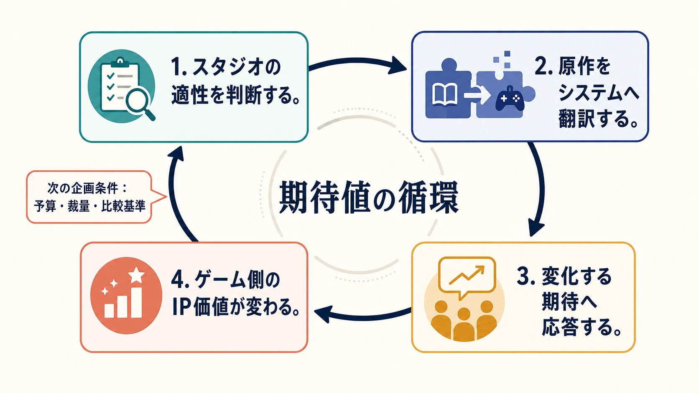

# IPゲーム化は「知名度の借用」ではない――成功・失敗6事例から読む期待値の循環

人気IPを使えば、企画はゼロから顧客の関心を集めずに済む。キャラクター、物語、映像表現にはすでに共有された記憶があり、告知の瞬間から「この作品なら、こう遊べるはずだ」という期待が立ち上がる。だが、その期待は一方的に借りて終わる資源ではない。発売されたゲームは、原作に対する次の期待、開発スタジオへの信頼、続編へ投じられる予算を変える。

「他メディアIPのゲーム化 成功・失敗事例シリーズ」では、『Marvel's Spider-Man』『鬼滅の刃 ヒノカミ血風譚』『ドラゴンボール ファイターズ』の成功事例と、『Marvel's Avengers』『ザ・ロード・オブ・ザ・リング：ゴラム』『New ガンダムブレイカー』の失敗事例を扱ってきた。6本を横断すると、成否を分けるのは「原作に忠実だったか」「機能が多かったか」という一問では説明できない。

共通しているのは、IPとスタジオの適性を見極め、原作の魅力を一つの中核行為へ翻訳し、原作側の時間軸が生む期待へ応答し、その結果が次の企画条件を変えるという循環である。IPは企画書へ貼る固定の価値ではない。ゲーム化のたびに増減し、次の賭けへ戻ってくる **期待の残高** なのである。

## エグゼクティブサマリー

IPゲーム化は、一作ごとに完結するライセンス利用ではない。成功すれば、ゲーム版の体験に対する信頼が蓄積し、続編、長期運用、スタジオへの投資を呼び込みやすくなる。失敗すれば、原作全体の価値が直ちに失われるわけではないが、そのIPをゲームで遊ぶことへの期待と、同じ座組みへ次を任せる余地が縮む。これは他社IPだけでなく、自社シリーズを刷新する『New ガンダムブレイカー』にも起こった。

その増減を左右する第一の条件は、原作とゲームが別々の時計で動くことへの理解である。映画公開、アニメ放送、興行の急伸は宣伝効果をもたらす一方、比較基準と品質の下限を引き上げる。開発側は、その時計から距離を取るのか、勢いを受け止めるのか、既知の「顔」を別の価値で置き換えるのかを選ばなければならない。

第二の条件は翻訳力である。原作要素を多く収録することと、原作らしい体験を作ることは同義ではない。成功例は、移動、共闘、名場面の追体験といった中核へ資源を集め、見た目とシステムを同じ判断基準で組み立てた。失敗例では、要望や商品要件を機能へ直接変換した結果、プレイヤーが繰り返す行為が分裂した。

IP価値の可逆性、時間軸、翻訳力の三点は独立した教訓ではない。スタジオの適性判断が翻訳力を決め、翻訳力が期待への応答を決め、その応答がIPとスタジオの次の価値を変える。変化した価値は、次回の座組み、予算、開発期間、顧客の比較基準として、再び企画の入口へ戻る。この循環こそ、6事例を貫く結論である。

***

## 一作の結果が、次の企画条件を書き換える

大型IPのゲーム化は、知名度を担保に資金と顧客を集める。その意味では、発売前に期待を前借りする企画である。ただし返済は売上だけでは終わらない。プレイヤーは「次もこの操作感で遊べるか」を覚え、権利者と発売元は「このチームへ再び任せられるか」を判断し、開発会社は次の案件で提示できる実績を得る。初回の成否は、次回の賭けの条件そのものを変える。

成功側の三作では、成果がそれぞれ異なる形で次へ接続した。

[『Marvel's Spider-Man』](marvel-spider-man-insomniac-ip-adaptation-success-case-study.md)は、2019年8月にSony Interactive Entertainment（SIE）がInsomniac Gamesの買収契約を発表した時点で、世界累計実売1,320万本を超えていた。買収は20年以上の協業を含む判断であり、一作品だけを原因とは断定できない。それでも本作は、Insomniacが他社IPを自社の得意領域へ翻訳し、世界規模のシリーズへ育てられることを示した。続く『Marvel's Spider-Man 2』は発売後24時間で世界実売250万本を突破した。前作の成功は、続編の存在だけでなく、「街をさらに速く移動できるはずだ」という具体的な期待を次作へ持ち越したのである。

[『鬼滅の刃 ヒノカミ血風譚』](demon-slayer-hinokami-keppuutan-cyberconnect2-ip-adaptation-success-case-study.md)は、発売13日後の世界累計出荷100万本から、2024年12月の400万本まで伸び、続編『鬼滅の刃 ヒノカミ血風譚2』へつながった。ここで引き継がれたのは、アニメの物語範囲だけではない。ufotableによるアニメ版の視覚言語を、サイバーコネクトツーが操作可能な画面へ着地させられるという信用である。アニメの先の展開を、同じ制作原則でゲームへ更新できる基盤が認められた。

[『ドラゴンボール ファイターズ』](dragon-ball-fighterz-arc-system-works-ip-adaptation-success-case-study.md)は、発売直後の世界累計出荷200万本から、2023年5月の1,000万本へ到達した。後年のロールバックネットコード導入まで運用が続き、本作はアークシステムワークスの歴代最高売上作として紹介された。続編の確約とは別の形で、同社が持つ3Dセルルックと格闘ゲーム設計の蓄積が、大型IPにも通用することを市場へ示したのである。成功は製品の売上であると同時に、スタジオが次の企画へ持ち込める交渉材料になる。

失敗側では、同じ再帰性が逆方向に働いた。

[『Marvel's Avengers』](marvel-avengers-crystal-dynamics-ip-adaptation-failure-case-study.md)は、スクウェア・エニックス自身が初動販売では開発費の償却を完全に相殺できなかったと説明し、2023年に新規コンテンツ、公式サポート、販売を順次終了した。複数年・複数タイトルの提携から始まった作品が、長期拡張の成熟ではなく、購入できない既存作品として残った。失われたのはマーベル全体の人気ではない。「このゲーム版へ戻れば、新しい協力体験が続く」という約束である。

[『ザ・ロード・オブ・ザ・リング：ゴラム』](lord-of-the-rings-gollum-daedalic-ip-adaptation-failure-case-study.md)では、世界発売から約5週間後にDaedalic Entertainmentが内製開発を終了し、パブリッシングへ集中する再編が公表された。90人超のうち約25人が対象となり、別の『ロード・オブ・ザ・リング』関連企画も中止された。公開資料は再編の理由を本作だけへ還元していない。それでも、発売品質への厳しい評価と、次の同IP案件を作る組織的な選択肢が短期間で狭まった時系列は重い。

[『New ガンダムブレイカー』](new-gundam-breaker-crafts-meister-ip-adaptation-failure-case-study.md)は他社IPの借用ではなく、自社が展開してきたシリーズの続編である。だからこそ、期待の残高がライセンス契約だけの問題ではないことを示す。2018年作が「4」ではなく「New」として刷新を掲げた後、次の家庭用後継作は6年後の『ガンダムブレイカー4』となった。名称変更の内部理由や因果は公表されていないが、シリーズが「俺ガンプラを組んで戦う」中核をナンバリングで再提示した事実は、続編も過去作の信用を消費し、必要なら仕切り直しを迫られることを象徴している。

この比較から見えるIP価値の可逆性とは、原作の権利評価や知名度が一作で上下するという単純な話ではない。ゲームという接点に限れば、成功は「次も遊びたい」という具体的な期待を足し、失敗は「次は様子を見る」という摩擦を足す。企画は毎回、前作が残した残高から始まるのである。

***

## 原作の時計と、ゲーム開発の時計は一致しない

期待の残高を難しくするのが、原作固有の時間軸である。映画には公開日があり、アニメには放送と劇場公開があり、長寿シリーズには前作から積み上がった遊び方がある。ゲーム開発のプロトタイプ、量産、品質保証は、それらとは別の速度で進む。二つの時計が偶然合えば大きな追い風になるが、合わないときに無理に同期させれば、試作や作り直しの時間が削られる。

『Marvel's Spider-Man』が行ったのは、原作の時計を無視することではなく、距離を制御することだった。映画公開に合わせて場面を再現する形式から離れ、映画とも特定のコミックとも異なる独自の正史を採用した。これにより、映画側の脚本や公開日ではなく、ウェブスイングの試作と熟練したピーター・パーカーを起点にゲームの都合で設計できた。既知のキャラクターを使いながら、締切の主導権をゲーム側へ戻した例である。

『鬼滅の刃 ヒノカミ血風譚』は反対に、開発中に原作側の時計が急加速した。家庭用ゲームの第1弾PVと開発進捗映像が公開されたのは2020年3月22日であり、その約7か月後に『劇場版「鬼滅の刃」無限列車編』が公開された。同作は国内興行収入404.3億円、世界累計興行収入約517億円へ達した。ゲームが2021年10月14日に発売されるまでに、比較対象は「人気アニメ」から、歴史的な興行成績を持つ映像作品へ変わっていた。

人気の急伸は潜在顧客を増やす一方、許容される見た目の下限も引き上げる。サイバーコネクトツーは、水、炎、雷のエフェクト、カメラ、演技をアニメの記憶へ接続し、その上昇を受け止めた。ただし、ストーリーモードの長さや対戦の深みには批評上の留保が残った。すべての期待を満たしたのではなく、最も強く照合される「原作の顔」を発売時に外さないことで、急加速した時計へ間に合わせたのである。

一方、『Marvel's Avengers』は、MCUによってキャラクターの顔、声、衣装、チーム像が強く共有された時期に、俳優の肖像を使わない独自デザインを選んだ。独自解釈自体は失敗条件ではない。『Marvel's Spider-Man』も同じく映画版とは異なる。差は、既知の顔を外した瞬間に、代わりに何を期待すべきゲームかを示せたかである。単独プレイの物語、各ヒーローの戦闘、最大4人の協力、装備収集、長期更新が並び、顔の違いを忘れさせる一つの求心力が初披露時に定まらなかった。

『ザ・ロード・オブ・ザ・リング：ゴラム』にも、書籍の権利を起点に、ピーター・ジャクソン監督作品とは異なる造形と声を選ぶ事情と意図があった。だが、映画版の記憶を置き換えるはずの潜伏、逃走、ゴラムとスメアゴルの選択は、発売時の技術的不安定さと単調さの批評に先回りされた。原作の時計から離れる自由は、ゲーム固有の時計で十分な品質へ到達したときに初めて価値になる。

つまり、同期と非同期のどちらが正しいわけではない。必要なのは、原作側の出来事が発売時の顧客数だけでなく、何を見た瞬間に合否を判断されるかまで変えると理解することである。公開日との同期を外すなら、その余白を独自体験を磨く時間へ変える。急成長へ乗るなら比較基準の上昇を制作負荷へ織り込む。原作の顔を変えるなら、代替の求心力を試遊で先に証明する。時間軸の管理とは、日付を合わせる工程ではなく、期待の変化を品質要件へ変換する工程である。

***

## 原作の魅力は、機能表ではなく中核行為へ翻訳する

原作ファンの要望を集めれば、登場人物、衣装、名場面、必殺技、協力、対戦、収集といった名詞が並ぶ。しかし、ゲーム中にプレイヤーが行うのは名詞ではなく動詞である。企画の翻訳力は、原作要素を何個収録したかではなく、それらを一つの反復可能な行為と判断へ束ねられたかに表れる。

『Marvel's Spider-Man』で最重要だったのは、「都市を糸で飛ぶ」ことである。Insomniac Gamesは『スパイロ・ザ・ドラゴン』『ラチェット＆クランク』『Sunset Overdrive』などを通じ、高速移動、カメラ、空間の読みやすさを磨いてきた。ウェブスイングを中心に置いたことで、建物の間隔、犯罪イベント、収集、ミッションへの導線まで同じ基準で評価できた。原作のすべてを均等に再現するのではなく、最も反復する一動詞を予算配分の物差しにしたのである。

『ドラゴンボール ファイターズ』では、原作再現を鑑賞用の必殺技へ閉じ込めなかった。アークシステムワークスが『ギルティギア イグザード サイン』で築いた3Dセルルックとリミテッドアニメーションの基盤を使い、3対3の編成、交代、アシスト、ゲージ運用へ落とし込んだ。孫悟空、ベジータ、ピッコロを並べるファンの喜びが、そのままチーム構築の研究になる。簡略操作も別の浅いルールではなく、同じ対戦の入口として置かれた。原作の「共闘する画」と、格闘ゲームの「誰をいつ呼ぶか」が一つの判断になっている。

『鬼滅の刃 ヒノカミ血風譚』は、別の優先順位を選んだ。アニメの呼吸表現と名場面を操作できることを原作の顔と定め、ゲーム単体の長期的な対戦の深みより、初回の照合に大きく投資した。これは欠点を否定する話ではない。原作の顔とゲームの深みを別の品質指標として認識し、発売時にどちらを確実に成立させるかを選んだということである。『ドラゴンボール ファイターズ』は両者を同じ競技ルールへ重ね、『鬼滅の刃 ヒノカミ血風譚』は原作追体験を先に保証した。同じアニメIPでも、翻訳の解は一つではない。

失敗側では、機能を増やす判断と中核行為が分離した。

『New ガンダムブレイカー』では、登場機体とカスタマイズ幅を増やしてほしいという声に対し、パーツごとのEXスキル、戦闘中の換装、3対3の得点競争を導入した。各機能の意図には筋が通っている。しかし、「俺ガンプラを作り、保持し、使い込む」時間より、「失った部位を補い、拾った構成へ適応し、得点目標を追う」時間が前へ出た。要望の名詞を機能へ変換した結果、その要望を生んだ愛着の循環が弱まったのである。

『Marvel's Avengers』では、単独プレイのキャンペーン、最大4人の協力、装備収集、長期更新を同じ製品へ載せた。物語を進める局面にはCrystal DynamicsとEidos-Montréalの蓄積が生きた一方、物語後に「何を、なぜ、誰と繰り返すか」は別の中核として残った。ヒーローを多数操作できる機能の網羅が、反復の理由を一つにまとめることを代替しなかった。

『ザ・ロード・オブ・ザ・リング：ゴラム』では、「登る、跳ぶ、忍び寄る」という形式に対し、Daedalicが公に積み上げてきたポイント＆クリック型アドベンチャーの物語・キャラクター制作とは異なる、カメラ、敵AI、衝突、アニメーション、性能最適化の蓄積が必要だった。独自解釈の巧拙を論じる前に、その解釈を反復可能な操作として成立させる基盤が問われた。

この比較は、経験豊富なスタジオなら安全だという結論にもならない。『New ガンダムブレイカー』は第1作から中核メンバーが関わった刷新であり、シリーズ理解があっても翻訳を誤る場合を示す。反対に、他社IPの経験が少なくても、自社の制作基盤と原作の最重要動詞が噛み合えば、『ドラゴンボール ファイターズ』のように強みを転用できる。適性とは会社名やジャンル欄ではなく、原作の魅力を支える問題を、過去にどの工程で解いてきたかという組織的な証拠である。

***

## 三つの視点は、一つの循環である

ここまでの論点を、「IP価値」「時間軸」「翻訳力」という三つのチェック項目へ分けるだけでは不十分である。実際の企画では、前の判断が次の条件を作り、発売後の結果が再び入口へ戻る。

1. **スタジオの適性を判断する。** 原作でプレイヤーが最も反復したい行為を定め、その入力、空間、カメラ、報酬、運用を作った蓄積が座組みにあるかを見る。
2. **原作をシステムへ翻訳する。** 既知の顔、名場面、キャラクター数を機能表へ並べるのではなく、中核行為を強める仕様と、弱める仕様を分ける。足りない能力は、共同開発、試作、企画縮小のいずれかで補う。
3. **変化する期待へ応答する。** 映画公開、アニメの急伸、前作からの継続期待によって比較基準がどう変わるかを読み、発売日、独自解釈、品質の優先順位を調整する。
4. **ゲーム側のIP価値が変わる。** 約束した行為が成立すれば、次作の初動、続編への投資、スタジオへの信用が増える。成立しなければ、修正、再編、企画中止、シリーズの仕切り直しに使う時間と費用が増える。

第四段階は終点ではない。変化した信用は、次の適性判断へ戻る。成功したスタジオには、より大きな予算や裁量が与えられやすくなる一方、前作を上回る期待も課される。失敗した座組みには、試作の証明、責任分界の変更、ブランドとの距離の取り直しが求められる。成功もまた安全地帯ではなく、次の賭け金と比較基準を上げるのである。

プランナーが企画審査で見るべきなのは、四つの答えが個別に立派かどうかではない。「このスタジオだから、この動詞を選ぶ」「この動詞を守るため、この公開日とは距離を取る」「この表現を優先するため、この機能は削る」「この約束が成立すれば、次作では何を拡張できる」という接続が一本の因果として説明できるかである。

接続が切れた企画では、有名IPが空白を埋めてくれるように見える。だが、空白は発売後に必ず現れる。得意領域と中核行為がずれていれば操作に、原作の時計を読めていなければ第一印象に、機能と動詞がずれていれば反復プレイに、その代償が出る。そして代償は売上表だけに残らず、次の開発期間、座組み、顧客の警戒として再帰する。

***

## おわりに：IPは、ゲーム化の結果を記憶する

6事例を成功三本・失敗三本へ分けるだけなら、人気作の特徴と不評作の欠点を別々に列挙できる。しかし横断して初めて見えるのは、IPが一方的に価値を貸すのではなく、ゲーム側からも価値を返される関係である。

『Marvel's Spider-Man』はウェブスイングへの期待を次作へ残し、『鬼滅の刃 ヒノカミ血風譚』は急拡大したアニメ表現を更新可能なゲーム基盤へつなぎ、『ドラゴンボール ファイターズ』はアークシステムワークスの制作蓄積を世界規模の実績へ変えた。『Marvel's Avengers』は長期更新の約束を維持できず、『ザ・ロード・オブ・ザ・リング：ゴラム』は独自解釈を評価してもらう前に組織の選択肢を狭め、『New ガンダムブレイカー』は自社シリーズであっても中核行為を崩せば仕切り直しが必要になることを示した。

したがって、IPゲーム化の最初の問いは「どの原作を借りれば売れるか」ではない。「このチームは、原作の期待をどの行為へ翻訳し、その行為を原作の時間軸の中で完成させ、次の企画へどんな期待を返せるか」である。

IPの価値は、企画開始時に確定していない。スタジオの適性判断、翻訳、期待への応答を通じ、発売のたびに書き換えられる。ゲーム化とは、その循環へ参加する再帰的な賭けなのである。

----

この文書は、Perplexity、Claude、OpenAI Codex の3つのAIの支援を受けて著述されたものです。引用画像を除き、MIT License にて提供されています。
