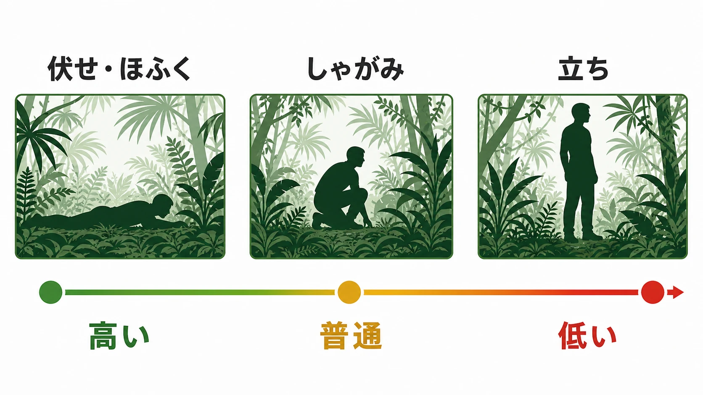
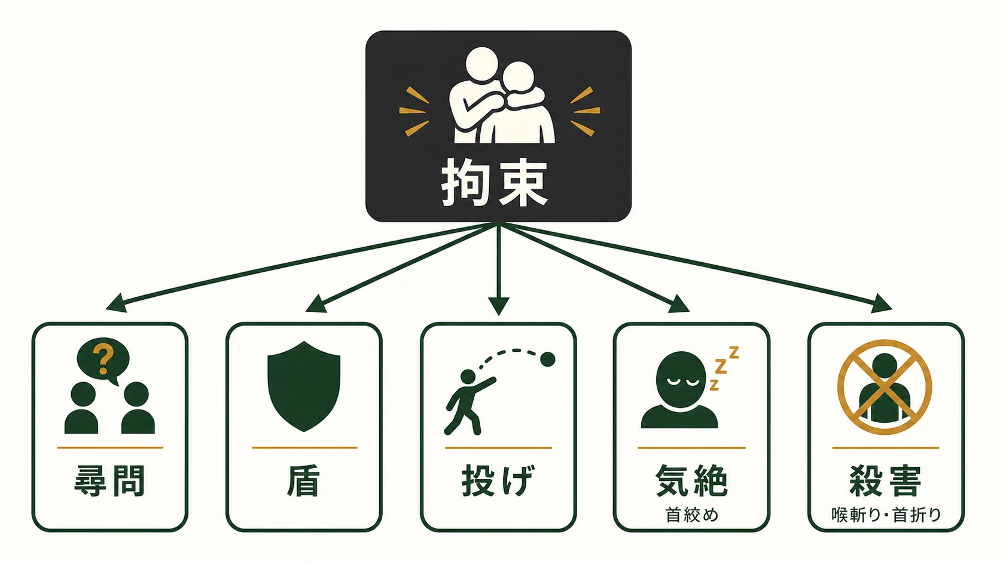
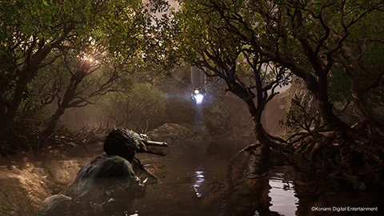
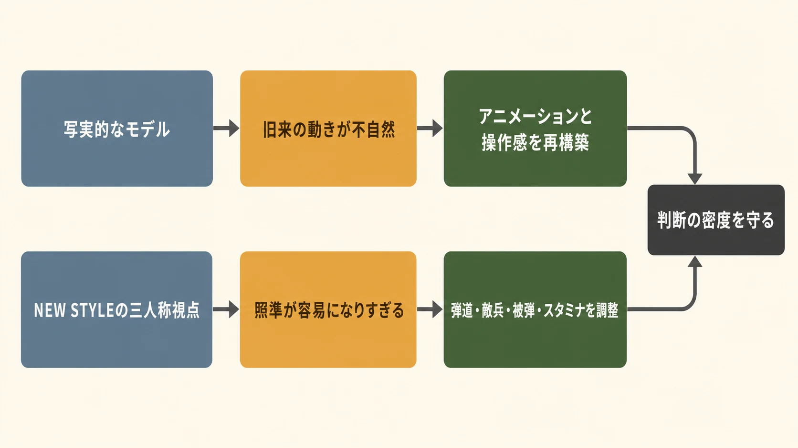

# 『METAL GEAR SOLID 3』は「サバイバル」をどう数値と操作へ翻訳したか――『METAL GEAR SOLID Δ』に学ぶ、変えないための変更

***

## はじめに：テーマは、台詞より先に反復行為へ現れる

「サバイバル」を題材にするゲームは、密林、空腹、傷、孤立といった記号を置くだけでも成立する。しかし、プレイヤーが毎分のように行う判断が従来のステルスアクションと同じなら、その題材は背景にとどまる。

2004年12月16日にPlayStation 2向けに発売されたコナミの『METAL GEAR SOLID 3 SNAKE EATER』は、冷戦下のジャングルを舞台に、迷彩、食料、治療を一つの資源管理ループへ組み込んだ。コナミ自身も、この三要素を「新しいステルスゲーム」への挑戦として位置付けている[[1](#ref-1)]。本稿の焦点は懐古ではない。抽象的な主題を、観測可能な値と繰り返す操作へ落とす方法を読むことである。

後半では、2025年8月28日にPlayStation 5で発売されたリメイク版『METAL GEAR SOLID Δ: SNAKE EATER』を扱う[[2](#ref-2)]。ここで重要なのは、新旧の機能数を比べることではない。視点と操作を更新すると、なぜ原作の緊張が崩れるのか。そこを補うために、何を変えなければならなかったのか。この問いは、既存体験を現代化するすべてのプランニングに通じる。

***

## 1. ジャングルを背景ではなく、毎秒参照する数値へ変える

『METAL GEAR SOLID 3』のジャングルは、視覚的な舞台であると同時に、ステルスの成否を計算する入力である。プレイヤーは迷彩服とフェイスペイントを切り替え、環境にどれほど溶け込んでいるかを「カムフラージュ率」で読む。率が高いほど発見されにくい。さらに、静止と匍匐は高く、立ち・走りは低くなるため、同じ服装でも姿勢と移動を変えれば結果が変わる[[3](#ref-3)]。

この数値は、単なる装備の相性表ではない。草地に入ったら何色の服を着るか、敵が近いところで進むか待つか、短い区間を走って突破するかを、そのつど問う。空間の見た目を「今の自分はどれだけ露出しているか」という判断可能な状態へ変換しているのである。

プランナーにとっての要点は、主題を一つの巨大なメーターに押し込まないことだ。カムフラージュ率は、環境、装備、姿勢、行動を接続する中間指標である。どの入力を変えれば何が改善するかが見え、しかも改善のためにプレイ姿勢そのものを変えさせる。この可読性と行為への接続が、「ジャングルにいる」ことをプレイにする。

***

## 2. 食べる・治す・隠れるを、相互に影響する生存ループにする

迷彩だけでは、潜入は依然として視認判定の問題に留まる。『METAL GEAR SOLID 3』はスタミナと治療を重ねることで、潜入の失敗と回復を資源判断へつないだ。

### スタミナは、体力の予備ではなく潜入能力の条件である

スタミナが減ると、LIFEの自然回復が遅くなり、主観照準時の手ぶれ、酸素ゲージ、握力ゲージにも影響する[[4](#ref-4)]。つまり空腹は「後で回復すればよいHPの不足」ではない。照準、移動経路、水中通過、ぶら下がりを含む潜入の選択肢を、徐々に狭める。

食料は現地で捕獲・採取する。通常攻撃で得た動物は生肉として携行できるが、一定時間で腐る。一方、麻酔銃やネズミ捕りで生け捕りにすれば腐らない[[5](#ref-5)]。ここには小さくても重要な時間軸がある。「今すぐ食べる量」を確保するだけでなく、危険な敵地の前に安定した食料を残すか、捕獲のための手間と装備枠を払うかを選ぶことになる。腐敗した食料は腹痛を招き、治療資源の消費にもつながる[[6](#ref-6)]。

### キュアは、被弾を一回の減算で終わらせない

重傷や毒・病気は、LIFEの回復やスタミナに継続的な影響を及ぼす。サバイバルビュアーのCUREでは、薬物治療と外科治療を症状に応じて使い分ける。公式オンラインマニュアルは、たとえば毒蛇には血清、毒物には解毒剤、骨折には固定具、切創には縫合セット、火傷には軟膏、銃創や切創には消毒薬・止血材・包帯、銃弾や矢の摘出にはサバイバルナイフを挙げている[[7](#ref-7)]。

ここでプレイヤーは「ダメージを受けた」ではなく、「何を受け、どの患部に、どの手順で対処するか」を読む。治療しても即座にLIFEそのものが戻るわけではないため、安易な被弾を許す回復ボタンにもなりにくい[[6](#ref-6)]。食料、治療品、迷彩、そして敵を避ける行動は別メニューに見えて、いずれも次の危険地帯で選択肢を残すための投資である。

この連鎖は、テーマを数値へ翻訳する際のよい手本になる。

| 主題上の要請 | システム上の状態 | プレイヤーが行う判断 | 体験として残ること |
| --- | --- | --- | --- |
| 自然に紛れる | カムフラージュ率 | 装備・姿勢・移動速度を選ぶ | 環境を読む |
| 生き延びる | スタミナと食料の状態 | 捕獲方法と消費の時機を選ぶ | 先を見越す |
| 傷を抱えて進む | 重傷・毒・病気と治療品 | 症状を診て処置を組み合わせる | 失敗を引き受ける |

主題を強くするのは、項目数の多さではない。各状態が別の判断を変え、放置にも対処にも代償があることだ。

***

## 3. CQCは、師弟関係を操作可能な近接距離へ置く

CQC（Close Quarters Combat）は、敵を拘束して尋問、盾、投げ、気絶、殺害へ分岐させる近接戦闘術である[[8](#ref-8)]。敵を倒すためだけの格闘ではない。拘束した相手から情報や物資を引き出し、身体を盾にし、死なせずに通路を空ける。潜入の手段として、近距離の接触を複数の結果へ開いている。

同時にCQCは、ネイキッド・スネークとその師である"ザ・ボス"の関係を、ムービーの説明に閉じ込めない。公式の人物紹介は、スネークがザ・ボスから戦闘・破壊・諜報を学び、二人がCQCをともに編み出したと説明する[[9](#ref-9)]。プレイヤーが敵に近づき、掴み、選択を行うたびに使う技術が、師から受け継いだものとして物語の中に位置付くのである。

これは「物語上の設定を操作へ反映する」際の注意点も示す。師弟という関係を、特別な演出の一回限りの決闘にするのでは弱い。CQCは通常の敵兵相手にも繰り返し使われ、ステルス、情報収集、資源調達と接続される。物語の主題を操作へ移すなら、象徴的な場面だけでなく、日常的な選択にまで届かせる必要がある。

***

## 4. 『METAL GEAR SOLID Δ』が守ったもの：原作の答えではなく、原作の判断密度

『METAL GEAR SOLID Δ: SNAKE EATER』で『METAL GEAR』シリーズ制作プロデューサーを務める岡村憲明は、現代に「20年前のゲームを、あのときのまま送り届けたい」という思いから始めたと語る。オープンワールド化、マップ遷移の廃止、レベルデザインの追加といった流行を採らなかったのは、原作のシナリオ、ゲームデザイン、レベルデザインに自信があるためだという[[10](#ref-10)]。

この方針は、変化を拒むことと同義ではない。岡村は、全く変えずに現代のハードで遊べるようにする役割を『METAL GEAR SOLID: MASTER COLLECTION』に置く一方、Δにはグラフィックと操作性を更新した入口を担わせた[[10](#ref-10)]。同じ作品群を残すにも、保存と再解釈を一つの製品で曖昧に両立させようとせず、役割を分けたのである。

そのためΔでは、物語、キャラクター、ボイス、ゲームプレー、音楽を原作の魅力として保ちつつ、映像表現と操作を刷新する方針が公式に示された[[2](#ref-2)]。カットシーンも、物語の順序や声の演技を新たに書き換えるのではなく、キャラクターと背景を現代の表現で再構築する対象になる。マップを連結して別種の探索ゲームにしなかった判断も、ジャングルで迷彩・食料・治療を見繕いながら区画を進む、原作の判断のまとまりを保つための線引きとして読める。

*画像出典（引用）：KONAMI, [『METAL GEAR SOLID Δ: SNAKE EATER』新キービジュアル&新トレーラーを公開！](https://www.konami.com/games/corporate/ja/news/topics/20240611/), 2024年6月11日掲載。WebP変換。*

***

## 5. 「変えないための変更」：映像と視点が、難易度を動かしてしまう

忠実なリメイクで最も危険なのは、見た目だけを新しくして、体験が同じだとみなすことだ。岡村は当初、グラフィックを新しくすればプログラムは同じでよいと考えた。しかしモデルだけを更新した試作は、画面は良くなってもキャラクターが「お人形のように」見えたという。『METAL GEAR SOLID Δ: SNAKE EATER』のクリエイティブプロデューサーである是角有二は、当時のメモリ制約下で左右反転や合成を用いていたアニメーションを、写実的なモデルにそのまま適用すれば違和感が出ると説明し、アニメーションと操作感を作り直した[[10](#ref-10)]。

ここで得られる教訓は、表現技術の更新が入力と時間感覚を変えることだ。アニメーションを増やせば見栄えはよくなるが、「少しだけ前へ出る」といった潜入で重要な小移動の反応が鈍るおそれがある。Δのチームは、原作の操作感を保ちながら、現代的な動きを成立させる試行錯誤を行った[[10](#ref-10)]。再現対象はアセットではなく、操作から結果までの因果の速さである。

さらに、新しい三人称視点のNEW STYLEは、前方の情報量を増やし、射撃を容易にする。原作で最初から持つ麻酔銃は狙った場所へまっすぐ飛ぶ仕様だったが、そのままではNEW STYLEで簡単すぎ、緊張感を失う。そこでΔは、距離に応じて弾が落下するようにし、敵兵の視力、被弾時のペナルティ、スタミナの減り方も調整した[[10](#ref-10)]。

これは原作の数値を変えたというより、変更された視界と照準が生む有利さを相殺する調整である。次のように整理できる。

| 更新した要素 | そのままでは起きる体験の変化 | 補償的な調整 | 守ろうとしたもの |
| --- | --- | --- | --- |
| 写実的なモデル | 旧来の簡略化アニメーションが不自然に見える | アニメーションと操作感を再構築する | 潜入の小さな移動の手触り |
| NEW STYLEの三人称視点 | 前方情報と照準精度が上がり、麻酔銃が容易になりすぎる | 弾道落下、敵兵の視力、被弾ペナルティ、スタミナ消費を調整する | 発見されないために考える緊張 |

「変えない」は仕様の一字一句を固定することではない。プレイヤーの知覚と入力が変わったなら、同じ数値は同じ意味を持たない。守るべきものを、原作の画面構成ではなく、迷彩を読み、危険を避け、資源をやりくりする判断の密度と定義したからこそ、補償的な変更が必要になった。

***

## おわりに：テーマからパラメータへ、更新から補償へ

新人プランナーがこの事例から持ち帰るべき問いは二つある。

第一に、作品の抽象的な主題を、何の状態値へ置くか。その値は、装備、地形、姿勢、時間、消費資源のどれと結び付くか。『METAL GEAR SOLID 3』は「サバイバル」を、雰囲気ではなくカムフラージュ率、スタミナ、食料の鮮度、傷と治療品の対応として置いた。だからプレイヤーは、説明を読むのではなく、潜入のたびにサバイバルを実行する。

第二に、操作方式や表現を更新するとき、何が不用意に簡単・難しくなるか。視点が広がる、照準が合わせやすくなる、アニメーションが長くなる。個々の変更は改善に見えても、原作の緊張、移動の精度、資源判断の必要性を崩しうる。Δの弾道・敵兵・スタミナの調整は、更新を加える判断と、体験を保つ補償を同じ仕様書で扱う必要を示している。

テーマをパラメータへ翻訳し、パラメータの意味が入力環境の変化でずれたら補正する。この往復を設計できれば、作品を新しくしても、作品がプレイヤーに要求する思考を残せる。

## References

1. [METAL GEAR 25th ANNIVERSARY 「メタルギアソリッドの真実」][1] - オリジナル版の発売日、コンセプト「サバイバル」、カムフラージュ・キュア・フードキャプチャーの三位一体の設計を確認した。

2. [『METAL GEAR SOLID Δ: SNAKE EATER』8月28日に発売決定！本日から予約受付を開始！！][2] - Δの発売日、対応機種、原作から保つ要素と更新する映像・操作性の公式説明を確認した。

3. [METAL GEAR SOLID 3 SNAKE EATER (MASTER COLLECTION版) - オンラインマニュアル：カムフラージュ][3] - カムフラージュ率、服装・フェイスペイント、姿勢・移動による偽装効果の変化を確認した。

4. [METAL GEAR SOLID 3 SNAKE EATER (MASTER COLLECTION版) - オンラインマニュアル：画面説明][4] - スタミナがLIFE自然回復、手ぶれ、酸素、握力に与える影響を確認した。

5. [METAL GEAR SOLID 3 SNAKE EATER (MASTER COLLECTION版) - オンラインマニュアル：フードキャプチャー][5] - 通常捕獲した生肉の腐敗、生け捕りにした動物が腐らない仕様を確認した。

6. [METAL GEAR SOLID 3 SNAKE EATER (MASTER COLLECTION版) - オンラインマニュアル：サバイバルビュアー][6] - 食料の状態、腐敗の影響、重傷・治療の仕様、薬物治療と外科治療を確認した。

7. [METAL GEAR SOLID 3 SNAKE EATER (MASTER COLLECTION版) - オンラインマニュアル：治療関連一覧][7] - 血清、解毒剤、固定具、縫合セット、包帯、軟膏、消毒薬、止血材などの用途を確認した。

8. [METAL GEAR SOLID 3 SNAKE EATER (MASTER COLLECTION版) - オンラインマニュアル：基本操作][8] - CQCによる拘束、尋問、盾、投げ、気絶、殺害などの選択肢を確認した。

9. [HISTORY - METAL GEAR SOLID 3 SNAKE EATER｜METAL GEAR PORTAL SITE][9] - ネイキッド・スネークとザ・ボスがCQCをともに編み出したという公式設定を確認した。

10. [『METAL GEAR SOLID Δ: SNAKE EATER』開発インタビュー！ シリーズを後世に残す使命感と原作再現へのこだわり][10] - 岡村憲明による忠実な原作再現、オープンワールド化・レベルデザイン追加を行わない方針、MASTER COLLECTIONとの役割分担、モデルだけの更新で生じた違和感とアニメーション・操作感の再構築、NEW STYLEに伴う弾道・敵兵の視力・被弾ペナルティ・スタミナ消費の調整を確認した。

[1]: https://www.konami.com/mg/archive/mg25th/truth/mgs3.html
[2]: https://www.konami.com/games/corporate/ja/news/topics/20250213/
[3]: https://metalgear.konami.net/manual/mc1/mgs3/pc/ja/page16.html
[4]: https://metalgear.konami.net/manual/mc1/mgs3/pc/ja/page12.html
[5]: https://metalgear.konami.net/manual/mc1/mgs3/pc/ja/page11.html
[6]: https://metalgear.konami.net/manual/mc1/mgs3/pc/ja/page15.html
[7]: https://metalgear.konami.net/manual/mc1/mgs3/pc/ja/page23.html
[8]: https://metalgear.konami.net/manual/mc1/mgs3/pc/ja/page05.html
[9]: https://www.konami.com/mg/history/jp/ja/mgs3
[10]: https://blog.ja.playstation.com/2025/08/22/20250822-mgsse-2/

----

この文書は、Perplexity、Claude、OpenAI Codex の3つのAIの支援を受けて著述されたものです。引用画像を除き、MIT License にて提供されています。
