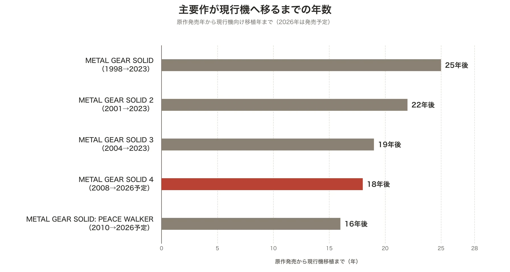
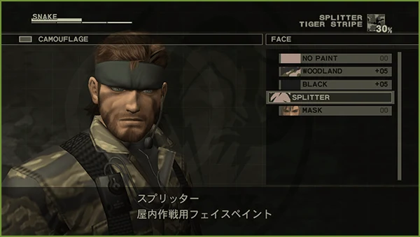
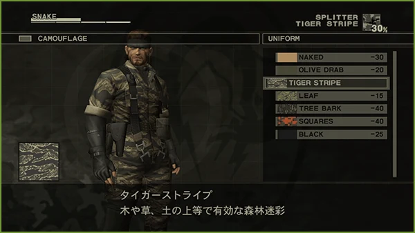
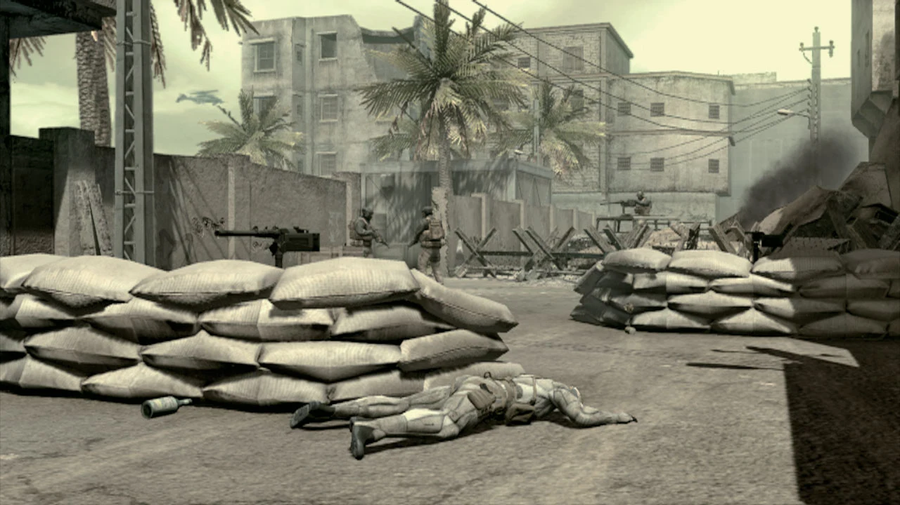

# 『METAL GEAR SOLID 4』のオクトカムは何を自動化したのか――迷彩と長大なカットシーンから読む、プレイヤーの裁量の設計

***

## はじめに：PS3に閉じていた最終章を、いま設計として読み直す

2026年2月13日の「State of Play」で発表された『METAL GEAR SOLID: MASTER COLLECTION Vol.2』は、PlayStation 5、Xbox Series X｜S、Nintendo Switch、Nintendo Switch 2、Steam向けに8月27日発売予定である[[1](#ref-1)]。収録作の一つである『METAL GEAR SOLID 4 GUNS OF THE PATRIOTS』は、2008年6月12日にPlayStation 3向けに発売された[[2](#ref-2)]。長くPS3という一つのハードに結び付いていた作品が、18年ぶりに現行プラットフォームとPCへ移る。

*図：原作発売年から現行機向け移植年までの期間。2026年の2作は発売予定。*

これは単なる移植の話題ではない。『METAL GEAR SOLID 4』は、ステルスアクションがプレイヤーに委ねてきた仕事を、どこまでシステムと演出が引き受けられるかを試した作品である。とりわけ、スネークのスーツに備わる「オクトカム」は、前作『METAL GEAR SOLID 3 SNAKE EATER』で頻繁に要求された迷彩選択を自動化した。プレイヤーは装備画面を開く回数を減らし、戦場を連続した場所として移動できるようになる。

だが、自動化は常に純粋な改善ではない。選択を省くことは、選択で見せていた知識や熟達の余地も省く。本稿では既存記事で扱った『METAL GEAR SOLID 3』のサバイバル機構やリメイクの詳細には踏み込まず、迷彩の扱いだけを比較の起点にする。そのうえで、オクトカムと長大なカットシーンを、どちらも「プレイヤーの裁量を誰が持つか」という問いから読む。

***

## 1. 『METAL GEAR SOLID 3』の迷彩は、環境を読む小さな問題集だった

『METAL GEAR SOLID 3』のカムフラージュ率は、服装、フェイスペイント、地面や背景、姿勢、移動の仕方によって変わる。高い率を保てば敵から発見されにくく、プレイヤーはサバイバルビュアーのメニューで迷彩服とフェイスペイントを選び直す[[3](#ref-3)]。

この仕組みで重要なのは、数値そのものよりも、その数値に至る手順である。草地から岩場へ移れば、プレイヤーは周囲の色と模様を見て、現在のカムフラージュ率を確認し、装備を替えるか、姿勢で補うかを判断する。適切な組み合わせを知っていること、必要になる前に替えること、面倒でも高い率を維持することが、潜入の上手さとして現れる。

もちろん、これは常に楽しい摩擦ではない。短い区画を越えるたびに同じメニュー操作を求めれば、地形を読む行為よりも、既知の正解を反復入力する行為が前に出る。『METAL GEAR SOLID 4』はこの反復を、メニューの改善ではなく、迷彩の責任者を交代させることで解いた。

| 観点 | 『METAL GEAR SOLID 3』の手動迷彩 | 『METAL GEAR SOLID 4』のオクトカム |
| --- | --- | --- |
| 環境への適応 | 服装とフェイスペイントをメニューで選ぶ | 接触した面の見た目に合わせてスーツが追従する |
| 主な入力 | 装備を選ぶ、率を確認する、姿勢を変える | 壁へ張り付く、伏せる、位置と姿勢を選ぶ |
| 熟達が現れる場所 | 組み合わせの知識、先回りした装備変更 | 見つかりにくい面と姿勢を選ぶ位置取り |
| 失敗の主な理由 | 迷彩の選択を誤る、替えるのが遅い | 遮蔽物や時間の取り方を誤る、動き続ける |

表が示すように、後者でもステルスの判断が消えたわけではない。判断の中心が「どの柄を着るか」から「どこで、どの姿勢を取るか」へ移ったのである。

*画像出典（引用）：KONAMI, [『METAL GEAR SOLID 3 SNAKE EATER』（MASTER COLLECTION版）オンラインマニュアル：サバイバルビュアー](https://metalgear.konami.net/manual/mc1/mgs3/pc/ja/page15.html)。フェイスペイントと迷彩服の選択画面を、説明のためにそのまま引用。WebP変換。*

***

## 2. オクトカムは、装備選択を消して位置取りを残す

オクトカムは、スネークが壁に張り付く、あるいは地面に伏せると、接触面のパターンや質感をスーツの外観へ反映する迷彩である。2026年の公式紹介も、これを「状況に合わせたカムフラージュを瞬時にする」装備として説明している[[4](#ref-4)]。プレイヤーは素材の選択肢を一覧から探す代わりに、壁・床・遮蔽物へ身体を置く。環境の情報は、メニューで解読して装備へ転記するものから、身体を接触させることで得るものへ変わった。

自動追従には条件がある。△ボタンや×ボタンで壁や地面に張り付いて静止すると、約1秒でその場のパターンへ切り替わる[[5](#ref-5)][[6](#ref-6)]。ここでオクトカムは、完全な不可視化ではなく、特定の姿勢を報いる仕組みとして理解できる。開けた場所を走り抜ける操作まで自動で正解にするのではない。

*画像出典（引用）：GAME Watch, [PS3ゲームレビュー「METAL GEAR SOLID 4 GUNS OF THE PATRIOTS」][5]（2008年6月25日、福田柵太郎）。記事中の「オクトカムを使用し、戦場の死体にまぎれるスネークの図」を、説明のためにそのまま引用。WebP変換。*

### 得たもの：潜入のテンポと、身体で環境を読む感覚

第一に、オクトカムは操作のリズムを守る。敵の視線を避けて壁に滑り込み、その場で迷彩が馴染む。服を替えるために時間を止めなくても、遮蔽物へ到達するというステルス本来の行為が、そのまま迷彩への入力になる。

第二に、環境との関係を視覚的に直接化する。メニューの「この服は砂地向けである」という記号を経由せず、砂地に伏せたスーツが砂の色へ変わる。これは理解の量を減らすだけではない。プレイヤーの行為と画面上の変化を近づけ、「自分がそこに身を伏せたから隠れられた」という因果を強める。迷彩率という抽象値を完全には捨てずとも、その原因を身体の位置として見せられる。

第三に、戦場の密度に対応する。『METAL GEAR SOLID 4』の舞台は、自然環境を区画ごとに読む『METAL GEAR SOLID 3』とは異なり、PMC（民間軍事請負企業）がぶつかる市街地や戦場を含む。敵同士の戦闘、民間人、車両、瓦礫が同時に存在する場で、服装の選択だけに注意を奪われなければ、敵の交戦状態、経路、遮蔽物の変化へ視線を回せる。オクトカムは難易度を下げるためだけでなく、プレイヤーの注意予算を、作品が新たに見せたい戦場の情報へ配分し直す装置でもある。

### 失ったもの：迷彩を「解く」熟達の可視性

一方で、オクトカムは迷彩選択を通じた熟達の一部を薄くする。『METAL GEAR SOLID 3』では、地面の見え方から服とペイントを選び、率を高めるという小さな最適化が、プレイヤーごとの差になった。知識を持つ人は早く正解へ達し、慎重な人は遠回りしても高い率を作れた。

オクトカムでは、その最適化の多くがスーツ側で処理される。プレイヤーは「迷彩を選べた」ことよりも「よい場所に伏せられた」ことで報われる。これは選択肢がゼロになることではないが、選択の種類を減らすことではある。自動化を評価するなら、「手数が減ったか」だけでなく、どの種類の上達が画面から見えなくなったかを数える必要がある。

プランナーがここから学べるのは、自動化の単位を細かく定めることだ。オクトカムは発見されないという結果を自動化していない。柄を選ぶ作業だけを引き取り、遮蔽物を探し、接触を保ち、移動のタイミングを読む仕事はプレイヤーに残している。自動化の後も残す判断が、作品の核を担えるかを先に決めるべきである。

***

## 3. 同じ設計は、カットシーンで誰が情報を編集するかにも現れる

オクトカムが環境情報の処理をスーツへ任せるなら、カットシーンは物語情報の編集を作品側へ任せる。プレイヤーは歩き、隠れ、戦うことで出来事の順番を多少変えられても、人物の表情、台詞の間、説明の優先順位を組み立てる役ではない。演出がそれらを選び、一定の速度で届ける。

『METAL GEAR SOLID 4』には、27分の単一カットシーンがある。ギネス世界記録はこれをゲーム内の最長のノンインタラクティブ映像として認定している。終盤には、複数のカットシーンを合わせて71分となる連なりもあるが、これは「単一」の記録ではない[[7](#ref-7)]。この二つを混同しないことは、尺を設計として読むための出発点になる。27分という一続きの時間は、受け手の解釈や操作による切断より、作り手が定めた順序と感情の推移を優先する時間である。

小島秀夫監督は2008年8月のインタビューで、ゲームプレイが基本だとしたうえで、『METAL GEAR SOLID 4』では「すべてをカットシーンに詰め込んだ。それはある程度後悔している」と述べた趣旨の発言をしている。また、物語とドラマをより感情的に伝えながら、インタラクティブにする方法を考え続けているとも語った[[8](#ref-8)]。これは長い映像そのものの否定ではない。情報と感情を最も確実に届ける容器へ集めた結果、ゲームとして残すべき受け渡し方を再検討する、という自己点検である。

### 作家性は、裁量を奪うことではなく、裁量の境界を設計すること

オクトカムとカットシーンは、規模も機能も違う。それでも両者には、プレイヤーが毎回行う判断の一部を、システムや作り手が引き取るという共通点がある。

| 対象 | 引き取る主体 | 引き取る仕事 | プレイヤーに残る仕事 |
| --- | --- | --- | --- |
| オクトカム | スーツの自動追従 | 迷彩柄・質感の照合と切り替え | 安全な面を探す、姿勢を保つ、移動を決める |
| カットシーン | 演出と脚本 | 台詞、画、編集、感情の順序 | 受け取る、次の操作で物語を引き受ける |

この表から直ちに「両者は同じだから、カットシーンは悪い」とは言えない。自動化は、余った注意を別の判断へ回すための手段である。オクトカムでは、装備メニューに使う注意を戦場観察へ回した。カットシーンでは、説明を自分で収集・接続する注意を減らし、特定の人物関係や結末を強く受け取らせる。その選択は、シリーズの最終章として膨大な人物と設定を回収する『METAL GEAR SOLID 4』の目的と整合している。

ただし、引き取る量が大きいほど、プレイヤーは自分の行為で意味を組み立てる余地を失う。オクトカムが迷彩の知識を薄くするように、長大なカットシーンは、探索、選択、失敗、再試行から感情へ至る経路を短くしうる。問題は作家性の有無ではなく、何分間、何種類の意思決定を誰が保持するかである。

***

## コラム：PMCという戦場経済を、武器の使用許可と売買にする

『METAL GEAR SOLID 4』の戦場は、PMCが台頭し、戦争が経済を動かすものになった時代として設定される[[4](#ref-4)]。この大きな設定は背景説明にとどまらない。武器の扱いを、SOP（Sons of the Patriots）によるID管理と、ドレビン893による解除・流通の仕組みへ落とし込んでいる。

SOPは兵士と武器をネットワーク化し、IDが合わない武器を使いにくくする統制の仕組みである。プレイヤーは戦場で拾った武器を、ただの戦利品として即座に自由に扱うのではなく、ドレビンに解除してもらう。ドレビンは武器や弾薬、部品を扱う商人でもあり、プレイヤーは敵の武器や装備を売却して得たドレビンポイントを、購入と解除に回す[[5](#ref-5)][[6](#ref-6)]。

ここで武器は、火力だけでなく、認証、流通、価格を持つ商品になる。拾う、売る、解除する、買うという操作は、戦場の外にある市場をプレイへ接続する。戦争を経済として描くなら、台詞で「市場がある」と説明するだけでは足りない。装備の入手と使用のあいだに、所有権や認証の手続きを置くことで、プレイヤーの選択に市場の存在を感じさせられる。

発売当時、イラクで活動する民間警備請負業者をめぐって、監督、調整、法的説明責任が公的な検討課題となっていた。米政府監査院の2008年報告も、イラクにおける民間警備請負業者の監督と法的責任を検討対象にしている[[9](#ref-9)]。『METAL GEAR SOLID 4』のPMCは、こうした同時代の「暴力を誰が所有し、誰が接続し、誰が利益を得るのか」という問いを、誇張された戦場経済として扱うフィクションである。特定の実在企業を意図的に参照したという断定は、本稿では行わない。

***

## まとめ：快適さを得る前に、削る判断を名前で呼ぶ

『METAL GEAR SOLID 4』のオクトカムは、手動迷彩の煩雑さを取り除いた。しかし削ったのはボタン操作だけではない。服とフェイスペイントの組み合わせを解き、率を詰めるという熟達の一部である。その代わりに、遮蔽物へ身を寄せ、戦場の変化を読み、次の移動を決める判断へ注意を集めた。

カットシーンにも同じ問いを向けられる。長い尺は、物語の情報と感情を強く、順序立てて渡せる。その代わりに、プレイヤーが探索や操作を通じて自分なりのテンポで意味をつなぐ余地を減らす。小島監督の2008年の振り返りは、作り手が情報を多く持つほど、それをどの容器へ置くかを厳しく選ばなければならないことを示している。

プランナーが自動化や演出を設計するときは、快適になるかだけを問わないほうがよい。次の三つを仕様書に書ける状態にする。

1. 自動化するのは、反復入力、知識の照合、経路選択、結果判定のどれか。
2. その自動化によって、プレイヤーの注意をどの判断へ移すのか。
3. 失われる熟達や解釈の余地を、作品として許容できるのか。

『METAL GEAR SOLID 4』は、すべての選択をプレイヤーに残すことがインタラクティブ性ではないと示す。同時に、システムと作家が選択を引き取るほど、「何を残したか」を明確にしなければならないことも示している。オクトカムの快適さと27分のカットシーンは、その境界線を考えるための、性質の異なる二つの教材である。

## References

1. [『METAL GEAR SOLID: MASTER COLLECTION Vol.2』8月27日に発売決定、本日から予約開始！][1] - 対応プラットフォームと発売日を確認した。

2. [PLAYSTATION 3 METAL GEAR SOLID 4 GUNS OF THE PATRIOTS WELCOME BOX with DUALSHOCK 3][2] - MGS4がPS3向けに2008年6月12日発売であることを、ソニー・インタラクティブエンタテインメントの当時の発表で確認した。

3. [METAL GEAR SOLID 3 SNAKE EATER (MASTER COLLECTION版) - オンラインマニュアル：カムフラージュ][3] - MGS3のカムフラージュ率と、服装・フェイスペイント・姿勢・移動による変化を確認した。

4. [METAL GEAR SOLID: MASTER COLLECTION Vol.2 公式サイト][4] - オクトカムを「状況に合わせたカムフラージュを瞬時にする」装備とする公式の紹介、およびPMC（民間軍事請負企業）の台頭によって戦争がビジネス化した時代という設定を確認した。

5. [PS3ゲームレビュー「METAL GEAR SOLID 4 GUNS OF THE PATRIOTS」][5] - オクトカムの自動発動条件（壁や地面への密着と静止で約1秒後に発動）、およびドレビンによる武器のIDロック解除とドレビンポイントの経済を確認した。

6. [今また「映画のようなゲーム」の是非を問う？「メタルギア ソリッド 4」レビュー][6] - オクトカムの自動発動と、ドレビンによる武器のロンダリング・ドレビンポイントの仕組みを、参照5と併せて確認した。

7. [Longest cutscene in a videogame][7] - MGS4の最長単一カットシーン27分と、終盤の複数カットシーンを合わせた71分の記録上の区別を確認した。

8. [Hideo Kojima: The Kikizo Interview 2008][8] - 小島秀夫監督による、MGS4のカットシーンとインタラクティブな物語表現に関する2008年8月の発言を確認した。

9. [Rebuilding Iraq: DOD and State Department Have Improved Oversight and Coordination of Private Security Contractors in Iraq, but Further Actions Are Needed to Sustain Improvements][9] - 2008年のイラクで、民間警備請負業者の監督、調整、法的責任が公的な検討対象であったことを確認した。

[1]: https://www.konami.com/games/corporate/ja/news/topics/20260213m/
[2]: https://sonyinteractive.com/jp/press-releases/2008/080502b/
[3]: https://metalgear.konami.net/manual/mc1/mgs3/pc/ja/page16.html
[4]: https://www.konami.com/mg/mc2/asia/ja/
[5]: https://game.watch.impress.co.jp/docs/20080625/mgs.htm
[6]: https://www.4gamer.net/games/048/G004886/20080703020/
[7]: https://www.guinnessworldrecords.com/world-records/86547-longest-cutscene-in-a-videogame
[8]: https://games.kikizo.com/features/hideo-kojima-interview-2008-p3.asp
[9]: https://www.gao.gov/products/gao-08-966

----

この文書は、Perplexity、Claude、OpenAI Codex の3つのAIの支援を受けて著述されたものです。引用画像を除き、MIT License にて提供されています。
