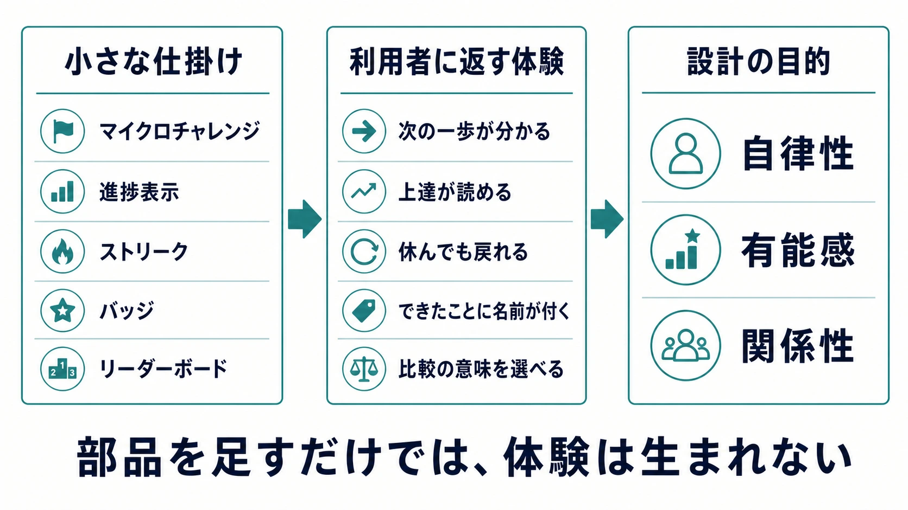
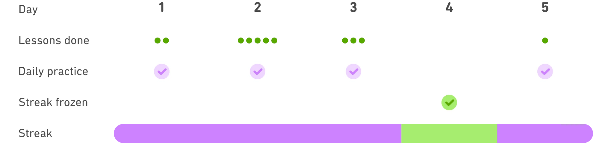
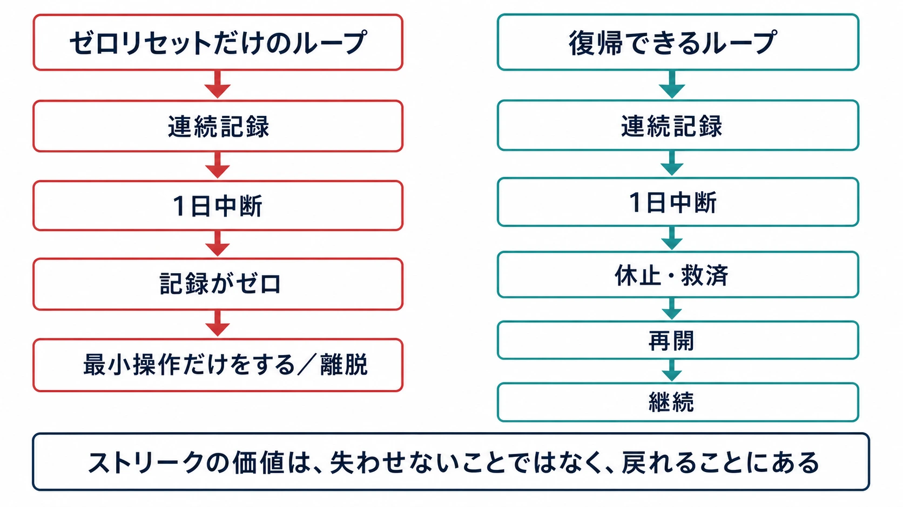

# マイクロゲーミフィケーション

## ゲームデザイン手法の非ゲーム領域への輸出とその限界

*ゲーム開発者の視点から読む、業務・学習・健康行動のための体験設計*

***

## エグゼクティブサマリー

ゲームを面白くする技法は、教育、企業研修、ヘルスケア、業務支援にも使える。ただし移植すべきなのは、ポイントやバッジの見た目ではない。目標の意味、上達の手応え、失敗から戻れる余地、他者との関係を含む体験全体である。

本稿では、既存の業務や生活の導線に、数分で終わる課題、進捗表示、連続記録、協力目標などを埋め込む設計を **マイクロゲーミフィケーション** と呼ぶ。この小ささは強みである。専用の研修画面を開かせず、行動の直後にフィードバックを返せるからだ。一方で、小さいからこそ、設計の雑さも毎日積み重なる。通知、順位、連続記録が「助け」ではなく「監視」になる境目を見誤ってはならない。

ゲームプランナーが持ち帰るべき結論は単純である。人を動かす数値を足す前に、その人が何を上達できるのか、失敗してもなぜ戻りたくなるのかを設計する。ゲームレイヤーは目的を隠す化粧ではなく、目的へ向かう行為を理解しやすく、続けやすくするためのインターフェースである。

***

## はじめに——ゲームの「力」は、そのまま輸出できない

ゲームが人を引きつけるのは、報酬だけがあるからではない。プレイヤーは、自分で選び、試し、失敗し、少し前よりうまくできたことを知る。次の一手に意味があり、結果がすぐ返り、負けてももう一度挑める。この循環が、ゲームの手触りを作っている。

教育や業務の現場が欲しいのも、しばしばこの循環である。必修研修を最後まで受けてもらう。営業担当者に顧客フォローを忘れずに行ってもらう。服薬や運動の記録を続けてもらう。そこで目につきやすいのが、ポイント、バッジ、ランキング、ストリーク（連続記録）だ。

しかし、数字を置いただけで退屈な行為が面白くなるわけではない。むしろ「数字を守ること」が本来の目的を追い出す場合がある。ゲームデザインを非ゲーム領域へ持ち出す仕事は、報酬の発明ではなく、目的と行動の関係を編み直す仕事である。

***

## マイクロゲーミフィケーションとは何か

ここでいうマイクロゲーミフィケーションとは、普段使うツールや日常の行動の中に、短い課題と小さなフィードバックを埋め込む設計である。CRMの画面で次に連絡すべき顧客を一件だけ示す。チャットツールで五分の確認問題を出す。学習アプリで前回のつまずきに一問だけ再挑戦させる。新しい大規模システムを立ち上げるより、既存の仕事の流れに「次の一歩」を差し込む。

ゲーミフィケーションという語は2000年代に現れ、2010年代に教育や業務支援の領域へ急速に広がった。研究分野で広く参照されるのは、セバスチャン・ダーテリングらが2011年に示した「ゲームデザイン要素を非ゲーム文脈で用いること」という定義である。だが、この定義だけでは進捗バー一つまで同列に扱えてしまう。重要なのは要素の数ではなく、ユーザーにどんな行為と感情の循環を生むかである。[[1](#ref-1)]

| 小さな仕掛け | 役割 | 設計上の問い |
| --- | --- | --- |
| マイクロチャレンジ | 次にやる行為を具体化する | 終えたあと、何ができるようになるのか |
| 進捗表示 | 迷いを減らし、前進を可視化する | 数字は学習・成果の代理指標にすぎないことが伝わるか |
| ストリーク | 再訪のきっかけを作る | 一度休んだ人が、羞恥や損失感なしに戻れるか |
| バッジ | 節目を記憶に残す | どの能力・貢献を示すバッジなのか |
| リーダーボード | 比較や協力の焦点を作る | 誰を励まし、誰を置き去りにする設計か |

この表の左側は、ゲームの部品である。右側は、ゲームデザインの仕事である。部品だけを買っても、体験は買えない。

***

## 「ポイント化」が失うもの

ポイント、バッジ、リーダーボードだけを先に置くやり方は、しばしば pointsification（ポイント化）と呼ばれる。この語は、ゲームデザイナーのマーガレット・ロバートソンが2010年に示した批判的な呼び名である。ポイント化は悪そのものではないが、ゲームの豊かな体験を点数と景品へ縮めてしまう危険を指摘している。[[1](#ref-1)]

ゲームでは、ポイントにも文脈がある。敵を倒した経験値は、次に挑める技や場所を開く。タイムアタックの順位は、同じ課題に挑むライバルや自己ベストと結びつく。実績は、普通なら見落とす遊び方に名前を与える。数値は単独で人を動かすのではなく、プレイヤーが自分の行為を読めるようにするための記号として働く。

非ゲーム領域で同じことをするなら、まず「この数字が増えると、利用者にとって何が良くなるのか」を答えられなければならない。受講完了率が上がっても、現場で判断できるようにならなければ研修は勝っていない。営業件数が増えても、顧客との関係を壊せばCRMの数字は嘘をつく。これはゲームのスコア設計でも同じである。スコアが勝ち方を狭めるなら、そのゲームはほどなく作業になる。

***

## 報酬は動機を奪うのか

外的報酬への警戒には根拠がある。Lepper、Greene、Nisbettによる1973年の研究は、もともと絵を描くことに関心を示していた子どもに、報酬をあらかじめ約束する条件を置いたとき、その後の自発的な活動が低下しうることを示した。[[2](#ref-2)]

ただし、ここから「報酬は常に悪い」と結論づけるのは短絡である。報酬は、何をすればよいかを理解させるフィードバックにもなり、行動を外から管理する道具にもなる。違いを分けるために有用なのが、自己決定理論（SDT）の三つの視点――自律性、有能感、関係性――である。[[3](#ref-3)]

| 見るべき欲求 | 体験を育てる設計 | 体験を痩せさせる設計 |
| --- | --- | --- |
| 自律性 | 複数の課題から選べる。通知や連続記録を止められる。 | 毎日同じ時刻に反応を強要し、休むと大きく罰する。 |
| 有能感 | なぜ正解・不正解なのかを返し、次の練習を示す。 | バッジだけを渡し、何が身についたかを示さない。 |
| 関係性 | 協力目標や、小さなチームでの助け合いを作る。 | 全社順位で下位者を可視化し続ける。 |

ゲームプランナーが検討すべきなのは、「報酬を入れるか」ではない。その報酬が、利用者の選択・上達・他者とのつながりを読めるものになっているかである。

***

## リーダーボードは、競争の設計であって表示部品ではない

順位表は強い。上位に届きそうな人には、次の行動を明確にする。チーム対抗なら、声を掛け合う理由にもなる。だが、同じ一枚の順位表を全員に見せれば、能力、投入可能な時間、担当顧客の条件までが一つの序列に圧縮される。

教育におけるリーダーボード研究の系統的レビューも、動機、参加、成績に良い影響を与えうる一方、その有効性は設計に大きく依存すると結論づけている。対象研究の多くが短時間の高等教育で行われており、長期運用の一般化には慎重さも必要である。[[4](#ref-4)]

実務では、公開順位を置く前に次の三点を決めたい。

1. 比較は他者との競争なのか、過去の自分との比較なのか。
2. その順位を下げる要因に、本人がコントロールできない条件が混ざっていないか。
3. 下位になった人に、次の一手と回復の機会があるか。

全体順位が必要な場面もある。しかし多くの業務・学習プロダクトでは、前週の自分、似た目標を持つ小集団、協力して到達する共有目標のほうが、比較を行動へ変えやすい。ここで必要なのは競争を消すことではなく、競争が誰の何を可視化するかを選ぶことである。

***

## ストリークは「失わせない設計」まで含めて完成する

ストリークが魅力的なのは、今日の小さな行為を昨日までの努力へ接続できるからだ。十日続けた記録は、今日の一回を単なるタスクではなく、「自分は続けられる」という物語の一部にする。

だからこそ、連続記録の切断は強い。ゼロリセットを唯一のルールにすると、利用者は学びや健康行動ではなく、炎のアイコンを守るためだけに最小の操作を始める。そこで必要なのは、厳しい連続性を演出することより、休んだあとに戻れる導線である。

Duolingoは、欠席日に連続記録を保護する Streak Freeze を用意し、過去には週末に休める Weekend Amulet をA/Bテストした。公式の報告では、後者を提示した利用者は翌週の復帰率が高く、連続記録を失う割合も低かった。ここから読めるのは、「休めない設計ほど継続する」ではない。休んでも積み上げを無価値にしない設計が、再開を支えうるということである。[[5](#ref-5)]

*画像出典（引用）：[Duolingo Blog『How we protect learner streaks from site issues』](https://blog.duolingo.com/protecting-streaks-from-site-issues/)／Streak Freezeによる連続記録の保護例として引用。WebP変換。*

よく聞く「習慣は21日で身につく」という目安は、習慣形成を測った研究から出たものではない。形成外科医マクスウェル・マルツが『Psycho-Cybernetics』で、整形後の外見への慣れや幻肢の観察をもとに、心的イメージが変化するまでには最低でもおよそ21日を要すると述べたことに由来する。[[6](#ref-6)] 日常行動を追った研究では、自動化の進み方には大きな個人差があり、推定値は18日から254日に及んだ。また、一回の取りこぼしは習慣形成の過程を大きく損なわなかった。ストリークを設計するなら、連続日数を神聖化するより、戻る行為を成功として数えるべきである。[[7](#ref-7)]

***

## 高い目的を、ゲームレイヤーで覆い隠さない

服薬、セキュリティ教育、コンプライアンス研修、オンボーディングは、ゲーミフィケーションを検討しやすい領域である。いずれも「やるべきこと」は明確だが、毎回の行為から得られる手応えが弱い。小さな課題、実行直後の確認、進捗の可視化は、最初の一歩を軽くできる。

しかし、設計者はここで二つの誤解を避けたい。第一に、ゲームレイヤーは制度やサービスの欠陥を埋められない。服薬が続かない理由が副作用、費用、受診の困難さにあるなら、バッジでは解決しない。第二に、完了率は成果そのものではない。研修なら現場の判断、健康支援なら本人にとっての安全と生活の質まで見なければならない。

良いマイクロゲーミフィケーションは、利用者を「正しい行動へ押し込む装置」ではない。障害を見つけ、次の行為を小さくし、できたことを意味のある言葉で返す装置である。設計の重心は操作ではなく支援に置く。

***

## 生成AIは、設計の責任を代行しない

生成AIを組み合わせれば、前回の誤答に応じて練習問題を出し分ける、同じ手順を初心者向けと経験者向けに説明し分ける、状況に応じたロールプレイを作る、といったことは容易になる。ゲームの動的難易度調整に似た発想を、学習や業務支援へ持ち込める余地はある。

ただしAIが最適化しやすいのは、クリック数、滞在時間、連続日数のような測りやすい数字である。その数字が利用者の利益とずれていれば、個別化はより精密な圧力になる。教育での生成AI利用について、UNESCOもデータプライバシーの保護と人間中心の統治を求めている。[[8](#ref-8)]

AIを入れる前に、次の順で決めるべきである。

1. 利用者のために改善したい行為・判断は何か。
2. その改善を、完了率以外のどの観察で確かめるか。
3. どのデータを使い、本人は何を拒否・修正・削除できるか。
4. AIの提案が外れたとき、利用者はどこで自分の意図を取り戻せるか。

個別化は、正解を押しつける技術ではない。人ごとに異なる入口と回復経路を用意する技術として使うとき、初めてゲームデザインの味方になる。

***

## ゲームプランナーのための設計レビュー

施策をレビューするときは、PBLを採用したかではなく、次の順で問い直すとよい。

1. **目的は行動の外にあるか。** 数字を増やすことではなく、利用者・顧客・現場にとって改善したい状態を言語化できるか。
2. **最初の一手は十分に小さいか。** 迷いを減らすために、一回目の課題を分解できているか。
3. **フィードバックは意味を返すか。** 「達成した」だけでなく、何を理解し、次に何を試せるのかを示しているか。
4. **失敗は復帰可能か。** 連続記録、順位、提出期限のどれにも、休止・再開・救済の設計があるか。
5. **比較の相手は適切か。** 他者との競争が本当に必要か。自己比較や協力目標のほうが目的に合わないか。
6. **測るものは目的に近いか。** DAUや完了率の先に、実際の判断、行動変容、関係の質を測れているか。

この順番は、ゲーム開発におけるコアループの確認と同じである。プレイヤーに何をさせるかではなく、その行為がどんな理解、上達、次の選択につながるかを先に見る。非ゲーム領域では、利用者が「遊ぶために来た」のではないという違いが加わる。その違いを尊重することが、移植の成否を分ける。

***

## まとめ——輸出すべきなのは、ゲームの表面ではない

マイクロゲーミフィケーションは、小さな行動を続けやすくする有力な設計手法になりうる。だが、毎日の導線に入るからこそ、粗い設計は毎日の負担にもなる。ポイントは目的ではなく、進捗を読むための言葉である。ストリークは罰ではなく、再開を支える約束である。AIは監視の精度ではなく、選択肢と回復経路を増やすために使う。

ゲームから学ぶべきなのは、人を長く画面の前に留める手口ではない。人が自分で選び、試し、失敗し、前よりできるようになったと感じられる条件を、誠実に組み立てる技術である。その技術まで輸出できるなら、ゲームデザインは非ゲーム領域でも十分に力を持つ。

## References

1. [A point with pointsification? clarifying and separating pointsification from gamification in education][1] - ゲーミフィケーションの定義、pointsification の由来、ポイントのみへ還元することの問題を整理した査読論文。

2. [Undermining children's intrinsic interest with extrinsic reward: A test of the "overjustification" hypothesis][2] - 期待された外的報酬と、その後の自発的活動を扱った1973年の研究。

3. [About the Theory — Self-Determination Theory][3] - 自律性、有能感、関係性を基本的心理欲求として説明する理論の公式解説。

4. [The Use of Leaderboards in Education: A Systematic Review of Empirical Evidence in Higher Education][4] - 高等教育におけるリーダーボードの実証研究を系統的に整理したレビュー。

5. [How streaks keep Duolingo learners committed to their language goals][5] - Weekend Amulet のA/Bテストを含む、Duolingoによるストリーク設計の公式報告。

6. [Psycho-Cybernetics][6] - マクスウェル・マルツが、整形後の外見への慣れや幻肢などを例に「約21日」という最短期間に言及した自己啓発書。

7. [How are habits formed: Modelling habit formation in the real world][7] - 日常行動の反復と自動化を追跡し、習慣形成の時間に大きな個人差があることを示した研究。

8. [Guidance for generative AI in education and research][8] - 教育・研究における生成AI利用について、データプライバシーを含む統治上の論点をまとめたUNESCOの指針。

[1]: https://www.frontiersin.org/journals/education/articles/10.3389/feduc.2023.1212994/full
[2]: https://cir.nii.ac.jp/crid/1362825894041392768
[3]: https://selfdeterminationtheory.org/about-the-theory/
[4]: https://eric.ed.gov/?id=EJ1448426
[5]: https://blog.duolingo.com/how-streaks-keep-duolingo-learners-committed-to-their-language-goals/
[6]: https://books.google.com/books?id=J8dqtO6XqPMC
[7]: https://www.flexyourbrain.com/wp-content/uploads/2015/10/UL-STUDY-66-Days-IJSP_998-1009.pdf
[8]: https://www.unesco.org/en/articles/guidance-generative-ai-education-and-research?hub=343

----

この文書は、Perplexity、Claude、OpenAI Codex の3つのAIの支援を受けて著述されたものです。引用画像を除き、MIT License にて提供されています。
