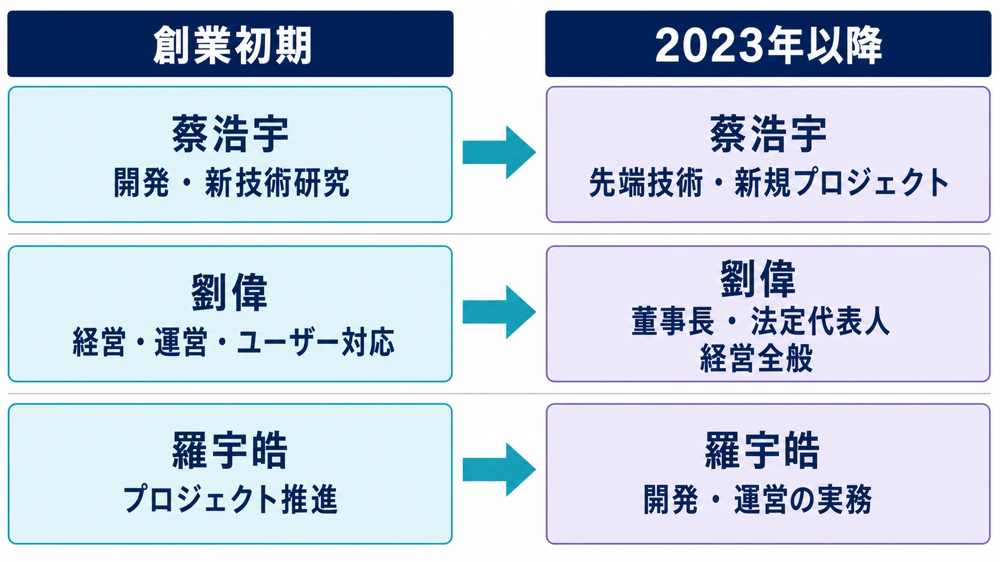
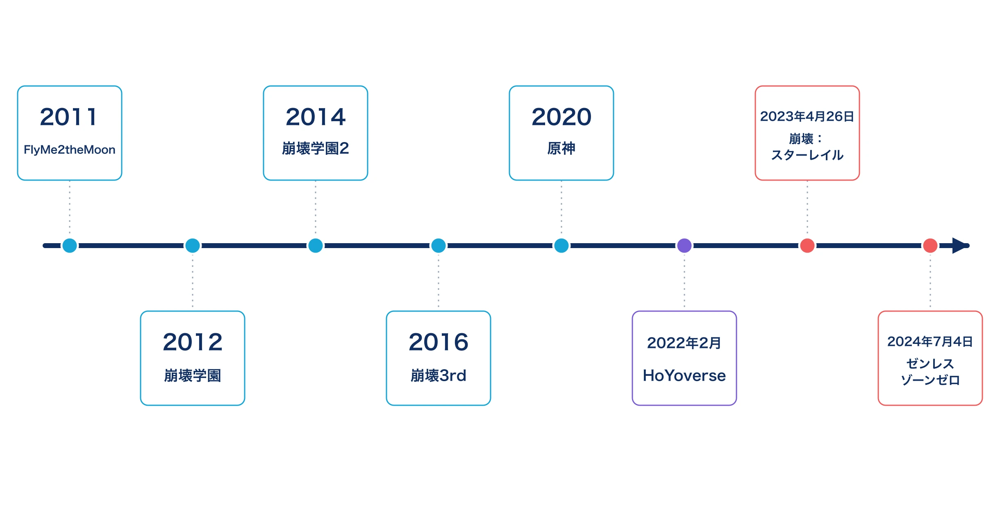
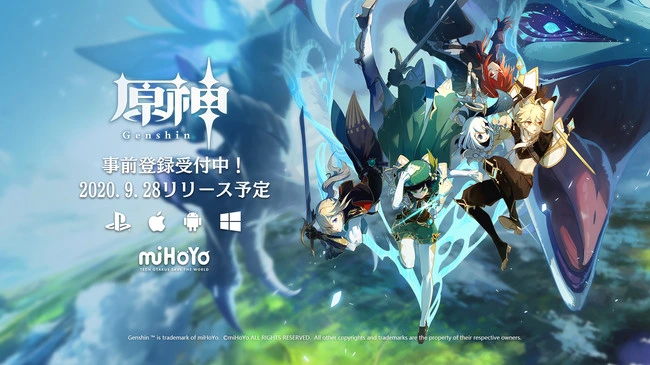
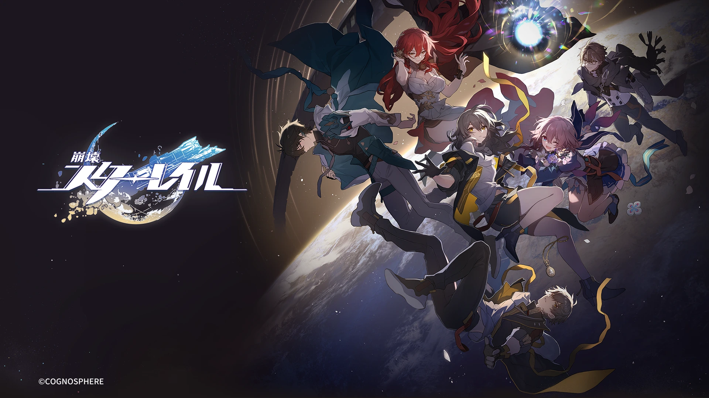
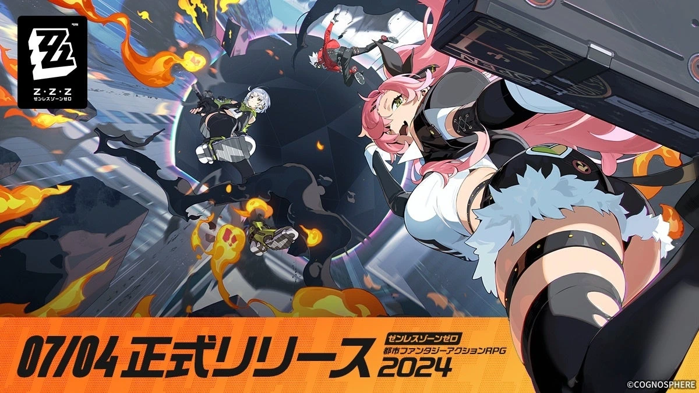

# miHoYo／HoYoverse企業史：創業からグローバル展開まで

## エグゼクティブサマリー

miHoYoは、2011年に上海交通大学の学生たちが始めた小規模な制作活動から出発し、中国本土ではmiHoYoの名で、グローバルではHoYoverseブランドを通じて『崩壊3rd』『原神』『崩壊：スターレイル』『ゼンレスゾーンゼロ』を届ける企業へと発展した。成長を支えたのは、作品ごとにゲームジャンルや表現の中心を更新しながら、長期運営に耐える制作体制を築いたことである。[[1](#ref-1)][[2](#ref-2)]

本稿では、創業から『崩壊』シリーズの成立、『原神』による飛躍、HoYoverseというグローバルブランドの立ち上げまでをたどる。あわせて、シリーズの物語づくりを担うシナリオライター・焼鳥氏と、『ゼンレスゾーンゼロ』の視覚表現をプロデューサーとして率いる李振宇氏を取り上げ、創業者だけでは捉えきれない現在の制作体制を整理する。

***

## 創業の背景と学生時代の制作活動

miHoYoの原点は、上海交通大学で学んだ蔡浩宇、劉偉、羅宇皓らが、技術とアニメ・漫画・ゲーム文化への関心を共有して始めた制作活動にある。劉偉氏は、学生時代に寮で最初のゲームを開発し、2011年に『FlyMe2theMoon』をリリースしたと振り返っている。[[2](#ref-2)]

この出発点は、少人数の学生チームが単発の作品を作ったというだけではない。以後のmiHoYoは、ゲーム本編に加え、アニメーション、音楽、コミック、イベントなどを組み合わせて作品を継続的に育てる。現在の企業サイトが掲げる「Tech Otakus Save the World」という言葉には、技術とファン文化の双方を制作の出発点とする姿勢が表れている。[[1](#ref-1)]

***

## 『FlyMe2theMoon』――原点となる処女作

『FlyMe2theMoon』は、学生時代のチームがiOS向けに送り出した最初のゲームである。後年の大規模な3D作品とは規模も作り方も異なるが、キャラクターを中心に据えたアニメ調の作品を自分たちで形にするという方向性は、この時点ですでに明確だった。[[2](#ref-2)]

この一作を経て、チームは法人としてのmiHoYoを整え、『崩壊学園』へと進む。初期の試行錯誤は、続編を重ねながら世界設定とキャラクターを蓄積する『崩壊』シリーズの基盤になった。

***

## 『崩壊』シリーズ――継続運営と3Dアクションへの転換

### 『崩壊学園』から『崩壊学園2』へ

『崩壊学園』と『崩壊学園2』は、モバイル向けアクションゲームとして『崩壊』のキャラクターと物語を定着させた。個々のアップデートを繰り返しながら、ゲーム内の体験だけでなく、キャラクターを軸にしたコミュニティとの関係も育てていった点が重要である。ここで得た運営の経験は、後のタイトルでコンテンツ量と更新頻度を拡大する足場になった。[[1](#ref-1)]

> **名称に関する補足**
>
> 中国本土で先に配信された初代『崩壊学園』は、中国本土以外には展開されなかった。日本を含む海外市場で『崩壊学園』として配信されたタイトルは、中国本土で『崩壊学園2』と呼ばれる作品である。したがって海外プレイヤーが継続して遊んでいる『崩壊学園』は、シリーズの初代ではなく、中国版『崩壊学園2』に相当する。日本版は現在も公式サイトで更新情報が告知され、運営が続いている。[[17](#ref-17)][[18](#ref-18)]

### 『崩壊3rd』――技術と物語の両輪

2016年に中国で始まった『崩壊3rd』は、スマートフォン向け作品でありながら、3Dアクション、セルルックのキャラクター表現、インゲームと映像演出を接続した物語を前面に出した。日本版は2017年2月16日にサービスを開始している。[[3](#ref-3)]

本作は、miHoYoがアクションの手触りと映像表現を同時に磨く過程であり、以後の大規模なグローバル展開の技術的・組織的な土台にもなった。特に、ライブサービスの長い時間のなかで、キャラクターの成長と物語の区切りをどう成立させるかという課題に、制作チームは正面から向き合うことになる。

### 物語を担う焼鳥――『崩壊3rd』から『崩壊：スターレイル』へ

焼鳥氏は、『崩壊3rd』と『崩壊：スターレイル』に深く携わる『崩壊』シリーズのシナリオライターである。本人の証言では、2016年に大学3年生だった際、インターン先を探すなかでゲーム好き・オタク文化好きという点でmiHoYoと縁があり、『崩壊3rd』の制作に加わったという。[[4](#ref-4)]

『崩壊3rd』では、長期運営作品に必要な「終わりから逆算して物語を組み立てる」考え方を、チームの制作過程のなかで磨いた。焼鳥氏自身も、第1部の終盤に携わった経験を踏まえ、プレイヤーとキャラクターがともに過ごした時間を物語の結末へつなげることを重視すると語っている。[[5](#ref-5)]

『崩壊：スターレイル』では、ピノコニー編とオンパロス編のシナリオ統括を担当した。単独の作家がすべてを書くのではなく、章ごとの担当者がキャラクター、背景、任務の流れ、映像演出まで横断して支える制作体制のなかで、物語全体を統合する役割である。『崩壊3rd』で積み上げた人物ドラマと、より大きなプレイヤー層に向けた長編運営の設計を接続している点に、焼鳥氏の現在の位置づけがある。[[6](#ref-6)][[7](#ref-7)]

なお、「焼鳥」は本人が用いる筆名である。別の筆名を名乗っていた際、その中国語の読みが「焼鳥」と似ていたため、プロデューサーの聞き違いをきっかけに定着したという。本稿では活動名である「焼鳥」を用いる。[[7](#ref-7)]

***

## 『原神』――クロスプラットフォームでの世界的飛躍

2020年にリリースされた『原神』は、オープンワールドの探索、アクション、キャラクター収集、継続的な地域追加を、スマートフォン、PC、PlayStationへまたがる同一サービスとして結びつけた。miHoYoがそれまで『崩壊』シリーズで積み上げたアニメ調の表現、運営型ゲームの更新ノウハウ、多言語展開の経験を、一段大きな規模で統合した作品である。[[8](#ref-8)]

重要なのは、既存の成功をそのまま拡大したのではなく、作品の中心を高速アクションから探索へ移したことである。以後のHoYoverseは、同じ配信・運営の基盤を共有しながらも、作品ごとに異なる遊びと表現を選ぶ方向へ進む。

***

## HoYoverse設立とグローバル展開

2022年2月、miHoYoはグローバル向けブランドとしてHoYoverseを発表した。発表では、ゲーム、アニメ、その他のエンターテインメントを通じて没入感のある仮想世界体験を届けること、モントリオール、ロサンゼルス、シンガポール、東京、ソウルの拠点を通じて制作・研究・パブリッシングを広げることが掲げられた。[[9](#ref-9)]

HoYoverseはmiHoYoを単純に改称したものではない。中国での開発基盤を保ちながら、地域ごとのパブリッシングとコミュニティ運営を行い、世界へ作品を届けるためのブランドである。グローバル展開を、翻訳や販売地域の拡大だけでなく、開発・発信・運営を含む組織の設計として扱った点に特徴がある。

***

## 『崩壊：スターレイル』と『ゼンレスゾーンゼロ』――ジャンルを広げる二つの挑戦

『崩壊：スターレイル』は、2023年4月26日にPC、Epic Games Store、iOS、Androidで正式リリースされた。『崩壊』の名称とキャラクターの系譜を受け継ぎつつ、戦闘の中心をターン制コマンドRPGへ移したことが大きな転換である。[[10](#ref-10)]

『ゼンレスゾーンゼロ』は、ホロウに脅かされる都市・新エリー都を舞台にしたアクションRPGとして、2024年7月4日にグローバルリリースされた。レトロな家電、音楽、ストリート文化を思わせる意匠と、短い映像のように切り替わるUIを組み合わせ、従来の『崩壊』シリーズとも『原神』とも異なる都市的な作品体験を打ち出している。[[11](#ref-11)][[12](#ref-12)]

### 李振宇――映像からゲーム制作へ

『ゼンレスゾーンゼロ』のプロデューサーである李振宇氏は、映像編集とグラフィックデザインを仕事とし、趣味でMAD動画を制作していたクリエイターである。中学生のころ、所属していたeスポーツチームの宣伝映像を自作したことから映像制作に惹かれ、美術を専門として学んだという。[[13](#ref-13)]

映像制作の外注を通じてmiHoYoの仕事に関わった際、その成果が評価され、創業者の蔡浩宇氏から直接入社を誘われた。入社後はまず『崩壊3rd』でCGとアニメーションを担当し、キアナが戦闘機から飛び降りるオープニングCGでは、エフェクト、合成、編集、カメラワーク、一部の背景制作までをほぼ一人で手がけた。[[14](#ref-14)]

この映像畑からの経歴は、『ゼンレスゾーンゼロ』の視覚的な言語に直結している。李氏は、PV末尾のロゴ演出を自ら制作し、開発初期にはキャラクター画面の動きを動画デモで示して、UIとアニメーションのチームに意図を伝えた。キャラクターのポーズがメニュー切り替えに連動するUIや、限界突破時の「心象映画」の見せ方は、単に情報を配置するのではなく、操作そのものを短い映像体験として構成する試みである。[[14](#ref-14)]

このため李氏の功績は、異なるジャンルの新作を立ち上げたことに加え、都市の空気、音、メニュー、ロゴ、キャラクター演出を一つのリズムで結び直したことにある。『崩壊3rd』で培ったアクション表現を引き継ぎながら、映像編集の発想で新しい作品の手触りを作ったのである。

***

## 創業者の役割変化と組織の継承

創業初期のmiHoYoでは、蔡浩宇氏、劉偉氏、羅宇皓氏がそれぞれ開発、経営・運営、プロジェクト推進を担いながら会社を拡大してきた。2023年には、蔡氏が董事長と法定代表人を退き、劉氏がその役割を引き継いだ。会社側は、創業チームの役割分担自体は変わらず、蔡氏が先端技術の研究応用と新規プロジェクトにより多くの力を注ぐための体制変更だと説明している。[[15](#ref-15)]

劉氏は、草創期にフォーラムでユーザー対応にも立ったことから、ファンダムでは「大偉哥（Da Wei）」、日本語圏では「社長」と呼ばれ親しまれてきた。「社長」はファンによる通称であり、現在の正式な役職名ではない。劉氏は現在、miHoYoの董事長・法定代表人として会社管理を担っている。[[15](#ref-15)][[16](#ref-16)]

この変化は、創業者がすべての作品を直接率いる段階から、複数の専門チームが作品を担う段階への移行として読める。焼鳥氏が物語の統括を、李氏が新規IPのプロデュースと視覚表現を担うことは、その移行の具体例である。

*図：蔡浩宇、劉偉、羅宇皓の役割の重心を、創業初期と2023年以降で対比したもの。*

***

## タイトルと事業の流れ

*図：学生チームによる『FlyMe2theMoon』から、HoYoverseブランドの立ち上げと『ゼンレスゾーンゼロ』までの主な節目。*

| タイトル | リリース時期 | 位置づけ |
|---|---|---|
| FlyMe2theMoon | 2011年 | 学生チームによるiOS向けの処女作[[2](#ref-2)] |
| 崩壊学園（中国本土版） | 2012年 | 『崩壊』シリーズ初期のモバイルアクション |
| 崩壊学園2（中国本土版）／崩壊学園（日本・海外版） | 2014年（中国本土）／2015年（日本） | 中国版『崩壊学園2』を日本・海外では『崩壊学園』として配信[[17](#ref-17)] |
| 崩壊3rd | 2016年（日本版2017年） | 3Dアクションと映像演出を本格化[[3](#ref-3)] |
| 原神 | 2020年 | クロスプラットフォームのオープンワールドRPG[[8](#ref-8)] |
| HoYoverse | 2022年2月 | グローバル向けブランドとして発表[[9](#ref-9)] |
| 崩壊：スターレイル | 2023年4月26日 | ターン制コマンドRPGへの展開[[10](#ref-10)] |
| ゼンレスゾーンゼロ | 2024年7月4日 | 都市型アクションRPGと新しい視覚表現[[11](#ref-11)] |

下の公式公開ビジュアルは、4作品で異なる空間の見せ方と画面のリズムを比べるための資料である。

<table>
  <tr>
    <td width="50%"></td>
    <td width="50%"></td>
  </tr>
  <tr>
    <td width="50%"></td>
    <td width="50%"></td>
  </tr>
</table>

*画像出典（引用、左上から右下へ）：miHoYo, [『崩壊3rd』6周年特別記念キービジュアル](https://www.hoyolab.com/article/16090542)（© miHoYo）。株式会社miHoYo, [『原神』PS4版の正式リリース日告知](https://prtimes.jp/main/html/rd/p/000000033.000048345.html)（© miHoYo）。株式会社COGNOSPHERE, [『崩壊：スターレイル』正式リリース告知](https://prtimes.jp/main/html/rd/p/000000083.000096124.html)（© COGNOSPHERE）。株式会社COGNOSPHERE, [『ゼンレスゾーンゼロ』グローバルリリース告知](https://prtimes.jp/main/html/rd/p/000000209.000096124.html)（© COGNOSPHERE）。WebP変換。*

***

## 総括的な視点

miHoYo／HoYoverseの歩みは、学生チームの制作活動が、技術投資、長期運営、グローバルなパブリッシングへと段階的に拡張していく過程である。同時に、それは一つの成功作を反復する企業史ではない。3Dアクション、オープンワールド、ターン制RPG、都市型アクションRPGと、作品ごとに遊びの中心と表現の重心を更新してきた。

その変化を可能にしているのは、創業者の判断だけではなく、専門領域を横断して作品の核を担うクリエイターの存在である。焼鳥氏は長期運営の物語を統合し、李振宇氏は映像制作の感覚をゲームのUIや演出へ移植した。二人の歩みは、HoYoverseが現在、創業者の個人技から専門チームの創作へと重心を移していることを示している。

## References

1. [miHoYo - TECH OTAKUS SAVE THE WORLD][1] - 企業の設立年、スローガン、主要タイトルの公式紹介。

2. [テクノロジーオタクが世界を救う][2] - Appleによる劉偉氏らへの取材。学生時代の『FlyMe2theMoon』開発とリリースに関する記述。

3. [『崩壊3rd』日本版サービスが開始した日][3] - 日本版のサービス開始日と作品の歩み。

4. [『崩壊3rd』6年の歩みをスタッフが語る！][4] - HoYoverse提供の6周年ドキュメンタリー動画の抜粋記事。「Shaoji」（焼鳥氏）本人が2016年のインターン応募からmiHoYo参加までの経緯を語る。

5. [『Fate』奈須きのこ×『崩壊：スターレイル』シナリオライター焼鳥インタビュー][5] - 焼鳥氏による『崩壊3rd』第1部終盤と長期運営作品の結末についての発言。

6. [奈須きのこ×焼鳥：被继承的人类赞歌与创作者的世代交替特别对谈（上）][6] - 『崩壊』シリーズにおけるシナリオチームの分業と章担当者の役割。

7. [『Fate』奈須きのこ×『崩壊：スターレイル』シナリオライター焼鳥インタビュー][7] - 焼鳥氏のプロフィール、ピノコニー編・オンパロス編のシナリオ統括、筆名の由来。

8. [『原神』、PlayStation 4版での正式リリース日が9月28日に決定][8] - 『原神』のマルチプラットフォーム同時リリースとクロスプラットフォーム対応の告知。

9. [miHoYo establishes new brand HoYoverse][9] - HoYoverse設立時の発表内容と海外拠点。

10. [Honkai: Star Rail officially launches][10] - 『崩壊：スターレイル』の正式リリース日と対応プラットフォーム。

11. [HoYoverse待望の最新作『ゼンレスゾーンゼロ』が7月4日よりグローバルリリース決定][11] - 『ゼンレスゾーンゼロ』のグローバルリリース告知。

12. [Zenless Zone Zero debuts on PS5 July 4][12] - 『ゼンレスゾーンゼロ』の舞台とリリース時の開発者コメント。

13. [『ゼンレスゾーンゼロ』プロデューサー李振宇インタビュー][13] - 李振宇氏の映像制作、美術、MAD動画制作に至る経歴。

14. [『ゼンレスゾーンゼロ』プロデューサー李振宇インタビュー][14] - miHoYo入社の経緯、『崩壊3rd』のCG制作、UIとロゴ演出への関与。

15. [米哈游回应！创始人刘伟接替蔡浩宇任董事长][15] - 2023年の董事長・法定代表人交代に対する会社側の説明。

16. [“大伟哥终于能名正言顺地说自己是米哈游老总了”][16] - 劉偉氏の「大偉哥」というプレイヤーからの呼称と、2023年の董事長就任を扱う記事。

17. [初代『マクロス』が原点！『崩壊3rd』を作ったメーカーは日本のサブカル大好き集団だった！][17] - miHoYo CEO蔡浩宇氏・代表取締役李承天氏へのファミ通取材（2017年4月）。日本で『崩壊学園』として配信された作品は、中国では『崩壊学園2』であるとの発言。

18. [美少女・萌えゲーム／アプリ「崩壊学園」公式サイト][18] - 日本版『崩壊学園』の現行公式サイトと更新情報。

[1]: https://www.mihoyo.com/en/?introtab=honor&page=about
[2]: https://apps.apple.com/jp/iphone/story/id1527991813
[3]: https://www.famitsu.com/article/202602/65804
[4]: https://www.famitsu.com/news/202304/14298504.html
[5]: https://news.denfaminicogamer.jp/interview/250708s/3
[6]: https://www.gcores.com/articles/201439
[7]: https://news.denfaminicogamer.jp/interview/250708s/3
[8]: https://prtimes.jp/main/html/rd/p/000000033.000048345.html
[9]: https://www.gematsu.com/2022/02/mihoyo-establishes-new-brand-hoyoverse
[10]: https://www.gamespress.com/it/Honkai-Star-Rail-officially-launches
[11]: https://prtimes.jp/main/html/rd/p/000000209.000096124.html
[12]: https://blog.playstation.com/2024/05/28/zenless-zone-zero-debuts-on-ps5-july-4-details-on-combat-new-area-and-characters-unveiled/
[13]: https://news.denfaminicogamer.jp/interview/250819z/2
[14]: https://news.denfaminicogamer.jp/interview/250819z/2
[15]: https://www.yicai.com/news/101861578.html
[16]: https://finance.sina.com.cn/wm/2023-10-03/doc-imzpvvvc7472500.shtml
[17]: https://app.famitsu.com/20170412_1016097/
[18]: https://www.mihoyo.co.jp/

----

この文書は、Perplexity、Claude、OpenAI Codex の3つのAIの支援を受けて著述されたものです。引用画像を除き、MIT License にて提供されています。
