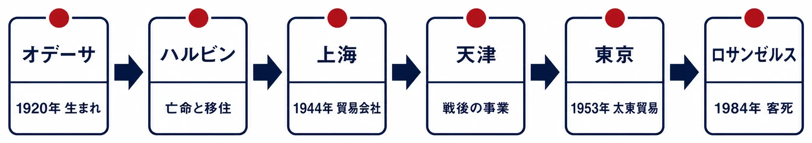
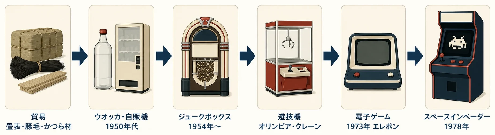
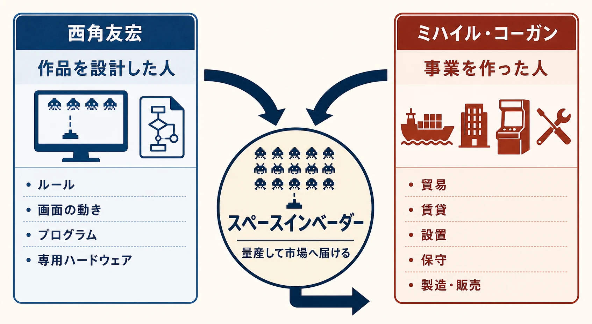

# ミハイル・コーガン評伝：オデーサの亡命者から『スペースインベーダー』を生んだ男へ

***

## はじめに：ゲームを設計しなかった創業者

1984年、一人の企業家がロサンゼルスへの出張中に急逝した。ミハイル・コーガン。[[1](#ref-1)]

そのわずか6年前、コーガンが創業した会社は、1978年の『スペースインベーダー』を世に送り出していた。ゲームセンターや喫茶店へ置かれた筐体は急速に広がり、翌年には日本中を巻き込む社会現象になった。[[2](#ref-2)][[3](#ref-3)] 1984年に世を去った企業家と、数年前に日本の街を席巻したゲーム。その二つは、同じ会社の歴史の中にある。

コーガンは企業家であり、「『スペースインベーダー』を作ったゲームデザイナー」ではない。ゲームのルール、画面の動き、プログラム、専用ハードウェアを実際に設計したのは、西角友宏である。[[4](#ref-4)]

西角がヒット作を設計したクリエイターだとすれば、コーガンは、そのヒット作を生み出せる企業と事業を作った創業経営者である。彼は貿易会社を立ち上げ、自動販売機やジュークボックスを扱い、遊技機を市場へ届ける販売・賃貸・保守の仕組みを育てた。作品の中身ではなく、作品が生まれ、量産され、街へ届く環境をどう作ったのか。そこにコーガンを読む意味がある。

亡命と移住を何度も経験し、畳表、豚毛、かつら材というゲームとは無縁の品目を扱う貿易から、コインで動く娯楽機器の会社へ転身した人物。本稿では、コーガンを「ゲームの天才」としてではなく、異分野を渡り歩きながらヒット作の土台を築いた企業家としてたどる。

*図：オデーサからハルビン、上海、天津、東京を経てロサンゼルスへ至る移動経路。*

***

## 1. オデーサからハルビンへ：革命が家族を動かした

コーガンは1920年、現在のウクライナ南部にある港湾都市オデーサで生まれた。出生時の同地は、ロシア革命と内戦の余波が続く地域であり、家族はその混乱を逃れて東へ移動したとされる。幼いコーガンが家族とともにたどり着いたのが、中国東北部のハルビンであった。[[1](#ref-1)]

当時のハルビンは単なる避難先ではない。同地は、中国東北部を横断する東清鉄道を基盤に、ロシア帝国の影響下で急速に発展した都市だった。鉄道、国境貿易、移民の流れが交差し、ロシア人、漢人、ユダヤ人、タタール人などが暮らす多民族都市になっていた。ロシア革命後には、旧帝政側や白軍に属した人々、あるいは革命後の生活を避けた人々が大量に流入した。[[5](#ref-5)]

「白系ロシア人」とは、1917年の革命で成立したボリシェヴィキ政権に対抗した白軍側、またはその周辺から国外へ移ったロシア人亡命者を指す言葉である。ハルビンには、このような亡命者の学校、新聞、商店、宗教施設が集まり、ロシア語で生活できる社会が形成されていた。ユダヤ人社会も、礼拝所、学校、図書館を持つ組織的な共同体として発展した。[[5](#ref-5)][[6](#ref-6)]

つまりコーガンの少年期は、ひとつの国家の中で安定して過ごした時期ではない。ロシア革命、内戦、鉄道都市の国際性、そして複数の政治権力が重なる環境の中で、異なる言語と制度をまたいで暮らす時期だった。この経験が、後年の彼を「ひとつの業種に自分を固定しない商人」にしたと読めるかもしれないが、それは我々後年に生きる者にはわからない。しかし、移動先で人脈と商機を見つけ、扱う商品を変えながら生きる基盤になった可能性はある。

***

## 2. 日本陸軍との接点という逸話

ハルビン時代のコーガンについては、もう一つの逸話が伝えられている。日本陸軍の情報担当者だった安江仙弘とハルビンで知り合い、その出会いが日本への親近感につながったという話である。安江は、満州国の成立後にハルビンで活動し、ユダヤ人難民をめぐる日本の政策や軍の対応に関わった人物として知られている。[[7](#ref-7)]

この逸話の典拠は、コーガンを直接知る関係者からの伝聞を、後年ある個人が寄稿記事としてまとめたものであり、学術資料や公式記録による裏付けは今のところ見当たらない。伝聞をもとにした人物像の一断面として読むのが適切である。[[8](#ref-8)]

ハルビンのユダヤ人社会が白系ロシア人の反ユダヤ主義や日本・ドイツ関係の影響を受けたこと、樋口季一郎や安江らが難民の移動を助けた事例があることは、研究資料でも確認できる。[[5](#ref-5)][[6](#ref-6)] コーガン個人の体験がその歴史のどこに正確に位置するのかは伝聞以上の資料では追いきれないが、亡命者としてのコーガンが日本という国に特別な感情を抱いていたことをうかがわせるエピソードとして読める。

***

## 3. 戦時下の日本から上海へ：商人としての最初の転身

コーガンは1939年に日本へ渡り、早稲田の経済系教育機関で学んだとする人物資料がある。第二次世界大戦中、彼は日本に足止めされ、戦争が続く中で自由に移動できない状況に置かれた。1944年、上海にいた父のもとへ移り、そこで最初の貿易会社を設立したとされる。[[1](#ref-1)]

会社が扱ったのは、娯楽でも機械でもなかった。畳表などの床材、豚毛、天然毛のかつら材といった、生活用品や加工材料である。会社名は「太東」にあたる中国語表記を用いた台東だったとされる。後のタイトーの社名と同じ音を持つが、この段階ではゲーム会社としての構想があったわけではない。[[9](#ref-9)]

この事実は、コーガンの企業家像を考えるうえで重要である。彼は「最初からゲームを作りたかった人物」ではない。仕入れ先、販路、需要、政治情勢に応じて、扱う商品と拠点を変える貿易商だった。ゲーム産業への進出は、彼の人生に最初から埋め込まれた目的ではなく、複数回の事業転換の先に現れた選択肢だったのである。

その後、会社を天津へ移した。天津は中国北部の港湾・商業都市であり、戦後の物資と人の流れを扱う拠点になった。さらに中国共産党が中国大陸で主導権を握ると、コーガンは1950年に事業を清算し、活動の中心を東京へ移したとされる。[[1](#ref-1)]

この移転も、理想の市場を求めた華々しい海外進出とは言いにくい。政権の交代によって、昨日までの取引関係や資産が、そのまま明日の事業基盤になる保証を失ったからである。オデーサからハルビン、上海から天津、そして東京へ。コーガンの履歴は、ひとつの場所に根を下ろす物語であると同時に、根を張った場所が変わるたびに商売を作り直す物語でもある。

***

## 4. 1953年8月24日：太東貿易商会の出発点

東京へ移ったコーガンは、衣料品を扱う太東洋行を始めた。しかし事業は安定せず、1953年8月24日、太東貿易株式会社を設立した。現在のタイトーが公式に設立日として掲げる日も、1953年8月24日である。[[10](#ref-10)]

設立当初の事業は、輸入雑貨の販売、国内初とされるウオッカの醸造・販売、小型自動販売機の製造・販売だった。ピーナッツを小分けして売るピーナッツベンダーのような機械は、商品そのものを店員が手渡すのではなく、機械を設置してコイン収入を得る商売である。タイトー公式の社史は、コーガンが戦後の洋酒ブームに着目し、ロシアの酒を事業の核に据えた経緯も紹介している。[[2](#ref-2)]

ここには、後のアーケード機器事業につながる考え方がすでにある。商品を一個ずつ売るだけでなく、機械を置く場所を確保し、利用者がコインを投入し、設置先にも利益を配分する。売るものがウオッカから音楽やゲームへ変わっても、設置場所と収益を組み合わせる仕組みは継続できる。

### ジュークボックスへの展開

太東貿易は1954年にジュークボックスの賃貸を始め、1956年には純国産ジュークボックスの1号機を開発した。国産機は故障とコストの問題から直接製造を継続できなかったが、販売と賃貸の経験は残った。1962年には米国シーバーグ社のジュークボックスについて、国内販売代理権を得ている。[[2](#ref-2)]

1960年前後には、国内で扱うジュークボックスが1,500台を超える規模に成長したと紹介される。[[11](#ref-11)] この数字を会社の売上高や利益と混同してはならないが、太東貿易が単なる輸入商社から、全国の設置先を管理するオペレーターへ変わっていたことを示す目安にはなる。

ジュークボックスは、音楽を聴く機械であると同時に、バー、喫茶店、映画館、遊戯施設へ人を呼ぶ設備でもあった。研究資料でも、戦後に進駐軍から民間へ流れた機械を、太東貿易などの業者が販売・設置し、1960年代に日本の喫茶店文化へ広がった過程が整理されている。[[12](#ref-12)]

コーガンが作ったのは、機械の完成品だけではなかった。設置場所を開拓し、故障を修理し、収益を回収し、次の機械へ入れ替える営業網である。後にタイトーが遊技機やビデオゲームを全国へ広げるとき、競争力になったのはこの現場の網だった。

***

## 5. 電子ゲームへ近づく：遊技機の経験が土台になった

太東貿易は1950年代後半から、ジュークボックスだけでなくフリッパー、ガンゲーム、クレーンゲームなどのアミューズメント機器を扱うようになった。1963年には自社ブランド製品の企画・開発・製造を目的とするパシフィック工業を設立し、1964年には「オリンピアゲーム」と呼ばれる、現在のパチスロに近い遊技機を日本で初めて扱ったと公式年表に記録している。[[2](#ref-2)]

ここでいう遊技機とは、コインを入れ、リールや機械的な仕掛けの結果を楽しむ業務用機器である。ビデオゲームとは異なるが、コイン投入、短時間のプレイ、店舗への設置、保守、収益回収という事業上の条件は共通している。コーガンの会社は、この「遊びを機械にし、店に置き、繰り返し利用してもらう」経験をすでに持っていた。

社名については、年次を正確に整理しておきたい。タイトー公式の沿革では、太東貿易株式会社から株式会社タイトーへの商号変更は1972年8月であり、1973年ではない。1973年は新本社の竣工と、国内初の業務用テレビゲームとされる『エレポン』の発表の年である。[[10](#ref-10)][[2](#ref-2)]

『エレポン』は、輸入された『PONG』の基板を使った卓球型の電子ゲームだった。これにより、太東貿易の系譜には、遊技機・エレメカの流れと、画面を使う電子ゲームの流れが並ぶことになる。資料によっては「電子ゲームを組み込んだスロットマシン」という説明も見られるが、製品名と投入年を一次資料で一貫して特定できないため、本稿では1973年の出来事として『エレポン』の発表のみを扱う。

*図：太東貿易が異なる業種を横断しながら、設置・運用型の事業基盤を電子ゲームへ接続していった流れ。*

***

## 6. 『スペースインベーダー』の前に会社があった

1970年代、タイトーは電子ゲームの開発・製造・販売へ進んだ。西角友宏は1960年代末にタイトー系の会社へ入り、エレメカや電子回路を使ったゲームを経験した後、ビデオゲームの開発に携わった。タイトーは1973年の『エレポン』から、レース、スポーツ、射撃など複数の業務用ゲームを市場へ投入していった。[[2](#ref-2)]

この蓄積があったからこそ、1978年に『スペースインベーダー』を量産し、ゲームコーナーや喫茶店へ設置できた。タイトー公式の年史は、1978年6月16日の新製品発表展示会で『スペースインベーダー』が初めて公開され、その後、ゲームコーナーだけでなく喫茶店にも置かれ、1979年には社会現象になったと記録している。公式サイトも、タイトーが1978年に開発・発売した同作が世界的なブームを巻き起こしたと説明している。[[2](#ref-2)][[3](#ref-3)]

ただし、ここでコーガンと西角の役割を混ぜてはならない。

- 西角友宏は、『スペースインベーダー』のゲーム内容とハードウェアを実際に設計したクリエイターである。公式サイトも西角を「スペースインベーダーの開発者」と明記している。[[4](#ref-4)]
- ミハイル・コーガンは、貿易、賃貸、設置、保守、製造、販売という会社の能力を積み上げた創業経営者である。
- タイトーの営業網と製造体制は、西角の設計を商品として全国へ届けるための組織基盤になった。

この関係は、映画でいえば監督と映画会社、出版でいえば作家と出版社に近い。もちろん実際の組織はもっと複雑だが、「作品を設計した人」と「作品を生み出せる事業を作った人」は同じではない。『スペースインベーダー』をコーガンの個人作品のように語ることは、西角の設計者としての功績を奪うだけでなく、企業がクリエイターの仕事を市場につなぐ過程も見えなくしてしまう。

*図：西角が作品を設計し、コーガンが事業を作り、両者の仕事が量産・市場投入で結び付く構造。*

***

## 7. 1984年2月：急逝と次の世代

コーガンは1984年2月、ロサンゼルスへ出張中に急逝した。64歳だった。[[1](#ref-1)][[13](#ref-13)]

同年2月20日、タイトーは新しい経営体制を発表した。業界紙によれば、35歳だった息子のアブラハム、通称アバ・コーガンが会長に就任した一方、1955年にタイトーへ入社し1965年から取締役を務めていた中西昭夫が社長に就いている。アバはブラジルの現地法人タイトー・ド・ブラジルの社長を1974年から兼務しており、そのまま続投することになったため、当時の業界紙は経営の実務を担うのは新社長の中西である、と評していた。[[13](#ref-13)]

この時点で、コーガンが残した会社は、もはや創業者個人の貿易商ではなかった。全国の営業拠点、遊技機と電子ゲームの開発機能、設置先との関係、海外展開へ向かう足場を備えた企業になっていた。創業者の死後も事業を継続できる組織になっていたこと自体が、彼の経営上の成果である。

***

## おわりに：亡命者の適応力が、企業の選択肢を増やした

コーガンの人生は、ひとつの専門を深掘りして名作を生んだ物語ではない。オデーサからハルビンへ移り、戦時下の日本に足止めされ、上海で畳表・豚毛・かつら材を扱い、天津を経て東京へ移った。そのたびに、住む場所だけでなく、商売の形も作り直した。

この経歴を「どんな環境にも適応できた」と美化しすぎるべきではない。亡命や戦時下の移動は、本人が自由に選べるキャリアチェンジではないからである。それでも、与えられた環境で扱える商品と人脈を見つけ、貿易から自動販売機へ、自動販売機からジュークボックスへ、ジュークボックスから遊技機・電子ゲームへ事業を変えた適応力は、コーガンの企業家精神として捉えられる。

新人ゲームプランナーにとっての示唆は、ゲームのアイデアだけを考えることではない。誰が設置先を開拓するのか。故障した機械を誰が直すのか。利用者が繰り返し遊ぶ場所をどう作るのか。クリエイターが設計したものを、どの営業網と製造体制で市場へ届けるのか。ヒット作の背後には、作品を作った人だけでなく、作品を生み出せる組織を作った人物がいる。

『スペースインベーダー』の設計者は西角友宏である。その作品を世に送り出す企業の土台を築いた創業者がミハイル・コーガンである。この二つの功績を分けて見ると、ゲーム史は「天才が一人で名作を生んだ物語」から、クリエイターと組織と市場が接続される過程へ変わって見えてくる。

***

## References

1. [Michael Kogan][1] - 出生、家族の移動、上海・東京での事業、1984年の没日などをまとめた人物紹介。

2. [タイトーの歩み｜株式会社タイトー70周年記念サイト][2] - ウオッカ、自動販売機、ジュークボックス、オリンピアゲーム、1973年の『エレポン』、1978年の『スペースインベーダー』など、公式社史の詳細年表。

3. [SPACE INVADERS「スペースインベーダーとは」][3] - タイトー公式サイト。1978年の開発・発売と世界的ブーム、6月16日の初公開を説明する。

4. [SPACE INVADERS「ビデオメッセージ」][4] - タイトー公式の40周年関連ページ。西角友宏を『スペースインベーダー』の開発者と明記する。

5. [The Jewish Community of Harbin][5] - ケンブリッジ大学出版局の研究書章。鉄道都市ハルビンの成立、ロシアからの亡命者、ユダヤ人共同体の発展と日本占領後の変化を概説する。

6. [Prewar Japan's perception of Jews and the Harbin Jewish community][6] - 同志社大学CISMORの研究報告。ロシア革命後のハルビンのユダヤ人社会と、白系ロシア人の反ユダヤ主義、日本支配下の政策環境を扱う。

7. [Japan and Jewish Refugees during World War II][7] - 樋口季一郎らと日本占領下のハルビン・ユダヤ人難民をめぐる概要。救援を単純な英雄譚に還元しないための背景資料。

8. [タイトー創業者コーガンと安江仙弘][8] - FIWA通信という金融アドバイザー団体のニュースレターに、一個人が寄稿した「トリビア・コーナー」記事。コーガンと安江仙弘の親交に関する伝聞を伝えるが、学術資料や公式記録による裏付けは確認できない。

9. [Taito][9] - 太東の初期事業、1944年上海での創業、床材・天然毛・豚毛などの取扱いを整理した二次資料。一次資料で確認できない細部は留保した。

10. [企業情報｜株式会社タイトー][10] - 設立日、1972年の商号変更、1973年の『エレポン』発表、1978年の『スペースインベーダー』発表を示す公式沿革。

11. [台東｜タイトー社史の概要][11] - 1960年前後のジュークボックス1,500台超という二次資料上の数値を確認するために参照した。

12. [ジュークボックスによる音楽聴取の様相][12] - 日本の喫茶店を中心に、戦後のジュークボックス流通と1960年代以降の普及を分析した研究論文。

13. [Game Machine 1984年4月1日号][13] - コーガンの1984年2月の死去と、その後のタイトー経営陣に関する同時代の業界紙資料。

[1]: https://en.wikipedia.org/wiki/Michael_Kogan
[2]: https://www.taito.co.jp/70th/history
[3]: https://spaceinvaders.jp/whats.html
[4]: https://spaceinvaders.jp/vmsg.html
[5]: https://www.cambridge.org/core/books/abs/jewish-communities-in-modern-asia/jewish-community-of-harbin/311DA822567E9BF61BA7404263D040E3
[6]: https://cir.nii.ac.jp/crid/2120589364835280384
[7]: https://kumiko-ahr.ch/archives/584
[8]: https://fiwa.or.jp/investlife/wp-content/uploads/2022/04/il20220415_all.pdf
[9]: https://jmediawiki.org/%25E3%2582%25BF%E3%82%A4%E3%83%88%E3%83%BC%E7%A4%BE%E3%81%8C/Taito
[10]: https://www.taito.co.jp/corporate/about/history
[11]: https://jmediawiki.org/%25E3%82%BF%E3%82%A4%E3%83%88%E3%83%BC%E7%A4%BE%E3%81%8C/Taito
[12]: https://www.jstage.jst.go.jp/article/mscom/87/0/87_KJ00010016972/_article/-char/ja
[13]: https://onitama.tv/gamemachine/pdf/19840401p.pdf

----

この文書は、Perplexity、Claude、OpenAI Codex の3つのAIの支援を受けて著述されたものです。引用画像を除き、MIT License にて提供されています。
