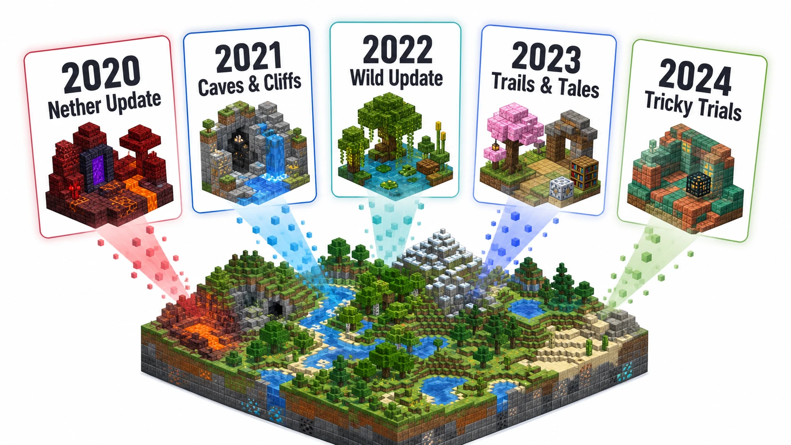
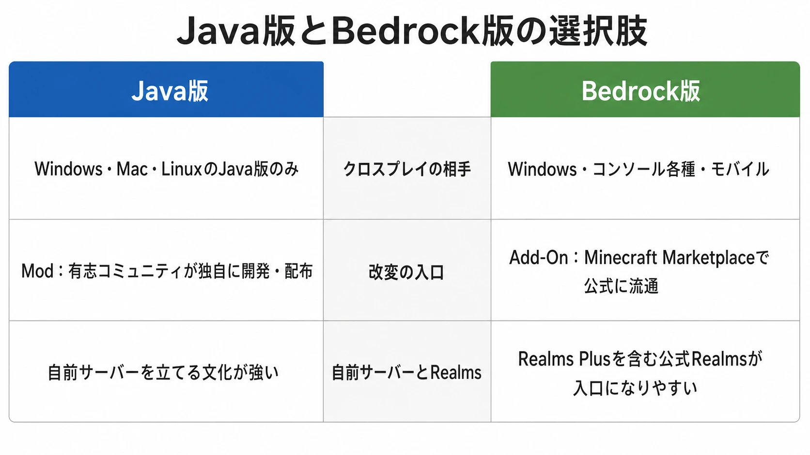

# Minecraftはなぜ17年近く売れ続けるのか――「終わらない設計」とJava版・Bedrock版を統合しない判断

2023年10月、Mojang Studiosは『Minecraft』の累計販売本数が3億本を超えたと発表した。[[1](#ref-1)] Minecraft Live 2023にあわせ、Mojang Studiosの責任者Helen Chiang氏も、この到達点を15周年を控えたコミュニティへの感謝とともに振り返っている。[[2](#ref-2)] 2009年にPC向けの最初の版が出た作品が、これほど長く新規購入を生み続けることは、発売時点で自明だったわけではない。

開発者のMarkus Persson氏（Notch）は初期、販売の好調がいつまでも続くとは考えておらず、販売が落ち着いた後にはソースコードを公開する意向まで示していた。[[3](#ref-3)] この逸話は、今日の持続性を「最初から完成された長寿設計」の結果としてだけ説明することを戒める。現在の『Minecraft』は、初期の自由度だけで成立しているのではない。後年に積み重ねられた、更新の運営とプラットフォーム戦略の結果でもある。

本稿では、二つの選択をつなげて読む。一つは、明確な終わりを作品に固定せず、既存のワールドへ意味のある追加を続ける選択である。もう一つは、クロスプラットフォーム版をBedrockへ集約しながら、Java版をあえて別コードベースとして残した選択である。特殊な一作の歴史ではあるが、そこには「利用者全員に単一の正解を押しつけない」という、ほかのゲームでも検討できる判断原理が見える。

***

## 終了条件を置かず、遊ぶ理由を更新する

『Minecraft』には、公式に定められたゲームの終わりがない。エンダードラゴンの討伐を「クリア」と呼ぶプレイヤーは多いが、公式もこれを任意の節目として説明している。[[4](#ref-4)] 討伐後に建築を続けてもよいし、新しいシードでワールドを作り直してもよい。サバイバル、建築、探索、レッドストーン回路、他者とのサーバー生活は、同じ達成順序へ回収されない。

この性質は、コンテンツを無限に増やせばよいという意味ではない。終わりがないゲームほど、戻ってきたプレイヤーに「以前のワールドで何を試すか」を渡す必要がある。2020年以降の大型アップデートは、世界そのものを一度リセットせず、既存の遊び方へ新しい焦点を当ててきた。

| 時期 | 更新 | 新しく焦点化した遊び |
| --- | --- | --- |
| 2020年6月 | 1.16 Nether Update | ネザーを危険な通過地点だけでなく、居住・探索・資源獲得の対象へ広げた。[[5](#ref-5)] |
| 2021年6月・11月 | 1.17〜1.18 Caves & Cliffs | 洞窟と山岳、ワールドの高さを二部構成で大きく更新した。[[6](#ref-6)] |
| 2022年6月 | 1.19 Wild Update | ディープダーク、マングローブ、カエルなどで探索と環境の読み方を増やした。[[7](#ref-7)] |
| 2023年6月7日 | 1.20 Trails & Tales | 考古学、装飾、物語を残す建築へ目を向けさせた。[[8](#ref-8)] |
| 2024年6月13日 | 1.21 Tricky Trials | Trial ChambersとTrial Spawnerにより、単独・協力双方の戦闘探索へ新しい目的地を加えた。[[9](#ref-9)] |

大型アップデートは、旧来のプレイヤーを新作へ移動させるのではなく、持っているワールドを再訪する理由に変える。たとえば建築中心のプレイヤーにとっては新ブロックや新しい地形が計画の契機になり、探索中心のプレイヤーにとっては未踏の生成物が目的地になる。友人と遊ぶ層には、「更新が入ったから今週末に集まる」という再集合の口実にもなる。

もちろん、各更新が実際にどれだけ継続率を押し上げたかは、Mojangが版別・更新別に公表していない。そのため、更新と売上を一対一の因果関係として扱うことはできない。それでも、無料更新が新規購入者には現時点の作品像を示し、既存プレイヤーには保存済みの世界をもう一度開く理由を与える、という二方向の効果は設計上区別して考えられる。

大事なのは、新要素を「全プレイヤーが通る必須課題」にしないことだ。ネザーを深掘りする人も、考古学を楽しむ人も、Trial Chambersを攻略する人も、従来の建築を続ける人もいる。更新は正しい遊び方を置き換えるのではなく、遊び方の選択肢を増やす。この足し方なら、長く作ったワールドやコミュニティの履歴を、運営側の都合で無効化しにくい。

***

## MicrosoftはMinecraftをXbox専用にしなかった

この選択を理解する前提として、2014年の買収を置いておきたい。Microsoftは同年、Mojangと『Minecraft』を25億ドルで取得すると発表した。発表文はクラウド、モバイル、接続性への投資に言及している。[[10](#ref-10)] だが、その後に採られたのは、Xboxでの囲い込みではなく、できるだけ多くの端末で同じワールドへ入れる道だった。

2017年9月20日のBetter Together Updateは、モバイル、Windows 10、VR、Xbox OneをBedrock Engineに基づく版へまとめ、相互に遊べるようにした。公式FAQは、このエンジンを2012年からモバイル、VR、Windows 10向けに開発してきたものと説明している。[[11](#ref-11)] Nintendo Switch向けのBedrock版は2018年6月21日に、PlayStation 4向けは2019年12月に加わった（日本時間では12月11日、北米時間では12月10日の配信）。[[12](#ref-12)][[13](#ref-13)][[14](#ref-14)]

この到達点は、ハードを売る側にとって直感的には見えにくい。2021年の収益について、Xbox CFOのTim Stuart氏は、Nintendo Switch版『Minecraft』の収益がXbox版のおよそ4倍だったと法廷証言で述べたと報じられている。[[15](#ref-15)] 数字は単年の収益比較であり、累計販売本数や利用者数の比較ではない。しかし、自社ハード以外での接点を広げることが、所有IPの事業価値を損なうだけではないことを端的に示す材料である。

Bedrockの価値は、単に同じタイトルを複数の店で売ることではない。子どもが携帯機で始め、友人はコンソールから参加し、別の人はPCでワールド管理をする。その混在を、個別移植のたびに分断させず、クロスプレイ、Realms、Marketplaceへ接続した。プラットフォームをまたぐことで、購入の入口と、誰と遊ぶかの入口を広げたのである。

***

## それでもJava版をBedrockへ移さなかった理由

Better Togetherは「すべてのMinecraftを一つにする」更新ではなかった。公式は当時、Java版を独立した名称に改めつつ、今後も継続して更新すると明言している。[[11](#ref-11)] 現在もJava版とBedrock版は同じ主要アップデートを受けながら、クロスプレイの相手は異なる。公式の比較ページは、Java版の相手をWindows、Mac、LinuxのJava版、Bedrock版の相手をWindows、コンソール、モバイルと分けている。[[16](#ref-16)]

これは統合に失敗した残り物と見るより、異なる要請を一つの実装へ無理に畳まなかった判断として読むべきである。

### 技術面：配布先が違えば、最適化対象も違う

BedrockはC++コードベースで、多様な端末向けに統一された版である。Microsoftの資料も、C++コードベースの統合版が多数のプラットフォームを可能にしたと説明する。[[17](#ref-17)] これは、入力方式、性能、ストアの審査、保護者向け設定が異なるモバイルやコンソールへ、共通のオンライン体験を届けるための基盤である。

一方、Java版はPCで始まった版であり、Java版のModは公式利用規約でも独立して扱われている。利用規約は、Java版のModをプレイヤーまたは第三者が作る独自の作品と定義し、一定の条件で配布を認めている。[[18](#ref-18)] 公式の比較記事も、Java版をオープンでカスタマイズ性が高く、Modでゲームメカニクスまで変えられる版として紹介する。[[19](#ref-19)]

ここで「Java版のほうが自由、Bedrock版のほうが劣る」と序列化する必要はない。BedrockにもAdd-Onがあり、リソースや振る舞いを変えられる。だが、公式ヘルプは、従来のModはJava版専用であり、BedrockではAdd-Onという異なる提供形態を採ると明示する。[[20](#ref-20)] 同じ改変という言葉でも、自由度、導入の容易さ、品質管理、配布経路に対する期待が異なるのである。

Java版を全面的にBedrockへ置き換えれば、クロスプラットフォームの整合性は高めやすい。代わりに、既存Mod、プラグイン、自前サーバー、技術的な試行錯誤に依存するコミュニティの移行コストを一気に引き受けることになる。別コードベースを維持するコストは重いが、片方の価値をもう片方の評価軸で消さないためのコストでもある。

### 事業面：統一基盤と改変文化を同時に持つ

二つの版を残すと、仕様差、テスト、説明、サポートは複雑になる。それでも事業として得るものがある。Bedrockは、機種をまたいで友人と遊び、公式が整えたコンテンツの流通を利用したい人の入口になる。Java版は、Modや自前サーバーを組み、特定のバージョンやルールへ長く滞在したい人の入口になる。

後者を単なる過去のPC版として切り捨てなかったことで、『Minecraft』は二種類の拡張を並行させている。一つは、公式が互換性と安全性を管理しながら広げる拡張である。もう一つは、プレイヤーとサーバー運営者が改変と運用を引き受けながら広げる拡張である。両方のプレイヤーを同じクロスプレイ空間に収容できないことは不便だが、どちらかの価値観を全員の標準にしないことでもある。

この判断には、前節の更新設計と同じ形がある。すべてのプレイヤーに同じ終着点を与えない。すべてのプレイヤーに同じ配布・改変・接続の方法も与えない。統一の便益を得る領域はBedrockへ寄せ、改変の蓄積が価値になる領域はJava版に残す。分裂は必ずしも未整理ではなく、異なる需要を保存するための製品ポートフォリオになり得る。

***

## コラム：Realmsは便利な標準解であって、唯一の正解ではない

買い切りのゲーム本体に加え、『Minecraft』には月額制のサーバーホスティングサービスRealmsがある。公式は、Java版向けのRealmsとBedrock版向けのRealms Plusを、少人数のプライベートサーバーを作るためのサブスクリプションとして案内している。[[19](#ref-19)] サーバー構築の知識がなくても、友人と継続ワールドを始められる点は、ゲーム本体の売り切りモデルを壊さずに継続利用の選択肢を増やす。

ただし、Realmsを全プレイヤーの主流と見なすべきではない。公式の比較表でもJava版には自前サーバーのホスト機能があり、Modやプラグインを前提に自らサーバーを運用する層が存在する。[[16](#ref-16)] Realmsはこの層を置き換える商品ではなく、手間を減らしたい小規模グループへの選択肢である。ここでも運営は、サーバーの持ち方を単一化していない。

***

## 終わらせないことと、統合し切らないこと

『Minecraft』の長期的な販売を、ブロック表現、教育利用、配信文化のどれか一つで説明することはできない。本稿で見た二つの選択も、成功を保証する処方箋ではない。二つのコードベースを維持できる組織的体力や、長年にわたるコミュニティの蓄積は、容易に複製できない条件だからである。

それでも、プランナーが持ち帰れる判断原理はある。「終わらない設計」は、終わりをなくすだけではない。既存の遊び方を否定せず、再訪の理由を複数用意することである。「あえて統合しない分裂」は、技術的負債を放置することではない。異なる利用者が守ってきた価値を、一方にだけ最適化した標準で消さないことである。

一見すると、前者はゲームデザイン、後者は経営と技術の話である。しかし両者は、「単一の正解を決め打ちしない」という同じ判断原理の両輪になっている。全員を同じエンディングへ送らず、全員を同じ版へ移さず、それぞれの居場所を更新し続ける。『Minecraft』が17年近く代わりの現れにくい規模で売れ続ける背景は、この余白を製品と事業の両方で守ってきたことにある。

## References

1. [Minecraft Live 2023: The Recap!][1] - Minecraft Live 2023での累計3億本超の公式発表。

2. [Minecraft crosses 300 million copies sold as it prepares to celebrate its 15th anniversary][2] - Minecraft Live 2023でのHelen Chiang氏（Mojang Studios責任者）のコメントを報じる記事。

3. [Minecraft crosses 300 million sales ahead of 15th anniversary][3] - Notchが初期に強い販売の持続を想定せず、販売減少後のソースコード公開に言及していた経緯を報じる。

4. [What is Minecraft? Discover the World of Minecraft][4] - 公式に定められた「終わり」がないこと、エンダードラゴン討伐がプレイヤーによる節目であることの説明。

5. [Minecraft - Nether Update - 1.16.0 (Bedrock)][5] - 2020年6月23日公開のNether Updateの内容。

6. [Minecraft - Caves & Cliffs: Part II - 1.18.0 (Bedrock)][6] - 2021年11月30日公開のPart IIと、ワールド高低差・洞窟・山岳の更新内容。Part Iは同年6月公開。

7. [Minecraft - The Wild Update - 1.19.0 (Bedrock)][7] - 2022年6月7日公開のWild Updateの内容。

8. [Minecraft - Trails & Tales - 1.20.0 (Bedrock)][8] - 2023年6月7日公開のTrails & Talesの内容。

9. [Minecraft: Bedrock Edition - 1.21 (Tricky Trials)][9] - 2024年6月13日公開のTricky Trialsの内容。

10. [Minecraft to join Microsoft][10] - 2014年のMojang買収発表と25億ドルの取引条件。

11. [Better Together FAQ][11] - 2017年9月20日のBedrock Engineを用いた統合、Java版を継続更新する方針。

12. [Minecraft's Bedrock Update Coming to Nintendo Switch Digitally and in Retail on June 21][12] - 2018年6月21日のNintendo Switch向けBedrock版提供開始の公式発表。

13. [Bedrock is Coming to PS4][13] - PlayStation 4向けBedrock版提供とクロスプレイの公式発表。

14. [『マインクラフト』PS4版の「Bedrock Version」へのアップデートが決定、明日にも無料配信へ][14] - 日本時間2019年12月11日午前1時（北米時間12月10日）の配信開始を報じる。

15. [Minecraft earned four times as much revenue on Switch compared to Xbox][15] - Tim Stuart氏のFTC対Microsoft裁判での証言に関する報道。

16. [Minecraft Java or Bedrock Edition][16] - Java版・Bedrock版のクロスプレイ範囲、自前サーバー、Realmsの比較。

17. [Minecraft Franchise Fact Sheet][17] - BedrockのC++コードベースとマルチプラットフォーム展開に関するMicrosoft資料。

18. [Minecraft Usage Guidelines][18] - Java版のModを独立した創作物として扱う利用規約。

19. [Minecraft Java or Bedrock Edition][19] - Java版のMod文化、Bedrock版のMarketplace、RealmsとRealms Plusの説明。

20. [Learn about Minecraft: Bedrock Edition Add-Ons][20] - Java版のModとBedrock版のAdd-Onの区別。

[1]: https://www.minecraft.net/en-us/article/minecraft-live-2023--the-recap-
[2]: https://www.windowscentral.com/gaming/minecraft/minecraft-crosses-300-million-copies-sold-as-it-prepares-to-celebrate-its-15th-anniversary
[3]: https://www.gamedeveloper.com/business/minecraft-crosses-300-million-sales-ahead-of-15th-anniversary
[4]: https://www.minecraft.net/en-us/about-minecraft
[5]: https://feedback.minecraft.net/hc/en-us/articles/360044928311-Minecraft-Nether-Update-1-16-0-Bedrock
[6]: https://feedback.minecraft.net/hc/en-us/articles/4414284658701-Minecraft-Caves-Cliffs-Part-II-1-18-0-Bedrock
[7]: https://feedback.minecraft.net/hc/en-us/articles/6613754674829-Minecraft-The-Wild-Update-1-19-0-Bedrock
[8]: https://feedback.minecraft.net/hc/en-us/articles/16421714461453-Minecraft-Trails-Tales-1-20-0-Bedrock
[9]: https://feedback.minecraft.net/hc/en-us/articles/27451789924237-Minecraft-Bedrock-Edition-1-21-Tricky-Trials
[10]: https://news.microsoft.com/source/2014/09/15/minecraft-to-join-microsoft/
[11]: https://www.minecraft.net/en-us/article/better-together-faq
[12]: https://news.xbox.com/en-us/2018/05/10/minecrafts-bedrock-update-coming-nintendo-switch-digitally-retail-june-21/
[13]: https://www.minecraft.net/en-us/article/ps4-news
[14]: https://automaton-media.com/articles/newsjp/20191210-108342/
[15]: https://www.gamedeveloper.com/business/minecraft-earned-four-times-as-much-revenue-on-switch-compared-to-xbox
[16]: https://www.minecraft.net/en-us/article/java-or-bedrock-edition
[17]: https://xboxwire.thesourcemediaassets.com/sites/2/2021/04/Minecraft-Franchise-Fact-Sheet_Oct.-2021.pdf
[18]: https://www.minecraft.net/en-us/usage-guidelines
[19]: https://www.minecraft.net/en-us/article/java-or-bedrock-edition
[20]: https://help.minecraft.net/hc/en-us/articles/4409140076813-Minecraft-Add-Ons-for-Bedrock-Versions-FAQ

----

この文書は、Perplexity、Claude、OpenAI Codex の3つのAIの支援を受けて著述されたものです。引用画像を除き、MIT License にて提供されています。
