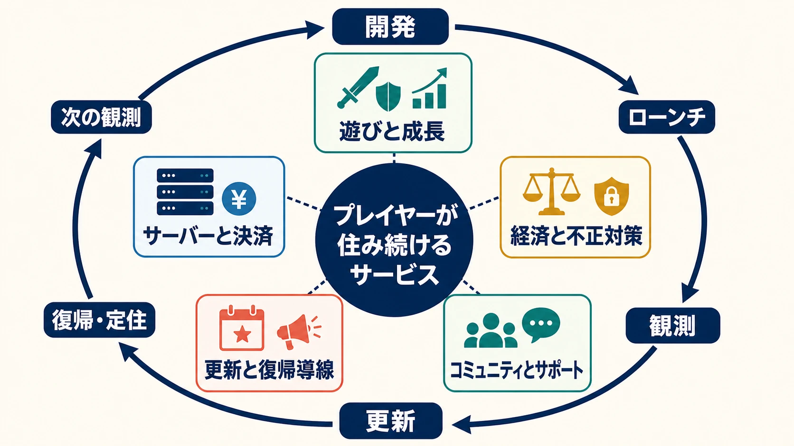
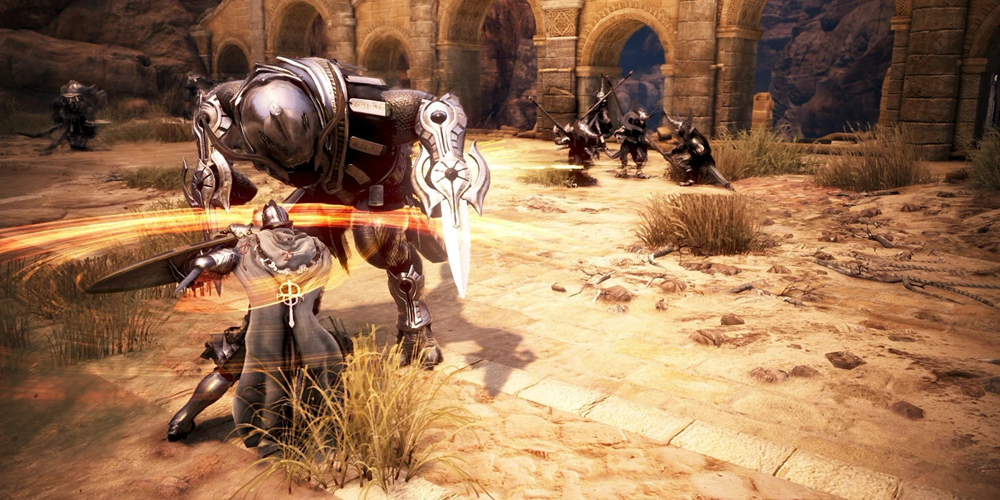
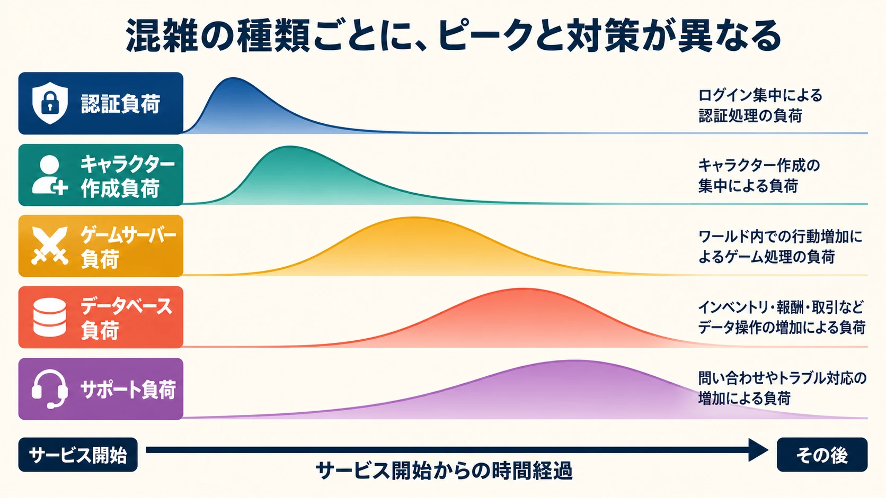
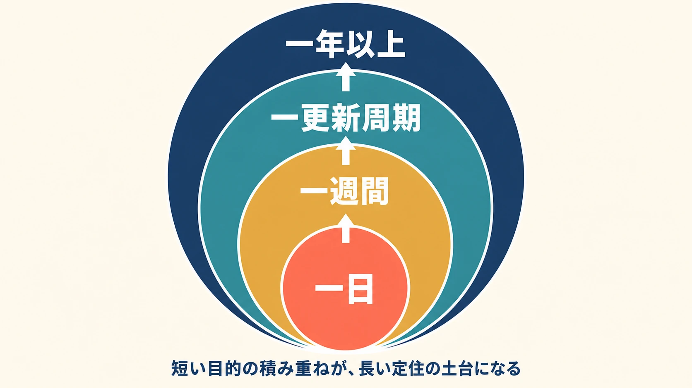
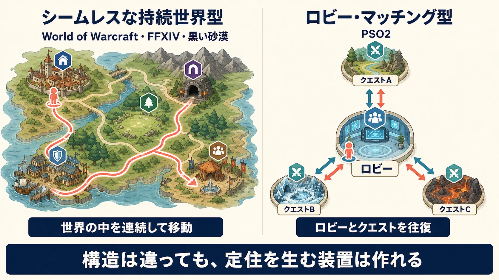
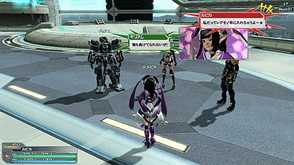

# MMORPG企画の基礎――World of Warcraft、ファイナルファンタジーXIV、黒い砂漠、ファンタシースターオンライン2から学ぶ「運営を作る」設計

***

## はじめに――発売日は、運営初日である

MMORPGの企画書は、発売後の運営まで含めて完成する。多数のプレイヤーが同じサービスへ継続的に接続し、成長、経済、コミュニティ、コンテンツ消費を何年も重ねるからだ。レベルデザインやバトルの担当者も、サーバー容量、更新工程、料金体系、不正対策、カスタマーサポートまでを企画条件として扱う必要がある。

『ファイナルファンタジーXIV』（以下、FFXIV）のプロデューサー兼ディレクターである吉田直樹氏は、Game Developers Conference（GDC）2014の講演で、ログインサーバー、ロビー、キャラクター作成、装備、UI、バトル、クラス、クラフト、ダンジョン、経済、ハウジング、レイド、マッチング、フォーラム、24時間のゲームマスター対応、決済までを、大規模MMORPGに必要な要素として一続きに列挙した。さらに運営を政府、プレイヤーを市民になぞらえ、方針に納得できなければ住民は別の国へ移ると説明している。[[1](#ref-1)]

つまり、プランナーが作る対象は、 **人が住み続けられるサービス** そのものである。

本稿では、四つの作品を比較する。

| タイトル | 初めて読む人向けの位置付け | 本稿で見る主な論点 |
|---|---|---|
| World of Warcraft | Blizzard Entertainmentが2004年11月に開始した、クエスト、ダンジョン、レイド、ギルド、対人戦、生産職を大規模な持続世界で結ぶMMORPG | 見えにくい最大手、月額制、ローンチ需要、更新ロードマップ |
| FFXIV | スクウェア・エニックスが運営する、物語進行と自動マッチング型コンテンツを太い導線にしたMMORPG。2010年の旧版を刷新し、2013年に新生した | 競合研究、再設計、更新周期、運営責任者による対話 |
| 『黒い砂漠』 | Pearl Abyssが開発したオープンワールドMMORPG。アクション性の高い戦闘と、採集、加工、料理、交易などの生活要素を広く結ぶ | ノンターゲティング戦闘、生活要素、地域別料金モデル |
| 『ファンタシースターオンライン2』（以下、PSO2） | セガが2012年7月4日に開始したオンラインアクションRPG。ロビーで人と出会い、クエスト単位の部屋へマッチングして遊ぶ | 基本無料、アクション、レベル上限後の報酬、MMORPG外の定住設計 |

PSO2は、World of WarcraftやFFXIVのように広い持続世界を多数のプレイヤーが連続的に移動する設計とは異なる。この違いは後で改めて扱う。

***

## 1. 仮想敵は、日本語で見える範囲の外にもいる

### World of Warcraftが日本から見えにくい理由

World of Warcraftは、MMORPGを企画するうえで外せない比較対象である。ところが日本語話者には、作品の規模に反して体験の入口が細い。

Blizzardの日本語公式案内には、次の二点が明記されている。

> 「World of Warcraft」は日本語にローカライズされていない

> 日本のプレイヤーは既定で北アメリカサーバーへ入り、「ほとんどのプレイヤーが英語で会話しています」

言語設定で日本語を選んでも、ゲーム中のテキストと会話文は英語で表示される。[[2](#ref-2)] 日本語メディアだけを追うプランナーにとって、最大級の競合が日常の情報圏から外れやすい構造なのである。

現在の有料会員数にも注意が要る。Activision Blizzardは2015年を最後にWorld of Warcraftの会員数を定期開示しなくなった。[[3](#ref-3)] 2024年にはGDC講演の推移図などを基に数百万人規模とする業界推定が報じられたが、これはBlizzardが公表した現在値ではない。[[4](#ref-4)] 正確な人数は不明でも、業界推定で数百万人規模を保つ最大級の作品として、比較対象から外す理由はない。

### 旧FFXIVが示した競合研究不足

旧FFXIVは2010年9月30日に正式サービスを開始した。吉田氏はGDC 2014で、旧版開発チームがFFXIの成功経験を引き継ぐ一方、MMORPG市場、ジャンル全体のゲームデザイン、ユーザーニーズの変化を認識できなかったと振り返った。「グラフィックス品質への執着」「チーム内のMMORPG知識不足」「問題は将来の更新で直せるという考え」も、失敗へ至る要因として挙げている。[[1](#ref-1)]

同じ資料では、2011年10月14日に『新生エオルゼア』が発表され、旧版の更新を続けながら2年8か月で新生版を開発した経緯も示されている。[[1](#ref-1)] 旧版の技術・組織上の破綻は[別稿](ffxiv-1-0-failure-anatomy.md)で詳しく扱っているため、ここでは一つの教訓に絞る。

**日本語で直接遊べる競合がなくても、企画前の調査は必要である。**

競合研究では、機能表に加えて、少なくとも次を実際のプレイと運営記録から確認する必要がある。

- 新規プレイヤーが最初の仲間を得るまでの時間
- 移動、戦闘、取引、パーティー編成で繰り返す操作
- レベル上限後の一週間の行動
- 大型更新の前後で復帰者が追いつく方法
- 混雑時に待たせる場所と、収容人数を増やす方法
- 課金しない人、少額を払う人、継続的に払う人の体験差
- 不具合や方針変更を誰が、どの頻度で説明するか

言語の壁がある場合は、調査費として翻訳、海外アカウント、現地コミュニティへの聞き取り、動画・パッチノートの読解時間を最初から計上する。翻訳可能な資料だけを読むのではなく、 **競合体験へ到達する工程そのもの** を企画業務に含めるのである。

***

## 2. 事業モデルは、遊びと運営を決める設計条件である

吉田氏は同じGDC講演で、基本無料とサブスクリプションにはそれぞれ長所と短所があり、ゲーム、顧客、市場に合う方式を選ぶべきだと述べた。要点は「料金モデルにゲームを支配させない」ことである。[[1](#ref-1)]

実務では、料金方式ごとに約束する体験が変わる。

| 方式 | 作品例 | 企画上の強み | 企画上の負債 |
|---|---|---|---|
| サブスクリプション中心 | World of Warcraft、FFXIV | 継続収入を前提に、更新計画とサポートへ投資しやすい。販売画面を毎回の遊びに挟まずに済む | コンテンツの空白が解約理由になりやすい。月額を払う理由を継続的に示す必要がある |
| パッケージ購入＋アイテム課金 | 海外PC版・コンソール版の『黒い砂漠』など | 最初の購入で顧客を選別しつつ、外見・利便性・追加商品で長期収益を得られる | 「購入済みなのに、さらに払う」と感じさせやすい。初期価格と有料アイテムの価値境界が必要になる |
| 基本無料＋アイテム課金 | 日本PC版『黒い砂漠』、PSO2 | 友人を誘う摩擦が小さく、母集団を広げやすい。外見や利便性に支払う層を作れる | 無料部分も大規模に運営する費用がかかる。課金導線が報酬設計やUIを侵食しやすい |

World of Warcraftは、単一のサブスクリプションで現行版とClassic系へアクセスできると案内している。[[5](#ref-5)] FFXIVは製品購入と月額利用料を組み合わせるため、厳密にはパッケージ＋サブスクリプション型だが、運営の中核は継続利用料にある。[[6](#ref-6)]

『黒い砂漠』は、同じタイトルでも地域と機種で方式が異なる。日本PC版の公式表記は「基本プレイ無料」「アイテム課金方式」である。[[7](#ref-7)] 一方、北米・欧州PC版やコンソール版には、ゲームへのアクセス権を含むパッケージと、ゲーム内アイテムを含む商品が用意されている。[[8](#ref-8)] 世界展開では「このタイトルは買い切り」「このタイトルは基本無料」と一語で固定せず、地域、ストア、機種、運営会社ごとに収益構造を確認すべきである。

PSO2は基本プレイ無料で、一部の有料アイテムを販売する。公式ポリシーは、クラスレベルに無料プレイヤー向けの制限を置かず、高性能な武器を直接販売しないと説明している。[[9](#ref-9)] これは「何を無料にするか」より一段深い判断である。 **戦って装備を見つける中核体験は販売しない** という境界を先に定めているからだ。

料金モデルを決める会議では、売上予測だけでなく、次の三問を同時に解く必要がある。

1. 無料または初期購入の範囲で、作品の面白さをどこまで証明するか
2. 支払いによって短縮・拡張できるものは、時間、外見、利便性、能力のどれか
3. 更新が遅れた月にも、プレイヤーへ何を提供できるか

World of Warcraftのゲーム内通貨とプレイ時間を交換する仕組みは[別稿](official-rmt-design-diablo-wow-eve-taskbar-hero.md)で扱っている。本稿では、同作の中核がサブスクリプション型であることの確認に留める。

***

## 3. 差別化は、プレイヤーの日々の行動を変える

後発MMORPGが既存作の機能表を埋めても、プレイヤーには移住する理由が生まれにくい。差別化は宣伝文句ではなく、毎日の入力、判断、他者との関係を変える必要がある。

### アクション性を軸にする

『黒い砂漠』は、公式紹介で「スピーディーで迫力のあるノンターゲティングバトル」を特徴として掲げている。日本では2015年5月8日にサービスを開始し、2022年5月8日に7周年を迎えた。[[10](#ref-10)] 2020年4月24日には、従来のPmang・DMM GAMESからPearl Abyssの直接運営へ移管している。[[11](#ref-11)]

ノンターゲティング戦闘とは、敵を選択しておけば攻撃が自動的に命中する方式ではなく、向き、距離、回避、入力の連続で攻防を作る方式である。『黒い砂漠』では、この手触りが広いフィールドの移動、敵集団との戦闘、クラスごとの操作差にまで通っている。[[12](#ref-12)]

*画像出典（引用）：Pearl Abyss, [ゲームの特徴｜黒い砂漠](https://www.jp.playblackdesert.com/ja-JP/GameInfo/Feature), Copyright © Pearl Abyss Corp. All Rights Reserved. / ノンターゲティング戦闘の向き・距離と複数の敵との攻防を示す資料として引用。WebP変換。*

アクション性を差別化に選ぶなら、戦闘モーションだけを作り込んでも足りない。遅延、当たり判定、カメラ、敵の密度、パッド操作、対人戦の同期、長時間反復したときの疲労まで、同じ軸で設計する必要がある。

### 生活要素と経済を軸にする

『黒い砂漠』には、採集、加工、料理、錬金、釣り、栽培、調教などの生活コンテンツがある。公式ガイドは11種類を挙げ、それらが戦闘を含む他分野と相互に関係すると説明している。[[13](#ref-13)]

ここでの差別化は、素材を採る人、加工する人、市場で売る人、狩りで消費する人をつなぐことにある。ミニゲームの数に加えて、戦闘力以外にも「今日は何をするか」が生まれるため、レベル上限後の定住先を最難関戦闘だけに集中させずに済む。

### 物語と参加しやすさを軸にする

FFXIVは、長編の物語を進めながら、コンテンツファインダーでダンジョンやレイドへ参加できる。戦闘職に加えて、装備、薬品、料理、家具などを作る8種類のクラフターと、採掘、園芸、漁業を行う3種類のギャザラーも独立したクラスとして用意されている。[[14](#ref-14)]

同作の差別化は、物語で次の目的を示し、マッチングで集団参加の摩擦を下げ、戦闘以外にも成長先を置く組み合わせにある。「物語がある」という特徴を、導線、UI、更新計画まで貫通させている。

### ロビー・マッチング型のアクションを軸にする

旧PSO2では、プレイヤーはアークス・ロビーのカウンターでクエストを受注し、キャンプシップを経て専用フィールドへ出発する。複数ブロックをまたいで同じクエストの参加者を探す仕組みもある。[[15](#ref-15)] 広い持続世界の移動を中心にする代わりに、短い単位でアクションと報酬を回し、ロビーへ帰還する構造である。

差別化の判定には、次の問いが使える。

> 平日の夜に60分だけ遊ぶ人は、競合作と比べて本作で何をし、その行動を翌週も選ぶのか。

回答が「コンテンツが多い」「グラフィックスが美しい」で止まるなら、日々の行動まで差別化できていない。なお、ビジュアルが集めた客層と反復設計が想定した客層のずれについては、[『BLUE PROTOCOL』の事例](blue-protocol-visual-success-and-live-service-failure.md)が参考になる。

***

## 4. ローンチ規模は、最悪の集中から見積もる

World of Warcraftは2004年11月23日に北米でサービスを開始した。Blizzardの周年告知も11月23日を記念日としている。[[16](#ref-16)] 立ち上げ直後には深刻な混雑が発生し、当時のGameSpotは、サーバーが圧迫され、Blizzardが追加サーバーを投入したと報じた。[[17](#ref-17)] 後に共同創業者のFrank Pearce氏も、需要を大幅に過小評価し、技術対応の間は店頭への出荷を止めたと振り返っている。[[18](#ref-18)]

この失敗から「サーバーを多めに買う」とだけ学ぶと、別の問題を作る。初動需要は短期間に集中する一方、過剰なワールドを作れば、数か月後に人口が分散し、パーティー募集、市場、ギルド勧誘が成立しにくくなるからだ。

需要計画では、少なくとも次を別々に見積もる。

| 負荷 | 集中する場所 | 企画・運営上の備え |
|---|---|---|
| 認証負荷 | サービス開始時刻、更新直後 | ログイン待機列、再試行制御、状況表示 |
| キャラクター作成負荷 | 新規開始直後 | 名前確保、作成上限、開始地点の分散 |
| ゲームサーバー負荷 | 初期街、最初の狩場、大型ボス | チャンネル分割、インスタンス化、人数上限 |
| データベース負荷 | 所持品、取引、報酬受領 | 書き込み集中の試験、重複受領防止、復旧手順 |
| サポート負荷 | 決済失敗、ログイン不能、アイテム消失 | FAQ、告知テンプレート、問い合わせ優先度 |

PSO2でも、『PSO2 ニュージェネシス』（以下、NGS）の開始後に、運営・開発チームが「想定を超える」プレイヤーが参加し、国内・グローバル版の同時接続やアクティブユーザーが従来のPSO2最大値を超えたと報告している。[[19](#ref-19)] 基本無料は参加障壁を下げるため、事前登録数をそのまま同時接続へ変換するだけでは危険である。

プランナーはインフラ担当へ「何人入れますか」と聞くだけでなく、 **何人が、何時に、どの機能へ、どの順番で集中するか** を渡す必要がある。配信者企画、事前ダウンロード、休日、時差、無料化、友達招待、復帰キャンペーンは、すべて負荷の波形を変える仕様である。

***

## 5. レベル上限から、定住設計が始まる

プレイヤーがレベル上限へ着いた瞬間、成長の目的が消えるなら、運営は最も熱量の高い人から失う。定住設計には、少なくとも四つの時間軸が必要になる。

1. **一日**：短時間で完了する目的
2. **一週間**：仲間と予定を合わせる目的
3. **一更新周期**：装備、物語、ランキングなどを追う目的
4. **一年以上**：家、外見、収集、経済、コミュニティに蓄積する目的

### 更新周期を約束として使う

World of Warcraftは、2024年の公式ロードマップで、前年に複数のコンテンツ更新を届けた実績を振り返り、次の更新、テスト、フィードバックの時期を先に示した。エグゼクティブプロデューサーのHolly Longdale氏は、約束することより実際に届けることが重要だと記している。[[20](#ref-20)]

FFXIVでは、プロジェクトマネージャーの仕事を紹介した公式放送まとめが、大型更新を約3.5〜4か月周期で進める工程を説明している。[[21](#ref-21)] 実際の間隔は開発事情で動き得るが、重要なのは、シナリオ、レイド、装備更新、クラフト、品質保証、翻訳、審査を同じ周期へ載せている点である。

更新周期は、仕様決定、量産、ローカライズ、テスト、告知、障害対応、次版の先行開発を並行させる生産システムである。宣伝カレンダーとして日付だけを並べても、この並行工程は成立しない。

### 戦闘以外に資産を残す

FFXIVのクラフター・ギャザラー、ハウジング、収集要素や、『黒い砂漠』の生活コンテンツは、最難関レイドに参加しない人にも長期目標を作る。[[13](#ref-13)][[14](#ref-14)]

生活要素を定住設計に使うときは、戦闘から隔離した別メニューにしない方が強い。採集物が製作へ、製作品が戦闘や住宅へ、戦闘報酬が外見や生活効率へ戻る循環を作れば、異なる遊び方のプレイヤーが同じ経済に住める。

### 上限到達後の経験値を別の価値へ変える

PSO2は2012年10月10日の更新でクラスレベル上限を40から50へ引き上げたが、必要経験値を極端に設定し、すぐに修正した。酒井智史プロデューサーは、運営開始から約3か月で4割以上がレベル40へ達したこと、上限後の遊びが少ないという意見があったこと、到達速度を抑えながら上限後の遊びも増やす意図だったことを説明している。[[22](#ref-22)]

同年11月7日には、上限到達後にさらに経験値を得ると「エクスキューブ」へ変換し、別の報酬と交換できる仕組みを実装した。[[23](#ref-23)] これは小さな機能だが、定住設計の本質を示す。上限を延ばし続けるだけでなく、余剰成長を別の選択肢へ変換したのである。

定住設計では、次の比率を継続的に観測する必要がある。

- 上限到達者のうち、翌週も遊ぶ人の割合
- 戦闘、生活、交流、収集へ時間を使う割合
- 固定メンバーと野良マッチングの利用割合
- 更新日に戻った人が、何日後まで残るか
- 復帰者が最新集団へ合流するまでの時間

エンドコンテンツは、上限到達後にプレイヤーが自分の居場所と次の目的を選べる状態全体を指す。最も難しい戦闘は、その選択肢の一つである。

***

## 6. 運営体制は、対話と実装を同じ約束にする

長期運営では、話す人と作る人を分離しすぎると、発表が実装能力を超える。反対に、開発だけが状況を理解し、プレイヤーへ説明しなければ、沈黙が不信を育てる。

必要な体制は、少なくとも次を一つの意思決定系統へ結ぶ。

- コンテンツ・バトル・経済を設計する開発チーム
- 稼働監視、障害対応、更新投入を担うライブ運営
- 問い合わせと補償を扱うカスタマーサポート
- フォーラム、SNS、放送を扱うコミュニティ担当
- 行動ログ、継続率、経済を分析するデータ担当
- BOT、チート、不正取引を扱う不正対策
- 料金、ストア、返金を扱う事業・決済担当

### FFXIV――不満を設計入力として扱う

吉田氏はGDC 2014で、明確さ、ビジョン、聞く姿勢が運営に必要であり、苦情は関心が残っている証拠だと述べた。開発者自身も自分たちのサービスを遊ぶべきだともしている。[[1](#ref-1)] プレイヤーとの対話は、好感度を上げる出演ではなく、設計仮説を更新する観測手段なのである。

### World of Warcraft――ロードマップを履行実績と結ぶ

World of Warcraftの2024年ロードマップは、前年に届けた更新を先に振り返り、そのうえで次の計画を示した。[[20](#ref-20)] 「いつ何を出すか」だけでなく、「前回の約束をどこまで実現したか」を同じ文脈で語ることで、発表を検証可能にしている。

### 『黒い砂漠』――運営移管を関係の再出発にする

2020年の日本直接運営開始時、総括プロデューサーのキム・ジェヒ氏は、過去の不足や不便に触れつつ、プレイヤーの支えによって安定的かつ持続可能なゲームへ成長したと記した。[[24](#ref-24)] 後の開発者トークでは、生活コンテンツを単なる収益手段ではなく、その世界で生きる意味のある要素へしたいと、プレイヤーからの具体的な質問に答えている。[[25](#ref-25)]

ここでは、謝意と設計方針がつながっている。生活要素を重視すると言うだけでなく、収益差、装備、開始導線といった仕様上の論点へ回答しているからだ。

### PSO2――前提の誤りまで説明する

PSO2の2012年10月の説明は、上限到達が想定より早かったため成長速度を抑えようとしたこと、その調整が極端だったことを明かし、修正方針を示した。[[22](#ref-22)] 2022年のNGS開発インタビューでも、プレイヤーから「変化やボリュームが少ない」という意見を受け、次の大型更新では新しい遊びと物量を増やしたと開発チームが説明している。[[26](#ref-26)]

信頼を作る説明には、四つの要素が要る。

1. 何が起きたか
2. どの仮説・判断が原因だったか
3. 何を、いつ変えるか
4. 変更後に何を測るか

この四点まで説明して初めて、責任者が顔を出す意味が生まれる。対話の成功と失敗については、[プレイヤーと開発元のコミュニケーション](player-developer-communication-crisis-response.md)でも事例を整理している。

***

## 7. PSO2が示す、MMORPGの外側にある定住設計

PSO2は公式に「オンラインアクションRPG」とされ、旧PSO2の基本構造もロビー、クエストカウンター、ルーム、マッチングである。[[9](#ref-9)][[15](#ref-15)] World of Warcraft、FFXIV、『黒い砂漠』と同じシームレスな持続世界型MMORPGとして扱うと、設計上の違いを見失う。

一方で、定住設計には共通点がある。

- ロビーが、他者の姿や装備を見せる社会的な場所になる
- クエストの反復が、装備、経験値、交換素材を供給する
- チーム、フレンド、外見、マイルームが長期資産になる
- 期間限定イベントと更新予告が復帰のきっかけになる
- レベル上限後の経験値をエクスキューブへ変換し、遊びを継続させる

*画像出典（引用）：セガ, [『PSO2』をプレイしてみよう！](https://pso2.jp/players/manual/pso2/beginner/gettingstarted/), © SEGA / アークス・ロビーが他者の姿と会話を見せる社会的な場所であることを示す資料として引用。WebP変換。[『ファンタシースターオンライン2』著作物利用ガイドライン](https://pso2.jp/players/support/rules/copyright/)に基づき掲載。*

2021年6月10日付の告知でNGSのサービス開始が案内され、ゲームシステムと舞台は大きく刷新された。[[27](#ref-27)] ただし旧PSO2は消滅したのではなく、現在も追加ダウンロードで遊べると公式に案内されている。[[28](#ref-28)] キャラクターと長年の収集資産を生かしながら新しい遊びへ接続した点も、長期サービスの移行設計として重要である。

この事例が示すのは、定住を生むのが「広い一枚の世界」だけではないということだ。 **繰り返し会う場所、蓄積する自己表現、次回を待つ理由** があれば、ロビー・マッチング型でも長期の居場所は作れる。

***

## 8. 企画段階で作るべき七つの表

MMORPGの企画を始めるときは、分厚い仕様書より先に、次の七つを一枚ずつ作るとよい。

| 表 | 最初に書く内容 |
|---|---|
| 競合体験表 | 初回導線、パーティー形成、取引、上限後、更新周期、説明チャネル |
| 顧客と料金表 | 地域・機種別の入口価格、継続料金、有料アイテム、無料体験の境界 |
| 差別化行動表 | 60分のプレイで、競合と異なる入力・判断・他者関係が何回起きるか |
| コンテンツ消費表 | 制作に必要な人月と、プレイヤーが消費する時間の比率 |
| 同時接続波形表 | 認証、開始地点、ボス、取引、報酬受領へ集中する時刻と人数 |
| 上限後の一週間表 | 戦闘、生活、交流、収集、復帰者追いつきの選択肢 |
| 運営責任表 | 障害、経済異常、バランス不満、不正、告知を誰が判断し、誰が話すか |

この七表がつながらない場合、企画のどこかが運営へ負債を先送りしている。たとえば基本無料で大量集客を狙いながら初期街を一か所に集める、生活要素を売りにしながら戦闘報酬と経済がつながらない、月額制なのに更新の量産工程がない、といった矛盾である。

***

## おわりに――プランナーは「次の更新」まで企画する

MMORPGでは、発売時点の完成度、初動需要、料金体系、上限後の生活、更新工程、運営の言葉が、一つの体験として評価される。

プランナーが持ち帰るべき視点は七つである。

1. 日本語で見えない競合まで、調査対象に含める
2. 事業モデルを、報酬と更新頻度を決める設計条件として扱う
3. 差別化を、プレイヤーの日々の行動で定義する
4. サーバー規模を、集中する最悪条件から見積もる
5. レベル上限を、定住設計の開始地点として用意する
6. 対話を、説明、実装、測定まで続く約束にする
7. シームレスな持続世界型の外にも、定住設計の知見を探す

MMORPGの企画は、最初の街や最初のボスを考えるところから始まる。しかし完成条件は、その街に何年後も人が集まり、次の更新を待てることにある。発売日をゴールに置かず、運営初日として設計することが、このジャンルの基礎なのである。

## References

1. [Behind the Realm Reborn][1] - 吉田直樹氏のGDC 2014講演資料。旧版開始日、新生発表日、2年8か月の開発、失敗要因、料金モデル、競合比較、長期更新計画、運営観を確認した。

2. [「World of Warcraft」を日本でプレイするには][2] - 日本語未対応、日本のプレイヤーの既定地域、北アメリカサーバーで主に英語が使われることを説明するBlizzard公式案内。

3. [Blizzard Will No Longer Report World of Warcraft Subscriber Numbers][3] - 2015年に会員数の定期開示を終了すると報じたGameSpot記事。

4. [We Finally Know WoW Subscription Numbers Thanks To A Blizzard GDC Talk][4] - GDC 2024の推移図と過去資料から算出された会員規模の推定値を報じた記事。Blizzardの公式現在値ではない。

5. [World of Warcraft][5] - 単一のサブスクリプションで現行版とClassic系へアクセスできることを案内する公式ページ。

6. [ファイナルファンタジーXIV 商品情報][6] - 製品とサービス利用料金を確認した公式ページ。

7. [ゲーム基本情報｜黒い砂漠][7] - 日本PC版が基本プレイ無料・アイテム課金方式であることを示す公式表記。

8. [Package｜Black Desert NA/EU][8] - ゲームアクセス権とアイテムを含む北米・欧州PC版パッケージを示す公式販売ページ。

9. [プレイ料金ポリシー｜PSO2 ニュージェネシス][9] - 基本プレイ無料、有料アイテムの種類、レベル制限と高性能武器の直接販売を行わない方針を説明するセガ公式ページ。

10. [7周年記念スペシャルログイン報酬！][10] - 2022年5月8日が日本サービス7周年記念日であることを示す『黒い砂漠』公式告知。

11. [Pearl Abyssへのゲーム情報移管申請の案内][11] - 2020年4月24日の直接運営開始と旧運営からのデータ移管を案内する公式告知。

12. [PC向けオンラインRPG『黒い砂漠』リニューアルした公式サイトのコンテンツをご紹介][12] - 日本サービス開始日、オープンワールドMMORPG、ノンターゲティング戦闘を説明するPearl Abyss JPの発表。

13. [ルーキー冒険者必見！冒険の手引き 第三弾][13] - 11種類の生活コンテンツと、他の遊びとの相互関係を説明する『黒い砂漠』公式ガイド。

14. [クラフター・ギャザラーガイド][14] - FFXIVの8クラフター、3ギャザラーと、製作・採集対象を説明する公式ガイド。

15. [クエストカウンター｜PSO2オンラインマニュアル][15] - ロビーでのクエスト受注、ルーム作成、複数ブロックマッチングを説明するセガ公式マニュアル。

16. [Celebrating Eight Years of World of Warcraft][16] - 11月23日をWorld of Warcraftの周年日として祝うBlizzard公式告知。

17. [World of Warcraft wows retailers][17] - 2004年の立ち上げ直後に発生したサーバー混雑と追加対応を報じたGameSpot記事。

18. [Blizzard admits to “grossly underestimating demand” for World of Warcraft in 2004][18] - Frank Pearce氏による需要過小評価と出荷停止の回想を伝えた記事。

19. [『PSO2』9周年によせて][19] - NGS開始後の接続・利用が想定を超え、従来のPSO2最大値を上回ったとする運営・開発チームの公式報告。

20. [World of Warcraft in 2024 — The Road Ahead][20] - 前年の更新実績、翌年の更新・テスト計画、フィードバック方針を示す公式ロードマップ。

21. [「第62回FFXIVプロデューサーレターLIVE」の動画とまとめを公開！][21] - 大型更新を約3.5〜4か月周期で制作する工程を紹介した公式フォーラムまとめ。

22. [『PSO2』をお楽しみいただいている皆様へ、今後の対応について][22] - 2012年10月10日のレベル上限解放後の経験値調整、到達速度、上限後の遊びに関する酒井智史氏の公式説明。

23. [「PSO2」，アップデート「歴史を壊すもの」が11月7日に実施][23] - 2012年11月7日のエクスキューブ実装と、上限後経験値の変換仕様を報じた4Gamer記事。

24. [黒い砂漠の総括プロデューサーJの手紙][24] - 2020年の日本直接運営開始時に、継続可能なサービスとプレイヤーへの姿勢を述べた公式書簡。

25. [開発者トーク][25] - 生活コンテンツの収益、装備、長期的な位置付けについてプレイヤーの質問へ答えた『黒い砂漠』公式記事。

26. [ヒロの開発インタビュー「6月大型アップデートの注目ポイント」][26] - プレイヤーの意見と前回更新の反省を、次の物量・新アクションへ反映したと説明するセガ公式インタビュー。

27. [『PSO2 ニュージェネシス』サービス開始のお知らせ][27] - 2021年6月10日付のNGSサービス開始告知。

28. [基本プレイ無料のオンラインゲーム｜PSO2 ニュージェネシス][28] - NGSと旧PSO2の関係、旧PSO2を現在も追加ダウンロードできることを説明するセガ公式ページ。

[1]: https://media.gdcvault.com/GDC2014/Presentations/GDC2014_FFXIV_Behind_The_Realm_Reborn_NaokiYoshida_v2.pdf
[2]: https://worldofwarcraft.blizzard.com/en-us/news/20057857/%E3%80%8Cworld-of-warcraft%E3%80%8D%E3%82%92%E6%97%A5%E6%9C%AC%E3%81%A7%E3%83%97%E3%83%AC%E3%82%A4%E3%81%99%E3%82%8B%E3%81%AB%E3%81%AF
[3]: https://www.gamespot.com/articles/blizzard-will-no-longer-report-world-of-warcraft-s/1100-6431943/
[4]: https://www.gamespot.com/articles/we-finally-know-wow-subscription-numbers-thanks-to-a-blizzard-gdc-talk/1100-6522136/
[5]: https://worldofwarcraft.blizzard.com/en-us/
[6]: https://jp.finalfantasyxiv.com/product/
[7]: https://www.jp.playblackdesert.com/ja-JP/Policy?policyNo=60
[8]: https://payment.naeu.playblackdesert.com/
[9]: https://pso2.jp/players/support/rules/items/
[10]: https://www.jp.playblackdesert.com/ja-JP/News/Detail?boardNo=4303
[11]: https://www.jp.playblackdesert.com/ja-JP/News/Detail?countryType=ja-JP&groupContentNo=5
[12]: https://prtimes.jp/main/html/rd/p/000000096.000040769.html
[13]: https://www.jp.playblackdesert.com/ja-JP/News/Detail?countryType=ja-JP&groupContentNo=11071
[14]: https://jp.finalfantasyxiv.com/crafting_gathering_guide/
[15]: https://pso2.jp/players/manual/pso2/preparations/quest/counter/
[16]: https://worldofwarcraft.blizzard.com/en-us/news/7831337/celebrating-eight-years-of-world-of-warcraft
[17]: https://www.gamespot.com/articles/world-of-warcraft-wows-retailers/1100-6114281/
[18]: https://www.engadget.com/2012-02-12-blizzard-admits-to-grossly-underestimating-demand-for-world-of.html
[19]: https://pso2.jp/players/news/28123/
[20]: https://worldofwarcraft.blizzard.com/en-us/news/24046540
[21]: https://forum.square-enix.com/ffxiv/threads/433060
[22]: https://pso2.jp/players/news/572/?page=762
[23]: https://www.4gamer.net/games/120/G012075/20121026070/
[24]: https://www.jp.playblackdesert.com/ja-JP/News/Detail?boardMasterNo=1&boardNo=272&boardType=1
[25]: https://www.jp.playblackdesert.com/ja-JP/News/Detail?countryType=ja-JP&groupContentNo=3756
[26]: https://pso2.jp/players/news/29177/
[27]: https://pso2.jp/players/news/27970/
[28]: https://pso2.jp/players/about/concept/onlinegame/

----

この文書は、Perplexity、Claude、OpenAI Codex の3つのAIの支援を受けて著述されたものです。引用画像を除き、MIT License にて提供されています。
