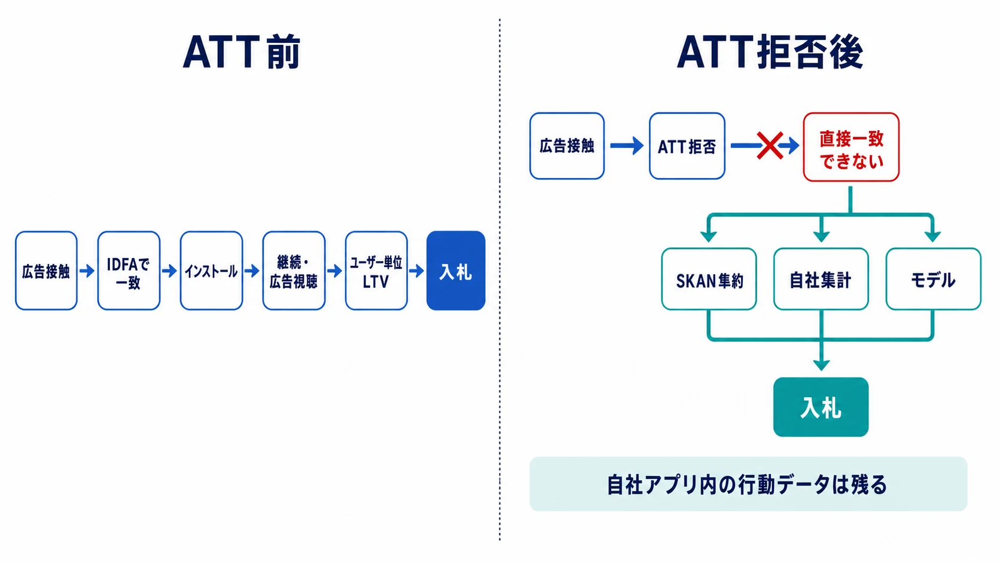
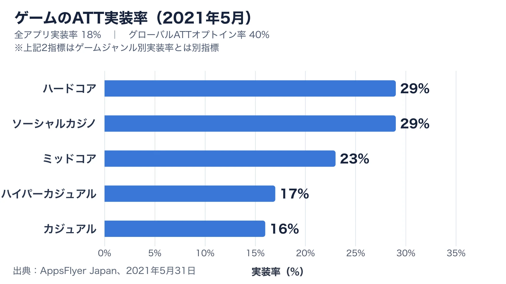
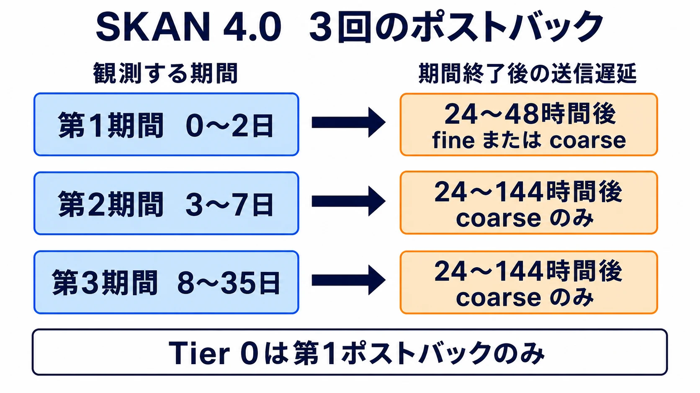
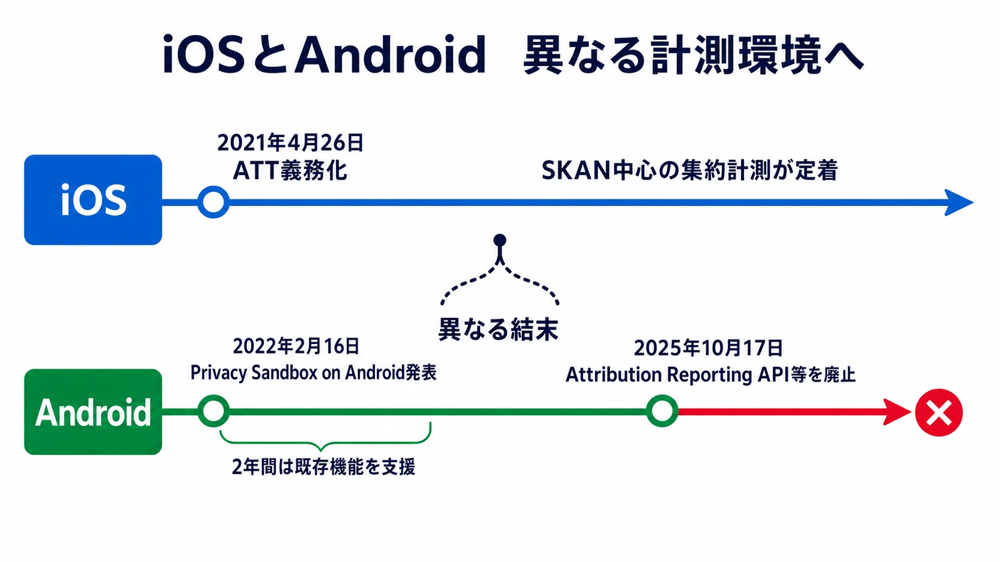

# 誰がいくら稼いだかが見えなくなった――ATT後の広告アトリビューション計測

***

## 第1章：ATTで崩れた「CPI◯円、LTV◯円」の対応関係

2021年4月26日、AppleはiOS 14.5の公開に合わせ、App Tracking Transparency（ATT）への対応をアプリ審査の要件とした。別企業が運営するアプリやWebサイトをまたいでユーザーを追跡する場合、アプリはシステムダイアログで許可を求めなければならない。許可を得られなければ、広告識別子IDFAはゼロ値になり、従来と同じ追跡はできない。[[1](#ref-1)][[2](#ref-2)]

この変更で失われたのは、広告接触からインストール、その後の継続プレイ、広告視聴収益までを **同じユーザーの履歴として結ぶ対応関係** である。CPIやLTVという指標そのものは残った。

従来は、広告識別子を使って「キャンペーンAからCPI80円で獲得したユーザーが、30日間で平均120円の広告収益を生んだ」とコホート単位に集計できた。したがって、120円を上回らない範囲で入札を続け、収益性の高い広告面・地域・クリエイティブへ予算を寄せる判断ができた。ATT後も、自社アプリ内のプレイイベントや広告売上が消えたわけではない。しかし同意しなかったユーザーについては、「どの広告がこのインストールを生み、そのユーザーが後にいくら稼いだか」を企業横断で直接結べなくなった。

式は残ったが、式へ入れるCPIとLTVを同じ獲得コホートへ正確に対応させにくくなったのである。本記事では、このシグナルロスに対して、AppleのSKAdNetwork（SKAN）、MMPの確率モデリング、広告ネットワークの機械学習入札、MMM、インクリメンタリティテストがどのように役割分担しているかを整理する。

***

## 第2章：広告収益ゲームのUA経済学――なぜ計測精度が事業の生死を分けるのか

UA（User Acquisition）は、広告費を投じてユーザーを獲得する活動である。広告収益を主軸とするスーパーカジュアル／ハイパーカジュアルでは、短いプレイサイクルと大量のインストールを前提に、1人あたりの薄い利益を積み上げる。近年のハイブリッドカジュアルは、これにアプリ内課金や長期進行を加えてLTVを伸ばすが、UAが成長のエンジンである点は共通している。

最低限押さえる指標は3つである。

- **CPI（Cost Per Install）**：広告費を、その広告から得たインストール数で割った獲得単価
- **LTV（Lifetime Value）**：1インストールがプレイ期間全体で生む期待収益。広告収益型なら広告視聴収益が中心となる
- **LTV/CPI比率**：獲得費に対して何倍の収益を得たかを示す単位経済性の目安

$$ \text{CPI} = \frac{\text{広告費}}{\text{獲得インストール数}} $$

$$ \text{LTV/CPI比率} = \frac{\text{1インストールあたりLTV}}{\text{CPI}} $$

LTV/CPIが1.0なら、ユーザー由来の収益と獲得費が同額である。開発費、人件費、計測費、収益予測の誤差などを吸収できないため、実務では余白が必要になる。2026年のゲーム向け財務モデル解説には、F2Pゲームの健全性を見る目安として、インストール後180日時点で1.5以上という基準が示されている。ただし、回収期間、地域、広告手数料、固定費、ジャンルで必要水準は変わるため、1.5は普遍的な合格線ではなく計画上の目安である。[[3](#ref-3)]

なお、現場ではこの比率を「ROI」と呼ぶことがあるが、用語を厳密に分けるなら、LTV/CPIは売上ベースのROASに近い。投資利益率としてのROIは、概念上は `(LTV - CPI) / CPI` である。本記事では混乱を避けるため、式そのものを「LTV/CPI比率」と呼ぶ。

広告収益ゲームで計測精度が特に重要なのは、LTVの源泉が多数の広告視聴へ分散するからだ。ユーザーが何日残り、何回セッションを開き、どの広告フォーマットを何回見て、各インプレッションがいくらを生んだかを積み上げてLTVを推定する。広告ネットワーク側も、獲得後の収益や継続を学習信号にして「この広告機会へいくらまで入札できるか」を予測する。

ここで獲得元と収益履歴の接続が弱くなると、次の3点が同時に不確かになる。

1. **チャネル評価**：安いインストールと、収益を生むインストールを区別しにくい
2. **入札最適化**：広告ネットワークへ返す成果信号が遅く、粗くなる
3. **投資回収判断**：観測されたROASが実力差なのか、欠測や集約単位の差なのか判別しにくい

ハイパーカジュアルは1件あたりの余白が薄いため、わずかなCPI上昇やLTV推定のずれでも大量配信時の損失へ増幅される。ATTは広告を出せなくしたのではなく、薄利多売を支えていたフィードバックループの解像度と速度を落としたのである。

既存記事「[モバイルゲームのKPI読み方入門](mobile-game-kpi-reading-guide.md)」ではCPI・LTVを含む主要指標の定義と落とし穴を広く扱っている。本記事は、同じ指標をATT後にどう観測し、どの手法を組み合わせて意思決定へ戻すかに焦点を絞る。

***

## 第3章：ATTとは何か――同意の仕組みとジャンル別インパクトの差

ATTは広告そのものへの同意ではなく、Appleが定義する「トラッキング」への許可を管理するフレームワークである。ここでいうトラッキングは、自社アプリで集めたユーザーまたはデバイスのデータを、別企業のアプリ、Webサイト、オフライン資産で集めたデータと結び、ターゲティング広告や広告効果測定に使う行為を指す。[[2](#ref-2)]

実装側は利用目的を示す文言を用意し、`requestTrackingAuthorization`でシステムダイアログを表示する。ユーザーが許可すればIDFAを取得できる。拒否、制限、未選択の状態では、IDFAを前提とする決定論的な照合は使えない。メールアドレスなど別の識別子へ置き換えて同じ追跡を続けることも、Appleは許可していない。[[2](#ref-2)]

導入直後の数字は、ゲームジャンルによって備えが均一ではなかったことを示す。AppsFlyerが2021年5月17日から24日までを含む1,590アプリのデータで公表した週次調査では、全アプリとゲームジャンル別のATT実装率、グローバルのオプトイン率が示された。結果は次のグラフのとおりである。[[4](#ref-4)]

このグラフのジャンル別数値は **オプトイン率でも、被害の大きさでもなく、アプリ側の実装率** である。したがって「ハイパーカジュアルの影響が17%だった」と読むのは誤りだ。AppsFlyer自身は、ユーザー情報に依存する広告収益の比重が大きいハイパーカジュアルで実装が進んでいない状況を指摘していた。広告収益依存ジャンルほど、IDFAを失ったときにターゲティング、広告単価、獲得元別LTVの三方から影響を受けやすいという構造的な脆弱性があったのである。[[4](#ref-4)]

一方、課金収益の比重が高いゲームは、アカウント、課金、ゲーム内行動といったファーストパーティデータを持ちやすい。ATTの影響が小さいという意味ではないが、自社内で観測できる価値信号の種類と回収期間が異なる。この差が、後の計測設計にも表れる。

***

## 第4章：SKAdNetwork 4.0――何が測れて、何が測れなくなったのか

SKAdNetworkは、Appleが広告ネットワーク向けに提供するプライバシー保護型の広告アトリビューション機構である。ATTの許可状態にかかわらず利用でき、Appleが広告接触とApp Store経由のインストールを判定して、署名付きポストバックを返す。IDFAを広告主へ渡さず、キャンペーン成果を一定の集約度で知らせる仕組みである。[[5](#ref-5)]

### fine-grainedとcoarse-grained

SKAN 4.0では、アプリがインストール後の価値を2種類のコンバージョン値へ符号化する。

- **fine-grained conversion value**：0〜63の64段階。チュートリアル完了、一定回数の広告視聴、推定収益帯などを細かく割り当てられる。ただし基本的に第1ポストバックだけが対象で、十分なクラウドアノニミティが必要である[[6](#ref-6)]
- **coarse-grained conversion value**：`low`、`medium`、`high`の3段階。fineより情報量は少ないが、低いプライバシー階層や後続ポストバックでも使われる。3段階の意味はAppleが固定せず、アプリ側が定義する[[6](#ref-6)][[7](#ref-7)]

たとえば広告収益ゲームなら、fine値を「D0の広告視聴回数と推定収益帯の組み合わせ」に割り当て、coarse値を「低価値・中価値・高価値」の予測群として定義できる。ただし64通りへ何を詰めるかは設計問題であり、保持、進行、広告視聴、課金のすべてを無損失で入れることはできない。

### クラウドアノニミティとプライバシー階層

Appleは、広告を表示したアプリまたはドメイン、広告対象アプリ、国、広告ネットワークが付与するsource identifierなどの組み合わせに対して、クラウドアノニミティを評価する。SKAN 4.0のポストバックデータ階層はTier 0〜3で、母数が大きいほど上位の情報を返せる。[[6](#ref-6)]

| 階層 | 第1ポストバックで得られる主な情報 | 後続ポストバック |
|---|---|---|
| Tier 3 | fine値、2〜4桁のsource identifier、媒体アプリ／ドメイン、条件により国 | coarse値を受け取れる |
| Tier 2 | fine値、2〜4桁のsource identifier | coarse値を受け取れる |
| Tier 1 | coarse値、2桁のsource identifier | coarse値を受け取れる |
| Tier 0 | 2桁のsource identifier。コンバージョン値なし | 送られず、第1ポストバックのみ |

ここで重要なのは、少額予算でキャンペーンを細かく分割すると、単にサンプルが減るだけでなく、プライバシー保護によって返るフィールド自体が粗くなり得る点である。国、媒体、クリエイティブを細分化しすぎるほど、欲しい粒度を失う逆説が起こる。

### 3回のポストバック

SKAN 4.0は、初回起動を起点に最大3つのコンバージョン期間を持つ。[[6](#ref-6)]

| 回 | コンバージョン期間 | 主な用途 | 期間終了後のランダム遅延 |
|---|---|---|---|
| 第1ポストバック | 0〜2日 | 初回起動、序盤進行、早期広告収益、早期課金 | 24〜48時間 |
| 第2ポストバック | 3〜7日 | D3〜D7の継続・価値帯 | 24〜144時間 |
| 第3ポストバック | 8〜35日 | 長期継続・後発価値帯 | 24〜144時間 |

アプリは期間の終了前に値をロックし、ポストバックを早めることもできる。その代わり、ロック後の行動は同じ期間の値へ反映できない。つまり「早く入札へ返すこと」と「より長く観測して精度を上げること」はトレードオフになる。

### 旧来の計測との違い

SKANが返すのは、遅延と秘匿化を伴う、キャンペーン成果の限られた符号である。「この安定したユーザーIDの人が、何時何分にインストールし、何日後にいくら稼いだ」という生ログは返らない。

| 観点 | IDFAを使った従来計測 | SKAN 4.0 |
|---|---|---|
| 単位 | ユーザー／デバイス単位で接続 | ポストバック単位の集約成果 |
| インストール時刻 | 比較的細かく保持可能 | ランダム遅延により正確な時刻を隠す |
| 行動イベント | 設計したイベント列を詳細に送れる | fine 64段階またはcoarse 3段階へ圧縮 |
| 長期価値 | 同一ユーザーの履歴として追跡 | 3期間の離散的な価値帯で観測 |
| キャンペーン粒度 | 広告セットやクリエイティブまで細分化しやすい | 母数が小さいと階層が下がり情報が粗くなる |
| ATT同意 | IDFA利用には同意が必要 | ATT同意に依存せず動作 |

SKANは、インストールへの広告寄与をAppleが決定論的に判定し、プライバシーを守りながら一定の成果を返す仕組みである。一方で、従来のユーザー履歴を復元する代替物ではない。この、測れる範囲と測れない範囲の両方が、次章のモデル利用を理解する鍵になる。

***

## 第5章：シグナルロスへの業界的対応――確率モデリングと機械学習入札

ATT後の実務は、決定論的に観測できる小さな領域、SKANの集約成果、自社のファーストパーティデータ、統計モデルを重ねる構成へ変わった。単一の新指標へ置き換わったわけではない。

### MMPは「個人を当てる」のではなく、集約成果を推定する

AppsFlyerやAdjustのようなMMP（Mobile Measurement Partner）は、広告媒体ごとに異なるデータを受け取り、アトリビューションとレポーティングを仲介する。AppsFlyerは、広告IDやリファラによる決定論的照合が使えない場合、ユニークIDに依存しない統計手法でキャンペーン単位の成果を推定すると説明している。[[8](#ref-8)] Adjustも、決定論的アトリビューションを主手法、機械学習を使う確率モデリングを補助手法として区別している。[[9](#ref-9)]

ここでの「確率的」とは、時間帯、広告接触、端末の限定的な情報、同意済みデータ、SKAN、自社成果など、利用可能な範囲のシグナルから、キャンペーン全体として何件程度の成果が生じたかを推定するという意味である。見えないユーザーを正確に復元するわけではなく、出力は推定値であり、信頼区間、モデルの仮定、重複計上の可能性を伴う。

また、Appleの方針を回避するための抜け道でもない。AdjustがiOS 14.5以降で確率モデリングを案内している範囲には、オウンドメディア、クロスプロモーション、同意済みのWeb-to-Appなどの条件がある。MMPの名称だけを見て、ATT拒否ユーザーを自由に個人照合できると考えてはならない。[[9](#ref-9)]

### AppLovin AXON――粗い成果信号から期待値を予測する

広告ネットワーク側では、入札の自動化がさらに重要になった。AppLovinのAXONは、広告接触、クリック、アプリやサイトでの関与、コンバージョン確率、支払確率、購入額、反復行動などの期待値分布を予測し、リアルタイムの広告投資配分に使う機械学習システムである。AppLovinは2023年4月にAXON 2を展開したと説明している。[[10](#ref-10)]

ATT後のAppLovin事例は、配信最適化と成果計測の二層で捉えると分かりやすい。配信側では、広告が表示されるアプリや配置、端末・時間帯、クリエイティブへの反応など、個人ID以外のコンテクスチュアルなシグナルを含む利用可能な情報からAXONが将来価値を予測する。計測側では、AppLovinのSDKとExchangeがSKANをサポートし、プライバシー保護済みの成果を広告運用へ戻せる。[[11](#ref-11)] この組み合わせにより、個人単位の完全な履歴がなくても、統計的な期待値に基づく機械学習入札を続けられる。

ただし、公開資料から確認できるのは、AXONによる期待値予測とAppLovinプラットフォームのSKAN対応までである。モデル内部の特徴量、SKANポストバックを直接入力する方法、SKAN値の重み、推定式は開示されていない。「コンテクスチュアルターゲティングとSKANをこの比率で組み合わせる」といった内部仕様まで断定することはできない。実務上は、広告主が望むイベントをコンバージョン値へどう符号化し、十分な母数を保ち、ネットワークへ安定した学習信号を返すかが担当側の設計範囲となる。

### MMMとインクリメンタリティは代替ではなく併用する

ユーザー単位アトリビューションが弱くなると、集約データを使うMMM（Media Mix Modeling）と、広告を出さなかった対照群との差を見るインクリメンタリティテストが注目される。

- **アトリビューション**：日次の運用やクリエイティブ改善に使う。速く細かいが、観測可能な接点とルールに依存する
- **インクリメンタリティテスト**：地域やユーザー群を分け、広告がなければ起きなかった純増分を因果的に推定する。チャネルの上乗せ効果を検証する
- **MMM**：週次・地域別などの広告費、売上、季節性、競合、施策を集約し、中長期のチャネル寄与と予算配分を推定する

Adjustは、この3つを短期・中期・長期で相互補完する計測の三本柱として整理している。[[12](#ref-12)] GoogleのMMM「Meridian」も、インクリメンタリティ実験の結果を事前分布の調整に利用できる一方、実験とMMMでは測る対象や条件が一致しない場合があると明記する。[[13](#ref-13)]

したがって、MMMだけで毎日のクリエイティブ入札を決めることも、短期のSKAN結果だけで広告の純増効果を証明することも難しい。日次運用はSKANとMMP、因果の確認はインクリメンタリティ、全体予算はMMMというように、異なる問いへ異なる道具を当てる必要がある。

***

## 第6章：Androidは追随しなかった――Privacy Sandboxの縮小と2026年の非対称性

2022年2月16日、GoogleはPrivacy Sandbox on Androidを発表した。広告IDを含むアプリ横断識別子に依存せず、ユーザーデータの第三者共有を抑える広告技術を複数年で構築する計画であり、既存の広告プラットフォーム機能は少なくとも2年間支援するとしていた。[[14](#ref-14)]

計画には、広告接触と成果を結ぶAttribution Reporting API、端末上のオークションでリマーケティングを支えるProtected Audience、関心カテゴリを扱うTopics、広告SDKをアプリ本体から隔離するSDK Runtimeなどが含まれた。[[14](#ref-14)] このため業界では、Androidも時間をかけて広告ID依存を縮小し、iOSに近い集約計測へ進むとの見方が広がった。

その想定は2025年に崩れた。Googleは **2025年10月17日**、エコシステムから得た期待価値への反応と「低い採用水準」を理由に、Attribution Reporting API、Protected Audience、Topics、SDK Runtimeなどを廃止すると公式発表した。Attribution Reporting、Protected Audience、TopicsはChrome版とAndroid版の両方が対象である。[[15](#ref-15)]

### 採用率と独禁法上の圧力を分けて読む

Googleが廃止理由として明記したのは、低い採用率とエコシステムからのフィードバックである。独禁法上の圧力を「Google公式の廃止理由」と書くことはできない。

一方で、Privacy Sandboxの設計と展開が競争政策上の監視を受け続けたことも事実である。英国Competition and Markets Authority（CMA）は、Googleの広告技術への自己優遇、追跡機能への不平等なアクセス、Chrome利用者への不公正な条件を懸念し、2021年から調査した。Googleは2022年に競争上の懸念へ対応する法的拘束力のあるコミットメントを受け入れ、CMAの監督下で開発とテストを進めた。CMAはGoogle自身の広告技術を競合より優遇しないよう設計を拘束していたと説明している。[[16](#ref-16)]

興味深いことに、CMAがコミットメントを解除した日も2025年10月17日である。これは規制対応とプロジェクトの終結が同じ時期に収束したことを示すが、同日であることだけから「規制当局が廃止させた」と因果を断定することはできない。正確な整理は、 **採用不足が公式の廃止理由であり、競争当局の圧力は設計・展開を制約した重要な背景条件** というものである。

### 2026年に残った非対称性

2026年時点でも、Android Advertising ID（AAID）はユーザーがリセット・削除できる広告識別子として提供され、Google Playは広告目的で利用可能な場合、他の端末識別子ではなくAAIDを使うよう求めている。ユーザーが削除した端末ではゼロ値となるが、iOSのように各アプリが統一されたATTダイアログで事前許可を得なければIDへアクセスできない仕組みとは異なる。[[17](#ref-17)]

| 観点 | iOS | Android |
|---|---|---|
| アプリ横断広告ID | IDFA。ATT許可が必要 | AAID。ユーザーがリセット・削除可能 |
| 非同意／削除時 | IDFAはゼロ値 | 削除済みAAIDはゼロ値 |
| プライバシー保護型アトリビューション | SKANが稼働 | Android版Attribution Reporting APIは廃止対象 |
| 実務上の粒度 | 非同意層は集約・遅延・モデル中心 | AAIDやPlay Install Referrerによる決定論的計測を使える範囲が相対的に広い |

つまり、「iOSで先に起きた変化が数年遅れてAndroidにも同じ形で来る」という単線的なロードマップは失われた。2026年のUA設計は、OSごとに別の計測環境を前提にする必要がある。iOSはSKANの集約信号とモデルを中心にし、Androidはユーザーの選択とGoogle Playポリシーを守りながらAAIDやInstall Referrerを使う。この非対称性は現時点で固定化しているが、将来のOS方針や規制まで不変だと保証するものではない。

***

## 第7章：課金モデルのゲームに話を広げる――違いと共通点

広告収益ゲームと課金モデルゲームの差は、「自社だけで収益シグナルをどこまで観測できるか」にある。

課金モデルでは、購入商品、金額、通貨、購入時刻、プレイヤーアカウント、ゲーム内進行を自社のバックエンドで管理できる。これらはファーストパーティデータであり、ATT拒否によって自社内の課金記録まで消えるわけではない。全体売上、課金者転換、課金者別LTV、コンテンツ別売上は引き続き観測できる。

広告収益モデルでも、自社アプリ内で広告が表示された事実や、メディエーションから返るインプレッション収益は記録できる。しかし収益の発生が大量の広告接触へ分散し、獲得元との接続と広告ネットワーク側のユーザー価値予測に強く依存する。薄い利幅でUAを回すゲームほど、接続の精度が事業計画へ直結する。

2026年のAppsFlyer調査では、ハイパーカジュアルの79%がIAA（アプリ内広告）のみ、ミッドコアの90%がIAP（アプリ内課金）のみという収益構成だった。またハイパーカジュアルは60日分の広告収益の63%を初日に生み、IAA全体でも60日分の89%が7日目までに生じていた。広告収益型では早期シグナルが強い一方、課金型では長い観測期間が重要になることを示している。[[18](#ref-18)]

有料UAで獲得したユーザーについて「どの広告費がどの課金を生んだか」を結ぶ段階では、課金モデルも同じ制約を受ける。自社は100万円の課金が発生したことを知っていても、そのうち何万円がキャンペーンAの純増で、どれだけがオーガニックだったかは、SKAN、同意済み計測、モデル、実験を使わなければ判断しにくい。課金モデルも、ATTの制約から外れているわけではない。

整理すると次のようになる。

| 論点 | 広告収益ゲーム | 課金モデルゲーム |
|---|---|---|
| 主な収益シグナル | 広告視聴回数・インプレッション収益 | 自社の購入・アカウント・商品データ |
| ATT後も自社内で見えるもの | プレイ行動、広告表示、受け取った広告収益 | プレイ行動、課金者、金額、購入商品 |
| 特に失う接続 | 獲得広告→継続→広告視聴収益 | 獲得広告→長期継続→課金 |
| 事業への相対的な影響 | 薄利大量獲得では計測誤差が損益へ直結 | 自社売上は見えるが、有料UAの配分精度が落ちる |
| 重視する補完 | 早期CV設計、広告収益予測、機械学習入札 | 課金イベント設計、長期LTV予測、インクリメンタリティ |

課金モデルでは自社の収益台帳が残るぶん、広告収益ゲームほどアトリビューション精度だけに事業存続を預けずに済む。ただしUA予算を大きくするほど、誤ったチャネルへ投資する損失も大きくなる。違いは制約の有無ではなく、制約が損益へ伝わる速さと、自社内に残る代替シグナルの厚さである。

***

## 第8章：まとめ・確認表――2026年の計測設計

ATT後の広告アトリビューションでは、単一の「正解データ」を探す発想から離れる必要がある。観測できる事実、Appleが返す集約値、モデルの推定、実験で得る因果効果を区別し、同じダッシュボードへ載せる場合も出所を明示することが重要である。

| 項目 | 2026年時点の状態 | 測れるもの | 主な制約 | 実務上の対応 |
|---|---|---|---|---|
| ATT | iOS 14.5以降でアプリ横断追跡に許可が必要 | 同意者はIDFAを使う決定論的計測が可能 | 非同意者を別識別子で追跡できない | 同意画面を正しく設計し、非同意を前提に計測計画を作る |
| SKAN 4.0 | ATT同意に依存せず稼働 | 広告由来インストール、fine／coarse値、最大3回のポストバック | 集約、遅延、階層による欠落、ユーザー単位の生ログなし | CV設計を事業KPIへ結び、キャンペーンを細分化しすぎない |
| MMP確率モデリング | 決定論的データがない領域を統計的に補完 | キャンペーン単位の推定成果 | 個人履歴の復元ではなく、仮定と誤差を伴う | 推定値と確定値を分け、重複とモデル変更を監視する |
| 機械学習入札 | 粗い成果信号から将来価値を予測 | 入札ごとの期待収益・コンバージョン確率 | 学習信号の遅延、CV設計、ブラックボックス性 | 早期価値イベントと十分な母数を確保し、短期変動で学習を乱さない |
| MMM | 集約された時系列・地域データで寄与を推定 | 中長期のチャネル寄与、予算配分 | 日次・クリエイティブ単位の運用には粗い | 季節性や競合を入れ、実験結果で校正する |
| インクリメンタリティ | 対照群との差から純増を測る | 広告がなければ起きなかった因果効果 | 実験コスト、検出力、適用範囲 | 重要チャネルを定期検証し、MMMと日次計測を補正する |
| Android Privacy Sandbox | 主要な広告API群は2025年10月17日に廃止決定 | 廃止前の試験APIによる計測構想 | 本番の共通代替基盤にならなかった | iOSと同一の将来像を前提にせず、OS別に設計する |
| Android AAID | リセット・削除可能な広告IDとして継続 | 利用可能な端末での広告計測と最適化 | 削除時はゼロ値。ポリシーと地域法令の順守が必要 | AAIDとInstall Referrerを適切に使い、iOS指標と安易に合算しない |

広告収益ゲームが取るべき要点は、早期広告収益を予測できるコンバージョン値の設計、十分なキャンペーン母数、MMPと広告ネットワークのモデル監視、定期的なインクリメンタリティ検証である。課金モデルゲームでは、課金と進行のファーストパーティデータを長期LTVへ結びながら、SKANの早期信号が将来課金をどれだけ予測できるかを検証する。

プランナーが見るべきなのは、その数字のうち、どこまでが直接観測で、どこからが集約、推定、外挿なのかである。ダッシュボードのROASが小数点以下まで表示されているかどうかは重要ではない。ATT後の計測精度とは、異なる確かさの証拠を区別しながら投資判断を更新できる能力を指す。失われたユーザーIDを無理に取り戻すことではない。

***

## References

1. [Upcoming AppTrackingTransparency requirements][1] - AppleによるATT要件の適用日（2021年4月26日）と、非許可時のIDFAの扱い。

2. [User Privacy and Data Use][2] - Appleによるトラッキングの定義、ATTの同意、IDFAおよび代替識別子の扱い。

3. [GameTech Financial Model: Player LTV, Monetization Metrics, and UA Economics][3] - LTV/CPI比率1.5以上というF2P財務モデル上の目安と、ジャンル別の単位経済性。

4. [iOS14とATTフレームワークに関するユーザー動向レポート][4] - AppsFlyer Japanによる2021年5月のATT実装率、オプトイン率、ゲームジャンル別実装率。

5. [SKAdNetwork][5] - AppleによるSKAdNetworkの役割、ATTからの独立性、ポストバックの基本構造。

6. [Receiving postbacks in multiple conversion windows][6] - SKAN 4.0の3期間、送信遅延、Tier 0〜3と各階層で返るデータ。

7. [SKAdNetwork.CoarseConversionValue][7] - coarse値の`low`、`medium`、`high`と、各値の意味をアプリ側が定義する仕様。

8. [About probabilistic modeling][8] - AppsFlyerによるユニークIDに依存しない、キャンペーン単位の確率モデリングの説明。

9. [Adjust's attribution methods][9] - 決定論的アトリビューションと、機械学習を使う確率モデリングの区別と適用範囲。

10. [The AppLovin business model][10] - AXON 2が予測する行動と期待値分布、リアルタイム広告投資配分の説明。

11. [SKAdNetwork (SKAN) - AppLovin Support Center][11] - AppLovin SDKおよびExchangeにおけるSKAN対応経路。

12. [Attribution, incrementality, and MMM: The next-gen mobile marketing measurement triad][12] - アトリビューション、インクリメンタリティ、MMMを補完的に使う考え方。

13. [Calibrate treatment priors - Meridian][13] - インクリメンタリティ実験でMMMを校正する方法と、両者の測定対象が異なる場合の注意。

14. [Introducing the Privacy Sandbox on Android][14] - Googleによる2022年2月16日の発表と、広告IDに依存しない複数年計画。

15. [Update on Plans for Privacy Sandbox Technologies][15] - Googleによる2025年10月17日の主要API廃止発表と公式理由。

16. [Investigation into Google's Privacy Sandbox browser changes][16] - 英国CMAの競争上の懸念、Googleへのコミットメント、2025年10月17日の解除。

17. [Advertising ID - Play Console Help][17] - Android Advertising IDの継続提供、リセット・削除、Google Playポリシー。

18. [The State of App Monetization - 2026 Edition][18] - ハイパーカジュアルとミッドコアの収益モデル構成、IAA収益の早期集中。

[1]: https://developer.apple.com/news/?id=ecvrtzt2
[2]: https://developer.apple.com/app-store/user-privacy-and-data-use/
[3]: https://revenuemap.app/blog/gametech-financial-model
[4]: https://prtimes.jp/main/html/rd/p/000000040.000016963.html
[5]: https://developer.apple.com/documentation/storekit/skadnetwork
[6]: https://developer.apple.com/documentation/storekit/receiving-postbacks-in-multiple-conversion-windows
[7]: https://developer.apple.com/documentation/storekit/skadnetwork/coarseconversionvalue
[8]: https://support.appsflyer.com/hc/en-us/articles/40188089592209-About-probabilistic-modeling
[9]: https://help.adjust.com/en/article/attribution-methods
[10]: https://www.applovin.com/en/blog/applovin-business-model
[11]: https://support.applovin.com/en/max/demand-partners/demand-side-platforms/skadnetwork-skan
[12]: https://www.adjust.com/blog/attribution-incrementality-mmm/
[13]: https://developers.google.com/meridian/docs/advanced-modeling/roi-priors-and-calibration
[14]: https://blog.google/products-and-platforms/platforms/android/introducing-privacy-sandbox-android/
[15]: https://privacysandbox.google.com/blog/update-on-plans-for-privacy-sandbox-technologies
[16]: https://www.gov.uk/cma-cases/investigation-into-googles-privacy-sandbox-browser-changes
[17]: https://support.google.com/googleplay/android-developer/answer/6048248
[18]: https://www.appsflyer.com/resources/reports/app-marketing-monetization-report/

----

この文書は、Perplexity、Claude、OpenAI Codex の3つのAIの支援を受けて著述されたものです。引用画像を除き、MIT License にて提供されています。
