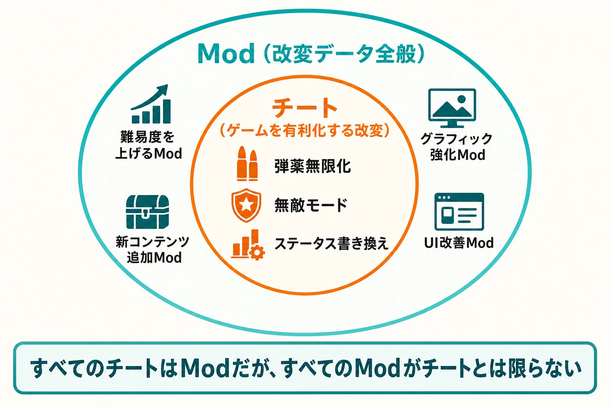
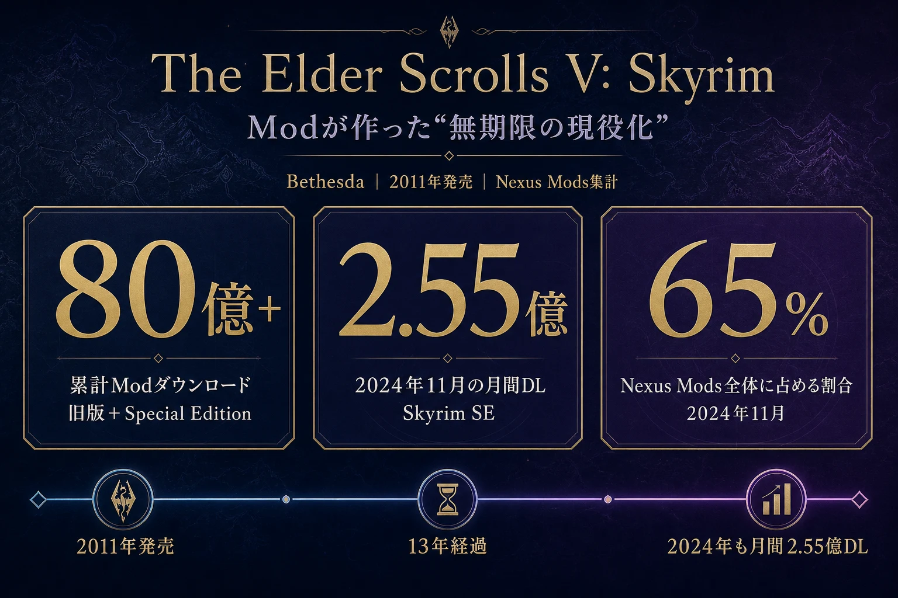
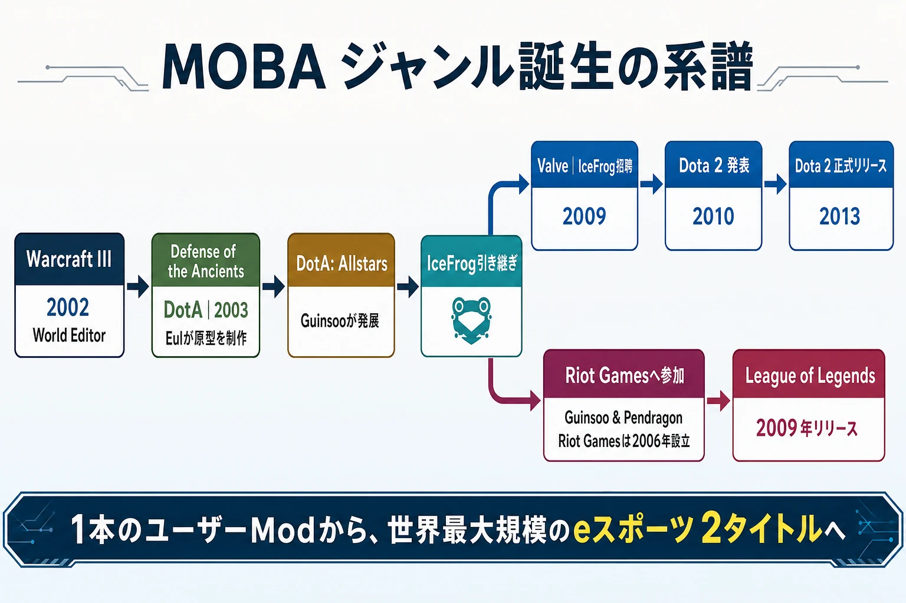
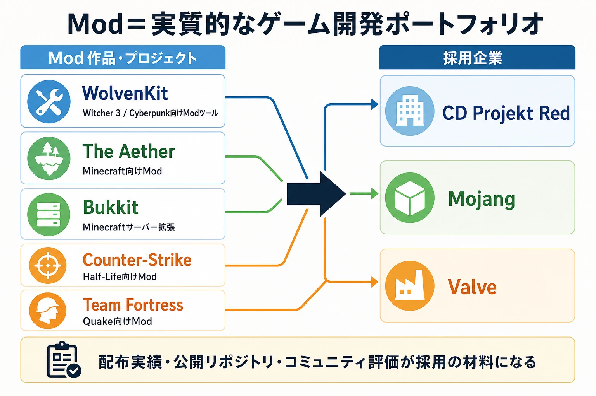
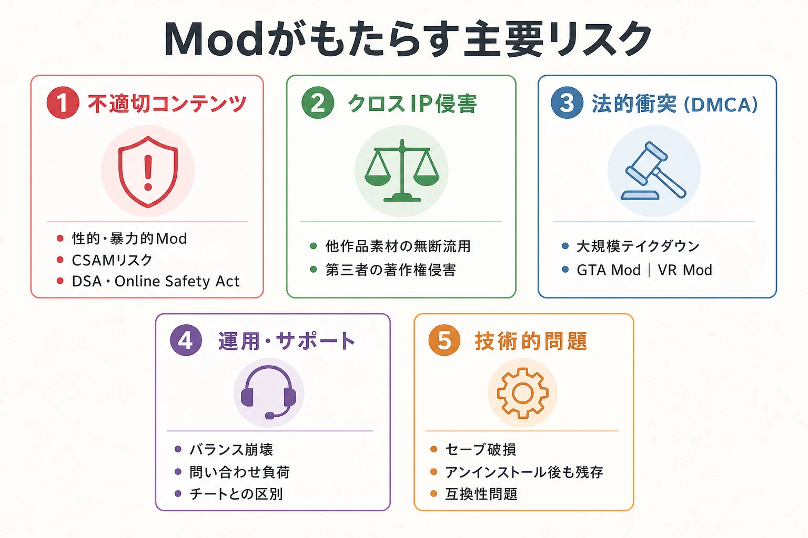
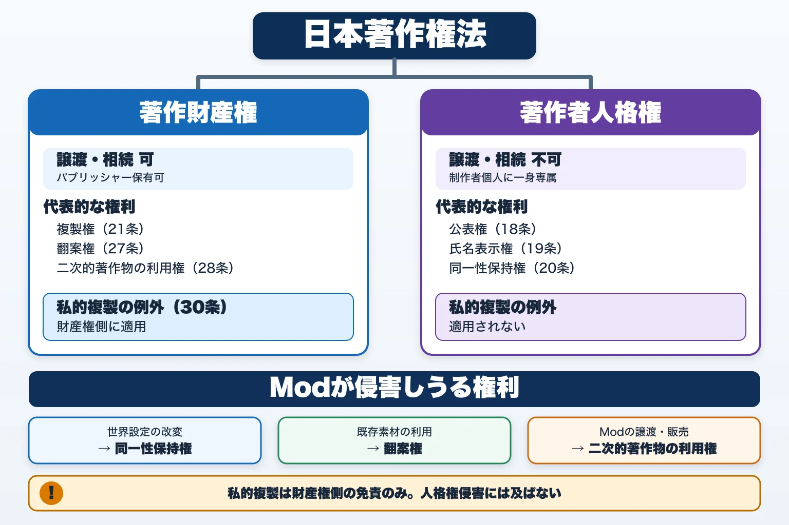
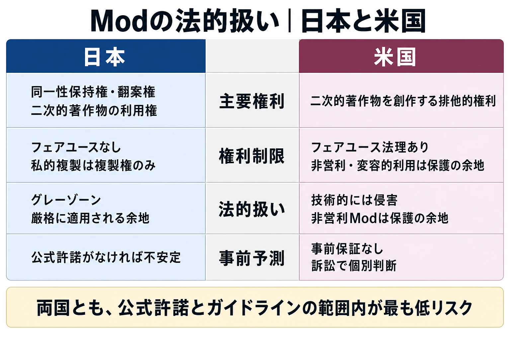
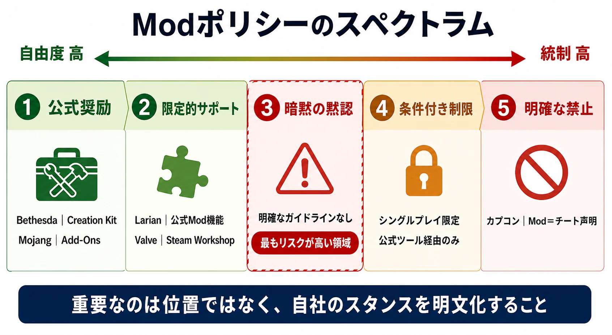
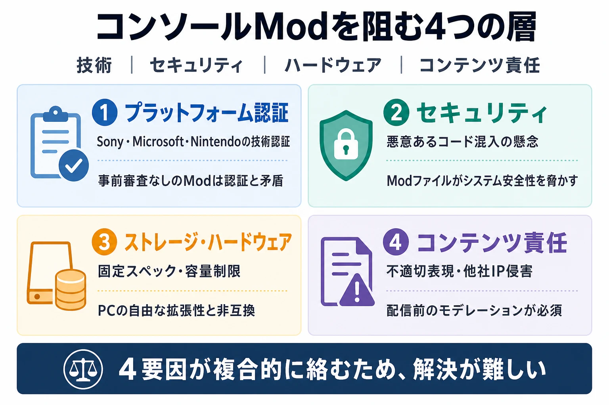

# Modの功罪：ゲーム文化・法律・開発者の視点から読み解く

***

## はじめに：Modとは何か

**Mod（モッド）** とは、"Modification"の略称であり、主にPCゲームにおいてメーカー以外の第三者が制作した改造データのことを指す。Modを導入することで、グラフィックの強化、新たなゲームシステムの追加、ステージ・キャラクターの変更など、元のゲームを大きく変容させることができる。メーカー公式の追加コンテンツ（DLC）とは異なり、大半のModはユーザーが無償で配布する「非公式DLC」である。[[1](#ref-1)]

Modはチートとよく混同されるが、概念上は明確に異なる。チートが「ゲームを有利に進めるためのデータ改変」を意味するのに対し、Modは「改変データ全般」を指し、難易度を上げるものや、まったく新しいコンテンツを追加するものも含む。[[1](#ref-1)]

***

## Part 1：文化的背景 ― なぜ欧米で根付き、日本では広まらなかったのか

### PCゲーム文化の差

欧米でModが当たり前になった最大の理由は、ゲームプラットフォームの差にある。欧米ではPCゲームが長く主流であり、PCというオープンな環境は物理的・ソフトウェア的な改変に親和性が高い。一方、日本ではコンソール（家庭用ゲーム機）が優勢であり、その時点でMod文化はマイナーな位置づけになった。[[2](#ref-2)]

日本のゲーム文化においてModが根付かなかった背景には、「工業製品を自分でカスタムしたり修理する権利の延長」という欧米的発想の欠如もある。欧米では、買ったものを自分流に改造するのは自然な権利とみなされる傾向が強く、これがゲームModの倫理的な土台になっている。[[3](#ref-3)]

### 著作権意識とフェアユース文化の差

日本では、著作権を「しっかり守るべきもの」とする風土が欧米よりも強く、欧米的な「フェアユース文化」は浸透していない。さらに日本では、Mod文化が長らくゲームROMのコピー（いわゆる「割れ」）と不可分のものとして認知されており、ダークゾーンとして忌避反応が形成されてきた経緯がある。これは欧米とは大きく異なる文化的文脈である。[[4](#ref-4)][[5](#ref-5)]

***

## Part 2：Modの「功」― 成功事例から学ぶ

### ゲームの寿命を劇的に延ばす

Modがゲームの商業的寿命を延ばした最も顕著な例が、**『The Elder Scrolls V: Skyrim』**（Bethesda、2011年）だ。発売から十数年が経過した2024年末時点でも、Mod配布プラットフォーム「Nexus Mods」では旧バージョンのModダウンロード数が20億回を突破した。さらに現行版である『Skyrim Special Edition』向けModのダウンロードを加算すると、合計80億回以上という前代未聞の数字を記録している。2024年11月だけでも、Skyrim SEは月間2億5500万ダウンロードを記録し、Nexus Mods全体のダウンロードの約65%を占めた。[[6](#ref-6)][[7](#ref-7)]

このことは、Modが単なるオプション機能ではなく、ゲームの「無期限の現役化」を実現する商業的エンジンになり得ることを示している。

### MOBAという新ジャンルを生んだ歴史的連鎖

Modが生んだ最も影響力のある成功事例のひとつが、**MOBAジャンルの誕生** だ。

- **Defense of the Ancients（DotA）**：Blizzard Entertainmentの『Warcraft III: Reign of Chaos』（2002年）のWorld Editorで制作されたマルチプレイ用カスタムマップ。ユーザーEulが原型を作り、後にGuinsoo（Steve Feak）が『DotA: Allstars』としてアイテム・ヒーローを大幅に追加、さらにIceFrogが引き継いで完成度を高めた。[[8](#ref-8)][[9](#ref-9)]
- **Dota 2（Valve）**：DotAに注目したValveが2009年にIceFrogを開発リーダーとして迎え、2010年に公式続編Dota 2を発表、2013年に基本プレイ無料タイトルとしてリリースした。[[9](#ref-9)]
- **League of Legends（Riot Games）**：DotAコミュニティを離れたGuinsooとPendragonがRiot Games（2006年設立）に加わり、DotAの設計を発展させた独立タイトルとして2009年にLeague of Legendsをリリース。現在では世界最大規模のeスポーツタイトルの一つへと成長した。[[10](#ref-10)]

この系譜は、一人のユーザーが作ったModが、数十億ドル規模の新ジャンルを創出した歴史的な例として語り継がれている。

### Counter-Strike、Team Fortress 2：Valveが獲得したModたち

**Counter-Strike** は、Minh "Gooseman" LeとJess Cliffeが1999年に制作した『Half-Life』向けModとして始まった。チームベースの戦術的リアリズムを追求したゲームプレイは爆発的な支持を集め、ValveはModの成功を見てIPを取得。2000年に単体タイトルとして正式リリースした。この決断がCSシリーズ、さらには現在のCS2へと続く20年以上の歴史を作った。[[11](#ref-11)]

**Team Fortress** は、1996年の『Quake』向けModとして誕生し、後にValveがポートを依頼。これが『Team Fortress Classic』（1999年）、そして『Team Fortress 2』（2007年）へと繋がった。ValveはModクリエイターを獲得することで、コアとなるIPを社内に取り込むという戦略を確立した。[[12](#ref-12)][[13](#ref-13)]

### Minecraftのエコシステム：コミュニティが作った巨大経済圏

**Minecraft**（Mojang）はMod文化において特別な地位を占める。初期からコミュニティ主導でMod開発が活性化し、現在では巨大なエコシステムになっている。Mod配布プラットフォームのCurseForge（運営はOverwolf）には17万人以上のMod作者が参加しており、2025年単年でのModダウンロードは320億回を超える見込みとされる。最大のコミュニティであるMinecraftに限っても、24万以上のModが公開され、累計ダウンロードは930億回に達している。[[14](#ref-14)]

ModはMinecraftの寿命を大幅に延ばすとともに、新しい経済圏も生み出している。CurseForgeは広告収益の70%をMod作者に分配しており、こうした仕組みは単なるホビーを超えた「創作者経済（Creator Economy）」の一例となっている。[[15](#ref-15)][[16](#ref-16)]

### Modが育てた開発者たち

Modコミュニティはゲーム業界への入口（パイプライン）としても機能している。具体的な採用事例：

- **CD Projekt Red**：Witcher 3・Cyberpunk向けのModツール「WolvenKit」の開発チームを採用[[17](#ref-17)]
- **Mojang**：Minecraft「The Aether」Modの制作者や「Bukkit」チームを採用[[17](#ref-17)]
- **ValveによるCounter-Strike・Team FortressのModクリエイター採用**（前述）

このように、優れたModを作ることは実質的なゲーム開発ポートフォリオとして機能し、デベロッパーへの就職・採用の実績例が多数存在する。[[18](#ref-18)]

***

## Part 3：Modの「罪」― 批判と問題事例

### 性的表現・不適切コンテンツのMod

Modの最大の「罪」の一つが、**性的コンテンツや暴力的な改変データの流通** だ。Nexus Modsのようなプラットフォームでは、ポルノグラフィックなModや過激な暴力表現など、年齢制限・違法性の判定が必要になるコンテンツも扱われてきた。[[19](#ref-19)]

2025年には、Nexus ModsはEUの「デジタルサービス法（DSA）」および英国の「オンライン安全法（Online Safety Act）」への対応として、英国・EU利用者向けに成人向けコンテンツの年齢確認を導入していく方針を発表した。さらにChild Sexual Abuse Material（CSAM）の自動検知システムを導入し、発見次第削除して英国の国家犯罪局（NCA）へ報告すると説明している。[[20](#ref-20)][[21](#ref-21)]

これらのコンテンツは、当該ゲームのキャラクターの著作権・商標権を侵害するだけでなく、開発元のブランドイメージや社会的信頼を著しく傷つける。特に日本の開発元にとっては、こうしたModが無断で作られ流通することへの拒否反応が強く、Mod文化全体への不信感につながっている。

### 著作権侵害リスク：他IPからの素材流用

Modには他の著作物を無断で持ち込む問題もある。たとえば「Thomas the Tank Engine（きかんしゃトーマス）」のモデルをあらゆるゲームに挿入するような改変は、サードパーティの著作権を直接侵害する。このような「クロスIP流用」Modは文化的には面白がられるが、法的には複数の権利を同時に侵害するリスクを抱えている。[[22](#ref-22)]

### DMCAによるMod弾圧：GTA事件

Modを取り巻く法的緊張が顕在化した事件として、**Take-Two InteractiveによるGTA Modへの大規模DMCA申請** がある。2021年、Take-TwoはGTAシリーズの旧作Modを対象とした大量のDMCAテイクダウン通知を発行し、多数のModがGitHubや配布サイトから削除された。2022年には、GTA 5およびRed Dead Redemption 2のVR化Modを制作していたLukeRossも同様にDMCA通知を受けた。開発元が寛容でない場合、Mod制作者は一夜にして全作品を失うリスクを負うことになる。[[23](#ref-23)][[24](#ref-24)]

### ゲームバランスへの悪影響とカスタマーサポート問題

開発者側から見ると、Modには重大な運用上の問題がある。カプコンは2023年に「非公式Modの導入はチートと変わらない」との見解を公表した。カプコンの主張によれば、Modもチートツールも技術的に同じ手順で作成されるため区別が困難であり、ゲームバランスの崩壊やカスタマーサポートの増加、製品イメージの毀損をもたらすという。[[25](#ref-25)][[26](#ref-26)]

また、Modを導入してゲームが壊れた際に、開発者へのサポート要求が殺到するという実態もある。Modが原因であっても「ゲームのバグ」として問い合わせるユーザーが後を絶たず、開発リソースを圧迫する。[[2](#ref-2)]

### ゲームセーブデータの破損・互換性問題

コンソールでMod対応が試みられた事例（Fallout 4、Skyrim SEのXbox/PS4対応）では、Modの更新によってセーブデータが破損するトラブルが頻発した。特定のModをアンインストールした後も、セーブデータにModが「刷り込まれ」て起動に問題が生じるケースも報告されている。これはプレイヤー体験の大幅な低下を引き起こし、ゲームの評価にも悪影響を与える。[[27](#ref-27)][[28](#ref-28)]

***

## Part 4：法律的側面 ― Modは合法か？

### 日本著作権法の視点

日本の著作権法において、Modは法的にグレーゾーンに位置する。問題の核心となる権利は主に以下の2点だ：[[29](#ref-29)]

**① 同一性保持権（著作権法第20条）**：著作者人格権の一種であり、著作者の意思に反した著作物の改変を禁じる権利。ゲームソフトにModを追加してストーリーや世界設定の改変をもたらす行為は、同一性保持権の侵害にあたる可能性がある。注意すべきは、私的複製を認める例外規定（著作権法第30条）はあくまで複製権に関するものであり、人格権である同一性保持権を当然には免責しないと解されている点だ。フェアユースのような一般的・量的な権利制限が存在しないため、欧米より厳格に適用される余地がある。[[30](#ref-30)][[31](#ref-31)][[29](#ref-29)]

**② 翻案権・二次的著作物（著作権法第27・28条）**：既存のキャラクターやグラフィックを利用したModは、翻案権侵害となる可能性がある。さらに不正競争防止法の改正により、Modを無断で譲渡・販売する行為も違反となりうる。[[29](#ref-29)]

著作者人格権（同一性保持権を含む）は著作者の一身に専属し、譲渡・相続することができない。これは、たとえ著作財産権を会社（パブリッシャー）が保有していても、著作者人格権は別途制作者個人に残るという、日本著作権法の重要な特徴だ。[[32](#ref-32)][[31](#ref-31)]

### 公式許諾の重要性

法的リスクを大きく下げる現実的な方法は、「**権利者が公式にMod利用を認めている作品で、ガイドラインの範囲内に限ってModを使用すること**」だ。代表的な例として：[[29](#ref-29)]

- **Minecraft**：Java Editionでは公式APIこそ長らく未整備だったが、コミュニティによるMod制作・共有は広く許容されてきた。Bedrock Editionでは公式のAdd-Onsやマーケットプレイスも整備されている[[29](#ref-29)]
- **The Elder Scrolls / Fallout**：BethesdaがCreation Kitなどのツールを公式配布し、Mod制作を積極的に奨励[[33](#ref-33)]
- **Deus Ex（スクウェア・エニックス）**：初代Deus ExのアップグレードMod「Revision」のSteam配信を許可した事例がある[[34](#ref-34)]

一方、明示的な許可がないゲームへのModは、法的にも規約上も不安定な状態にある。日本のユーザー向けに「明確に許可しているゲームタイトル以外は、使用しない方が良い」とする保守的な助言がされるのはこのためだ。[[35](#ref-35)]

### 米国法との比較

米国著作権法の下では、著作権者が「二次的著作物を創作する排他的権利」を持つため、技術的にはModは著作権侵害にあたる。しかしフェアユース法理（Fair Use）の存在により、商業目的でない非営利のModは保護される余地がある。ただし、フェアユースは訴訟の中で個別に判断されるものであり、予め適法性が保証されるわけではない。[[36](#ref-36)][[22](#ref-22)]

***

## Part 5：ゲーム開発者の視点 ― Modをどう扱うか

### 開発者がModを公認するメリット

Modを許容・奨励する開発者には、以下の戦略的なメリットがある：

| メリット | 具体的な効果 |
|----------|-------------|
| **ゲームの長寿命化** | Skyrimのように発売10年以上後も売上・話題性を維持[[7](#ref-7)] |
| **コミュニティ形成** | 熱狂的なModコミュニティがゲームの「生態系」として機能[[2](#ref-2)] |
| **人材発掘** | 優秀なModクリエイターを採用するパイプラインになる[[17](#ref-17)] |
| **無料の機能テスト** | ユーザーがさまざまな仕様を試し、需要を可視化してくれる[[18](#ref-18)] |
| **販売数の維持** | 「Modをやるためにゲームを買う」ユーザーが発生する[[37](#ref-37)] |

### 開発者がModを制限するメリット

一方でModを制限・禁止することにも合理的な理由がある：

| リスク | 具体的な問題 |
|--------|-------------|
| **ブランド毀損** | 性的・暴力的Modが公式作品のイメージを汚す[[25](#ref-25)] |
| **サポートコスト増大** | Modが原因の不具合で問い合わせが殺到する[[2](#ref-2)] |
| **チート・不正問題** | オンラインゲームではModがチートの温床になる[[26](#ref-26)] |
| **法的リスク** | 他IP素材の流用Modは開発者を巻き込んだ訴訟リスクになる[[22](#ref-22)] |
| **知的財産の希薄化** | キャラクターや世界設定の無断改変がIPの価値を下げる可能性がある |

### 開発者へのアドバイス：「Modポリシー」の明文化

最も重要なのは、**自社のModに対するスタンスを明文化すること** だ。現状の日本では、明確なガイドラインを持つ開発元はまだ少ない。Bethesdaのようにツールを公式配布するアプローチから、「公式には認めないが暗黙の黙認」という中間的なスタンス（多くの日本企業）、カプコンのような明確な禁止まで、スペクトラムは幅広い。

どのスタンスを取るにせよ、**利用者・制作者・企業の三者に対して曖昧な状態のままにすることは、最もリスクが高い**。明確なガイドラインを公開することで、法的トラブルを減らし、コミュニティとの関係を健全に保つことができる。

***

## コラム：なぜコンソールでModが使えないのか？

コンソール（PlayStation、Xbox、Nintendoなど）でModが事実上使えない理由は、技術・ビジネス・法律の三つの層が複合的に絡み合っている。

### ① プラットフォームホルダーの審査（Certification）

PCと異なり、コンソールにソフトウェアを流通させるには、Sony・Microsoft・Nintendoといったプラットフォームホルダーの **技術認証（ロットチェック）** を通過する必要がある。認証プロセスは、ゲームの安定性・セキュリティ・コンテンツの適切性を全て検証する。ユーザーが制作した任意のModを事前審査なしにシステムに組み込むことは、この仕組みと根本的に矛盾する。[[38](#ref-38)][[39](#ref-39)]

### ② セキュリティ上のリスク

コンソールがModに厳しい最大の理由のひとつが **セキュリティ** だ。PS3はソフトウェアエクスプロイトで解析され、海賊版問題が深刻化した歴史がある。Modとして配布されたファイルが、セキュリティホールを突く悪意あるコードを含む可能性は排除できない。プラットフォームホルダーにとって、改造コードの流通を許可することはシステム全体の安全性を脅かすリスクとなる。[[40](#ref-40)]

### ③ ストレージ・ハードウェアの制限

コンソールには共通のハードウェア仕様があるため、PCのような柔軟な拡張が難しい。BethesdaがFallout 4のコンソール向けModをサポートした際、ストレージ制限（Xboxで事実上2GB）という壁にぶつかり、ユーザーから容量増加を求める請願が起きた。ModはPCの自由な環境を前提に設計されることが多く、コンソールのリソース制約と相性が悪い。[[41](#ref-41)][[27](#ref-27)]

### ④ コンテンツ責任の問題

プラットフォームホルダーは、自社プラットフォームで流通するコンテンツに対して一定の責任を負う。性的コンテンツや他社IPを侵害するModが野放しに流通した場合、責任の所在が問われる。BethesdaのCreations（旧Creation Club）はMicrosoftとの協力のもとコンソール向けModを一部許可しているが、そこでも事前モデレーションは必須だ。[[42](#ref-42)]

### コンソールModの現実的な可能性

Baldur's Gate 3（Larian Studios）は、公式のゲーム内Mod機能を通じてPS5/Xboxでの限定的なMod対応を実現した。ただしこれはLarianとプラットフォームホルダーの間の事前合意、Mod内容の事前審査、不正コードの排除を前提としており、PCのModと比較すると制限が大きい。実際、コンソール版では安定性・パフォーマンス・クラッシュ対策として有効化できるMod数に上限が設けられた。完全なPCレベルのMod体験がコンソールで実現するには、プラットフォームのビジネスモデル自体の変革が必要だろう。[[43](#ref-43)][[44](#ref-44)]

***

## ゲームプランナーへの示唆：Modをどう設計に組み込むか

Modの功罪を整理した上で、ゲームプランナーが検討すべき視点を以下にまとめる。

### 設計段階での判断事項

1. **Modを前提とした設計か否かを初期に決める**：Mod対応を後付けすることは非常に困難。アーキテクチャ、アセット管理、データ構造の設計段階から考慮する必要がある。
2. **Mod対応するなら公式ツールとガイドラインをセットで提供する**：BethesdaのCreation Kitのように、公式のエディタとコミュニティガイドラインを整備することで、問題Modの抑制とコミュニティの活性化を両立できる。[[33](#ref-33)]
3. **オンラインゲームとオフラインゲームで方針を分ける**：オンライン要素のあるゲームでのMod許容は、不正利用とチートの温床になるリスクが高い。シングルプレイ・ローカルプレイに限定したMod許容という選択肢がある。
4. **Modのマネタイズは慎重に**：ValveとBethesdaが2015年にSteam WorkshopでMod有料化を試みたが、13万人以上の署名を集めた抗議運動を受けて撤回した。無料で共有されることがModコミュニティのDNAであり、有料化は強い反発を招く可能性がある。[[45](#ref-45)]

### Mod文化を参照したゲームデザイン

Modコミュニティが求めるもの（自由な改変・コンテンツ追加・ユーザー表現）は、そのままゲームデザインへの示唆になる。Minecraftが「世界全体を素材として扱う」コンセプトを持つことや、StardewValleyが有機的に成長するオープンエンド設計を持つことは、Modコミュニティと親和性が高い設計思想の表れだ。

***

## まとめ：功罪の対照表

| 観点 | 功（メリット） | 罪（デメリット） |
|------|--------------|----------------|
| **ゲーム文化** | 創造性・表現の解放、コミュニティ形成 | 不適切コンテンツの流通、ブランドイメージ毀損 |
| **法的側面** | 公認Modは扱いやすく、新たな著作権議論を促す | 同一性保持権・翻案権侵害リスク、DMCAテイクダウン |
| **開発者視点** | ゲームの長寿命化、人材発掘、無料テスト | サポートコスト増大、チートとの境界曖昧化 |
| **ビジネス** | 販売数の維持・拡大、エコシステム構築 | IP希薄化、他社IP侵害による法的リスク |
| **プレイヤー体験** | カスタマイズの自由、無限のコンテンツ | セーブデータ破損、不安定な動作 |

Modは、ゲームという「完成品」をコミュニティが継続的に進化させる強力なメカニズムだ。欧米でゲームジャンルそのものを産んだ事例（MOBA、タクティカルFPS）が示す通り、Mod文化の潜在力は計り知れない。しかしその自由さは、著作権・ブランド・プレイヤー保護という観点でのリスクと表裏一体である。日本のゲーム開発者がこの問題と向き合うためには、欧米のフェアユース文化を単純に模倣するのではなく、日本の著作権体系の特性（特に同一性保持権の強さ）を踏まえたうえで、明確なModポリシーを自社の戦略として設計することが求められる。

---

## References

1. [Mod (コンピュータゲーム)][1] - mod（モド、モッド、modificationの短縮形）とは、主にパソコンゲームの改造データのこと。 日本や中国では大文字によるMOD表記が広まっている。MODは改造データ ...

2. [欧米で流行する、MOD（ユーザー生成コンテンツ）文化とは・ ...][2] - 現在、欧米でMOD文化と呼ばれるユーザー生成コンテンツが流行しているのをご存じでしょうか。これは、ゲーム開発者ではなく、ゲームファンがその ...

3. [これはもう文化の違いとしか言えなくてMOD ...][3] - これはもう文化の違いとしか言えなくてMOD文化は工業製品であるゲームを自分でカスタムしたり修理する権利の延長で改造していて（開発側がそれを奨励し ...

4. [MOD文化を封じ「分解と再構築」という最高の学習手段を失った ...][4] - 日本では割れ文化と不可分のものとして認知され、ダークゾーンとして認知され拒否反応が強い。 しかし、欧米のゲームはSkyrimを始めとしてParadoxゲームなど ...

5. [日本のゲームは『美味しい料理』であり『最高の食材』ではない ...][5] - なんで日本のゲームにはMOD文化が栄えてないんだい？ 簡単に言えば日本はゲームに限らず著作権をしっかり守ろうね！という風土が海外より強いからである。

6. [Skyrim SE is 65% of all Nexus mod downloads!][6] - In November, Skyrim SE saw 255 million Mod Downloads source. 255/393 = 64.89%. Meaning that Skyrim S...

7. [『スカイリム』無印のModがNexus20億ダウンロードを達成！ ...][7] - 『スカイリム』無印のModのダウンロード回数が20億回を達成し、現行版向けModと合わせて80億ダウンロードという記録を打ち立てました。

8. [Defense of the Ancients][8] - DotA has its roots in the "Aeon of Strife" custom map for StarCraft. The scenario was developed with...

9. [Dota 2 History and Evolution: From Origins to Esports Legacy][9] - 2003 – Warcraft III: The Frozen Throne and Defense of the Ancients (DotA). User Eul created the firs...

10. [History of League of Legends: a trip down memory lane][10] - The idea of League of Legends emerged when the original developer of the Warcraft 3 mod Defence of t...

11. [From Half-Life to CS2: Tracing the Legacy][11] - The Counter-Strike series began as a mod for Valve's revolutionary game, Half-Life, released in 1998...

12. [Team Fortress Classic][12] - It was originally released in April 1999 for Windows, and is based on Team Fortress, a mod for the 1...

13. [Quake Team Fortress][13] - A free mod for Quake that served as the basis for Team Fortress Classic, and later its sequel Team F...

14. [Overwolf Creator Payouts Hit $300 Million][14] - Overwolfは17万8000人のクリエイターを擁し、2025年のModダウンロードは320億回超の見込み。Minecraft単体で24万Mod・累計930億ダウンロード。

15. [Long-time players are making money building for 'Minecraft'][15] - A one-time passion project has turned business raises the possibility that modding could create a ne...

16. [Download CurseForge App][16] - CurseForge supports mod creators by sharing 70% of ad revenue with authors.（公式サイトに明記）

17. [How to get hired in the games industry through modding][17] - Some real examples: - CD Projekt Red hired the WolvenKit team (Witcher 3, Cyberpunk) - Mojang hired ...

18. [Modding is the gateway to a career in game development][18] - Learn why modding your favourite video games isn't just a hobby — it's a great way to discover your ...

19. [Nexus Mods Is Updating Its Rules On Adult Mods][19] - Nexus Mods is updating its terms of service in the UK and EU, changing the way adult-oriented mods a...

20. [The Law and Adult Content][20] - We'll be making some changes to how things work on Nexus Mods in regards to Adult content, child saf...

21. [Nexus Mods will now need age verification for adult ...][21] - In the coming weeks, Nexus Mods will introduce changes to comply with EU and UK law, including stric...

22. [Legal risks for modding in video games? ｜ IP Law 422 001][22] - Modding is often a prima facie violation of copyright due to fans reproducing and altering game asse...

23. [Take-Two Is Removing Old GTA Mods Using DMCA Notices][23] - Its developers confirmed via a Discord message that the mod was deleted as a direct result of a DMCA...

24. ['GTA 5', 'Red Dead 2' & 'Mafia' VR Mods Pulled Down After ...][24] - In order to protect himself Ross complied with the DMCA complaint and removed all mention of the Roc...

25. [Capcom has officially stated that mods are considered cheating.][25] - カプコン技研（R＆D）動画※動画で説明している部分に飛びますhttps://youtu.be/CT5bwwvDv00?t=823 前回のMODの注意喚起動画https://youtu.be/sAWru...

26. [カプコンが「PCゲームへの非公式MODの導入はチートと変わら ...][26] - 一方でカプコンは「MODを導入してゲームをプレイすることは、チートのような不正行為を働くことと何ら変わりありません」と指摘しています。カプコン ...

27. [Why Can't Every Console Game Have Mod Support?][27] - The hardware differences between consoles and PCs prevent modders from being able to test the functi...

28. [How to FIX BG3 CONSOLE MOD ISSUES For the Best ...][28] - Quick help guide on How to FIX BG3 CONSOLE MOD ISSUES For the Best Modding Experience! Just wanted t...

29. [ゲームMODの使用は違法？法的問題点を解説][29] - 上記判示からすると、ゲームのソフトウェアにMODを追加する行為がストーリーの改変をもたらすことになる場合には、同一性保持権の侵害に当たり違法に ...

30. [同一性保持権][30] - 同一性保持権（どういつせいほじけん）は、著作者人格権の一種であり、著作物及びその題号につき著作者（著作権者ではないことに注意）の意に反した変更、切除その他の改変 ...

31. [Copyright Act - Japanese/English][31] - 第一条この法律は、著作物並びに実演、レコード、放送及び有線放送に関し著作者の権利及びこれに隣接する権利を定め、これらの文化的所産の公正な利用に留意しつつ、著作者 ...

32. [著作者にはどんな権利がある？ ｜ 著作権って何？ ｜ 著作権Q&A][32] - 著作者には同一性保持権があり、著作者の許諾なしに著作物を改変することは許されません（第20条第1項）。ただし、著作権法では、教科書に掲載するために言語の著作物 ...

33. [MOD/Tool/CreationKit - SkyrimWikiJP][33] - Creation Kit（以下CK）とは、SkyrimのMODをユーザが追加・編集できるよう、Bethesda Softworksが公開してくれているソフトウェアです。 ... 前作Oblivionの...

34. [スクエニ、海外で制作された大型Mod作品のSteam配信を許可 ...][34] - スクウェア・エニックスは、初代『Deus Ex』のアップグレードMod「Revision」のSteam配信を許可した。『Deus Ex』は約15年前の2000年にリリースされ ...

35. [MODは、「原則使用しない」「使っても言いふらさない」][35] - 「明確に許可しているゲームタイトル以外は、使用しない方がいい。」です。 理由は、「『違法』または『販売元の規約違反』になるかもしれないから。」 ...

36. [Video game modding in the U.S. intellectual property law][36] - This essay's purpose is to illustrate a broad understanding of legal issues and gaps in U.S. law reg...

37. [Is Skyrim worth playing in 2024? Does it still hold up as ...][37] - Skyrim is timeless. as long as the modding community thrives this game will always be classic. it ha...

38. [How certification requirements are holding back console ...][38] - "The certification processes of all these platform holders were based on the idea that all these ste...

39. [How comes Mod Support on Console seems to be non ...][39] - Because you need to host and moderate the mods, and you need to prove they can't be used to break th...

40. [Will mods ever be a thing on console? : r/Games][40] - That is why Sony wanted the mods so locked down because the PS3 was cracked wide open with a softwar...

41. [Petition · Increase the Fallout 4 mod size limit on consoles][41] - We have played mods with Skyrim on Xbox for a while now, and we rarely run into problems with data c...

42. [Mod support on consoles? It's easier than you think!][42] - Console mod support is possible right now · Mods may be limited in terms of what they can do, for ex...

43. [Baldur's Gate 3 patch adds official in-game mod support][43] - Patch 7で公式のゲーム内Mod対応とModding Toolsが追加され、コンソール版への展開予定も説明された。

44. [Baldur's Gate 3 console players with more than 100 mods will need to chill out a little bit][44] - Larianがコンソール版の安定性・パフォーマンス・クラッシュ対策としてMod数の制限を説明した。

45. [Valve, Bethesda Kill Skyrim Paid Mods From Steam ...][45] - Bethesda Game Studios, the maker of "Skyrim," announced in a short update Monday night that it was r...

[1]: https://ja.wikipedia.org/wiki/Mod_(%E3%82%B3%E3%83%B3%E3%83%94%E3%83%A5%E3%83%BC%E3%82%BF%E3%82%B2%E3%83%BC%E3%83%A0)
[2]: https://www.gamebusiness.jp/article/2011/11/02/4652.html
[3]: https://x.com/mizchi/status/1860479626654679059
[4]: https://note.com/jiraygyo/n/n7f65770f0377
[5]: https://note.com/eisyun/n/ndc270b99f9cf
[6]: https://www.reddit.com/r/skyrimmods/comments/1h7lhp4/skyrim_se_is_65_of_all_nexus_mod_downloads/
[7]: https://www.gamebusiness.jp/article/2024/12/23/23755.html
[8]: https://en.wikipedia.org/wiki/Defense_of_the_Ancients
[9]: https://pickem-mongolia.com/news/dota-2-history/
[10]: https://www.redbull.com/int-en/history-of-league-of-legends
[11]: https://gameflip.com/blog/from-half-life-to-cs2-tracing-the-legacy
[12]: https://en.wikipedia.org/wiki/Team_Fortress_Classic
[13]: https://developer.valvesoftware.com/wiki/Quake_Team_Fortress
[14]: https://games.gg/news/overwolf-creator-payouts-hit-300-million/
[15]: https://www.washingtonpost.com/video-games/2021/06/30/minecraft-modders-making-money/
[16]: https://www.curseforge.com/download/app
[17]: https://www.linkedin.com/posts/ranko-trifkovic-42b9503_during-a-call-with-a-junior-narrative-designer-activity-7361781007395495939-c8j0
[18]: https://blog.mod.io/modding-is-the-gateway-to-a-career-in-game-development-e77d7c4ed03d
[19]: https://www.thegamer.com/nexus-mods-adult-content-rules-regulations-age-verification-children/
[20]: https://www.nexusmods.com/news/15319
[21]: https://www.pcguide.com/news/nexus-mods-will-now-need-age-verification-for-adult-content-and-no-its-not-the-new-owners-fault/
[22]: https://iplaw.allard.ubc.ca/2023/11/24/legal-risks-for-modding-in-video-games/
[23]: https://kotaku.com/take-two-is-removing-old-gta-mods-using-dmca-notices-1847315391
[24]: https://roadtovr.com/luke-ross-vr-mods-gta-red-dead-take-two-dmca-notice/
[25]: https://www.youtube.com/watch?v=vf_NVpwA0VY
[26]: https://gigazine.net/news/20231102-capcom-mod-cheating/
[27]: https://www.howtogeek.com/why-cant-every-console-game-have-mod-support/
[28]: https://www.youtube.com/watch?v=_LYHmo4F0Qo
[29]: https://monolith.law/youtuber-vtuber/mod-gane-video-illegal
[30]: https://ja.wikipedia.org/wiki/%E5%90%8C%E4%B8%80%E6%80%A7%E4%BF%9D%E6%8C%81%E6%A8%A9
[31]: https://www.japaneselawtranslation.go.jp/en/laws/view/3379
[32]: https://www.cric.or.jp/qa/hajime/hajime2.html
[33]: https://wiki.skyrim.z49.org/?MOD%2FTool%2FCreationKit
[34]: https://automaton-media.com/articles/newsjp/square-enix-allowed-deus-ex-mod-rivision-releases/
[35]: https://note.com/good_canna6647/n/n49cd8e1c9ba4
[36]: https://www.digitallawjournal.org/jour/article/view/119
[37]: https://www.reddit.com/r/videogames/comments/1gxtmfd/is_skyrim_worth_playing_in_2024_does_it_still/
[38]: https://arstechnica.com/civis/threads/how-certification-requirements-are-holding-back-console-gaming.1179001/
[39]: https://www.resetera.com/threads/how-comes-mod-support-on-console-seems-to-be-non-existent-outside-of-bethesda-and-farm-simulator-games.764264/
[40]: https://www.reddit.com/r/Games/comments/6ajvhb/will_mods_ever_be_a_thing_on_console/
[41]: https://www.change.org/p/matt-grandstaff-increase-the-fallout-4-mod-size-limit-on-consoles
[42]: https://blog.mod.io/mod-support-on-consoles-its-easier-than-you-think-1d8d98081166
[43]: https://www.theverge.com/2024/9/5/24236649/baldurs-gate-3-patch-7-now-live-evil-endings-mod-support
[44]: https://www.polygon.com/baldurs-gate/479238/baldurs-gate-3-console-mods-hotfix
[45]: https://www.businessinsider.com/valve-bethesda-skyrim-paid-mods-from-steam-workshop-2015-4

----

この文書は、Perplexity、Claude、OpenAI Codex の3つのAIの支援を受けて著述されたものです。引用画像を除き、MIT License にて提供されています。
