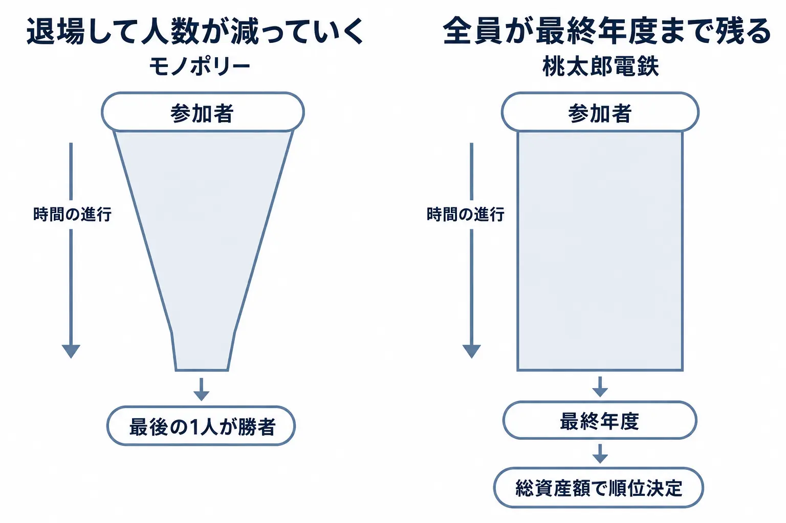
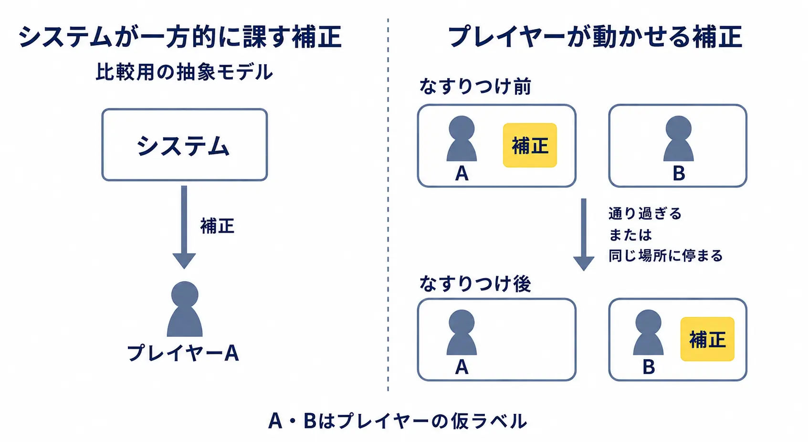
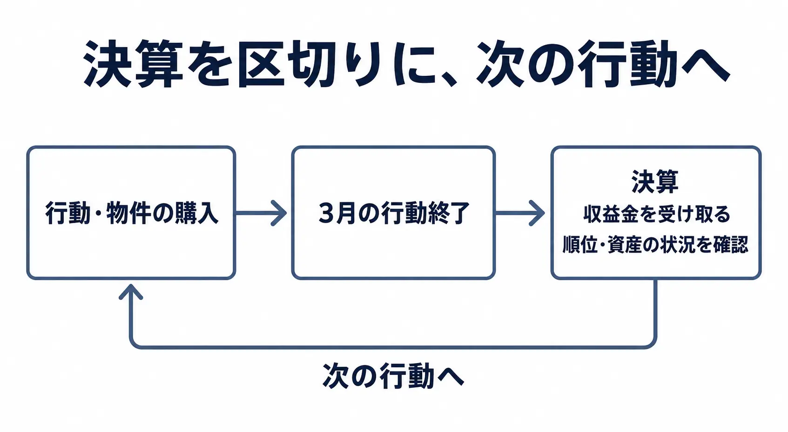

# 周回すごろくは、負けている人をどう卓に残すか――貧乏神を動かせる仕様

次の手番が来た。総資産では大きく負けている。それでも、サイコロを振る前に考えたいことがある。その状態を、ルールでどう作るか。

盤上を巡り、止まったマスで資産を得たり失ったりするゲームを、ここでは広く「周回すごろく」と呼ぶ。一本道の環状盤に限らず、鉄道路線を行き来する『桃太郎電鉄』も、この比較に含める。

「読める仕様書」第3回の本稿は、モノポリーと『桃太郎電鉄』の終わり方を入口に、負けている人へ次の判断を渡す仕組みを読む。着目するのは、他のプレイヤーへなすりつけられる貧乏神である。

判断軸は、 **補正を隠すか見せるかではなく、補正の原因をプレイヤーの選択へ紐づけられるか** だ。

***

## 第1章　破産した人は、その場で卓を離れる

モノポリーでは、サイコロで駒を進め、土地などの物件を買い、他人の物件に止まれば賃料を支払う。ここで読むのは、ハズブロ公開のParker Brothers版ルールブック、©2004, 2007の「CLASSIC MONOPOLY RULES」である。[[1](#ref-1)]

末尾の破産規定は、次のように締めくくられる。

> A bankrupt player must immediately retire from the game. The last player left in the game wins.

破産したプレイヤーは直ちにゲームから退き、最後に残った1人が勝つ、という意味だ。[[1](#ref-1)] **退場は勝利条件と一体になっている。** 破産者が出たときだけ付け足す例外処理ではなく、参加者が減っていくことで決着に至る。

破産は、他のプレイヤーや銀行への支払いを賄えなくなったときに起きる。相手がプレイヤーなら、価値あるものをその相手へ渡して退場する。建物は銀行へ売却して、その代金を渡す。銀行への破産なら全資産を銀行へ渡し、銀行が建物を除く物件を直ちに競売にかける。[[1](#ref-1)]

この終わり方を読むには、普段の遊び方と、実際に書かれた規則を揃えておきたい。

- **購入の辞退**：止まった未所有の土地を定価で買わない場合、銀行が競売にかける。
- **建物の在庫**：家は32軒、ホテルは12軒で有限である。銀行の家が尽きれば、他のプレイヤーによる返却や売却を待つ必要がある。在庫を超える購入希望が競合すれば競売になる。
- **フリーパーキング**：ここに止まっても、金銭、物件、その他いかなる報酬も得られない。罰金などを貯めておき、止まった人へ渡す遊び方は、この公式規則にはない。[[1](#ref-1)]

書かれた規則が使われず、その場の取り決めが実質の仕様になるこの例は、第1回[『ボードゲームのルールブックは「書いた人が同席できない仕様書」である』](board-game-rulebooks-as-standalone-specifications.md)にもつながる。

この規則では、参加者が勝敗の見通しを立てた後も、破産していない人の手番は続く。「勝てそうにない」と感じる時点と、規則上の退場時点には隔たりがありうる。格差が広がる仕組みの分析は[既刊のMDA解説・第4章](mda-framework-mechanics-dynamics-aesthetics-guide.md)に譲り、ここでは、最後の1人になるまで決着しないという終わり方を押さえる。

***

## 第2章　桃太郎電鉄では、全員が最終年度まで卓にいる

『桃太郎電鉄』については、『桃太郎電鉄 ～昭和 平成 令和も定番！～』の公式「あそびかた」を読む。プレイヤーはサイコロで駅を巡り、物件を買い、 **最終年度の総資産額1位** を目指す。破産によって途中退場させる形式を取らず、負けている人にも最終年度まで手番が回る。[[2](#ref-2)]

資産を増やす機会は、道中にも区切りにもある。3月の行動が終わると決算となり、持っている物件の収益率に応じて収益金が得られる。目的地に1番乗りすれば、多額の援助金を受け取れる。先に到着することの報酬は、はっきり残されている。[[2](#ref-2)]

さらに、停まった駅の物件をすべて買って独占すると、その駅の収益が2倍になる。[[2](#ref-2)] モノポリーにも、同じ色の土地を揃えると、その組の未開発かつ抵当に入っていない土地の賃料が2倍になる規則がある。[[1](#ref-1)] **一組を揃えることで収入を強めるという意味で、この独占の仕組みは同型である。** 収入を得る場面は、相手が止まるときと年ごとの決算とで異なる。

移動し、買い集め、まとまりを作ることで資産を増やす。両者を周回すごろくの系譜として並べたとき、本稿の比較を決定づけるのが終わり方だ。モノポリーは参加者が減り、最後の1人を決める。桃太郎電鉄は全員を残し、最後に資産で順位を決める。

全員に手番が来るなら、そこで何を考えてもらうかが次の課題になる。総資産で負けている人にも、今の一手で状況を変えられる対象が欲しい。その一つが貧乏神だ。

***

## 第3章　貧乏神は、後から足された

初代『桃太郎電鉄』は、1988年12月2日にファミリーコンピュータ向けに発売された。この初代には、ボンビーこと貧乏神は登場しない。最初の到着者が出たとき、目的地からいちばん遠いプレイヤーに取り憑く貧乏神が登場するのは、『スーパー桃太郎電鉄』からである。[[3](#ref-3)]

ここでいう順位連動は、 **目的地からの距離という位置関係への連動** である。総資産の最下位を選ぶ規則とは区別する必要がある。資産で勝っている人も、目的地から遠ければ対象になりうる。[[2](#ref-2)]

この負の補正は、初代から備わっていたものではない。電ファミニコゲーマーの2016年のインタビューで、桝田省治氏は、目的地より有利な物件を優先する遊び方への対策として、さくまあきら氏が貧乏神を考えたと振り返る。[[4](#ref-4)] 目的地を目指す競争へ、参加する理由を加えたのである。

貧乏神が変身するキングボンビーの採用では、さくま氏によれば周囲全員が反対した。それでも、反対案を評価する考えと、反対者が自分の被害を想像しているという観察から採用へ進んだ。[[4](#ref-4)] これはキングボンビーの話であり、貧乏神そのものの導入とは分けて読む。

悪意の表現にも方針があった。さくま氏は、意地の悪さが出すぎると嫌われると説明している。聞き手がキングボンビーほど突き抜けることかと確認すると、さくま氏は同意した。[[5](#ref-5)] この応答からは、大きな災難を、卓で共有できる強烈なキャラクターとして成立させようとする姿勢が読める。

仕様として持ち帰りたいのは、災難の大きさだけではない。被害を受けた人が、その後に何を選べるかである。

***

## 第4章　補正を、プレイヤーが動かせる駒にする

公式「あそびかた」は、貧乏神を他のプレイヤーへなすりつける条件を明記している。 **相手を通り過ぎるか、ぴったり同じ駅に停まる。** この移動によって、貧乏神を引き受ける人を変えられる。[[2](#ref-2)]

資産の数字だけを見ていれば、負けている人は次の決算を待つことになる。盤上に動かせる災難があれば、相手までの距離にも意味が生まれる。誰に近づくか。目的地へ進むか。自分へ近づいてくる相手を避けるか。移動の判断が、損失を受ける相手の変更につながる。

### 最初に取り憑く条件と、その後の移動を分ける

この仕組みは、仕様書なら二つの処理に分けて書ける。

| 処理 | 条件 | プレイヤーにとっての判断 |
|---|---|---|
| 貧乏神が取り憑く | 目的地から最も遠い位置にいる | 目的地との距離をどう扱うか |
| 貧乏神をなすりつける | 他のプレイヤーを通り過ぎる、または同じ駅に停まる | 誰へ近づき、どの経路を取るか |

条件は公式説明に基づき、判断の欄は本稿の設計上の読み取りである。[[2](#ref-2)] システムが最初の対象を決めた後も、対象が固定され続けるわけではない。 **補正の受け手を変える余地が、通常の移動の中にある。**

たとえば、貧乏神をつけたまま目的地へ急ぐか、別のプレイヤーへ近づく経路を取るかを考える場面を想定してみる。これは特定の盤面の再現ではなく、規則から考えられる選択例だ。相手へ向かえばなすりつける機会ができる一方、目的地への道から外れるかもしれない。サイコロの出目と相手の動きもあるので、選んだ通りの結果が保証されるわけではない。

ここで選んでいるのは、被害をなくすボタンを押すことではなく、 **何を優先して移動するか** である。相手側にも、近づかれる前に離れるという判断が生まれる。災難への対応が、自分だけの処理から、相手の次の手を読む関係へ広がる。

### 不運を、次に選べる行動へつなぐ

追いつき調整の利点・欠点と、結果が裏で操作されていると受け取られる問題は、既刊[『難易度設計とダイナミックディフィカルティ』第5-4節](difficulty-design-and-dynamic-adjustment.md)で扱っている。

本稿で桃太郎電鉄の解法として読むのは、補正そのものを操作対象へ変えることだ。取り憑いた理由が表示されるだけなら、プレイヤーはその説明を受け取るところで止まる。なすりつけが可能なら、説明を読んだ後に、盤上で次の行動を探せる。

桝田氏は、同じ位置でのなすりつけを自分の案だったと思うと述べ、救済策として説明する。さくま氏も、なすりつけられずに貧乏神を抱えていたことが、キングボンビーの不運を自分の行いの結果として受け取る理由になると語る。[[4](#ref-4)]

この証言を判断軸へ移すなら、 **補正を隠すか見せるかではなく、補正の原因をプレイヤーの選択へ紐づけられるか** となる。なぜ自分が対象になったのかに加え、対象であり続ける状況へ、どの行動で働きかけられたのかを考えられる構造である。

これは、すべての被害が本人の責任だという意味ではない。設計者が用意できるのは、結果へ関与する機会だ。その機会が盤面に存在せず、選べる経路もない状態で被害だけが続くなら、なすりつけという規則を知っていても、行動には移せない。

したがってテストでは、被害の発生回数だけでなく、被害を受けている人が次に何を狙ったかを見る。「あの人へ近づこう」「今回は目的地を優先しよう」と考えられたなら、補正が判断を生んでいる。「何を選んでも同じ」と受け止められるなら、操作の条件や盤面を見直す箇所がある。

負けている人へ渡したいのは、最終勝利の保証ではない。 **今の一手で、誰かとの関係や自分の状況を変えられる理由** である。

***

## 第5章　守っているのは、間口である

この設計を支える目的は、経験や得意不得意の違う人が、一緒に遊べる間口を保つことだ。

さくま氏は、説明を覚えきれない人を念頭に、メッセージを短くする必要を説き、難しくしていくと間口が狭まると話す。[[5](#ref-5)] 目的地を目指す、近くの相手へ貧乏神を渡す、といった目に見える行動は、長い計画を立てる前にも取り組める目標になる。

桝田氏は、さくま氏から教わった言葉として、 **「ゲーム画面の中を作るな。ゲーム画面の前を作れ」** を紹介している。[[4](#ref-4)] 盤上の配置と同時に、誰が誰の手番を気にするかを見る。逃げようとする人、近づかれて警戒する人、その行方を見る人。移動が周囲の反応を引き出せるかが、同じ卓で遊ぶ設計の検証対象になる。

### 最終結果の手前に、次の区切りを置く

さくま氏は、短い対戦の反復が次への期待を生むと説明し、その文脈で次の目的地に触れている。[[4](#ref-4)] ここでの小さな競争と、3月の決算という定期的な区切りは、別の役割を持つ。

目的地は、当面どこを目指すかを与える。決算は、積み重ねた物件から収益を受け取り、資産の状況を見直す機会になる。[[2](#ref-2)] 本稿の読み取りでは、こうした区切りがあることで、「最終的に勝てるか」という遠い問いの手前に、「次に何を達成したいか」を置きやすくなる。

決算は資産差を消す処理ではなく、積み重ねを確認する場である。だから、区切りを置くだけで次の機会が生まれるとは限らない。そこで見直した状況から、目的地へ向かう、物件を買う、貧乏神を渡すといった行動へ戻れることが大切になる。

全員を卓に残すとは、手番を機械的に配り続けるだけでは足りない。先の展開を読める人にも、目の前の相手を追う人にも、次に試したい行動がある。その両方を同じ盤上で成立させることが、間口を守る設計になる。

***

## 第6章　仕様へ移す

仕様書には、次の四つを判断の分かれ目として残したい。以下の応用例は、実在タイトルの仕様ではなく架空の設計例である。

### ① 退場を作るか、順位で終えるか

- [ ] **決着の条件を書く**：参加者が最後の1人になったときか、決めた終了点で成績を比較するときか。
- [ ] **終了前の手番の目的を書く**：順位で終えるなら、負けている人がその手番で変えられるものを一つ挙げる。

デジタルのパーティゲームで、複数の遊びの合計成績を競うなら、総合順位で下位でも、次の遊びで狙える成果を用意する。最終集計の画面を作るだけでは、そこまでの参加理由は埋まらない。

### ② 区切りをどの長さで置くか

- [ ] **次の目標を選び直す時点を書く**：ラウンド終了、目的の達成、定期集計など、何を区切りにするか。
- [ ] **その時点で変わるものを書く**：成績の表示だけか、目標も変わるか、蓄積はどこまで引き継ぐか。

ライブサービスの期間限定イベントなら、全期間の順位とは別に、区間ごとの目標を置く案がある。全体で後れを取った人が、その区間で何を狙えるかを確かめる。区切りを増やすときは、参加に必要な頻度も上がるのか、参加したときに区間を遊べるのかまで決めたい。

### ③ 負の補正の担い手をシステムにするか、プレイヤーにするか

- [ ] **最初の対象を選ぶ条件を書く**：距離、所持品など、何を見て誰に付与するか。
- [ ] **付与後に変えられる条件を書く**：プレイヤーが対象を移せるなら、必要な行動と、相手が対応できる時間や手段を決める。

マルチプレイで不利な荷物を受け渡す案なら、接触した瞬間に移るのか、受け渡す操作が要るのかで駆け引きが変わる。移せるという説明だけで終えず、受け手が分かる表示や、同時に条件を満たした場合の処理順まで書く。

### ④ 先行者への報酬を残すか

- [ ] **うまく進めた成果を列挙する**：先着報酬、集めた資産、区間の勝利など、先行者が得るものを決める。
- [ ] **負の補正で失いうる範囲を書く**：一度の失敗が、どの成果まで変えるのかを明示する。

先着者へ得点を与えつつ、不利な荷物は位置関係で受け渡すなら、「先に着く」と「相手との距離を取る」という判断が並ぶ。先行する価値と、まだ状況を変えられる余地を、同じ仕様の中で確認できる。

この四つの判断は、第2回[『卓上プロトタイプは「実装を待たずに動かせる仕様書」である』](wargame-adjudication-and-tabletop-prototyping.md)の方法で、手番として試せる。

***

## おわりに　次の一手に、選ぶ理由があるか

桃太郎電鉄の貧乏神から読み取れるのは、補正の受け手を、プレイヤーが動かせる対象にする設計だ。目的地との距離で取り憑き、その後は他者との位置関係を使ってなすりつけられる。負けている人にも、資産順位とは別に、今動かせる関係が残る。

仕様へ持ち帰る問いは、 **補正を隠すか見せるかではなく、補正の原因をプレイヤーの選択へ紐づけられるか** である。選択と結果のつながりを作り、その選択を実際に試せる場面を用意する。

この設計が向くのは、実力差のある人たちが、互いの行動に反応しながら遊び続けることを重視する場だ。全員を最後まで残す設計は、競技性を求める場では逆効果になりうる。勝ち切った成果を確定させたい参加者にとって、状況を揺らす機会が続くことは、求めた決着を遠ざける場合がある。

**モノポリーの退場は欠陥ではなく、勝ち切ることを目的にした設計である。** 最後の1人を決めることと、全員で終点へ進んで順位を決めることには、それぞれの目的がある。

自分のゲームで、誰に、どの時点まで、何を選んでほしいのか。その答えに合わせて、終わり方と補正の担い手を決めたい。

## References

1. [MONOPOLY — 公式ルールブック｜Parker Brothers／Hasbro][1] — ©2004, 2007。「CLASSIC MONOPOLY RULES」を参照。PDFの1ページ目が内容物、4ページ目が購入・賃料、6ページ目がフリーパーキング・建物在庫、8ページ目が破産・勝利条件。冒頭のSpeed Die追加規則は本稿の比較対象に含めない。

2. [あそびかた｜『桃太郎電鉄 ～昭和 平成 令和も定番！～』公式サイト・コナミ][2] — 目的地、援助金、物件の独占、貧乏神の付与となすりつけ、決算、最終年度の総資産額による目標。

3. [初代『桃太郎電鉄』が発売35周年。第1作はボンビー未登場!?｜ファミ通.com][3] — ウワーマン、2023年12月2日。初代の発売日・機種と、貧乏神が『スーパー桃太郎電鉄』から登場したことを伝える回顧記事。

4. [「どんな子供でも遊べなければいけない」 黄金期のジャンプ編集部で叩き込まれた“教え”が生んだ大ヒットゲーム「桃太郎電鉄」・3ページ目｜電ファミニコゲーマー][4] — 2016年2月22日。聞き手：稲葉ほたて、TAITAI。文：稲葉ほたて。さくまあきら氏・桝田省治氏の証言。「キングボンビーをあえて採用した理由」を参照。

5. [同インタビュー・2ページ目｜電ファミニコゲーマー][5] — 「ジャンプ編集部で知った“普通”の世界」「どんちゃんの仰天エピソードが次々に」。悪意の表現、説明の長さと間口に関するさくま氏の発言を参照。

[1]: https://www.hasbro.com/common/instruct/00009.pdf
[2]: https://www.konami.com/games/momotetsu/teiban/play.html
[3]: https://www.famitsu.com/news/202312/02325932.html
[4]: https://news.denfaminicogamer.jp/projectbook/momotetsu/3
[5]: https://news.denfaminicogamer.jp/projectbook/momotetsu/2

----

この文書は、Perplexity、Claude、OpenAI Codex の3つのAIの支援を受けて著述されたものです。引用画像を除き、MIT License にて提供されています。
