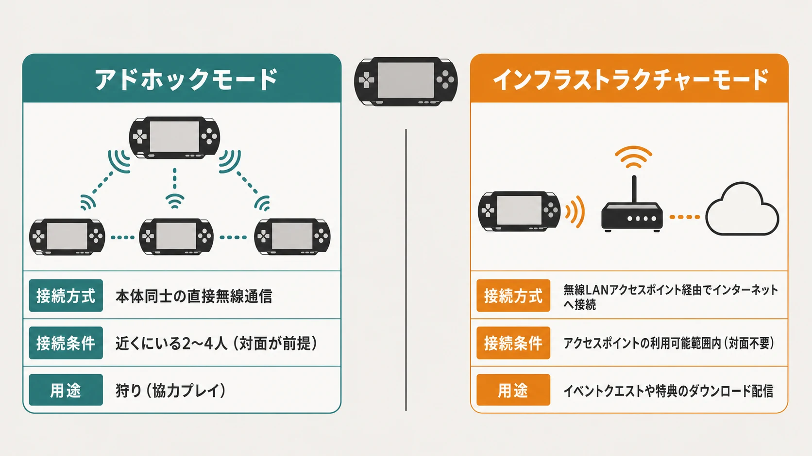
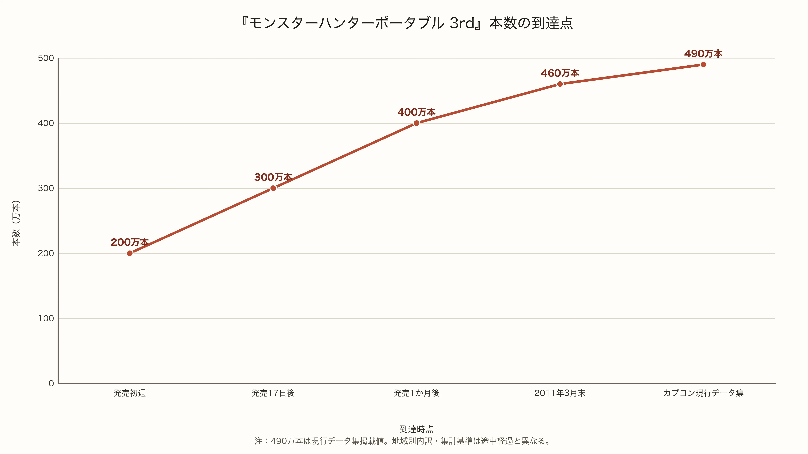

# 『モンスターハンターポータブル 3rd』が「持ち寄って狩る」文化の集大成になった理由

## はじめに――定着した文化をピークへ運んだ作品

『モンスターハンターポータブル 2nd G』は、2008年3月の発売後、「PSPといえばモンハン」「集まって一狩り」という文化を広く定着させた。ベスト版を含む国内出荷は2010年3月に400万本へ到達し、カプコンも通信協力が新たなコミュニケーションスタイルを確立したと説明している。[[1](#ref-1)]

2010年12月発売の『モンスターハンターポータブル 3rd』（カプコン、PSP）は、その土台の上に立つ後継作である。既に成立していた「持ち寄って狩る」習慣を保ちながら、携帯機での手触り、武器の選択肢、集まったときの遊び方を磨き込んだ。発売後17日で国内出荷300万本、1か月で400万本、2011年3月末には460万本へ達し、現行のカプコンデータ集には累計490万本と記録されている。後者は地域別内訳と集計基準を示さないため、国内出荷の途中経過とは分けて読む必要がある。[[2](#ref-2)][[3](#ref-3)][[4](#ref-4)][[5](#ref-5)]

本稿はPS3世代ゲームデザイン集の一篇として、 **対面の協力プレイを成立させるために携帯機へ再構成された設計** を読む。焦点は、オンライン機能を持つPSPで、狩りの接続先を近くにいる人へ絞った判断にある。

***

## アドホック通信を狩りの中心に置く

PSPの **アドホックモード** は、近くにある本体同士が直接無線通信する方式である。『モンスターハンターポータブル 3rd』では、アクセスポイントやインターネット契約を介さず、2〜4人で狩りを行える。[[6](#ref-6)] **インフラストラクチャーモード** は無線LANアクセスポイント経由でインターネットへつなぐ方式で、イベントクエストや特典のダウンロードを担った。[[7](#ref-7)]

この役割分担はポータブルシリーズを通じた仕様である。初代『モンスターハンターポータブル』は、アドホック通信での協力プレイと、インフラストラクチャーモードによるクエスト配信を併載した。[[8](#ref-8)] 『モンスターハンターポータブル 2nd G』の公式サポートも、協力プレイは近くにあるPSP同士で行うと明記している。[[9](#ref-9)]

PSPのネットワーク機能は、ダウンロード配信に実際に使われていた。シリーズはダウンロード配信をインフラストラクチャーモードへ、狩りをアドホックモードへ割り当て、接続先を同じ場所にいる人へ定めた。公開資料からは内部の意思決定理由まで断定できないものの、この一貫した役割分担は製品仕様として選ばれた線引きである。

この線引きがプレイヤーを導く先は、マッチング画面よりも、誰かの自宅、学校の休み時間、職場の休憩、店のテーブルであった。人数分の本体とソフトをそろえ、同じ場所に集まることが、狩りの開始条件になる。その手間が「会う」ことをゲーム進行の前提にし、画面外の会話まで含めた遊び方を育てた。

*490万本はカプコンの現行データ集掲載値であり、地域別内訳・集計基準は途中経過と異なる。*

***

## 『モンスターハンターポータブル 2nd G』の約束を維持する

『モンスターハンターポータブル 2nd G』が広げたのは、ソロの狩猟サイクルと対面協力が同じキャラクター、同じ素材集め、同じ装備育成でつながる遊び方である。自分で進めた装備を持ち寄り、集まれたときにはその続きを協力して進められる。この連続性が、日常の進行と集団の遊びを結んだ。

『モンスターハンターポータブル 3rd』は、この土台を最大4人のアドホック通信と集会浴場で受け継いだ。村で一人用の進行をしたキャラクターが、そのまま協力クエストへ参加する。日常の進行に「今、誰かと狩る」という選択肢を重ねる構成である。

協力時には、攻撃する手が増え、標的を引き受ける役割も分散する。4人が攻撃、回復、罠、状態異常を分担すれば、集会所向けの手強いクエストも違う手触りになる。「もう一人来れば解けるかもしれない」という期待が、集まる理由になる。

開発側も、初心者が素材を採り、慣れた人がダメージを担う役割分担を、コミュニケーションの手段として意識したと語っている。属性の異なる武器を持ち寄ることにも、会話を生む意図があった。[[10](#ref-10)] 準備と狩りの中で「何を持つか」「誰が何をするか」を相談する余地があり、人数優位はそのまま集まる動機へ翻訳されていた。

***

## 地上のフィールドと12種類の武器で再構成する

『モンスターハンターポータブル 3rd』は『モンスターハンター3（トライ）』の要素を参照し、携帯機向けに遊びを再構成した。水中のフィールドは収録が難しかったと、当時のディレクター一瀬泰範氏は説明している。開発チームは既存の素材を活かしながら、「3rd」独自の形を探った。[[11](#ref-11)]

公開発言は、水中フィールドの収録の難しさと、遊びを組み直す判断を示す。水中だった場所は浅瀬として歩けるフィールドになり、プレイヤーは携帯機の操作系で地上の立ち回りに集中できた。[[12](#ref-12)]

武器は、双剣、狩猟笛、ガンランス、弓を復活させ、スラッシュアックスを加えた全12種類である。[[12](#ref-12)] 前作『モンスターハンターポータブル 2nd G』の11種類を引き継ぎながら、土台となった据え置き版で外れていた選択肢も取り込んだ。狩猟笛の新連携ではデータ容量とのせめぎ合いがあったという発言からも、携帯機への再構成が単なる移植作業ではなかったことが分かる。[[13](#ref-13)]

モンスターにはスタミナという消耗の状態を導入し、疲労時の隙や行動変化を狩りの読み合いへ加えた。武器の復活、地上へ組み直したフィールド、疲労という観察可能な局面が、「集まった4人がそれぞれの得意武器で、目の前の変化へ反応する」狩りを厚くする。既に根付いた持ち寄り遊びの密度を上げる再設計である。

***

## ピークの数字が示す、文化の受け皿

発売週の実売集計では、『モンスターハンターポータブル 3rd』は195万717本、PSPは32万3,653台を記録した。前者はメディアクリエイト集計を4Gamerが掲載した二次データであり、カプコンの初週出荷200万本とは測定対象が異なる。出荷と実売を分けて読むことで、立ち上がりの勢いを正確に捉えられる。[[14](#ref-14)]

公式発表の到達点は、発売17日で国内出荷300万本、発売1か月で400万本、2011年3月末時点で460万本となる。『モンスターハンターポータブル 2nd G』が国内出荷400万本へ到達するまでには約2年を要し、『3rd』はその水準へ1か月で届いた。[[1](#ref-1)][[2](#ref-2)][[3](#ref-3)][[4](#ref-4)]

この急伸は、定着済みの持ち寄り文化が大きな受け皿になったことを示す。『モンスターハンターポータブル 2nd G』までに広く受け入れられた習慣へ、『3rd』は遊びやすさ、武器選択の広さ、継続的な配信、プロモーションを重ねた。参加人数が最も大きくなった時期の集大成である。

発売はニンテンドー3DSの国内発売（2011年2月26日）の直前であり、PlayStation Vitaの国内発売（2011年12月17日）より前だった。[[15](#ref-15)][[16](#ref-16)] スマートフォンが常時接続の個人端末として生活へ深く入る前、携帯ゲーム機の通信は「同じ場所に集まる」ことと強く結び付いていた。この時期は、PSPと持ち寄り狩りの組み合わせが最も広い参加者を集めた最後の踊り場として捉えられる。

***

## プランナーが持ち帰るべき逆説

現在のオンライン常時接続は、予定を合わせにくい人、近くに遊ぶ相手がいない人、移動が難しい人にも参加機会を開く。『モンスターハンターポータブル 3rd』は近距離での協力を参加条件に置いた。その設計は、現在の基準とは異なる参加条件を持っていた。

同時に、狩りを始めるために同じ空間へ集まる条件は、画面外の体験も作った。プレイヤーは装備を見せ、失敗を笑い、次の目標を相談する。通信機能は「すでに会っている人の関係を濃くする接点」として働いたのである。

現代のタイトルでは、アクセシビリティと参加機会のために遠隔参加を確保する選択が基本になる。その上でプランナーは、便利な接続が増やすものに加え、同じ場で役割を相談する理由をどう設計するかも考えたい。『モンスターハンターポータブル 3rd』は、 **接続の仕様が、通信品質だけでなく、プレイヤーが誰と、どこで、何を話すかまで設計する** ことを示した。『モンスターハンターポータブル 2nd G』が築いた文化を受け取り、『3rd』がピークへ押し上げた過程は、その事実を最も大きな規模で示す事例である。

## References

1. [『モンスターハンターポータブル 2nd G』が続伸し、国内400万本の出荷を記録][1] - カプコンによる『モンスターハンターポータブル 2nd G』の国内出荷400万本到達と通信協力の説明。

2. [『モンスターハンターポータブル 3rd』が早くも300万本を達成][2] - カプコンによる発売後17日での国内累計300万本出荷の発表。

3. [『モンスターハンターポータブル 3rd』が発売1か月間で国内400万本を突破][3] - カプコンによる発売1か月での国内400万本出荷の発表。

4. [Annual Report 2011][4] - 2011年3月末時点の販売本数460万本を掲載したカプコンのアニュアルレポート。

5. [ミリオンセールスタイトル][5] - 『モンスターハンターポータブル 3rd』を累計490万本と記録するカプコンの現行データ集。

6. [通信プレイ（アドホックモード）について][6] - 『モンスターハンターポータブル 3rd』の2〜4人アドホック通信と接続条件を説明するカプコン公式サポート。

7. [イベントクエストや特典をダウンロードするにはどうすればいいの？][7] - 『モンスターハンターポータブル 3rd』のインフラストラクチャーモードを使うダウンロード機能の公式説明。

8. [PSP「モンスターハンター ポータブル」イベントクエスト2本を配信][8] - 初代作品のアドホック協力プレイとインフラストラクチャーモードによるクエスト配信を記した当時報道。

9. [インターネット経由で他のプレイヤーと協力してプレイできますか？][9] - 『モンスターハンターポータブル 2nd G』の遠隔協力非対応を明記するカプコン公式サポート。

10. [『モンスターハンターポータブル 3rd』開発者インタビュー][10] - 役割分担や属性選択をコミュニケーションのきっかけとして組み込んだ意図を語る当時インタビュー。

11. [『モンスターハンターポータブル 3rd』開発者インタビュー（2ページ目）][11] - 水中フィールド収録の難しさと、携帯機向けに遊びを組み直した判断を語る当時インタビュー。

12. [PSPゲームレビュー「モンスターハンターポータブル 3rd」][12] - 浅瀬へ変更されたフィールド、12武器種、復活武器を確認する当時レビュー。

13. [『モンスターハンターポータブル 3rd』開発者インタビュー（2ページ目）][13] - 狩猟笛の新連携とデータ容量のせめぎ合いを語る当時インタビュー。

14. [出荷200万本の「MHP3rd」、販売本数195万本を記録した週間ランキング][14] - メディアクリエイト集計に基づく初週のソフト実売とPSP本体販売を掲載した当時報道。

15. [「ニンテンドー3DS」発売日と価格のお知らせ][15] - 任天堂によるニンテンドー3DSの2011年2月26日国内発売の発表。

16. [PlayStation Vita 日本国内における発売日を2011年12月17日に決定][16] - ソニーによるPlayStation Vitaの国内発売日発表。

[1]: https://www.capcom.co.jp/ir/news/html/100331a.html
[2]: https://www.capcom.co.jp/ir/news/html/101220.html
[3]: https://www.capcom.co.jp/ir/news/html/110105.html
[4]: https://www.capcom.co.jp/ir/data/pdf/annual/2011/annual_2011_01.pdf
[5]: https://www.capcom.co.jp/ir/business/million.html
[6]: https://www.capcom.co.jp/support/faq/platform_psp_mhp3rd_038064.html
[7]: https://www.capcom.co.jp/support/faq/platform_psp_mhp3rd_038059.html
[8]: https://game.watch.impress.co.jp/docs/20060828/mhp.htm
[9]: https://www.capcom.co.jp/support/faq/platform_psp_mhp2ndg_037193.html
[10]: https://www.4gamer.net/games/107/G010746/20110218083/
[11]: https://www.4gamer.net/games/107/G010746/20110218083/index_2.html
[12]: https://game.watch.impress.co.jp/docs/review/412950.html
[13]: https://www.4gamer.net/games/107/G010746/20110218083/index_2.html
[14]: https://www.4gamer.net/games/117/G011794/20101208062/
[15]: https://www.nintendo.co.jp/ir/pdf/2010/100929.pdf
[16]: https://www.sony.com/ja/SonyInfo/IR/news/110914_01.pdf

----

この文書は、Perplexity、Claude、OpenAI Codex の3つのAIの支援を受けて著述されたものです。引用画像を除き、MIT License にて提供されています。
