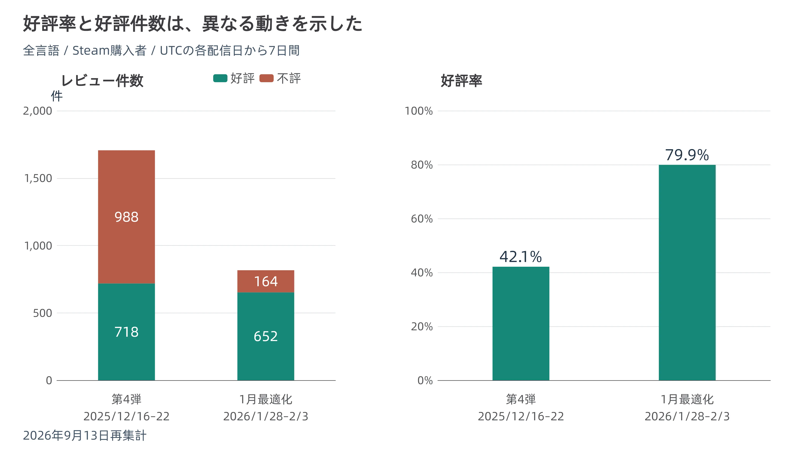
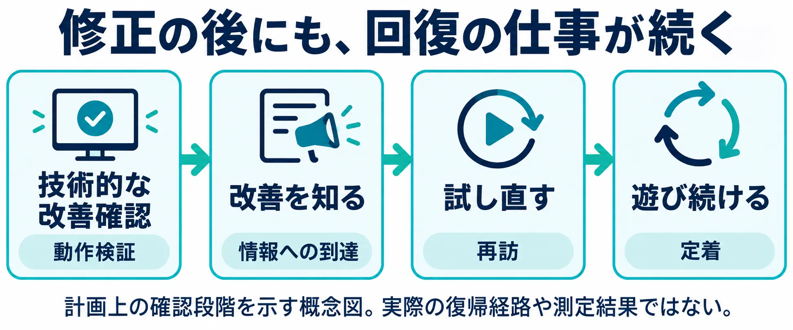

# 修復の完了日と、信頼の回復日――『モンスターハンターワイルズ』のPC版最適化から考える

ゲームの不具合対応には、動作を改善する仕事と、もう一度遊ぶ判断をしてもらう仕事がある。前者の成果は処理時間や不具合の再現試験で確かめられる。後者には、改善を知り、試し、遊び続けてもらうまでの時間が必要になる。

『モンスターハンターワイルズ』のSteam版では、2026年1月28日の最適化パッチ後、好評レビューの割合が高くなった。一方、同じ長さの期間で前回の大型アップデートと比べると、好評の件数は増えていなかった。このずれを手掛かりに、修正後の回復をどう計画へ置くかを考える。

怒りが進行している最中の対応は、既刊の[『プレイヤーと開発元のコミュニケーション：炎上対応と信頼回復の実践知識』](player-developer-communication-crisis-response.md)で扱った。本稿の対象は、改善が届き始めた後の評価と参加人数の関係である。情報の確認日は2026年9月13日、数値の主な観察対象は2026年1月末から2月初めとする。

***

## 1. 入口の高さは、発売前に公表されていた

本作の発売日は2025年2月28日である。カプコンの日本向け発表では、Steam版の配信開始は同日午後2時の予定とされていた。[[1](#ref-1)]

発売前の2月5日には、製品版の最低・推奨動作環境とベンチマークが公開されていた。当時の報道には、CPUとGPUの条件を以前の告知から引き下げたことも記録されている。現在のストアだけを見て、そこにある構成が最初の発表から一度も変わっていないと考えるのは適切ではない。[[1](#ref-1)][[2](#ref-2)]

以下は、2026年9月13日にSteamストアで確認した、カプコンが登録した動作環境である。[[3](#ref-3)]

| 項目 | 最低動作環境 | 推奨動作環境 |
| --- | --- | --- |
| OS | Windows 10／11、64bit | 同左 |
| CPU | Intel Core i5-10400／Core i3-12100／AMD Ryzen 5 3600のいずれか | 同左 |
| メモリ | 16GB | 16GB |
| GPU | NVIDIA GeForce GTX 1660（VRAM 6GB）／AMD Radeon RX 5500 XT（VRAM 8GB）のいずれか | NVIDIA GeForce RTX 2060 Super（VRAM 8GB）／AMD Radeon RX 6600（VRAM 8GB）のいずれか |
| DirectX | 12 | 12 |
| ストレージ | 75GBの空き容量、SSD必須 | 同左 |
| ネットワーク | ブロードバンドインターネット接続 | 同左 |
| 想定する表示条件 | 1080pへアップスケール、ネイティブ解像度720p、30fps、グラフィック「最低」 | 1080p、60fps、グラフィック「中」、フレーム生成使用 |
| その他 | DirectStorage対応 | DirectStorage対応 |

論点になるのは、GPUの型番とセットになっている追記事項だ。最低環境の原文は「SSD(必須)、グラフィック『最低』設定で、1080p(アップスケール使用、ネイティブ解像度720p)/30fpsのゲームプレイが可能です。DirectStorage対応。」、推奨環境は「SSD(必須)、グラフィック『中』設定で、1080p/60fps(フレーム生成使用)のゲームプレイが可能です。DirectStorage対応。」である。ここでは読みやすさのため、引用内の設定名の括弧だけを『』に置き換えた。[[3](#ref-3)]

GPU名だけを見れば、最新の最上位製品を要求する表には見えない。しかし、推奨欄の60fpsには **フレーム生成使用** という条件があり、最低欄の1080pには **ネイティブ720pからのアップスケール** という条件がある。前者は表示する中間フレームを補う処理、後者は低い内部解像度の画像を拡大・再構成する処理だ。どちらの注記も、プレイヤーが期待する画質や操作感を判断するための情報になる。

要求スペックの表記は、プレイヤーの財布に対する発注書でもある。手持ちのPCで足りるのか、部品を交換するのか、本体を買い替えるのか。その判断材料として表が使われる以上、「このGPUなら60fps」という短縮には、購入判断を変えるほど大きな情報の欠落がある。

プランナーが確認すべきなのは、型番の一覧が正しいかだけではない。表示解像度、内部解像度、画質設定、フレーム生成の有無が、購入前の人にも一組の条件として伝わるかである。

***

## 2. 直すまでの工程

カプコンは2025年12月11日の「モンスターハンターショーケース」で、翌年2月の更新までに段階的な最適化を行う計画を示した。翌12日のSteam公式告知は、その工程を12月のタイトルアップデート第4弾、1月のSteam版専用パッチ、2月のVer.1.041という三つに分けて説明している。[[4](#ref-4)][[5](#ref-5)]

| 日付 | 予告・実施 | 最適化の内容 |
| --- | --- | --- |
| 2025年12月11日 | ショーケースで今後の計画を予告 | 12月、1月、2月に段階的に対応する方針を提示 |
| 2025年12月12日 | Steam公式告知で工程を詳述 | 処理の分散、低負荷設定の追加、3Dモデルの詳細度調整などを説明 |
| 2025年12月16日 | タイトルアップデート第4弾を配信 | 全プラットフォームのCPU／GPU最適化、処理負荷やメモリ使用量の見直し |
| 2026年1月28日 | Steam版専用Ver.1.040.03.01を配信 | CPU設定タブの追加、テクスチャ処理とVRAM使用量の調整、グラフィック設定の追加・見直し、サポート窓口周辺の負荷増大の修正 |
| 2026年2月18日 | Ver.1.041.00.00を配信 | 3DモデルのLOD追加、モンスターなどの出現時処理や描画処理の最適化、エフェクトの再利用による負荷軽減 |

出典：12月の計画・配信はカプコンのSteam告知、1月と2月の実施内容は各パッチノートによる。LODは、場面に応じて3Dモデルの細かさを切り替え、描画負荷を調整する仕組みを指す。[[5](#ref-5)][[6](#ref-6)][[7](#ref-7)][[8](#ref-8)]

1月の対応には、処理そのものを軽くする変更と、プレイヤーが自分のPCに合わせて負荷を下げられる変更の両方があった。サポート窓口周辺の問題についても、カプコンは未受領コンテンツの確認処理によってCPU負荷が増える不具合と説明し、修正対象にした。所有DLC数そのものが原因だとする説明ではない。[[7](#ref-7)]

改善を受け止めた利用者もいる。配信翌日の報道は、フレームレートの向上やカクつきの解消といった報告が相次いだと伝えている。ただし、これらは利用者からの報告であり、すべてのPC構成で同じ改善が得られたという測定結果ではない。[[9](#ref-9)]

この工程は、開発側が実際に手を動かした記録として評価できる。一方、1月のパッチノート自体が2月の追加改善を予告している。したがって、1月28日を「全環境の全問題が解消した日」とは置かない。次章で見るのは、 **改善が実施された直後の反応** である。

***

## 3. 直した後に何が起きたか

Steamのレビューを、好評率と件数に分けて確認する。以下は **2026年9月13日23時52分（日本時間）** にSteamの公開レビューAPIから取得した集計である。全言語、Steamで購入した利用者のレビューを対象とし、評価欄の「好評」「不評」は取得時点の状態を使った。期間はUTCの暦日で区切り、各配信当日と、当日を含む7日間を比較している。対象外のレビュー活動を除外するフィルターは無効にして条件を統一した。なお公式告知によれば、1月28日のパッチの配信は日本時間11時（UTC 2時）、2月18日のVer.1.041は日本時間11時30分（UTC 2時30分）である。UTCの暦日で区切る本表では、配信当日の枠のうち最初の2時間ほどが配信前にあたる。[[7](#ref-7)][[8](#ref-8)][[10](#ref-10)][[11](#ref-11)][[12](#ref-12)][[13](#ref-13)]

| 比較対象 | 対象期間（UTC） | 好評 | 不評 | 合計 | 好評率 |
| --- | --- | ---: | ---: | ---: | ---: |
| タイトルアップデート第4弾・当日 | 2025年12月16日 | 158件 | 252件 | 410件 | 38.5% |
| Steam最適化パッチ・当日 | 2026年1月28日 | 136件 | 30件 | 166件 | 81.9% |
| タイトルアップデート第4弾・7日間 | 2025年12月16～22日 | 718件 | 988件 | 1,706件 | 42.1% |
| Steam最適化パッチ・7日間 | 2026年1月28日～2月3日 | 652件 | 164件 | 816件 | 79.9% |

好評率は、好評件数÷合計件数で算出し、小数第1位に丸めた。2026年2月3日付のGame*Spark報道にある、パッチ後7日間の好評640件・不評163件などとは異なる。上表は、後日の再集計値を優先したものだ。集計時点が異なるため当時の評価状態をそのまま再現するものではなく、記事の執筆時刻と期間末の違い、レビューの変更・削除、抽出条件の違いもありうる。差分のすべてを評価の書き換えだけに帰すことはできない。[[14](#ref-14)]

7日間の好評率は42.1%から79.9%へ変わり、好評が多数を占める結果になった。しかし、好評件数は718件から652件で、増えていない。不評件数が988件から164件へ大きく減り、レビュー全体の件数も小さくなっている。 **好評の割合が増えることと、好評を書きに来る人が増えることは別の現象** である。

なお、Steam外で入手したキーによる利用者なども含む「すべての購入方法」で同じ7日間を取得すると、好評は1,097件から1,147件となる。少し増えているが、倍増するような変化ではない。購入条件を変えると増減の向きも変わるため、本稿の「増えていない」は上表のSteam購入者という範囲に限る。

出典：Steam公開レビューAPIの2026年9月13日再集計。対象期間は第4弾が2025年12月16～22日、1月最適化が2026年1月28日～2月3日（いずれもUTC）。[[11](#ref-11)][[13](#ref-13)]

同時接続数について、Game*Sparkが2月3日にSteamDBを基に報じた値は、パッチ前の土曜・1月24日が33,174人、パッチ後の土曜・1月31日が33,929人だった。差は755人、約2.3%の増加であり、この比較では大きな跳ね上がりは見られない。[[14](#ref-14)]

この2日分の値は、報道時点の記録として扱う。9月13日にSteamDBのページを確認したが、未ログインの公開表示では対象日の履歴を再取得できなかったため、独自に取り直した数値ではない。レビューの再集計値と同じ検証状態にあるものとしては扱わない。[[15](#ref-15)]

ここで分かる範囲は限定される。レビューは遊んだ人全員の投票ではなく、同時接続数は一定期間に戻った人の総数でもない。同じ規模の接続人数の中で、新規参加、復帰、離脱が入れ替わっている可能性がある。二つの土曜の比較だけで、統計的に「誤差」と判定することもできない。

また、第4弾はモンスターや装備などを追加した更新、1月のパッチは最適化を中心とした更新である。両者は同じ条件で行った実験ではない。それでも、好評率の上昇を見た瞬間に「人数も戻った」と判断してはいけないことは、上表だけで確かめられる。レビューの母数、遊んでいる人数、離脱者の復帰、信頼という心理状態には、それぞれ別の確認が要る。

***

## 4. 入口を下げても、下げたことは届かない

### 4-1. 公表された事実

カプコンは低負荷設定の追加と処理改善を予告し、1月にSteam版の更新を配信した。2月にも追加の最適化を行っている。ここでいう「入口を下げる」とは、設定の選択肢や処理改善によって参加しやすい条件を増やすことであり、1月28日にストアの最低・推奨GPU欄を書き換えたと主張するものではない。[[5](#ref-5)][[7](#ref-7)][[8](#ref-8)]

改善情報はSteamの公式告知やゲームメディアに掲載され、改善を実感したという利用者の報告も報じられている。一方、これらの資料には、離脱した利用者のうち何人が告知を読み、何人が再起動したかという集計はない。前章のレビュー集計からも、告知を読まなかった人の人数や、離脱理由は分からない。[[7](#ref-7)][[9](#ref-9)][[14](#ref-14)]

### 4-2. ここからは編者の考察である

ここからは編者の考察である。動作条件が障壁になって離れた人は、その後も公式告知を読み続けるとは限らない。更新情報を確認する習慣そのものを失っていれば、改善が実施されても、遊び直す判断の材料は本人まで届かないという説明も立つ。

編者が居合わせた会話では、発売直前に公表されていた要求スペックを高いと受け止め、PCを買い替えた知人たちがいた。買い替え後も期待する性能が出ないことに悩まされた一方、その後のAI需要によるGPU・メモリの価格高騰を踏まえると、結果としてハードウェアへ投資する時期としてはぎりぎり良かった、という受け止めが複数人のあいだで共有された。これは取材として集めた証言ではなく、編者がその場で聞いた会話である。

検証できる市場情報として、TrendForceは2026年3月31日、同年第2四半期の従来型DRAM契約価格を前四半期比58～63%、NANDフラッシュ契約価格を70～75%の上昇見込みとした。AI・サーバー向けへの供給配分が背景に挙げられている。本作の発売はこの2026年第2四半期の高騰局面より前だが、この予測はGPU製品や各人が購入したPCの小売価格を測ったものではない。部材価格の背景は[『AI需要による半導体価格高騰がコンソールゲーム業界に与える影響』](ai-demand-semiconductor-price-surge-console-industry-impact.md)に譲る。[[16](#ref-16)]

会話にある「買っておいて良かった」という評価は、購入した製品、時期、支払額、用途によって変わる。買い替えの広がりも、投資時期の当たり外れも、この会話から一般化できない。ただ、その場にいたのが **買い替えられた人たち** であり、買い替えられずに離れた人は最初から現れないという選択バイアスには、注目する意味があると読める。

この偏りは、第3章の数字と表裏の関係にあると読める。目の前の会話やレビュー欄には、参加できた人、評価を書きに来た人の反応が残る。その反応が良くなっても、参加できなかった人が戻ったかどうかは、同じ場所を眺めるだけではつかめないという説明も立つ。

もっとも、「改善が届かないから戻らなかった」という読みへの反証になりうる事実もある。好評レビューは実際に存在し、改善を実感したという報告も出ている。また、第4弾には追加コンテンツがあり、1月の最適化後にも2月の改善が続いた。[[6](#ref-6)][[8](#ref-8)][[9](#ref-9)]

したがって、情報を知っていても新しい遊びを待っていた、自分の環境では改善がまだ十分でなかった、という説明も立つ。「入口が下がったことを知らない人がいる」は検証すべき仮説であり、今回の人数の動きをすべて説明する確定的な原因にはできないと読める。

***

## 5. 次の入口

2026年9月13日時点では、本作に関連する二つの未発売商品が公表されている。

一つは、超大型拡張コンテンツ『モンスターハンターワイルズ：アセンダンス』だ。カプコンの発表文によると、2026年6月6日（日本時間）のSummer Game Fest 2026で発表され、2027年発売予定である。6月の発表時の対応機種はPlayStation 5／Xbox Series X｜S／Steam。新たなクエストランク「マスターランク」、新フィールド「雲居の遺跡群」、全武器種の新たなアクションにつながる「ブーストブレイサー」が紹介された。プレイには本編と、★7の任務クエスト「夢から覚めて」（Chapter 6-1）のクリアが必要になる。[[17](#ref-17)]

もう一つは、Nintendo Switch 2版である。9月9日のNintendo Directで発売情報が示され、12月4日に発売予定とされた。任天堂の案内では、『モンスターハンターワイルズ』のアップデートコンテンツをすべて収録し、本体を持ち寄ることで最大4人までのローカル通信マルチプレイに対応、さらに複数のプラットフォーム間でのクロスプレイにも対応するとされている。任天堂はSwitch 2向けの『アセンダンス』も2027年発売と案内している。[[18](#ref-18)]

企画上は、拡張コンテンツを「遊び直す理由を増やす入口」、新プラットフォームを「参加できる機器と遊ぶ場面を増やす入口」として検討できる。ただし、これは商品の機能から考えられる役割であり、両商品がPC版の離脱者回復を目的に企画されたという意味ではない。カプコンは拡張の発表でユーザー拡大を掲げているが、それを特定の不具合からの信頼回復策と同一視する根拠にはならない。なお同ニュースは対応機種を「PC」と表記しており、本稿の「Steam」は6月6日の発表文の表記に従ったものである。[[19](#ref-19)]

さらに、二つの入口は誰にでも同じように開くわけではない。拡張には本編の進行条件があり、序盤で離れた人は新要素にたどり着くまでの道のりが残る。新プラットフォームには、その本体を持っているという条件がある。未発売の段階では、実機での品質や実際の復帰・定着まで評価することはできない。

ここでの判断は、「新商品があれば回復する」ではなく、誰のどの障壁を下げる商品なのかを具体化することである。[移植可否の技術的な判定軸](switch-2-portability-four-axes.md)や、[DLCの開発計画と制作工程](how-dlc-and-season-passes-are-planned.md)とは別に、再訪のきっかけと、再訪後に遊べる条件を見積もる必要がある。

***

## 6. プランナーへの持ち帰り

自分の担当タイトルで同じ状況が起きたときは、修正の予定表に「戻ってくるまでの仕事」を追加したい。次のチェックリストは、本作の内部施策を推定するものではなく、公開情報から得られる実務上の確認項目である。

- [ ] **要求スペックを条件の組として書いたか**：GPU名と目標fpsだけで済ませず、内部・出力解像度、画質設定、フレーム生成、必要なストレージを並べる。紹介文や告知画像へ短縮したときにも条件が落ちないか確認する。
- [ ] **どの環境で、何が改善したかを示せるか**：改善前後のPC構成、設定、場面をそろえる。平均fpsだけでなく、問題になっていた停止、落ち込み、クラッシュも確認する。課題が残る環境は対象を明示する。
- [ ] **改善を知らせたい相手を分けたか**：継続中の人、性能問題で休止した人、購入を見送った人を分ける。ゲーム内のお知らせだけで、起動していない人にも届いた扱いにしない。
- [ ] **告知から試し直すところまで用意したか**：ストアの説明、外部告知、動作確認の案内などをつなぎ、自分の環境で試せる条件を示す。「最適化した」という見出しだけで再訪を期待しない。
- [ ] **戻った後に何を遊ぶかを案内したか**：新コンテンツの参加条件、途中から再開する手順、友人と合流する方法を確認する。追加コンテンツの存在と、離脱地点からそこへ到達できることを分ける。
- [ ] **割合と件数を併記したか**：好評率には好評・不評の件数と対象期間を添える。同時接続数には曜日などの比較条件を添え、復帰人数の代わりとして扱わない。
- [ ] **修正、到達、再訪、定着を別々に測るか**：技術的な改善確認に加え、告知に触れた人、休止後に再起動した人、その後も遊んだ人を、取得可能な範囲で区別する。人数を信頼そのものと同一視せず、利用者の評価も合わせて読む。
- [ ] **回復の担当者と観察期間を計画に置いたか**：パッチ配信の後にも、告知、再訪の案内、効果の確認、次の施策を判断する工数を確保する。期待より戻らなかった場合に、誰が何を見直すかを決める。

事故の原因と改善策を検証する方法は、[『重大インシデント後のポストモーテムを設計する』](postmortem-methodology-after-major-incidents-for-game-teams.md)で扱っている。その改善策が実装された後にも、プレイヤー側には次の判断が残る。

パッチを届ければ、遊べる状態は変わる。改善を知り、時間を取り、もう一度試すかを決めるのはプレイヤーである。 **不具合対応の完了日を、信頼の回復日として計画に置かない。** 修復の成果を人数と継続へつなぐ時間と手段まで、別の仕事として見積もることが必要だ。

## References

各資料の確認日は2026年9月13日。

1. [「『モンスターハンターワイルズ』を楽しめる機能や、狩猟生活を彩るさまざまなコンテンツを紹介！」][1] — カプコン、PR TIMES、2025年2月5日07:59。発売日と Steam 版の配信開始予定時刻。

[1]: https://prtimes.jp/main/html/rd/p/000004861.000013450.html

2. [「PC版『モンハンワイルズ』ベンチマークソフトが配信開始。製品版の動作環境も公開、最低・推奨スペックは以前より引き下げ」][2] — ファミ通.com、2025年2月5日。発売前の公表履歴。

[2]: https://www.famitsu.com/article/202502/32638

3. [「モンスターハンターワイルズ」ストアページ][3] — カプコン／Steam。システム要件（日本語表示、2026年9月13日確認）。

[3]: https://store.steampowered.com/app/2246340/Monster_Hunter_Wilds/?l=japanese

4. [Yusuke Sonta「『モンスターハンターワイルズ』来年2月の「最終アプデ」発表、歴戦王アルシュベルド実装へ。そこまでにSteam版最適化アプデも3段階で実施予定」][4] — AUTOMATON、2025年12月11日18:25。工程の内容は出典5の公式原文でも照合した。

[4]: https://automaton-media.com/articles/newsjp/monster-hunter-wilds-20251211-370615/

5. [「ゲームの品質改善に関する取り組み」（英語版タイトル「Our Commitment to Improving Stability and Performance」）][5] — カプコン、Steam公式告知、2025年12月12日。

[5]: https://store.steampowered.com/news/app/2246340/view/559139291408629866

6. [「アップデート概要 (Ver.1.040)」][6] — カプコン、Steam公式パッチノート、2025年12月16日。

[6]: https://store.steampowered.com/news/app/2246340/view/559139291408631500

7. [「アップデート概要 (Ver.1.040.03.01)」][7] — カプコン、Steam公式パッチノート。配信日時は2026年1月28日(水) 日本時間11:00（UTC 2:00）。

[7]: https://steamcommunity.com/games/2246340/announcements/detail/526492547790405651

8. [「アップデート概要 (Ver.1.041.00.00)」][8] — カプコン、Steam公式パッチノート。配信日時は2026年2月18日(水) 日本時間11:30（UTC 2:30）。

[8]: https://store.steampowered.com/news/app/2246340/view/521990850610201449

9. [Akihiro Sakurai「『モンスターハンターワイルズ』Steam版専用アプデで「かなりパフォーマンス改善された」との報告続々。最適化問題、ついに本格改善」][9] — AUTOMATON、2026年1月29日11:36。

[9]: https://automaton-media.com/articles/newsjp/20260129-414145/

10. [Steam公開レビューAPI、2025年12月16日分][10] — Steam購入者・全言語。

[10]: https://store.steampowered.com/appreviews/2246340?json=1&filter=all&language=all&review_type=all&purchase_type=steam&num_per_page=1&filter_offtopic_activity=0&start_date=1765843200&end_date=1765929599&date_range_type=include

11. [Steam公開レビューAPI、2025年12月16〜22日分][11] — Steam購入者・全言語。

[11]: https://store.steampowered.com/appreviews/2246340?json=1&filter=all&language=all&review_type=all&purchase_type=steam&num_per_page=1&filter_offtopic_activity=0&start_date=1765843200&end_date=1766447999&date_range_type=include

12. [Steam公開レビューAPI、2026年1月28日分][12] — Steam購入者・全言語。

[12]: https://store.steampowered.com/appreviews/2246340?json=1&filter=all&language=all&review_type=all&purchase_type=steam&num_per_page=1&filter_offtopic_activity=0&start_date=1769558400&end_date=1769644799&date_range_type=include

13. [Steam公開レビューAPI、2026年1月28日〜2月3日分][13] — Steam購入者・全言語。

[13]: https://store.steampowered.com/appreviews/2246340?json=1&filter=all&language=all&review_type=all&purchase_type=steam&num_per_page=1&filter_offtopic_activity=0&start_date=1769558400&end_date=1770163199&date_range_type=include

14. [ケシノ「『モンハンワイルズ』Steam最適化アプデ、好評レビュー割合増えるも絶対数では大きな変化なし。同接プレイヤー数も目立った変動せず」][14] — Game*Spark、2026年2月3日23:30。レビューの当時集計と、SteamDBに基づく同時接続数の報道。

[14]: https://www.gamespark.jp/article/2026/02/03/162335.html

15. [「Monster Hunter Wilds Steam Charts」][15] — SteamDB。対象日の過去履歴は今回の未ログイン公開表示では再取得できていない。

[15]: https://steamdb.info/app/2246340/charts/

16. [「AI Server Demand to Drive Memory Contract Price Increases in 2Q26 as CSPs Secure Supply via Long-Term Agreements」][16] — TrendForce、2026年3月31日。契約価格の予測であり、個別の小売価格の実績ではない。

[16]: https://www.trendforce.com/presscenter/news/20260331-12995.html

17. [「シリーズ最新作『モンスターハンターワイルズ：アセンダンス』が、2027年に発売決定！ 超大型拡張コンテンツで、新たに楽しめる要素が多数追加。」][17] — カプコン、PR TIMES、2026年6月6日08:43。Summer Game Fest 2026（日本時間6月6日6時開始）での発表。

[17]: https://prtimes.jp/main/html/rd/p/000005820.000013450.html

18. [「いつでも、どこでも、一狩りいこうぜ。『モンスターハンターワイルズ』が、12月4日にNintendo Switch 2で発売決定＆予約開始。」][18] — 任天堂、2026年9月10日。

[18]: https://www.nintendo.com/jp/topics/article/56917272-b90e-4bf0-bae9-443cd007eddd

19. [「『モンスターハンターワイルズ：アセンダンス』、2027年に発売決定！」][19] — カプコン、2026年6月8日。対応機種を「PC」と表記。

[19]: https://www.capcom.co.jp/ir/news/html/260608b.html

----

この文書は、Perplexity、Claude、OpenAI Codex の3つのAIの支援を受けて著述されたものです。引用画像を除き、MIT License にて提供されています。
