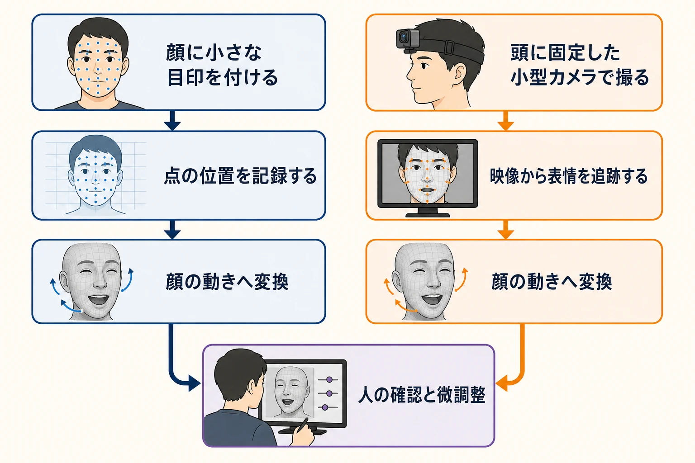
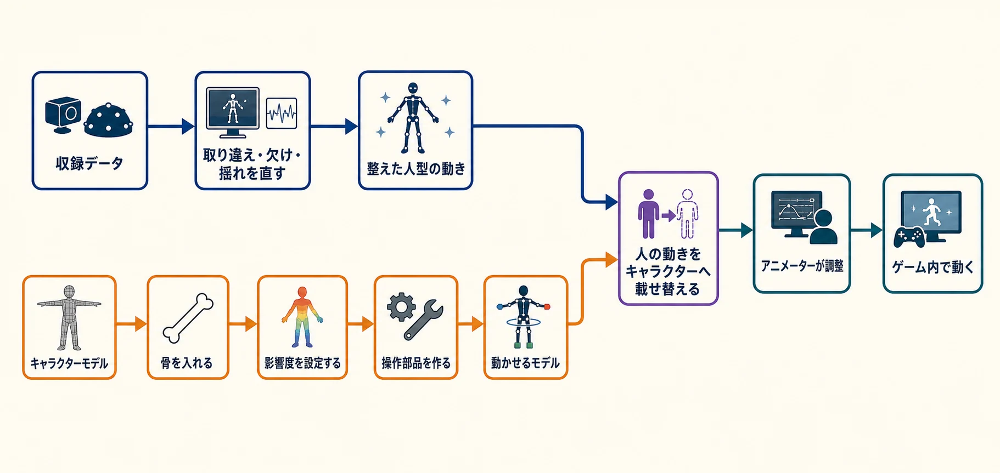

# モーションキャプチャは収録して終わりではない――企画からゲーム内で動くまでの実務工程

***

## はじめに――スーツ姿の撮影は、長い工程の中間地点である

全身に目印を付けた役者が、カメラに囲まれたスタジオで剣を振る。モーションキャプチャと聞いて多くの人が思い浮かべるのは、この収録風景だろう。

実際の制作は、その場面より前から始まり、撮影後も続く。企画側とモーションアクターがキャラクターの動きを相談し、収録スタッフが小道具やセットを準備する。収録後には、途切れたり取り違えられたりしたデータを整え、動かす仕組みを入れたキャラクターモデルへ演技を載せ替え、アニメーターがゲームに合う動きへ仕上げる。

つまり、モーションキャプチャは「人の演技を記録する技術」だけを指す言葉では捉えきれない。ゲーム制作の現場では、モーションアクター、収録スタッフ、リガー、アニメーターが受け渡しを重ねる、一連の制作工程として機能している。

本稿では、機材やソフトウェアの名前ではなく、「何のためにその作業をするのか」を軸に、企画からゲーム内でキャラクターが動くまでを順番にたどる。

***

## 1. 収録前――モーションアクターと動きを考える

モーションアクターの仕事は、完成した指示書を受け取り、その通りに身体を動かすことだけではない。近年は企画段階から相談を受け、キャラクターに合う演技を提案する立場へ広がっている。

CEDEC 2024の講演では、モーションアクター会社の代表取締役・杉口秀樹氏とダンス事業部部長・Mao氏が、アイデア出しの段階から参加する利点を紹介した。たとえば同じ回し蹴りでも、主人公らしい大きな構えと決めポーズを入れるか、奇抜な身のこなしにするかで人物像は変わる。絵コンテだけでは想像しにくい動きも、アクターがその場で複数案を演じれば、制作側は比較しながら方向を決められる。[[1](#ref-1)]

この相談は、収録当日の迷いを減らす準備でもある。講演では、限られた一日に必要な動きを撮り切ろうとする中で、アクターが人物像を理解する時間を取れず、「とりあえずのモーション」になってしまった例が語られている。企画担当者とアクターが先にイメージを合わせれば、当日は演技の意図を共有した状態から始められる。[[1](#ref-1)]

アクターの提案は身体の動きだけにも限られない。キャラクターに近い衣装で演じ、布がどこまでめくれるか、顔や身体にかぶらないようどの部分を抑えるべきかを確認できる。漫画や絵コンテをもとにする場面では、静止したコマとコマの間をどの動きでつなぐかも補える。完成画面に映る一連の演技は、原画に描かれた要点だけでなく、その間をつなぐ提案によって成立するのである。[[1](#ref-1)]

この段階で必要なのは、アクターへ「歩く」「怒る」「剣を振る」とだけ伝えることではない。人物の性格、直前と直後の状況、衣装や武器、画面で伝えたい感情を共有し、実演を見ながら動きを具体化することである。

***

## 2. 収録の現場――小道具とセットもデータの質を左右する

収録日には、スーツとカメラ以外にも多くの準備が要る。役者が持つ武器、乗る階段、立ち位置を示す床、収録状況を確認する仕組みまで、演技とカメラの間にあるものがデータの質へ影響するからである。

Cygames大阪モーションキャプチャースタジオのテクニカルエンジニア・佐藤義久氏と、コーディネーター・嶋田健太氏の講演では、小道具を3Dプリンタで作る改善例が紹介された。従来は身近な材料で輪郭だけを再現することがあり、重量や材質の変更、可動部分の再現、破損時の修理が難しかった。そこでゲーム内と同じ形を作り、用途に合わせて重さや素材も変えられるようにした。[[2](#ref-2)]

拳銃なら弾倉を外し、はめ直してからスライドを引ける。ナイフなら刃を柔らかな素材にし、相手へ突き刺す演技ができる。形が似ているだけでなく、実物らしい手順や接触まで演じられるため、アクターからは感情移入しやすく、細かな演技にも差が出ると評価されたという。[[2](#ref-2)]

大道具も同じである。階段などを木で作ると、丈夫にするための面や補強材が、役者の身体に付けた目印とカメラの間を遮る場合がある。そこで同スタジオは、骨組みだけで形を作れるアルミフレームへ変更した。組み立てや撤収が容易になり、事前に強度を計算できるうえ、カメラを遮る面積も小さくなった。[[2](#ref-2)]

さらに同スタジオは、開発側が演技を早めに相談できるよう、モーションアクターを常駐させた。相談のしやすさだけでなく、急ぎの収録や、内容に応じたワイヤーアクション人材の手配にもつながった。企画と収録の距離を縮めること自体が、制作環境の改善なのである。[[2](#ref-2)]

専用スタジオの規模を、セガの公式施設で見てみよう。メインスタジオのキャプチャー有効エリアは21m×11.5m×4.5mで、カメラは100台以上、同時収録は10名以上に対応する。ヘッドマウントカメラ、音響機器、大型モニター、大道具や小道具も備える。[[3](#ref-3)]

この広さと台数は、単に豪華さを示す数字ではない。複数人の掛け合いを同じ時間と空間で演じる、役者同士が重なっても別の角度から捉える、高さを使ったワイヤーアクションを行う、といった収録の選択肢を支える。スタジオは、役者が自由に動ける場所であると同時に、演技を欠けにくいデータとして残すための環境なのである。

***

## 3. 顔の演技――点の動きを測る方法と、映像から追う方法

身体の動きに加えて、眉、頬、唇などの細かな変化を記録するのがフェイシャルキャプチャである。顔の収録にも複数の方法があり、大きく分けると「顔に付けた目印の動きを測る方法」と「顔の映像を撮り、ソフトウェアで表情を追跡する方法」がある。

目印を使う方法では、顔の各部へ小さなマーカーを置き、その位置が時間とともにどう動いたかを記録する。公式コラムで紹介された事例では、最初の案件で55個のマーカーを使用し、別の案件では頬の動きをより細かく拾うために増やして計86個を使用した。これは業界共通の決まった個数ではなく、取得したい表情と制作方法に応じて配置を設計した事例である。[[4](#ref-4)]

映像から追う方法では、頭に固定した小型カメラで顔を撮影する。表情を追跡するソフトが、目や口などの動きを映像から読み取り、キャラクターの顔を動かすためのデータへ変換する。同コラムの事例では、一度その人物の基準を作ると、同じ人物を撮影した別の映像も追跡できる仕組みが使われた。[[4](#ref-4)]

どちらも、撮った瞬間にキャラクターの表情が完成するわけではない。マーカーだけでは唇を突き出す、内側へ巻き込むといった形を十分に作れず、理想の顔形状や追加の調整が必要になった事例もある。映像から自動で追跡する方法でも、顔のどの形へ対応させるか、どの程度動かすかを設定し、最後に微調整する。[[4](#ref-4)]

***

## 4. 収録後――二つの準備が合流して、初めてキャラクターへ載る

収録を終えた時点で手に入るのは、カメラが捉えた点の移動や、映像・センサーから推定した人型の動きである。完成したキャラクターアニメーションではなく、そのデータをゲームのキャラクターへ結び付けるまでに、「収録データを整える作業」と「キャラクターモデルを動かせるようにする作業」が並行して進む。

### 収録データの取り違え、欠け、揺れを直す

身体の目印は、役者同士や小道具の陰に入ると一時的に見えなくなる。似た位置を通った二つの目印が、別の部位として認識されることもある。計測値には、実際の演技にはない細かな揺れが混じる場合もある。

データを整える担当者は、収録映像や3D表示と照らし合わせ、左右や部位の取り違えを直し、欠けた区間を前後の動きから補い、不要な揺れを滑らかにする。機材メーカーの公式マニュアルも、誤ったラベルの修正、欠けた区間の補完、ノイズの除去を収録後のクリーンアップ作業として案内している。誤認識を残したまま欠けを補うと予測も誤るため、修正には順序もある。[[5](#ref-5)]

これは演技を勝手に作り替える仕事ではない。カメラや解析の都合で崩れた部分を、人が演じた動きとして再び読める状態へ戻す作業である。

### リガーが、モデルの内側に「動かせる仕組み」を作る

一方、キャラクターの3Dモデルも、見た目が完成しただけでは動かせない。『ファイナルファンタジーXVI』でリガーを務める川崎広貴氏と東川聡仁氏によるCEDEC 2023講演では、リガーの仕事が、モデルをアニメーションで動かせる状態へ整えてアニメーターへ渡すことだと説明された。[[6](#ref-6)]

リガーはまず、身体の内側にボーンと呼ばれる骨を配置する。次に、腕の骨を動かしたとき、肩、胸、服などの各部分がどの程度影響を受けるかを設定する。さらに、アニメーターが骨を一本ずつ直接選ばなくても、手、腰、視線などを扱いやすく動かせる操作部品を用意する。必要に応じて髪や小物が揺れる仕組みも設定する。[[6](#ref-6)]

リガーは、収録後に初めて呼ばれて動きを貼り付けるだけの職種ではない。モデル制作側とアニメーション側の間に立ち、どの骨を共通化するか、キャラクター固有の身体や翼、装備をどう扱うか、後工程の操作をどう減らすかを考える。収録データを整える作業と、モデルへ動く仕組みを入れる作業は、別の担当が進める二本の準備線なのである。

### リターゲットで、人の骨格からキャラクターの骨格へ載せ替える

二つの準備が整ったところで、収録側の人型データを、キャラクター側の骨格へ対応付ける。これがリターゲットである。公式資料では、あるキャラクター用の動きを別のキャラクターへ移して動かす処理と説明されており、移し先には受け取るための骨格と操作の仕組みが必要になる。[[7](#ref-7)]

役者とキャラクターは、身長も手足の長さも同じとは限らない。人間の役者が演じた動きを、大柄な戦士、小柄な子ども、人とは異なる比率のキャラクターへそのまま数値コピーしても、同じ見え方にはならない。どの部位を対応させ、体格差をどう吸収するかを決めて、演技をキャラクターの身体へ載せ替える。

その後、アニメーターがキャラクターらしさ、場面の意図、ゲーム内のカメラや接触に合わせて動きを確認し、必要な修正を加える。モーションキャプチャは演技の土台を与えるが、完成判断まで自動化するものではない。ゲーム内での動きの読みやすさ、操作とのタイミング、状態遷移をどう検収するかは、既刊記事「[モーション・アニメーション監修の基礎――動きの質とタイミングをプランナーが検収するために](motion-animation-supervision-basics-for-planners.md)」で詳しく扱っている。

***

## 5. 番外――自宅収録は、スタジオと違う速さを持つ

専用スタジオとは別に、少ない機材で素早く動きを試す方法も広がっている。『ファイナルファンタジーXVI』の開発では、2020年にアニメーターのほとんどがリモートワークへ移ったことをきっかけに、自宅で収録する方法が検証された。[[8](#ref-8)]

試されたのは、身体に付けた加速度センサーで動きを取る方法と、スマートフォンなどで撮影した映像から姿勢を推定する方法である。別の検証機材には、6個のセンサーで全身を追跡するものもあった。映像を使う方法は、専用スーツやマーカーの設置が不要で、アイデアを思いついたときにすぐ撮影できたという。[[8](#ref-8)]

自宅収録の強みは、思い立った瞬間に試し、ビデオ通話で確認を受け、すぐデータを共有できることである。企画の仮動作、既存モーションの修正案、手だけの短い演技など、スタジオの日程を押さえる前に確かめたい用途と相性がよい。

専用スタジオには、自宅収録とは異なる役割がある。カメラの死角を減らしてデータの精度を保つ収録環境、10名以上の演技を同時に捉える広さ、ワイヤーアクション、小道具や大道具、現場で相談できる専門スタッフは、自宅の機材とは異なる価値を持つ。スタジオは大規模で複雑な本番収録を支え、自宅収録は試行と共有の速さを支える。目的に応じて収録方法を選べるようになったのである。

***

## まとめ――キャラクターの動きは、専門職の受け渡しから生まれる

モーションキャプチャの工程は、役者がスーツを着る前から始まる。企画側とモーションアクターが人物像や演技を相談し、収録スタッフが小道具、セット、カメラの見通しを整える。身体と表情を記録した後は、データの取り違え、欠け、揺れを修正する。

同時に、リガーはキャラクターモデルへ骨を入れ、各部位への影響度を決め、アニメーターが扱える操作部品を作る。整えた人の動きと、動かせる状態になったモデルがそろって初めて、リターゲットによる載せ替えができる。最後にアニメーターが場面とゲームに合わせて調整し、プレイヤーの見るキャラクターが動き始める。

したがって、モーションキャプチャは「演技を記録する技術」という一点だけでは説明しきれない。企画、実演、収録、データ加工、モデル準備、載せ替え、仕上げをつなぐ制作工程であり、それぞれの専門職が前後の仕事を理解して受け渡すことで、初めて一つの演技がゲームの中へ届くのである。

## References

1. [モーションアクターもクリエイター。言われた動作をキャプチャーするだけではなく、企画段階からの演技提案や実演で魅力的なゲームキャラを作り出す〖CEDEC 2024〗][1] - ファミ通.com。株式会社モーションアクターの杉口秀樹氏・Mao氏による、企画段階からの演技提案、衣装確認、コマ間の動きの補完を扱う講演レポート。

2. [［CEDEC＋KYUSHU］「モーションキャプチャー最前線」聴講レポート。3Dプリンタによる小道具作成やモーションアクターの常駐化など，7つの取り組みで対応力を向上][2] - 4Gamer.net。Cygames大阪モーションキャプチャースタジオの佐藤義久氏・嶋田健太氏による改善事例の講演レポート。

3. [SEGA MOTION CAPTURE STUDIO][3] - セガ公式。メインスタジオの有効エリア、カメラ台数、同時収録人数、提供サービスを掲載。

4. [第3回：フェイシャルキャプチャ編｜GEMBAコンバート道][4] - Autodesk AREA JAPAN。株式会社GEMBAの佐藤宏樹氏・廣田天氏が、顔のマーカー収録とヘッドマウントカメラによる映像ベース収録の事例を解説。

5. [Getting started with Vicon Shogun Post][5] - Vicon公式マニュアル。収録データの誤ラベル、欠損、ノイズを修正するクリーンアップ工程を説明。

6. [『FF16』顔のシワは形状の変形ではなくテクスチャのブレンドで表現。3Dキャラに必須の仕事人“リガー”のイロハと魅力〖CEDEC2023〗][6] - ファミ通.com。『ファイナルファンタジーXVI』のリガーである川崎広貴氏・東川聡仁氏による、骨、影響度、操作部品、部門連携を扱う講演レポート。

7. [Retargeting animation character-to-character][7] - Autodesk公式ヘルプ。あるキャラクター用のアニメーションを別のキャラクターへ移す方法と、両者に対応する仕組みが必要であることを掲載。

8. [［CEDEC 2023］モーションキャプチャを自宅で行うという選択肢。「FINAL FANTASY XVI：おうちDEモーションキャプチャ」聴講レポート][8] - 4Gamer.net。佐藤逸人氏・髙田英治氏による、自宅でのセンサー収録と映像による姿勢推定の検証を扱う講演レポート。

[1]: https://www.famitsu.com/article/202408/15778
[2]: https://www.4gamer.net/games/999/G999905/20231129032/
[3]: https://mocap.sega.com/
[4]: https://area.autodesk.jp/column/tutorial/gemba_convert/03_facial_capture/
[5]: https://help.vicon.com/download/attachments/341121023/Getting%20started%20with%20Vicon%20Shogun%20Post.pdf
[6]: https://www.famitsu.com/news/202308/26314473.html
[7]: https://help.autodesk.com/cloudhelp/2026/ENU/MotionBuilder-Character-Animation/files/Character-Animation/Retarget-animation/GUID-1DF2078C-D578-48E5-A245-6ED20A23CBA8.html
[8]: https://www.4gamer.net/games/529/G052958/20230826005/

----

この文書は、Perplexity、Claude、OpenAI Codex の3つのAIの支援を受けて著述されたものです。引用画像を除き、MIT License にて提供されています。
