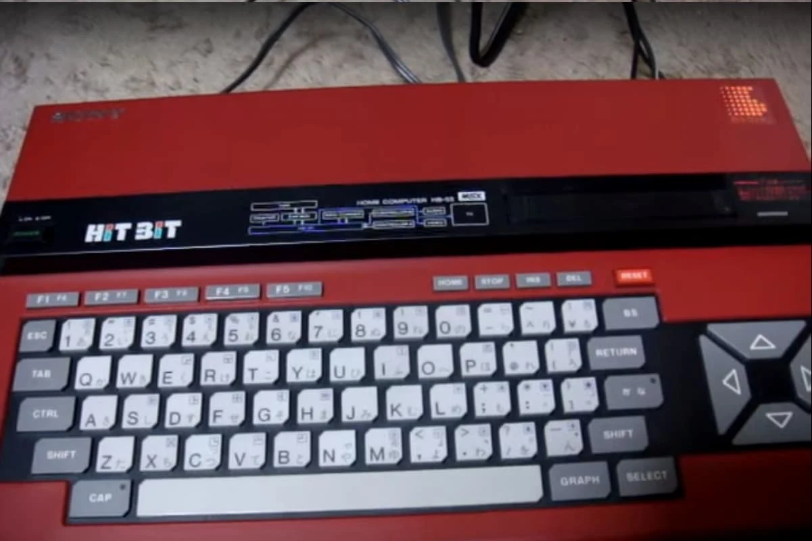
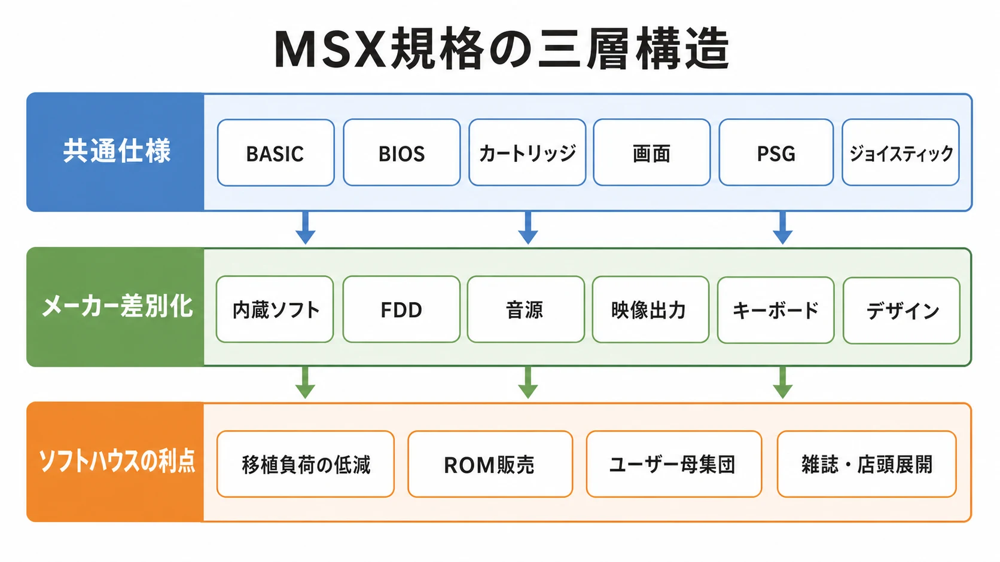
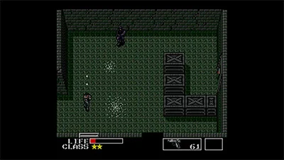

# MSXの歴史：統一規格が作ったホビーPCとゲーム制作文化

## はじめに：MSXは「勝者になれなかった標準」ではなく、入口を増やした標準である

Windows以前の国産PCゲーム史を、PC-8001、PC-8801、PC-9801、X1、X68000の流れだけで見ると、MSXは少し不思議な位置に見える。NECのPC-88/98のように国内PC市場の中心を長く握ったわけではない。X68000のように「アーケード級の表現」を前面に掲げた高性能機でもない。

しかしMSXの重要性は別の場所にある。MSXは、アスキーとマイクロソフトを軸に、メーカーごとにばらばらだったホビーPCへ共通仕様を持ち込もうとした規格である。ソニー、松下電器、東芝、三洋電機、ヤマハなどの家電・電機メーカーが同じ規格に乗り、ROMカートリッジ、BASIC、テレビ接続、ジョイスティック、周辺機器を通じて、家庭の中へ「作れるコンピュータ」を置こうとした。

MSX Technical Data Bookは、MSXの目的を、異なるメーカーのコンピュータでもプログラムが動くようにする標準化されたコンピュータを提供すること、と説明している。同書はMicrosoft Corporationの著作権表示を持ち、ASCII Corporationが制作した技術資料でもある[[1](#ref-1)]。つまりMSXは、単なる一社の製品ではなく、BASIC、BIOS、カートリッジ、画面、音、キーボード、I/Oをまとめた「交換可能性の設計」だった。

本稿では、MSXを「PC-88に勝てなかった機械」としては扱わない。むしろ、統一規格が多数の参入企業とソフトハウスを呼び込み、その中でコナミとコンパイルがどのようにゲーム制作文化を濃くしたかを見る。編者は長年のMSXユーザーであり、パナソニックのFS-A1、FS-A1F、FS-A1WX、FS-A1GTとともに、コナミのMSXゲームから強い影響を受けてきた。ただし本稿では、その体験を懐古の根拠にはしない。個人的な記憶が示すのは、MSXが単なるスペック表ではなく、家庭のテレビ、カートリッジ、キーボード、雑誌、友人宅の互換機を結んだ生活内プラットフォームだったという手触りである。

***

## 年表

| 年 | 出来事 |
|---|---|
| 1983 | MSX規格対応機が各社から登場し始める。ソニーHIT BIT HB-55は1983年11月発売のMSX対応ホームパーソナルコンピュータとして記録されている[[2](#ref-2)] |
| 1984 | ソニーHB-75など、RAM増量や内蔵ソフトを備えた入門機が展開される[[3](#ref-3)] |
| 1985 | MSX2世代が登場し、画面モード、VRAM、色表現が大きく強化される |
| 1986 | コンパイル『ZANAC』がMSX向けに登場。D4のEGGコンソール版は同作を1986年発売のMSX用縦スクロールシューティングとして紹介している[[4](#ref-4)] |
| 1986 | ソニーHB-F1がMSX2対応機として発売。1行80文字、同時256色、512×212ドット表示などが説明されている[[5](#ref-5)] |
| 1987 | コナミ『METAL GEAR』がMSX2向けに登場。公式サイトは同作を「伝説の英雄」ソリッド・スネークの原点となる戦いとして紹介している[[6](#ref-6)] |
| 1988 | MSX2+世代が日本市場中心に登場。横スクロール、自然画寄りの色表現、FM音源搭載機の増加が、後期MSXの特徴になる |
| 1990 | コナミ『METAL GEAR 2 SOLID SNAKE』がMSX2向けに登場。公式サイトは「潜入と破壊の美学。」を掲げる続編として紹介している[[7](#ref-7)] |
| 1990 | MSXturboR世代が登場。Z80互換資産を残しながら、R800系CPUによる高速化へ進む |
| 2000年代以降 | Project EGG、EGGコンソール、MSXエミュレータ、実機修理、FPGA互換機などを通じ、MSX資産の保存・再流通が続く |

***

## 第1章：統一規格が必要だった理由

1980年代前半の日本のホビーPC市場は、機種ごとに互換性が弱かった。CPUが同じでも、画面メモリ、BASIC方言、音源、キーボード、カセット入出力、ジョイスティック、カートリッジ、フロッピーディスクの扱いが違えば、ソフトはそのまま動かない。ソフトハウスから見れば、同じゲームを複数機種へ出すたびに、画面、入力、音、保存処理、ローダーを作り直すことになる。

MSXの狙いは、この断絶を減らすことだった。MSX Technical Data Bookは、標準ハードウェア構成として、Z80A互換CPU、32KBのシステムソフトウェアROM、最低16KB RAM、256×192ドット、16色、8オクターブ3声、1200/2400ボーのカセットインタフェースなどを整理している[[1](#ref-1)]。これは当時の最高性能を目指した仕様というより、ソフトが依存してよい最低限の土台を定める仕様である。

ゲームプランナー向けに言えば、MSXは「表現の上限」ではなく「開発・販売・遊び始めの下限」をそろえた。ROMカートリッジを差せば起動する。テレビにつなげる。ジョイスティックを挿せる。BASICで自作もできる。メーカーが違っても、MSX用ソフトを買う理由がある。これは現代で言えば、SDK、最低動作環境、入力仕様、ストア審査、セーブ仕様をまとめてプラットフォーム化する行為に近い。

ソニーHB-55は、その思想をよく示している。情報処理学会コンピュータ博物館は、HB-55を1983年11月発売のMSX対応ホームパーソナルコンピュータとし、ROMカートリッジを差し込むだけで使える入門機、家庭用テレビをディスプレイとして使える機械として説明している[[2](#ref-2)]。MSXは、専門家の机に置かれる「コンピュータ」だけではなく、家庭のテレビ横に置かれる「使ってみる機械」を狙ったのである。

*画像出典（引用）：MSX Wiki「[File:Hb55e.jpg](https://www.msx.org/wiki/File:Hb55e.jpg)」（投稿者：Mars2000you、Sony HB-55 (red)） / ROMカートリッジを差して使えるMSX対応入門機の外観資料として引用。WebP変換。*

ここで松下電器、ソニー、東芝、三洋電機、ヤマハなどの参入企業の位置づけが効いてくる。MSXは一社の垂直統合機ではない。家電メーカーは自社の販売網、AV機器、教育用途、音楽用途、テレビ接続、デザイン、価格帯で差別化できる。一方でソフトハウスは、完全な一機種専用ではなく、MSXという共通市場へ向けて開発できる。標準化は、作り手と売り手の両方に「参入してよい理由」を与えた。

ただし、この設計は最初から矛盾も抱えていた。最低仕様をそろえるほど、各社は別の場所で差別化したくなる。キーボード、RAM容量、内蔵ソフト、カートリッジスロット数、映像出力、FDD、音源、デザイン、価格で競うことになる。標準化は混乱を消したのではなく、混乱の場所を「互換性の外側」へ押し出したのである。

*MSXの共通仕様を土台に、メーカー差別化とソフト供給上の利点が重なる構造。*

***

## 第2章：MSX1からMSX2、MSX2+、MSXturboRへ

MSX1は、家庭用テレビとカートリッジを前提にした8ビット標準だった。256×192ドット、16色、3声PSGという仕様は、同時期の専用ゲーム機や他ホビーPCと比べて突出したものではない。しかし「複数メーカーで同じ前提を共有できる」ことが大きかった。シューティング、アクション、パズル、教育ソフト、BASIC教材、周辺機器が、MSXという棚に並ぶ。

MSX2では、ゲーム表現の重心が変わる。ソニーHB-F1の説明には、MSX2規格がMSXソフトを継承しつつ機能を強化した規格であり、512色から任意の16色を表示すること、同時256色表示、512×212ドット表示が可能であることが記されている[[5](#ref-5)]。これは、単に色数が増えたという話ではない。アドベンチャーの一枚絵、RPGの画面密度、タイトル画面、メニュー、キャラクター表現に使える情報量が増えたということだ。

ただしMSX2の強化は、X68000のような「アーケード基板に近づく」方向とは違う。MSX2はスプライトやスクロールの万能機になったわけではなく、VRAM操作、画面モード、色表現をどう使うかが制作上の工夫になった。アクションゲームでは制約が残り、ソフトハウスは画面切り替え、キャラクターサイズ、敵数、背景描画、当たり判定を慎重に設計する必要があった。

MSX2+は、日本市場中心に展開された後期規格である。一般的には、Yamaha V9958系VDPによる横スクロール機能や自然画寄りの色表現、MSX-MUSIC相当のFM音源搭載機が増えたことが特徴として語られる。ただし、全MSX2+機で体験が同一だったわけではない。標準が同じでも、搭載RAM、FDD、音源、内蔵ソフト、速度切替の扱いは機種差が出る。ここに、後期MSXの楽しさと難しさが同居していた。

MSXturboRは、互換資産を残しながらCPU性能を上げる試みだった。Z80系ソフト資産を捨てず、より高速なCPUへ進む発想は、プラットフォームの延命策として自然である。しかし1990年代初頭には、国内PC市場はPC-98、DOS/V、Windows、家庭用ゲーム機へ大きく流れ始めていた。高性能化したMSXが出ても、開発者、流通、ユーザーの投資先がすでに分散していた。

この世代変化から学べることは明快だ。互換性を守ったまま性能を上げる場合、古いソフトが動く安心感は得られる。しかし、新機能を使う理由がソフト供給側に十分な市場規模として返らなければ、規格更新は「動くが、使われにくい機能」になりやすい。現代のプラットフォームでも、次世代機能、上位端末機能、高性能APIは、普及台数と制作コストの釣り合いを見なければならない。

***

## 第3章：互換機競争の利点と混乱

MSXは統一規格であるがゆえに、多数のメーカーが参入できた。これは大きな利点だった。ユーザーは「ソニーのMSX」「松下のMSX」「ヤマハのMSX」を選んでも、MSX用ソフトが動くという期待を持てる。ソフトハウスは、NEC、シャープ、富士通、MSXのように機種ごとに完全分断された市場の中で、MSXという一つのまとまりを相手にできる。

この利点は、入口の広さとして現れた。安価な本体、家族向け内蔵ソフト、音楽用途、FDD内蔵モデル、AV寄りモデル、ゲーム寄りモデルが並ぶと、購入理由が増える。学校や家庭で「まずBASICを触る」「カートリッジで遊ぶ」「雑誌のリストを打つ」「友人の別メーカー機でも動かす」という動線が生まれる。

一方で、互換機競争は完全な平和を生まない。MSX1用ソフトなら動くが、RAMが足りない、FDDがない、音源が違う、MSX2専用である、MSX2+ならよりよい、漢字ROMやプリンタやデータレコーダが必要、といった分岐が出る。ユーザーにとっては「MSXなら全部同じ」ではなく、「自分の機種でその体験ができるか」を確認する必要があった。

ソフト制作側にも判断が必要だった。MSX1対応にすれば母数は広いが、表現は制限される。MSX2専用にすれば絵作りは強くなるが、対象ユーザーは絞られる。ROMカートリッジにすれば起動性と扱いやすさは高いが、容量と製造コストが問題になる。ディスクにすれば容量は広がるが、FDD所有者に限られる。これは現代のゲーム開発における、最低対応端末、ストレージ容量、追加ダウンロード、上位機能対応の判断と同じ構造である。

MSXの互換性は「全部を同一にする魔法」ではなかった。むしろ、互換性の核を決め、差別化してよい範囲を残し、その外側に生まれる混乱を市場が引き受ける仕組みだった。プラットフォーム設計では、この線引きが最も難しい。標準が硬すぎればメーカーの参入動機が弱くなる。標準が緩すぎればソフトの互換性が崩れる。MSXは、その綱引きを家庭用ホビーPCの規模で実験した規格だった。

***

## 第4章：コナミのMSX参入と、カートリッジが広げた表現

MSXゲーム史でコナミは特別な位置にある。『グラディウス』系、『魔城伝説』系、『夢大陸アドベンチャー』系、『メタルギア』系など、MSXユーザーの記憶に強く残る作品を多数出したからである。ただし本稿では、現役で活動する個々の開発者の人物評伝には踏み込まない。見るべきなのは、会社、タイトル、技術、媒体の関係である。

コナミのMSX作品が示したのは、標準機の制約をカートリッジ側で押し広げる発想だった。MSX本体のPSGは3声である。これだけでも音楽は作れるが、後期のコナミ作品は独自音源SCCをカートリッジに搭載し、MSX本体の外側から音楽表現を増やした。家庭用ゲーム機でもカートリッジ内チップによる拡張は見られるが、MSXでは「統一規格の本体に、ソフト側が追加ハードを持ち込む」ことで、会社ごとの制作色が強く出た。

この発想は、プランナーにとって重要である。ハード制約は、ただ耐えるものではない。媒体、周辺機器、同梱物、セーブ方式、追加チップ、マニュアル、パッケージを含め、どこまでを「作品の仕様」として持ち込むかを決める余地がある。コナミのSCCは、その代表例だった。標準化されたプラットフォームでありながら、タイトル単位で表現の上限を押し上げる手段を作ったのである。

『METAL GEAR』も、MSX2の制約を制作文化へ変えた象徴的な作品である。『METAL GEAR』は1987年にMSX2向けに発売された。KONAMI公式のメタルギアポータルサイトは、同作を「伝説の英雄」ソリッド・スネークの原点となる戦いとして紹介している[[6](#ref-6)]。続編『METAL GEAR 2 SOLID SNAKE』についても、公式サイトは「潜入と破壊の美学。」という言葉で紹介している[[7](#ref-7)]。

*画像出典（引用）：KONAMI「[METAL GEAR｜METAL GEAR PORTAL SITE][6]」 ©Konami Digital Entertainment / MSX2版の潜入画面を示す資料として引用。WebP変換。*

ここで重要なのは、「MSX2だからステルスが生まれた」と単純化しすぎないことだ。ゲームデザインは一つの制約だけで決まらない。だが、MSX2の画面、スプライト、処理、入力、メモリの制限が、敵を大量に出して撃ち合う設計より、発見、回避、通信、探索、アイテム使用を重視する方向と相性がよかったことは、制作上の判断軸として理解できる。

つまりコナミのMSX史は、「弱い機械でがんばった話」ではない。統一規格の上で、カートリッジ拡張、画面構成、音源、シリーズ設計、制約を逆手に取るジャンル設計を積み重ねた話である。MSXは主流PC標準にはなれなかったが、少なくともコナミにとっては、家庭用機やアーケードとは違う実験場だった。

***

## 第5章：コンパイル、『ZANAC』、そしてディスクステーション

MSX史におけるコンパイルは、一つの代表作だけで語るより、二つの接点で見る方が分かりやすい。一つは『ZANAC』や『アレスタ』系に見られる、制約の強い環境で高速感と反応する敵を作るゲーム設計である。もう一つは、ディスクマガジン『ディスクステーション』によって、単発パッケージではない継続的な接点を作ったことである。

D4のEGGコンソール版『ZANAC』は、同作を1986年発売の縦スクロールシューティングとして説明し、8種類の特殊弾、暴走したシステムとの戦い、そしてALC（Automatic Level of Difficulty Control）を見どころとしている。ALCは、連射速度や要塞の破壊などプレイスタイルに応じて難易度を調整し、展開が変化する仕組みとして紹介されている[[4](#ref-4)]。

ただし、ALCの仕組みそのものは本稿の主題ではない。ゲームAI史の記事では、MSX版『ザナック』のALC値表示や、プレイヤー行動によって難易度が変わる構造を詳しく扱っている。ここでは、コンパイルがMSX上で「プレイヤーの行動をゲームが読む」感覚を早い時期から商品価値として前面に出していた、という位置づけに留める。詳しくは関連記事「[ゲームAIの歴史：敵キャラクターから生成AIまで](history-of-ai-in-video-games.md)」を参照してほしい。

コンパイルステーションは『ZANAC』について、高速スクロール、豊かなウェポン、プレイ内容によって変化する敵アルゴリズムを挙げ、シューティングゲームのマイルストーン的存在として紹介している。また、MSX版『ZANAC』、FC版『ZANAC [A.I.]』、MSX2版『ZANAC EX』、PlayStation版『ZANAC NEO』へ続く展開も整理している[[8](#ref-8)]。ここから見えるのは、コンパイルが一作のアイデアを、機種ごとの制約に合わせて作り替えながら発展させたことである。

MSX史の中で同じくらい重要なのは、この反応するゲーム設計が、ディスク媒体による継続的なソフト供給と並んでいたことである。旧コンパイル公式のMSX2年表には、1988年の「ディスクステーション創刊準備号」と「ディスクステーション創刊」、1989年の「ディスクステーション月刊化」、同年の『ディスクステーションSPECIAL』春号、初夏号、秋号、クリスマス号、さらに1991年の「ディスクステーション総集編」が並んでいる[[9](#ref-9)]。これは、MSX2が単に大作ソフトを遊ぶ機械だっただけでなく、定期的に小さな作品や企画を受け取る媒体にもなったことを示している。

ディスクマガジンの重要性は、容量だけでは説明できない。カートリッジや単体パッケージは、一作ごとに買うかどうかを判断する商品である。一方、ディスクステーションは「次の号が来る」「今号には何が入っているかを見る」という編集された体験を作る。ゲーム、ミニゲーム、キャラクター、告知、実験的な企画を束ねることで、ソフトハウスとユーザーの関係を一回きりの購入から、継続的な読者・プレイヤー関係へ近づけた。

ここから見えるのは、コンパイルがMSXを単なる移植先として見ていなかったことだ。一方では『ZANAC』のように、限られた性能の中でプレイヤーの行動に反応するゲームを作る。もう一方ではディスクステーションのような編集形式で、ユーザーとの接点を増やす。MSXにおけるコンパイルの意味は、反応するゲーム設計と、継続的に届くソフト文化の両方にあった。

***

## 第6章：なぜ国内主流になれなかったのか

MSXが国内PC市場の主流になれなかった理由は、単純な性能不足ではない。むしろ、MSXは家庭用ホビーPCとしてはよくできた入口を持っていた。問題は、日本のPC市場全体が一つの軸で動いていなかったことにある。

第一に、ビジネス用途ではPC-98が強かった。日本語表示、帳票、表計算、ワープロ、周辺機器、販売店、業務ソフト、学校や企業の導入は、PC-98側に大きな蓄積を作った。MSXは家庭の入口として強かったが、仕事用PCの標準を奪うには弱かった。親が仕事や学習のために高価なPCを買う場合、MSXよりPC-88/98やワープロ専用機を選ぶ理由があった。

第二に、ゲーム用途では家庭用ゲーム機が伸びた。MSXはキーボードとBASICを持つため、作る楽しさがある。一方で、ゲームだけを遊ぶなら、ファミリーコンピュータのような専用機は安く、起動が簡単で、友人間の共通体験を作りやすい。MSXの「作れる」価値は強いが、全ユーザーがそれを求めるわけではない。

第三に、標準化が差別化を難しくした。MSX規格である以上、各社は共通仕様から大きく外れられない。だが店頭では、メーカーごとの機能差、価格差、内蔵ソフト、FDD、音源、デザインを訴求しなければならない。ユーザーから見ると、同じMSXなのに細部が違い、違うのに同じソフトが動く。この分かりにくさは、普及期には魅力にもなるが、成熟期には購入判断を難しくする。

第四に、規格更新のタイミングで市場が分散した。MSX2、MSX2+、MSXturboRへ進むほど表現力は増したが、その頃にはPC-98、Windows、家庭用ゲーム機、アーケード、携帯型ゲーム機がそれぞれ強くなっていた。規格が進化しても、ソフト供給側がそこへ全力投資する理由が弱まれば、上位規格の魅力は一部ユーザーに閉じやすい。

それでもMSXは、独自のポジションを築いた。主流ビジネスPCではなく、最高性能ホビーPCでもなく、家庭でプログラムとゲームをつなぐ標準機だった。子どもがBASICを触り、カートリッジで遊び、雑誌を読み、メーカー違いの友人とソフトを貸し借りし、やがてソフトハウスやゲーム制作に関心を持つ。その導線を作ったことが、MSXの本質的な成果である。

***

## 第7章：海外展開は「国内史の例外」ではなく、別の市場条件だった

MSXは日本だけの規格ではなかった。オランダ、スペイン、ブラジル、韓国など、地域によっては強い存在感を持った。特にオランダではPhilips、韓国ではDaewoo系のMSX互換機・ゲーム機が知られる。国内史だけを見て「MSXは主流になれなかった」と言い切ると、地域差を見落とす。

ただし本稿では海外展開へ深入りしない。重要なのは、MSXの意味が市場条件によって変わることだ。日本ではPC-88/98とファミコンの間に置かれたホビーPCだった。一方、地域によっては教育用コンピュータ、安価な家庭用PC、ゲーム機に近い互換機、ソフト流通の受け皿として機能した。

ここから得られる実務上の教訓は、同じ仕様でも、地域ごとに競合が違えばポジションが変わるということだ。日本での競合はNEC標準、シャープのホビーPC、家庭用ゲーム機、ワープロ専用機だった。海外では、Commodore、ZX Spectrum、Amstrad、Philips流通、韓国の国内ゲーム機事情などが絡む。プラットフォーム戦略を考えるとき、仕様表だけでなく、店頭、価格帯、教育制度、輸入規制、既存ソフト資産を見る必要がある。

***

## 第8章：MSXが後年に残したもの

MSXが後年に残した影響は、大きく三つに分けられる。

第一に、制約を設計へ変える文化である。コナミはMSXの制約とカートリッジ拡張を組み合わせ、音、画面、ジャンルの作り方を押し広げた。コンパイルは『ZANAC』でプレイヤー行動を観察して展開を変える設計を前面に出し、ディスクステーションで継続的なソフト供給の形も作った。どちらも「機械が弱かったから仕方なく」ではなく、「制約のどこを作品や接点の個性に変えるか」という制作判断だった。

第二に、標準化と差別化の両立である。MSXは共通仕様を作り、多数のメーカーを呼び込んだ。しかし、各社は内蔵ソフト、FDD、音源、映像、教育、音楽、デザインで差別化した。結果としてユーザーは広い選択肢を得たが、互換性の理解も求められた。現代のゲーム開発でも、クロスプラットフォーム対応、上位機能、周辺機器、DLC、クラウドセーブ、入力デバイスの違いは、同じ問題を繰り返している。

第三に、保存活動・エミュレータコミュニティへのつながりである。D4のEGGコンソール版『ZANAC』は、MSX、1986、COMPILEという原情報を明示し、同作を現行機向けに再流通させている[[4](#ref-4)]。同ページにはMSX Licensing Corporationの権利表記も掲げられている[[4](#ref-4)]。これは、MSXが単なる思い出ではなく、ライセンス、エミュレーション、復刻、権利整理を通じて、現在の遊べる文化資産になっていることを示す。

MSXの歴史を、売上や市場シェアだけで評価すると見落とすものがある。MSXは、国内PC標準の王者ではなかった。しかし、統一規格によって参入企業を増やし、家庭の入口を広げ、コナミとコンパイルのようなソフトハウスに独自の実験場を与え、後年の保存・復刻文化にまでつながる強い記憶を残した。

ゲームプランナー、ディレクター、プロデューサーにとっての学びは、ここにある。プラットフォームの価値は、最高性能だけでは決まらない。最低仕様をどこまでそろえるか。メーカー差別化をどこまで許すか。ソフトハウスが追加投資する余地をどこに残すか。ユーザーが遊ぶだけでなく作る側へ回れる入口をどう設計するか。MSXは、その問いを1980年代の家庭用ホビーPC市場で試した規格だったのである。

## References

1. [MSX Technical Data Book][1] - Microsoft Corporation著作権表示、ASCII Corporation制作、MSXの標準化目的、Z80A互換CPU、ROM、RAM、画面、音、カセット等の基本仕様を確認した。

2. [HIT BIT HB-55｜情報処理学会コンピュータ博物館][2] - 1983年11月発売のMSX対応ホームパーソナルコンピュータ、ROMカートリッジ利用、家庭用テレビ接続、主要仕様を確認した。

3. [HIT BIT HB-75｜情報処理学会コンピュータ博物館][3] - MSX規格機のRAM増量、内蔵ソフト、入門機としての展開を確認した。

4. [ZANAC（MSX）｜EGGコンソール][4] - 1986年、MSX、COMPILE、ALCによる難易度調整、8種類の特殊弾、権利表記を確認した。

5. [HB-F1｜情報処理学会コンピュータ博物館][5] - MSX2規格の互換継承、1行80文字、同時256色、512×212ドット表示、VRAM、ゲーム対応仕様を確認した。

6. [METAL GEAR｜METAL GEAR PORTAL SITE][6] - KONAMI公式の『METAL GEAR』紹介、シリーズの原点としての位置づけ、物語概要を確認した。

7. [METAL GEAR 2 SOLID SNAKE｜METAL GEAR PORTAL SITE][7] - KONAMI公式の『METAL GEAR 2 SOLID SNAKE』紹介、続編の位置づけ、物語概要を確認した。

8. [Compile Station｜D4エンタープライズ][8] - 『ZANAC』の高速スクロール、ウェポン、プレイ内容で変化する敵アルゴリズム、MSX版から後続版への展開を確認した。

9. [COMPILE GAME HISTORY -MSX2-｜コンパイル（Internet Archive）][9] - MSX2向け『ディスクステーション』の創刊、月刊化、SPECIAL各号、総集編の年表上の位置づけを確認した。

[1]: https://download.file-hunter.com/Manuals/msx_technical_data_book.pdf
[2]: https://museum.ipsj.or.jp/computer/personal/0100.html
[3]: https://museum.ipsj.or.jp/computer/personal/0101.html
[4]: https://www.amusement-center.com/project/egg/console/detail.php?date=20250225&id=ecsw0052&lang=en
[5]: https://museum.ipsj.or.jp/computer/personal/0102.html
[6]: https://www.konami.com/mg/history/jp/ja/mg
[7]: https://www.konami.com/mg/history/jp/ja/mg2
[8]: https://www.amusement-center.com/project/compile/
[9]: https://web.archive.org/web/20021003171644/http://www.compile.co.jp/game/other/msx2.html

----

この文書は、Perplexity、Claude、OpenAI Codex の3つのAIの支援を受けて著述されたものです。引用画像を除き、MIT License にて提供されています。
