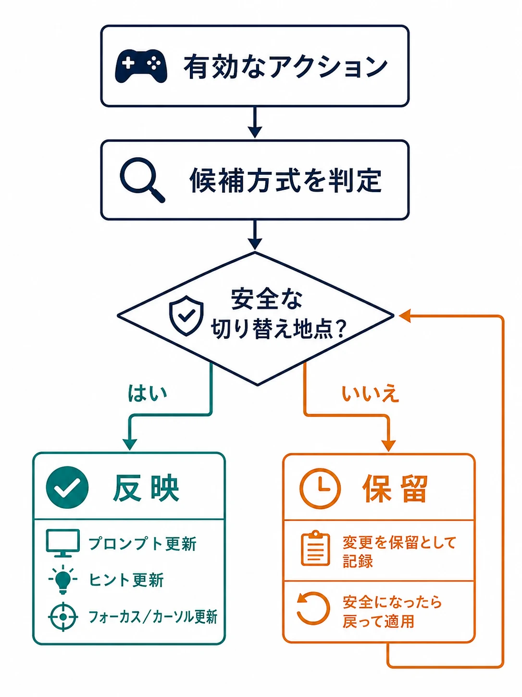

# 複数入力方式の切り替えUX設計――タッチ・ゲームパッド・キーボード＋マウスを同一セッションでどう共存させるか

## はじめに――「対応デバイス数」ではなく、途中で持ち替えても迷わないか

PCでゲームパッドを置いてマウスを動かす。携帯モードで遊んだ続きを、コントローラーを接続して再開する。スマートフォン版ではタッチで始め、外部コントローラーをつなぐ。複数プラットフォームへ展開するゲームでは、入力方式を一つ選んだまま遊び切るとは限らない。

このとき問題になるのは、ゲームが複数のデバイスを受け付けるかだけではない。プレイヤーが今どの方式で操作しているとゲームが解釈するのか、画面がどの操作を案内するのか、選択中の項目をどう見せ続けるのかを、同じセッション内で矛盾なく扱う必要がある。

本稿の主題は、特定タイトルの操作感の分析でも、エンジン実装の手順でもない。タッチ・ゲームパッド・キーボード＋マウスの違いを、プランナーが仕様書に落とすための判断軸である。中心となる考え方は、物理ボタンではなく **アクション** を先に定義し、入力方式が替わっても体験上の状態を保つことである。

***

## 1. 入力デバイスの「接続」と「現在使われた」は別の状態である

ゲーム機やPCには、複数の入力装置が同時に接続されうる。しかし、接続されていることは、その装置をプレイヤーが今使いたいことを意味しない。USB接続されたゲームパッド、キーを押していないキーボード、少し触れただけのマウスを、同じ重みで扱えば表示が不安定になる。

そこで仕様では、少なくとも次の三つを分ける。

| 状態 | 意味 | 画面へ与える影響 |
|---|---|---|
| 接続済みデバイス | 利用可能な装置の一覧 | 設定画面、再接続案内、参加判定 |
| 入力所有者 | そのローカルプレイヤーに割り当てられた装置 | ローカル協力、参加・離脱、個別プロンプト |
| 現在の操作方式 | 直近の意味のある操作に採用した方式 | プロンプト、カーソル／フォーカス、操作説明 |

Unity Input Systemの`PlayerInput`は、単一プレイヤーではキーボード＋マウスからゲームパッドへ移る例を含め、対応するコントロールスキームを自動で切り替える挙動を説明している。一方、複数の`PlayerInput`がある、または参加が有効なときは、未ペアリングのデバイスを誰が使ったのか判別できないため、この自動切り替えを止める。`neverAutoSwitchControlSchemes`で自動切り替えを抑止でき、`SwitchCurrentControlScheme`で明示的に切り替える口もある。[[1](#ref-1)]

この挙動は、プランナーにとって重要な示唆を持つ。自動切り替えは便利な既定値ではあっても、複数人・複数コントローラーの規則そのものではない。仕様書には「最後に何かを入力したデバイスへ切り替える」とだけ書かず、次を決める。

- **意味のある入力** ｜方向スティックの微小な戻りや、OSが発生させるイベントではなく、メニュー移動、決定、照準移動などを採用対象にするか。
- **採用範囲** ｜タイトル画面、ゲーム中、ポーズ、文字入力、ローカル協力の参加待ちで同じ規則にするか。
- **切り替えの主体** ｜画面全体で一つの方式にするか、ローカルプレイヤーごとに方式とプロンプトを持つか。
- **自動化の例外** ｜文字入力中、接続再認識中、入力割り当て画面では自動切り替えを止めるか。

検出イベントは、UIを差し替えるための材料であって、体験のルールではない。たとえば`onControlsChanged`はプレイヤーが使うコントロールが変わったときに通知される。[[1](#ref-1)] その通知を受けたら即座に全UIを描き替えるのか、現在の操作が完了してから案内だけ差し替えるのかは、ゲーム固有の仕様として決める。

### ボタンの絵は、方式ではなく「そのアクションの起点」から選ぶ

「ゲームパッド用の決定アイコン」を一枚だけ用意する設計も壊れやすい。同じゲームパッドでも、モデルによってフェイスボタンの表記は異なるからである。Steam Inputは、デジタルアクションの起点を取得して画面上のプロンプトに使い、その起点に対応するグリフ画像へのローカルパスを取得する仕組みを持つ。コントローラーの種別も、ハンドルごとに問い合わせられる。[[2](#ref-2)]

ここで仕様が持つべき順序は、次の通りである。

`画面が求めるアクション` → `現在のプレイヤーに有効な割り当て` → `その割り当ての物理入力` → `対応する表示名・グリフ`

先に「Aボタンを出す」と決めるのではない。決定というアクションを画面が要求し、現在有効な割り当てから表示を導く。この順序なら、リマッピング、ゲームパッドの種類、キーボード表示、プラットフォーム差分を一つの原則で扱える。

***

## 2. 物理ボタンではなくアクションを仕様の主語にする

複数入力に対応する仕様で、「Aは決定、Bはキャンセル」と書き始めると、差分が増えるたびに仕様の中心が崩れる。先に定義すべきなのは、プレイヤーがゲームへ伝える意図である。

Unreal EngineのEnhanced Inputは、Input Actionの下にキー、ボタン、移動軸などの入力を置き、Input Mapping Contextを実行時に追加・削除・優先順位付けできる構造を説明する。[[3](#ref-3)] これはエンジンの機能説明であると同時に、仕様書の単位としても有用である。画面、乗り物、観戦、写真モードなど、プレイヤーの文脈に応じて「利用可能なアクション」を定義しておけば、物理入力の表を後から入れ替えられる。

たとえば、仕様書の最初の表は以下のように書く。

| アクションID | プレイヤーの意図 | 利用可能な文脈 | 必ず成立させる代替 | 表示上の名称 |
|---|---|---|---|---|
| `UI.Confirm` | 選択中の項目を実行する | 全メニュー | タッチ、キーボード、ゲームパッドのいずれでも単独入力 | 決定 |
| `UI.Back` | 一段戻る、閉じる | 全メニュー | 画面内の戻る操作を持つ | 戻る |
| `UI.Navigate` | 選択対象を移す | リスト、グリッド | 方向入力とポインティングの双方 | 移動 |
| `Game.Interact` | 近くの対象へ働きかける | フィールド | タッチ時は対象タップまたは明示ボタン | 調べる |
| `Game.HoldAction` | 継続的な行為を開始／維持する | ゲーム中 | トグルまたは自動化を選択可能 | 走る |

この表の次に、プラットフォーム別・デバイス別の割り当て表を置く。二つを混ぜないことが重要である。Nintendo Switchではフェイスボタンの配置を回転させる、といったプラットフォームごとの差分を、Enhanced InputはPlatform SettingsのMapping Context Redirectで差し替えられる。[[4](#ref-4)] 仕様でも同じく、アクションの意味を変えずに、その環境で読める物理入力と表示へ置き換える。

アクション化には、もう一つ利点がある。競合解決を「このボタンは何をするか」ではなく「この場面でどのアクションが優先されるか」として議論できる。Enhanced Inputでも、同じ入力を消費する複数のContextがあるときは、優先順位の高いContextが採用される。[[3](#ref-3)] プランナーは、ポーズ中にゲーム内アクションを通すのか、チャット入力中にショートカットを通すのかを、Contextの開始・終了条件とともに書くべきである。

***

## 3. ホバーとフォーカスは、同じ「選択中」に見えて別物である

マウスのUIは、ポインタが要素の上に来ることでホバーする。プレイヤーは任意の位置へ瞬時に移動でき、ホバーはクリックの前の予告にも、説明を開くきっかけにもなる。

ゲームパッドのUIは、方向入力で候補を順番にたどり、現在の対象へフォーカスを置く。ポインタの位置ではなく、ナビゲーション順、初期位置、移動先、フォーカス喪失時の戻り先が体験を決める。両者を同じ見た目に寄せるだけでは不十分で、状態遷移を決めなければならない。

| 場面 | マウス／タッチポインタ | ゲームパッド／キーボード移動 | 仕様で決めること |
|---|---|---|---|
| 画面を開く | ポインタは任意位置にある | 初期フォーカスが必要 | 最初に選ぶ要素、選べない要素の扱い |
| 項目をなぞる | ホバーが連続して変わる | フォーカスが離散的に移る | 強調、説明、効果音をどちらに連動させるか |
| 決定する | ホバー中の要素をクリック | フォーカス中の要素を決定 | 実行直前の対象が一意に分かる表示 |
| 方式を持ち替える | ポインタ位置が残る | フォーカス位置が残る | どちらを選択状態として引き継ぐか |

解決は二択ではない。ホバーとフォーカスを完全に同一視する方法もあれば、見た目だけを共通化し、情報量や操作経路は分ける方法もある。大切なのは、プレイヤーが「今どれを決定するのか」を見失わないことである。

Unreal EngineのCommonUIは、ゲームパッド操作で不可視の合成カーソルを使う。フォーカス移動後に合成カーソルを対象ウィジェットの中央へ移し、マウス用に作ったホバー演出をゲームパッドでも成立させる構造である。[[5](#ref-5)] これは、既存のマウス前提UIを統合する実装上の有力な選択肢である。ただし、仕様として決めるべき本質は「カーソルを作ること」ではない。フォーカスと選択対象を同期させるのか、ホバー固有の補足情報をフォーカス時にも出すのか、持ち替えた瞬間に何を残すのかである。

特に危険なのは、ポインタが項目Aに残り、ゲームパッドのフォーカスが項目Bへ動き、Aだけが強調されたままBが決定される状態である。選択対象の強調は一つにする、または「ポインタ位置」と「ゲームパッドの現在位置」を明確に別表示する。どちらを選んでも、決定アクションの対象と視覚的な主状態を一致させる。

***

## 4. タッチにはホバーがない。情報を「触る前」に依存させない

タッチ画面には、マウスのような持続的なホバーがない。指が触れた時点で、タップ、ドラッグ、長押しなどの操作が始まる。したがって「カーソルを乗せると詳しい効果が出る」をそのまま移植すると、タッチプレイヤーは情報を得るために誤操作の危険を負う。

タッチ版では、情報と実行を分離する設計を選ぶ。

- **常時表示へ上げる** ｜次に必要な情報なら、ホバー専用のツールチップに閉じ込めず、カード、選択枠、詳細領域へ最初から置く。
- **1回目は選択、2回目で実行する** ｜誤実行の損失が大きい操作では、最初のタップで対象と説明を示し、次の明示操作で確定する。
- **タップ可能な情報ボタンを置く** ｜詳細だけを開く入口を、実行ボタンと分ける。
- **長押しの代替を併設する** ｜長押しでしか出せない機能を作らず、メニュー、単押しトグル、設定からも到達できるようにする。

同時押しや長押しを、画面が狭いからという理由でタッチ専用の必須操作にしてはならない。Xbox Accessibility Guideline 107は、複数ボタンの同時操作や特定順の高速入力、長時間のホールドが、リマッピングだけでは解消しない障壁になると整理する。代替として、個別の物理ボタンではなくアクションを再割り当てすること、継続操作をトグルや自動化へ置き換えることを挙げている。[[6](#ref-6)] UIは単独かつ非同時のキー入力で操作できるべきだという指針も示される。[[6](#ref-6)]

この考え方は、タッチと他方式を同じアクション表へ載せる際に有効である。たとえば`Game.HoldAction`に「押し続ける」という物理操作を埋め込まず、「継続行為を開始・維持する」という意図を定義する。ゲームパッドではホールド、タッチではトグル、簡易操作では自動実行というように、デバイスと設定に応じて実現を変えられる。

XAG 107が挙げる例でも、Fortniteモバイルには複数のプリセットHUDがあり、射撃は自動射撃・画面のどこでもタップ・専用ボタンから選べる。[[6](#ref-6)] Diablo Immortalには、専用の拾得タッチ対象を減らす自動拾得、Call of Duty: Mobileには専用の射撃対象を減らす簡易射撃モードがある。[[6](#ref-6)] これらをそのまま採用する必要はない。操作数を減らす、配置を選べる、実行方法を選べるという代替の型として、ゲームの核を損なわない範囲を検討する。

***

## 5. 実務で壊れやすいのは、切り替えそのものより境界条件である

切り替えの仕様は、通常操作だけを通しても十分ではない。複数コントローラー、スティックの微小入力、接続の途切れ、文字入力、ポーズ、通信待ちが重なると、画面の表示と実際に受け付ける入力がずれやすい。

### 複数コントローラーでは「誰の入力か」を先に決める

ローカル協力、観戦、家族が同じ画面を見る状況では、最後にボタンを押したコントローラーへ画面全体を渡す規則は危険である。プレイヤー1の設定画面を、プレイヤー2の入力で書き替えてしまうからだ。

仕様書には、以下を明記する。

- 参加前のコントローラーは、開始操作だけを受け付けるのか。
- ローカルプレイヤーに割り当て済みのコントローラーは、他プレイヤーのUIを操作できるのか。
- キーボード＋マウスは共有デバイスか、特定プレイヤーへ専有させるか。
- システムダイアログ、ポーズ、チャット、アクセシビリティ設定は、誰が操作できるのか。
- 切断時は一時停止、再接続待ち、別デバイスへの引き継ぎのどれにするか。

ここで「入力所有者」と「現在の操作方式」を分けておけば、プレイヤー1が所有するゲームパッドで操作したまま、説明を読むために共有マウスを少し動かした場合にも、所有権まで奪わずに済む。

### 表示のちらつきは、遅延ではなく採用規則の欠落から起きる

マウスを数ピクセル動かすたびにキーボード表示へ戻り、ゲームパッドのスティックがわずかに揺れるたびにアイコンが戻る。これは単に切り替えを遅くすれば解決する問題ではない。何を「方式変更」と見なすのか、表示と入力受付を同時に替えるのかを定めていないことが原因である。

仕様では、固定の時間値を先に決め打ちするより、次のような状態遷移を書くとよい。

1. 有効なアクションを発生させたデバイスを候補方式とする。
2. 候補方式が現在方式と異なる場合、UIの安全な切り替え地点かを判定する。
3. 切り替えるなら、プロンプト、操作ヒント、フォーカス／カーソルの可視状態を一つの更新として反映する。
4. 切り替えを保留するなら、入力は受け付けるか、明示的な方式変更を求めるかを画面ごとに決める。

「安全な切り替え地点」は、画面遷移後、決定操作の完了後、ドラッグや文字入力の終了後など、ゲームにより異なる。長い待ち時間を足して反応を鈍らせるのではなく、プレイヤーが見ている対象と実行結果が一致する境界で替える。

  

***

## 6. 仕様書へ最低限入れる、四つの表とテスト観点

複数入力対応を「対応予定」と一行で済ませると、UI、ゲームプレイ、QA、ローカライズが別々の前提で進む。少なくとも次の四つを、同じ仕様書または相互参照できる資料に置く。

| 資料 | 最低限書く項目 | 目的 |
|---|---|---|
| アクション表 | アクションID、意図、文脈、必須代替、リマップ可否 | 物理ボタンからゲーム設計を分離する |
| 割り当て・プロンプト表 | デバイス別割り当て、表示名、グリフの取得元、変更時の更新範囲 | 「決定」の意味と絵を食い違わせない |
| UI状態表 | 初期フォーカス、ホバー時／フォーカス時の見た目、方式変更時の引き継ぎ、決定対象 | マウス前提のUIをゲームパッドやタッチで破綻させない |
| 競合・例外表 | 入力所有者、複数接続、切断、文字入力、ポーズ、切り替え保留条件 | 境界条件を後回しにしない |

加えて、QAへ渡すシナリオは、デバイスごとに画面を一巡するだけでは足りない。少なくとも「ゲームパッドでメニューを開き、途中でマウスを動かしてから決定する」「タッチで詳細を読み、誤タップ後に取り消す」「二つのコントローラーを接続した状態で設定を開く」「文字入力欄でゲームパッドを操作する」「切断と再接続の途中でプロンプトを見る」を通す。

成功条件は、すべてのデバイスで同じ操作に見せることではない。どの方式でも、プレイヤーが現在の選択対象、可能なアクション、実行結果を理解でき、持ち替えたことで意図しない実行や操作不能に陥らないことである。

## おわりに――入力方式を替えても、プレイヤーの意図は替わらない

タッチ、ゲームパッド、キーボード＋マウスは、単にボタン数が違うだけではない。ホバーとフォーカス、連続入力と離散入力、画面上の直接操作という異なる操作モデルを持つ。それでも、プレイヤーがしたいことは「決定する」「戻る」「移動する」「調べる」といったアクションとして連続している。

だから、仕様の主語を物理入力ではなくアクションに置く。次に、現在の操作方式を何で判定するか、プロンプトを何から導くか、ホバーとフォーカスをどう同期するか、タッチで失われる事前情報を何で補うかを決める。最後に、複数接続と切り替え境界をテスト条件として書く。

この順序で設計すれば、エンジンやプラットフォームの機能は答えを代行する魔法ではなく、意図した体験を実現する選択肢になる。同一セッションで持ち替えられることを、対応表の注記ではなく、迷わず遊び続けられる体験として完成させられる。

## References

1. [PlayerInput Class \| Unity Input System 1.0.2][1] - コントロールスキームの自動・手動切り替え、単一プレイヤー時の挙動、`onControlsChanged`を説明するUnity公式APIリファレンス。

2. [ISteamInput Interface][2] - デジタルアクションの起点、入力デバイス種別、画面上のグリフ取得を説明するSteamworks公式APIリファレンス。

3. [Enhanced Input in Unreal Engine][3] - Input ActionとInput Mapping Context、実行時の追加・削除・優先順位付けを説明するUnreal Engine公式ドキュメント。

4. [Enhanced Input in Unreal Engine：Platform Settings][4] - Nintendo Switchのフェイスボタン回転など、プラットフォーム別にMapping Contextを差し替える機能を説明するUnreal Engine公式ドキュメント。

5. [CommonUI Input Technical Guide for Unreal Engine][5] - 合成カーソルをフォーカス中のウィジェットへ移し、ゲームパッド操作でホバー演出を成立させる仕組みを説明するUnreal Engine公式ドキュメント。

6. [Xbox Accessibility Guideline 107: Input][6] - 同時押し・長押しを含む入力の障壁、アクションの再割り当て、トグル・自動化、単独入力によるUI操作の指針に加え、FortniteモバイルのプリセットHUD・複数射撃方式、Diablo Immortalの自動拾得、Call of Duty: Mobileの簡易射撃モードを例示するMicrosoft公式ガイドライン。

[1]: https://docs.unity3d.com/Packages/com.unity.inputsystem@1.0/api/UnityEngine.InputSystem.PlayerInput.html
[2]: https://partner.steamgames.com/doc/api/isteaminput
[3]: https://dev.epicgames.com/documentation/en-us/unreal-engine/enhanced-input-in-unreal-engine
[4]: https://dev.epicgames.com/documentation/en-us/unreal-engine/enhanced-input-in-unreal-engine#platformsettings
[5]: https://dev.epicgames.com/documentation/en-us/unreal-engine/commonui-input-technical-guide-for-unreal-engine
[6]: https://learn.microsoft.com/en-us/xbox/accessibility/xbox-accessibility-guidelines/107
----

この文書は、Perplexity、Claude、OpenAI Codex の3つのAIの支援を受けて著述されたものです。引用画像を除き、MIT License にて提供されています。
