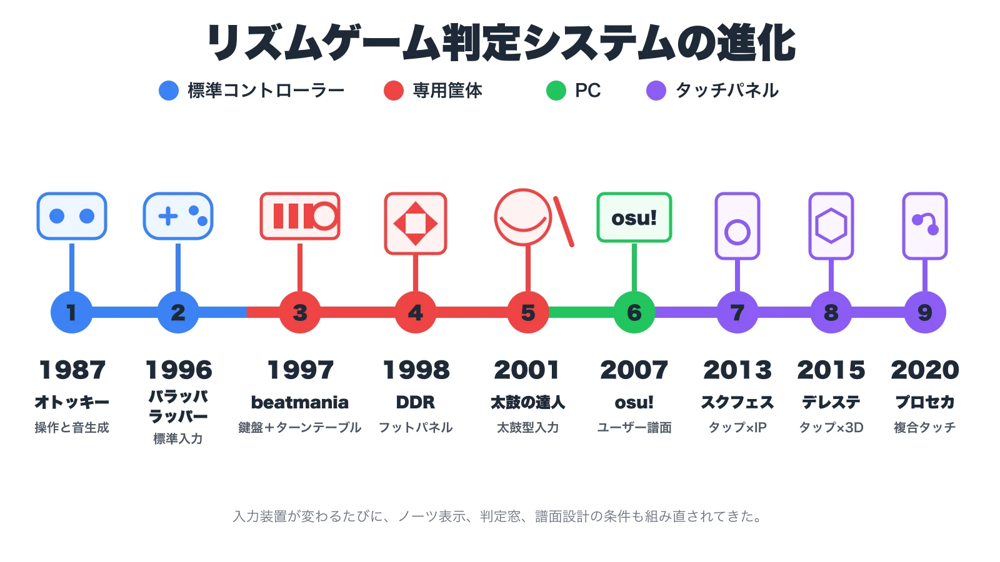
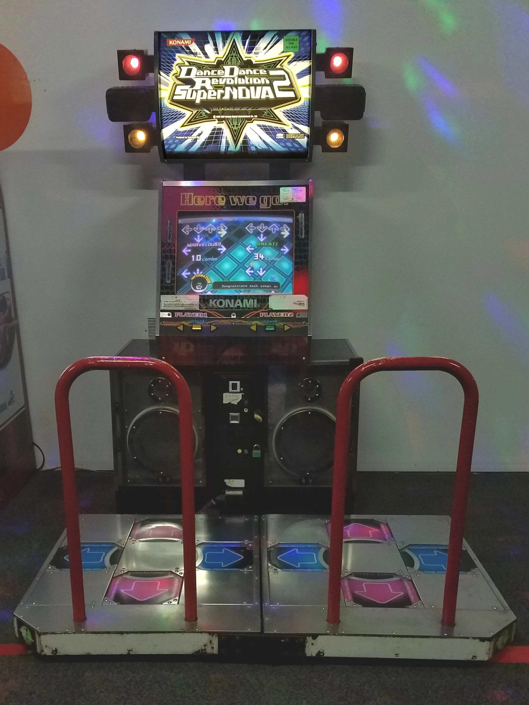
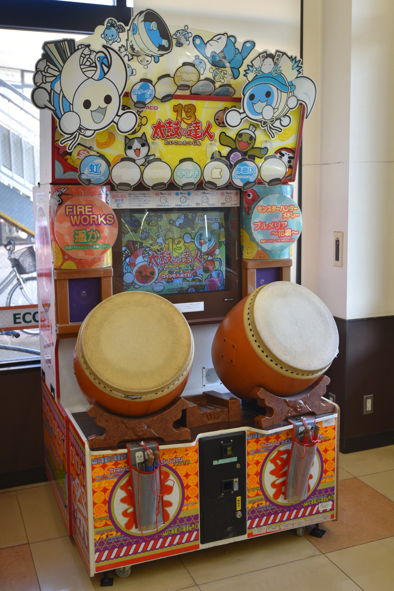
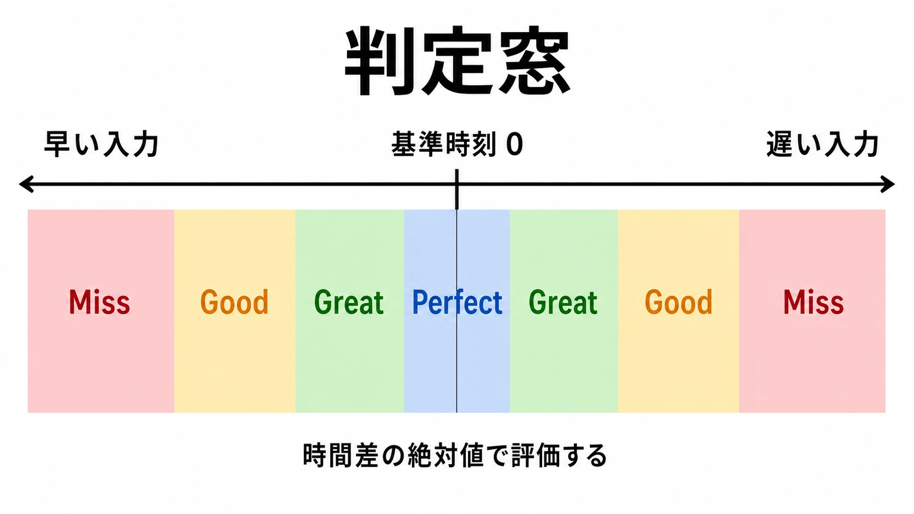

# リズムゲームの歴史：入力を「音楽体験」に変えた判定システムの進化

リズムゲームを「音楽に合わせてボタンを押すゲーム」とだけ捉えると、開発の難所を見誤る。

中心にあるのは、音楽そのものではない。楽曲上の基準時刻とプレイヤーの入力時刻を比べ、その差を評価し、結果を映像・音・スコアで返す **判定システム** である。どの音を叩かせるか。何ミリ秒のずれまで許すか。画面と音がずれた端末で、何を正しい入力とみなすか。これらを決めて初めて、楽曲はゲームになる。

本稿は、ゲームセンターや音響技術そのものの通史ではない。専用筐体、家庭用コントローラー、PC、タッチパネルへと入力装置が変わるたびに、「どう入力させ、どう判定するか」がどのように組み直されたかを追う。

----

## リズムゲームとは何か

本稿では、 **音楽やリズムに対応する時刻へ入力を合わせ、その時間差の評価を遊びの中心に置くゲーム** をリズムゲームと呼ぶ。日本では「音楽ゲーム」「音ゲー」も広く使われる。

重要なのは、「音が鳴るゲーム」と「入力タイミングを判定するゲーム」を分けることだ。音楽に合わせて敵が動くアクションゲームや、操作によって曲が変化する作品にも音楽的な遊びはある。しかし、入力時刻の良し悪しを継続的に返さなければ、本稿が扱う判定中心の設計とは少し離れる。

この境界が曖昧だから、単独の「最初」を決めるのは難しい。たとえば1987年のファミリーコンピュータ ディスクシステム用『オトッキー』は、8方向への射撃が異なる音を鳴らし、シューティングと音楽生成を結び付けた作品として記録されている。だが、現代的な段階判定を中心にしたゲームではない。前史には、音を操作で作る系譜と、合図に合わせて入力する系譜が並行して存在した、と見るほうが安全である。[[1](#ref-1)]

1996年に初代PlayStationで発売された『パラッパラッパー』は、画面のお手本に合わせてボタンを入力し、ラップの出来を評価する家庭用のリズムアクションだった。公式対談でも発売日は1996年12月6日と確認できる。ここでも「元祖」と断定するのではなく、音楽、キャラクター、入力評価を家庭用ゲームとしてまとめた重要な先駆けの一つ、と位置付けたい。[[2](#ref-2)]

*入力装置が標準コントローラー、専用筐体、PC、タッチパネルへ広がるにつれて、ノーツ表示、判定窓、譜面設計の条件も組み直されてきた。*

----

## 1990年代後半、アーケードで基礎文法が固まる

### 『beatmania』はDJ操作を入力装置にした

KONAMIの製品史では、アーケード版『beatmania』は1997年の製品として記録されている。公式の遊び方には、曲の進行に沿ってオブジェを処理し、鍵盤だけでなくスクラッチ操作を模倣する場面も示されている。[[3](#ref-3)][[4](#ref-4)]

ターンテーブルと鍵盤を備えた専用コントローラーの意味は、単に珍しい筐体を作ったことではない。入力を「正解ボタン」から「DJを演じる所作」へ変えたことにある。プレイヤーは音符を読むのではなく、画面上を流れる指示を見て、対応する身体動作へ変換する。その動作が楽曲の一部を担当しているように感じられる。

ここで後続作品へ受け継がれた基礎文法は、次の三つに分けられる。

- 楽曲上のイベントを **ノーツ** としてデータ化する。ノーツとは、入力を求める判定対象である。
- ノーツを時間軸に沿って移動させ、いつ入力するかを事前に見せる。
- 判定ライン付近で入力を受け、早い・遅い・正確といった結果を即座に返す。

流れるノーツは、未来の入力予定を空間へ展開する表示でもある。プレイヤーは音を聞いてから反応するだけではない。数拍先を読み、指を準備する。この「先読みできる時間の可視化」が、高速化や複雑化に耐える土台になった。

### 『DanceDanceRevolution』は判定を全身へ広げた

『DanceDanceRevolution』は1998年9月に日本のアミューズメント施設で稼働を開始した。画面下から流れる矢印に合わせ、足元のフットパネルを踏むゲームであることもKONAMIが説明している。[[5](#ref-5)]

判定ロジックの基本はボタン入力と似ていても、足で踏むと設計条件が変わる。手指より移動距離が長く、重心移動が必要で、連続入力には体力も関わる。左右の矢印を同じ時間間隔で置いても、身体の向きや直前の足位置によって難しさが変わる。

つまり、難易度はノーツの密度だけでは決まらない。入力部位、移動距離、同時押し、姿勢の戻しやすさまで含めて譜面になる。専用装置は没入感を増やす一方、設置面積、保守、安全性、家庭での再現性というコストも連れてくる。

### 『太鼓の達人』は「二種類の音」で入口を広げた

『太鼓の達人』は2001年に始まり、2021年に20周年を迎えたことが公式資料から確認できる。遊びの説明は「曲のリズムに合わせて太鼓をたたく」という簡潔なものだ。開発者インタビューでは、太鼓を叩く気持ちよさを遊びの核として守りながら、日々の更新や他社コンテンツの収録、コラボレーションを含む運営が語られている。[[6](#ref-6)][[7](#ref-7)]

面とふちを叩くという少数の入力は、説明しやすい。太鼓という既知の道具なので、画面上の記号と身体動作の対応も想像しやすい。一方で、入力種類が少ないから浅いとは限らない。左右の手順、連打、複合配置、休符の取り方で難度の幅を作れるからだ。

この時期のアーケード作品が示したのは、同じ「時刻差の判定」でも、入力装置によって遊びの意味が変わることだった。

| 作品 | 主な入力 | プレイヤーが演じる役割 | 譜面設計で増える制約 |
| --- | --- | --- | --- |
| 『beatmania』 | 鍵盤、ターンテーブル | DJ | 手の分担、スクラッチと鍵盤の複合 |
| 『DanceDanceRevolution』 | フットパネル | ダンサー | 重心移動、足運び、体力、安全性 |
| 『太鼓の達人』 | 面、ふち | 太鼓奏者 | 左右の手順、連打、少数入力での変化 |

*画像出典（引用）：LABcrabs, [DDR SN2 Upgrade - November 2021](https://commons.wikimedia.org/wiki/File:DDR_SN2_Upgrade_-_November_2021.jpg), CC BY-SA 4.0 / フットパネル筐体の外観を示す資料として引用。WebP変換。*

*画像出典（引用）：小石川人晃, [“Taiko no Tatsujin 13” for arcade game (Old housing)](https://commons.wikimedia.org/wiki/File:%22Taiko_no_Tatsujin_13%22_for_arcade_game_(Old_housing).jpg), CC BY-SA 4.0 / 太鼓型入力の外観を示す資料として引用。WebP変換。*

----

## 判定システムは何を計算しているのか

### 基本は「入力時刻－ノーツ時刻」

最も単純化すると、判定は次の差を求める。

$$
\text{入力時刻} - \text{ノーツの基準時刻} = \text{タイミング差}
$$

差の絶対値が小さければ上位評価、大きければ下位評価、一定範囲を外れればミスにする。Perfect、Great、Goodなどの名称は作品ごとに違う。各評価に割り当てる許容範囲を **判定窓** と呼ぶ。窓が広いほど成功しやすく、狭いほど精密さが求められる。

| 判定例 | 時間差の意味 | 設計上の役割 |
| --- | --- | --- |
| Perfect | 基準時刻に非常に近い | 精度を競う上限を作る |
| Great | 小さなずれがある | コンボを保ちつつ精度差を残す |
| Good | 大きめのずれがある | 初心者を即座に失敗させない |
| Miss | 許容範囲外、または未入力 | 失敗条件を明確にする |

*基準時刻からの時間差が小さいほど上位評価になり、範囲外はMissになる。*

実装では、これだけで終わらない。長押しの始点・継続・終点を別々に見るか。連打を回数で見るか。フリックの方向まで判定するか。早押しと遅押しを同じ幅にするか。複数ノーツが近いとき、入力をどのノーツへ割り当てるか。仕様の小さな違いが、譜面の作り方とスコアの意味を変える。

判定窓を狭くすれば競技性が上がる、とは限らない。端末差や表示遅延が得点へ混ざれば、競っているのが演奏精度なのか機材差なのか分からなくなる。反対に広すぎると、音から外れた入力まで成功し、手応えが薄くなる。対象プレイヤー、入力装置、失敗時の損失、スコア競争の重さを見て決める必要がある。

### 譜面制作は「曲をノーツへ翻訳する仕事」

譜面制作は、BPMに合わせて等間隔にノーツを置く作業ではない。BPMは曲の速さを表す目安であり、実際の曲には歌、ドラム、ベース、旋律、休符、拍子変化、意図的な揺れがある。どの要素をプレイヤーに担当させるかを選ばなければならない。

『プロジェクトセカイ カラフルステージ！ feat. 初音ミク』の譜面制作チームは、音、楽器、リズム、歌詞、作り手の意図を、ノーツの種類・形・配置で表現する仕事だと説明している。制作工程には、難易度ごとの作成、レビュー、実機確認が含まれる。[[8](#ref-8)]

難易度を上げる方法も、ノーツを増やすだけではない。

- 拾う音を主旋律から伴奏や細かな装飾音へ移す。
- 同時押し、交互入力、長押し中の別入力を組み合わせる。
- 視線移動や手の移動量を増やす。
- あえて休符を残し、次の入力を迷わせる。
- 同じリズムでも、入力装置に合う運指や足運びへ組み替える。

低難度では、曲の主要な拍を残し、入力方法を学べるようにする。高難度では情報量を増やせるが、曲にない忙しさを加えると、音楽を演奏している感覚が崩れる。譜面の「難しい」と「曲らしい」は別軸であり、両立には試遊と修正が要る。

さらにライブサービスでは、新曲のたびに複数難易度の譜面が必要になる。KLabは、機械学習による譜面制作支援を研究し、最終的に人が手直しする制作工程の効率化を説明している。これは譜面が一度作れば終わる機能ではなく、継続的なコンテンツ生産工程であることを示す。[[9](#ref-9)]

### レイテンシは「正しく叩いた感覚」を壊す

**レイテンシ** は、処理や伝送によって生じる時間の遅れである。リズムゲームでは、少なくとも音声出力、画面表示、入力取得、ゲーム処理の遅れが別々に存在する。

プレイヤーが聞いている音よりノーツ表示が遅ければ、耳に合わせた入力が画面上では早押しになる。映像に合わせれば、今度は音から遅れる。アクションゲームなら演出で吸収できる程度の差でも、時間差そのものを採点するリズムゲームでは、判定の信頼を直接壊す。

実装では、フレーム描画の時刻だけを基準にせず、音声再生側の安定した時計を使う方法がある。Unityの `AudioSettings.dspTime` は、オーディオシステムが処理した実サンプル数に基づくため、通常のゲーム時刻より正確だと説明されている。[[10](#ref-10)]

ただし、低遅延化にも代償がある。Androidの公式資料は、バッファを小さくすると遅延を減らせる一方、処理が間に合わなければ音切れが起きるため、端末に応じた調整が必要だとしている。[[11](#ref-11)]

そこで製品側では、次の対策を組み合わせる。

- 音声時計を基準にノーツ位置と判定時刻を計算する。
- 音とノーツ表示、入力と判定のオフセットを別々に調整できるようにする。
- EARLY／LATEを表示し、プレイヤーがずれの傾向を把握できるようにする。
- 端末、OS、描画品質、出力先を変えた実機試験を行う。
- Bluetoothなど遅延が大きい経路について注意を示す。

実際に『太鼓の達人 Pop Tap Beat』の公式FAQは、無線ヘッドホンで音声遅延が起こり得るとして、本体スピーカーや有線接続を案内している。[[12](#ref-12)]

オフセット調整は万能ではない。一定量のずれは補正できても、負荷によって揺れる遅延や、一曲の途中で変動する遅延は直せない。また、表示だけを合わせる補正と判定そのものをずらす補正では、意味が異なる。設定名だけでなく、何を動かしているかを仕様として共有する必要がある。

----

## 家庭用では「再現」と「再設計」が分かれた

アーケード作品を家庭へ持ち込むとき、専用コントローラーを再現すれば身体感覚を保ちやすい。しかし、価格、収納、防音、耐久性が参入障壁になる。標準ゲームパッドへ置き換えれば遊びやすいが、DJ、ダンス、太鼓を演じる意味は薄くなる。

家庭用の選択肢は、大きく三つある。

1. 専用コントローラーを用意し、アーケードに近い運動を再現する。
2. 標準コントローラーへ割り当て、譜面や判定窓を家庭用に調整する。
3. 家庭用の入力装置を前提に、最初から別の遊びを設計する。

1996年の『パラッパラッパー』は三つ目に近い。標準コントローラーで遊べるため、大型装置を必要とせず、キャラクターと物語を前面に出せた。一方、液晶テレビ、無線コントローラー、外部AV機器などの組み合わせが増えるほど、開発側が一つの遅延値を前提にすることは難しくなった。

ここでの判断軸は、アーケード版をどこまで忠実に再現するかではない。作品の核が、入力装置の身体性にあるのか、譜面を読む技能にあるのか、楽曲やキャラクターを楽しむことにあるのかを分解することである。

----

## PCと個人制作は「譜面を作る側」を広げた

PCでは、キーボードやマウスを前提にした作品だけでなく、譜面形式、エディター、ランキング、ユーザー投稿を組み合わせた文化が育った。

BM98で採用されたBMS形式の仕様は、BPM、音声ファイル、チャンネルごとの配置などをテキストで記述する。ゲーム本体と曲・譜面データを分けたことで、個人が曲と譜面を制作し、別のプレイヤーが読み込む流れを作りやすくした。[[13](#ref-13)]

2007年に公開された『osu!』も、早い時期から譜面データベースとオンラインランキングを備え、その後は複数のゲームモードやエディターを発展させた。公式の歴史資料では、公開年、オンラインランキング、譜面投稿の仕組みが記録されている。[[14](#ref-14)]

この広がりは、開発予算の小さいチームにも利点をもたらした。大規模な専用筐体がなくても、新しいノーツ表現、判定方式、音楽ジャンルを試せるからだ。反面、ユーザー投稿を扱うなら、権利確認、審査、難易度表記、ランキング不正、旧データとの互換性まで運営課題になる。自由に譜面を作れることと、自由に楽曲を配布できることは同じではない。

----

## スマートフォンは画面そのものを入力装置にした

### タップ、フリック、スライドが譜面の語彙になった

スマートフォンでは、表示面と入力面が重なる。プレイヤーは画面上の位置へ直接触れられるため、物理ボタンの数に縛られず、タップ、同時押し、長押し、フリック、軌道をなぞるスライドを譜面へ組み込める。

これは入力の自由度を増やした一方、新しい制約も作った。

- 指が画面を隠すため、次のノーツを読める余白が要る。
- 端末サイズや持ち方で届きやすい範囲が変わる。
- OSのジェスチャーや通知が入力と競合する。
- 画面端、複数指、長押し中の移動には端末差が出る。
- タッチ音がなく、成功の触覚的な手応えを別の演出で補う必要がある。

したがって、アーケードの譜面を縮小して載せるだけでは足りない。親指二本で持つ人と、端末を置いて複数指を使う人の両方をどこまで支えるか。フリック方向を厳密に見るか。長押しの終点を離す時刻まで採点するか。入力仕様と対象プレイヤーを一緒に決める必要がある。

### 日本では「曲を遊ぶ」と「キャラクターを追う」が結び付いた

2013年配信の『ラブライブ！スクールアイドルフェスティバル』は、公式資料で「リズムアクション＆アドベンチャー」とされ、同年9月にはユーザー数100万人到達が発表された。2015年には『アイドルマスター シンデレラガールズ スターライトステージ』が、楽曲に合わせたタップと3Dのダンス表現を組み合わせて配信された。[[15](#ref-15)][[16](#ref-16)]

ここで重要なのは、リズム部分だけで事業が成立した、という単純な話ではない。キャラクター、物語、カードや衣装、3Dライブ、イベント、継続的な楽曲追加が一つの運営サイクルになった。

2020年配信の『プロジェクトセカイ カラフルステージ！ feat. 初音ミク』は、基本無料の「リズム＆アドベンチャー」として、配信直後に20日連続の楽曲追加を実施した。公式年表には、配信から間もないユーザー数の節目と、イベントや機能更新が並ぶ。これらの人数は各社が公表した累計の数値であり、市場売上や継続利用者数を示すものではないが、スマートフォン音楽ゲームが短期間に大きな利用者接点を持ち、追加コンテンツで運営を続ける形を示している。[[17](#ref-17)][[18](#ref-18)]

この組み合わせが強い理由は、プレイ動機を一つに限定しない点にある。

- 好きな曲を遊びたい人には、新曲と譜面を届ける。
- 上達したい人には、高難度、スコア、ランキングを用意する。
- キャラクターを追いたい人には、物語、衣装、カード、ライブ表現を届ける。
- コミュニティには、イベント、協力プレイ、配信しやすい話題を供給する。

ただし、これは成功の公式ではない。曲、譜面、シナリオ、イラスト、3D、告知を同じ更新周期へ乗せるため、制作ラインが一つ詰まると全体へ影響する。判定の不具合は競技プレイヤーを傷つけ、物語の供給不足はキャラクターファンを離れさせる。複数の動機を束ねるほど、運営する製品も複雑になる。

### 楽曲追加は法務とデータ運用でもある

音楽ゲームへ既存曲を入れるとき、「曲の使用許諾を一つ取ればよい」とは限らない。作詞・作曲など楽曲そのものの著作権と、歌唱・演奏を録音した音源に関わる実演家・レコード製作者の著作隣接権は分けて考える必要がある。JASRACも、市販音源をゲーム配信で使う場合は、別途、音源製作者やアーティスト側の許諾が必要になると案内している。[[19](#ref-19)]

日本レコード協会は、レコード製作者を「音を最初に固定して原盤を作った者」と説明し、原盤の複製や送信可能化に関する権利を整理している。[[20](#ref-20)]

実務では、少なくとも次を早い段階で確認する。

- 作詞・作曲の権利を誰が管理しているか。
- 既存の市販音源を使うのか、新たに収録するのか。
- ゲーム内配信、広告、公式動画、配信地域をどこまで含めるか。
- 編曲、尺の編集、歌詞表示、カバー制作が許諾範囲に入るか。
- 契約期間終了や配信地域変更の際に、曲と譜面をどう扱うか。

特定タイトルの契約条件は外から推測できない。プランナーに必要なのは「有名曲を入れたい」と企画書へ書いて終えることではなく、権利確認、音源納品、譜面制作、動作確認、告知、配信終了時の処理までをスケジュールに置くことである。

----

## 歴史から見える、判定設計の判断軸

リズムゲームの歴史は、入力装置が増えた歴史であると同時に、何を公平な評価とみなすかを更新してきた歴史でもある。

新しく企画するときは、少なくとも次の問いを分けて考えたい。

1. **何を演じさせるのか。** DJ、ダンサー、奏者なのか。それとも抽象的なタイミング操作なのか。
2. **何を上達として測るのか。** 拍の正確さ、譜面認識、運指、体力、表現の自由さのどれか。
3. **どこまで失敗を許すのか。** 判定窓、ライフ、コンボ、再挑戦コストを誰に合わせるか。
4. **端末差をどう扱うのか。** 低遅延化、補正、実機試験、競技モードの条件をどう組み合わせるか。
5. **譜面を何本作り続けられるのか。** 難易度数、レビュー人数、更新頻度、権利処理を含めた制作能力を見積もれているか。

厳しい判定が常に優れているわけではない。ノーツの種類が多いほど豊かなわけでもない。専用コントローラーは強い身体性を作れるが、価格と普及を制限する。タッチパネルは入口を広げるが、端末差と誤入力を増やす。キャラクターIPとライブサービスは複数の継続動機を作るが、大きな制作・法務・運用体制を要求する。

だから、リズムゲームは単なる「音楽を聴くゲーム」ではない。 **プレイヤーが正しいと感じる時刻を定め、その時刻へ向かう予告を見せ、入力を受け取り、納得できる評価として返すゲーム** である。

音楽は時間を運ぶ。譜面はその時間を操作へ翻訳する。そして判定システムは、プレイヤーの身体と作品の時間が出会った瞬間をゲームにする。歴史を通して変わり続けたのは装置と市場だが、その中心にある仕事は今も同じである。

----

## References

1. [A rhythm-based shoot-'em-up in... 1987?][1] - 岩井俊雄氏への取材を基に、『オトッキー』が1987年に発売された音楽的シューティングであることと、操作と音の関係を説明している。

2. [『パラッパラッパー』誕生秘話満載！ 松浦雅也＆吉田修平スペシャル対談・完全版を独占公開！][2] - 初代PlayStation版の発売日と、開発者が語る企画背景を確認できるPlayStation公式対談。

3. [商品の歴史｜コナミグループ株式会社][3] - 『beatmania』を1997年の製品として掲載するKONAMI公式年表。

4. [beatmania｜KONAMI コナミアーケードゲーム製品・サービス情報サイト][4] - 鍵盤とスクラッチを含む初代『beatmania』の遊び方を説明する公式製品ページ。

5. [『DanceDanceRevolution A3』が本日より「DanceDanceRevolution 20th anniversary model」にて先行稼働開始！][5] - シリーズが1998年9月に稼働を始め、流れる矢印をフットパネルで踏むゲームであることを説明する公式発表。

6. [『太鼓の達人』祝20周年！熟練の開発スタッフが振り返る制作の舞台裏【後編】][6] - 2001年からのシリーズ史と、譜面制作を含む開発の舞台裏を扱うバンダイナムコ公式メディアの記事。

7. [ゲームセンター版『太鼓の達人』プロデューサーが語る“遊びのコア”][7] - 太鼓を叩く気持ちよさという核と、更新・収録・コラボレーションを含む運営業務を語る公式インタビュー。

8. [『プロジェクトセカイ』譜面制作インタビュー][8] - 音、楽器、リズム、歌詞、制作者の意図をノーツへ落とし込む制作工程を説明するColorful Palette公式記事。

9. [GenéLive!：リズムゲームの譜面制作をAIで加速][9] - 機械学習による譜面生成と、人による調整を組み合わせた制作支援を説明するKLab公式発表。

10. [AudioSettings.dspTime｜Unity スクリプトリファレンス][10] - オーディオシステムの実サンプル数に基づく高精度な時刻を説明する公式技術資料。

11. [Low latency audio｜Android game development][11] - 低遅延モード、コールバック、バッファ調整と音切れのトレードオフを説明するAndroid公式資料。

12. [There is a lag between songs and music notes. How can I fix it?][12] - 無線ヘッドホン等による音声遅延と対処を案内するバンダイナムコ公式FAQ。

13. [BMS Format Specification][13] - BM98が採用したBMSデータ形式の項目と記述方法を示す仕様書。

14. [History of osu!｜2007][14] - 2007年の公開、譜面データベース、投稿、オンラインランキングの導入を記録する公式Wiki。

15. [『ラブライブ！スクールアイドルフェスティバル』100万人突破記念キャンペーンを実施！][15] - 2013年の配信日、リズムアクション＆アドベンチャーという区分、ユーザー数100万人到達を示す公式発表。

16. [『アイドルマスター シンデレラガールズ スターライトステージ』本日9月4日より配信開始！][16] - 2015年の配信開始、タップ操作、3Dダンス表現を説明するバンダイナムコ公式発表。

17. [『プロジェクトセカイ カラフルステージ！ feat. 初音ミク』本日配信！][17] - 2020年9月30日の配信開始、基本無料方式、20日連続の楽曲追加を示すセガ公式発表。

18. [プロセカ年表][18] - 配信後のユーザー数の節目、イベント、機能更新を時系列で掲載する公式記念サイト。

19. [ゲームの配信｜JASRAC][19] - ゲーム配信での音楽利用手続きと、市販音源では著作隣接権の許諾が別途必要になることを説明する公式案内。

20. [音楽に関わる人々と著作権｜日本レコード協会][20] - 著作者、実演家、レコード製作者の区分と、原盤に関するレコード製作者の権利を整理する公式解説。

[1]: https://www.designroom.site/toshio-iwai-otocky-interview/
[2]: https://blog.ja.playstation.com/2017/04/05/20170405-parapparapper/
[3]: https://www.konami.com/corporate/ja/history/license.html
[4]: https://www.konami.com/arcadegames/products/am_bm_1/
[5]: https://www.konami.com/amusement/corporate/ja/topics/20220317/
[6]: https://funfare.bandainamcoent.co.jp/10035/
[7]: https://bandainamco-am.co.jp/company/asobito/article47.html
[8]: https://media.colorfulpalette.co.jp/n/n120951ae0e98
[9]: https://www.klab.com/jp/press/release/2022/1226/geneliveaiklabaaai-23.html
[10]: https://docs.unity3d.com/ja/2020.2/ScriptReference/AudioSettings-dspTime.html
[11]: https://developer.android.com/games/sdk/oboe/low-latency-audio
[12]: https://bnfaq.channel.or.jp/faq/detail/2005/5388
[13]: https://bm98.yaneu.com/bm98/bmsformat.html
[14]: https://osu.ppy.sh/wiki/en/History_of_osu%21/2007
[15]: https://www.klab.com/jp/press/release/2013/0924/id4677.html
[16]: https://www.bandainamcoent.co.jp/corporate/press/release/61/pdf/20150904.pdf
[17]: https://www.sega.jp/topics/detail/200930_4/
[18]: https://pjsekai.sega.jp/halfanniversary/history/index.html
[19]: https://www.jasrac.or.jp/info/network/game/index.html
[20]: https://www.riaj.or.jp/copyright/about/music/

----

この文書は、Perplexity、Claude、OpenAI Codex の3つのAIの支援を受けて著述されたものです。引用画像を除き、MIT License にて提供されています。
