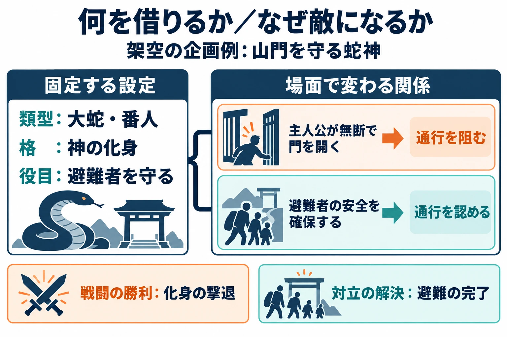

# その存在は、なぜ敵なのか――類型で神話を横断し、敵と味方の境界を決める

> ⚠️ **ネタバレ注意** ⚠️
>
> 本稿は『Hades』の敵と協力者、『Fate/Grand Order』第1部第7章の敵の正体とサーヴァント、『Never Alone』終盤の決着に触れます。『真・女神転生』シリーズについては、会話と仲魔の仕組みを扱います。

***

## はじめに――姿の説明に、対立の理由を足す

[第1回](mythology-enemy-design-five-checks.md)で予告した「味方としての登場」を、最終回となる今回は、敵と味方の境界を考える材料として扱う。

総論と地域・題材別の9回を通じて見てきた存在を、ここでは横に並べ直す。問いは二つだ。竜や番人のような「型」で比べると、敵に使えるどんな役割が見えてくるか。そして、同じ存在や同じ神話を使っていても、敵に置く場合と味方に置く場合を分けるものは何か。

本稿の判断軸は、 **「どの類型の、どの役割を借りるか」と「その存在は、誰にとって、どの場面で敵なのか」を分けて書く** ことである。類型は、似た特徴や役割を持つものをまとめて見るための型を指す。

たとえば「恐ろしい犬が門を守る」は姿と役割の説明だ。そこに「主人公は門の先にいる人を助けたいが、番犬には通行を許す権限がない」と加えると、対立の理由になる。許可が下りれば通れるのか、番犬を倒せば誰かが危険にさらされるのかまで考えると、戦闘の結末も選べる。

第1回の「格」は、神そのもの、化身、眷属、神話の怪物という、作品内で引き受けさせる立場だった。眷属とは、神などに従い、その力や役目につながる存在のことだ。今回の「番人」は、神にも怪物にも担わせられる役割である。 **格・類型・敵対関係を別の欄に置く** と、恐ろしい姿や強さに頼らず、その敵を登場させる理由を書ける。

***

## 1. 類型で見る――敵になりやすい五つの姿

### 型を引くときは、出所を一緒に残す

昔話や神話を比較する研究には、スティス・トンプソン（Stith Thompson）の『Motif-Index of Folk-Literature』という索引がある。改訂増補版は1955〜1958年刊の全6巻で、物語に現れる主題や登場人物、出来事などを分類する。インディアナ大学図書館が案内するオンライン版は、同大学の利用者を対象としている。[[1](#ref-1)]

以下の五つは、編者が敵の企画を考えるために選んだ分類であり、この索引の区分をそのまま移したものではない。竜が番人を兼ねるように、分類は重なってよい。比較するのは似た役割であり、それぞれの信仰や伝承の意味は、地域と資料に戻って確かめる。

### 竜・大蛇――何を倒し、その後に何が生まれるか

比較言語学者カルヴァート・ワトキンス（Calvert Watkins）は、『How to Kill a Dragon』（1995年）で、インド・ヨーロッパ語族の詩に受け継がれた竜退治の定型を論じた。語族とは、起源を共有する言語のまとまりである。本書の序文は、『リグ・ヴェーダ』の「彼は蛇を倒した」に当たる句を挙げ、同系の「倒す」を表す語が、ヒッタイトの神話、ギリシャの詩、ケルトやゲルマンの叙事詩などに現れると説明する。比較の中心は、筋の似かたと、それを語る言葉のつながりにある。[[2](#ref-2)]

本稿では、この研究の範囲を踏まえたうえで、既刊の二例を企画上の比較として並べる。[第4回の<ruby>八岐大蛇<rp>（</rp><rt>ヤマタノオロチ</rt><rp>）</rp></ruby>](mythology-enemy-design-japan-living-traditions.md)（『古事記』では八俣遠呂智）は、娘を襲う大蛇を酒で酔わせて討つ話に登場する。[[3](#ref-3)] [第7回のティアマト](mythology-enemy-design-ancient-near-east-protectors-remains.md)（Tiamat／Tiāmat）は、『エヌマ・エリシュ』で神々を生み、のちに倒され、その体が世界を形作る女神である。多頭竜としての姿を採る場合は、古代の物語に加え、後世のゲームの層を記録する必要がある。[[4](#ref-4)]

両者から借りられる共通の役割は、大きな脅威との対決によって状況が変わることだ。その変化には、誰かを救うことと、世界の成り立ちを語ることほどの違いがある。ここで並べることと、二つの物語に同じ起源があると論証することも別である。

ゲームへの移し方は、[第4回の『大神』（2006年、PlayStation 2）の八岐大蛇](mythology-enemy-design-japan-living-traditions.md)や、後述する『Fate/Grand Order』のティアマトを参照できる。[[5](#ref-5)][[6](#ref-6)]

敵に採る前に、 **退治によって誰が助かり、何が成立するのか** を一文にしたい。姿の巨大さだけでなく、勝利の後に残るものを決めると、その大蛇を選んだ理由が見える。

### 巨人――古い力、外にいる者、助ける者

[第3回](mythology-enemy-design-norse-gaps-symbols.md)で扱った北欧の文献の層を、巨人にも広げてみる。スノッリ・ストゥルルソン（Snorri Sturluson）の『エッダ』では、ユミル（Ymir）の体から大地や海、空が作られる。巨人は、現在の世界に先立つ存在として創世に関わる。[[7](#ref-7)]

北欧文学の研究者ジョン・マッキネル（John McKinnell）氏は、主人公を助ける女巨人も論じている。トール（Þórr）に道具を貸す援助がその一例だ。同じ文献群の中に、神に倒される巨人と、神を助ける巨人がいる。[[8](#ref-8)]

ギリシャ側では、ヘシオドス（Hesiodos）の『神統記』に、ゼウス（Zeus）たちと戦う前の世代のティタン神族（Titans／Titānes）と、武装して生まれるギガンテス（Gigantes）が、それぞれ異なる出自の集団として記される。企画で「古い巨大な敵」にまとめるときほど、この区別を残したい。[[9](#ref-9)]

比較から取り出せるのは、主人公側の秩序より古い力や、その外から関わる力という役割である。世界の材料になること、世代間で争うこと、主人公に力を貸すことは、別の意味を持つ。

敵にするときは、体の大きさと所属集団、敵対する動機を分けて書く。「巨人だから襲う」を、領域への侵入や目的の衝突へ具体化できるかが点検になる。

### 番人――プレイヤーが越えようとする線を守る

[第2回のケルベロス](mythology-enemy-design-greek-roman-layers.md)（Kerberos／ラテン語形Cerberus）は、冥界の番犬である。『神統記』では、その犬は入ってきた者を迎え、出ていこうとする者を見張る。[[9](#ref-9)] [第7回のフンババ](mythology-enemy-design-ancient-near-east-protectors-remains.md)（Humbaba／Huwawa）は、杉の森を守り、そこへ来た英雄たちと対立する。[[10](#ref-10)]

共通するのは、境界を守って移動を制限する役目だ。冥界からの退出と、森への侵入では、止める方向も守る対象も違う。主人公が境界を越えようとすれば、番人は自分の役目を果たすことで敵になる。

企画では、守る対象、通してよい相手、命令を出した者を決めたい。通行許可を得る、別の道を探す、守る対象を移すといった決着も、番人らしさから発想できる。

### 死者――体、霊、残された関係のどれを扱うか

死者の類型は、生きている者と死んだ者の境界を越えて関わってくる相手を考える入口になる。[第7回のミイラ](mythology-enemy-design-ancient-near-east-protectors-remains.md)では、近代ホラーの動く死者、架空の不死者、実在する人の遺体を分けた。包帯を巻いた敵を作る場合と、実在の王の名と遺体を使う場合では、企画が扱う対象が変わる。

一方、[第4回の<ruby>菅原道真<rp>（</rp><rt>すがわらのみちざね</rt><rp>）</rp></ruby>](mythology-enemy-design-japan-living-traditions.md)では、死後に災いをもたらすと恐れられた人物への信仰が、学問の神への信仰へと育っている。京都国立博物館の解説も、この変化を扱う。[[11](#ref-11)] 死者との関係には、恐怖に加えて、鎮めることや敬うことがある。

この比較で企画に持ち帰りたいのは、 **敵にする対象が、体なのか、霊なのか、解けずに残った恨みなのか** という問いだ。何を鎮めれば終わる戦いなのかを決めると、体を破壊する演出が必要かどうかも判断できる。

### トリックスター――何を乱し、何を変えるか

トリックスター（trickster）は、いたずらや策略、変身などによって決まりを揺さぶる存在を考えるための語である。神話研究者デイヴィッド・A・リーミング（David A. Leeming）氏の概説では、創造を助ける働きも、創造された世界を損なう働きも挙げられる。物語を動かす行為と、その結果の両方を見るための言葉として使いたい。[[12](#ref-12)]

[第3回のロキ](mythology-enemy-design-norse-gaps-symbols.md)（Loki）と、[第5回で参照元をたどった『西遊記』](mythology-enemy-design-china-novels-adaptations.md)の<ruby>孫悟空<rp>（</rp><rt>そんごくう</rt><rp>）</rp></ruby>（Sūn Wùkōng）は、この観点から比べられる。ロキには終末へ関わる筋があり、孫悟空には天界を騒がせた後に取経の旅を助ける筋がある。ここでの取経は、仏教の経典を求めに行くことである。[[13](#ref-13)] 編者が敵の案に引くなら、「決まりを破る」ことに加え、その行為が破局へ向かう場面か、助力へ向かう場面かまで選ぶ。

[第9回のニャルラトホテプ](mythology-enemy-design-artificial-authors-licenses.md)（Nyarlathotep）は、人工神話の作者と作品の層へ戻るための例になる。企画上、相手を惑わせる役割を比較することはできるが、どの作品で何をする存在なのかを併記する必要がある。ロキや孫悟空との共通の分類名だけで、性格や行動を補ってしまうと、作品固有の怖さを落とす。

敵にするときは、嘘で誰のどんな判断を変えるのか、変身が何を隠すのかを具体化したい。戦闘のルールを乱す演出を足す場合にも、それは資料から借りた特徴なのか、ゲームのために加えた仕掛けなのかを書き分ける。

***

## 2. 神話の中の境界――恐ろしいことと、敵であることは別

### 荒魂と和魂――同じ神霊の異なる働き

神道には、神霊の荒々しい現れを指す<ruby>荒魂<rp>（</rp><rt>あらみたま</rt><rp>）</rp></ruby>と、穏やかな働きを指す<ruby>和魂<rp>（</rp><rt>にぎみたま</rt><rp>）</rp></ruby>という捉え方がある。國學院大學『Encyclopedia of Shinto』は、神霊が荒魂として現れ、鎮めと祭祀によって和魂になると説明し、同じ神霊の異なる面として位置付ける。下関の住吉神社では荒魂、大阪の住吉大社では和魂を祀る例も紹介している。[[14](#ref-14)][[15](#ref-15)]

同事典の神霊観の概説では、荒魂は勇猛さや積極的な働きとも結び付けられる。そこでは神霊について複数の捉え方があることも示されている。[[16](#ref-16)] この範囲で読むなら、荒ぶる面と恵む面を持つことを、「悪い状態を倒して善い状態へ戻す」という一本の筋へ縮めずに考えられる。

編者は、敵の設定を作る際にも、「今ここで起きている荒々しい働きを止める」と「その存在そのものを悪と定める」を、別の選択として記すことを提案する。前者を選ぶなら、勝利の後にも祭祀や対話、距離を保つ関係が続きうる。どちらを描くかは、参照する伝承と、作品で必要とする対立から決める。

### 祀られた人――恐れと守護は、時間の中で重なる

同事典の概説は、人の霊を神として祀る伝統の展開を、平安時代の菅原道真から近世以降へと説明している。道真の事例は、恐れられた死者への祭祀と、その後に広がる信仰を考える手掛かりになる。[[16](#ref-16)]

[第4回の<ruby>平将門<rp>（</rp><rt>たいらのまさかど</rt><rp>）</rp></ruby>](mythology-enemy-design-japan-living-traditions.md)にも、恐れられた力と守る力が重なる。神田明神の由緒は、将門塚の周辺の天変地異が将門の力として恐れられ、御霊を慰めて祀ったと伝える。現在の同社は、将門を除災厄除の神として紹介する。これは、神社が伝える由緒と信仰の説明である。[[17](#ref-17)]

[第5回の関羽](mythology-enemy-design-china-novels-adaptations.md)（關羽、Guān Yǔ）では、歴史上の武将、小説の人物、関聖帝君として祀られる神という面を分けた。横浜関帝廟では商売繁盛を願う信仰が紹介されている。[[18](#ref-18)] 道真や将門と比較できるのは、人が死後も力を持つ存在として祀られる点であり、祀られるまでの経緯はそれぞれにたどる必要がある。

「生前の武将」「災いをもたらすと語られた霊」「今も祀られる神」のどこを借りるかで、敵対する理由も変わる。現在の信仰まで見れば、敗北後の台詞や退場の描き方を考える材料も増える。

### 恐ろしい守護者――力が向かう先を見る

[第7回のパズズ](mythology-enemy-design-ancient-near-east-protectors-remains.md)（Pazuzu）は、怖い姿と守護が結び付く例だ。古代メソポタミアでは、その像が護符として使われ、妊婦や赤ん坊を襲うとされたラマシュトゥ（Lamashtu）に対抗した。[[19](#ref-19)]

番人と合わせて考えると、恐ろしい力を誰へ向けるかが、敵味方を分ける場面を作れる。編者の企画例なら、主人公が護られている家へ侵入したときに、その守護の力が主人公へ向く。力の性質と守る役目を残したまま、対立の相手を変える発想である。

### 敵を名指す側にも、立場がある

[第7回のセト](mythology-enemy-design-ancient-near-east-protectors-remains.md)（Seth／Set）は、時代や場所によって評価が変わる。太陽神ラー（Ra／Re）を守る役目を持ち、一部の地域では他地域での否定的な評価が強まった後にも信仰が続いた。[[20](#ref-20)] 敵としての姿を採る場合には、地域と時期を添えることで、その評価の出所を示せる。

[第8回のウェンディゴ](mythology-enemy-design-recorders-living-communities.md)（Wendigo／Windigo）では、物語を受け継ぐ共同体の中の意味が関わる。オジブウェ（Ojibwe）の宗教文化を研究するブレイディ・デサンティ（Brady DeSanti）氏は、その存在を、心のバランスや社会の調和、人間以外の存在との関係に結び付けて論じた。[[21](#ref-21)] そこから恐ろしさを借りるなら、人を襲う能力とともに、何を戒め、どんな関係を問う物語なのかを受け取りたい。

同回の『Never Alone（Kisima Inŋitchuŋa）』（2014年、ここではPC版を基準とする）では、ブリザードマン（Blizzard Man）との対立が、吹雪を起こす手斧を奪って壊す決着へつながる。[[22](#ref-22)][[23](#ref-23)] 詳細は既刊に譲るが、企画上の要点は、脅威を生む行為や道具を止めることを勝利にできる点だ。

これらの事例から編者が引き出すのは、 **誰が何を脅威と呼び、プレイヤーに何を止めさせるか** を書く方法である。ゲーム内の主人公の立場に加え、画面の外でその伝承を語り、受け継いでいる人の立場も、参照元として残したい。

***

## 3. ゲームの中の境界――倒す相手、交渉する相手、力を借りる相手

### 『真・女神転生』――会話が関係を変える

アトラスの『真・女神転生V Vengeance』は、2024年6月14日にNintendo Switch、PlayStation 5・4、Xbox Series X｜S、Xbox One、PCで発売された。[[24](#ref-24)][[25](#ref-25)] 作中の悪魔とは会話でき、交渉が成立すると、味方の悪魔である「仲魔」になる。[[26](#ref-26)][[25](#ref-25)]

会話と仲魔は、シリーズの複数作品に続く仕組みだ。たとえば『真・女神転生III NOCTURNE HD REMASTER』（2020年、日本のNintendo Switch・PlayStation 4版）も、悪魔との交渉で仲魔を増やすことを公式に説明している。[[27](#ref-27)] ここでは、遭遇した相手と戦い続けるか、言葉を交わすかが、プレイヤーの選択になる。

企画として注目したいのは、同じ相手が、交渉前には敵、成立後には協力者になることだ。怖い姿が変わることより、関係を変える手続きがあることが重要になる。

この仕組みから「どのボスとも会話だけで決着できる」という規則を引くことはできない。ゲームごと、場面ごとに交渉の対象と条件がある。編者の提案としては、敵のデータを作る時点で、交渉できる相手と、物語上の対決を必要とする相手を分け、その理由を用意しておきたい。

### 『Hades』――主人公の目的から、助ける側が見える

Supergiant Gamesの『Hades』は、2020年にPC・Mac・Nintendo Switch向けの正式版が発売された。[[28](#ref-28)] 主人公ザグレウス（Zagreus）は冥界からの脱出を目指し、ゼウスやアテナ（Athena）らオリュンポスの神々から恩恵（Boon）を受ける。恩恵とは、この作品では冒険中の能力を強める助力である。[[29](#ref-29)]

[第2回](mythology-enemy-design-greek-roman-layers.md)では、冥界で立ちはだかるテセウス（Theseus）とアステリオス（Asterius）を扱った。開発者への取材では、二人の友情は本物として描かれている。[[30](#ref-30)] 主人公の敵にも、相手側の大切な関係がある。

編者はこの配置を、主人公の「外へ出たい」という目的から読む。同じギリシャ神話に属する存在でも、脱出に力を貸す者と、行く手を阻む者では、プレイヤーとの関係が変わる。神か怪物かという格だけで、味方と敵を振り分ける必要はない。

味方の置き方にも幅がある。ここで神々から得るのは、同じ隊列で戦う仲間だけを意味するものではなく、力を借りる関係だ。企画書に「味方」と書くときは、同行するのか、道を開くのか、能力を貸すのかまで具体化すると、敵対する場面との違いが明確になる。

### 『Fate/Grand Order』――神格の名と、作品内の役目を分ける

『Fate/Grand Order』（TYPE-MOON／アニプレックス、FGO PROJECT）は、2015年にiOS・Android向けに配信を開始した作品である。[[31](#ref-31)][[32](#ref-32)] 神話や歴史に由来する存在から作られたキャラクターが、召喚されて戦う「サーヴァント」として、プレイヤーに力を貸す。

2016年11月の公式告知には、召喚できるサーヴァントとしてイシュタル（Ishtar）が登場する。[[33](#ref-33)] 同作の第7章を映像化した公式アニメの人物紹介も、イシュタルをメソポタミアの女神として説明する。同じ紹介は、物語の中でイシュタルがウルクをたびたび襲撃しては退散していくことにも触れている。一つのキャラクターの中にも、敵対する場面と力を貸す場面が並びうる。[[34](#ref-34)] 神格に由来する存在が、プレイヤー側に置かれる例である。

一方、2016年12月7日に公開された第1部第7章では、[第7回で扱ったティアマト](mythology-enemy-design-ancient-near-east-protectors-remains.md)が人類に敵対する。[[32](#ref-32)] 関連する漫画版の公式紹介は、彼女を「原初の母」と呼び、泥から生まれる存在による危機を描く。[[35](#ref-35)] 敵にする際にも、生み出す存在という特徴が残されている。

この比較では、イシュタルとティアマトという異なる神格を、同じ作品が別の役目に置いている。「女神である」ことだけでは、プレイヤーへの助力も敵対も決まらない。

企画へ持ち帰るなら、神話上の存在と、作品内で召喚される姿や敵として現れる姿を分けて記したい。「サーヴァント」という作品固有の設定を、現実の神話に共通する分類へ置き換えず、その作品がどんな条件で力を借りられることにしたかを見るのである。

### 三つの境界を、企画書の欄にする

次の整理は、ここまでの事例をもとにした編者の企画上の提案である。作品の全場面を一つの仕組みで説明する表ではなく、各作品から取り出せる設計上の着眼点を並べている。

| 事例 | 境界を考える手掛かり | 自分の企画で書くこと |
| --- | --- | --- |
| 『真・女神転生』 | 会話・交渉で、遭遇相手との関係が変わる | 交渉の条件、成立後の役目、交渉できない場面の理由 |
| 『Hades』 | 主人公の脱出を、助けるか阻むか | 主人公の目的、相手の目的、貸してくれる力 |
| 『Fate/Grand Order』 | 神格の特徴を残し、作品内の役目を選ぶ | 神話から残す特徴、現れる姿と格、敵対・協力する場面 |

企画書には、少なくとも次の二文を別々に置きたい。

- **敵である理由**：この存在は、誰の何を守るために、主人公のどの行動を止めるのか。
- **味方になる場合の条件**：目的、命令、契約、相手への理解の何が変われば、協力できるのか。

協力が成立しない相手なら、両者の目的が両立しない理由を書く。「必ず仲間にする」という方針ではなく、関係を具体的に考えるための欄である。

そのうえで、勝利の意味を選ぶ。番人の役目を解除する、暴走を鎮める、危険な道具を壊す、契約を結ぶ、化身を退ける、存在そのものを倒す。どこまでを勝利に含めるかで、後の再登場や仲間化の説明が変わる。

たとえば架空の「山門を守る蛇神」の企画なら、借りる類型は大蛇と番人、格は神の化身とする。主人公が禁じられた門を開こうとするために敵対し、守るべき避難者の安全が確保されれば通行を認める。戦闘の勝利は化身の撃退、対立の解決は避難の完了、と分けられる。これなら後に力を借りる展開を作るときも、守護の役目をつなげられる。

将来のコラボや仲間化を想定する場合も、いま描く対決の意味を先に決めたい。敵だった過去を残したまま協力できるのか、別の時点や別の現れ方として出すのかを選べば、勝利の重みと再登場の余地を一緒に考えられる。

***

## 4. シリーズのまとめ――5つの観点を企画書へ戻す

### 地域と題材ごとに、特に確かめること

以下は、第2回〜第9回の判断を並べた比較表である。各地域に一律の点数や「改変してよい度合い」を付けるものではなく、 **その題材で特に調べる場所** を示している。各行のリンク先に、個別の事例と出典をまとめている。

権利の確認は、使う文・絵・名称などを特定してから行う。表中の短い語句は利用可否の結論ではない。信仰上の意味、共同体との相談、法的な利用条件、販売地域の表現確認は、それぞれ必要な作業として扱う。

| 回・題材 | 現役信仰度 | 権利 | 知名度と期待値 | 改変の許容度 | 参照元の層 |
| --- | --- | --- | --- | --- | --- |
| [第2回 ギリシャ・ローマ](mythology-enemy-design-greek-roman-layers.md) | 現在の信仰と文化遺産 | 訳・映画・造形・商標 | 三つ首、蛇の下半身 | 姿・動機・敗北の描写 | 古い詩・美術・再話・映画 |
| [第3回 北欧](mythology-enemy-design-norse-gaps-symbols.md) | 現在の信仰と記号の意味 | 現代の設定・図案・名称 | 角付き兜、ロキの関係 | 記号・台詞・地域別の受け止め | 中世の記録・舞台・コミック |
| [第4回 日本](mythology-enemy-design-japan-living-traditions.md) | 神社・祭祀・神楽の担い手 | 現代の妖怪画・名称・画像 | 身近な像の出所 | 地域への相談、倒し方 | 記紀・地域伝承・妖怪画 |
| [第5回 中国](mythology-enemy-design-china-novels-adaptations.md) | 現在の廟と祭礼 | 訳本・漫画・ゲーム表現 | 日本の翻案で覚えた姿 | 祭神・舞台・販売地域 | 古い書物・明代小説・翻案 |
| [第6回 インド・アブラハム系](mythology-enemy-design-india-abrahamic-boundaries.md) | 神・聖典・礼拝と人々 | 現代の訳・絵・録音 | 他作品の像と信徒の意味 | 格、描かない対象、音や操作 | 正典・周辺文書・後世の図像 |
| [第7回 古代オリエント](mythology-enemy-design-ancient-near-east-protectors-remains.md) | 遺体・遺物と現在の人々 | 翻訳・遺物写真・映画 | 呪うミイラ、多頭竜 | 実在の死者・聖域・損壊 | 古代の地域差・近代ホラー |
| [第8回 周縁とされてきた神話](mythology-enemy-design-recorders-living-communities.md) | 受け継ぐ共同体と言語 | 記録・録音・地域の制度 | 日本での認知を決めつけない | 語り手・協力者と具体案を検討 | 語り・筆写・征服後の記録 |
| [第9回 人工神話](mythology-enemy-design-artificial-authors-licenses.md) | 作者・運営共同体・ファン※ | 作品・国・素材・ライセンス | 小説・TRPG・ゲームの入口 | 利用条件と期待を分ける | 原作者・後続作家・翻訳 |

※第9回では、現役信仰度に対応する点検先を、作者や作品を支える共同体へ置き換えた。宗教的な信仰とファンの関係を同一視する意味ではない。第8回の「周縁」も、日本のゲーム制作側からの馴染みの薄さを踏まえた呼び方であり、文化の価値や規模の序列ではない。

### 敵の企画書チェックリスト

まず、[第1回の5つの点検](mythology-enemy-design-five-checks.md)について、空欄を埋める。各項目に、調べた資料と、今回の判断を一つずつ添えるとよい。

- [ ] **現役信仰度**：今、その存在を信仰し、文化遺産として大切にし、語り継ぐ人と場所を書いたか。
- [ ] **権利**：古い伝承と利用する現代の表現を分け、翻訳・画像・名称・ライセンスの条件を調べたか。
- [ ] **知名度と期待値**：想定する日本のプレイヤーが知る像を確かめ、残す手掛かりと意外性を決めたか。
- [ ] **改変の許容度**：姿・行動・台詞・敗北・宣伝を、販売地域、対象年齢、翻訳後の意味まで含めて検討したか。
- [ ] **参照元の層**：名前・姿・力・関係性ごとに、資料名と、自分たちが加えた部分を書いたか。

次に、選んだ題材の回へ戻り、その回の問いを重ねる。

- [ ] **第1回・層と格**：どの資料の層から借り、神そのもの・化身・眷属・怪物のどの格で出すかを先に決めたか。
- [ ] **第2回・採る時代の像**：古い詩、美術、後世の再話、映画などのうち、どの像を選んだかを書いたか。
- [ ] **第3回・空白と記号**：原典の空白を何で埋めたか、記号が現在どう受け止められるかを確かめたか。
- [ ] **第4回・今の場所と人**：今どこで誰に祀られ、演じられているかを調べたか。
- [ ] **第5回・小説と翻案**：神話・小説・日本の翻案を分け、現在の祭神との重なりを確かめたか。
- [ ] **第6回・候補と描かないもの**：教えや物語の敵役から候補を検討し、神・預言者の姿、礼拝所、聖典の文言などの扱いを先に決めたか。
- [ ] **第7回・当時の役割**：後世が加えた恐怖をいったん外し、その存在や遺物・遺体が当時持っていた意味を確かめたか。
- [ ] **第8回・記録と継承**：誰が書き留め、誰が受け継ぐ伝承かを調べ、役割や決着を変えられるうちに一緒に作る道を探したか。
- [ ] **第9回・作者と条件**：誰が書いたどの作品かを特定し、作品ごとの権利と条件から、借りる範囲と着想にとどめる範囲を決めたか。
- [ ] **第10回・役割と境界**：借りる類型・役割と、誰にとってどの場面で敵なのかを書き分け、協力の条件と勝利の意味まで決めたか。

### その存在を選んだ理由が、戦いに残る

神話から敵をつくる仕事には、資料を読むことと、プレイヤーとの関係を作ることの両方がある。竜の姿、番人の役目、神の荒々しい力を借りたなら、それが誰へ向かい、何を守り、どうすれば対立が終わるのかまで考えたい。

全10回を通じて企画書に残したいのは、出典に加えて、 **何を受け取り、何を変え、なぜこの相手と戦うのか** という判断である。その答えが行動と決着に表れれば、神話の名前は、プレイヤーが経験する一つの対立へとつながる。

## References

1. [Indiana University Libraries「Motif-Index of Folk Literature」][1] — インディアナ大学図書館、公開日記載なし（2026年10月8日確認）。改訂増補版1955〜1958年、全6巻に基づくデータベースの説明。

[1]: https://libraries.indiana.edu/motif-index-folk-literature

2. [Calvert Watkins『How to Kill a Dragon: Aspects of Indo-European Poetics』][2] — Oxford University Press、1995年。公開試し読み版の序文vii–viii頁。竜退治の定型と言語比較の範囲を参照。

[2]: https://api.pageplace.de/preview/DT0400.9780198024712_A23604751/preview-9780198024712_A23604751.pdf

3. [國學院大學「八俣遠呂智」][3] — 古典文化学事業「古事記ビューアー」、公開日記載なし。記紀の表記、退治譚、『出雲国風土記』との相違。

[3]: https://kojiki.kokugakuin.ac.jp/shinmei/yamatanoorochi/

4. [Sophus Helle「Tiamat (goddess)」][4] — Ancient Mesopotamian Gods and Goddesses／Oracc・UK Higher Education Academy、2019年。塩水、神々の誕生、創世の役割を参照。

[4]: https://oracc.museum.upenn.edu/amgg/listofdeities/tiamat/index.html

5. [一般社団法人コンピュータエンターテインメント協会「大神」][5] — 日本ゲーム大賞2007、2007年。2006年4月20日発売、PlayStation 2。

[5]: https://awards.cesa.or.jp/2007/yaer_03.html

6. [カプコン「OKAMI HD」][6] — CAPCOM STORE、公開日記載なし。八岐大蛇を倒す物語の紹介。後年のHD版の商品説明を参照。

[6]: https://us-store.captown.capcom.com/products/227415-us

7. [Snorri Sturluson『The Younger Edda』Rasmus B. Anderson訳][7] — Scott, Foresman and Company、1901年版、Project Gutenberg公開。「The Fooling of Gylfe」第IV章のユミルと創世を参照。原典の英訳であり、日本語は本稿による要約。

[7]: https://www.gutenberg.org/files/18947/18947-h/18947-h.htm

8. [John McKinnell「The Helpful Giantess」][8] — 『Meeting the Other in Norse Myth and Legend』、D. S. Brewer、2005年、章のオンライン公開2017年10月24日。公開要約の、主人公を助ける女巨人とトールへの援助を参照。

[8]: https://www.cambridge.org/core/books/abs/meeting-the-other-in-norse-myth-and-legend/helpful-giantess/9695BBC3AA956CDB93267B02759503A6

9. [ヘシオドス『Theogony』、H. G. Evelyn-White訳][9] — Harvard University Press／William Heinemann、1914年、Theoi Classical Texts Library掲載。『神統記』のティタン神族、ギガンテスの誕生、冥界の番犬に関する箇所。原典英訳を参照。

[9]: https://www.theoi.com/Text/HesiodTheogony.html

10. [Oracc「Ancient Knowledge Networks online — Technical terms」][10] — Oracc、公開日表記なし。「Epic of Gilgamesh」の項（2026年10月6日確認）。

[10]: https://oracc.museum.upenn.edu/cams/akno/technicalterms/index.html

11. [京都国立博物館「特別展 北野天神」][11] — 京都国立博物館、2026年。第1章「天神信仰」、特に「神になった道真」の解説。

[11]: https://www.kyohaku.go.jp/jp/exhibitions/special/2026_kitano/

12. [David A. Leeming「The trickster」][12] — 『World Mythology: A Very Short Introduction』、Oxford University Press、2022年10月。第4章の公開抄録を参照。

[12]: https://academic.oup.com/book/44435/chapter-abstract/377431835

13. [国立情報学研究所「西遊記」][13] — CiNii Books、太田辰夫・鳥居久靖訳、平凡社〈コンパクト版奇書シリーズ〉、1989〜1990年の書誌・内容紹介。第1・2巻の内容紹介を参照し、訳文本文の引用には用いていない。

[13]: https://ci.nii.ac.jp/ncid/BN04650524

14. [米井輝圭「Aramitama」][14] — 國學院大學『Encyclopedia of Shinto』、公開日記載なし（2026年10月8日確認）。荒魂と和魂、住吉での祭祀。

[14]: https://d-museum.kokugakuin.ac.jp/eos/detail/?id=9012

15. [米井輝圭「Nigimitama」][15] — 國學院大學『Encyclopedia of Shinto』、公開日記載なし（2026年10月8日確認）。鎮めと祭祀による変化、一つの神霊の異なる面という説明。

[15]: https://d-museum.kokugakuin.ac.jp/eos/detail/?id=8736

16. [阿蘇谷正彦「Concepts of the Spirit (reikonkan)」][16] — 國學院大學『Encyclopedia of Shinto』、公開日記載なし（2026年10月8日確認）。神霊についての諸説、荒魂の働き、人を神として祀る習慣の説明。

[16]: https://d-museum.kokugakuin.ac.jp/eos/detail/?id=8756

17. [神田明神「神田明神とは」][17] — 神田明神公式サイト、公開日記載なし。三之宮・平将門命と御由緒。

[17]: https://www.kandamyoujin.or.jp/profile/

18. [横浜市観光情報「横浜関帝廟」][18] — 横浜市観光協会、2025年8月25日更新。1862年の祠の由来と、主神・商業神としての信仰。

[18]: https://www.welcome.city.yokohama.jp/spot/details.php?bbid=807

19. [Jeffrey Spier「Meet the Mesopotamian Demons」][19] — ゲッティ美術館、2021年5月11日。パズズの護符とラマシュトゥへの対抗。

[19]: https://www.getty.edu/news/meet-the-mesopotamian-demons/

20. [Benjamin Leonard「Lord of the Oasis」][20] — Archaeology、2020年3・4月号、32–37頁。モナシュ大学公開版。セトの神話的役割と、ムトでの信仰継続を示す発掘成果。

[20]: https://www.monash.edu/__data/assets/pdf_file/0004/2231077/Lord-of-the-Oasis.pdf

21. [Brady DeSanti「Classroom Cannibal: A Guide on how to Teach Ojibwe Spirituality Using the Windigo and Film」][21] — Journal of Religion & Film、22巻1号、Article 36、2018年。公開抄録を参照。

[21]: https://digitalcommons.unomaha.edu/jrf/vol22/iss1/36/

22. [Upper One Games／E-Line Media「Never Alone (Kisima Ingitchuna)」][22] — Steam、2014年11月18日発売。PC版の製品情報。

[22]: https://store.steampowered.com/app/295790/Never_Alone_Kisima_Ingitchuna/

23. [Kateryna Barnes「Agniq Suaŋŋaktuq and Kisima Inŋitchuŋa (Never Alone)」][23] — First Person Scholar、2019年7月24日。ゲーム研究の論考。ゲーム内のCultural Insight「Kunuuksaayuka」を引用する結論部を参照。

[23]: https://www.firstpersonscholar.com/agniq-suannaktuq-and-kisima-innitchuna-never-alone/

24. [アトラス「真・女神転生V Vengeance」][24] — 公式製品サイト、公開日記載なし。対応機種と製品情報（2026年10月8日確認）。

[24]: https://megaten5.jp/vengeance/

25. [ファミ通.com「『真・女神転生V Vengeance』新たな悪魔“ナアマ”（声優：伊藤静）などが公開。すべての仲魔に特別な自動効果スキル“ユニークスキル”が追加」][25] — ファミ通.com、2024年3月21日。6月14日の発売と対応機種、悪魔との交渉で仲魔にする仕組み。

[25]: https://www.famitsu.com/news/202403/21337722.html

26. [アトラス「SYSTEM — 真・女神転生V Vengeance」][26] — 公式サイト、公開日記載なし（2026年10月8日確認）。悪魔会話と仲魔の説明。

[26]: https://megaten5.jp/vengeance/system/

27. [アトラス「SYSTEM — 真・女神転生III NOCTURNE HD REMASTER」][27] — 公式サイト、2020年発売作品。会話による交渉、仲魔の説明。製品トップページの発売日・機種も参照（2026年10月8日確認）。

[27]: https://shin-megamitensei.jp/3hd/system/

28. [Supergiant Games「Hades FAQ」][28] — Supergiant Games、2025年7月16日更新。正式版の2020年発売とPC・Mac・Nintendo Switchへの対応を参照。2026年10月4日確認。

[28]: https://www.supergiantgames.com/blog/hades-faq/

29. [PlayStation「Hades」][29] — PlayStation米国公式製品ページ、PS4・PS5版2021年8月13日発売。主人公の脱出とオリュンポスの神々による恩恵の説明（2026年10月8日確認）。

[29]: https://www.playstation.com/en-us/games/hades/

30. [Megan Farokhmanesh「Hades almost starred its worst character」][30] — The Verge、2021年3月5日。Greg Kasavin氏への取材。テセウス案、アステリオスとの関係、ハデスの物語の少なさを参照。

[30]: https://www.theverge.com/2021/3/5/22315749/hades-theseus-worst-character-zagreus-supergiant

31. [FGO PROJECT「Fate/Grand Orderの世界」][31] — Fate/Grand Order公式サイト、公開日表記なし。正式サービス開始と第七章公開の年表（2026年10月6日確認）。

[31]: https://www.fate-go.jp/trajectory/mainstory/

32. [FGO PROJECT「『第七特異点 絶対魔獣戦線 バビロニア』開幕！」][32] — Fate/Grand Order公式サイト、2016年12月7日。公開日時と章名、製品情報を参照。

[32]: https://news.fate-go.jp/2016/0jbeo7/

33. [FGO PROJECT「期間限定イベント『二代目はオルタちゃん ～2016クリスマス～』」][33] — Fate/Grand Order公式サイト、2016年11月。11月28日開始の召喚でイシュタルをサーヴァントとして告知。

[33]: https://news.fate-go.jp/2016/x6hlfj/

34. [FGO7 ANIME PROJECT「CHARACTER — イシュタル」][34] — TVアニメ公式サイト、公開日記載なし（2026年10月8日確認）。関連媒体での女神としての人物紹介。

[34]: https://anime.fate-go.jp/ep7-tv/tv/character/?chara=ishtar

35. [TYPE-MOON「【コミックス】新刊情報」][35] — TYPE-MOON公式サイト、2025年4月9日。『Fate/Grand Order -turas realta-』第19巻の紹介。敵対と原初の母の性格を補う関連媒体の資料。

[35]: https://typemoon.com/news/2025/10TKSw

----

この文書は、Perplexity、Claude、OpenAI Codex の3つのAIの支援を受けて著述されたものです。引用画像を除き、MIT License にて提供されています。
