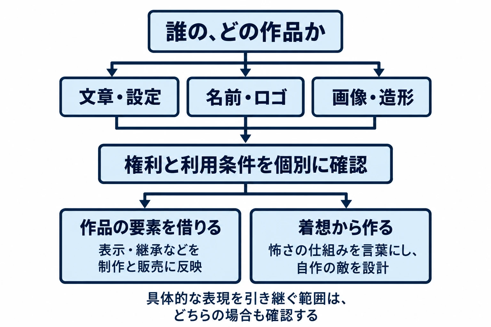

# その神話は、誰の作品か――人工神話の敵は、作者と利用条件から確かめる

> ⚠️ **ネタバレ注意** ⚠️
>
> 本稿は『ペルソナ2 罪』『ペルソナ2 罰』の物語上の敵に触れます。

[第1回](mythology-enemy-design-five-checks.md)では、SCPのライセンス案内を例に、「読める」「無料で使える」「条件なく使える」を分けた。今回は、その区別を敵の企画書に落とし込む。

クトゥルフ神話（Cthulhu Mythos）とSCP財団（SCP Foundation）は、多くの書き手が作品を加え、共通する存在や設定を育ててきた創作である。本稿では、このような近現代の創作を「人工神話」と呼ぶ。ここでは作者や作品をたどれることが、敵づくりの出発点になる。

判断軸は、 **「誰が書いた、どの作品の要素か」を分け、作品ごとの権利と利用条件を確かめてから、借りるのか、着想にとどめるのかを決める** ことである。[第8回](mythology-enemy-design-recorders-living-communities.md)までの「参照元の層」を、今回は「書き足した作者」の層として見る。

言葉も先に整理しておこう。 **著作権** は文章や絵などの創作的な表現を保護する権利、 **商標** は商品やサービスの出所を示す名前・ロゴなどを保護する仕組み、 **ライセンス** は権利者が利用を認める条件である。以下では、それぞれの資料が示す範囲で扱いを整理する。実際の発売に向けた判断は、使う素材と販売する国をそろえて、権利者や専門家に確認する必要がある。

***

## 1. クトゥルフ神話――作品ごとに状態を確かめる

### ラヴクラフトの作品と、後から加わった体系

H・P・ラヴクラフト（H. P. Lovecraft）の作品を核に、ほかの作家も名前や設定を共有し、独自の物語を加えてきた。作家・出版者のオーガスト・ダーレス（August Derleth）は、その体系化に関わった人物である。研究者のLaura Škrobánková氏は、ラヴクラフトらの緩やかな共有と、ダーレスが善悪の対立や四元素による分類を持ち込んだ整理とを区別している。後世の見取り図にも、書き手の解釈が入っているのだ。[[1](#ref-1)]

敵の企画でも、「クトゥルフ神話の設定」とひとまとめにせず、出典を作品単位に戻したい。ラヴクラフトの小説にある名前、後の作家が加えた能力、ゲーム独自の姿を分けると、何を残したいのかと、どの権利を確かめるのかが同時に見えてくる。

### 米国の原文と、日本語訳を分ける

**パブリックドメイン** とは、著作権による保護を受けない状態を指す。米国について、Creative Commonsは、1928年に『Weird Tales』へ掲載された「The Call of Cthulhu」を、2024年1月1日のパブリックドメイン・デーに紹介する作品の一つに挙げている。[[2](#ref-2)]

この日付は、「それまで必ず保護されていた」という意味には使えない。ペンシルベニア大学図書館でデジタル図書館を担当するジョン・マーク・オッカーブルーム（John Mark Ockerbloom）氏は、同作は更新登録がなく、すでに米国でパブリックドメインだったと説明している。企画上の要点は、 **米国のこの原文についての説明を、神話全体の利用許可へ広げない** ことだ。[[3](#ref-3)]

ラヴクラフト作品の権利をめぐっては、登録更新や権利移転の経緯が分かりにくいとする報道もあった。Techdirtの2011年の記事は、その混乱を扱っている。これは当時の事情を知る資料であり、現在の全作品の状態を一括して示す一覧ではない。[[4](#ref-4)]

国が変われば扱いも変わる。さらに、原文と、それを訳した日本語の文章、現代の挿絵は、確かめる対象がそれぞれ異なる。「小説の原文を使う」「新しい日本語訳を転載する」「ゲームで見た姿を描く」を別の項目として、企画書の出典欄に書いておくとよい。

### 神話の名前と、TRPGの商品を分ける

会話とルールで進めるテーブルトークRPG（TRPG）の『Call of Cthulhu』は、Chaosiumの商品である。同社は「Call of Cthulhu」を登録商標として掲げている。小説の題名と同じつづりでも、ゲーム商品の名前や表示としてどう使うかは別に確かめる必要がある。[[5](#ref-5)]

Chaosiumは、非営利のファン作品、商業利用、指定された仕組みを通じたコミュニティ作品の販売を分けて案内している。さらに、ファン素材向け方針では、アプリやダウンロードするソフトウェアを対象外としている。無料ゲームだからファン向け方針に収まる、とは判断できない。[[6](#ref-6)][[7](#ref-7)]

日本語版の『クトゥルフ神話TRPG』にも、KADOKAWAの個人向け二次創作ガイドラインがある。法人は問い合わせが必要とされている。敵の名前の出典を調べる作業と、TRPGのルール説明文・図版・商品名を利用する作業を分けることが、問い合わせ先を整理する助けになる。ガイドライン全般の読み方は[配信・二次創作ガイドラインの記事](game-streaming-fan-creation-guideline-design.md)も参照してほしい。[[8](#ref-8)]

### ゲームでは、敵にする方法も異なる

『コール・オブ・クトゥルフ』（Call of Cthulhu）は、Cyanide Studioが開発し、Focus Home Interactiveが2018年にPC・PlayStation 4・Xbox One向けに海外発売した作品である。発売元は、ChaosiumのTRPGを公式にゲーム化した作品と説明している。理解しがたい脅威に直面する探索者を描くために、既存のTRPGをライセンスしている例だ。[[9](#ref-9)]

アトラスの『ペルソナ2 罪』（1999年、PlayStation）と『ペルソナ2 罰』（2000年、PlayStation）では、ニャルラトホテプ（Nyarlathotep）が主人公たちに敵対する存在として物語に関わる。RPGFanのレビューは、『罪』で立ちはだかる大きな敵として同名を挙げ、『罰』についても前作から続く敵との因縁を説明している。[[10](#ref-10)][[11](#ref-11)][[12](#ref-12)]

『パズル＆ドラゴンズ』（GungHo Online Entertainment、2012年、iOS・Android）では、2017年4月に協力プレイの新ダンジョンへの登場が告知された。名前は「悪夢なるもの・クトゥルフ」「無貌なるもの・ニャルラトホテプ」「無形なるもの・アザトース」である。クトゥルフ（Cthulhu）やアザトース（Azathoth）を、異名と組み合わせてダンジョンの敵にしている。[[13](#ref-13)][[14](#ref-14)]

編者は、この二つを「物語を動かす敵にする」「一戦の相手として示す」という役割の違いとして見る。同じ神話の名前でも、プレイヤーが接する時間や、必要な説明の量は変わる。他作品での登場は、名前がどのように受け取られるかを考える材料になる。自作での利用条件は、改めて出典へ戻って確かめることになる。

別の入口が、『Bloodborne』（フロム・ソフトウェア、2015年、PlayStation 4）である。[[15](#ref-15)] Wccftechは、宮崎英高氏がGameSpot Brazilの取材で「The Call of Cthulhu」からの影響を語ったと伝えている。[[16](#ref-16)] この例から考えたいのは、神話の存在を名指しで登場させる方法に加え、理解を超えるものへの恐怖を、自作の敵や遭遇の仕方へ移す方法である。

***

## 2. SCP財団――利用条件を、自分の作品へ引き継ぐ

### 「表示」と「継承」を発売計画に入れる

SCP財団は、異常な存在や現象を扱う共同創作のウェブサイトである。そのライセンス案内は、作品群をクリエイティブ・コモンズの「表示—継承 3.0」（CC BY-SA 3.0）で利用できると説明している。元の作品を翻案して作る **派生作品** について、作品名・作者・元ページへのリンクを示し、同じライセンスの条件を引き継ぐよう求めている。[[17](#ref-17)]

クリエイティブ・コモンズは、著作物の利用条件を共通の形式で示す仕組みである。CC BY-SA 3.0では、商用での利用や改変も認められる。その際の中心となる条件が、出典やライセンスなどを示す「表示」と、改変して作ったものにも定められたライセンスを適用する「継承」だ。追加の制限を課して、受け取った人の利用を妨げることにも制約がある。[[18](#ref-18)]

企画上は、売れることと、独占できることを分けて考える必要がある。SCPの利用案内も、販売は可能である一方、条件に従う他者による複製や販売も認めることになると説明している。敵の造形だけを先に決めると、後から「自社だけが配信できる」という販売計画とぶつかりうる。[[17](#ref-17)]

### 『SCP: Secret Laboratory』が示す、作品と部品の区別

Northwood Studiosの『SCP: Secret Laboratory』（2017年、Windows、基本無料）は、施設内の異常な存在を、人間側にとっての脅威として扱うゲームである。Steamの商品ページは、SCP財団の内容を含み、『SCP – Containment Breach』に着想を得ていることと、CC BY-SA 3.0の適用を明記している。[[19](#ref-19)]

同作の利用規約は、多くの素材にCC BY-SA 3.0を適用する一方、プログラムや不正対策、一部の第三者素材などを区別している。したがって、ここから学べるのは「SCPのゲームなら、あらゆる部品が一律に同じ条件になる」という整理ではなく、 **SCPをもとにした表現と、別条件の部品を特定して表示する必要性** である。自作でどこまで継承が及ぶかは、作品の構成を示して確認したい。[[20](#ref-20)]

### SCP-173の文章と、広まった彫刻写真

素材を分ける必要性がよく表れたのが、SCP-173の画像である。かつて掲載されていたのは、彫刻家の加藤泉（Izumi Kato）氏による「Untitled 2004」の写真だった。SCPの利用案内は、この画像をCCライセンスの対象から区別し、商用利用できないと説明している。SCP-173の文章には、引き続きCC BY-SA 3.0が適用される。[[17](#ref-17)]

サイトの公式ニュースによれば、画像は2022年2月13日に取り外された。[[21](#ref-21)] 見慣れた姿があっても、文章と同じ条件で使えるとは限らない。敵の制作資料には、「設定の文章」「参考画像」「画像の撮影・制作元」を別々に記録しておきたい。

### 映画『V/H/S: SCP』で表面化した、独占と継承

映画『V/H/S: SCP』をめぐる動きも、この区別を考える材料になる。2026年7月6日のBloody Disgustingは、Spooky PicturesとImage Nation Studiosによる企画を報じた。9月11日のTheWrapは、A24が世界での権利を取得し、両社と共同製作すると伝えている。[[22](#ref-22)][[23](#ref-23)]

SCP Wikiの運営側は、当初相談を受けていなかったとしたうえで、SCPに関する独占的権利をA24が持つことはできず、派生作品にはライセンスの継承が必要だと声明で説明した。[[24](#ref-24)] A24側は、権利は『V/H/S』に関するもので、他者のSCP創作を妨げないと説明したと報じられている。[[25](#ref-25)]

**2026年10月8日の確認時点** で、運営側の声明には、Spooky Picturesから連絡があり、話し合いを予定しているという追記がある。最終更新日は10月5日である。声明は、SCPの派生作品としてライセンスに従うか、派生作品になる内容を含めないかという選択も示している。ここでは協議の結論や映画の最終的な扱いを先取りしない。[[24](#ref-24)]

ゲームの企画へ置き換えるなら、SCPを借りた敵を作る段階で、販売や再配布の条件も相談することになる。編者は、独占的な配信や利用許諾だけを収益の柱にする計画ほど、継承条件との相性を早く検討すべきだと考える。基本無料のゲームが存在することも、商業映画が検討されることも、ライセンスが商用利用を認めることと両立している。

名前やロゴについては、著作権の利用条件に加えて商標の確認も要る。SCPのロシア支部側は、SCPの名称の商標登録を使って他の販売者を制限する動きがあったとして、声明で抗議している。これは運営側の説明する紛争の事例であり、世界各国の商標の状態を一括して示すものではない。[[26](#ref-26)]

***

## 3. 借りるのか、着想にとどめるのか

### 開発者が語る「影響」と、敵として作り直す部分

Remedy Entertainmentの『Control』（2019年、海外初出はPC・PlayStation 4・Xbox One）は、超常の脅威に対抗するアクションゲームである。[[27](#ref-27)] ナラティブリード、つまり物語づくりを率いたアンナ・メギル（Anna Megill）氏は、SCPのサイトを着想源の一つに挙げている。IGNでの発言を紹介したTwinfiniteは、複数の小説と並んでSCPが挙げられ、異常な力を持つ物体を閉じ込める描写への影響が語られたと伝えている。[[28](#ref-28)]

Project Moonの『Lobotomy Corporation』（2018年、Windows）は、公式の商品説明でSCPや映画などからの着想を明記する。同作では、管理していた存在が脱走し、職員を脅かす。ここで敵として見るべきなのは、その管理が破れたときの危険である。[[29](#ref-29)]

これらと『Bloodborne』を並べると、元の存在をそのまま敵にする以外にも、未知への恐怖や、異常な存在を管理する緊張を、自作の敵へ移す入口が見える。影響を公言しているという事実から、個々の表現の法的な扱いまで決まるわけではない。以下は、その境界を検討しやすくするための企画上の提案である。

### 企画書に「引き継ぐ怖さ」と「自分で作る部分」を書く

編者は、敵の企画書で「参考：クトゥルフ」「SCP風」とだけ書く代わりに、次のように分ける方法を提案する。

| 着想の入口 | 引き継ぎたい怖さ | 自作で決める敵の要素 |
| --- | --- | --- |
| 理解を超える存在 | 調べるほど、人間の判断の限界が見える | 敵の由来、姿、知覚の仕方、遭遇で失うもの |
| 収容された異常な存在 | 守っていた手順が破れた瞬間に、危険が広がる | 管理する理由、破綻の条件、逃げ方、対処の代償 |
| 特定作品の存在そのもの | その名前や設定を知る人の期待に応える | 出典と借りる箇所を特定し、条件の範囲内で加える行動や演出 |

たとえば、「人間には全体像を理解できない敵」という着想を、倒すたびに周囲の地形の意味が変わる自作の存在へ展開することは、企画の発想として考えられる。その際は、外見だけでなく、何をすると現れ、どの情報が役に立ち、プレイヤーがどう対処するかまで自分たちで設計する。

特定の作品の文章・画像・固有名を使う場合には、それぞれに対応する権利や利用条件の確認が加わる。名前を変更した場合も、特徴的な設定や描写をどこまで引き継いでいるかが検討の対象になる。SCP運営側も、映画への声明で、新しい異常存在だけを出せば必ず派生作品から外れる、という考え方を採っていない。[[24](#ref-24)]

つまり、この表は利用条件を避けるための手順ではなく、 **何を借りた作品として作るのかを、制作側が説明できるようにするための表** である。

***

## 4. 敵の企画を固める前に、何を問うか

確認の問いは、次のように並べられる。

1. **誰の、どの作品か**：敵の名前・能力・姿は、それぞれどの作品に由来するか。
2. **どの国で使うか**：その作品の権利の状態を、発売先の国ごとに調べたか。原文と翻訳を分けたか。
3. **商品として何を借りるか**：名前・ロゴの商標、TRPGの文章や図版、ゲーム向けの利用許諾を分けたか。
4. **条件を守って売れるか**：作者や出典の表示、継承、他者による再配布を、販売契約や配信方法と両立できるか。
5. **別の素材が混ざっていないか**：画像、音楽、プログラムなどの条件を、それぞれ記録したか。
6. **借りる理由を説明できるか**：特定の存在を出したいのか、その怖さを自作の敵で表したいのか。

シリーズ共通の5観点でまとめると、人工神話は次のように整理できる。

| 観点 | 人工神話で見ること | 敵の企画への落とし込み |
| --- | --- | --- |
| 現役信仰度 → 作者・共同体・ファンの存在 | 書き手や運営共同体が、作品と利用条件を支えている | 作者をたどり、共同体が明示する条件を読む |
| 権利 | 作品・国・素材ごとに状態が異なる。商標とライセンスも関わる | 借りるものの一覧と、販売方法を一緒に確認する |
| 知名度と期待値 | 小説、TRPG、ゲームなど、名前を知った入口が人によって違う | どのイメージを残し、何を新しく見せるか決める |
| 改変の許容度 | 条件として認められる改変と、読者が納得する改変を分ける | 許可の範囲に加え、敵に残す特徴と対象年齢・地域への見せ方を考える |
| 参照元の層 | 原作者、後続の作家、翻訳、ゲーム独自の表現が重なる | 名前・能力・姿の出典を別々に書く |

人工神話を敵にするときは、作者が積み重ねた具体的な表現と、自分たちが作りたい体験とを結び直すことになる。出典と条件が明確になれば、既存の存在を迎える設計も、自作の存在へ発展させる設計も、理由を持って選べる。

次回は番外編として、神話の地域を横断し、巨人・竜・死者などの類型から敵のモチーフを見る。あわせて、同じ存在が敵にも味方にもなるとき、その境界を何が決めるのかを考える。

## References

1. [Laura Škrobánková「Crossing Genres, Crossing Media: The Cthulhu Mythos Through the Ages」][1] — Verbum、2025年。研究論集『Crossing borders between countries, scholars and genres: Commemorating the late Kathleen E. Dubs』所収、pp. 65–86。特に第3節「The Derleth Mythos」。

[1]: https://www.ku.sk/fhv/fhvPublicationAttachment.php?ID=23092

2. [Creative Commons「Celebrate Public Domain Day 2024 with us: Weird Tales from the Public Domain」][2] — Creative Commons、2023年12月20日。米国での扱い。

[2]: https://creativecommons.org/2023/12/20/celebrate-public-domain-day-2024-with-us-weird-tales-from-the-public-domain/

3. [John Mark Ockerbloom「The public domain welcomes the weird (and mourns the missing)」][3] — Everybody’s Libraries、2023年12月6日。ペンシルベニア大学図書館のデジタル図書館担当者による解説。米国での更新登録について。

[3]: https://everybodyslibraries.com/2023/12/06/the-public-domain-welcomes-the-weird-and-mourns-the-missing/

4. [Leigh Beadon「The Confusing Case Of Lovecraft’s Copyrights」][4] — Techdirt、2011年7月14日。当時報じられた権利関係の不明確さについて参照。

[4]: https://www.techdirt.com/2011/07/14/confusing-case-lovecrafts-copyrights/

5. [Chaosium「Trademarks and Copyrights」][5] — Chaosium、日付記載なし。

[5]: https://www.chaosium.com/trademarks-and-copyrights/

6. [Chaosium「Fan Use and Licensing」][6] — Chaosium、日付記載なし。ファン作品・商業利用・コミュニティ向け販売制度の区分。

[6]: https://www.chaosium.com/fan-use-and-licensing/

7. [Chaosium「Fan Material Policy」][7] — Chaosium、2023年10月13日改定。アプリ・ダウンロードするソフトウェアなどの対象外規定。

[7]: https://www.chaosium.com/fan-material-policy/

8. [KADOKAWA「クトゥルフ神話TRPG二次創作ガイドライン（個人向け）」][8] — KADOKAWA、日付記載なし。個人向けの範囲と法人への案内。

[8]: https://product.kadokawa.co.jp/cthulhu/guideline.html

9. [Focus Home Interactive「Call of Cthulhu celebrates its launch with maddening accolade trailer」][9] — Focus、2018年11月9日。開発元、海外発売時の機種、ChaosiumのTRPGの公式ゲーム化について。

[9]: https://www.focus-entmt.com/en/news/call-of-cthulhu-celebrates-its-launch-with-maddening-accolade-trailer

10. [ギャルソン屋城「『ペルソナ2 罰』が発売された日。夢や理想への“諦め”を覚えてしまった歯がゆさ。シリーズ無二の“大人のジュブナイル”【今日は何の日？】」][10] — ファミ通.com、2026年6月29日。『罪』『罰』の初出年・機種。

[10]: https://www.famitsu.com/article/202606/79401

11. [Neal Chandran「Shin Megami Tensei: Persona 2: Innocent Sin」][11] — RPGFan、2004年12月9日。日本語PlayStation版のレビュー。

[11]: https://www.rpgfan.com/review/shin-megami-tensei-persona-2-innocent-sin/

12. [Neal Chandran「Shin Megami Tensei: Persona 2: Eternal Punishment」][12] — RPGFan、2004年11月21日。前作の敵と続編とのつながりについて。

[12]: https://www.rpgfan.com/review/shin-megami-tensei-persona-2-eternal-punishment-4/

13. [ガンホー・オンライン・エンターテイメント「ゲーム」][13] — ガンホー・オンライン・エンターテイメント、日付記載なし。『パズル＆ドラゴンズ』のサービス開始年・対応機種。

[13]: https://www.gungho.co.jp/jp/game/?anc_id=anc_newGame14

14. [イズミン「『パズドラ』クトゥルフ、ニャルラトホテプなどが新ダンジョンに登場」][14] — 電撃オンライン、2017年4月4日。新ダンジョンへの登場告知と各モンスター名。

[14]: https://dengekionline.com/elem/000/001/497/1497761/

15. [フロム・ソフトウェア「Bloodborne」][15] — フロム・ソフトウェア、日付記載なし。2015年発売、PlayStation 4対応。

[15]: https://www.fromsoftware.jp/ww/detail.html?csm=094

16. [Alessio Palumbo「Hidetaka Miyazaki Says Bloodborne Is Still His Favorite Game, Explains Its Influences」][16] — Wccftech、2019年10月11日。GameSpot Brazilの取材での宮崎英高氏の発言を紹介した記事を参照。

[16]: https://wccftech.com/hidetaka-miyazaki-says-bloodborne-is-still-his-favorite-game-explains-its-influences/

17. [SCP Wiki「Licensing Guide」][17] — SCP Wiki、日付記載なし。CC BY-SA 3.0、表示・継承、商用利用、SCP-173の画像の例外。

[17]: https://scp-wiki.wikidot.com/licensing-guide

18. [Creative Commons「表示—継承 3.0 非移植（CC BY-SA 3.0）」][18] — Creative Commons、日付記載なし。日本語のライセンス概要。法的な条件はリンク先のリーガルコードを参照。

[18]: https://creativecommons.org/licenses/by-sa/3.0/deed.ja

19. [Northwood Studios「SCP: Secret Laboratory」][19] — Steam、日付記載なし。発売日・Windows対応・基本無料・ライセンス表示・着想元。

[19]: https://store.steampowered.com/app/700330/SCP_Secret_Laboratory/

20. [Northwood Studios「SCP: Secret Laboratory End User License Agreement」][20] — Steam、日付記載なし。第2節の素材とソフトウェアの区分。

[20]: https://store.steampowered.com/eula/700330_eula_0

21. [SCP Wiki「Archived News」][21] — SCP Wiki、2022年2月13日の項目。SCP-173の画像の取り外し。

[21]: https://scp-wiki.wikidot.com/archived:archived-news

22. [Meagan Navarro「‘V/H/S: SCP’ – Next ‘V/H/S’ Installment Takes on the SCP Foundation」][22] — Bloody Disgusting、2026年7月6日。企画発表を報道。

[22]: https://bloody-disgusting.com/movie/3958435/v-h-s-scp-next-v-h-s-installment-takes-on-the-scp-foundation/

23. [Benjamin Lindsay「A24 Developing SCP Foundation Film, Adapting Hit Internet Property for ‘V/H/S’ Franchise Expansion」][23] — TheWrap、2026年9月11日。権利取得と共同製作を報道。

[23]: https://www.thewrap.com/creative-content/movies/scp-foundation-movie-a24/

24. [SCP Wiki「Statement On V/H/S SCP Foundation Film」][24] — SCP Wiki、2026年10月5日最終更新、2026年10月8日確認。運営側の見解、Spooky Picturesからの連絡の追記、FAQ。

[24]: https://scp-wiki.wikidot.com/statement-on-vhs-film

25. [Lewis Parker「SCP Foundation Pushes Back Against A24’s V/H/S: SCP Movie」][25] — Kotaku、2026年9月12日。A24側の説明を伝える追記。

[25]: https://kotaku.com/scp-foundation-pushes-back-on-backrooms-studios-new-v-h-s-scp-movie-a24-does-not-and-cannot-have-any-exclusive-rights-2000733756

26. [SCPロシア支部「Russia Licensing Statement」][26] — SCP Wiki運営用サイト05command、2020年9月7日最終編集。ロシアでの名称の商標をめぐる運営側の声明。

[26]: https://05command.wikidot.com/russia-licensing-statement

27. [Remedy Entertainment「505 Games, Remedy Entertainment’s critically acclaimed “Control” launches today on PC, PS4, Xbox One」][27] — GlobeNewswire、2019年8月27日。Remedy Entertainmentのプレスリリース。海外発売時の機種。

[27]: https://www.globenewswire.com/news-archive/1906827/11102/en/505-Games-Remedy-Entertainment-s-critically-acclaimed-Control-launches-today-on-PC-PS4-Xbox-One.html

28. [Chris Jecks「Remedy’s Control Shares Eerie Similarities with the SCP CreepyPasta Site」][28] — Twinfinite、2018年。元記事はJose Aranda氏の執筆との注記あり。IGNでのアンナ・メギル氏の発言を紹介した記事を参照。

[28]: https://twinfinite.net/features/remedy-control-scp-foundation/

29. [Project Moon「Lobotomy Corporation｜Monster Management Simulation」][29] — Steam、日付記載なし。発売日・Windows対応・着想元・脱走時の脅威に関する商品説明。

[29]: https://store.steampowered.com/app/568220/Lobotomy_Corporation__Monster_Management_Simulation/

----

この文書は、Perplexity、Claude、OpenAI Codex の3つのAIの支援を受けて著述されたものです。引用画像を除き、MIT License にて提供されています。
