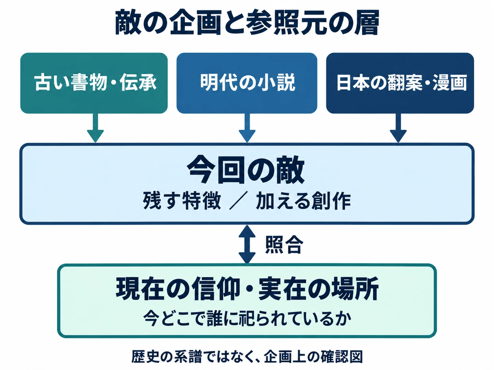
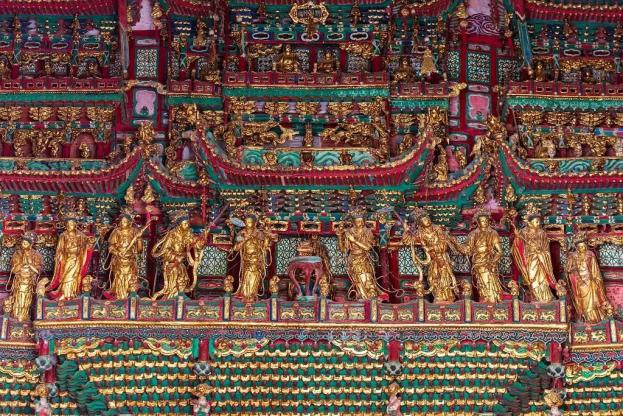

# その妖怪は、どの本から来たか――中国の神話・伝承の敵は、小説と翻案の層を分ける

> ⚠️ **ネタバレ注意** ⚠️
>
> 本稿は『黒神話：悟空』序盤のボスと攻略に関わる要素、および小説『西遊記』『封神演義』とその翻案の設定に触れます。

***

## はじめに――「中国の神話」の手前にある本

Game Scienceの『黒神話：悟空』（2024年、PlayStation 5・Windows PC）では、『西遊記』に由来する妖怪たちが、手強い敵として立ちはだかる。公式の商品説明も、それぞれに異なる取り柄を持つ妖怪と、その生い立ちや動機を作品の魅力に挙げている。[[1](#ref-1)][[2](#ref-2)]

こうした敵を見て「中国の神話を使いたい」と思ったら、次に開く本を考えたい。頭に浮かんだ姿は、古い神話の書物に描かれたものか。『西遊記』や『封神演義』という小説の姿か。日本語で読んだ翻案や漫画を通じて覚えたものか。

シリーズ「神話から敵をつくる」第5回は、中国の題材を扱う。[第2回の「重なった像」](mythology-enemy-design-greek-roman-layers.md)、[第3回の「後世が補った部分」](mythology-enemy-design-norse-gaps-symbols.md)を引き継ぎ、今回は小説と日本の翻案の間を、もう一段細かく見る。

判断軸は、 **神話・小説・日本の翻案のどの層から借りたかを分け、今も祀られている存在かを確かめる** ことである。参照する本と、現在の人々との関係が分かれば、敵に残したい特徴も、自分の作品で加える部分も選びやすくなる。

***

## 1. 神話の書物と、神々が登場する小説

中国の不思議な生き物や神々を調べる入口には、性格の違う本が並んでいる。

『<ruby>山海経<rp>（</rp><rt>せんがいきょう</rt><rp>）</rp></ruby>』は、山川、動植物、異形の存在などを記す古い書物である。松浦史子氏の研究要旨は、その成立を戦国から前漢にかけての複数の人々による編纂と捉え、神話的な内容を多く含む地理書として説明している。物語の主人公が順番に敵を倒していく長編小説とは、資料の読み方が異なる。[[3](#ref-3)]

『西遊記』は、取経の旅をめぐる語り物や芝居が積み重なり、明代の16世紀に現在よく知られる長編小説の形になった。中国文学者の加藤徹氏は、この成立を、世代をまたいで創作が積み重なる過程として説明する。[[4](#ref-4)] 『<ruby>封神演義<rp>（</rp><rt>ほうしんえんぎ</rt><rp>）</rp></ruby>』も明代に成立した小説であり、周王朝の建国をめぐる争いに、仙人、神、人間が入り交じって戦う。[[5](#ref-5)][[6](#ref-6)]

後で<ruby>関羽<rp>（</rp><rt>かんう</rt><rp>）</rp></ruby>（關羽、Guān Yǔ）を考える際に関わる『<ruby>三国志演義<rp>（</rp><rt>さんごくしえんぎ</rt><rp>）</rp></ruby>』も、明代ごろに成立した長編小説の層に位置付けられる。国立公文書館は、語り芸から発展した作品として紹介し、歴史上の人物の活躍に多くの創作が加わっていることを説明している。歴史書『三国志』を読む作業と、小説の人物像を読む作業を分ける必要がある。[[7](#ref-7)][[8](#ref-8)]

敵の企画では、この違いが作業の違いになる。『山海経』にある姿や性質から発想するなら、戦う理由や行動の多くを新たに考えることになる。小説の敵を採るなら、すでに相手の欲望、持ち物、対立相手、敗れ方まで描かれている場合がある。何を残せば、その存在を借りる意味が伝わるかを選べるのである。

また、古い物語と現在の信仰の重なりにも目を向けたい。 **小説の登場人物と、現在祀られる神という立場が重なる** 場合は、その両方を調べる必要がある。第4章では具体的な廟から、この関係を見ていく。

***

## 2. 日本で覚えた姿には、翻案の層がある

### 沙悟浄の河童姿を、資料の経路から見る

<ruby>沙悟浄<rp>（</rp><rt>さごじょう</rt><rp>）</rp></ruby>（沙悟淨、Shā Wùjìng）は、日本では河童の姿で親しまれている。小説『西遊記』では、<ruby>流沙河<rp>（</rp><rt>りゅうさが</rt><rp>）</rp></ruby>（Liúshā Hé）に棲む恐ろしい姿の存在として描かれ、日本の河童に特徴的な頭の皿は原作の設定ではない。中国文学者の堀誠氏は、原作の描写と日本の河童像を分け、児童書や漫画の表現を調べている。[[9](#ref-9)]

日本の翻案には、その姿を身近な妖怪へ置き換える経路があった。加藤氏の解説によれば、滝沢馬琴は『西遊記』の舞台を日本へ移した翻案で、沙悟浄に相当する人物を河童に置き換えている。[[4](#ref-4)] 堀氏は、1932年刊の児童書『孫悟空』に頭に皿を載せた姿と河童という呼称があり、1953年刊の漫画『新そんごくう』にも皿のある河童頭が描かれていることを示した。翻案、児童書、漫画という複数の媒体に、河童の姿を見いだせる。[[9](#ref-9)]

さらに古い物語へ目を向けると、別の経路が見える。仏教学者の吉村誠氏は、沙悟浄の起源を、砂漠で苦しむ<ruby>玄奘<rp>（</rp><rt>げんじょう</rt><rp>）</rp></ruby>（Xuánzàng）の夢に現れる神と、宋代の『大唐三蔵取経詩話』に登場する<ruby>深沙神<rp>（</rp><rt>じんじゃしん</rt><rp>）</rp></ruby>（Shēnshā Shén）へ結び付けて論じている。これは人物像の形成を説明する研究上の説であり、日本の河童化とは分けて読める。[[10](#ref-10)]

この例を敵の企画に引き寄せると、「水辺に出る中国の妖怪だから河童型にする」という連想の途中に、自分が読んだ日本の作品が入り込んでいる可能性がある。編者は、最初に思い浮かんだ姿と、調べた本に書かれた姿を並べる方法が役立つと考える。河童型を選ぶ場合も、日本の翻案を受けた選択として記録できる。

### 安能務版『封神演義』は、対立の意味も組み替える

<ruby>安能務<rp>（</rp><rt>あのう・つとむ</rt><rp>）</rp></ruby>の『封神演義』（講談社文庫、1988〜1989年）は、中塚亮氏の研究で「編訳」として扱われている。編訳とは、ここでは訳す過程で素材を編集し、独自の解釈や創作も組み込んだものを指す。同論文は、藤崎竜氏の漫画『封神演義』が安能版を参照したことも整理している。[[5](#ref-5)]

敵の設計に関わる違いとして、<ruby>申公豹<rp>（</rp><rt>しんこうひょう</rt><rp>）</rp></ruby>（Shēn Gōngbào）がある。中塚氏によれば、原作では封神の任務を妨害し、仙人や妖怪を敵として送り込む人物だが、安能版では封神をめぐる不当な仕打ちに抵抗する側として、その動機が組み替えられている。対立相手の正しさにも疑問を投げかける存在になるのである。[[5](#ref-5)]

この差は、顔や衣装の変更よりも深い。「敵がなぜ主人公を妨害するか」という企画の中心に、日本語の翻案の解釈が入っている。安能版を読んで敵の動機を考えたなら、参照元を単に「中国古典『封神演義』」と書くより、「安能務の編訳における申公豹像」と記すほうが、採った意味を共有しやすい。

安能版には、他の古典や芸能、台湾の言い回しを取り込んだ部分もあると中塚氏は指摘する。翻案の差分をすべて一人の作者の思い付きと見なすことも、資料の経路を短くしてしまう。必要な特徴について、どの本が何を加えたかをたどりたい。[[5](#ref-5)]

### 知っている姿と、利用する表現を分ける

日本のプレイヤーが何を思い浮かべるかも、企画段階で確かめる対象である。[第4回の石燕と水木しげる](mythology-enemy-design-japan-living-traditions.md)と同じく、名前を知ることと、同じ絵を知ることには距離がある。対象読者に名前だけを見せ、姿や能力を説明してもらえば、どの翻案の印象が強いかを探れる。

権利の確認も、この層ごとに行う。保護期間が満了した古い小説と、現代の翻訳文、漫画の造形、ゲームの具体的な表現は別々に考える。文化庁は、翻訳や翻案で新しい創作性を加えた部分が、原作品とは別の著作物として保護されると説明している。[[11](#ref-11)]

実務では、元の小説にある名前・特徴と、現代作品に固有のせりふ・衣装・演出を、資料欄から分けておく。利用条件や許諾が必要な範囲を相談するときも、どの表現を使いたいかが具体的になる。

***

## 3. 小説の敵を、現実の場所につなぐ

### 『黒神話：悟空』が受け取ったもの

『黒神話：悟空』のPS5版は2024年8月20日に発売された。Windows PCでも展開されている。[[1](#ref-1)][[2](#ref-2)]

Game Scienceの共同創業者でCEOの馮驥（冯骥／Féng Jì、Feng Ji）氏は、2021年9月のUnreal Engineのインタビューで、『西遊記』を500年以上の歴史と豊かな物語・登場人物を持つ中国の神話として語った。また、『山海経』『封神演義』などの文学からも影響を受けたと述べている。ここでの「神話」は、開発者が創作の源を広く語る言葉として読める。企画資料では、そこから具体的にどの本の何を採ったかまで進めたい。[[12](#ref-12)]

2024年7月のファミ通の取材では、開発チームはボスごとに攻撃や動きを変え、相手に合わせて立ち回りを変える戦闘を目指したと説明している。神や妖怪には性格も与えたという。小説から敵を受け取る作業は、名前と見た目の採用から、 **どんな性格の相手と、どんな判断を繰り返して戦うか** へ続いている。[[13](#ref-13)]

### 黒熊の妖怪なら、章と特徴まで書き出す

具体例として、ゲーム序盤のボスである<ruby>黒熊怪<rp>（</rp><rt>こくゆうかい</rt><rp>）</rp></ruby>（Hēixióng Guài）を見よう。2025年のXbox Series X｜S版発売時に公開されたXbox Wireの公式記事は、黒熊怪との戦いに、燃焼への対策となる法具「<ruby>辟火罩<rp>（</rp><rt>へきかしょう</rt><rp>）</rp></ruby>」（Bìhuǒzhào）が役立つと紹介している。[[14](#ref-14)] この仕組みは、敵への対策を周囲の探索に結び付けたものと捉えられる。

参照元へ戻ると、『西遊記』第17回には、<ruby>黒風山<rp>（</rp><rt>こくふうざん</rt><rp>）</rp></ruby>（Hēifēng Shān）に棲み、盗んだ袈裟を披露する宴を開こうとする熊の妖怪が登場する。袈裟は僧侶が身に着ける衣である。この妖怪は黒い槍を手に戦い、風に変じて逃れる場面もある。[[15](#ref-15)]

小説の「大切な衣を欲しがる」「武器を使う」「変化して逃れる」といった特徴と、ゲームで有効になる燃焼対策とは、異なる欄に書ける。こうして分けると、原作の特徴をどこに残し、戦闘の仕組みをどこで組み立てるかが見える。ゲームの攻撃や攻略法のすべてを、小説に元からあった能力として逆輸入することも避けられる。

たとえば編者が別のゲーム向けに企画するなら、次のように記録する。これは『黒神話：悟空』の開発資料の再現ではなく、小説を読んだ後に使う企画メモの例である。

| 記録すること | 黒風山の熊の妖怪を採る場合の例 |
|---|---|
| 参照する本と箇所 | 『西遊記』第17回。読んだ版本・訳本も併記する |
| 小説から残す特徴 | 袈裟への執着、槍、風への変化 |
| 今回の敵に足すもの | 奪った品を守るために攻撃の位置が変わる行動など |
| 戦闘で伝えること | 品を見せびらかす性格と、取り返されることへの警戒 |
| 舞台の参照 | 架空の山寺にするか、実在の建物を参照するかを別途決める |

小説の特徴は、選んで採ればよい。今回は「所有物への執着」を核にする、と決めれば、それを示す登場場面、戦闘中の行動、敗れた後の反応を一貫させられる。原作に詳しい人には由来が伝わり、知らない人にも敵の性格が伝わる形を目指せる。

### 建物の参照先には、今も人がいる

同じファミ通の取材で、開発チームは、実在の寺、仏像、森、岩などをスキャンして、建物や風景を制作したと説明している。小説から妖怪を借りる経路に、現実の建築や造形を借りる経路が重なる。[[13](#ref-13)]

発売直後の2024年8月23日、TechNodeは、同作で参照された古建築の所在地36か所のうち27か所が<ruby>山西省<rp>（</rp><rt>さんせいしょう</rt><rp>）</rp></ruby>（Shānxī）にあると報じた。<ruby>小西天<rp>（</rp><rt>しょうせいてん</rt><rp>）</rp></ruby>（Xiǎoxītiān）の職員の説明として、発売日の8月20日の入場券販売数が前年同日比で300％増えたとも伝えている。ここでの数字は、同施設の単日の販売数である。[[16](#ref-16)] 山西網警を出典とする同月25日の公的機関の発信も、少なくとも36か所の古建築、うち山西省27か所という規模を紹介し、小西天などを挙げている。[[17](#ref-17)]

この出来事は、ゲームで目にした場所を現実にも訪ねる、という関係が生まれうることを示す。敵と戦った舞台の細部が、建築や仏像への関心の入口になる。一方、単日の入場券増加から長期的な経済効果までを測ることはできず、来訪が増えることと、個々の宗教表現への賛同も別の事柄である。

企画上の提案としては、敵の資料と舞台の資料を並べ、建物のどこを借りるかまで書きたい。屋根の形だけか、仏像の配置までか、実名も使うか。実在の場所を強く想起させるなら、保存・管理を担う人、参拝する人、訪問者を案内する人との関係も、相談の対象になる。

たとえば、現実の仏像を忠実に置いた部屋で妖怪と戦わせる場合、画面では仏像と敵が一緒に見える。妖怪がその場所を占拠したのか、その場所の守り手なのかは、敵の配置やせりふで伝える必要がある。戦闘のために柱を破壊させるなら、建物への印象も変わる。 **何を倒す場面として見えるか** を、敵単体の設定画だけでなく、舞台を含む画面で点検することが大切だ。

[第4回で紹介した熊野神社と東方Projectの協力](mythology-enemy-design-japan-living-traditions.md)と同様、場所について確かめる作業は、現地の人々と関係をつくる入口にもなる。中国の題材でも、小説の一場面と、今ある寺院の意味をそれぞれ尋ねることが、舞台の理解を厚くする。

出典：山西網警「[跟着悟空游山西 网络安全要牢记](https://wxb.xzdw.gov.cn/wlaq/aqdt/202408/t20240825_501224.html)」（中共西蔵自治区委員会網絡安全和信息化委員会弁公室掲載、2024年8月25日）より引用。

実在の小西天の内部写真。柱や梁の間を埋める仏像と楼閣状の造形が、建物と一体の空間をつくっている。舞台として参照するときは、個々の像に加え、この配置をどこまで採るかも判断の対象になる。

***

## 4. 小説の外では、今も祀られている

### 関羽は、歴史上の人物・小説の人物・神という面を持つ

関羽は、三国時代の物語で知られる実在の武将であり、<ruby>関聖帝君<rp>（</rp><rt>かんせいていくん</rt><rp>）</rp></ruby>（Guānshèng Dìjūn）、略して関帝として祀られる存在でもある。横浜市観光情報は、横浜関帝廟が1862年に関羽の木像を祀る祠から始まったと伝え、商売繁盛を願う信仰を紹介している。[[18](#ref-18)]

中国では、山西省<ruby>運城市<rp>（</rp><rt>うんじょうし</rt><rp>）</rp></ruby>（Yùnchéng）の関公信俗が、国の無形文化遺産の代表性項目に登録されている。公的な紹介は、関帝廟の祭祀や廟会、つまり祭礼と人々の集まりが受け継がれていることを説明する。[[19](#ref-19)] 台湾の内政部による<ruby>新竹関帝廟<rp>（</rp><rt>しんちくかんていびょう</rt><rp>）</rp></ruby>（Xīnzhú Guāndìmiào）の案内も、関聖帝君の聖誕などに行われる祭典と供物を紹介している。[[20](#ref-20)]

敵として採る際は、歴史上の武将として対立するのか、『三国志演義』の人物像を採るのか、関帝として祀られる面まで描くのかを決めたい。[第4回の平将門・菅原道真](mythology-enemy-design-japan-living-traditions.md)と同じく、祀られた実在の人物には、複数の面が重なっている。

たとえば軍勢同士の戦いで敵将として登場させる企画と、実在の関帝廟を再現して、その祭神と戦わせる企画では、プレイヤーに伝わる対象が変わる。武将としての強さを採るだけのつもりでも、廟の実名や祭祀の道具を加えれば、現在の信仰とのつながりも画面に入る。その組合せまで含めて、何を描くかを決める必要がある。

### 哪吒にも、現在の廟と祭礼がある

<ruby>哪吒<rp>（</rp><rt>なた</rt><rp>）</rp></ruby>（Nézhā。日本の一部作品ではナタク）は、『封神演義』などの登場人物であり、台湾では<ruby>中壇元帥<rp>（</rp><rt>ちゅうだんげんすい</rt><rp>）</rp></ruby>（Zhōngtán Yuánshuài）、三太子とも呼ばれ、祀られている。台南市の「宮廟博物館」は、<ruby>新営太子宮<rp>（</rp><rt>しんえいたいしきゅう</rt><rp>）</rp></ruby>（Xīnyíng Tàizǐgōng）について、哪吒の神像の持ち物と、聖誕を祝う参拝の様子を紹介している。[[21](#ref-21)]

足元の風火輪など、小説や映像で覚えやすい特徴が、廟の神像にも現れる。敵に採用する前に、小説のどの描写を使うかとともに、現地でその姿がどう呼ばれ、何を願う対象になっているかを見ておきたい。

編者は、「小説に登場する」という整理に、「今のどの場所と結び付いているか」という欄を加えるのがよいと考える。層を分ける作業は、重なりを見つけるためにも使える。現地の廟や信仰を一つの見解で代表させず、今回の表現に関わる場所と人から確かめるのである。

***

## 5. 敵の企画に持ち帰る問い

企画書に「中国神話より」と書いたら、その下を次の問いで具体化したい。

- **参照元はどこか**：古い神話の書物、明代の小説、日本の翻案のどれか。複数なら、特徴ごとに分けられるか。
- **どの箇所を採るか**：小説の何回に登場する、どの姿・行動・動機か。読んだ版本や訳者も残しているか。
- **何を期待されるか**：想定する日本のプレイヤーは、どの作品からその姿を覚えているか。企画側の思い込みと分けて確かめたか。
- **何を残し、何を足すか**：元の性格や持ち物が戦い方に表れるか。自作した能力を原作の設定として説明していないか。
- **今も祀られているか**：どの地域・廟で、どんな名で呼ばれるか。実在の人物なら、武将・小説の人物・神のどの面を採るか。
- **舞台はどこにつながるか**：実在の宗教建築や仏像を使うか。敵と背景を一緒に見たとき、何を倒したと伝わるか。

[第1回の5つの観点](mythology-enemy-design-five-checks.md)に沿うと、今回の確認は次のようにまとめられる。

| 観点 | 中国の題材で確認すること |
|---|---|
| 現役信仰度 | 関羽や哪吒のように、小説の登場人物と現在の祭神が重なる。廟・地域・祭礼を具体的に調べる |
| 権利 | 古い小説と、現代の翻訳文・漫画・ゲームの表現を分ける。画像などを使う場合は利用条件も確認する |
| 知名度と期待値 | 日本で覚えた姿が翻案由来の可能性を考え、対象読者が何を知っているか確かめる |
| 改変の許容度 | 人物の立場、信仰、舞台、販売地域に応じて検討する。中国で販売する場合の独自の審査・表現基準は、[各国の審査機関のレギュレーション](game-global-rating-regulations.md)を参照する |
| 参照元の層 | 古い書物・明代小説・日本の翻案を、特徴ごとに記録する。小説は回数と版本、翻案は作者まで残す |

「どの本から来たか」が分かると、敵の姿だけでなく、欲しがるものや戦う理由を選べる。「今どこで祀られているか」まで分かると、舞台と決着が持つ意味も考えられる。中国の題材では、この二つの調査を並べて進めたい。

次回はインド・アブラハム系の題材へ進む。現在の信仰との関係をさらに中心に置き、敵として登場させる際に、どの立場と表現を選ぶかを考える。

## References

1. [Game Science／ソニー・インタラクティブエンタテインメント「黒神話：悟空」][1] — PlayStation、日本向け商品情報、公開日記載なし。PS5版発売日と作品概要。2026年10月6日確認。

[1]: https://www.playstation.com/ja-jp/games/black-myth-wukong/

2. [Game Science「黒神話：悟空」][2] — Steam、公開日記載なし。Windows対応と公式の作品説明を参照。取得したページの発売日表示は2024年8月19日。2026年10月6日確認。

[2]: https://store.steampowered.com/app/2358720/Black_Myth_Wukong/?l=japanese

3. [松浦史子「六朝文学に於ける『山海経』の受容について―郭璞と江淹の場合」][3] — 東京大学大学院人文社会系研究科、2009年度博士論文の研究要旨。成立年代・書物の性格を参照。

[3]: https://www.l.u-tokyo.ac.jp/postgraduate/database/2009/685.html

4. [加藤徹「いじくられる三蔵法師」][4] — 日本中国語検定協会『中国語の環』128号、2025年1月、p.18。『西遊記』の形成と馬琴の翻案について。

[4]: https://www.chuken.gr.jp/study/wa/wa_128.pdf

5. [中塚亮「台湾人作家としての安能務と，その編訳『封神演義』の特徴について」][5] — 『金城学院大学論集 人文科学編』19巻1号、2022年9月30日、pp.183–194。本文を参照。安能版と漫画の関係はpp.183–184、参照素材と申公豹の改変はpp.188–194。

[5]: https://kinjo.repo.nii.ac.jp/record/1349/files/11_Ryo%20NAKATSUKA.pdf

6. [国立公文書館「05. 封神演義」][6] — デジタル展示「ようこそ 歴史資料の宝庫へ」、公開日記載なし。刊行時代と内容紹介。

[6]: https://www.archives.go.jp/exhibition/digital/rekishihouko/h26contents/26_1050.html

7. [国立公文書館「『正史』と『四大奇書』」][7] — デジタル展示「歴史と物語」、公開日記載なし。明代の長編小説と語り芸の関係。

[7]: https://www.archives.go.jp/exhibition/digital/rekishitomonogatari/contents/category11.html

8. [国立公文書館「53. 新刊校正古本大字音釈 三国志通俗演義」][8] — デジタル展示「歴史と物語」、公開日記載なし。歴史上の人物と小説の創作の区別。

[8]: https://www.archives.go.jp/exhibition/digital/rekishitomonogatari/contents/53.html

9. [堀誠「本の周辺6 河童の沙悟浄」][9] — 『ふみくら：早稲田大学図書館報』15号、1988年11月5日、pp.10–12。PDFには続く別記事も収録。原作の姿、1932年の児童書と1953年の漫画の調査を参照し、初出の断定には用いていない。

[9]: https://waseda.repo.nii.ac.jp/record/66040/files/Fumikura_15_8.pdf

10. [吉村誠「玄奘三蔵と『西遊記』――孫悟空・猪八戒・沙悟浄のルーツをめぐって――」][10] — 『印度學佛教學研究』69巻2号、2021年3月25日、pp.686–692。J-STAGE掲載の著者抄録に示された沙悟浄の起源説を参照。

[10]: https://www.jstage.jst.go.jp/article/ibk/69/2/69_686/_article/-char/ja

11. [文化庁「相談窓口」][11] — 海賊版対策情報ポータルサイト、公開日記載なし。「リメイク・二次創作」の著作権に関する説明を参照。個別表現の法的評価を示すものではない。

[11]: https://www.bunka.go.jp/seisaku/chosakuken/kaizoku/contact.html

12. [Jimmy Thang「Black Myth: Wukong wows with UE5 Early Access visuals」][12] — Unreal Engine、2021年9月22日。Game Science共同創業者のFeng Ji氏らへのインタビュー。

[12]: https://www.unrealengine.com/developer-interviews/black-myth-wukong-wows-with-ue5-early-access-visuals

13. [Qマイン「『Black Myth: Wukong (黒神話：悟空)』先行体験レビュー＆インタビュー。『西遊記』完結後の世界を描いたアクションRPG。戦略性と爽快感が詰め込まれたアクションが気持ちよすぎてクセになる」][13] — ファミ通.com、2024年7月1日。開発チームへのインタビュー中、敵の攻撃・性格と実在物のスキャンに関する発言を参照。

[13]: https://www.famitsu.com/article/202407/9337

14. [Mike Nelson「『黒神話: 悟空』: 序盤に役立つ5つのヒント」][14] — Xbox Wire Japan、2025年8月23日。Xbox版発売、黒熊怪と辟火罩の関係について。

[14]: https://news.xbox.com/ja-jp/2025/08/23/five-tips-to-help-you-get-started-with-black-myth-wukong-on-xbox-series-xs/

15. [『新説西遊記』「第十七回 孫行者大鬧黑風山 觀世音收伏熊羆怪」][15] — 識典古籍、公開日記載なし。CADAL由来の収録本。原文の袈裟、黒纓鎗、化風の記述を参照。日本語の説明は要約。

[15]: https://www.shidianguji.com/zh/book/CADAL02000774/chapter/1llzbv8vv4f16

16. [TechNode Feed「Black Myth: Wukong sparks tourism boom in Shanxi Province after revealing ancient site inspirations」][16] — TechNode、2024年8月23日。IT之家を出典とする報道。36か所中27か所、ならびに小西天職員による前年同日比300％増との説明を参照。

[16]: https://technode.com/2024/08/23/black-myth-wukong-sparks-tourism-boom-in-shanxi-province-after-revealing-ancient-site-inspirations/

17. [山西網警「跟着悟空游山西 网络安全要牢记」][17] — 中共西蔵自治区委員会網絡安全和信息化委員会弁公室、2024年8月25日。古建築の参照地数について山西網警の発信を転載。

[17]: https://wxb.xzdw.gov.cn/wlaq/aqdt/202408/t20240825_501224.html

18. [横浜市観光情報「横浜関帝廟」][18] — 横浜市観光協会、2025年8月25日更新。1862年の祠の由来と、主神・商業神としての信仰。

[18]: https://www.welcome.city.yokohama.jp/spot/details.php?bbid=807

19. [中国非物質文化遺産網「民间信俗（关公信俗）」][19] — 中国非物質文化遺産数字博物館、公開日記載なし。山西省運城市の登録項目と、祭祀・廟会の説明。

[19]: https://www.ihchina.cn/project_details/15144

20. [台湾内政部「新竹關帝廟」][20] — 台湾宗教文化地図、公開日記載なし。現在の祭典と供物について。

[20]: https://taiwangods.moi.gov.tw/html/cultural/3_0011.aspx?i=147

21. [台南市文化資産管理処「新營太子宮」][21] — 宮廟博物館、公開日記載なし。中壇元帥の別名、神像の姿、聖誕時の参拝について。

[21]: https://tmach-culture.tainan.gov.tw/templemuseums/templepage.asp?mainid=5B545779-5B63-489E-B1A0-123AB3352C9F

----

この文書は、Perplexity、Claude、OpenAI Codex の3つのAIの支援を受けて著述されたものです。引用画像を除き、MIT License にて提供されています。
