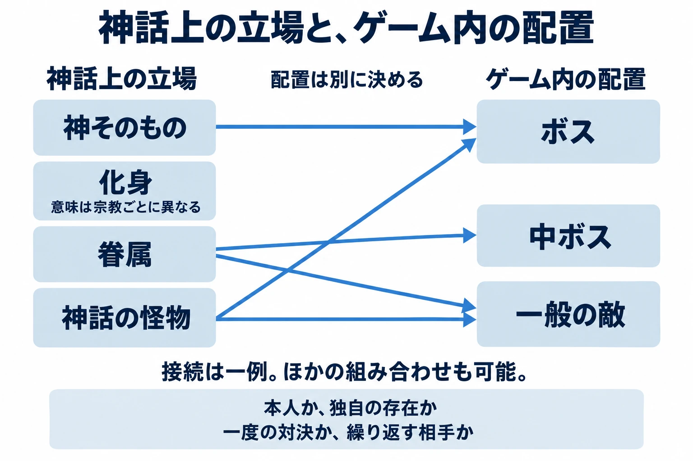

# その神は、どこから借りてきたか――神話・伝承を敵にする前の5つの点検

終盤のボスに、名前を聞いただけで強大さが伝わる存在が欲しい。遺跡を守る敵に、その土地らしい由来を持たせたい。そんなとき、プランナーの候補に上がるのが神話や伝承である。

ところが、知っている名前を選んだところで、判断はまだ始まったばかりだ。頭に浮かんだ姿は古い物語に書かれているものか、後世の画家が描いたものか。それを倒す場面は、どんな意味を持つのか。

シリーズ「神話から敵をつくる」は、一度に考える範囲を広げすぎないため、敵として登場する存在に絞って扱う。仲間や召喚獣など、味方としての登場は第10回で敵との境界を考える際に扱う。ただし、宗教・文化への配慮に関する事例は、登場時の役割を問わず取り上げる。

第1回で持ち帰ってほしい判断軸は、 **「どの層から借りるか」と「どの格で出すか」を先に決める** ことである。「層」は古い文献、後世の文学や挿絵、先行作品などの参照元を指す。「格」は神そのもの、化身、眷属、怪物といった、作品内で引き受けさせる立場を指す。

敵の動きの仕組みは「[敵AI設計の実務](enemy-ai-design-practices.md)」、設定の伝え方は「[世界設定・ロアの書き方](worldbuilding-lore-narrative-placement.md)」に譲り、本稿では元になる素材の選び方を考える。

***

## 1. なぜ神話から敵を借りるのか

編者は、神話から敵を借りる利点を、プレイヤーがすでに持っている知識を出会いの入口にできることだと考える。

「冥界の番人」「雷を司る神」「首が増える怪物」。その名や姿に心当たりがあれば、長い説明を置く前に、役割や脅威の大きさを想像してもらえる。広く翻訳・紹介されてきた題材なら、海外のプレイヤーともイメージを共有する足場になりうる。日本で通じる姿が、どの地域でも同じように通じるとは限らないため、想定する相手は決めておきたい。

また、古代から伝わる物語そのものは、多くの場合、現代の特定の作者から著作権の許諾を得ずに創作の素材にできる。文化庁も、保護期間を満了した著作物を、次の創作の基盤となる共有財産として説明している。ただし、手元にある現代語訳や挿絵まで同じ扱いになるわけではない。この区別は次章で扱う。[[1](#ref-1)]

名前が説明を肩代わりしてくれる分、その名前には期待も付いてくる。恐ろしいと思っていた存在が何度も簡単に倒される、信仰の対象が繰り返し討伐される、見慣れた姿が実は別作品の独自デザインだった――こうしたずれを、完成後に見つけると修正範囲が広がる。

神話を借りるとは、名前だけでなく、それを知る人の記憶や受け止め方も引き受けることだ。その「借りの大きさ」を確かめるため、次の点検を行う。

***

## 2. 5つの点検

### 現役信仰度――今、その存在を大切にしているのは誰か

「現役信仰度」は、現在の信仰との結び付きや、文化遺産・民族的な誇りとしての重要性を見る観点である。誰のどんな受け止め方を確認するかを考える項目であり、信仰の価値を順位付けするものではない。

『SMITE』（Hi-Rez Studios、2014年正式サービス開始、Windows PC版）は、神々をプレイヤーが操作する対戦ゲームである。ここでは敵の採用例ではなく、神話の存在をゲームに登場させた際の配慮の事例として扱う。[[2](#ref-2)]

正式サービス開始前の2012年6月、Universal Society of Hinduismの代表ラジャン・ゼッド（Rajan Zed）氏は、カーリー（Kālī）などの神をプレイヤーが操作することを冒涜だとし、ヒンドゥー教の神々の削除を求めた。Hi-Rezの最高執行責任者トッド・ハリス（Todd Harris）氏は、削除しない方針を示した。同年7月には、ゼッド氏がQuakeCon 2012の運営にも同作を大会種目から外すよう求めたと報じられた。[[3](#ref-3)][[4](#ref-4)]

ゼッド氏はその際、登場する伝統のうち今も信仰されているのはヒンドゥー教だけだと主張した。一方、Hindu American Foundationも描写に不満を示しつつ、情報の正確さについてHi-Rezと協議していた。ここで確認できるのは、抗議と協議が行われたという経緯であり、ヒンドゥー教徒全体の意見が一つだったということではない。[[4](#ref-4)][[5](#ref-5)]

また、「ヒンドゥー教だけ」という発言は、当事者の主張として読む必要がある。北欧の神々を信仰するアイスランドの団体アサトル協会（Ásatrúarfélagið）は、現在も活動している。ギリシャ・北欧を古い物語として扱う場合と、日々の礼拝につながる神を扱う場合とでは確認すべき文脈が異なるが、古代の神話という分類だけで信仰の不在を決めることはできない。[[6](#ref-6)]

この事例から、編者が企画上の教訓として引き出したいのは、 **資料上の正確さと、登場のさせ方への納得は、別々に確かめる必要がある** という点だ。神名の説明が正確でも、衣装や敗北の描写への受け止め方まで決まるわけではない。信仰が途絶えている場合も、文化遺産として誰が大切にしているかを調べる。地域ごとの違いは第2〜8回、とくに第6回のインド・アブラハム系で掘り下げる。

### 権利――古い物語と、今見ている作品を分ける

古い神話を素材にすることと、それを描いた最近のイラストや文章を使うことは、別の問題である。文化庁は、翻訳や脚色などによって新しい創作性が加わったものを、原作品とは別の著作物として保護される「二次的著作物」と説明している。現代語訳、漫画の衣装、ゲーム独自の紋章などは、それぞれ確認の対象になる。[[7](#ref-7)]

名称を商品名やブランドとして使う場合は、著作権と別に商標の確認も要る。商標は、商品やサービスの出所を区別するための名前や印などを保護する仕組みである。神名が古いという理由だけで、商品名としての利用まで判断しない。[[8](#ref-8)]

近現代の創作を起点とする人工神話では、利用条件がとくに重要になる。たとえば共同創作のSCP Foundationは、公式の利用案内で、出典の表示と継承条件のあるライセンスを示している。「読める」「無料で使える」「条件なく使える」を分けて確かめる必要がある。詳しくは、第9回のクトゥルフ・SCPで扱う。[[9](#ref-9)]

### 知名度と期待値――プレイヤーは何を思い浮かべるか

企画上の仮説として、日本のプレイヤーの多くは、神話の名を先行するゲームや漫画で知っていると考えてみよう。そこで見た衣装や性格が、その人にとっての基準になっている場合がある。

企画時には「名前を知っているか」と「どんな姿や性格を想像するか」を分けて確かめる。

期待をなぞる場合も裏切る場合も、元の存在と結び付く手掛かりを選ぶ。対象プレイヤーへの簡単な聞き取りも材料にしたい。第2・3回では日本でも知られるギリシャ・ローマと北欧、第8回では日本のゲームで取り上げられる機会が比較的少ない地域を通じて考える。

### 改変の許容度――何を、誰に向けて変えるのか

姿、性格、強さは、それぞれ別の変更である。さらに、対象年齢に合わせた表現の調整と、宗教・文化への配慮も分けて考える必要がある。

例として、北米の年齢区分を行うESRBは『SMITE』をTeen区分とし、暴力、流血、部分的な裸体などの表示を付けている。これは同作の年齢区分に関する情報である。先ほどの抗議や協議とは、確認している問題が異なる。[[10](#ref-10)]

実務への提案としては、衣装、悪役としての動機、繰り返し倒される扱いなど、変更点ごとに対象地域と年齢区分を確かめたい。

ローカライズ、つまり言葉や表現を届け先に合わせる工程でも、名前の訳、絵、台詞、敗北場面を一緒に見てもらう。具体的な点検は第4〜8回の各地域で続ける。

### 参照元の層――その姿は、いつ付け加わったのか

悪魔の姿を調べるときには、聖書に加え、後世の魔術書や挿絵という層を見分ける必要がある。グリモワールとは、魔術の儀式や知識などを記した書物の呼び名である。たとえば『ソロモンの小さな鍵』（Lesser Key of Solomon／Lemegeton）として知られる文献群は、近世の魔術文献として伝わっている。聖書の人物名を冠していても、聖書本文と同じ資料にはならない。[[11](#ref-11)]

もう一つの代表例が、フランスのコラン・ド・プランシー（Collin de Plancy）による『地獄の辞典』（Dictionnaire infernal）である。初版は1818年。ルイ・ル・ブルトン（Louis Le Breton）による悪魔の図像を収めた、挿絵で知られる第6版は1863年に刊行された。初版の刊年と、この挿絵入りの版の刊年は分けて押さえたい。[[12](#ref-12)][[13](#ref-13)]

参照元を判断する際、編者が注意したいのは、姿の類似から制作の経緯まで推測してしまうことだ。ゲームの悪魔に似た姿をこの本で見つけたとしても、それだけで開発者が同書を直接参照したと確定することはできない。別の画集やゲームを経由した可能性も残る。「姿に共通点がある」と「開発者が参照元だと述べた」は区別する。

企画書でも、「聖書に出る悪魔」とまとめず、名前の出典、性質の出典、姿の出典を分ける。この区別は第6回のアブラハム系、第9回の人工神話につながる。

***

## 3. 神をそのまま倒すか、眷属にするか

資料から何を借りるかが見えてきたら、次は **プレイヤーが倒す相手は、結局、何者なのか** を決める。この章では、編者の考える選び方を具体化していく。

神そのもの、化身、眷属、神話の怪物は、そのための選択肢になる。化身は神が姿を取って現れる存在、眷属は神に属する従者などを指す。ただし、宗教ごとの厳密な意味は異なる。以下は敵を企画するための整理であり、すべての神話に共通する身分表ではない。

### 神そのもの――その名に付いてくる重みを引き受ける

神本人をボスにするなら、プレイヤーの勝利は大きな出来事として受け止められうる。その重みを使いたい企画には、有力な選択肢である。

一方で、討伐後に同じ神が何度も出現する、装備集めのために繰り返し倒される、といった扱いまで含めて考える必要がある。一度の決戦として選んだ名前が、完成したゲームでは日常的に倒す対象になることもありうる。

勝利の意味も選べる。対決に勝つこと、退かせること、存在そのものを滅ぼすことでは、同じ神を敵にしていても引き受ける意味が異なる。戦う理由と決着の範囲を決めてから、その神の名が必要かを考えたい。

そこで、「何のために本人である必要があるか」を短く書く。神の権威に挑むこと自体が題材なのか、名前の知名度が欲しいだけなのか。この答えによって、残すべき格の重さが変わる。

神本人を対立相手にすることと、その神を邪悪な存在と説明することも分けたい。作品内の立場の違いから対決するなら、敵になった理由をその場の関係に置ける。最初から邪神だったとするなら、伝承上の性格そのものを変更する可能性がある。どちらを選ぶ場合も、「敵」という役割だけで性格の改変まで決めないことが大切だ。

### 化身――勝利が及ぶ範囲を決める

化身として出す場合は、その姿への勝利と、神全体の消滅を分けて考える余地がある。強大さを残しつつ、今回の敵として姿を限定したいときに検討できる。

ただし、化身という語自体が信仰上の意味を持つ場合がある。「化身だから本体より下位」「化身なら倒してよい」と機械的に扱うことはできない。もとの伝統に化身という考え方があるのか、ゲーム側が独自に付けた説明なのかを分ける必要がある。

また、画面の名前が神名そのもので、姿も同じなら、企画書の隅に「化身」と書いただけでは区別が伝わらない。プレイヤーが実際に見聞きする呼称と、勝利によって起きることの両方を確認したい。

### 眷属――関係を借り、本人との距離をつくる

眷属を敵にすれば、神本人を倒さずに、その神に属する脅威と対決させる構成を選べる。地域を守る従者を中ボスに置く、同じ役目を持つ存在を一般の敵として出す、といった候補が考えられる。

このとき先に確かめるのは、その従者が資料に実在するかどうかである。独自に作った怪物を「神話に登場する眷属」と説明すると、創作した関係が伝承上の事実に見えてしまう。企画書では「伝承にある従者」と「本作で創作する従者」を分けて記す。

神から距離を置いたつもりでも、その眷属自体が崇敬されている、聖なる役目を持つ、といった可能性は残る。神本人を避けることは、点検する相手を選び直す手段である。

### 神話の怪物――固有の相手か、種類として増やすのか

怪物を選ぶ場合は、神を直接敵にする構図を避けながら、その伝承らしい形や由来を残せる。ただし「怪物」は、そのまま弱い敵という意味にはならない。

反例として、ヒュドラ（Hydra／ヒドラ）は、アポロドロスの『ビブリオテーケー』（邦題『ギリシア神話』）で、ヘラクレス（Hēraklēs）が退治する難敵として描かれる。ここで語られるのは、レルネ（Lerna）にいた特定の怪物である。[[14](#ref-14)]

この記述を敵の企画に当てはめて考えてみよう。このような存在をボスに選ぶなら、固有の相手として扱いやすい。一方、「ヒュドラ」という種類が各地に生息するゲームを作るなら、特定の怪物を一つの種族へ広げる変更を加えている。数を増やすことも、名前や姿を変えるのと同じく、記録しておきたい改変である。

同じ注意は眷属にも当てはまる。原典で一体しか語られない存在を、一般の敵として何体も配置するなら、原典をどこから変えたのかを明らかにする。

### 格と敵の配置を、別々に決めて結び付ける

検討の出発点として、神本人や重要な化身をボス、眷属の長を中ボス、複数いる眷属や怪物を一般の敵に置く案は作れる。しかし、ヒュドラのような怪物を大ボスにすることもできるし、眷属が物語の中心的な脅威であってもよい。

**神話上の立場と、ゲーム内での強さは別々に決める。** そのうえで、両者をつないだときに何が変わるかを見る。本人から眷属へ置き換えると、信仰上の配慮だけでなく、名前の知名度や対決の迫力も変わりうる。採用しやすさだけで選ぶと、最初に神話を借りたかった理由まで薄まる可能性がある。

### 架空の企画例――残す特徴と変える点を一緒に書く

たとえば、ある伝承の「聖域の入口を守る存在」から敵を考えるとする。企画の狙いが「禁じられた場所へ踏み込む緊張感」なら、残したいのは門を守る役割であり、神本人の名は必須とは限らない。

資料にある固有の守護者をそのままボスにする案、伝承上の眷属を中ボスにする案、守護者の役割から独自の怪物を作る案を並べる。それぞれについて、名前、姿、神との関係のうち何を残すか、どこを創作するかを決める。

残したい特徴が神そのものと深く結び付いている場合は、置き換えによって題材の魅力が失われることもある。その場合は本人として出す案へ戻り、登場の意図や決着の扱いを詳しく点検するか、別の素材を探す。格を変えることは万能の解決策ではなく、企画の狙いと両立するかを比べる判断である。

配置から逆に確かめることもできる。入口ごとに同じ姿の敵を置きたいなら、伝承上の同一人物を何体も出すのか、同じ種族なのか、守護者に似せて作られた存在なのかを決める必要がある。一度だけ対決する相手なら、固有名と由来を持つ存在として出しやすい。そして「複数いる独自の守護獣」を選んだなら、説明文に伝承上の本人の来歴をそのまま移さない。外見では別の存在にしたのに、名前や来歴では本人だと伝えてしまうと、判断が食い違うからだ。立場、呼称、由来の説明が同じ選択を示しているかまで確認して、採用案を決める。

独自の怪物を選んだ場合のメモは、たとえば「残すのは入口を守る役割。固有名と聖なる標章は使わず、本作独自の守護獣として出す。特定の神の従者という関係は加えない」と書ける。この形なら、借りたい魅力と変更点を同時に確認できる。

配慮が要る題材で、神本人を倒す相手から眷属や怪物へ変更することは、選択肢の一つである。ただし、元の存在と結び付く姿や象徴を残せば、その受け止め方も確認が要る。架空の名を付けたことだけで、文化的なつながりが消えるわけではない。

***

## 4. 資料の層を見分ける

資料の使い分けについて、編者からの提案は、それぞれに異なる仕事を任せることである。

- **原典・その翻訳**：どの話の、どの場面に登場するかを確かめる。書名だけでなく、訳者、版、巻・章・節を控える。
- **研究者による概説書**：地域や時代による違い、記述が成立した背景を知る。複数の伝承を一つの設定にまとめる前に読む。
- **著者・編者や典拠が明示された事典**：別名や関連項目を探す入口にする。気になった説明は、示された文献へ戻って確認する。
- **後世の文学・絵画・挿絵**：その時代に加わった姿や性格を知る。神話の古い記述と同じ欄にまとめない。
- **他のゲーム**：すでにプレイヤーへ提示された解釈を見る。神話の事実を証明する資料として使う場合とは分ける。

原典も、確認したい対象によって変わる。『地獄の辞典』の挿絵は、その版で悪魔がどう描かれたかを知る一次資料になる。一方、古代の信仰がその姿をどう捉えていたかを、それだけで説明することはできない。

また、一つの敵について、すべてを同じ資料から借りる必要はない。名前は古い物語、姿は後世の挿絵、作品内の立場は独自の創作という組み合わせも可能である。必要なのは、その継ぎ目が分かる記録だ。

企画書には、元ネタの名前に続けて、次のような短い出典メモを添えたい。

> 参照元：書名・著者または訳者・版・該当箇所。  
> 借りる要素：名前／姿／役割のどれか。  
> 本作での変更：本人から独自の怪物へ変更、固有の一体から複数の存在へ変更、など。  
> 出す格と配置：神本人・化身・眷属・怪物のどれとして、どこに出すか。  
> 確認事項：信仰との関係、権利、対象地域での呼称・表現。

これがあれば、監修者には伝承との違い、権利担当者には使う表現、ローカライズ担当者には名前と姿の関係を示しやすい。何を根拠にし、何を創作したかが分かるので、指摘を受けた際にも変更する箇所を選びやすくなる。

***

## 5. 敵を一体決める前に、確認する問い

ここまでの検討を、企画時に使える問いにまとめておこう。候補が決まったら、採用理由と一緒に答えてみる。

- この存在を、今も信仰や文化遺産として大切にしているのは誰か。
- 名前、文章、姿のどこかに、近現代の誰かの創作が混じっていないか。商標や利用条件の確認は済んでいるか。
- 対象プレイヤーは、どんな姿や性格を思い浮かべるか。何を残し、何を変えるか。
- 対象地域と年齢区分に照らして、名前、衣装、台詞、敗北の描写をどう確認するか。
- 神本人、化身、眷属、怪物のどれとして出すか。倒したことが何を意味し、同じ相手を繰り返し出すか。
- どの資料の、どの層から借りたか。資料にある記述と、本作の創作を分けて説明できるか。

本稿の点検を、シリーズ共通の観点に戻して整理すると、次のようになる。

| 観点 | 総論で押さえること |
|---|---|
| 現役信仰度 | 現在の信仰と文化的な重要性を確かめ、古い神話というだけで判断しない。 |
| 権利 | 古い物語と現代の表現を分け、商標・ライセンスも確認する。 |
| 知名度と期待値 | 対象プレイヤーの持つ像を確かめ、残す手掛かりを決める。 |
| 改変の許容度 | 神話上の立場とゲーム内の配置を分け、変更点を地域・年齢区分とともに点検する。 |
| 参照元の層 | 名前・性質・姿ごとに、原典、後世の解釈、先行作品のどこから借りたかを記す。 |

### 全10回の地図

このシリーズでは、同じ点検を題材ごとに繰り返し、敵を選ぶときに重くなる観点の違いを見ていく。

| 回 | 題材 |
|---|---|
| 第1回 | 総論：神話・伝承を敵にする前の点検（本稿） |
| 第2回 | ギリシャ・ローマ |
| 第3回 | 北欧 |
| 第4回 | 日本 |
| 第5回 | 中国 |
| 第6回 | インド・アブラハム系 |
| 第7回 | 古代オリエント：エジプト・メソポタミア |
| 第8回 | 周縁の神話：ケルト、アステカ・マヤなど |
| 第9回 | 人工神話：クトゥルフ、SCP。権利を重点的に扱う。 |
| 第10回 | 番外編：類型別に見る敵の神話モチーフと、敵と味方の境界 |

第8回の「周縁」は、神話の価値を示す呼び方ではなく、本シリーズの構成上、日本のゲームで馴染みのある題材から視野を広げるための位置付けである。

次回はギリシャ・ローマの神話を取り上げる。よく知られた名前ほど、その像をどこで知ったのかを確かめることが、敵を選ぶ出発点になる。

## References

1. [文化庁「ここが知りたい著作権」][1] — 文化庁、公開日記載なし。「著作物の保護期間」について参照。2026年10月4日確認。

[1]: https://www.bunka.go.jp/seisaku/chosakuken/taisetsu/point/index.html

2. [Martin Gaston「Smite release date announced」][2] — GameSpot、2013年11月26日。Hi-Rezによる正式サービス開始日の発表。機種表記は同ページの作品情報およびESRBの資料も参照。

[2]: https://www.gamespot.com/articles/smite-release-date-announced/1100-6416403/

3. [Matt Daniel「Religious group calls for removal of Hindu deities from Hi-Rez's SMITE」][3] — Engadget、2012年6月27日。ゼッド氏の削除要求とHi-Rez側の応答に関する当時の報道。

[3]: https://www.engadget.com/2012-06-27-religious-group-calls-for-removal-of-hindu-deities-from-hi-rezs.html

4. [Eliot Lefebvre「Hindu group continues to protest SMITE, asks QuakeCon to pull the game from the lineup」][4] — Engadget、2012年7月31日。QuakeConへの要請とHindu American Foundationとの協議に関する当時の報道。

[4]: https://www.engadget.com/2012-07-31-hindu-group-continues-to-protest-smite-asks-quakecon-to-pull-th.html

5. [Kate Cox「Hindu Group Wants Religious Arena Combat Game Pulled From QuakeCon」][5] — Kotaku、2012年7月31日。Hindu American Foundationへの取材を含む。

[5]: https://kotaku.com/hindu-group-wants-religious-arena-combat-game-pulled-fr-5930588

6. [Ásatrúarfélagið「Um Ásatrúarfélagið」][6] — Ásatrúarfélagið公式サイト、公開日記載なし。団体自身による信仰・活動の説明。2026年10月4日確認。

[6]: https://asatru.is/um-asatruarfelagid/

7. [文化庁「相談窓口」][7] — 文化庁、公開日記載なし。「ご相談事例」のリメイク・二次創作に関する説明を参照。2026年10月4日確認。

[7]: https://www.bunka.go.jp/seisaku/chosakuken/kaizoku/contact.html

8. [特許庁「出願しても登録にならない商標」][8] — 特許庁、2024年8月26日更新。商標の役割（商標法第3条の説明）について参照。2026年10月4日確認。

[8]: https://www.jpo.go.jp/system/trademark/shutugan/tetuzuki/mitoroku.html

9. [SCP Foundation「Licensing Guide」][9] — SCP Wiki、公開日記載なし。作品利用時の出典表示とライセンス条件について参照。2026年10月4日確認。

[9]: https://scp-wiki.wikidot.com/licensing-guide

10. [Entertainment Software Rating Board「SMITE」][10] — ESRB、審査日記載なし。Windows PC・PlayStation 4・Xbox Oneを対象とするレーティング情報。2026年10月4日確認。

[10]: https://www.esrb.org/ratings/10005676/smite/

11. [British Library「Sloane MS 3648」][11] — British Library Archives and Manuscripts Catalogue、記録更新日記載なし。『Lesser Key of Solomon（Lemegeton）』などを含む写本の書誌。2026年10月4日確認。

[11]: https://searcharchives.bl.uk/catalog/040-002116038

12. [Collin de Plancy『Dictionnaire infernal』第1巻][12] — P. Mongié aîné、1818年。フランス全国総合目録（CCFr）の書誌を参照。

[12]: https://ccfr.bnf.fr/portailccfr/ark:/16871/00111541034

13. [Collin de Plancy『Dictionnaire infernal』第6版][13] — Plon、1863年。CCFrの書誌に版表示とL. Bretonの挿絵について記載がある。

[13]: https://ccfr.bnf.fr/portailccfr/ark:/16871/0019397358

14. [Apollodorus『The Library』第2巻第5章第2節、James George Frazer訳][14] — Harvard University Press／William Heinemann、1921年。Perseus Digital Library所収。ヒュドラ退治の記述を参照。

[14]: https://www.perseus.tufts.edu/hopper/text?doc=Perseus%3Atext%3A1999.01.0022%3Atext%3DLibrary%3Abook%3D2%3Achapter%3D5%3Asection%3D2

----

この文書は、Perplexity、Claude、OpenAI Codex の3つのAIの支援を受けて著述されたものです。引用画像を除き、MIT License にて提供されています。
