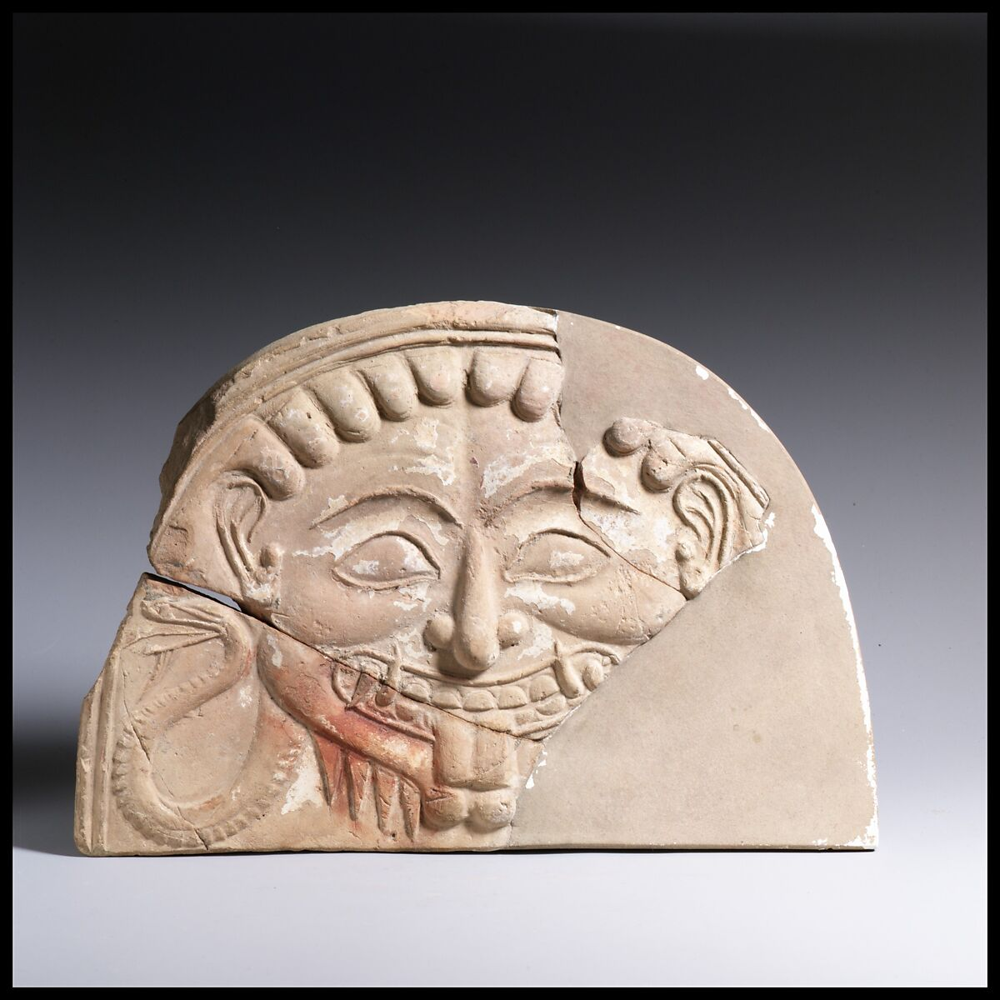
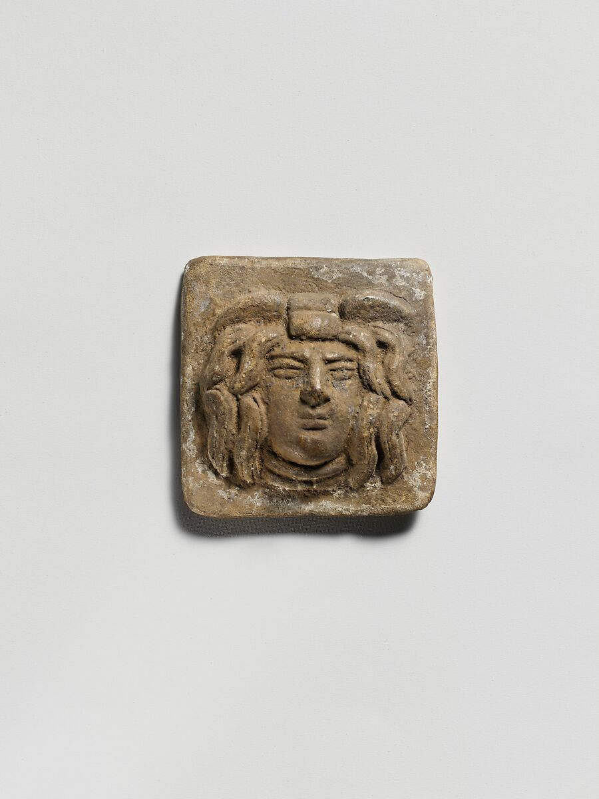

# そのメドゥーサは、どの時代の姿か――ギリシャ・ローマ神話の敵は、重なった像から選ぶ

> ⚠️ **ネタバレ注意** ⚠️
>
> 本稿は『Hades』『新・光神話 パルテナの鏡』などの敵キャラクターや物語の展開に触れます。未プレイで内容を知りたくない方は、先に各作品を遊ぶことをおすすめします。また、メドゥーサの伝承について、性暴力を含む記述を扱います。

「ギリシャ神話なら、名前も姿もよく知られている。信仰への配慮も少なくて済むし、敵に使いやすそうだ」。企画の出発点で、そんな見通しを立てることはあるだろう。

では、メドゥーサ（Medusa／メデューサ）を描くとしたら、どんな姿にするか。牙をむき、舌を突き出す怪物か。蛇の髪を持つ美しい女性か。下半身まで長い蛇になった姿か。同じ名前でも、参照する時代と作品によって、選べる像は変わる。

シリーズ「神話から敵をつくる」第2回は、ギリシャを中心に、この重なりをほどく。[第1回](mythology-enemy-design-five-checks.md)で示した点検のうち、「参照元の層」と「知名度と期待値」を具体化する回である。判断軸は、 **「どの時代の像を採るか」を選び、企画書に書く** ことだ。

***

## 1. 一つの名前に重なる像――メドゥーサの場合

### 古い詩にあるのは、死すべき者という違い

ヘシオドス『神統記』270〜279行では、ゴルゴン（Gorgon）の三姉妹のうち、メドゥーサだけが死すべき者であり、ほかの姉妹は不死で老いないとされる。ここで際立つのは、姉妹の間にある生と死の違いである。後に髪を蛇へ変えられたという経緯は、この箇所には語られない。[[1](#ref-1)]

編者は、この違いだけでも敵の企画につながると考える。同じ怪物の一族でも、倒せる相手と、退けるしかない相手を分ける発想になるからだ。ただし、これは古い詩に記された性質を、ゲームの勝利条件へ移す提案である。ヘシオドスが戦闘のルールを説明したわけではない。

### 古代美術の中でも、顔は変わっている

文字による物語と並んで、見るべき資料が彫刻や器に描かれた姿である。アルカイック期と呼ばれる古代ギリシャの初期の美術では、メドゥーサは見開いた目、大きく開いた口、突き出た舌、猪の牙などを持つ怪物として表された。メトロポリタン美術館の解説によれば、前5世紀から、その像は徐々に美しい若い女性へ変わっていった。[[2](#ref-2)]

つまり、美しいメドゥーサも古代に存在する。古いものほど怪物的、新しいものほど人間的、という傾向を一つの手掛かりにはできても、「古代の姿」を一枚の設定画へまとめるのは難しい。

また、この美術上の変化は、次に見るローマ時代の再話より前に始まっている。美しい女性像を、後の物語が生んだ結果として一直線につなぐことはできない。文献と美術は、年代を確認しながら別々に見る必要がある。

*画像出典：メトロポリタン美術館「[メドゥーサの頭部を表した軒飾り（Antefix, head of Medusa）](https://www.metmuseum.org/art/collection/search/250578)」。西方ギリシャ、アルカイック期、前6世紀。所蔵番号17.230.45、Rogers Fund, 1917。Public Domain。*

*画像出典：メトロポリタン美術館「[メドゥーサの頭部を表したテラコッタ製浮彫板（Terracotta relief plaque with head of Medusa）](https://www.metmuseum.org/art/collection/search/246740)」。ギリシャ、ヘレニズム期、前2世紀。所蔵番号98.8.28、Gift of F. W. Rhinelander, 1898。Public Domain。*

### ローマ時代の再話が加える、髪を変えられた理由

オウィディウス『変身物語』第4巻790〜803行では、なぜメドゥーサだけが蛇の髪を持つのかと問われ、彼女を討ったペルセウス（Perseus）が理由を語る。もとは美しく、とくに髪が人目を引いた女性であり、海の神が女神の神殿で彼女を辱めた後、女神がこの行為を罰せずにおくまいとして、その髪を蛇へ変えた、という筋である。神殿での出来事は798〜800行、髪の変化は801行に記される。[[3](#ref-3)]

ここで海の神はネプトゥヌス（Neptunus／ギリシャ名ポセイドン、Poseidon）、女神はミネルウァ（Minerva／ギリシャ名アテナ、Athena）である。原文は海の神を「海の支配者」と呼ぶ。この筋を現代の読者が読むときには、性暴力を受け、さらに髪を変えられた被害者としてのメドゥーサに目を向ける読み方も成り立つ。一方、被害をどう受け止めたかという本人の内面や、変身後の生き方まで、この短い記述が説明しているわけではない。[[3](#ref-3)]

企画でこの層を採るなら、敵としての危険と、そこに至った事情を両方残せる。たとえば石化の脅威を止める戦いであっても、討伐後の記録から、相手が一方的に害を与えるだけの存在ではなかったと分かる構成が考えられる。これは編者による企画上の提案であり、原典の結末をそのまま再現する案ではない。

ここで選ぶのは、姿だけではない。倒す相手について、プレイヤーに何を知っていてほしいかという物語の判断でもある。

### 映画が広めた、蛇の下半身

映画『タイタンの戦い』（1981年）で、レイ・ハリーハウゼン（Ray Harryhausen）はメドゥーサに蛇の下半身を与えた。英国のNational Science and Media Museumに掲載されたコレクション担当者の解説は、この姿が後の映画制作者やデザイナーに繰り返し採用され、メドゥーサのイメージに影響したと述べている。[[4](#ref-4)]

蛇の髪と蛇の下半身は、分けて扱いたい。前者を古い伝承で確認できても、後者まで同じ箇所に書かれているとは限らない。見慣れた輪郭を採るなら、「ギリシャ神話に忠実」と大きくまとめるより、「後世の映像作品で広まった蛇身の像を採る」と書いた方が、チーム内の認識はそろう。

この選択にも利点はある。蛇の下半身なら、低い姿勢で近づく、長い尾で間合いを変える、といった動きを考えやすい。編者は、後世の像を採ること自体を誤りとする必要はないと考える。どこから借りた特徴なのかを把握し、その作品の具体的な造形までそのまま流用しないことが大切である。

### ゲームが選び直した、人の姿と猪の牙

『アサシン クリード オデッセイ』（Ubisoft、2018年、PlayStation 4・Xbox One・PC）は、メドゥーサを対決する怪物として登場させた。[[5](#ref-5)][[6](#ref-6)]

アートディレクターのティエリー・ダンセロー（Thierry Dansereau）氏は、社内の歴史家と協力して古代の人々の想像を調べ、よく見られる蛇の胴体を採らず、古代の著述家の記述に基づく人の姿と猪の牙を選んだと説明している。外見の類似から推測した話ではなく、開発者が参照方針を明かした事例である。[[6](#ref-6)]

ただし、同作の怪物の由来は、シリーズ独自の古代文明であるイスの遺物と結び付けられている。 **姿の参照先を古代に寄せることと、存在の由来まで古代の物語に合わせることは、別々に選べる。** 古代の特徴を残しながら、自作の設定へ組み込む例だ。[[6](#ref-6)]

### 企画では、何を残すかまで書く

ここまでの層を敵の案へ移すなら、たとえば次の選択肢がある。

- **古代の怪物像を採る**：牙や舌の異様さを残し、遭遇した瞬間の恐ろしさを狙う。どの美術作品や記述を参照したかも添える。
- **蛇の下半身を持つ像を採る**：見慣れた輪郭と、長い体を使う攻撃を狙う。後世の映像表現という層を記録する。
- **被害を受けた側面を残す**：戦う必要と、敵になった事情を分けて描く。古代の記述を下敷きに、どこから内面を創作したかを記録する。

これらは正解の順位でも、排他的な分類でもない。古代美術の牙を持つ姿に、オウィディウスの再話を下敷きとする背景を組み合わせる案も作れる。ただし、その組み合わせ全体が一つの古典に載っているかのようには説明しない。

企画書なら、次の程度まで具体化したい。「顔はアルカイック期の怪物像を参照する。石化する視線を戦闘の中心に据える。蛇の下半身は採らない。過去の被害については『変身物語』を参照し、現在の行動の理由は本作で創作する」。採用する特徴と創作する部分が分かれば、絵・台詞・戦闘を同じ方針で考えられる。

***

## 2. 数と形の期待値――ケルベロスの頭はいくつか

ケルベロス（Kerberos／ラテン語形Cerberus）と聞いて、三つ首の犬を思い浮かべる人はいるだろう。ところが、ヘシオドス『神統記』311〜312行の番犬は五十の頭を持つ。[[1](#ref-1)]

後代の文献を読むと、三つという数にも古い裏付けがある。エウリピデス『ヘラクレス』611行は三つ頭の犬を語り、アポロドロス『ビブリオテーケー』第2巻第5章第12節は犬の頭が三つあると記す。ウェルギリウス『アエネーイス』第6巻417〜423行も、三つの喉で吠え、口を開く姿を描く。[[7](#ref-7)][[8](#ref-8)][[9](#ref-9)]

さらにホラティウス『歌章』第2巻第13歌33〜36行には、冥界で歌に聞き入る「百頭の獣」という表現がある。数の違いは、古い一案から三つ首へ完全に整理されたという単純な流れにも収まらない。[[10](#ref-10)]

この違いを、敵の企画ではどう使うか。三つ首を採るなら、頭ごとに行動を変えたり、視線を分担させたりする案が考えられる。五十頭を採るなら、個々の頭を見分ける戦いより、大量の視線や吠え声に囲まれる異様さを狙う方が合うかもしれない。どちらも編者の提案である。

古い記述に根拠があることは、初見で伝わることを保証しない。五十頭の姿を見てケルベロスだと分かってもらいたいなら、冥界の門を守る配置や名前の提示が手掛かりになる。

[第1回の「知名度と期待値」](mythology-enemy-design-five-checks.md)を、ここでは **「根拠のある形」と「相手が予想する形」を照合する作業** に置き換えられる。日本の想定プレイヤーに三つ首の像がどれほど共有されているかも、決めつけずに確かめたい。

***

## 3. 混ざりもの――ギリシャの場面にいるクラーケン

映画で覚えた像には、時代だけでなく、地域の混合もある。『タイタンの戦い』（1981年）は、ギリシャ神話を扱う物語へクラーケン（Kraken）を登場させた。古代史研究者ヨショ・ブラウワース（Josho Brouwers）氏は、この名が北欧の中世伝承に属し、ギリシャの海の怪物を指すケートス（Ketos／ラテン語形Cetus）とは由来が異なると指摘している。[[11](#ref-11)]

ギリシャの英雄と同じ画面に登場するからといって、その怪物までギリシャ由来になるわけではない。企画書に「ギリシャ神話の海の怪物」と書く前に、名前をどこで知ったのかを一段戻って確認したい。

複数の伝承を混ぜるなら、その意図を書けばよい。「ギリシャ風の舞台に北欧由来の海の怪物を置く」という説明なら、混合そのものを本作の方針にできる。次回の北欧では、このように別地域の作品へ広まった像も、伝わり方から考える。

***

## 4. 英雄と怪物の立場を入れ替える

### 英雄の名を残し、プレイヤーの前に立たせる

『Hades』（Supergiant Games、2020年正式版、PC・Mac・Nintendo Switch。日本語のSwitch版は2021年6月24日配信）は、テセウス（Theseus）とミノタウロス（Minotauros／作中名アステリオス、Asterius）を、エリュシオン（Elysium）で組んで戦うボスとして配置する。[[12](#ref-12)][[13](#ref-13)][[14](#ref-14)]

開発初期にはテセウスを主人公にする案があった。クリエイティブディレクターのグレッグ・カサヴィン（Greg Kasavin）氏は、ありきたりになる一方、個性を足すとテセウスらしさが薄れる難しさを語る。完成作では敵に回り、アステリオスとの友情は本物として描かれる。同氏は、テセウスの傲慢さは神話に深く根ざしたもので、英雄とされながら疑わしい行動も取っている、という趣旨を述べている。また、ハデス（Hades）の知名度に比して物語が少ないことにも着目していた。[[15](#ref-15)]

企画上の示唆は、英雄という呼び名を維持したまま、プレイヤーと対立させられることにある。相手は自分を正しいと考えていてもよい。怪物と呼ばれてきた側にも、戦う相手への敬意や約束を与えられる。敵の組み合わせを変えると、それぞれの来歴が会話や攻撃の連携に使える材料になる。

これは、伝承にある性格の一面を強め、今回の対立関係を作る判断である。「古い物語の英雄は実は悪人だった」と断定するものとは区別したい。

### 食い違いと空白を、創作する場所にする

カサヴィン氏は2019年12月の開発者回答で、ギリシャ神話には興味深い矛盾が多く、それらが作品の中で共存する可能性を認めたいという趣旨を述べている。ここでいう矛盾は、一つの統一設定からの誤差というより、異なる伝承をどう扱うかという制作上の問題である。[[16](#ref-16)]

編者は、資料の少ない箇所ほど「書かれていないこと」と「本作で付け足すこと」を区別するのが有効だと考える。余白があれば、敵としての動機や話し方を作りやすい。一方、テセウスの主人公案が難航したように、知名度や既存の像が創作の自由を狭める場合もある。矛盾や空白があるだけで、どんな改変でも伝わるわけではない。

### 復讐の女神を、再戦する相手にする

同作では復讐の女神たち、エリニュス（Erinyes／複数形エリニュエス）も敵になる。メガイラ（Megaera）は最初のボスとして繰り返し戦う相手であり、アレクト（Alecto）とティシポネ（Tisiphone）もボスとして加わる。GameSpotは、メガイラとの再戦が人物への理解を積み重ねる点を評している。[[17](#ref-17)][[18](#ref-18)]

[第1回で考えた「繰り返し倒される神」](mythology-enemy-design-five-checks.md)に当てはめるなら、企画時に決めたいのは、勝利を相手の存在の終わりにするか、その場を通過したことにするかである。再戦に前の対決の記憶を持たせれば、反復は人物を描く機会にもなる。ただし、物語と反復がかみ合うことと、信仰上の受け止め方は別の点検である。

神そのもの・化身・眷属・怪物という「格」の整理に、今回は英雄という立場も加わる。神話上の呼び名を確かめた後で、今回の敵として何を守り、誰と組み、なぜ戦うかを決める。敵という配置だけで、その存在のすべてを説明しないことが肝心だ。

***

## 5. 物語の調子を変える

改変は、顔や立場だけに限らない。『新・光神話 パルテナの鏡』（任天堂、2012年、ニンテンドー3DS）では、桜井政博氏が「登場する敵も味方も明るく快活にしました」と説明している。神話を題材にした人物へ、軽快な会話や騒がしい調子を与える選択である。[[19](#ref-19)][[20](#ref-20)]

同作のメドゥーサは、作中表記では「メデューサ」であり、序盤の冥府軍を率いる対決相手として登場する。彼女との戦いの後にも物語は続く。また、ハデスは冥府軍の「冥府神ハデス」として登場し、公式のARカード紹介にも「決戦！ハデス」というまとまりが用意されている。ここでの女王や軍勢との関係は、ゲーム独自の設定として読む必要がある。[[21](#ref-21)][[22](#ref-22)]

編者は、この事例を、古典の人物を現代の娯楽の調子へ移す判断として捉える。威圧的な敵に軽口を言わせれば、戦う前から性格が伝わることもある。ただし、明るいという方針だけで、個々の人物の事情が軽くなるわけではない。

たとえば、メドゥーサの被害を物語の重要部分に据える企画なら、その事情と笑いの対象をどう分けるかを考える。これは本稿の企画上の提案であり、『新・光神話 パルテナの鏡』がその再話を採用したという意味ではない。「どの層を採るか」と「どんな調子で語るか」は、組み合わせて判断する項目になる。

***

## 6. ギリシャ名か、ローマ名か

名前にも、伝わった経緯が残っている。ギリシャのゼウス（Zeus）に対応するローマの神はユピテル（Iuppiter／英語Jupiter、ジュピター）であり、英雄ヘラクレス（Herakles／Heracles）は、ローマではヘルクレス（Hercules／英語読みハーキュリーズ）として知られる。[[23](#ref-23)][[24](#ref-24)]

この対応は、ローマがギリシャ人やエトルリア人と接触する中で、神々を受け入れ、同一視していった結果である。研究者ヴァレリー・M・ウォリアー（Valerie M. Warrior）の概説は、南イタリアやシチリアのギリシャ人、北方のエトルリア人との接触を通じたこの経緯を説明している。同一視の後も、信仰や役割の違いは残っている。[[23](#ref-23)]

敵の企画では、この歴史を踏まえて呼び名の方針を決める。日本語版でヘラクレス、英語版でHerculesとするなら、各言語で馴染みのある名を採った変更だと記録する。ギリシャ名にそろえるなら、英語版でもHeraclesなどの表記を検討する。

作品内にゼウスとジュピターを両方出す場合も、同じ存在の別名なのか、本作では別の敵なのかを明確にする。混在を禁じるより、混在に理由を持たせることが大切だ。名前一覧には、日本語表記、他言語での表記、参照した伝承、別名との対応をそろえておきたい。

***

## 7. 採る層を決めるための問い

敵の案がまとまったら、次の問いに短く答えてみる。

- 採用する姿は、どの時代の、どの文献や美術作品に基づくか。
- 蛇の下半身など、映画や他のゲームを通じて覚えた特徴はどれか。
- 頭の数や体の形は、想定プレイヤーの期待をなぞるか、裏切るか。
- その名は本当にギリシャ由来か。別の地域から混ぜるなら、その意図は何か。
- 英雄や神を敵にする理由と、勝利が意味する範囲は何か。
- ギリシャ名とローマ名を、日本語版と他言語版でどう対応させるか。

最後に、冒頭の「信仰への配慮が少なくて済む」という見通しも点検し直したい。古代ギリシャの神々を信仰する団体YSEE（Supreme Council of Ethnic Hellenes）は、2017年4月に、アテネの礼拝施設の許可と、その信仰が「既知の宗教」と認められたことを発表した。同月の取材でも、教育・宗教省による認定が説明されている。団体そのものは、この時点では非営利団体の扱いにとどまっていた。古代の題材であっても、信仰として扱われる場面がある。[[25](#ref-25)][[26](#ref-26)]

権利についても、古い神話と現代作品の造形を分ける。文化庁は、翻訳や脚色などに新たな創作性が加わった部分を、原作品とは別に保護されるものと説明している。古代に題材があることだけで、現代の映画やゲームの具体的な表現まで使えるとは判断しない。[[27](#ref-27)]

| 観点 | ギリシャ・ローマの敵で確かめること |
| --- | --- |
| 現役信仰度 | YSEEの事例のように、信仰として扱われる場面もある。文化遺産としての意味と、届け先の受け止め方を確認する。 |
| 権利 | 古い伝承、現代語訳、映画・ゲーム独自の造形を分ける。画像等の利用条件やライセンス、商品名にする場合の商標も別に確認する。 |
| 知名度と期待値 | 三つ首や蛇の下半身など、想定プレイヤーが思い浮かべる特徴を確かめ、残すか変えるかを決める。 |
| 改変の許容度 | 姿・性格・敵対する理由・語り口を分けて判断する。性暴力や敗北の描写は対象年齢と地域に応じて確認する。 |
| 参照元の層 | 古い詩、古代美術、ローマ時代の再話、映画、ゲームのどれを採るか、資料名とともに企画書へ書く。 |

メドゥーサらしさは、採る資料によって変わる。選んだ層を明らかにすれば、残す特徴にも、変える理由にも説明が付く。次回は北欧神話を取り上げ、よく知られた神々や怪物の像が、どの資料と再解釈を通じて届いたのかを考える。

## References

1. [ヘシオドス『Theogony』、H. G. Evelyn-White訳][1] — William Heinemann、1914年。Theoi Classical Texts Library所収の原典英訳。270〜279行、311〜312行を参照。

[1]: https://www.theoi.com/Text/HesiodTheogony.html

2. [The Metropolitan Museum of Art「Dangerous Beauty: Medusa in Classical Art」][2] — The Metropolitan Museum of Art、2018年2月7日付プレスリリース本文。ページ見出しの日付は2017年10月16日。初期像と前5世紀以降の変化を参照。

[2]: https://www.metmuseum.org/press-releases/dangerous-beauty-2018-exhibitions

3. [オウィディウス『Metamorphoses』第4巻][3] — The Latin Library、掲載日記載なし。790〜803行のラテン語本文を参照。日本語の説明は要約。2026年10月4日確認。

[3]: https://www.thelatinlibrary.com/ovid/ovid.met4.shtml

4. [Phil Boot「The legacy of Ray Harryhausen’s Medusa」][4] — National Science and Media Museum、2013年8月22日。Ray Harryhausen Projectのコレクション担当者による映画の造形と影響の解説。

[4]: https://blog.scienceandmediamuseum.org.uk/ray-harryhausen-changed-our-perception-of-medusa-forever/

5. [Ubisoft「Assassin’s Creed Odyssey Available Now On PS4, Xbox One, and PC」][5] — Ubisoft、2018年10月5日。発売年・対象機種を参照。

[5]: https://www.ubisoft.com/en-us/game/assassins-creed/news/1oUCeEdfDQawAUMpkSg5fh/assassins-creed-odyssey-available-now-on-ps4-xbox-one-and-pc

6. [Ubisoft「The Mythical Creatures of Assassin’s Creed Odyssey – Interview with the Development Team」][6] — Ubisoft、2018年12月19日。Thierry Dansereau、Gareth Glover、Tiberiu Burnea各氏へのインタビュー。

[6]: https://www.ubisoft.com/en-us/game/assassins-creed/news/3B4dol6lFFZ9w9rnepcMph/the-mythical-creatures-of-assassins-creed-odyssey-interview-with-the-development-team

7. [エウリピデス『Herakles』、Robert Potter訳、Mary Ebbott・Casey Dué・Miriam Kamil改訂][7] — Harvard University Center for Hellenic Studies、公開日記載なし。611行を参照。2026年10月4日確認。

[7]: https://www-current.chs.harvard.edu/primary-source/euripides-herakles/

8. [アポロドロス『The Library』第2巻、James George Frazer訳][8] — Harvard University Press／William Heinemann、1921年。Theoi Classical Texts Library所収の原典英訳。第5章第12節を参照。

[8]: https://www.theoi.com/Text/Apollodorus2.html

9. [ウェルギリウス『Aeneid』第6巻][9] — The Latin Library、掲載日記載なし。417〜423行のラテン語本文、とくに三つの喉を表す記述を参照。2026年10月4日確認。

[9]: https://www.thelatinlibrary.com/vergil/aen6.shtml

10. [ホラティウス『Odes』第2巻][10] — The Latin Library、掲載日記載なし。第13歌33〜36行の「belua centiceps」を参照。2026年10月4日確認。

[10]: https://www.thelatinlibrary.com/horace/carm2.shtml

11. [Josho Brouwers「Clash of the Titans (1981) — Boring beyond belief」][11] — Ancient World Magazine、2015年10月19日。映画のクラーケンとギリシャ語ketosを区別する記述を参照。

[11]: https://www.ancientworldmagazine.com/reviews/clash-of-the-titans-1981/

12. [Supergiant Games「Hades FAQ」][12] — Supergiant Games、2025年7月16日更新。正式版の2020年発売とPC・Mac・Nintendo Switchへの対応を参照。2026年10月4日確認。

[12]: https://www.supergiantgames.com/blog/hades-faq/

13. [山中大治郎「冥界ローグライクACT『HADES』Nintendo Switch版国内配信開始。高評価を得た傑作が日本語に対応しついにリリース、クロスセーブも」][13] — AUTOMATON、2021年6月24日。日本語版のNintendo Switch版の国内配信日を参照。

[13]: https://automaton-media.com/articles/newsjp/20210624-166506/

14. [Supergiant Games「Get Pumped for ‘The Beefy Update’!」][14] — Supergiant Games、2019年5月7日。エリュシオンとテセウス・ミノタウロス戦の追加告知。

[14]: https://www.supergiantgames.com/blog/get-pumped-for-the-beefy-update/

15. [Megan Farokhmanesh「Hades almost starred its worst character」][15] — The Verge、2021年3月5日。Greg Kasavin氏への取材。テセウス案、アステリオスとの関係、ハデスの物語の少なさを参照。

[15]: https://www.theverge.com/2021/3/5/22315749/hades-theseus-worst-character-zagreus-supergiant

16. [Greg Kasavin（kid_zomb）「Wondering about Zagreus’ red eye」への開発者回答][16] — Steam Community、2019年12月26日。回答#6の神話の矛盾に関する説明を参照。本人の自己紹介は同掲示板「Welcome from Supergiant Games!」（2019年8月22日）で確認できる。

[16]: https://steamcommunity.com/app/1145360/discussions/0/2632849569465447303/

17. [Chris Pereira「Best Games Of 2020 – Hades」][17] — GameSpot、2020年12月15日。メガイラとの反復するボス戦に関する批評を参照。

[17]: https://www.gamespot.com/articles/best-games-of-2020-hades/1100-6485511/

18. [Supergiant Games「Stay Sharp for the ‘Murder Death Kill’ Update!」][18] — Supergiant Games、2019年3月19日。公式ブログのアーカイブ所収。アレクト・ティシポネのボス追加告知。

[18]: https://www.supergiantgames.com/blog/8/

19. [任天堂「新・光神話 パルテナの鏡」][19] — 任天堂、公開日記載なし。2012年3月22日発売、ニンテンドー3DS用ソフトの製品情報。2026年10月4日確認。

[19]: https://www.nintendo.co.jp/3ds/akdj/index.html

20. [任天堂「社長が訊く『新・光神話 パルテナの鏡』3. ゲーマーが喜んでくれるゲームを」][20] — 任天堂、2012年。桜井政博氏の語り口に関する発言を参照。

[20]: https://www.nintendo.co.jp/3ds/interview/akdj/vol1/index3.html

21. [任天堂「社長が訊く『新・光神話 パルテナの鏡』6. メデューサ戦のあと」][21] — 任天堂、2012年。メデューサ戦と冥府軍の位置付けを参照。

[21]: https://www.nintendo.co.jp/3ds/interview/akdj/vol1/index6.html

22. [任天堂「新・光神話 パルテナの鏡：ARおドールカードパック」][22] — 任天堂、公開日記載なし。vol.17「決戦！ハデス」（2013年2月5日発売）の紹介と冥府軍の分類を参照。2026年10月4日確認。

[22]: https://www.nintendo.co.jp/3ds/akdj/arcardpack/index.html

23. [Valerie M. Warrior『Roman Religion』][23] — Cambridge University Press、2006年。出版社公開抜粋、10頁のギリシャ・エトルリアとの接触と神々の同一視の説明を参照。

[23]: https://assets.cambridge.org/97805215/32129/excerpt/9780521532129_excerpt.pdf

24. [The Metropolitan Museum of Art「Marble statue of a youthful Hercules」][24] — The Metropolitan Museum of Art、公開日記載なし。ギリシャでのHeraklesとローマでの扱いに関する作品解説。2026年10月4日確認。

[24]: https://www.metmuseum.org/art/collection/search/247000

25. [YSEE「ΓΝΩΣΤΗ ΠΛΕΟΝ ΚΑΙ ΜΕ ΑΔΕΙΑ ΙΔΡΥΣΗΣ ΛΑΤΡΕΥΤΙΚΟΥ ΧΩΡΟΥ Η ΕΛΛΗΝΙΚΗ ΕΘΝΙΚΗ ΘΡΗΣΚΕΙΑ」][25] — YSEE、2017年4月10日、声明329。礼拝施設の許可と「既知の宗教」の地位についての団体発表。宗教の連続性に関する団体の歴史観は、本稿では評価していない。

[25]: https://www.ysee.gr/329.html

26. [Cara Schulz「Greek Paganism legally recognized as ‘known religion’ in Greece」][26] — The Wild Hunt、2017年4月18日。YSEE事務局長Vlassis Rassias氏への取材。宗教の地位と団体の法人格の区別を参照。

[26]: https://wildhunt.org/2017/04/greek-paganism-legally-recognized-as-known-religion-in-greece.html

27. [文化庁「相談窓口」][27] — 文化庁、公開日記載なし。「リメイク・二次創作」と二次的著作物に関する説明を参照。2026年10月4日確認。

[27]: https://www.bunka.go.jp/seisaku/chosakuken/kaizoku/contact.html

----

この文書は、Perplexity、Claude、OpenAI Codex の3つのAIの支援を受けて著述されたものです。引用画像を除き、MIT License にて提供されています。
