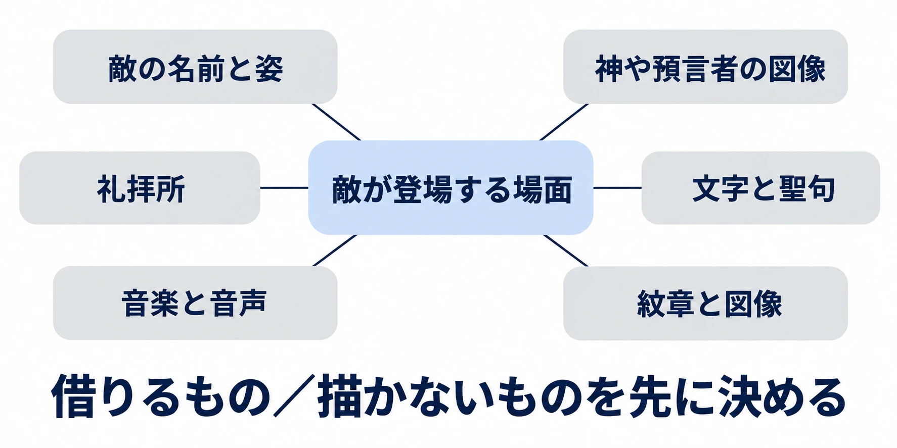

# その神は、敵にしてよい神か――インド・アブラハム系の題材は、敵にする格と、描かないものを先に決める

> ⚠️ **ネタバレ注意** ⚠️
>
> 本稿は『魔界塔士Sa・Ga』の最終ボスの正体と動機、『真・女神転生IV』の一部のボス、および各作品の敵の設定に触れます。

***

## はじめに――敵を選ぶとき、画面の外にいる人も考える

[第1回「その神は、どこから借りてきたか」](mythology-enemy-design-five-checks.md)で触れた『SMITE』への抗議では、神々をゲームに登場させ、プレイヤーが操作すること自体が問われた。

シリーズ「神話から敵をつくる」第6回は、インドとアブラハム系の題材を扱う。アブラハム系とは、ここではユダヤ教・キリスト教・イスラムのように、アブラハム（Abraham）の伝承を共有する宗教を指す。同じ人物や言葉が登場しても、その位置付けや教えは宗教ごとに異なる。

今回はシリーズの中でも、 **現役信仰度――今、その存在や場所を大切にしている人々との関係――を最も重く置く回** である。インドの事例では主にヒンドゥー教を扱い、礼拝所の問題では、独立した宗教であるシク教にも触れる。

[前回の中国編](mythology-enemy-design-china-novels-adaptations.md)では、神話・小説・翻案のどの層から借りたかを分けた。今回はそこへ、何を敵にし、何を描かないかという判断を加える。神の名前を変えても、背景に実在の礼拝所があり、歌に聖典の言葉が残っていれば、宗教との関係は画面の中に残るからだ。

本稿の判断軸は、 **今も信仰されている宗教の題材では、まず教えや物語の中で敵役とされる存在から候補を選び、神や預言者の姿、礼拝所、聖典の文言など「描かないもの」を先に決める** ことである。これは企画の出発点であり、採用を自動的に保証する規則ではない。候補を選んだ後にも、どの伝承で、誰に敵対し、現在はどう受け止められているかを確かめる。

***

## 1. インド――教えの中の敵役を、具体的な物語から選ぶ

### 種族名より先に、その存在の行動を読む

ヒンドゥーの叙事詩『ラーマーヤナ』（Rāmāyaṇa）では、ラークシャサ（rākṣasa、羅刹）の王ラーヴァナ（Rāvaṇa）が、ラーマ（Rāma）の妻シーター（Sītā）を連れ去る。主人公側が彼と対立する理由は、物語の出来事として示されている。原典の英訳とメトロポリタン美術館の解説からも、この関係をたどれる。[[1](#ref-1)][[2](#ref-2)]

アスラ（asura、阿修羅）やラークシャサは、神々や人間に敵対する存在を探す入口になる。宗教研究者の金基淑氏は、バラモン教の文献を検討する中で、アスラなどが神々の敵とされる一方、ラークシャサなどには人に祝福をもたらす属性もあると説明している。 **分類名と、個々の物語での善悪は分けて読む** 必要がある。[[3](#ref-3)]

企画上の提案としては、「アスラだから敵」と決める前に、「この物語で、この人物が何をしたために戦いになるのか」を一文にしてみるとよい。誘拐を止める、侵略を退ける、破られた約束の決着をつける。具体的な対立の理由が書ければ、敵に残すべき性格と、自分のゲームで追加する戦闘能力を分けやすくなる。

### 『Raji』が借りた敵の役割と、現地で見た姿

インドを拠点とするNodding Heads Gamesの『Raji: An Ancient Epic』（2020年、Nintendo Switch・PlayStation 4・Xbox One・Windows PC）は、ヒンドゥーの伝説とバリ（Bali）の神話を下敷きにしたアクションゲームである。公式の商品説明では、人間の領域へ侵入する魔物の軍勢と、その王マハーバラスラ（Mahabalasura）が敵として位置付けられている。[[4](#ref-4)][[5](#ref-5)]

開発者インタビューによれば、チームはラージャスターン（Rajasthan）の4都市を10日間かけて取材した。建築や文化を直接見た経験に加え、バリの魔物の仮面や影絵にも着想を得ている。[[5](#ref-5)]

編者がこの例から注目したいのは、神話にある敵対の役割を借りることと、敵や舞台の見た目を調べることが、別々の仕事として存在する点である。ゲームに登場する王の名前や設定は、まず同作固有の設定として読む。そのまま『ラーマーヤナ』の登場人物一覧へ戻せるものと考えると、ゲームが加えた創作まで原典に混ぜてしまう。

敵の企画書にも、「物語から借りた対立」「美術資料から借りた形」「ゲームのために加えた行動」を分けて書きたい。信仰される神そのものを倒す構図を選ばず、神話の中の敵役を起点にする方法を、具体的な制作へつなげられる。

### 文化の内側で作ることと、受け止めがそろうこと

『Hanuman: Boy Warrior』（2009年、PlayStation 2）は、インドのAurona Technologiesが開発し、ソニーがインド国内で発売した作品である。これは敵の採用例ではなく、宗教への配慮を考える例として見る。[[6](#ref-6)][[7](#ref-7)]

2009年4月、Universal Society of Hinduismの代表ラジャン・ゼッド（Rajan Zed）氏は、ハヌマーン（Hanumān）をプレイヤーが操作することを、信仰される神の尊厳を損なう扱いとして批判し、撤回を求めた。これに対してソニー側は、制作の各段階でインドの学者に相談し、若い世代へ物語の教訓を伝えることを目指したと説明し、同月21日の報道では撤回する予定はないとしていた。[[6](#ref-6)][[7](#ref-7)]

この事例では、現地で開発し、専門家へ相談したという制作側の説明と、操作対象にすることへの抗議が並んでいる。企画時には「現地の人が関わったか」に加え、 **誰に、どの表現を見てもらったか** を残すほうが役に立つ。物語の内容への助言と、実際の操作や敗北演出への受け止めは、別の確認事項になりうる。

日本の作り手も、呼び方の問題に向き合っている。『女神転生』シリーズのデザイナーとして「悪魔絵師」と呼ばれてきた金子一馬氏は、2025年12月のインタビューで、インドの人々が自国の神を悪魔として扱われることに怒っているという話を耳にしていたため、「神魔画家」を名乗ることにしたと語った。これは金子氏が聞いた話と、自身の名乗りについての説明である。[[8](#ref-8)]

ゲーム内で便利な総称として使う「悪魔」も、読む人にとっては信仰の対象への評価になりうる。敵を選ぶ際には、名前と姿だけでなく、図鑑の分類名や説明文にも目を向けたい。

***

## 2. アブラハム系――悪魔、天使、神のどの層を使うか

### 天使を敵にするなら、作品が加えた解釈を明確にする

ゲームでは、悪魔を戦う相手にする表現が親しまれている。その姿には、宗教文書に加え、[第1回で扱った『地獄の辞典』などの後世の書物](mythology-enemy-design-five-checks.md)が重なっている。参照元を一冊に絞るだけでも、どこまでが古い伝承で、どこからが後の作者の解釈なのかを整理しやすくなる。

敵にする立場を入れ替えた例が、プラチナゲームズ開発の『ベヨネッタ』（2009年、日本のPlayStation 3・Xbox 360版）である。公式サイトは天使との戦いを作品の軸に据えている。[[9](#ref-9)]

同作のプロデューサーで敵のデザインも担当した橋本祐介氏は、開発初期に「敵が天使」という発想から案を描き始めたと説明する。敵「アフィニティ」（Affinity）では、神聖さを表す白を中心に、人と鳥を組み合わせた姿を採ったという。[[10](#ref-10)]

ここから企画に持ち帰れるのは、「神聖に見えるものを、戦う相手としてどう見せるか」という造形上の問いである。宗教全体における天使の評価と、同作の敵としての天使を分けて説明すれば、作品独自の反転も読み取りやすい。発売元と開発元の関係は[別稿](publisher-developer-role-differences-bayonetta.md)に譲る。

### 『エルシャダイ』――外典という呼び名にも立場がある

『El Shaddai ASCENSION OF THE METATRON』（以下『エルシャダイ』、2011年、PlayStation 3・Xbox 360）は、『エノク書』（Book of Enoch）を題材に、堕天使――天上の秩序から離れた天使――を追う物語を描く。ディレクターの竹安佐和記氏は、英国本社から『エノク書』をテーマにする要望を受けたと語っている。[[11](#ref-11)][[12](#ref-12)]

正典とは、ある宗教共同体が規範となる聖典として受け入れる文書の範囲である。外典はその範囲の外に置かれる文書を指し、偽典という分類では、古い人物の名に託して書かれた文書が問題になる。『エノク書』は旧約偽典として紹介される一方、エチオピア正教会の聖書には『エノク書』が含まれている。外典か正典かは、どの教会から見るかによって変わる。[[13](#ref-13)][[14](#ref-14)]

企画では、「聖書に入っていないから自由に変えられる」とひとまとめにせず、「この文書の、この部分を採る」と書くほうが具体的である。堕天使の名前や行動を文書から借りる部分と、ゲームのボスとして加える衣装、武器、戦闘段階を区別する。参照元の層を分けることは、現在もその文書を大切にする人々を視野に入れることにもつながる。

### 預言者の姿は、描く前に方針を決める

イスラムには、預言者ムハンマド（Muḥammad）の姿を描くことを避け、図像化を認めない解釈がある。同時に、イスラム圏にはムハンマドを描いた写本絵画の歴史も存在する。ハーバード大学の宗教教育資料は、こうした図像とそれに対する異なる見解を通じ、宗教内部の多様性を説明している。[[15](#ref-15)]

この幅を知ったうえで、ゲームの企画には「本作では神や預言者の姿を描かない」という範囲を先に設定できる。古い絵画が存在することと、現代のアクションゲームで同じ人物をどう扱うかは、それぞれの文脈で考える事項である。

描かないと決めたら、キャラクター一覧だけでなく、壁画、ロード画面、収集品の肖像、宣伝用の絵にも同じ方針を通す。その人物を連想させる架空の肖像を後から足す場合も、最初の判断へ戻って検討する。

### 「神を倒す」を、個々の作品の設定として読む

『魔界塔士Sa・Ga』（1989年、ゲームボーイ）の最終ボスは「かみ」である。作中では、退屈を理由に怪物を放ち、英雄が現れる状況を作った存在として描かれる。ここで戦いになる理由は、作中の「かみ」が人々に行ったことにある。[[16](#ref-16)][[17](#ref-17)]

開発を手がけた河津秋敏氏は初期構想についても語っているが、本稿では完成作の「かみ」を特定宗教の神に対応させず、この作中設定として扱う。[[18](#ref-18)]

『真・女神転生』シリーズでは、宗教解釈の層を経由した敵も登場する。『真・女神転生IV』（2013年、ニンテンドー3DS）のデミウルゴス（Dēmiourgos）は、チャレンジクエストのボスである。公式サイト掲載の解説では、自らを唯一神と思い込む造物主というグノーシス主義――古代の宗教思想の一群――の解釈と、この敵の登場が結び付けられている。ここでは「唯一神と考えられる存在」の描き方自体が、ある解釈を経ている。[[19](#ref-19)][[20](#ref-20)]

さらに『真・女神転生IV FINAL』（2016年、ニンテンドー3DS）は、公式に「神殺し」と「一神教vs多神教」を掲げる。これも同作が選んだ物語の構図として読む対象である。[[19](#ref-19)][[21](#ref-21)]

こうした個別の作品から企画上の問いを取り出すなら、「倒す相手が、どこまで現実の宗教を指すか」となる。作品独自の名前を持つ支配者なのか、特定の文書に現れる造物主なのか、信仰される固有名を持つ神なのか。[第1回の「格」の整理](mythology-enemy-design-five-checks.md)に、この距離を加えるとよい。

編者は、架空の神を作る場合も、名称、姿、教え、紋章を一緒に点検することを勧める。名前だけを変え、ほかの特徴を実在の宗教からそろえて借りれば、プレイヤーはその宗教との関係を読み取るだろう。どのような創作上の距離を取りたいかまで、企画書へ書いておきたい。

***

## 3. キャラクターの外にあるもの――場所、言葉、音、図像

敵の設定が決まったら、次はプレイヤーが戦う場面を一つのまとまりとして見る。相手の姿に加え、立っている場所、足元の文字、流れる歌、壊れる物が、その戦闘の意味をつくる。この点検は、背景、美術、音楽、演出、宣伝の担当者にも関わる。

### 礼拝所――「誰を倒すか」と「どこで倒すか」を合わせる

『Hitman 2: Silent Assassin』（Eidos、2002年、Windows PC・PlayStation 2・Xbox）では、シク教の礼拝所でターバンを巻いたシク教徒の人物と戦う場面などに、Sikh Coalitionとほかのシク教団体が抗議した。シク教の礼拝所はグルドワラ（gurdwara）と呼ばれる。[[22](#ref-22)][[23](#ref-23)]

2002年11月11日の報道によれば、Eidosは開発元のIO Interactiveとともに、公式サイトから関係する画像と内容を削除し、既存の各機種でゲームを修正する手続きを進め、後に発売するゲームキューブ版へ対応を反映すると表明した。抗議には他の描写への指摘も含まれていたが、本稿では礼拝所の場面に絞る。[[22](#ref-22)]

ここで企画上の焦点になるのは、敵の所属だけでなく、礼拝所、服装、そこで行わせる暴力が結び付いて見えることである。設定資料に「悪人である」と書いてあっても、プレイヤーが最初に受け取るのは、礼拝の場で特定の服装の人々を攻撃する画面かもしれない。

そのため、舞台を選ぶ段階で、建物の役割とプレイヤーの行動を並べてみたい。そこは今も使われる礼拝所を再現した場所か。礼拝のための物を、遮蔽物や破壊すると得点になる物にしているか。戦闘の理由は、実際に操作する場面でも伝わるか。

仮に必要なのが「柱が並ぶ広い空間での戦闘」なら、同じ遊びを作品独自の広間で作る案もある。礼拝所であることが物語に欠かせないなら、その理由と、そこで許す行動を先に詰める。この選択は、背景を完成させてから修正するより、戦闘を設計する時点で行うほうが扱いやすい。

### 聖典の文言――使用許諾を得た楽曲も、内容を読む

『LittleBigPlanet』（2008年、PlayStation 3）では、レコード会社から使用許諾を得たBGMに、イスラムの聖典クルアーン（Qurʾān、コーラン）にある表現が含まれていた。ソニーは2008年10月17日、該当する表現と修正対応を公式に説明し、北米の出荷を延期した。同日の報道は、対応が全世界の回収へ広がったことも伝えている。[[24](#ref-24)][[25](#ref-25)]

発売延期を伴うこの対応では、問題となった音楽を修正した版が用意された。ここでは、敵キャラクターを作る工程とは別に、外部から導入した歌が宗教的な文言をゲームへ運び込んでいた。[[26](#ref-26)]

この例を企画の手順に置き換えるなら、音楽を選ぶときに「使う許諾があるか」と「何を歌っているか」を別々に確認する。歌詞を読める形で受け取り、言語と意味を確かめ、聖典や祈りからの引用があれば、どの場面で鳴らすのかと一緒に検討するのである。

とりわけ戦闘BGMは、台詞のように字幕で確認できるとは限らない。意味を理解しないまま、響きだけを「荘厳」「神秘的」と判断すると、どの言葉を戦闘に重ねたかが見えにくくなる。反復される短い音声素材や、仮に置いた音源も、完成版へ残る前提で点検対象に含めたい。

この事例から取り出せるのは、素材の意味を確認する工程である。宗教内部にある多様な評価と、ソニーがこの製品で採った判断を分けて記録する。

### 図像と文字――読めない装飾を、そのまま敷かない

建築の写真や美術資料を参照するときには、形と文字が同時に入ってくる。メトロポリタン美術館のイスラム美術解説も、宗教建築における人物表現の抑制と、ほかの場面に見られる豊かな人物表現を区別している。ある文化の「見た目」を一つの規則でまとめるより、どこで使われる表現かを調べるほうが正確である。[[27](#ref-27)]

企画上の提案としては、壁面や床の文字、衣装の紋章、敵の攻撃時に出る図形にも、名前と意味を付けて管理するとよい。「模様」として渡された素材に実在の祈りの言葉が含まれている場合、文字だと気付いた時点で確認の担当者へ回せるようにする。

たとえば、ボス部屋の床に装飾文字を置く案なら、プレイヤーがその上を歩く、攻撃する、血や破片で覆うといった状態まで含めて判断する。紋章を敵の弱点にするなら、その印を壊すことに宗教的な意味が生じるかも検討する。静止画では丁寧に再現された意匠でも、操作が加われば別の読み方が生まれる。

架空の文字や図像へ置き換える場合は、世界設定の中で何を意味するかを新たに決めるとよい。実在の聖句の一部を読めなくしただけのものより、作品固有の意味と用途を説明しやすくなる。

### 「描かないもの」を、担当者が判断できる形にする

編者が勧めるのは、敵の採用案と同じ時点で、以下のような表を作ることである。右端には「配慮する」といった抽象語ではなく、発注と確認に使える文を書く。

| 点検するもの | 一緒に見るもの | 企画方針の記入例 |
| --- | --- | --- |
| 敵の名前・姿・役割 | 参照した文書、現在の信仰、図鑑の分類名 | 特定の物語の敵役を起点にし、戦闘能力の追加部分を明記する |
| 神や預言者の図像 | 壁画、収集品、ロード画面、宣伝素材 | 本作では肖像や姿を描かず、背景にも配置しない |
| 礼拝所 | 衣装、礼拝用の物、破壊・攻撃できる範囲 | 戦闘に必要な空間は、作品独自の建築として設計する |
| 文字 | 壁、床、武器、衣装、画面表示 | 聖典や祈りの文言を装飾に使わず、文字の意味を資料に残す |
| 音楽・音声 | 歌詞、引用元、鳴る場面、反復の仕方 | 外部音源は歌詞と意味を確認してから採用する |
| 紋章・図像 | 元の用途、敵との結び付き、壊したときの演出 | 実在の宗教的な印を、意味未確認のまま弱点や得点対象にしない |

これらは一つの企画で採れる方針の例である。すべての作品へ同じ禁止事項を課すための表ではない。自分たちが残したい題材と表現上の範囲を決め、背景や音楽の発注にも伝えるために使う。

制作の順番としては、候補を選び、借りる要素と描かない要素を記録し、専門家や想定する地域の協力者に、実際の場面を見てもらう。その後、組み上がった戦闘を文字と音声まで含めて見直す。地域別の翻訳や年齢区分の確認も、この方針と並行して行う。年齢区分の審査と宗教的な受け止めの確認は、それぞれ目的が異なる。

協力者との関係づくりや文化的な確認を制作に組み込む一般論は、[文化盗用リスク管理の講演記事](cedec2026-cultural-appropriation-risk-management-for-game-planners.md)で扱った。本稿の表は、その作業を敵の登場場面へ絞ったものだ。

***

## 4. 抗議を読む――誰が、何を、どの範囲で求めたか

抗議に関する記事を読むときは、まず主語と要求を残す。本稿の事例も、次のように分けられる。

| 事例・時期 | 主体 | 問題にしたことと要求の範囲 |
| --- | --- | --- |
| 『SMITE』、2012年6月 | Universal Society of Hinduism代表のゼッド氏 | ヒンドゥー教の神々を操作対象とする扱いなどを批判し、ゲームからの削除を要求。詳細は[第1回](mythology-enemy-design-five-checks.md) |
| 『Hanuman: Boy Warrior』、2009年4月 | 同団体代表のゼッド氏 | ハヌマーンをプレイヤーが操作することを批判し、作品の撤回を要求。ソニー側の制作意図と応答は別に記録する [[6](#ref-6)][[7](#ref-7)] |
| 『Hitman 2: Silent Assassin』、2002年11月の報道 | Sikh Coalitionとほかのシク教団体 | 礼拝所での戦闘などを批判。Eidosは関連する画像・内容の削除と、ゲームの修正へ対応すると表明 [[22](#ref-22)] |

個人の発言でも、団体代表として行われる発言がある。複数団体の抗議でも、それだけで信徒全体の見解にはならない。地域の宗教団体が特定の場所について述べる場合も、その場所との関係や要求を確かめることになる。「宗教側が怒った」とまとめるより、対応すべき内容が見えやすい。

開発側では、元の声明、対象となる画面、求められた変更、返答、その後の実装を分けて記録したい。『Hitman 2』についても、Eidosが修正の手続きを進めると表明したことと、すべての既存製品で修正が完了したことは区別する。この違いは、抗議の是非を判定するためではなく、何が起き、何がまだ確認を要するかを取り違えないために必要である。

### 抗議を演出した広告は、別の事実として読む

『Dante's Inferno』（EA、2010年、PlayStation 3・Xbox 360・PSP）の発売前には、宗教的な抗議を装った宣伝が行われた。2009年6月のE3での出来事について、AP通信は同月5日、EAが雇ったバイラル広告会社――口コミによる拡散を狙う広告会社――が演出したと報道した。EAの広報担当者も、同社が依頼した広告会社による企画だったと説明している。[[28](#ref-28)][[29](#ref-29)]

編者は、この種の演出を、神話を使う作品の宣伝方法として避けるべきだと考える。抗議する信徒という役を話題づくりのために用意すれば、実際の人々の信仰や懸念まで広告の小道具として受け取られかねない。作品の敵が誰であるかとは別に、宣伝が現実の人々をどう描くかという問題が生じる。

[第3回で見た「記号の現在」](mythology-enemy-design-norse-gaps-symbols.md)と同じく、使う側の意図だけで意味は完結しない。抗議を紹介する側も、当事者の要求と広告上の演出を分け、刺激的な見出しのために混ぜないことが大切である。

***

## 5. 企画書に残す問い

敵の候補と、その敵が登場する場面について、次の問いに答えられるかを確かめたい。

- その存在は、参照する教えや物語の中で敵役なのか、信仰の対象なのか。地域や文書によって立場が変わるか。
- 神そのもの、化身、眷属、怪物のどの格を採り、何に勝つ物語にするのか。
- 神や預言者の姿を描くか。描かない方針は、背景や宣伝素材まで共有されているか。
- 舞台に礼拝所を使うか。そこでプレイヤーに何をさせ、何を壊せるようにするか。
- 聖典の文言や祈りの言葉が、装飾文字や音楽に入っていないか。意味を確かめる人は決まっているか。
- 図像や紋章は、どの宗教の、どの場所や用途に由来するか。
- 作中の架空の神は、名前・姿・教えを合わせて見たとき、現実の宗教とどれくらい距離があるか。
- 抗議があったとき、誰が何を求めているかを確かめ、実際の変更まで追う手順があるか。

シリーズ共通の5つの観点に戻すと、今回の重点は次のようになる。インド・アブラハム系を一つの宗教的な規則でまとめず、個々の題材を調べるための表である。

| 観点 | 今回の重点 | 企画で残すもの |
| --- | --- | --- |
| 現役信仰度 | 神、聖典、礼拝所と現在の人々の関係を重く見る | 参照する伝統・地域、相談した相手、見てもらった場面 |
| 権利 | 古い伝承と、現在の翻訳・絵・録音などの利用条件を分ける。商標やライセンスも別に確認する | 参照資料と使用素材の一覧、利用条件 |
| 知名度と期待値 | 日本のプレイヤーが他作品で覚えた像と、信徒にとっての意味を分ける | 何を残し、どこで作品独自の解釈を加えるか |
| 改変の許容度 | 敵の姿だけでなく、操作、場所、音、宣伝を合わせて検討する。地域・年齢区分・翻訳で生じる差も点検する | 描かないもの、改変の理由、地域別に確認する項目 |
| 参照元の層 | 正典、外典・偽典、後世の文学や図像、ゲーム固有の設定を分ける | どの文書・版・解釈から借りたか |

敵を作る作業では、魅力的な名前や姿を見つけることと同じくらい、借りる範囲を定めることが重要になる。物語の中の敵役を選び、その敵に必要な特徴を残し、作品固有の戦い方を加える。そして、神や預言者の姿、礼拝所、聖典の言葉をどう扱うかを、画面が完成する前に決める。その順番があれば、調べたことを具体的な制作判断へつなげられる。

次回は古代オリエント、エジプトとメソポタミアを扱う。古い神像や怪物の姿を敵へ移すとき、どの役割と象徴を残すかを考える。

## References

1. [Vālmīki『The Rāmāyana, Volume Two』][1] — Manmatha Nath Dutt英訳、1891年。Project Gutenberg公開版、Āraṇya Kāṇḍaのラーヴァナとシーターの場面を参照。

[1]: https://www.gutenberg.org/files/57826/57826-h/57826-h.html

2. [The Metropolitan Museum of Art「Sita and Rama: The Ramayana in Indian Painting」][2] — メトロポリタン美術館、2019年の展覧会解説。

[2]: https://www.metmuseum.org/exhibitions/listings/2019/sita-and-rama-ramayana-indian-painting

3. [金基淑「供物を通してみたバラモン教のパンテオン――『家庭経（Grihya-Sūtras）』を中心に」][3] — 京都文教大学リポジトリ所収。神々・アスラ・ラークシャサなどの性格についての記述を参照。2026年10月6日確認。

[3]: https://kbu.repo.nii.ac.jp/record/1679/files/hs03_16_kim.pdf

4. [Nodding Heads Games「Raji: An Ancient Epic」][4] — Steam公式商品ページ、Windows PC版2020年10月15日発売。2026年10月6日確認。

[4]: https://store.steampowered.com/app/730390/Raji_An_Ancient_Epic/

5. [Epic Games「Raji: An Ancient Epic represents one of this year's biggest underdog stories」][5] — Unreal Engine、2020年10月15日。開発者へのインタビュー。対応機種、現地取材、インドとバリからの影響を参照。

[5]: https://www.unrealengine.com/developer-interviews/raji-an-ancient-epic-represents-one-of-this-year-s-biggest-underdog-stories

6. [Leigh Alexander「Hindu Statesman Criticizes Sony's Hanuman: Boy Warrior」][6] — Game Developer、2009年4月20日。当時の発売・開発情報とゼッド氏の要求に関する報道。

[6]: https://www.gamedeveloper.com/game-platforms/hindu-statesman-criticizes-sony-s-i-hanuman-boy-warrior-i-

7. [John Ribeiro「Hindu Leader Criticizes Sony Video Game」][7] — PCWorld、2009年4月21日。ゼッド氏とソニー側のメールによる説明を掲載。

[7]: https://www.pcworld.com/article/528618/article-6621.html

8. [山本雄太郎「夜の新宿で経験した実体験も“金子ワールド”の一部に　『神魔画家』金子一馬が放つ異彩のルーツ」][8] — リアルサウンド テック、2025年12月10日。金子一馬氏へのインタビュー。

[8]: https://realsound.jp/tech/2025/12/post-2216424.html

9. [プラチナゲームズ「ベヨネッタ」][9] — 公式作品ページ、日付記載なし。日本の発売日・対応機種を参照。2026年10月6日確認。

[9]: https://www.platinumgames.co.jp/works/bayonetta

10. [Yusuke Hashimoto「Of Angels and Monsters」][10] — PlatinumGames Official Blog、2009年5月15日。橋本祐介氏による敵のデザイン解説。

[10]: https://www.platinumgames.com/official-blog/article/1365

11. [豊臣孝和「イグニッション・エンターテイメント・リミテッド、PS3/Xbox 360『El Shaddai』注目の話題作が本日発売！ ～ファーストインプレッション～」][11] — GAME Watch、2011年4月28日。発売情報と作品内容を参照。

[11]: https://game.watch.impress.co.jp/docs/news/442288.html

12. [小野憲史「『El Shaddai-エルシャダイ-』クリエイター・竹安佐和記氏インタビュー」][12] — GAME Watch、2011年6月21日。『エノク書』を題材にした経緯を参照。

[12]: https://game.watch.impress.co.jp/docs/interview/453475.html

13. [Richard Gottheil・Enno Littmann「ENOCH, BOOKS OF (Ethiopic and Slavonic)」][13] — Jewish Encyclopedia、1901～1906年刊。エノクに帰せられる文書と、その伝承についての項目。

[13]: https://www.jewishencyclopedia.com/articles/5773-enoch-

14. [Ethiopian Orthodox Tewahedo Church「The Bible / Books of the Church」][14] — エチオピア正教会の文献紹介、掲載日記載なし。ページ末尾に1970年・1983年の教会刊行物を典拠として記載。2026年10月6日確認。

[14]: https://www.ethiopianorthodox.org/english/canonical/books.html

15. [Harvard Divinity School, Religion and Public Life「Hamline University and Islamic Art」][15] — ハーバード大学、2024年。預言者の図像と宗教内部の多様性についての解説を参照。

[15]: https://rpl.hds.harvard.edu/religion-context/case-studies/arts-and-material-culture/hamline-university-and-islamic-art

16. [SQUARE ENIX「SaGa Franchise」][16] — スクウェア・エニックス公式サイト、日付記載なし。初代の日本発売年とゲームボーイ向け発売を参照。2026年10月6日確認。

[16]: https://www.square-enix.com/saga/en-gb/about/

17. [蚩尤「バラバラにしてスカっとさわやか！初代『サガ』の神は体を張ったエンターテイナーだった」][17] — Game*Spark、2022年8月28日。作中の「かみ」の設定を参照。宗教上のモチーフを述べた開発者資料としては扱わない。

[17]: https://www.gamespark.jp/article/2022/08/28/121778.html

18. [電撃オンライン「新作『SAGA2015（仮称）』発表記念。河津秋敏氏が振り返る『サガ』シリーズ25年の思い出」][18] — 電撃オンライン、2015年。河津秋敏氏による初代の開発経緯と初期構想の説明。

[18]: https://dengekionline.com/elem/000/000/988/988659/

19. [アトラス「ゲームタイトル」][19] — アトラス公式サイト、日付記載なし。『真・女神転生IV』『真・女神転生IV FINAL』の発売日と機種を参照。2026年10月6日確認。

[19]: https://www.atlus.co.jp/title/

20. [塩田信之「真4Fと神話世界への旅 第4回　神秘思想と悪魔サタン」][20] — 『真・女神転生IV FINAL』公式サイト、2015年11月13日、4ページ目。『真・女神転生IV』のデミウルゴスのボス登場と、同コラムによるモチーフの説明を参照。宗教史一般の典拠とは区別する。

[20]: https://megaten4f.jp/topics/299/4/

21. [アトラス「真・女神転生IV FINAL」][21] — 公式サイト、2016年発売。作品のコンセプトと物語紹介を参照。2026年10月6日確認。

[21]: https://megaten4f.jp/

22. [Sam Parker「Eidos responds to Sikh controversy」][22] — GameSpot、2002年11月11日。抗議内容とEidosの声明を掲載。

[22]: https://www.gamespot.com/articles/eidos-responds-to-sikh-controversy/1100-2897279/

23. [Sikh Coalition「About Sikhs」][23] — Sikh Coalition、日付記載なし。グルドワラについての説明を参照。2026年10月6日確認。

[23]: https://www.sikhcoalition.org/about-sikhs/

24. [Patrick Seybold「LittleBigPlanet Release Update」][24] — PlayStation.Blog、2008年10月17日。ライセンス楽曲に含まれるクルアーンの表現と、北米の出荷延期に関する公式発表。

[24]: https://blog.playstation.com/2008/10/17/littlebigplanet-release-update/

25. [Joe Martin「LittleBigPlanet has global recall for Qur'an quote」][25] — bit-tech、2008年10月17日。全世界での回収と発売延期に関する報道。

[25]: https://bit-tech.net/news/gaming/littlebigplanet-has-global-recall-for-qur-an-quote/1/

26. [Tor Thorsen「Little Big Planet launches; sequel in development」][26] — GameSpot、2008年10月27日。発売と音楽の修正に関する報道。

[26]: https://www.gamespot.com/articles/little-big-planet-launches-sequel-in-development/1100-6200106/

27. [Department of Islamic Art「Figural Representation in Islamic Art」][27] — メトロポリタン美術館、2001年10月。

[27]: https://www.metmuseum.org/essays/figural-representation-in-islamic-art

28. [Electronic Arts「Visceral Games Announces February Release Date for Dante’s Inferno」][28] — EA、2009年8月18日。2010年発売と対応機種の発表。機種別の発売日の一致までは本稿で扱わない。

[28]: https://news.ea.com/press-releases/press-releases-details/2009/Visceral-Games-Announces-February-Release-Date-for-Dantes-Inferno/default.aspx

29. [Associated Press「Electronic Arts stages fake protest of game at E3」][29] — AP通信、2009年6月5日、Phys.org掲載。EA広報担当者による説明を含む。

[29]: https://phys.org/news/2009-06-electronic-arts-stages-fake-protest.html

----

この文書は、Perplexity、Claude、OpenAI Codex の3つのAIの支援を受けて著述されたものです。引用画像を除き、MIT License にて提供されています。
