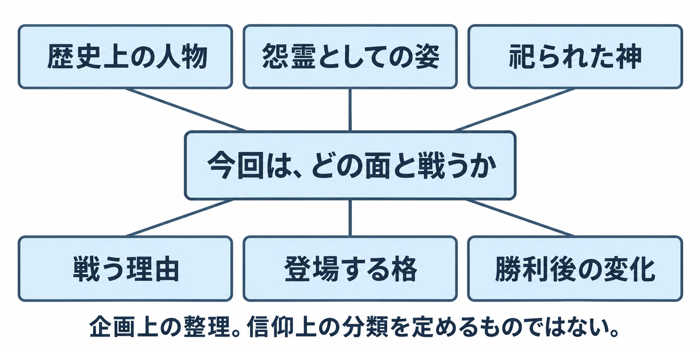

# その神は、今どこで祀られているか――日本の神話・伝承の敵は、内側にいるからこそ確かめる

> ⚠️ **ネタバレ注意** ⚠️
>
> 本稿は『大神』の八岐大蛇、『東方風神録 〜 Mountain of Faith.』の終盤と追加ステージのボス、『仁王』の海坊主との戦闘に触れます。

***

## はじめに――知っている名前の、その先へ

八岐大蛇なら首が多い大蛇、天神様なら学問の神。日本で暮らし、日本語の物語に触れてきた書き手には、説明を聞く前から姿が浮かぶ名前がある。その親しさは敵を考える入口になる。同時に、自分が知っている姿を、その存在の全体だと思いやすくもなる。

「神話から敵をつくる」第4回は、日本の神話・伝承を扱う。[第1回の総論](mythology-enemy-design-five-checks.md)、[第2回のギリシャ・ローマ編](mythology-enemy-design-greek-roman-layers.md)、[第3回の北欧編](mythology-enemy-design-norse-gaps-symbols.md)では、主に外から他地域の神話を見てきた。今回は、多くの日本語の書き手が文化の内側にいるつもりで扱える題材である。その内側にも、地域や民族、家ごとに異なる信仰がある。

今回の判断軸は、 **その存在が今どこで、誰に祀られ、演じられているかを確かめる** ことだ。昔の物語を読む作業に、現在の神社、祭り、伝承を受け継ぐ人々を調べる作業を重ねる。すると、敵に残したい特徴と、創作で変える部分を、具体的に選べるようになる。

***

## 1. 記紀の層と、地域の層

### 八岐大蛇は、書物の中でも神楽の舞台でも生きている

『古事記』は712年、『日本書紀』は720年に成立した。両書を合わせて記紀と呼ぶ。『古事記』は、天武天皇の命によって<ruby>稗田阿礼<rp>（</rp><rt>ひえだのあれ</rt><rp>）</rp></ruby>が覚えた内容を<ruby>太安万侶<rp>（</rp><rt>おおのやすまろ</rt><rp>）</rp></ruby>が記し、元明天皇へ献上したと序文に記す。『日本書紀』は、<ruby>舎人親王<rp>（</rp><rt>とねりしんのう</rt><rp>）</rp></ruby>らによって編まれた、朝廷の歴史書である。国の中心で編まれた記録として読むと、地域ごとに伝わる話との違いにも目を向けやすい。[[1](#ref-1)][[2](#ref-2)]

<ruby>八岐大蛇<rp>（</rp><rt>ヤマタノオロチ</rt><rp>）</rp></ruby>（『古事記』では八俣遠呂智）は、記紀では<ruby>須佐之男<rp>（</rp><rt>スサノオ</rt><rp>）</rp></ruby>命（『日本書紀』では素戔嗚尊）に退治される大蛇である。酒を飲ませて討つ筋は、敵の特徴と攻略法が結び付いた物語として使いやすい。一方、國學院大學の解説によれば、この大蛇退治譚は『出雲国風土記』には記されていない。同じ出雲に関わる資料でも、収められた物語は異なる。[[3](#ref-3)]

現在の島根県では、<ruby>石見神楽<rp>（</rp><rt>いわみかぐら</rt><rp>）</rp></ruby>の演目「大蛇」として、この退治が演じられている。観光庁の2020年度作成資料は、石見地方に130を超える社中、つまり神楽の団体があり、多くが年間を通じて神社などで公演すると紹介している。大蛇は古い本の登場人物であると同時に、地域の人々が演じ、観客が楽しむ芸能の主役でもある。[[4](#ref-4)]

カプコンの『大神』（2006年、PlayStation 2）も、八岐大蛇を戦って倒す敵として登場させる。[[5](#ref-5)][[6](#ref-6)] 作品の操作については[既存記事](okami-control-redesign-wii-ps3-hd.md)に譲り、ここでは参照する層に注目したい。記紀の筋を採るのか、神楽で躍動する大蛇の見せ方から発想するのかで、資料も造形の出発点も変わる。神楽を参照する企画なら、演目名に加えて、どの地域・社中の表現を見たかまで残しておくとよい。

### 諏訪では、逃れてきた神が土地を争う神になる

<ruby>建御名方<rp>（</rp><rt>タケミナカタ</rt><rp>）</rp></ruby>神（建御名方命とも）は、『古事記』の国譲りの話では、<ruby>建御雷<rp>（</rp><rt>タケミカヅチ</rt><rp>）</rp></ruby>神に敗れて諏訪へ逃れる。一方、諏訪の伝承には、土地の<ruby>洩矢<rp>（</rp><rt>モレヤ</rt><rp>）</rp></ruby>神と争う話がある。田上善夫氏の研究は、1356年成立の『<ruby>諏訪大明神画詞<rp>（</rp><rt>すわだいみょうじんえことば</rt><rp>）</rp></ruby>』などに、藤を用いる建御名方神と鉄の輪を用いる洩矢神の争いが語られることを整理している。[[7](#ref-7)]

記紀では敗れて移動する側、地域の物語では土地に入って争う側。同じ神の立場が変わる。編者は、ここに敵の企画へ直結する問いがあると考える。 **誰の側から物語を始めるか** で、侵入者、守る者、敗者という役割が変わるからだ。地域の伝承にも時代ごとの記述の違いがあり、資料名と成立時期を添えて扱いたい。

その地域の層は、現在の場所にもつながっている。茅野市の前宮周辺の案内は、近代まで神職が世襲で、神長官という役職を守矢氏が担ったことを説明する。また、<ruby>御左口神社<rp>（</rp><rt>みしゃぐじじんじゃ</rt><rp>）</rp></ruby>の祭神を土着のミシャグチ神とし、神長官守矢家が守ってきたとする。神長官守矢史料館では、その家に伝わる古文書や古図が展示されている。神名を調べる道は、地域の祭祀や史料を訪ねる道でもある。[[8](#ref-8)]

上海アリス幻樂団の『東方風神録 〜 Mountain of Faith.』（2007年、Windows）は、信仰をめぐる問題を物語の入口にする。[[9](#ref-9)] 作中の守矢神社に祀られる<ruby>八坂神奈子<rp>（</rp><rt>やさかかなこ</rt><rp>）</rp></ruby>と<ruby>洩矢諏訪子<rp>（</rp><rt>もりやすわこ</rt><rp>）</rp></ruby>は、いずれも戦う相手となる。公認二次創作『東方ダンマクカグラ』公式サイトの原作紹介では、神奈子は本編最後のボス、諏訪子はExtraステージのボスと説明され、キャラクター紹介でも二柱と守矢神社の関係が示されている。[[10](#ref-10)][[11](#ref-11)][[12](#ref-12)][[13](#ref-13)]

「守矢」「洩矢」「諏訪」という名前は、ここまで見た地域の語彙と対応する。これを参照元の層として読むなら、記紀の神名だけを引くより、諏訪の伝承や祭祀へ進むほうが作中の名前を理解しやすい。アニメ聖地巡礼を取材する河嶌太郎氏の記事も、『東方風神録』には長野県の諏訪大社や岡谷市の洩矢神社を題材にしたキャラクターやスペルカードが登場すると紹介している。[[14](#ref-14)] キャラクターと神話上の神を一対一で同一視するよりも、地域にある複数の要素を組み直した敵として見ることが、企画の手がかりになる。

### 確かめた先には、協力する道もある

ゲームと神社の関係について、敵の登場とは別の例を挟もう。2023年9月、東京・葛飾区の五方山熊野神社は東方Projectとの公式コラボを行い、お守りや絵馬などを頒布した。河嶌氏の同月13日の取材記事によれば、宮司の千島俊司氏は、それ以前から紋章を撮影しに訪れる人々を通じて作品を知ったという。神田明神にも奉職し、アニメなどとの協働を見ていた経験から、コラボへの抵抗はなかったと述べている。[[14](#ref-14)]

この事例から得られるのは、個々の神社の経験や判断を聞くことの価値である。神社との協働が成立した事実と、特定の神をどのような敵にしてよいかは、それぞれの表現に即して考える問いとなる。

***

## 2. 神と妖怪、そして祀られた人

### 分類に、人間との関係を入れる

民俗学者の小松和彦氏は『異界と日本人』で、研究のために霊的な存在を神と妖怪に分ける際、祀られているかどうかを基準にする見方を示している。祀られた存在とは、人間との間に保護や供物などの関係が結ばれている。妖怪として捉えるのは、そのような関係によって人間の秩序に収まっていない状態の存在である。[[15](#ref-15)]

この見方を敵の設計へ持ち込むなら、「種族：妖怪」と記す欄の隣に、 **誰と、どんな関係を結んでいるか** を置ける。同じ存在でも、ある村には守り手で、別の立場からは恐るべき相手かもしれない。祀るという関係に注目すると、姿や能力だけでは説明できない対立を考えられる。

小松氏の整理は、人間との関係を見るための研究上の枠組みである。個々の神社や伝承が自ら使う呼び名には、それぞれの経緯がある。企画では「祀られているから善、祀られていないから悪」という対応を追加せず、何が恐れられ、何が願われているのかを調べるほうが役に立つ。

### 平将門と菅原道真には、今も参拝する人がいる

<ruby>平将門<rp>（</rp><rt>たいらのまさかど</rt><rp>）</rp></ruby>は、歴史上の武将であり、死後の祟りをめぐる伝承を持ち、現在は神田明神などで祀られる人物でもある。神田明神の由緒は、将門塚の周辺で天変地異が続き、将門公の御神威として恐れられたため、御霊を慰めて祀ったと伝え、将門命を除災厄除の神として紹介している。これは神社が伝える由緒として読むべき内容であり、災害の原因を実証する説明とは区別される。[[16](#ref-16)]

<ruby>菅原道真<rp>（</rp><rt>すがわらのみちざね</rt><rp>）</rp></ruby>も、歴史上の学者・政治家であり、怨霊、すなわち恨みを残して災いをもたらすとされた霊として恐れられ、神として祀られた人物である。京都国立博物館の解説は、道真の死後の災害や落雷がその仕業と受け止められたこと、祀られる中で学問の神としての信仰が育ったことを説明する。北野天満宮をはじめ、各地の天満宮では今も祭神として崇敬されている。[[17](#ref-17)][[18](#ref-18)]

この経緯は、単純な悪から善への交代として扱うと狭くなる。京都国立博物館も、天神には怨霊と善神の両面があると説明する。恐れることと願うことが、同じ存在への信仰に重なるのである。[[17](#ref-17)]

### どの面と戦い、勝利で何を変えるか

将門や道真に由来する敵を企画するなら、まず採用する面を決めたい。次の整理は編者による企画上の提案である。

| 採る面 | 敵として対立する理由の考え方 | 勝利で何が変わるか |
|---|---|---|
| 歴史上の人物 | その時代の立場や目的が衝突する | 戦いの決着、進軍の阻止など |
| 怨霊として語られた姿 | 特定の恨みや災いが人々を脅かす | 災いが収まる、恨みの原因が解かれるなど |
| 現在祀られる神を踏まえた姿 | 神と人、地域同士の関係が衝突する | 神の要求を退ける、関係を結び直すなど |

ここで選んだ面は、ボス名と説明文だけでなく、登場場面と決着の演出に表れる必要がある。「怨霊の姿を採る」と企画書に書きながら、実在の神社名を前面に出し、現在の信仰を嘲るせりふを添えれば、画面から伝わる対象は広がる。どの資料から何を借りたのかと、プレイヤーが実際に何を倒したと感じるのかを、並べて点検したい。

[第1回で整理した「格」](mythology-enemy-design-five-checks.md)も、ここで具体化できる。神そのものを出すのか、神の力が現れた化身にするのか、神に従う<ruby>眷属<rp>（</rp><rt>けんぞく</rt><rp>）</rp></ruby>を出すのか。あるいは伝承の特徴を借りた架空の怪物にするのか。この選択によって、倒した後にその地域の守りまで失われるのか、目の前の災いだけが止まるのかが変わる。

たとえば、祀られた人物を題材に「地域を襲う異変を止めるボス戦」を考えるとしよう。編者なら、資料にある人物像と怨霊譚をまず分け、今回の異変が何によって起きたかを創作部分として定める。そのうえで、戦闘の達成条件を敵の消滅にするか、暴走の停止にするかまで書く。化身や架空の怪物への変更を選ぶ場合も、その設定がプレイヤーに伝わる場面を用意する。

この手順によって、戦いの意味を明確にできる。神そのものと激しく戦う企画にも、その神が誰にとって何を担うかを示す余地はある。地域の人々が守ってきた存在だと分かれば、プレイヤーの判断に重さを持たせられる。配慮のために調べた関係が、敵の動機や戦闘後の物語を厚くするのである。

***

## 3. 妖怪の姿を誰が固めたか

### 名前の出典と、絵の出典を分ける

<ruby>鳥山石燕<rp>（</rp><rt>とりやませきえん</rt><rp>）</rp></ruby>の『<ruby>画図百鬼夜行<rp>（</rp><rt>がずひゃっきやぎょう</rt><rp>）</rp></ruby>』は1776年に刊行された。国立国会図書館の解説は、石燕の妖怪図鑑を起点に、後の歌川国芳や月岡芳年らの妖怪画も紹介する。妖怪の姿にも、描く人と媒体を通じて形づくられた歴史がある。[[19](#ref-19)]

水木しげるの妖怪画も、その蓄積を受け取った表現である。2022年の「水木しげるの妖怪 百鬼夜行展」は、水木が所蔵した石燕の『画図百鬼夜行』や柳田國男の『妖怪談義』などの資料と、水木の妖怪画を並べ、絵が生まれる過程を紹介した。絵の資料と、語られた話を集めた資料の両方が、造形の土台になる。[[20](#ref-20)]

[第2回のメドゥーサ](mythology-enemy-design-greek-roman-layers.md)と同様に、同じ名前でも、どの時代のどの絵を参照するかで姿は変わる。敵の資料には「妖怪名」に加えて「参照した本・絵」「残した特徴」「自作した特徴」を書いておくとよい。自分にはおなじみの輪郭でも、別の読者は別作品の姿を思い浮かべるかもしれない。知名度と期待値は、企画段階で確かめる仮説として扱える。

### 古い題材と、現代のデザインは別々に確認する

権利についても、参照する層が重要になる。石燕の原画のように著作権の保護期間が満了した表現と、水木しげるの妖怪画のように保護される現代の表現は、分けて考える必要がある。文化庁は、保護期間が終わった著作物の利用と、著作物をもとに新たな創作性を加えた二次的著作物の保護を、それぞれ説明している。[[21](#ref-21)]

企画上は、古くからある妖怪名や特徴を採ることと、現代作品の独特な顔、配色、衣装を採ることを分けて記録する。画像をそのまま利用する場合は、掲載元の利用条件も確認する。個別のデザインの判断は専門家と行うとしても、出典を一つの「日本の妖怪」にまとめずにおけば、相談すべき対象がはっきりする。

### 『仁王』から見る、姿を戦い方へ変える工程

コーエーテクモゲームスの『仁王』（2017年、PlayStation 4）では、<ruby>海坊主<rp>（</rp><rt>うみぼうず</rt><rp>）</rp></ruby>などの妖怪が敵として登場する。ディレクターの安田文彦氏は、海坊主戦について、かがり火で戦いを有利にし、周囲へ目を向けて考えてもらう設計だと説明している。また、小海坊主を加えたことで、かがり火をどう使うかという選択を生んだと述べている。[[22](#ref-22)]

ここから編者が取り出したいのは、妖怪の姿を採用した後に、戦闘の判断を作り込む工程である。参照した絵が姿の入口になり、ゲーム独自の配置や仕組みが戦い方を作る。『仁王』のかがり火の仕組みは開発者が語るゲーム設計として扱い、海坊主の伝承そのものの説明とは分ける。この区別ができれば、資料に残す特徴と、遊びのために足す特徴を混同せずに済む。

***

## 4. 内側にいる、別の民族の信仰――アイヌと琉球

### アイヌ文化は、誰から学ぶかまで考える

日本という国の範囲には、異なる歴史と言葉、信仰を持つ人々が暮らしている。2019年5月24日に施行されたアイヌ施策推進法は、アイヌの人々を、日本列島北部周辺、とりわけ北海道の先住民族と明記する。[[23](#ref-23)][[24](#ref-24)]

カムイは一般に「神」と訳される。アイヌ民族文化財団の教材は、動物や植物、火や水など、人間の暮らしと関わるさまざまなものにカムイがいるという捉え方を紹介している。[[25](#ref-25)] 国立アイヌ民族博物館の「アイヌと自然デジタル図鑑」では、村を守るフクロウの神について、人間を飢饉から救う話と、飢饉を見落とす話の両方が紹介される。参照する物語の地域や語り手までたどると、神の性格も人間との関係も具体的になる。[[26](#ref-26)]

カムイに由来する敵を考える際には、その名が指す存在、どの地域で語られた話か、人間とどう関わるかを調べたい。編者は、現地の研究者や文化を受け継ぐ人と相談する段階を、造形が固まる前に設けることを勧める。儀礼の道具や模様まで使うなら、何のためのものか、公開や使用についてどんな考えがあるかも、具体物ごとに尋ねる必要がある。

敵の例とは別に、制作時の学び方の例として『Ghost of Yōtei』（Sucker Punch Productions、2025年、PlayStation 5）を挙げたい。[[27](#ref-27)] 共同クリエイティブディレクターのNate Fox氏は、アイヌ文化の助言者とその家族から学び、一緒に山菜を採り、二風谷アイヌ文化博物館を訪ねたことを、2025年6月18日の開発記事で記している。[[28](#ref-28)]

写真や事典で形を集める作業に、暮らしの中での使い方や意味を聞く作業を加える。その方法は、敵の名前や装飾を選ぶときにも応用できる。協力者がいることと、ある民族全体が作品を承認したことは区別し、誰と何について相談したかを具体的に残したい。

### 琉球の御嶽と、地域で語られるキジムナー

琉球の信仰にも、その土地固有の仕組みがある。<ruby>御嶽<rp>（</rp><rt>うたき</rt><rp>）</rp></ruby>は祈りの場であり、沖縄県は<ruby>斎場御嶽<rp>（</rp><rt>せーふぁうたき</rt><rp>）</rp></ruby>（齋場御嶽とも）を、琉球の王権を支えた祭祀の場、独自の自然観に基づく信仰を示す場所として説明する。現在の案内も、祈りが続く聖域であることを伝えている。[[29](#ref-29)][[30](#ref-30)]

こうした場所に関わる存在を敵として描くなら、まず琉球の信仰の文脈で調べる。本土の神道の神社をそのまま当てはめると、祈りを担う人や空間の意味を取り違えやすい。戦闘の舞台にする場合も、景観を借りるのか、実在の聖地名と儀礼まで借りるのかを分けて決めたい。

身近な伝承のキジムナーにも、採録された話ごとの姿がある。沖縄県立博物館・美術館のデータベースにある、北中城村熱田出身の大城栄光が語った話には、人に触れて体を動かなくするキジムナーが現れる。[[31](#ref-31)] 可愛らしい姿を想定していた企画者なら、こうした話は別の敵の発想につながる。ここから動きを封じる敵を考える場合も、それはこの採録を手がかりにした企画上の翻案であると記録できる。

アイヌと琉球は、それぞれの地域の中にも多様な伝承を持つ。「日本の存在だから知っている」という近道の代わりに、 **誰の信仰を、誰の記録を通じて知ったか** を書く。それが、内側にいるつもりの書き手ほど必要になる点検である。

***

## 5. 企画書に残す問い

今回の資料調べを、敵の企画へ戻そう。名前や姿が決まりかけた段階で、次の問いに短く答えてみるとよい。

- **参照する層**：記紀、地域の伝承、中世の縁起、妖怪画、現代作品のうち、どの資料を採るか。
- **現在の関係**：今どこで、誰に祀られ、演じられ、語り継がれているか。
- **敵にする面**：神、妖怪、歴史上の人物、怨霊のうち、今回の対立ではどの面を描くか。
- **戦いの意味**：誰の立場から敵となり、勝利後に何が変わるか。神そのものか、化身や眷属か。
- **姿の出典**：石燕、水木しげる、別の作家やゲームのうち、どの表現を見ているか。自作する部分は何か。
- **信仰の担い手**：アイヌや琉球など、書き手自身とは異なる文化の存在ではないか。相談する相手と内容は具体的か。

5つの観点でまとめると、今回の重点は次のようになる。

| 観点 | 日本の神話・伝承で確かめること |
|---|---|
| 現役信仰度 | 神社の祭神、地域の祭祀、神楽や語りの担い手を調べる。信仰と文化の継承を具体的な場所で見る。 |
| 権利 | 古い物語・絵と、現代作家のデザインを分ける。名称を商品に使う場合の商標や、画像の利用条件も別に確認する。 |
| 知名度と期待値 | 自分のおなじみの姿を、読者全体の常識としない。どの本・漫画・ゲームの像を想定しているかを確かめる。 |
| 改変の許容度 | 地域や担い手ごとに判断を聞く。姿だけでなく、倒し方や勝利の意味まで示し、販売地域や年齢区分に応じた表現確認も行う。 |
| 参照元の層 | 記紀、地域伝承、中世の書物、江戸の妖怪画、現代作品を分け、採った特徴と創作した特徴を記録する。 |

日本の神話・伝承の敵を考えるとき、古い資料と現在の場所はつながっている。祀る人、演じる人、語る人を知ることは、敵の動機や対立の理由を見つけることでもある。身近な名前の、その先を確かめるところから、敵の設計を始めたい。

次回は中国を扱う。神話、宗教、物語の中で重なってきた存在を、どの資料と役割から敵へ取り出すかを考える。

## References

1. [国立国会図書館「古事記・日本書紀」][1] — ジャパンサーチ、公開日記載なし。『古事記』の成立と序文の説明。

[1]: https://jpsearch.go.jp/gallery/ndl-xxj8rzqBPk

2. [国立公文書館「2. 日本書紀」][2] — デジタル展示「歴史と物語」、公開日記載なし。

[2]: https://www.archives.go.jp/exhibition/digital/rekishitomonogatari/contents/02.html

3. [國學院大學「八俣遠呂智」][3] — 古典文化学事業「古事記ビューアー」、公開日記載なし。記紀の表記、退治譚、『出雲国風土記』との相違。

[3]: https://kojiki.kokugakuin.ac.jp/shinmei/yamatanoorochi/

4. [観光庁「石見神楽」][4] — 地域観光資源の多言語解説文データベース、2020年度作成。社中数は同資料の時点。

[4]: https://www.mlit.go.jp/tagengo-db/R2-00291.html

5. [一般社団法人コンピュータエンターテインメント協会「大神」][5] — 日本ゲーム大賞2007、2007年。2006年4月20日発売、PlayStation 2。

[5]: https://awards.cesa.or.jp/2007/yaer_03.html

6. [カプコン「OKAMI HD」][6] — CAPCOM STORE、公開日記載なし。八岐大蛇を倒す物語の紹介。後年のHD版の商品説明を参照。

[6]: https://us-store.captown.capcom.com/products/227415-us

7. [田上善夫「風の祭祀の由来と変容」][7] — 富山大学『人間発達科学部紀要』第5巻第1号、2010年、169–194頁。諏訪の伝承は175–176頁。

[7]: https://toyama.repo.nii.ac.jp/record/770/files/01-14_5-1_169-194_2010_ver2.pdf

8. [茅野市「前宮周辺の案内資料」][8] — 茅野市、刊行年記載なし。御左口神社、神長官守矢史料館などの案内。

[8]: https://www.city.chino.lg.jp/uploaded/attachment/3856.pdf

9. [上海アリス幻樂団「東方風神録 〜 Mountain of Faith.」][9] — 公式サイト、2007年。2007年夏コミ頒布、Windows 2000／XP対応の案内。

[9]: https://www16.big.or.jp/~zun/html/th10top.html

10. [アンノウンX「Lucent Wish」][10] — 『東方ダンマクカグラ』公式サイト、公開日記載なし。原作の神奈子戦の説明。公認二次創作の公式解説であり、原作製品版の同梱テキストとは区別して参照。

[10]: https://danmaku.jp/archive/music/m080/

11. [アンノウンX「ミシャグジ・エンパイア」][11] — 『東方ダンマクカグラ』公式サイト、公開日記載なし。原作のExtraステージと諏訪子の説明。

[11]: https://danmaku.jp/archive/music/m081/

12. [アンノウンX「八坂 神奈子」][12] — 『東方ダンマクカグラ』公式サイト、公開日記載なし。守矢神社の祭神としての紹介。

[12]: https://danmaku.jp/archive/character/c071/

13. [アンノウンX「洩矢 諏訪子」][13] — 『東方ダンマクカグラ』公式サイト、公開日記載なし。守矢神社の祭神としての紹介。

[13]: https://danmaku.jp/archive/character/c034/

14. [河嶌太郎「東方Projectが神社と初の正式コラボ 『聖地』神主明かす、受け継がれし神田明神のDNA」][14] — Yahoo!ニュース エキスパート、2023年9月13日。千島俊司宮司への取材。神社での授与品頒布開始は同月22日。

[14]: https://news.yahoo.co.jp/expert/articles/b3c20df71df687ec1e62b7ab32bf1efa995cb5fd

15. [小松和彦『異界と日本人』][15] — 角川ソフィア文庫、KADOKAWA、2015年。神と妖怪を祀られているかどうかで分ける見方を参照（本文は要約）。

[15]: https://www.kadokawa.co.jp/product/321411000189/

16. [神田明神「神田明神とは」][16] — 神田明神公式サイト、公開日記載なし。三之宮・平将門命と御由緒。

[16]: https://www.kandamyoujin.or.jp/profile/

17. [京都国立博物館「特別展 北野天神」][17] — 京都国立博物館、2026年。第1章「天神信仰」、特に「神になった道真」の解説。

[17]: https://www.kyohaku.go.jp/jp/exhibitions/special/2026_kitano/

18. [北野天満宮「北野天満宮について」][18] — 北野天満宮公式サイト、公開日記載なし。

[18]: https://kitanotenmangu.or.jp/about/

19. [国立国会図書館「鳥山石燕の妖怪図鑑でみる妖怪の世界」][19] — NDLイメージバンク、公開日記載なし。『画図百鬼夜行』の刊行年と後世の妖怪画。

[19]: https://www.ndl.go.jp/imagebank/column/sekienyokai

20. [Time Out Tokyo「水木しげるの妖怪 百鬼夜行展 〜お化けたちはこうして生まれた〜」][20] — Time Out、2022年7月20日。会場で展示された水木所蔵資料の紹介。

[20]: https://www.timeout.jp/tokyo/ja/things-to-do/mizuki-shigeru-hyakki-yako

21. [文化庁「ここが知りたい著作権」][21] — 文化庁、公開日記載なし。保護期間と二次的著作物について。

[21]: https://www.bunka.go.jp/seisaku/chosakuken/taisetsu/point/

22. [kbj「『仁王』シブサワ・コウからのお願いはもう1つあった!? バランス調整やゲームデザイン、アクションの幅に迫る」][22] — 電撃オンライン、2017年5月20日。安田文彦ディレクターへのインタビュー。商品欄に2017年2月9日発売、PS4と記載。

[22]: https://dengekionline.com/elem/000/001/523/1523637/

23. [「アイヌの人々の誇りが尊重される社会を実現するための施策の推進に関する法律」][23] — e-Gov法令検索、2019年法律第16号。第1条。

[23]: https://laws.e-gov.go.jp/law/431AC0000000016

24. [国土交通省「アイヌ関連施策」][24] — 国土交通省、公開日記載なし。2019年5月24日の施行を説明。

[24]: https://www.mlit.go.jp/hkb/hkb_fr1_000001.html

25. [アイヌ民族文化財団「アイヌ民族：歴史と現在―未来を共に生きるために―（小学生用）」][25] — アイヌ民族文化財団、ウェブ公開版、14頁。カムイと暮らしの説明。

[25]: https://www.ff-ainu.or.jp/web/potal_bunka/files/syougakusei.pdf

26. [国立アイヌ民族博物館「シマフクロウ」][26] — アイヌと自然デジタル図鑑、公開日記載なし。北原次郎太による物語解説を含む。

[26]: https://ainugo.nam.go.jp/siror/book/detail.php?book_id=A0334

27. [ソニー・インタラクティブエンタテインメント「PlayStation®5用ソフトウェア『Ghost of Yōtei』2025年10月2日（木）発売決定」][27] — SIEプレスリリース、2025年4月23日。

[27]: https://sonyinteractive.com/jp/press-releases/2025/2025-04-23/

28. [Nate Fox「Cultural lessons for Ghost of Yōtei」][28] — PlayStation.Blog、2025年6月18日。アイヌ文化の助言者と家族、二風谷アイヌ文化博物館での学び。

[28]: https://blog.playstation.com/?p=406221

29. [沖縄県「7. 齋場御嶽」][29] — 沖縄県公式ホームページ、2024年1月11日更新。

[29]: https://www.pref.okinawa.jp/shigoto/kankotokusan/1011671/1011816/1011834/1011853/1011841.html

30. [斎場御嶽「斎場御嶽とは／ご来訪の方へ」][30] — 斎場御嶽公式サイト、公開日記載なし。現在も祈りが捧げられる場所としての案内。

[30]: https://sefa-utaki.jp/

31. [大城栄光「キジムナー（共通語）」][31] — 沖縄県立博物館・美術館 民話データベース。沖縄口承文芸学術調査団、1981年12月13日記録、レコード番号47O361834。本文は掲載された概要を参照。

[31]: https://okimu.jp/sp/museum/minwa/1582443165/

----

この文書は、Perplexity、Claude、OpenAI Codex の3つのAIの支援を受けて著述されたものです。引用画像を除き、MIT License にて提供されています。
