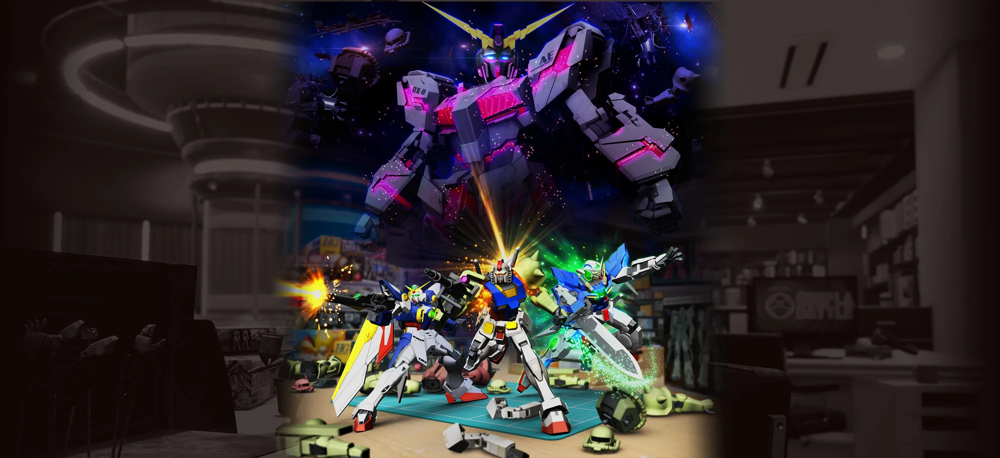
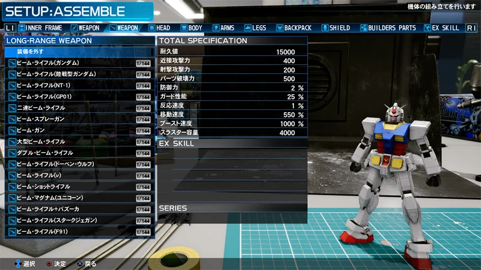
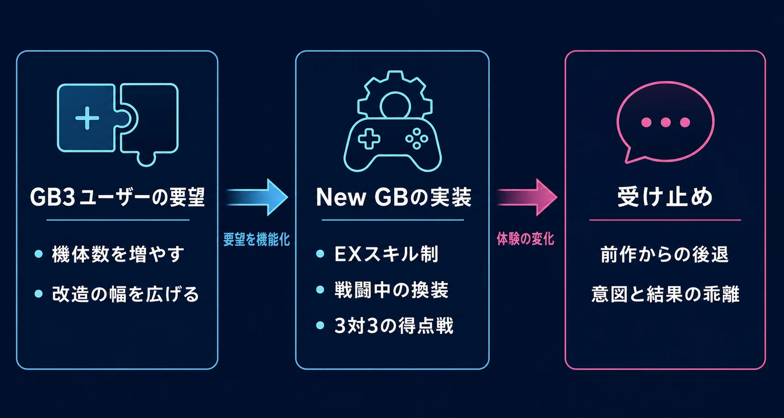
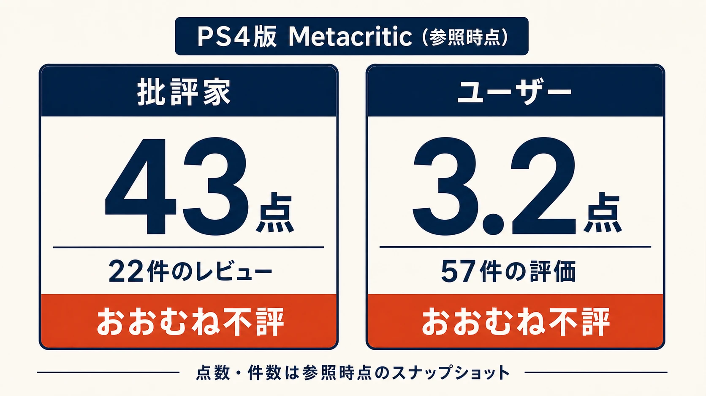
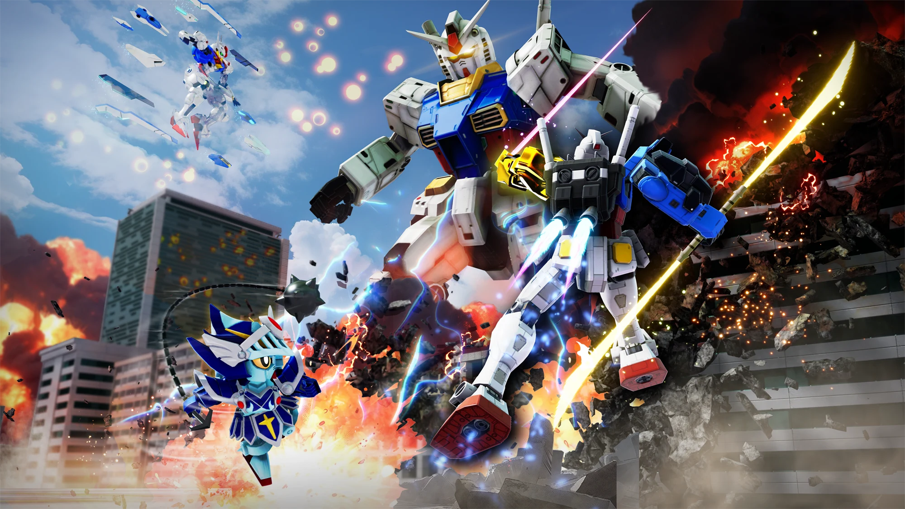

# 『New ガンダムブレイカー』は、なぜ「ユーザーの声に応える刷新」を前作からの後退にしてしまったのか

『New ガンダムブレイカー』は、クラフト＆マイスター開発、バンダイナムコエンターテインメント発売で2018年6月に登場した。ガンダムという大きなIPを使った作品ではあるが、本作を外部IPの版権ゲーム化として扱うのは正確ではない。自社シリーズ『ガンダムブレイカー』の4作目として、開発チームが積み上げてきた核を大きく作り替えた続編である。

本稿は「他メディアIPのゲーム化 成功・失敗事例シリーズ」の第6弾にして最終回の失敗事例として、本作を扱う。結論を先に述べると、これは開発陣がユーザーフィードバックを無視した失敗ではない。むしろ、登場機体の増加とカスタマイズの拡張という要望に応え、世界市場へ広げるため、3対3のチームバトルと戦闘中の換装を導入した。その明確な意図が、既存ユーザーにとっては「自分の機体を作り、使い込み、協力して戦う」体験を弱めたものとして受け取られた、 **意図と結果の乖離** 型の失敗である。

『Marvel's Avengers』が大型スタジオとライブサービス型ビジネスモデルの座組みの問題、『ロード・オブ・ザ・リング：ゴラム』がスタジオの適性、ライセンス上の判断、技術的実行力が重なった問題だったのに対し、本作の焦点は異なる。同じシリーズの続編が、顧客の要望へ答えようとして中核ループの優先順位を変え、その変化を体験価値として成立させられなかった問題である。

*画像出典（引用）：バンダイナムコエンターテインメント「[New ガンダムブレイカー 公式サイト](https://gb.ggame.jp/2018/)」トップページ。本作がガンプラを組み替えて戦う作品であることを示す資料として引用。©創通・サンライズ、©創通・サンライズ・MBS、©創通・サンライズ・テレビ東京。WebP変換。*

## エグゼクティブサマリー

- 『ガンダムブレイカー』の独自性は、モビルスーツ同士の勝敗を競うこと自体ではなく、敵を壊して得たガンプラパーツを集め、自由に組み替えた「俺ガンプラ」で戦う循環にある。
- 2013年の第1作から『ガンダムブレイカー3』まで、薄井宏太郎氏と福川大輔氏はシリーズ中核として開発に携わった。『New ガンダムブレイカー』は、旧作を知らない世界市場も視野に入れた刷新作として企画された。[[1](#ref-1)]
- 3対3の得点競争、パーツごとのEXスキル、戦闘中にパーツを奪い換装するリアルタイムカスタマイズバトルは、機体数とカスタマイズ幅を求める声への回答だった。しかし、部位脱落と再収集、競争用に制限された戦闘設計、操作・カメラ・性能の問題が、作った機体を使う快感を損ねたと批評された。[[2](#ref-2)] [[3](#ref-3)]
- 発売後、公式は入力応答、カメラ、ロックオン、部位脱落、ユーザビリティ、パラメータへの調整を告知した。これは評価の原因を一つに断定する材料ではないが、プレイヤーが触れる基本循環に修正対象が集中していた事実を示す。[[4](#ref-4)]
- プランナーは「要望を機能へ変換したか」だけでなく、その機能が既存の中核行為の頻度、可逆性、達成感をどう変えるかを、前作経験者を含む垂直スライスで検証する必要がある。

***

## まず押さえたい：『ガンダムブレイカー』は対戦格闘型のガンダムゲームではない

ガンダムゲームには、原作のモビルスーツを操作して対戦する作品、戦場で部隊を指揮する作品、物語を追う作品などがある。対戦格闘型の「ガンダムvs.」シリーズでは、選んだ機体の武装、コスト、立ち回りを理解し、対戦相手との駆け引きで勝敗を競うことが中心になる。

『ガンダムブレイカー』の出発点は異なる。ガンプラをモチーフに、敵の頭、胴、腕、脚、バックパック、武器、盾を壊して集め、異なる機体の部位を組み合わせて、自分だけの「俺ガンプラ」を作るアクションゲームである。第1作の公式説明も、敵の部位を破壊してパーツを集め、異なるガンプラの組み合わせ、塗装、汚し処理まで行うことを特徴としていた。[[5](#ref-5)]

ここでの戦闘は、カスタマイズ画面へ戻るための単なる報酬供給ではない。どの敵を壊すか、得たパーツを次のミッションでどう試すか、外見と性能をどう両立させるかが連続している。完成済みのモビルスーツの最適解を競うのではなく、「壊す」「集める」「創る」「使う」を往復することがシリーズの核である。公式も後年、このシリーズをガンプラをモチーフとしたアクションゲームとして位置づけている。[[6](#ref-6)]

この前提がないまま本作を「3対3のガンダム対戦ゲーム」とだけ読むと、失敗の輪郭を取り違える。競争要素そのものが問題なのではない。競争の最中に何を失い、何を得る設計にしたかが、俺ガンプラを作る動機と衝突したのである。

*画像出典（引用）：バンダイナムコエンターテインメント「[New ガンダムブレイカー｜ガンプラカスタマイズ](https://gb.ggame.jp/2018/system/customize.php)」。部位・武器を選び、作った機体を使う循環を説明する資料として引用。©創通・サンライズ、©創通・サンライズ・MBS、©創通・サンライズ・テレビ東京。WebP変換。*

***

## GB1からGB3まで：短い間隔で積み上げたシリーズの約束

第1作『ガンダムブレイカー』は2013年6月27日に発売された。[[5](#ref-5)] 続く『ガンダムブレイカー2』は2014年12月18日、[[7](#ref-7)] 『ガンダムブレイカー3』は2016年3月3日に発売され、カスタマイズと共闘を軸にシリーズが続いた。[[8](#ref-8)] 2018年2月の開発者インタビューで薄井宏太郎氏は、2013年発売の第1作から5年目で4作というペースだと説明している。[[1](#ref-1)]

この連続性で重要なのは、薄井氏がバンダイナムコエンターテインメントのプロデューサー、福川大輔氏がクラフト＆マイスターのディレクターとして、第1作から制作チームの中核を担っていたことである。[[1](#ref-1)] つまり『New ガンダムブレイカー』を、前作の良さを知らない別チームが偶然に作った作品として説明することはできない。旧作の到達点とユーザーの声を知る立場から、意図的にルールを更新した。

特に『ガンダムブレイカー3』は、カスタマイズの厚みをシリーズの魅力として明示した。発売前の公式情報は、150機を超える参戦機体と、頭・胴・腕・脚・バックパックの組み合わせによる大きな組み合わせ数、パーツ強化の「合成」、作った機体を投稿する機能を紹介している。[[9](#ref-9)] ファミ通のレビューでも、EXアクション、ステップ、ブーストを使ったアクションのテンポと、性能の異なる膨大なパーツを集めることの中毒性が評価された。[[10](#ref-10)]

ここから読み取れるのは、GB3が無欠点だったということではない。少なくともシリーズの顧客は、「好みの外観に近づけた機体を保持し、育て、次の戦いで試す」というループの上に、多数の機体とカスタマイズを求めていたということである。続編の設計では、この既存の約束を壊さず広げることが出発条件だった。

***

## 「4」ではなく「New」：世界展開とゲーム性刷新を一つの作品に載せた

『ガンダムブレイカー4』ではなく『New ガンダムブレイカー』と名付けた理由について、薄井氏はアジアでの人気に加え、今回は欧米を含む世界へ売り出す考えがあると説明した。これが名称に込めた「New」の一つ目の意味である。[[1](#ref-1)] 実際、RPG Siteは本作をシリーズ初のグローバル発売として紹介している。[[11](#ref-11)]

もう一つの意味は遊び方の大幅な変更である。福川氏は、従来作がひとりプレイを主に、そこへ友人が参加する形だったのに対し、本作では最大6人が参加する3対3のチームバトルを可能にしたと語った。薄井氏は、他のガンダムゲームの対戦を連想させるものではなく、提示されるお題を達成してチーム得点を競う「運動会のような」ものだと説明している。[[1](#ref-1)]

ここで企画は二つの挑戦を同時に抱えた。第一に、国内で積み上げたシリーズを、旧作未経験の世界市場へ伝えること。第二に、旧作ユーザーの協力アクションを、目標達成型の3対3競争へ再構成することだ。どちらも単独なら成立し得る判断である。しかし同時に行うと、初めて触る顧客にはルール理解の負荷が、既存顧客には自分が好きだった体験を失う不安が生まれる。したがって、変更後の一戦目で「なぜこの形式で俺ガンプラを作るのか」を直感的に示す必要があった。

***

## 要望をどう機能へ変えたか：3対3、EXスキル、戦闘中の換装

開発陣の説明は、変更の起点を明確にしている。福川氏はGB3のユーザーから、登場機体を増やしてほしい、カスタマイズの幅を増やしてほしいという声が多かったと述べた。その回答として、パーツごとにEXスキルを紐付け、複数の候補からミッションへ持ち込むスキルを選ぶ方式を説明している。[[1](#ref-1)] パーツは見た目や基礎性能だけでなく、戦闘中に使える能力を規定する選択肢になった。

もう一つの中核がリアルタイムカスタマイズバトルである。前作までは、バトルで得たパーツを終了後のカスタマイズ画面で組み替えた。本作では、戦闘中に敵から得たパーツをその場で換装できる。公式はこの変更を、欲しいパーツをその場で装着できる新要素として紹介した。[[2](#ref-2)] 薄井氏は、強敵のパーツを外して自分に換装すれば、相手の弱体化と自分の強化を同時に行え、パーツとEXスキルの奪い合いが白熱すると説明している。[[1](#ref-1)]

3対3のチームバトルでは、制限時間内に目標を達成してより多くの得点を取った側が勝つ。公式説明では、ストーリーを一人で遊べることに加え、3対3のチーム対抗共闘バトルを可能にした。[[2](#ref-2)] これは単純な撃破数競争ではない。コンテナの破壊、第三勢力の撃破、特定の敵の撃破などを並行して処理し、チームで役割を分ける設計だった。[[1](#ref-1)]

設計意図を分解すれば筋は通っている。

- パーツごとのEXスキルは、増えた機体とパーツに戦術的な意味を持たせる。
- 戦闘中の換装は、パーツ収集をミッション後の報酬だけでなく、目の前の駆け引きへ変える。
- 3対3の得点競争は、パーツの奪取と目標の分担に対人・協力の緊張感を与える。

問題は、個々の機能が理屈として正しいかではない。それらを同時に導入した結果、「事前に作った俺ガンプラを、狙った操作感で戦わせる」時間よりも、「失った部位を補い、得点目標へ追随する」時間が前面に出たことである。戦闘中に見た目も性能も変わることは、即興の面白さになり得る。しかし、顧客が愛着を持って作った機体を保持し、その機体の構成を使いこなす楽しさとは、常に両立するわけではない。

***

## 発売時の評価：良いカスタマイズを、戦闘と品質が支え切れなかった

MetacriticのPS4版集計は、批評家22件に基づく43点、ユーザー評価57件に基づく3.2点で、いずれも「おおむね不評」の区分である。集計値と件数は後から変動し得るため、本稿で示すのは参照時点のスナップショットである。[[12](#ref-12)] 点数だけで失敗の理由は分からないため、批評の内容を、ミッション、物語、基本操作と性能、前作との比較に分けて見る必要がある。

### ミッション：目標の多さが、反復の厚みにはならなかった

RPG Siteは、ほぼすべてのステージが3対3のG-Cubeマッチで、コンテナ破壊、第三勢力の撃破、特定敵の撃破、相手チームの全滅といった目標に得点が付く構造だと記した。[[11](#ref-11)] これは開発陣が語った役割分担の実装でもある。一方、同レビューは、競争形式へ寄せたことで、シリーズが本来目指した自由な創作が制限されたと批評した。ストーリーミッションの協力プレイができず、オンラインは3対3の一形式に限られたことも指摘している。[[11](#ref-11)]

Shacknewsも、カスタムした機体を作る点は評価しつつ、変化に乏しい反復的な戦闘、遅い操作、オンラインのマッチング問題を短所に挙げた。[[13](#ref-13)] ミッションの目的が複数あることと、プレイヤーが異なるビルドを何度も試したくなることは別である。目的達成のために機体の維持や収集の自由が後景へ退くなら、目標の種類を足しても、シリーズの主目的だった創作と実戦の往復は厚くならない。

### 物語：学園設定は、戦闘へ戻る理由を強くできなかった

本作は、ガンプラバトルを扱う学園を舞台にしたストーリーモードを用意した。開発側は、キャラクター数や台詞量が従来作より多いと説明していた。[[1](#ref-1)] しかしRPG Siteは、分岐する各ルートが概ね同じステージを繰り返し、人物像も定型的だと批評した。[[11](#ref-11)] Metacriticに収録されたレビューにも、物語が薄い、あるいは陳腐だという評価が並ぶ。[[12](#ref-12)]

これは学園ものを選んだこと自体の成否ではない。カスタマイズと戦闘の反復を支えるストーリーは、キャラクター数や分岐数だけで成立しない。各ミッションで試した機体や戦い方が、関係性、目標、次のビルド選択へどのように返ってくるかが必要になる。本作では、物語の追加が、競争型バトルへ繰り返し戻る動機を十分に補強しなかったと受け取られた。

### 操作と性能：中核行為の信用を、発売後の修正が追いかけた

Push Squareは、操作への応答の悪さ、PS4 Proでも戦闘中に生じるフレームレート変動と数秒単位の停止、オンラインでの問題を報告した。[[3](#ref-3)] RPG Siteも、通常のPS4版での頻繁な停止、低いフレームレート、入力遅延、カメラとロックオンの問題を具体的に記している。[[11](#ref-11)] これらは各媒体のレビュー環境における記録であり、全利用者の発生率を示す統計ではない。しかし、アクションゲームで入力、視認、対象選択が不安定なら、リアルタイムにパーツを奪い、換装し、目標へ向かう設計そのものを評価する土台が崩れる。

発売後の公式告知は、この受け止めを補強する。2018年6月には、動作やボタン入力の応答、カメラとロックオン、第三勢力から受けるパーツの外れ、アセンブル時のソート、パラメータ、マルチプレイの取得パーツ共有などを改善対象として示した。[[4](#ref-4)] 7月と9月の更新では、入力受付、ロックオン、第三勢力のAI、部位脱落、ソート、動作安定性、経験値共有などが実際に調整された。[[4](#ref-4)]

この事実から、発売時点の全問題がパッチで解決した、あるいは解決しなかったとは断定できない。ただし、調整対象がゲームの周辺ではなく、入力、カメラ、ロックオン、部位脱落、収集、アセンブルといった中核循環に集中していたことは重要である。刷新作では、新しいルールを理解させる前に、そのルールへ触れる手触りを安定させなければならない。

### 前作からの後退として読まれた理由

批評の厳しさは、単独のバグ報告だけでは説明できない。RPG SiteはGB3由来の詳細なカスタマイズ画面やビルダーズパーツを長所として認めながら、競争型の枠組みが自由な創作を損ねたと評価した。[[11](#ref-11)] Push Squareも、GB3が持っていた「壊す、集める、強化する」という基礎ループを土台にせず、重要な要素を入れ替えたことを問題視した。[[3](#ref-3)] Metacriticのユーザーレビューにも、カスタマイズ自体を長所としつつ、戦闘、物語、戦闘中の換装がGB3の良さを損ねたという意見が見られる。[[12](#ref-12)]

ここで「前作の利便性・バランス調整が失われた」という評価は、開発者の意図を否定するものではない。パーツにEXスキルを結び、戦闘中に構成を変えさせると、全パーツを一つの安定したビルドとして育てるより、局面ごとに拾えた選択肢へ適応する比重が上がる。部位脱落の頻度、拾得物の判別、ロックオン、移動と入力の安定性は、その適応を面白さにできるかを左右する。そこでつまずけば、新機能は拡張ではなく、既存の快適さと自分の機体への愛着を奪う制約として感じられる。

***

## プランナーへの示唆：要望を「追加機能」に翻訳する前に、体験の保存条件を決める

本作から学べるのは、前作ユーザーの意見をそのまま採用してはいけないということではない。むしろ逆である。機体を増やす、カスタマイズを広げるという要望は、機能一覧ではなく、既存ユーザーが何を楽しいと感じていたかという体験の言葉へ戻して解釈する必要がある。

### 1. 要望の名詞ではなく、その背後の行為を特定する

「登場機体を増やしてほしい」という要望には、好きな機体を見たいという意味もあれば、欲しい部位を手に入れて自分の構成に組み込みたいという意味もある。「カスタマイズ幅を広げてほしい」も、装備ごとの戦術を増やしたいのか、外見の自由度を求めているのか、作った構成を長く使いたいのかで、実装は変わる。

本作はパーツごとのEXスキルと戦闘中換装で、選択肢を戦闘に持ち込んだ。しかし、この翻訳は「作った機体を保持して戦わせる」時間を短くする危険も持つ。要望を受ける時点で、次のような問いを置きたい。

| 要望の表面 | 背後にある可能性 | 試作で確認すること |
| --- | --- | --- |
| 機体を増やしてほしい | 好きな部位を集め、使い続けたい | 入手後、狙った部位を自分の構成で使える時間は増えるか |
| カスタマイズを広げてほしい | 見た目と性能の両方で個性を出したい | 外見優先の構成でも、戦闘で十分に役割を持てるか |
| 共闘を強くしてほしい | 仲間と異なる役割を試したい | 協力が、構成を壊す圧力でなく構成を見せる機会になるか |

表の答えは一つではない。だが、これを機能実装の後ではなく、3対3の一試合を作った段階で確かめれば、「幅を増やしたのに自由が減った」と感じる問題を早く見つけられる。

### 2. 中核ビルドを壊す変更には、可逆性を用意する

リアルタイムカスタマイズバトルは、敵の装備を奪う興奮と即興性を生む。一方で、プレイヤーが事前に作った俺ガンプラを試す場では、頻繁な部位脱落と換装の強制が、愛着と戦略の両方を損なう。ここでは「変化させるか、させないか」の二択ではなく、可逆性をどう設計するかが重要になる。

例えば、壊された部位を短時間で復元できる、失ったパーツと拾得パーツを明確に区別できる、事前ビルドを保護するモードを持つ、即興換装が得意なルールと育成ビルドを試すルールを分ける、といった選択肢がある。どの解法を取るにせよ、変更が「新しい判断を増やす」のか、「作った判断を無効にする」のかを、プレイログと観察で分けて測るべきである。

本作の発売後に部位脱落、ロックオン、取得物共有、アセンブルのソートが調整されたことは、可逆性と可読性を発売後の改善事項として扱う難しさを示す。[[4](#ref-4)] 戦闘中に構成が変わる作品ほど、変化の原因、失ったもの、取り戻す方法を即座に分からせる必要がある。

### 3. 競争形式を足すなら、既存の協力ループと別々に評価する

3対3の得点競争は、目標分担と相手への妨害を生む。これは協力アクションに新しい緊張感を加える設計になり得る。ただし、対戦・競争が成立するための公平性と、カスタマイズ収集が成立するための自由度は、同じ方向へ働かないことがある。公平なルールは性能差や取得物の偏りを抑えたくなる。一方、収集とビルドは、偏りや組み合わせの発見に価値を持たせたい。

したがって、競争形式を入れる企画では、少なくとも次の二種類のテストを分ける必要がある。

- **競争のテスト：** 初見でも目標、得点、チームの役割を理解できるか。勝敗に操作、判断、連携がどの程度寄与したか。
- **ビルドのテスト：** 一試合後に、プレイヤーが自分の構成を試したいと思うか。拾得・脱落・換装が、次の創作意欲を増やしたか、減らしたか。

両方の結果が良いときだけ、新しい競争形式はシリーズの核を拡張する。競争だけが面白くても、カスタマイズの主役を置き換えてしまうなら、それは別の作品として扱い、名称、導線、モード構成、期待値の伝え方まで分ける判断が必要になる。

### 4. グローバル展開では、刷新の説明より最初の一戦の理解を優先する

世界市場へ展開する作品では、旧作を遊んだ顧客と、シリーズを知らない顧客が同じ入口に立つ。前者は「何が残ったか」を確かめ、後者は「何をするゲームか」を学ぶ。本作は、ガンプラを作るシリーズらしさと、3対3で目標を処理するルールを一度に伝える必要があった。

この場合、名称やインタビューで刷新を説明するだけでは足りない。最初の一戦で、作った俺ガンプラがどのように役立ち、パーツを奪うことがなぜ楽しく、得点目標が何を促すのかを、操作と画面表示だけで理解できる必要がある。入力遅延、カメラ、ロックオン、UIの可読性はローカライズ後の磨き込みではなく、その理解を成立させる企画要件である。

***

## その後：次作は「New」ではなく『ガンダムブレイカー4』になった

『New ガンダムブレイカー』の発売は2018年6月である。[[4](#ref-4)] 「New」を冠する発売作はこの1作にとどまり、その6年後に公開された家庭用シリーズの後継作は『ガンダムブレイカー4』だった。バンダイナムコエンターテインメントの公式サイトは、『ガンダムブレイカー4』を2024年8月29日発売の「創壊共闘アクション」とし、自分だけの俺ガンプラを組んで戦うシリーズとして紹介している。[[6](#ref-6)]

この仕切り直しを「New」という名称だけが失敗の原因だったという証拠にしてはならない。公開資料から、名称決定の内部経緯や『New ガンダムブレイカー』との因果関係までは分からないからである。ただし、4作目相当の位置づけにあった2018年作の後、次の家庭用作がナンバリングの『4』として戻った事実は、シリーズの見せ方と中核の再提示を考える上で象徴的である。

*画像出典（引用）：バンダイナムコエンターテインメント「[ガンダムブレイカー4 公式サイト](https://gb.ggame.jp/2024/)」トップページ。仕切り直し後のシリーズの姿を示す資料として引用。©創通・サンライズ、©創通・サンライズ・MBS。WebP変換。*

***

## おわりに：IPの知名度ではなく、約束した行為を守れるか

全6作の成功・失敗事例を通じて見えてくるのは、IP・自社シリーズのゲーム化で成否を分けるのは原作の知名度や機能数ではなく、プレイヤーへ約束した中核行為を、開発体制、ルール、品質、発売後の運用まで一貫して守れるかという点である。

『New ガンダムブレイカー』は、シリーズの外へ広げ、ユーザーの要望にも応えようとした。だが、パーツを増やし、戦闘中の選択を増やすことは、自動的に「俺ガンプラを作って戦う」喜びを増やさない。続編で刷新を行うとき、最初に守るべきなのは前作の機能一覧ではない。顧客が何度も戻ってきた、作る、試す、勝つという感情の循環である。

## References

1. [『New ガンダムブレイカー』タイトルの“New”に込めた意味とは？ プロデューサー＆ディレクターインタビュー][1] - 薄井宏太郎氏・福川大輔氏の役職、第1作からの参加、シリーズ年表、「New」の名称、世界展開、3対3、ユーザー要望、EXスキル、リアルタイムカスタマイズバトルについての開発者インタビュー。

2. [New ガンダムブレイカー｜ABOUT][2] - ガンプラをモチーフとするシリーズの説明、戦闘中の換装、3対3のチーム対抗共闘バトルを示す公式ページ。

3. [New Gundam Breaker Review (PS4)][3] - PS4 Proを含むレビュー環境での操作応答、フレームレート、停止、オンライン、前作との比較を記した批評。

4. [PlayStation®4『New ガンダムブレイカー』今後のアップデートによる追加・向上予定内容][4] - 発売後に告知・実施された入力応答、カメラ、ロックオン、部位脱落、ソート、マルチプレイ、パラメータ、動作安定性への調整。

5. [ガンダムブレイカー [PS3]][5] - 2013年6月27日発売の第1作と、部位破壊、パーツ収集、異なるガンプラの組み合わせ、塗装・汚し処理によるカスタマイズを紹介する公式情報。

6. [ガンダムブレイカー4｜バンダイナムコエンターテインメント公式サイト][6] - ガンプラをモチーフにしたシリーズの説明、および『ガンダムブレイカー4』の2024年8月29日発売情報。

7. [ガンダムブレイカー2｜バンダイナムコゲームス公式サイト][7] - 『ガンダムブレイカー2』の2014年12月18日発売情報。

8. [ガンダムブレイカー3｜バンダイナムコエンターテインメント][8] - 『ガンダムブレイカー3』の2016年3月3日発売情報。

9. [PS4/PS Vita「ガンダムブレイカー3」新機体続々参戦！カスタマイズがさらに進化！][9] - 『ガンダムブレイカー3』の参戦機体数、パーツ組み合わせ、合成、投稿機能を紹介する公式情報。

10. [ガンダムブレイカー3（PS Vita）のレビュー・評価・感想][10] - 『ガンダムブレイカー3』のアクションのテンポ、EXアクション、パーツ収集へのファミ通レビュー。

11. [New Gundam Breaker Review][11] - 3対3のG-Cube、ミッション構造、カスタマイズ、ストーリー、競争形式への移行、技術的問題を扱ったレビュー。

12. [New Gundam Breaker Reviews][12] - PS4版のMetascore 43／批評家22件、ユーザースコア3.2／57件、および収録レビュー。

13. [New Gundam Breaker Review: Falling to Pieces][13] - カスタマイズ、反復的な戦闘、操作、オンラインの問題を扱ったレビュー。

[1]: https://www.famitsu.com/news/201802/27152699.html
[2]: https://gb.ggame.jp/2018/sp/about/
[3]: https://www.pushsquare.com/reviews/ps4/new_gundam_breaker
[4]: https://gb.ggame.jp/2018/info/info_180619.php
[5]: https://www.gundam.info/product/game/product_game_20130627_1437p.html
[6]: https://gb.ggame.jp/2024/
[7]: https://gb.ggame.jp/2014/
[8]: https://gb.ggame.jp/2016/ms/
[9]: https://www.gundam.info/news/games/news_games_20160225_15004p.html
[10]: https://www.famitsu.com/game/title/33204/reviews
[11]: https://www.rpgsite.net/review/7394-new-gundam-breaker-review
[12]: https://www.metacritic.com/game/new-gundam-breaker/
[13]: https://www.shacknews.com/article/105954/new-gundam-breaker-review-falling-to-pieces

----

この文書は、Perplexity、Claude、OpenAI Codex の3つのAIの支援を受けて著述されたものです。引用画像を除き、MIT License にて提供されています。
