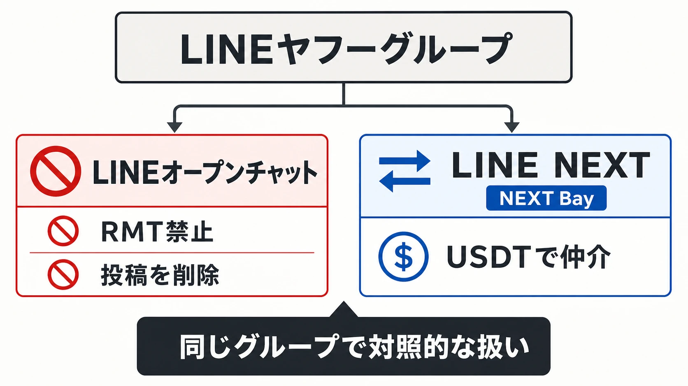
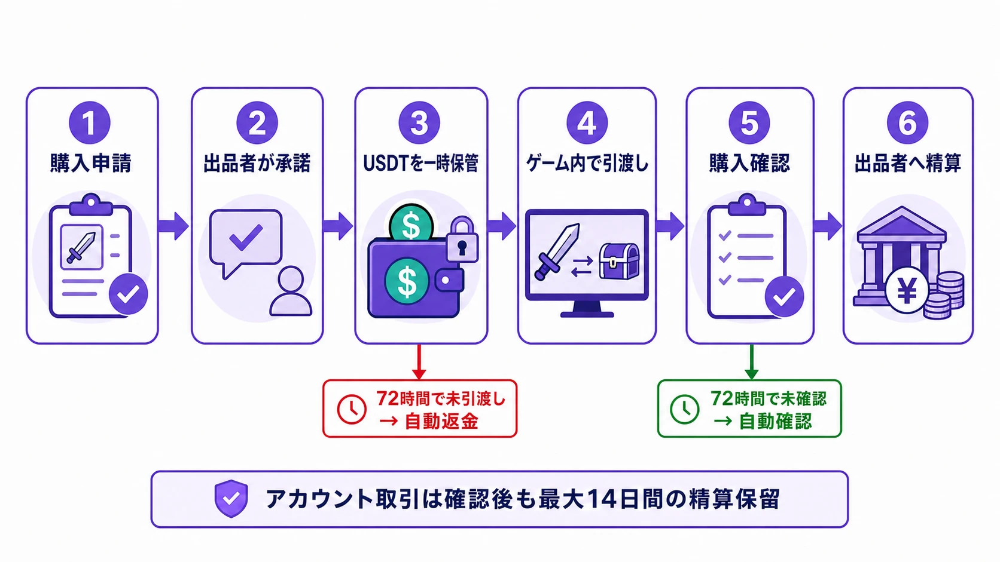
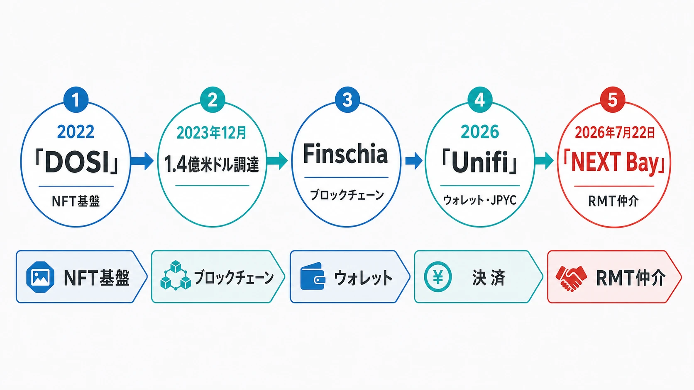

# NEXT Bayは日本のライブサービスに何を持ち込むか――LINE NEXTのUSDT建てRMT仲介を警戒する理由

日本語圏のライブサービスにとって、RMTは「好ましくない周辺行為」ではない。運営が設計した獲得速度、対戦・協力の公平性、アカウントの本人性、ゲーム内経済を、ゲーム外の金銭で直接買い替える行為である。多くのオンラインゲームが利用規約でRMTを禁じ、アカウント停止やアイテム没収を定めてきたのは、そのためである。[[1](#ref-1)]

2026年7月22日、LINEヤフー関連会社のLINE NEXTは、ゲーム内通貨・アイテム・アカウントを利用者同士で売買できるグローバル仲介サービス「NEXT Bay」を正式ローンチした。利用者はUnifiウォレットを通じ、USDT建てで支払い、ウォレット署名とプロトコル手数料の仕組みを介した一時保管（スマートコントラクトによるものとみられる）と取引チャットを使って引き渡し・精算を進める。これはRMTを見えにくい個人間取引のまま放置するのではなく、決済、保管、紛争処理、精算までを一つのサービスに載せる試みである。[[2](#ref-2)][[3](#ref-3)]

ここには、LINEヤフーグループ内での看過しがたいねじれがある。LINEヤフーが提供するLINEオープンチャットは、RMTを多くのゲーム会社の利用規約に反し、詐欺などの犯罪につながりやすい行為として禁止する。対して、同グループのLINE NEXTは、ゲーム内通貨・アイテム・アカウントの売買を、USDT決済、代金の一時保管、取引チャット、精算まで備えたサービスとして仲介する。両者は別サービスであり、オープンチャットの投稿規制がLINE NEXTの事業判断を直接拘束するわけではない。それでも、グループ内の一方がRMTを危険な規約違反として排除し、他方がその取引を成立しやすくする仕組みを提供する構図は、利用者とゲーム運営に整合したメッセージを示していない。[[1](#ref-1)][[2](#ref-2)][[3](#ref-3)][[4](#ref-4)][[5](#ref-5)]

大手インフラ事業者の系列企業が、日本のユーザーにこの導線を提供することは、日本のライブサービス運営に対する明確な脅威である。プランナーが不正取引を検知するだけでは足りない。パブリッシャー、法務、業界団体を通じて、掲載停止、権利者の意思を反映する仕組み、そして必要な規制の検討を求めるべき段階に来ている。

本稿は、NEXT Bayの法的な適法性を断定するものではない。公開情報から分かる仕組みと、規約でRMTを禁じるゲーム運営が取るべき対抗姿勢を整理するものである。

***

## 1. 脅威は、RMTを「取引サービス」に変えることにある

NEXT Bayは、出品者と購入者を結ぶC2C（利用者間）マーケットプレイスである。出品対象はゲーム内通貨、ゲームアイテム、アカウント（キャラクターを含む）の三類型で、ゲームごとに許可される類型は異なる。ローンチ時点でサイトのカタログには『リネージュ』『オーディン：発火天使のヴァルハラライジング』『Path of Exile』『Path of Exile 2』『アルビオンオンライン』『フリフ』『リネージュ2リボーン』のほか、『HYZE』『SealM on CROSS』『THE STARLIGHT』『LORDNINE』『R.O.H.A.N.2 Global』『Dragon Flight Web3』などのタイトルが表示されている。掲載タイトルや地域での可否は変動するが、ここで重要なのは、タイトルの通貨・アイテムだけでなく、アカウントそのものまで取引対象としている点である。[[3](#ref-3)]

取引は、購入希望、出品者の承諾、支払い、ゲーム内での引き渡し、購入確認、精算という順で進む。支払い後、出品者が72時間以内に引き渡さなければ自動取消・返金となる。引き渡し後は、購入者が確認するか、72時間が経過すると自動確認となり、出品者は精算を請求できる。[[3](#ref-3)]

**エスクロー** とは、売買の途中で代金を一時保管し、条件が満たされてから売り手へ渡す方法である。NEXT Bayの公式FAQは、ウォレット署名とプロトコル手数料という語でこの仕組みに言及しており、スマートコントラクトによる実装であることをうかがわせるが、「スマートコントラクト」という語そのものを明言しているわけではない。スマートコントラクトは、ブロックチェーン上であらかじめ定めた条件に従って処理を実行するプログラムである。[[3](#ref-3)]

代金を安全に預かる仕組みが整っていても、それはゲーム運営による取引の承認とは別の問題である。ゲーム内のアイテムが正当に取得されたものか、アカウント移転が利用規約に違反していないか、購入後に取り戻しが起きないかは、エスクローの外側にある問題である。取引チャット、期限、返金、精算保留まで整えた仲介は、RMTの危険を除くのではなく、取引を成立させる手間と不安を減らす。結果として、規約違反の売買へ参加する心理的・実務的な障壁を下げる。

従来のRMTは、外部掲示板、SNS、個別メッセージ、決済代行に分散し、詐欺の危険そのものが参入障壁になっていた。NEXT Bayが変えるのは、RMTの存在ではない。規約違反の行為を、検索、価格表示、出品、支払い、取引管理、紛争処理を備えた通常のEC体験へ近づけることである。この「制度化」こそが、運営にとって最も警戒すべき部分である。

***

## 2. 日本・韓国にだけUSDTを要求する意味

**ステーブルコイン** は、法定通貨などに価格を連動させる設計の暗号資産である。NEXT Bayで使うUSDT（Tether）は、米ドルと1対1での価値連動を目標とするドル建てステーブルコインである。利用者は支払い前にUSDTを入手し、ウォレットへ送付する必要がある。**ウォレット** は、暗号資産を受け取り、保有し、送付するためのソフトウェア上の口座に近い仕組みである。[[3](#ref-3)]

NEXT Bayは、Unifi PayによるUSDT支払いと、Payletterによる現金・カード支払いを掲げる。ただし後者は地域別であり、日本・韓国・その他の一部地域では、ローンチ時点でUSDT決済のみである。日本の利用者は、表示価格を円で参照できても、NEXT Bay内の支払いを円やカードで完結できない。USDTを用意してUnifiウォレットから支払う必要がある。[[3](#ref-3)]

日本・韓国でUSDT決済しか選べないことは、RMTの利用を思いとどまらせるとは限らない。むしろNEXT Bayは、RMTを利用するために暗号資産の取得と送金を覚えさせる導線になっている。カード決済に比べれば工程は多く、最初は参入障壁になる。ただし、ウォレット、USDT、取引プラットフォームを同じ系列のサービスとして結び付ければ、その障壁は段階的に下がる。ゲーム内の不自然な資産移転を追うだけでは、こうした外部サービスが広げる取引需要を抑えられない。

LINE NEXTは日本でUnifi miniを提供し、日本円連動型ステーブルコインJPYCをリワードとして受け取り保有できる環境も整えている。JPYCは円と価値を連動させる設計のステーブルコインである。にもかかわらずNEXT Bayは日本の利用者にUSDTだけを提供する。FAQは将来、JPYCを含む複数通貨建てステーブルコインでの決済・精算を追加すると予告するが、開始時点では予告にとどまる。日本円に近い入口を広げながら、RMTだけはドル建てのUSDTで先行させる構図である。[[6](#ref-6)][[7](#ref-7)][[3](#ref-3)]

プランナーは、このねじれを「暗号資産に詳しい一部の利用者だけの話」と見なしてはならない。USDT決済は、RMT市場を日本円から遠ざけるのではなく、円建てのゲームサービスとグローバルな暗号資産決済をつなぐ接続点になる。

***

## 3. Official Web Shopを混同してはならない

NEXT Bayには「Official Web Shop」も表示される。こちらはNEXT Market（LINE NEXT）がゲーム開発元の許諾を得て公式アイテムを取り扱う販売ページへの導線であり、利用者間のC2C取引とは別のレーンである。公式販売は開発元の許諾に基づく一次販売であり、RMT仲介は外部プラットフォームを介した利用者同士の売買である。[[2](#ref-2)][[3](#ref-3)]

両者を同じサービスの入口に置くことには、看過できないリスクがある。プレイヤーは「Official Web Shopがあるなら、隣のゲームアイテム・アカウント取引も運営公認ではないか」と受け取るかもしれない。実際には、Official Web Shopへの参加はC2C取引への同意ではない。RMTを禁じるタイトルの運営は、公式販売への掲載の有無と無関係に、C2Cカテゴリからの除外と、公式サービスではないことの明示を要求すべきである。

これはUI上の注記だけで済ませる問題ではない。自社タイトルを、規約に反する取引の検索結果、価格比較、出品ページ、広告素材に使わせないことが必要である。公式ショップの誘客と、外部RMTの流動性は、同じゲーム名を通じて相互に強化されうるからである。

***

## 4. 韓国のRMT史は、日本向け仲介の免罪符にならない

LINE NEXTの事業には韓国で育ったゲーム・Web3の系譜がある。その文脈で韓国のRMT史を参照することは必要だが、「韓国ではRMTが合法化されている」という説明を、日本での仲介提供の根拠にしてはならない。

韓国のゲーム産業振興法は、ゲーム利用で得た有形・無形の結果物について、換金、換金の仲介、買い戻しを業として行うことを禁じている。2007年の改正は、ゲーム場の景品券換金などを念頭に導入された。[[8](#ref-8)][[9](#ref-9)]

一方、一般オンラインゲームの通常利用で、時間や技能を投じて得たゲーム内通貨・アイテムには、施行令上の対象外となる範囲があり、韓国最高裁は2009年の『Lineage』のアデナを巡る事件で無罪とした原審を確定させた。[[10](#ref-10)]政府の生活法令情報も、一般オンラインゲームでは「非正常な利用」により得たゲームマネーを換金する場合を処罰対象と整理している。RMT売上への課税開始も2007年に報じられ、規制対象と例外、課税実務、民間仲介が並走する市場が形成された。[[11](#ref-11)][[12](#ref-12)]

この経緯は、韓国でのRMTが無条件に公認されていることを示さない。まして、日本のタイトルの利用規約を無効にしない。日本では、RMTを包括的に直接禁止する特別法はない一方、多くのゲームが利用規約で禁じ、アカウント停止、資格剥奪、アイテム没収などで対処してきた。アカウント売買を多くのオンラインゲームで規約違反とする東京都の注意喚起も、この運用を前提にしている。[[1](#ref-1)][[13](#ref-13)]

日本のパブリッシャーが優先すべきなのは、韓国でRMTをめぐる規制や取引慣行がどうなっているかではない。自社の利用規約を守り、ゲーム内経済とプレイヤー間の公平性を維持することである。韓国の判例や市場の経緯は背景の理解には役立つが、日本向けに規約違反の売買を仲介してよい理由にはならない。

***

## 5. NFT、Finschia、Unifiの延長にRMTが置かれている

NEXT Bayは、LINE NEXTが突如RMTへ参入した出来事ではない。同社はDOSIをグローバルNFTプラットフォームとして展開し、2023年12月にはCrescendo Equity Partners主導のコンソーシアムから1億4,000万米ドルを調達した。公式発表では、DOSIでデジタル商品を取引し、Finschiaパブリックブロックチェーン上でWeb3サービスを構築する構想が示されていた。[[14](#ref-14)]

2026年のUnifiは、Dapp PortalとMini Dappsを統合し、預け入れ、送金、決済、リワードを一つのサービスに束ねる自己管理型ウォレットとして位置付けられた。NEXT Bayはこの上に、ゲーム内で得た資産の二次取引、代金の一時保管、精算を載せたものと捉えるべきである。NFTでデジタル商品を取引し、ブロックチェーン基盤とウォレットで資産移転を扱い、ステーブルコインで価格と決済をつなぐ。その一連の導線の先に、規約で禁じられがちなゲーム資産の売買がある。[[6](#ref-6)][[14](#ref-14)]

この構造は、ゲーム開発元が明示的に参加しなくても成立する。ゲーム内に譲渡可能な通貨、アイテム、アカウントがあり、利用者同士が引き渡せるなら、外部サービスはその周辺に市場を作れる。プランナーが問うべきことは、自社がWeb3ゲームかどうかではない。ゲーム内メール、プレイヤー間取引、キャラクター名変更、アカウント回復が、外部仲介の実行可能性をどこまで高めるかである。

***

## 6. 金融規制の論点は、仲介の正当化ではなく監督の入口である

NEXT Bayは、ウォレット署名とプロトコル手数料の仕組みを介して支払いを一時保管する構造を示しており、スマートコントラクトによるものとみられる。Unifiは自己管理型ウォレットを掲げる。しかし、エスクローや自己管理型という言葉だけで、日本の金融規制上の問題が消えるわけではない。

資金決済法上、暗号資産の売買・交換、その媒介・取次ぎ・代理、これらに関する利用者の金銭の管理、他人のための暗号資産の管理は、暗号資産交換業の対象となりうる。金融庁は、利用者の関与なく移転できる秘密鍵を保有するなど、他人の暗号資産を主体的に移転させ得る状態で管理するカストディ業務には、原則として登録が必要だと説明する。銀行以外が為替取引を業として行う場合には、別途、資金移動業の登録が問題になる。[[15](#ref-15)][[16](#ref-16)]

公開情報では、NEXT Bayはウォレット署名とプロトコル手数料を使い、支払いを一時保管して取引確認後に精算する仕組みを示している。スマートコントラクトによるものとみられるが、公式FAQはこの語を明言していない。Unifiは自己管理型ウォレットとして提供される。また、金融庁の公開する暗号資産交換業者登録一覧では、2026年4月1日現在、LINE NEXT Inc.、Unifi、NEXT Bayの名称を確認できない。[[17](#ref-17)]

一方で、登録要否を判断するための重要な情報は公開されていない。たとえば、コントラクトを誰が管理するのか、秘密鍵や管理者権限を誰が持つのか、緊急停止や返金を誰が実行するのかは分からない。各取引でLINE NEXTまたは委託先が利用者資産を「他人のために管理」する状態に当たるか、日本向けのUSDT取得・換金、決済・精算をどの事業者が担うかも明らかではない。

公開情報だけで「無登録営業である」あるいは「登録不要である」と結論付けることはできない。登録要否は、誰がどの国で何を提供し、利用者資産を誰がどの権限で動かせるかという具体的な事実関係による。

しかし、この不確実さは運営側が沈黙する理由ではない。むしろ、国内ユーザーへUSDT建てのRMT仲介を提供する事業として、利用者保護、本人確認、マネーロンダリング対策、苦情処理、資産管理の責任分担を当局が確認できる状態にすべき理由である。パブリッシャーと業界団体は、金融庁を含む関係当局に、サービス実態に即した監督と情報開示を求めるべきである。

***

## 7. プランナーの対策を、パブリッシャーの要求へつなげる

プランナーが直ちに行うべき対策はある。RMT禁止条項を、アイテム、ゲーム内通貨、アカウント、代行、取引の勧誘まで明確にする。大口贈与、短時間の中継、異常価格、アカウント移転後の資産移動を検知し、凍結・ロールバック・異議申立ての手順を分ける。アカウント売買後の取り戻しに対しては、本人確認情報の変更、二要素認証の再設定、サポートによる回復基準を見直す。

だが、それだけでは後追いである。外部マーケットプレイスが取引の発見、支払い、紛争処理を担う以上、権利者はプラットフォーム側にも明確に要求を出すべきである。

| 働きかける相手 | 求めるべき対応 |
| --- | --- |
| **NEXT Bayなど仲介サービス** | RMT禁止タイトルの掲載・出品・検索・広告からの除外、権利者通知に基づく迅速な削除、同一タイトルの再掲載防止、アカウント取引の一律停止、取引ログ・削除件数の透明性。 |
| **自社の上長・パブリッシャー・法務** | 個別の通報対応で終わらせず、正式な削除要求、商標・著作物の不正利用への対応、海外事業者を含む窓口の整備、制裁事例の公表を判断する体制。 |
| **業界団体** | 「権利者が禁止するゲーム資産を仲介しない」という共通原則、掲載前の権利確認、削除要請への期限、再掲載対策、アカウント売買の扱いを含む自主規制基準。 |
| **関係当局・立法府** | 暗号資産を使うゲーム資産仲介の資産管理・本人確認・消費者保護を検証し、権利者の明示的な禁止を無視して国内利用者へ仲介を続ける事業をどう扱うか、必要な制度整備を検討すること。 |

ここで求めるべきなのは、ゲーム内の利用者間取引そのものを一律に禁じる規制ではない。各ゲームの権利者が、利用規約で明示的に禁止したRMTを、外部プラットフォームが「安全な取引」として組織的に促進できないようにする枠組みである。少なくとも、権利者の削除要求を受け付けない、または同じタイトルを繰り返し再掲載する仲介サービスを、通常の中立的な掲示板と同列に扱ってはならない。

日本のライブサービスは、長年、RMTを規約違反として処理してきた。その前提を守るためには、個々の不正利用者のBANだけでなく、BANされるべき行為を流通商品へ変えるインフラにも対処する必要がある。上長やパブリッシャーを通じた正式な警戒、業界団体による共同要求、関係当局への規制・監督の働きかけは、過剰反応ではない。ライブサービスの契約と経済を守るための正当な防衛である。

## References

1. [ゲームアイテムを売買する行為（リアルマネートレード）は禁止です][1] - RMTの定義と、多くのタイトルが利用規約で禁止することの説明。

2. [LINE NEXT、グローバルゲームアイテム取引プラットフォーム「NEXT Bay」をグローバルでローンチ][2] - ローンチ日、Unifi連携、エスクロー、Official Web Shopの概要。

3. [NEXT Bay][3] - C2C取引の対象、エスクローの手順、地域別の決済方法、対応タイトル、将来の通貨対応に関する公式FAQ・サービス画面。

4. [サービス｜LINEヤフー株式会社][4] - LINEヤフーが提供するサービスにLINEオープンチャットが含まれること。

5. [共同利用の対象となるグループ会社一覧][5] - LINEヤフーのグループ会社一覧にLINE NEXT Corporationが含まれること。

6. [LINE NEXT Launches Stablecoin Platform ‘Unifi’ Globally][6] - Unifiの自己管理型ウォレット構造、USDT対応、Dapp Portal・Mini Dapps統合。

7. [LINE NEXT、LINEアプリ上で使えるミニアプリ版「Unifi mini」を日本で提供開始][7] - Unifi miniの日本提供とJPYCリワード対応。

8. [ゲーム産業振興に関する法律 第32条][8] - 韓国のゲーム結果物の換金・仲介・再買入に関する規定。

9. [ゲーム場の商品券換金、景品提供を禁止][9] - 2007年改正の背景と、オンラインゲームの扱いを別途検討していた当時の韓国文化観光部発表。

10. [대법, 리니지 게임머니 '정당한 결과물' 판결][10] - 韓国最高裁が2009年に『Lineage』のアデナを巡るRMT事件について無罪の原審を確定させた経緯を報じるオーマイニュースの記事。

11. [オンラインゲーム中に集めたゲームマネーを現金に換金すると処罰されますか][11] - 通常利用と非正常な利用で得たゲームマネーを区別する韓国の生活法令情報。

12. [アジアITビジネス研究会、韓国の最新RMT事情を報告][12] - 2007年のRMT売上課税開始に関する当時の報道。

13. [オンラインゲームのアカウント売買をめぐるトラブル][13] - アカウント売買が多くのオンラインゲームで規約違反とされる東京都の注意喚起。

14. [LINE NEXT Raises USD140 Million to Expand Web3 Ecosystem][14] - DOSI、1億4,000万米ドルの資金調達、Finschia上でのサービス構想。

15. [アクセスFSA 第201号][15] - 暗号資産交換業におけるカストディと登録に関する金融庁の説明。

16. [金融審議会「暗号資産制度に関するワーキング・グループ」（第1回）議事録][16] - 暗号資産交換業、利用者資産管理、仲介業の対象行為に関する説明。

17. [暗号資産交換業者登録一覧][17] - 金融庁が公開する登録事業者一覧（2026年4月1日現在）。

[1]: https://openchat-jp.line.me/monitoring/warning/rmt_guideline_2s8cjW58
[2]: https://prtimes.jp/main/html/rd/p/000000031.000145432.html
[3]: https://www.nextbay.games/ja
[4]: https://www.lycorp.co.jp/ja/service/
[5]: https://privacy.lycorp.co.jp/ja/connection/group.html
[6]: https://lps-editor-2050.landpress.line.me/en/pr/news/global/20260309/
[7]: https://prtimes.jp/main/html/rd/p/000000023.000145432.html
[8]: https://www.law.go.kr/LSW/lsLawLinkInfo.do?chrClsCd=010202&lsJoLnkSeq=900097207
[9]: https://www.mcst.go.kr/site/s_notice/news/newsView.jsp?pRo=2327&pSeq=366
[10]: https://www.ohmynews.com/NWS_Web/View/at_pg.aspx?CNTN_CD=A0001298801
[11]: https://www.easylaw.go.kr/CSP/SolomonRetrieve.laf?sortType=READ&topMenu=serviceUl6&trialNo=1103
[12]: https://game.watch.impress.co.jp/docs/20070912/korearmt.htm
[13]: https://www.tokyohelpdesk.metro.tokyo.lg.jp/consult/jirei/transaction_2.html
[14]: https://www.linecorp.com/ko/pr/news/global/2023/136
[15]: https://www.fsa.go.jp/access/31/201.html
[16]: https://www.fsa.go.jp/singi/singi_kinyu/angoshisanseido_wg/gijiroku/20250731.html
[17]: https://www.fsa.go.jp/menkyo/menkyoj/kasoutuka.pdf

----

この文書は、Perplexity、Claude、OpenAI Codex の3つのAIの支援を受けて著述されたものです。引用画像を除き、MIT License にて提供されています。
