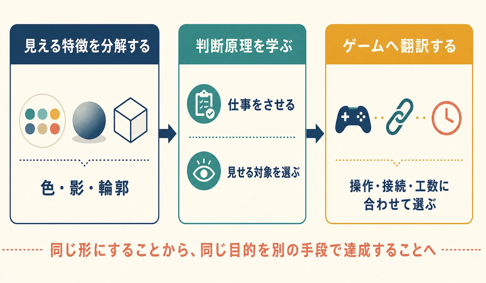
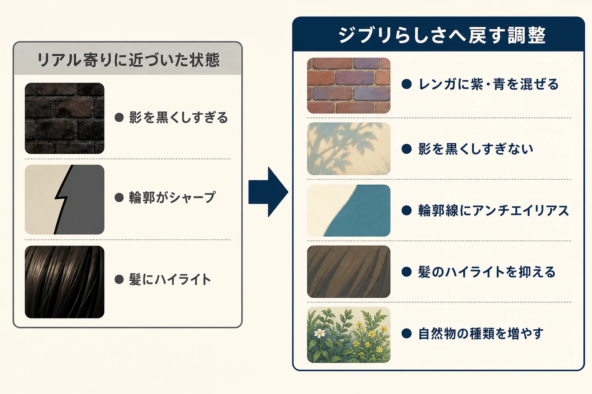
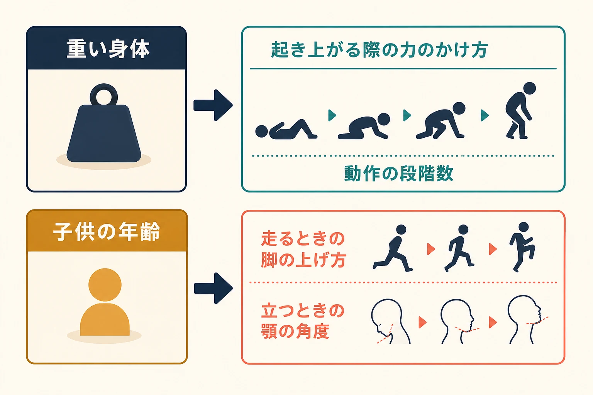
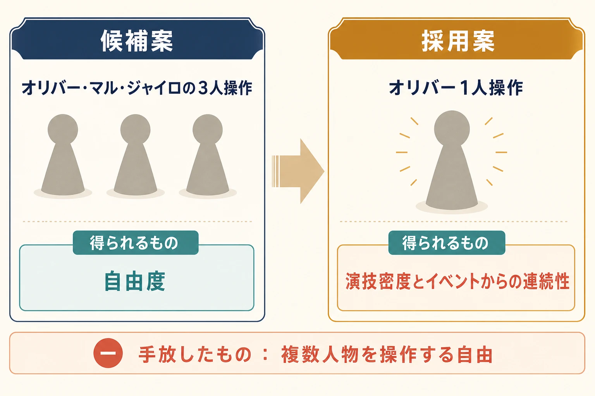

# 『二ノ国 白き聖灰の女王』は「ジブリらしさ」をどうゲームへ翻訳したか
## 絵柄を似せる模倣から、演出判断を自分たちで下す設計へ

## はじめに

『二ノ国 白き聖灰の女王』は、レベルファイブが制作・発売し、スタジオジブリがアニメーション作画、久石譲氏が音楽を担当したPlayStation 3用RPGである。2011年11月17日に8,800円（税込）で発売された。[[1](#ref-1)]

この座組を見れば、画面をジブリ作品に似せることが開発の中心課題だったように思える。しかし、完成した画面の色や輪郭だけを観察しても、共同制作から得られたものの半分しか見えない。レベルファイブの本村健チーフディレクターが振り返った核心は、百瀬義行監督から教わった「キャラクターに仕事をさせる」という言葉にある。会話中の人物を棒立ちにせず、片付けや料理をしながら話させる。重さや年齢を台詞で説明せず、起き上がり方や立ち姿へ変換する。そこには、絵柄より上流にある演出判断がある。[[2](#ref-2)]

本作の開発は、外部クリエイターの作風をそのまま写す工程ではなかった。まず見える特徴を分解して再現し、次に「何を画面へ出し、何を省くか」という判断原理を学び、最後にゲームの操作と制作条件へ合う形へ翻訳した。本稿では、この三段階を若手プランナーが企画と監修へ持ち帰れる設計判断として読み解く。

***

## 1. DS版とPS3版は、異なる役割を持つ二つの入口だった

ニンテンドーDS用『二ノ国 漆黒の魔導士』とPS3用『二ノ国 白き聖灰の女王』は、発売こそ約1年ずれたが、開発時期は重なっていた。レベルファイブは制作発表の時点で、二作を同じ軸の物語を持ちながら、データ、仕様、物語の展開まで異なる作品として説明している。[[3](#ref-3)]

日野晃博氏が示した役割分担は明快である。DS版は、より多くの人へ届ける入口である。PS3版は、スタジオジブリのアニメーションと久石氏の音楽を、映画と同程度の品質で届ける入口である。片方を遊ばなければ理解できない構造ではなく、どちらか一作でも成立し、両方を遊べば違いも楽しめる商品を目指した。[[2](#ref-2)]

ここで先に決められたのは、ハードごとの機能一覧ではなく、各版が誰へ何を届けるかである。同じ素材を高解像度化するだけなら、PS3版はDS版の豪華版にとどまる。入口の役割を分けたからこそ、DS版では携帯機らしい手軽さや2画面、タッチペンを生かし、PS3版ではアニメーションと音楽の素材を最大限に生かすという別々の優先順位を置けた。

プランナーが複数プラットフォームを扱うときも、最初の問いは「何を共通化できるか」だけでは足りない。「この版は、誰に、どの価値を最も強く届けるのか」を先に定める必要がある。共通化は制作効率を上げるが、入口の役割まで共通化すると、どのハードでも理由の薄い仕様が残りやすい。

***

## 2. 色と陰影は、似せるための必要条件だった

本村氏がPS3版で最初に取り組んだのは、「ジブリの絵をCGで再現するための絵作り」である。当初は、CGへ置き換えるとジブリらしい画面にならない時期があり、話し合いと試行錯誤が続いた。[[2](#ref-2)]

問題は、単純な色指定では解けなかった。レンガなら茶色一色で塗るのではなく、紫や青を混ぜる。画面を綺麗にしようとして『白騎士物語』のようなリアル寄りの質感へ近づいたときは、ライティングを見直し、影を黒くしすぎないようにする。髪のハイライトを抑え、輪郭線にはアンチエイリアスをかけて柔らかくする。自然物の種類を増やし、キャラクターの線と質感は描き込みすぎない。個々の変更は小さくても、すべてが「3Dで作った画面を2Dアニメーションとして読ませる」という同じ目的を向いている。[[2](#ref-2)]

制作環境にも判断基準を置いた。デザイナーの机の周囲にはジブリの美術設定を貼り、アニメーションを常時再生するモニターも用意したという。これは参考画像を一度配布して終える方法ではない。迷った瞬間に原典へ戻り、作ったものとの差を毎日見比べられる状態を作る方法である。知識を文章だけで共有する前に、チームの観察精度をそろえている。

ただし、色、影、線を合わせれば「ジブリらしさ」が完成するわけではない。本村氏自身も、絵だけでなく思想や内容によって成立するものであり、いくつかの特徴だけで定義できないと答えている。[[2](#ref-2)] 色と陰影は画面へ入るための必要条件である。その画面の中で人物がどう生き、カメラが何を選ぶかは、別の判断層にある。

若手プランナーが外部作品の作風を参照するときは、「もっとそれらしく」という感想を、観察可能な差へ分ける必要がある。色相、影の暗さ、線の量、材質の情報量、自然物の種類、カメラの動かし方まで分ければ、レビューは修正可能な指示になる。一方で、そのチェック項目を埋めること自体を目的にすると、見た目の似た別物ができる。表層の再現には、その表現が何を見せるために選ばれたかという問いを組み合わせるべきである。

***

## 3. 「キャラクターに仕事をさせる」が、演出判断を言葉にした

百瀬監督がレベルファイブへ渡した言葉のうち、本村氏の印象に残ったのが「キャラクターに仕事をさせる」である。会話のために人物を立たせ、台詞に合わせて口と手だけを動かすのではない。『二ノ国』冒頭では、オリバーが荷物を片付けながら話し、母親は料理をしながら応じる。[[2](#ref-2)]

仕事を持つ人物は、台詞以外の情報を画面へ出せる。何をしていた人物なのか、相手とどの距離で暮らしているのか、会話へどれほど注意を向けているのかが、手元と姿勢から伝わる。画面内の時間も止まらない。会話を進める機能と、生活が続いている感触を、同じ動作で担える。

ここで重要なのは、棒立ちを避けるためにモーションを増やすことではない。意味のない身振りを足せば、人物は動いていても仕事はしていない。「この場面へ入る前から何をしていたか」「話しながら続けられる行為は何か」「その行為が関係性をどう見せるか」を決める必要がある。プランナーがイベント仕様へ書くべきなのは、腕を何度動かすかより、人物がその場所で達成しようとしている小さな目的である。

この判断原理は、食事シーンへの指導でさらに明確になる。開発側の初稿は、ベーコンや卵を食べる口元を丁寧に見せていた。制作できたことへの手応えはあったが、百瀬監督は、食べる芝居は難しいため口元を無理に映さず、咀嚼している雰囲気があればよいと指導した。そのとおりカメラで見せる範囲を変えると、食事の感触が成立したという。[[2](#ref-2)]

これは品質を下げるための省略ではない。観客に伝えるべきものを「精密な口の動き」から「人物が食事をしている状況」へ戻し、難しい箇所を正面から描くことと、場面の目的を達成することを分けた判断である。技術的に作れるものほど、見せたくなる。しかし、作業量は画面へ出す理由にならない。演出では、最も手間をかけた箇所ではなく、観客が受け取るべき情報へカメラを向ける必要がある。

百瀬監督の指導が効いたのは、完成カットを直しただけでなく、判断を短い言葉と具体例で渡したからである。「仕事をさせる」「口を映す理由がない」という言葉は、別の場面でも使える。外部監修の成果は、納品物が承認されることだけではない。チームが次のカットで、自分たちから同じ問いを立てられる状態を作ることである。

***

## 4. 重さと年齢を動きへ変換する

百瀬監督はアニメーションパートの監督に加え、本村氏が「3Dイベント監督」と表現する立場でも制作へ参加した。福岡を訪れ、数日間の合宿のような形で3Dイベントを確認し、モーションキャプチャーでは役者の演技指導まで担当した。収録した動きをそのまま使うのではなく、後からアニメーションらしく手を入れる前提でありながら、その入口となる実演から方向を定めたのである。[[2](#ref-2)]

カウラ女王が起き上がる場面では、普通に立ち上がる芝居では身体の重さが伝わらない。百瀬監督は、これほど重い人物なら起き上がるだけでも一苦労するはずだと伝え、役者に大きな動作を求めた。オリバーには、子供ならそのように足を上げて走らない、もっと顎を引けば子供らしく見えると指導した。[[2](#ref-2)]

「重そうに」「子供らしく」という形容詞だけでは、受け手ごとに解釈が変わる。百瀬監督の指導は、設定を身体の課題へ変えている。重い身体なら、起き上がるためにどこへ力をかけ、何段階の動作が要るか。子供の身体なら、走るときの脚や立つときの顎がどう見えるか。設定資料に書かれた属性を、観察できる動詞と姿勢へ落としている。

モーションを発注するプランナーも、性格や年齢のラベルだけを渡して終えてはならない。その人物にとって、立つ、運ぶ、振り向く、待つといった日常動作がどれほど容易なのかを考える。重さ、年齢、疲労、立場は、台詞で説明する前に、動作の準備、速度、重心、視線へ変換できる。動きが設定を語れば、台詞は別の情報を担えるようになる。

一方、PS3版の音声ディレクションは、ほとんどを日野氏が担当した。シズク役の古田新太氏には、伝える内容を示したうえで、関西弁の語尾などを本人へ任せることもあったという。[[2](#ref-2)] 百瀬監督から映像と動きの判断を学ぶことと、作品全体の演出判断を外部へ委ねることは同じではない。レベルファイブ側も、実際に声へ出したときの言いやすさや役者の言葉へ合わせ、現場で台詞を調整していた。共同制作では、誰の手法を学ぶかと、最終的に誰が媒体へ合わせて決めるかの両方を設計する必要がある。

***

## 5. ゲームとして成立させるため、操作キャラクターを一人に絞った

共同制作でアニメーションの文法を学んでも、すべてを映像作品と同じ方法では作れない。ゲームには、プレイヤーが入力した直後から画面を動かす時間がある。PS3版は、イベントからリアルタイム操作へ違和感なくつなぐことを重視し、イベント用と操作中で異なるライティングも、切り替わりが目立たないよう調整していた。[[2](#ref-2)]

この接続を守るために、レベルファイブは操作キャラクターをオリバー一人へ絞った。当初はマルやジャイロも操作可能にする案があったが、誰を操作しているかが変わると、イベントとのつながりを保ちにくくなる。三人分へ制作のこだわりが分散する問題もあった。本村氏は、結果としてオリバーのモーションへ集中できたため、この判断は間違っていなかったと振り返っている。[[2](#ref-2)]

操作対象が多いことは、仕様表では価値として数えやすい。選べる人物が三人から一人になれば、機能を削ったようにも見える。しかし、本作が優先した価値は、イベントで見ていたオリバーを、そのまま自分の手で動かし始められる連続性だった。操作人数を増やして各人物の自由度を取る代わりに、主人公の演技密度と場面の接続を取ったのである。

この判断は、ジブリ側の文法を退けた例ではない。アニメーションの中を歩くというPS3版の目標を、ゲームの入力へ接続するための翻訳である。映像作品なら、編集によって注目する人物を切り替えられる。ゲームでは、カメラがイベントから操作へ戻る瞬間に、プレイヤーの入力主体を確定しなければならない。同じ体験目的を守るため、媒体固有の制約に合わせて手段を変えている。

外部作品の手法を取り入れる企画では、似せる項目だけでなく、持ち込めない項目を早く見つけることが重要である。そのとき「原典どおりにできない」で議論を止めず、原典の手法が何を達成していたかへ戻る。目的が分かれば、ゲームでは操作対象、カメラ、遷移、UI、工数配分といった別の手段から選び直せる。

***

## 6. 若手プランナーが持ち帰る、模倣と翻訳の三つの判断

### 6-1. 参考作品を、見た目と判断原理に分ける

色、影、線、材質、カメラは、比較して修正しやすい。まずは見える差を分解し、チームが同じ原典を観察できる環境を作る。そのうえで、「なぜこの影なのか」「なぜここでカメラを動かさないのか」「なぜ人物に作業を持たせるのか」を問う。見た目の規則だけを採取せず、その規則が守る情報まで言葉にする必要がある。

### 6-2. 監修コメントを、次の場面でも使える問いへ変える

食事シーンを直して完了とせず、「その対象を映す理由はあるか」という問いを残す。棒立ちを直して完了とせず、「この人物は会話以外に何をしようとしているか」という問いを残す。個別の赤入れから再利用可能な判断基準を抽出できれば、監修者がいない場面でもチームの精度を上げられる。

### 6-3. 原典と同じ手段より、同じ目的を優先する

映像の文法をゲームへ移すと、操作、状態遷移、カメラの自由、制作量と衝突する。そこで形を守るか捨てるかの二択にしない。元の手法が生んでいた価値を特定し、ゲーム側でその価値を保てる別の仕様を探す。オリバー一人へ操作を絞った判断は、選択肢を減らしてでも、演技の密度とイベントから操作への連続性を守る選択だった。

## おわりに

『二ノ国 白き聖灰の女王』が実現した「ジブリらしさ」は、単一のシェーダーや配色表から生まれたものではない。紫や青を混ぜたレンガ、黒くしすぎない影、柔らかな輪郭は、画面を近づけるために欠かせなかった。その先で効いたのは、人物へ仕事を持たせ、見せる理由のない口元からカメラを外し、重さや年齢を動作へ変える判断だった。

そしてレベルファイブは、その判断を無条件に持ち込んだわけでもない。プレイヤーが操作するゲームとして場面をつなぐため、操作対象をオリバーに絞り、限られた制作期間の集中先を選んだ。優れた模倣は、表面を正確に写すところから始まる。優れた翻訳は、原典が達成した目的を理解し、媒体が変わっても同じ価値へ届く手段を選び直す。プランナーの仕事は、その境界に理由を与えることである。

## References

1. [株式会社レベルファイブ「PlayStation®3ソフト『二ノ国 白き聖灰の女王』2011年11月17日（木）発売決定！」][1] - 発売日、価格、対応機種、制作・発売元、スタジオジブリと久石譲氏の担当。

2. [4Gamer.net「【PR】『二ノ国 白き聖灰の女王』に込められた思い，そしてスタジオジブリから学んだこと。レベルファイブの日野晃博社長と本村 健チーフディレクターに聞く」][2] - 日野晃博氏と本村健氏への直接取材。DS版とPS3版の役割分担、CG表現、百瀬義行監督の演出・演技指導、操作キャラクターを絞った判断。

3. [株式会社レベルファイブ「『二ノ国』制作発表会のご報告」][3] - DS版とPS3版を、同じ軸の物語を持ちながらデータ、仕様、物語展開の異なる作品として制作した方針。

[1]: https://www.level5.co.jp/news/20110825/popup-1.html
[2]: https://www.4gamer.net/games/114/G011461/20111207049/
[3]: https://www.level5.co.jp/news/20100624/popup.html

----

この文書は、Perplexity、Claude、OpenAI Codex の3つのAIの支援を受けて著述されたものです。引用画像を除き、MIT License にて提供されています。
