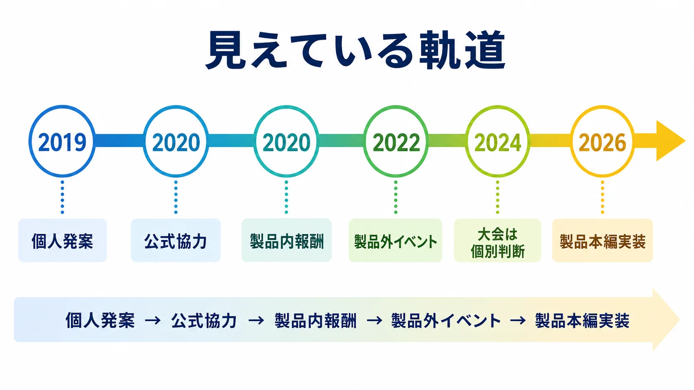
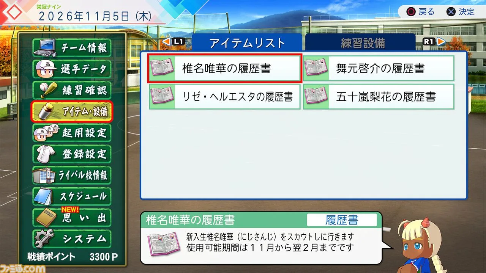
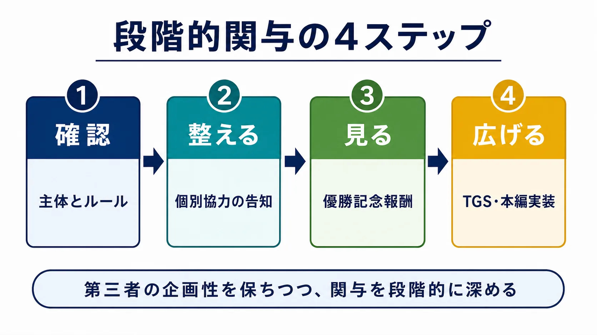

# にじさんじ甲子園――個人発の大会に、パブリッシャーが関与を深めた軌跡

「にじさんじ甲子園」は、VTuber（アバターを用いて配信する活動者）たちが高校野球の監督となり、育てたチームを戦わせる配信企画である。

その規模は、仲間内のゲーム大会という言葉では収まらない。2025年大会について、YouTubeの公開データを収集するPLAYBOARDを参照したKAI-YOUは、本戦初日の最大同時接続者数を23万2,849人、決勝日の配信を22万6,106人と報じている。これは外部サービスによる集計値でありYouTubeや主催者の公式発表ではないが、20万人規模が同時に見守る企画であることは分かる。[[1](#ref-1)]

さらにANYCOLORの2023年4月期第3四半期決算説明資料は、2022年大会の3配信について、最大同時視聴者数をそれぞれ31万人超、18万人超、20万人超と掲載した。[[2](#ref-2)]

この規模の企画でありながら、にじさんじ甲子園は所属VTuberの個人発案から始まっている。ここで重要なのは、その個人発案の企画に対してパブリッシャーがいつ、どの段階から関わったかである。公開資料から確認できる2020年の初大会は、本戦開始時点ですでに「『パワプロ2020』公式協力の元」と告知されていた。[[3](#ref-3)] つまり本件は、無関係のファン活動が黙認され、人気が出てから事後的に公認されたという事例ではない。むしろ実務上の面白さは、通常の動画投稿ガイドラインだけでは扱えない大規模企画に対して、パブリッシャーが個別協力、優勝記念報酬、公式イベントでの展開、製品本編への実装と、関係を段階的に広げていった点にある。

配信・二次創作をめぐる一般的な法的構造は別記事で扱っているため、本稿では繰り返さない。ここでは、第三者が多数の参加者を集める大会を、パブリッシャーがどう評価し、どこまで関与するかに絞る。

***

## にじさんじという大規模VTuberグループ

にじさんじは、ANYCOLOR株式会社が運営するVTuber／バーチャルライバーグループである。ANYCOLORは公式サイトで、にじさんじプロジェクトを多種多様なインフルエンサーが所属するVTuber／バーチャルライバーグループと説明し、イベント、グッズ・デジタルコンテンツ、楽曲制作などを通じて次世代のエンタメを加速させることを目的に掲げている。[[4](#ref-4)]

VTuberに詳しくない読者には、ここを「一人の人気配信者」ではなく、多数の配信者を抱えるタレント事務所／IP群として捉えるほうが分かりやすい。所属者は「ライバー」と呼ばれ、YouTubeなどでゲーム実況、雑談、歌、企画番組、ライブイベント、企業タイアップなどを行う。ANYCOLORのサービス説明では約150名の所属ライバーが活動するとされ、2026年7月5日時点の公式タレント一覧では、国内の「にじさんじ」枠だけで168名、NIJISANJI ENが28名、VirtuaRealが45名掲載されている。[[4](#ref-4)][[5](#ref-5)]

特に重要なのは、にじさんじが男女混合で、人数規模の大きいグループだという点である。女性だけ、男性だけ、少人数ユニットだけで大会を作るのとは違い、学校、監督、選手、応援席のような役割を、多数のライバーへ割り振れる。にじさんじ甲子園のドラフトが盛り上がるのは、単に有名配信者がゲームをするからではない。普段は別々の文脈で活動しているライバーが、学校という一時的なチームへ再編成され、ファンが「自分の推しがどこに指名されるか」を見守れるからである。

***

## 3年間で育つチームと物語

「栄冠ナイン」は、「パワフルプロ野球」シリーズに収録されている高校野球の育成シミュレーションである。プレイヤーは選手を直接動かし続けるのではなく、監督として練習を指示し、試合で采配する。部員は3年で卒業し、毎年新入生が入ってくる。通常のモードは、その世代交代を繰り返しながら長く遊べる設計だ。[[6](#ref-6)]

にじさんじ甲子園では、この長期モードをイベント用に切り出す。

1. 監督役のVTuberを決める。
2. ドラフト会議で、ほかのVTuberを自校の選手として指名する。
3. 各監督が「栄冠ナイン」をゲーム内の3年間だけ進める。
4. 育成したチームデータを持ち寄り、本戦で対戦させる。

2025年大会では10人の監督が参加し、指名したライバーをモデルにした選手を3年間育成した。[[1](#ref-1)] 本人がゲーム内で野球を操作するとは限らない。名前、容姿、得意分野、試合で起きた出来事が重なり、配信上の「その人らしさ」が選手へ投影されていく。

この変換が重要である。ゲームを知らない視聴者でも、応援しているVTuberが指名された瞬間から、自分と大会の接点を持てる。監督だけを追っていた視聴者は、同じ学校に指名された別のVTuberを知る。主催の舞元啓介氏も、企画を通じて知らなかったライバーを知ってもらい、参加者全員に見せ場を作ることを重視していると語っている。[[7](#ref-7)]

***

## 参加と観戦が同じ仕組みの上にある

対戦ゲームの大会は、操作技量を理解しているほど細かな攻防を楽しみやすい。にじさんじ甲子園は、別の入口を多く持っている。

- ドラフトで誰が誰を指名するかを見る。
- 育成配信で、選手の成長や偶発的な出来事を追う。
- 監督が限られた時間と戦力をどう配分するかを見る。
- 本戦で、自分が見守ってきたチームの結果を受け止める。
- 指名されたVTuber同士の反応や、試合後の掛け合いを楽しむ。

つまり、本戦だけが商品ではない。ドラフト、各校の育成配信、本戦、エキシビションまでが一つの長い観戦導線になっている。

ここで「3年」という制限が効く。通常の栄冠ナインは、世代交代を続ければ長期間育成できる。大会では全監督のプレイ期間をそろえなければ、育成量を比較しにくい。期間を3年に区切ると、最初に入った選手が卒業する夏までにチームを仕上げる、という分かりやすい締切が生まれる。

ただし、条件が同じでも結果は同じにならない。入部選手、成長、試合展開には偶発性がある。監督は、完全には制御できない素材に意味を与え、限られた手数で判断する。この **制御できる戦略と、制御できない物語** の混在が、育成配信を観戦コンテンツに変える。

***

## 起源は個人企画、初年度の本戦は公式協力

企画の母体は、個人勢VTuberの天開司氏が2019年に開催した「VTuber甲子園」である。2020年、にじさんじ所属の舞元啓介氏がその形式を引き継ぎ、天開氏とともに「にじさんじ甲子園」を主催した。両氏は後年のインタビューでも、天開氏の企画を舞元氏へ託したこと、舞元氏がにじさんじに合う要素を加えたことを説明している。[[8](#ref-8)]

2019年の前身企画も、無許諾で強行されたわけではない。天開氏は2023年のインタビューで、初回の「VTuber甲子園」について「あの時もちゃんと許可を頂いてやった」と振り返っている。[[9](#ref-9)] ただし、このインタビューでは直前にKONAMIとの現在の関係、続けてREALITYによる初回への協力が話題になっており、「許可」がどちらを指すのかは発言だけからは特定できない。

企画の発案と前面の運営を所属VTuberが担ったことと、所属会社やゲーム会社が関与していなかったことは同義ではない。2020年8月14日のにじさんじ公式告知は、初大会の本戦を「『パワプロ2020』公式協力の元」と明記している。同じ告知は、7月26日のドラフト配信が最大同時接続約10万6,000人を記録したともしている。[[3](#ref-3)] つまり初年度から、個人発案の企画と企業の協力が併存していた。

***

## 「ガイドラインの対象外」は「禁止」でも「黙認」でもない

現在の『パワフルプロ野球2024-2025』動画投稿ガイドラインは、条件を守った個人の動画投稿について、KONAMIへの個別連絡を不要としている。その一方で、次の行為を明確に別扱いにする。

> 本ゲームを使用したゲーム大会の実施（例：個人間の対戦にとどまらず多数の参加者を募る大会の開催、特定のサービスに対する集客や営利を目的としたイベントの開催等）は、本ガイドラインの対象外です。

また、ガイドラインの対象者は個人であり、日本に所在する法人・その他の団体に所属する利用者には、利用申し込みフォームからの相談を案内している。[[10](#ref-10)]

新人プランナーが誤解しやすいのは、ここで「対象外」を「禁止」と読み替えることだ。対象外とは、この公開文書による一律の許諾条件だけでは処理しないという意味である。個別相談や別契約の余地まで否定する言葉ではない。反対に、対象外だから自由に開催できるという意味でもない。

もう一つ注意がいる。現行ガイドラインは2024年7月に制定された文書である。2020年当時の権利処理を、この文書から遡って推定することはできない。公開資料で言えるのは、2020年の本戦には公式協力の表示があり、現行ガイドラインでは大会が通常投稿と分けられているということまでだ。[[3](#ref-3)][[10](#ref-10)]

整理すると、見えている軌道は次のようになる。

| 時点 | 公開資料で確認できる関係 | 実務上の意味 |
|---|---|---|
| 2019年 | 天開司氏による前身「VTuber甲子園」。本人は後年、許可を得て開催したと説明 | 個人発案でフォーマットを検証 |
| 2020年夏 | 舞元啓介氏・天開司氏が主催。にじさんじ公式告知に「公式協力」 | 初回から個別協力が可視化 |
| 2020年11月 | 優勝記念報酬を『パワプロ2020』へ追加 | 大会結果を製品内コンテンツへ接続 |
| 2022年 | 優勝者の楽曲を『パワプロ2022』へ追加。KONAMIのTGSステージでエキシビションを実施 | 協力を継続し、接点を製品外イベントにも拡張 |
| 2024年以降 | 現行の動画投稿ガイドラインでは大会を通常投稿と分離 | 大規模企画を個別判断する境界を明文化 |
| 2026年 | 『パワプロ2026-2027』が公式の「3年モード」を搭載。にじさんじライバー4名が栄冠ナイン本編にコラボキャラクターとして収録 | コミュニティの遊び方と製品機能が接近し、大会に深く関わる人物が製品本編へ登場 |

***

## 製品内へ戻ってきた大会の成果

「公式が関与した」という評価は、ロゴの掲載だけで判断すべきではない。にじさんじ甲子園では、製品側に残る具体物を確認できる。

2020年11月26日の『eBASEBALLパワフルプロ野球2020』アップデートでは、「にじさんじ甲子園優勝記念報酬」として、優勝監督である椎名唯華氏のパワター、ボイス、選手・チーム名音声、登場シーンつき打撃フォームが追加された。パワターとは、シリーズ独自のデフォルメされた選手容姿である。[[11](#ref-11)]

2021年大会では、優勝賞品として加賀美ハヤト氏が歌う「Flying High」が用意された。KONAMIは後に、この楽曲がゲーム内BGMとして登場したことを公式サイトで案内している。[[12](#ref-12)] 『パワプロ2022』のアップデート情報にも、「にじさんじ甲子園2021優勝者の楽曲をBGM設定に追加」と記録されている。[[13](#ref-13)]

さらにKONAMIは、東京ゲームショウ2022の自社ステージで、『パワプロ2022』を使った「にじさんじ甲子園」のエキシビションマッチを実施すると告知した。[[14](#ref-14)]

2026年6月11日発売の『パワフルプロ野球2026-2027』では、接点がさらに一段深くなった。舞元啓介氏・椎名唯華氏・リゼ・ヘルエスタ氏・五十嵐梨花氏の4名が、「栄冠ナイン」本編にコラボキャラクターとして収録されたのである。[[15](#ref-15)] パワプロショップで専用の履歴書を入手し、スカウトで指名すれば、栄冠ナインだけでなく対戦モードやペナントモードでも起用できる。舞元氏はにじさんじ甲子園の企画者であり、椎名氏、リゼ氏、五十嵐氏はそれぞれ2020年、2022年、2024年大会の優勝監督である。[[11](#ref-11)][[16](#ref-16)][[17](#ref-17)] 4名はいずれも大会との関係が深いが、この実装は「歴代優勝者への報酬」ではなく、「にじさんじコラボ」として告知されている。

出典：[ファミ通.com「『パワプロ2026』栄冠ナイン にじさんじコラボで人気Vが出演決定！」](https://www.famitsu.com/article/202605/73313) 掲載画像をWebP化。

この4点は、単に配信を削除しなかったという状態を超えている。

- 大会の結果が製品内報酬になる。
- 優勝賞品が次の製品へ実装される。
- パブリッシャー自身の展示会ステージで企画名を用いる。
- 主催者・優勝監督本人が、製品本編のキャラクターとして実装される。

一方で、これらを理由に、企画の運営主体がKONAMIへ移ったと考える必要はない。第三者の企画性を保ったまま、パブリッシャーが接点を増やす関係も成立する。ここに、全面的な内製イベントとは違う価値がある。

***

## 「3年縛り」は、どこまで製品へ入ったのか

にじさんじ甲子園の3年縛りは、イベント運営上よくできたルールである。終了時点を統一し、育成配信の総量を抑え、全監督に同じ締切を与える。長期育成モードを、夏の定期イベントへ変換するための編集でもある。

2026年発売の『パワフルプロ野球2026-2027』には、通常モードとは別に、3年限定で栄冠ナインを遊ぶ公式の「3年モード」が搭載された。3年目の夏大会終了後は、通常モードとして継続できる。[[18](#ref-18)]

企画のルールと製品機能が似ていることは明らかである。ただし、KONAMIのモード紹介は、にじさんじ甲子園を開発理由として挙げていない。したがって、「にじさんじ甲子園の3年縛りを逆輸入した」と因果関係まで断定することはできない。

実務では、この区別が大切だ。ユーザー発の遊びと同じ機能が後から実装されても、発想の起点、開発の意思決定、権利関係は外からは分からない。確認できるのは、第三者企画で長年使われた遊び方と、公式製品の機能が2026年に一致したことまでである。

一方、同じ2026-2027年版で追加されたにじさんじキャラクターの本編収録は、ルールの近似ではなく出演者そのものの実装であり、性質が異なる。紹介記事は「にじさんじ甲子園」に触れた上で4名の登場を発表しており、ルールの逆輸入をめぐる推測よりも直接的な接点だと言える。ただし、企画名は「にじさんじコラボ」であり、「にじさんじ甲子園コラボ」とは表記されていない。[[15](#ref-15)]

***

## なぜ「栄冠ナイン」は観戦企画へ転用しやすかったのか

にじさんじ甲子園の成功を「人気VTuberを集めたから」で終えると、プランナーが持ち帰れるものは少ない。素材になったゲームモード側にも、企画へ転用しやすい性質がある。

### 1. 操作の巧さだけで勝敗が決まらない

栄冠ナインの中心は、練習指示、選手起用、試合中の采配である。野球アクションの反射神経だけを競う形式ではない。ゲームに不慣れな監督にも、育成方針や意思決定で見せ場を作れる。

ただし、偶然だけのゲームでもない。限られた期間で、誰をどこに置き、どの能力を伸ばし、どの試合で勝負するかを選ぶ。視聴者は結果だけでなく、決断に至る過程を語れる。

### 2. 失敗が物語になる

対戦競技では、ミスが実力不足として消費されやすい。育成シミュレーションでは、期待した選手が伸びない、思わぬ選手が活躍する、強豪校に敗れる、といった不確実性が次の配信を見る理由になる。

失敗をなくす必要はない。誰の判断で何が起きたかが見え、次の選択へつながれば、失敗も連続した物語の一部になる。

### 3. キャラクターを大量に参加させられる

2020年は6校に各16～18人、2024年は8校に各20～22人が所属した。[[7](#ref-7)] 監督として配信する人数より、はるかに多くのVTuberを選手として企画へ参加させられる。

これはコミュニティ企画にとって強い。全員に同じ作業量を求めず、名前を指名される、育成を応援する、試合を同時視聴するなど、濃淡の違う参加方法を用意できるからだ。

### 4. 観客が応援先を選びやすい

学校、監督、ドラフト指名選手という単位があるため、初見の視聴者も「知っている人がいる学校」を入口にできる。視聴を続けるうちに、学校全体の成長へ愛着が移る。

ここで働くのは、厳密な競技理解だけではない。視聴者が普段から知る配信者への一方向的な親近感、いわゆるパラソーシャルな関係も、応援の初速になる。ただし、それだけに依存すると人気の偏りが固定される。ドラフト、出番保証、エキシビションは、知られていない参加者へ視線を分配する運用でもある。

***

## e-sportsとは、評価する面白さが違う

競技性の高いe-sportsでは、対等な条件、操作技量、ルールの一貫性、判定の透明性が中心になる。もちろん、にじさんじ甲子園にもルール整備は必要である。しかし、観客が評価している対象は勝敗だけではない。

| 競技性の高い大会で中心になりやすいもの | にじさんじ甲子園で中心になりやすいもの |
|---|---|
| 操作技量の比較 | 育成判断と偶発的な物語 |
| 同一試合内の駆け引き | ドラフトから本戦までの蓄積 |
| 選手本人のプレイ | 監督と、モデルになった選手への感情移入 |
| 勝者の強さの証明 | 多数の参加者に見せ場を配ること |

これは、どちらが上という話ではない。大会が約束する価値が違う。

勝敗の厳密さを強くすれば、競技として説明しやすくなる。その一方で、初心者やライトな参加者が入りにくくなることもある。物語性を強くすれば入口は増えるが、ルールの曖昧さが不公平感へ変わる危険もある。企画者は、何を公平にそろえ、何を偶然として楽しんでもらうかを決めなければならない。

***

## 同じ熱量は、ほかのゲーム大会にも広がっている

VTuberが主催し、多数の所属メンバーが参加する大会は、にじさんじ甲子園だけではない。

『マリオカート8 デラックス』を使う「マリオカートにじさんじ杯」は、2018年の初回から続き、2024年の第6回には84人が参加すると報じられた。[[19](#ref-19)] 『雀魂』を使う「新春！にじさんじ麻雀杯2024」には85人が参加し、優勝者へゲーム内の期間限定称号が贈られた。[[20](#ref-20)]

ゲームごとに競技性、運の比重、パブリッシャーとの関係は違う。それでも、配信者が企画の顔となり、参加者同士の関係性と長時間の観戦導線を作る形式には広がりがある。

***

## パブリッシャーは何を見て、関係を深めるか

包括ガイドラインの外にある第三者企画へ、即座に「公認」か「禁止」かの二択を迫ると、判断を誤りやすい。実務では、少なくとも次の軸を分けて見る必要がある。

### 権利と契約の範囲

動画投稿の包括ガイドラインで処理できるのか。大会、法人所属者、スポンサー表示、賞品、広告利用が加わるため、個別相談が必要なのか。まず入口を分類する。

### ブランド上の危険

ゲーム内容を誤認させないか。参加者への誹謗中傷や、実在選手・球団への不適切な表現が起きないか。事故が起きたときに、主催者が訂正や削除へ対応できるかを見る。

### 運営の再現性

一度だけ話題になったのか、毎年同じ品質で運営できるのか。ルール、進行、出演者調整、配信トラブル対応を、特定個人の無理だけで支えていないかも重要である。規模が増えるほど、成功そのものが運営リスクになる。

### 製品との相互利益

既存プレイヤー以外にゲームの魅力が伝わるか。通常なら長すぎる育成モードが、イベントの編集によって見やすくなるか。大会の結果を報酬やエキシビションへ接続したとき、双方のファンが納得できるかを考える。

### 関与したときの責任

ロゴ使用、賞品提供、告知協力、製品内実装、共同主催では、受け手が感じる「公式性」が違う。関与を深めるほど、ルール監修、問い合わせ、炎上時の説明など、パブリッシャー側の負担も増える。

だから、段階的な関与には合理性がある。

1. 企画の主体とルールを確認する。
2. 個別許諾や名称使用など、必要な範囲だけを整える。
3. 告知協力や賞品提供で反応を見る。
4. 継続運営が確認できたら、公式イベントや製品内要素へ接点を広げる。

これは万能の手順ではない。権利侵害、賭博性、差別的表現、安全上の問題など、早期対応が必要な企画もある。「しばらく放置すれば育つ」という話ではない。

重要なのは、公開ガイドラインの対象外にある活動を、直ちに敵対行為とみなさないことである。個別に確認できる窓口と、問題がなければ関係を深められる余地を残す。にじさんじ甲子園で公開資料から見えるのは、無関与の黙認ではない。前身企画では許可を得て開催したという主催者の証言があり、2020年の本戦では公式協力が明示された。その後、製品内報酬、自社ステージ、製品本編のキャラクター実装へと接点が段階的に広がっている。

***

## おわりに――成功したのは「放置」ではなく、境界を越える設計だった

にじさんじ甲子園は、競技ゲームの大会をそのまま大きくした企画ではない。長期育成モードを3年間へ切り、ドラフトで応援先を作り、多数のVTuberを選手として参加させた。勝敗だけでなく、育成中の判断、偶然、掛け合いを観戦価値へ変えた。

パブリッシャーとの関係も、「非公式だから黙認」「人気が出たから公認」という二段階では捉えにくい。前身企画は許可を得て開催したと主催者が説明し、にじさんじ甲子園の初年度本戦には公式協力があった。その後、優勝記念報酬、楽曲、東京ゲームショウでのエキシビション、そして2026年の本編キャラクター実装へと、接点は年々広がっていった。

プランナーが持ち帰るべきなのは、「黙認すれば成功する」という正解ではない。

**包括ガイドラインで許せる日常的な投稿と、個別判断すべき大会を分けること。第三者の企画性を壊さず、関与の強さを段階的に選べること。そして、うまく育った遊びを製品や公式イベントへ戻せる接続点を用意すること。**

その三つが、第三者による企画を危険か機会かの一語で片づけず、長く付き合うための判断材料になる。

## References

1. [「にじさんじ甲子園2025」本戦開催　22万人超が見守る決勝を制したのは？][1] - 2025年大会の参加監督、3年間の育成形式、PLAYBOARDに基づく最大同時接続者数を報じる。

2. [ANYCOLOR株式会社 2023年4月期第3四半期決算説明資料][2] - にじさんじ甲子園2022の概要と、3配信の最大同時視聴者数を掲載。

3. [2020年夏の大型企画『にじさんじ甲子園』いよいよ本戦へ！][3] - 初年度の本戦が「『パワプロ2020』公式協力の元」で行われたことと、ドラフト配信の最大同時接続約10.6万人を明記。

4. [にじさんじプロジェクト][4] - ANYCOLOR公式サイトによる説明。にじさんじを多種多様なインフルエンサーが所属するVTuber／バーチャルライバーグループとし、約150名の所属ライバーが活動すると説明。

5. [タレント一覧 ｜ にじさんじ][5] - 公式タレント一覧。2026年7月5日時点の掲載データでは、国内「にじさんじ」168名、NIJISANJI EN 28名、VirtuaReal 45名。

6. [『パワプロ2018』モード「栄冠ナイン」][6] - 監督として練習指示と采配を行い、部員が3年で卒業する通常モードの基本構造を説明。

7. [舞元啓介と天開司が明かす、夏の風物詩「にじさんじ甲子園」の“熱い”裏側][7] - 参加者へ見せ場を作る方針と、2020年・2024年の学校数および所属人数を紹介。

8. [同インタビュー｜舞元啓介とにじさんじだからこそ、ここまで大きくなった][8] - 2019年の「VTuber甲子園」を母体として舞元氏が企画を発展させた経緯を、両主催者が説明。

9. [「ドン勝生活」「Vtuber甲子園」「神域リーグ」……ヒットコンテンツを生み出し続ける天開司が積み上げた5年間とこれから][9] - 天開司氏が2019年の「VTuber甲子園」の起源と、初回も許可を得て開催したことを回想。

10. [『パワフルプロ野球2024-2025』動画およびスクリーンショット投稿ガイドライン][10] - 個人投稿は条件内で個別連絡不要とする一方、多数の参加者を募る大会を対象外と明記。

11. [『eBASEBALLパワフルプロ野球2020』11月26日 第5回アップデート][11] - 椎名唯華氏のパワター、ボイスなど、にじさんじ甲子園優勝記念報酬の追加を記録。

12. [『パワプロ2022』オフボーカル音源・ガイドライン公開][12] - にじさんじ甲子園2021の優勝賞品として加賀美ハヤト氏が歌った楽曲が、ゲーム内BGMになったことを案内。

13. [『eBASEBALLパワフルプロ野球2022』6月16日 第3回アップデート][13] - にじさんじ甲子園2021優勝者の楽曲をBGM設定へ追加したことを記録。

14. [「東京ゲームショウ2022」KONAMIの出展内容が決定][14] - KONAMIステージで「にじさんじ甲子園」のエキシビションマッチを実施すると告知。

15. [『パワプロ2026』栄冠ナイン にじさんじコラボで人気Vが出演決定！ 3年モードや投手兼DHの“大谷ルール”、自操作プレイなど新要素続々][15] - 舞元啓介・椎名唯華・リゼ・ヘルエスタ・五十嵐梨花の4名が「栄冠ナイン」本編にコラボキャラクターとして収録されたことを報じる。

16. [「にじさんじ甲子園2022」決勝リーグ 優勝は王立ヘルエスタ高校！][16] - リゼ・ヘルエスタ氏が率いる王立ヘルエスタ高校の2022年大会優勝を報じる。

17. [にじさんじ甲子園2024結果まとめ、五十嵐梨花の私立梨海高校が優勝][17] - 五十嵐梨花氏が率いる私立梨海高校の2024年大会優勝を報じる。

18. [『パワフルプロ野球2026-2027』モード「栄冠ナイン」][18] - 3年限定で遊び、3年目の夏大会後に通常モードへ継続できる「3年モード」を紹介。

19. [総勢84名のライバーが参加「第6回 マリオカートにじさんじ杯」][19] - ライバー主催の大規模なカジュアル大会が継続している例。

20. [「新春！にじさんじ麻雀杯2024」総勢80名を超えるライバーが参加][20] - 『雀魂』を使った85人規模の大会と、ゲーム内称号の賞品を紹介。

[1]: https://kai-you.net/article/93016
[2]: https://production-mkdd-news.s3.ap-northeast-1.amazonaws.com/urn%3Anewsml%3Atdnet.info%3A20230314530075/140120230314530075.pdf
[3]: https://www.nijisanji.jp/news/1348
[4]: https://www.anycolor.co.jp/service/nijisanji
[5]: https://www.nijisanji.jp/talents
[6]: https://www.konami.com/pawa/2018/mode/eikan
[7]: https://magazine.anycolor.co.jp/articles/1079048872#%E9%96%A2%E3%82%8F%E3%82%8B%E3%83%A9%E3%82%A4%E3%83%90%E3%83%BC%E3%81%99%E3%81%B9%E3%81%A6%E3%81%AB%E3%82%B9%E3%83%9D%E3%83%83%E3%83%88%E3%83%A9%E3%82%A4%E3%83%88%E3%82%92%E5%BD%93%E3%81%A6%E3%81%9F%E3%81%84
[8]: https://magazine.anycolor.co.jp/articles/1079048872#%E8%88%9E%E5%85%83%E5%95%93%E4%BB%8B%E3%81%A8%E3%81%AB%E3%81%98%E3%81%95%E3%82%93%E3%81%98%E3%81%A0%E3%81%8B%E3%82%89%E3%81%93%E3%81%9D%E3%81%93%E3%81%93%E3%81%BE%E3%81%A7%E5%A4%A7%E3%81%8D%E3%81%8F%E3%81%AA%E3%81%A3%E3%81%9f
[9]: https://realsound.jp/tech/2023/07/post-1381862_2.html
[10]: https://www.konami.com/pawa/2024-2025/guideline/
[11]: https://www.konami.com/pawa/2020/update/201126
[12]: https://www.konami.com/pawa/2022/topic/offvocal
[13]: https://www.konami.com/pawa/2022/update/220616
[14]: https://www.konami.com/games/corporate/ja/news/release/20220831/
[15]: https://www.famitsu.com/article/202605/73313
[16]: https://www.moguravr.com/nijisanji-koushien-2022-4-2/
[17]: https://www.moguravr.com/nijisanji-koshien-2024/
[18]: https://www.konami.com/pawa/2026-2027/mode/eikan
[19]: https://www.inside-games.jp/article/2024/04/23/154808.html
[20]: https://www.famitsu.com/news/202401/06330322.html

----

この文書は、Perplexity、Claude、OpenAI Codex の3つのAIの支援を受けて著述されたものです。引用画像を除き、MIT License にて提供されています。
